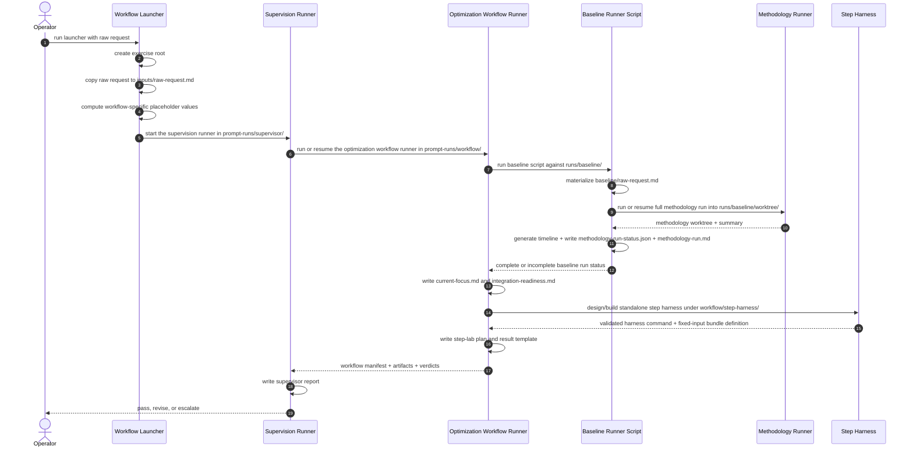

# Design: Methodology Optimization Execution Architecture

## 1. Purpose

This document explains, in plain terms, how the methodology optimization workflow is supposed to run end to end.

## 2. Architectural Summary

This section names the commands and long-running processes involved in one optimization campaign.

- **COMMAND: CMD-1** `Operator launch`
  - **SYNOPSIS:** One command started by a human from the repo root.
  - **INVOKES:** `Optimization campaign launcher`
    - **BECAUSE:** The operator starts the launcher command, and the launcher command is responsible for starting the long-running runner processes.

- **PROCESS: PROCESS-1** `Optimization campaign launcher`
  - **SYNOPSIS:** The script that creates the campaign directories, copies the request, passes workflow-specific placeholder values, and starts the supervision process.
  - **INVOKES:** `Supervision runner`
    - **BECAUSE:** Campaign setup and long-running supervision are separate jobs, so the launcher should hand control to the supervision process after setup is complete.
  - **USES:** `scripts/run_methodology_optimization_supervisor.py`
    - **BECAUSE:** The document should point to the concrete script that performs the setup steps it describes.
  - **WRITES:** `<exercise-root>/inputs/raw-request.md`
    - **BECAUSE:** The campaign needs one copied request file that stays stable for the rest of the run.

- **PROCESS: PROCESS-2** `Supervision runner`
  - **SYNOPSIS:** The `prompt-runner` process that starts, resumes, and judges the optimization workflow.
  - **INVOKES:** `Optimization workflow runner`
    - **BECAUSE:** Supervision decides whether to retry, resume, or pass, while the optimization workflow runner does the actual baseline and step-lab work.
  - **USES:** `PROMPT-MODULE: Supervision module`
    - **BECAUSE:** The supervision process is defined by one prompt module rather than by ad hoc shell logic.
    - **FILE:** `docs/prompts/PR-020-methodology-optimization-supervisor.md`
      - **SYNOPSIS:** Prompt-definition file for the supervision module as it exists today.
    - **PROMPT-PAIR:** `Review whether the optimization workflow file really needs editing`
      - **SYNOPSIS:** Pair that decides whether the optimization workflow file itself needs to be changed before another execution attempt.
      - **PROMPT:** `Generator`
        - **SYNOPSIS:** Reviews the latest failure evidence and writes the proposed supervisory action.
      - **PROMPT:** `Judge`
        - **SYNOPSIS:** Decides whether the evidence really shows a defect in the optimization workflow file, or whether the next step should just resume execution.
    - **PROMPT-PAIR:** `Run or resume the optimization workflow`
      - **SYNOPSIS:** Pair that executes the optimization workflow and decides whether the resulting workflow state is good enough to pass supervision.
      - **PROMPT:** `Generator`
        - **SYNOPSIS:** Starts or resumes `prompt-runner` on the optimization workflow module and records the resulting workflow state.
      - **PROMPT:** `Judge`
        - **SYNOPSIS:** Reads the resulting workflow manifest and artifacts, then either passes supervision or sends corrective feedback for another attempt.

- **PROCESS: PROCESS-3** `Optimization workflow runner`
  - **SYNOPSIS:** The `prompt-runner` process that performs the real optimization workflow: baseline run, planning notes, isolated-step harness, and step-lab planning.
  - **INVOKES:** `Methodology-runner`
    - **BECAUSE:** The full baseline run is a methodology-runner responsibility, so the optimization workflow runner must delegate that work instead of reimplementing it.
  - **INVOKES:** `Standalone step harness`
    - **BECAUSE:** Isolated phase replay is a harness responsibility, so the optimization workflow runner must call the harness instead of improvising replay logic itself.
  - **USES:** `PROMPT-MODULE: Optimization workflow module`
    - **BECAUSE:** The optimization workflow process is defined by one prompt module that sequences the four stages.
    - **FILE:** `docs/prompts/PR-019-methodology-optimization-workflow.md`
      - **SYNOPSIS:** Prompt-definition file for the optimization workflow module as it exists today.
    - **PROMPT-PAIR:** `Complete the trusted baseline run`
      - **SYNOPSIS:** Pair that runs the baseline stage and decides whether the workflow now has one accepted baseline run record.
      - **USES:** `PROMPT-MODULE: Baseline run module`
        - **BECAUSE:** The first workflow stage is baseline establishment, and the baseline run module owns that job.
        - **FILE:** `docs/prompts/PR-015-methodology-baseline-run.md`
          - **SYNOPSIS:** Prompt-definition file for the baseline run module.
      - **PROMPT:** `Generator`
        - **SYNOPSIS:** Runs the baseline run module, which in turn invokes the deterministic baseline script and records the resulting top-level workflow state.
        - **BECAUSE:** The optimization workflow needs a generator prompt that performs the baseline stage and surfaces its result at the workflow level.
      - **PROMPT:** `Judge`
        - **SYNOPSIS:** Checks whether the optimization workflow now has the baseline run's top-level status file, top-level note, summary, and timeline required to continue.
        - **BECAUSE:** The workflow must not move to planning until the baseline stage has produced the top-level outputs required by later stages.
    - **PROMPT-PAIR:** `Complete the planning preparation outputs`
      - **SYNOPSIS:** Pair that runs the planning-preparation stage and decides whether the workflow now has usable planning notes.
      - **USES:** `PROMPT-MODULE: Planning preparation module`
        - **BECAUSE:** The second workflow stage is planning preparation, and the planning preparation module owns that job.
        - **FILE:** `docs/prompts/PR-016-methodology-planning-preparation.md`
          - **SYNOPSIS:** Prompt-definition file for the planning preparation module.
      - **PROMPT:** `Generator`
        - **SYNOPSIS:** Runs the planning preparation module and records the resulting top-level workflow state.
        - **BECAUSE:** The optimization workflow needs a generator prompt that produces the planning outputs and surfaces their state at the workflow level.
      - **PROMPT:** `Judge`
        - **SYNOPSIS:** Checks whether the optimization workflow now has the planning notes required for the next stage.
        - **BECAUSE:** The workflow must not move to harness construction until the planning outputs exist and are usable.
    - **PROMPT-PAIR:** `Complete the standalone step harness outputs`
      - **SYNOPSIS:** Pair that runs the isolated-step harness stage and decides whether the workflow now has a usable replay harness.
      - **USES:** `PROMPT-MODULE: Standalone step harness module`
        - **BECAUSE:** The third workflow stage is isolated replay enablement, and the standalone step harness module owns that job.
        - **FILE:** `docs/prompts/PR-017-methodology-standalone-step-harness.md`
          - **SYNOPSIS:** Prompt-definition file for the standalone step harness module.
      - **PROMPT:** `Generator`
        - **SYNOPSIS:** Runs the standalone step harness module and records the resulting top-level workflow state.
        - **BECAUSE:** The optimization workflow needs a generator prompt that creates or validates the isolated replay harness and surfaces its result at the workflow level.
      - **PROMPT:** `Judge`
        - **SYNOPSIS:** Checks whether the optimization workflow now has the isolated replay outputs required for step-level optimization.
        - **BECAUSE:** The workflow must not start step-level optimization until isolated replay is actually available.
    - **PROMPT-PAIR:** `Complete the step-lab planning outputs`
      - **SYNOPSIS:** Pair that runs the step-lab planning stage and decides whether the workflow now has a usable experiment plan.
      - **USES:** `PROMPT-MODULE: Step-lab planning module`
        - **BECAUSE:** The fourth workflow stage is step-lab planning, and the step-lab planning module owns that job.
        - **FILE:** `docs/prompts/PR-018-methodology-step-lab-planning.md`
          - **SYNOPSIS:** Prompt-definition file for the step-lab planning module.
      - **PROMPT:** `Generator`
        - **SYNOPSIS:** Runs the step-lab planning module and records the resulting top-level workflow state.
        - **BECAUSE:** The optimization workflow needs a generator prompt that produces the experiment plan and surfaces its result at the workflow level.
      - **PROMPT:** `Judge`
        - **SYNOPSIS:** Checks whether the optimization workflow now has the experiment plan and result template required for later optimization work.
        - **BECAUSE:** The workflow must not claim readiness for later optimization work until the experiment plan and result template both exist.

- **PROCESS: PROCESS-4** `Methodology-runner`
  - **SYNOPSIS:** The `methodology-runner` process used to create the trusted baseline run.
  - **INVOKED-BY:** `Optimization workflow runner`
    - **BECAUSE:** The optimization workflow delegates full baseline execution to `methodology-runner`.

- **PROCESS: PROCESS-5** `Baseline runner script`
  - **SYNOPSIS:** A helper script that chooses fresh run vs resume for the baseline methodology run, generates the timeline report, and writes one top-level run status file and note.
  - **USES:** `scripts/run_methodology_baseline.py`
    - **BECAUSE:** This reference shows which concrete implementation owns the workflow-level baseline completion contract.
  - **INVOKED-BY:** `Optimization workflow runner`
    - **BECAUSE:** The optimization workflow delegates baseline orchestration to one deterministic script instead of spreading that logic across prompt prose.

- **PROCESS: PROCESS-6** `Standalone step harness`
  - **SYNOPSIS:** A helper script that clones the trusted baseline run's worktree, resets one phase, reruns only that phase, and captures comparable outputs.
  - **USES:** `scripts/run_methodology_step_harness.py`
    - **BECAUSE:** This reference shows which concrete harness implementation performs the isolated phase replay described above.
  - **INVOKED-BY:** `Optimization workflow runner`
    - **BECAUSE:** The optimization workflow delegates isolated phase replay to the harness script.

## 3. Filesystem Layout

This section defines the directories used by one optimization campaign.

- **ENTITY: ENTITY-1** `ExerciseRoot`
  - **SYNOPSIS:** The root directory for one optimization exercise.
  - **FIELD:** `path`
    - **SYNOPSIS:** `<project>/.prompt-runner/workflows/methodology-opt/<exercise-id>/`
    - **BECAUSE:** The optimization exercise needs one stable root that separates exercise state from generic prompt-runner run directories.
  - **FIELD:** `inputs_dir`
    - **SYNOPSIS:** `<exercise-root>/inputs/`
    - **BECAUSE:** The exercise needs a stable place for the copied raw request and any future fixed input bundle files.
  - **FIELD:** `prompt_runs_dir`
    - **SYNOPSIS:** `<exercise-root>/prompt-runs/`
    - **BECAUSE:** The supervision run and the optimization workflow run should live under one exercise-local prompt-run root so the whole campaign stays together on disk.
  - **FIELD:** `runs_dir`
    - **SYNOPSIS:** `<exercise-root>/runs/`
    - **BECAUSE:** The baseline methodology run and later variant runs should live under the same exercise root as the workflow control state.

- **ENTITY: ENTITY-2** `SupervisorRunDir`
  - **SYNOPSIS:** The run directory used by the supervisor prompt-runner process.
  - **FIELD:** `path`
    - **SYNOPSIS:** `<exercise-root>/prompt-runs/supervisor/`
    - **BECAUSE:** The supervisory run should have a fixed location known in advance to the workflow launcher.

- **ENTITY: ENTITY-3** `WorkflowRunDir`
  - **SYNOPSIS:** The run directory used by the optimization workflow runner.
  - **FIELD:** `path`
    - **SYNOPSIS:** `<exercise-root>/prompt-runs/workflow/`
    - **BECAUSE:** The optimization workflow needs a stable run-local location for its planning artifacts, baseline metadata, and harness state.

- **ENTITY: ENTITY-4** `BaselineRunDir`
  - **SYNOPSIS:** The run directory used for the designated baseline methodology run.
  - **FIELD:** `path`
    - **SYNOPSIS:** `<exercise-root>/runs/baseline/`
    - **BECAUSE:** The trusted baseline run should have a stable exercise-local directory of its own instead of living inside the workflow runner's prompt-runner state.

- **ENTITY: ENTITY-5** `StepHarnessRoot`
  - **SYNOPSIS:** Parent directory for isolated phase-replay worktrees.
  - **FIELD:** `path`
    - **SYNOPSIS:** `<workflow-run-dir>/step-harness/`
    - **BECAUSE:** Each standalone step replay should live under one predictable workflow-local root.

## 4. Sequence

This section shows how the runtime pieces interact during one launched campaign.

## 5. Implementation Decisions

This section records the engineering choices behind the layout above.

- **RULE: RULE-1** Use two prompt-runner processes per campaign, not one process per support file
  - **SYNOPSIS:** One supervision process owns retry and supervision, and one optimization workflow process runs the actual workflow steps. The support prompt files are read by the optimization workflow instead of being launched as separate prompt-runner runs.
  - **BECAUSE:** This keeps the runtime understandable, avoids an explosion of nested run directories, and still preserves the modular prompt definitions.

- **RULE: RULE-2** Let prompt-runner resolve built-in placeholders and accept launcher-supplied extra values
  - **SYNOPSIS:** Prompt-runner should resolve built-in placeholders such as `run_dir` and `project_dir` itself, while the launcher supplies any additional placeholder values needed for a campaign.
  - **BECAUSE:** Deterministic parameter substitution belongs in runner logic, while campaign-specific values still need an external source.

- **RULE: RULE-3** Implement the standalone phase harness as a repo script, not as ad hoc shell inside prompt prose
  - **SYNOPSIS:** One script clones the baseline run's worktree, resets one target phase, reruns only that phase, and stores comparable outputs under the workflow's `step-harness/` root.
  - **BECAUSE:** Reliable isolated step testing depends on deterministic filesystem and CLI behavior, not on free-form prompt improvisation.

## 6. Gaps

This section records what still needs to be implemented.

- **GAP:** The baseline stage does not yet report its nested methodology progress back to the top-level optimization workflow clearly enough
  - **SYNOPSIS:** The live run showed that the nested methodology baseline made real progress, but the top-level optimization workflow did not turn that into a top-level prompt verdict that the supervisor could evaluate.
    - **BECAUSE:** The baseline stage currently relies too much on nested prompt-runner state and not enough on an explicit top-level completion contract.
