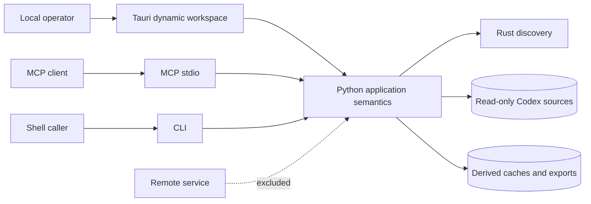
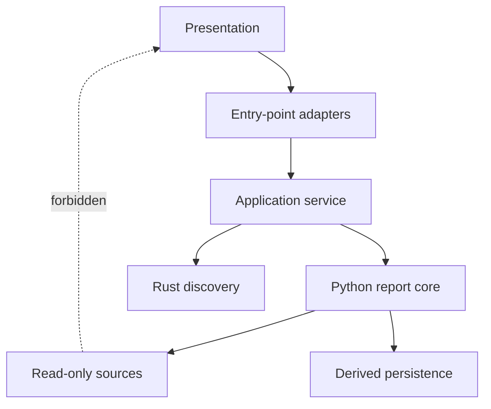
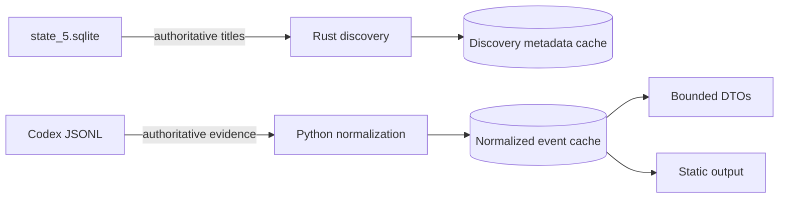
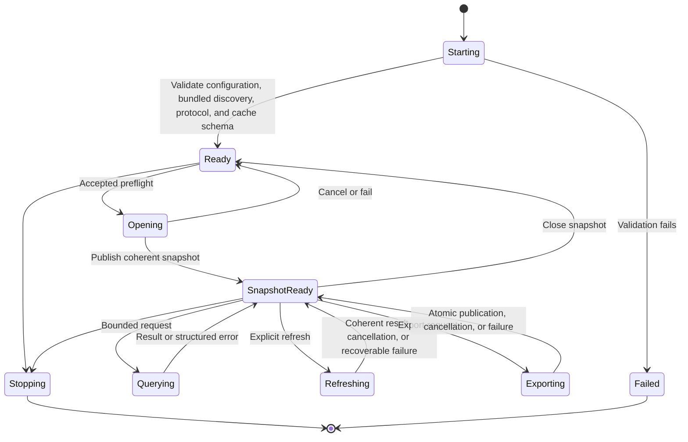

<!--
Copyright (c) 2026 Martin.Bechard@DevConsult.ca
Artifact-ID: f8e60e86-7b2e-4166-80af-b45cfbf156ff
Created-UTC: 2026-08-12T12:37:56Z
Creating-Agent: Dev Documentation Writer
Runtime: Codex
Dispatched-Model: gpt-5.6-sol
Reasoning-Effort: medium
Task-ID: /root/report_docs_writer
Artifact-ID-Evidence: runtime-supplied
Created-UTC-Evidence: runtime-supplied
Creating-Agent-Evidence: runtime-supplied
Runtime-Evidence: runtime-supplied
Dispatched-Model-Evidence: runtime-supplied
Reasoning-Effort-Evidence: runtime-supplied
Task-ID-Evidence: runtime-supplied
-->

# Agent Report Dynamic Application And Static Export Architecture

## Current Understanding

Agent Report is a local reporting system for recorded agent execution. It discovers local runs, normalizes evidence, supports bounded queries, and publishes privacy-bounded static artifacts.

This intended architecture defines the whole-system frame. The Tauri application is the primary dynamic Codex interface. CLI and MCP remain first-class, independently runnable interfaces. All three interfaces share Python application-service semantics without adding a local HTTP server.

The [functional specification](../requirements/functional/FR-001-agent-report-dynamic-app-and-static-export.md) owns actor-visible behavior. The [subsystem high-level design](../design/high-level/HLD-003-agent-report-dynamic-app-and-static-export.md) owns exact constituent components, operations, contracts, and implementation order.

## Authoritative Sources

The accepted Dev Architect packet for `/root/report_app_architecture` governs system-wide technical choices. FR-001 governs actor-visible outcomes. Current source and tests govern implemented behavior. The [Agent Report README](../../tools/report/README.md) and [native execution metrics design](../design/components/CD-001-codex-rollout-metrics.md) govern established runtime, privacy, and measurement semantics.

When sources conflict, the accepted architecture governs the intended system boundary. Current source remains authoritative for claims labeled as implemented.

## Related Code

```text
tools/report/
├── desktop/
│   ├── src/
│   └── src-tauri/
├── rust/
│   ├── agent-report-cli/
│   └── agent-report-core/
├── scripts/
├── src/agent_report/
└── tests/
```

The desktop roots own presentation and native authority. The Rust roots own Codex discovery. The Python roots own normalization, metrics, privacy, shared application semantics, queries, sealing, and export.

Runtime data uses these stable roots:

```text
~/.codex/
├── agent-report/
│   ├── report-events-v1.sqlite3
│   └── rollout-discovery-v2.sqlite3
├── archived_sessions/
├── sessions/
└── state_5.sqlite
```

## Related Tests

- [Python report tests](../../tools/report/tests/) verify current CLI, MCP, normalization, privacy, rendering, and packaging behavior.
- [Desktop contract tests](../../tools/report/desktop/src/contracts.test.ts) and [native catalog tests](../../tools/report/desktop/src-tauri/tests/catalog.rs) verify current desktop boundaries.
- [Rust discovery tests](../../tools/report/rust/agent-report-core/tests/discovery.rs) and [protocol tests](../../tools/report/rust/agent-report-cli/tests/protocol.rs) verify discovery and its bundled protocol.
- Tests for the planned shared service, event repository, worker, dynamic workspace, and static exporter are defined by HLD-003.

## Related Backlog Items

- [Modularize report tool for concurrent maintenance](../feature-backlog/modularize-report-tool-for-concurrent-maintenance.md) affects the Python implementation boundary.
- No separate accepted implementation backlog item for this architecture is identified.

## Related Wiki Pages

- [FR-001](../requirements/functional/FR-001-agent-report-dynamic-app-and-static-export.md)
- [HLD-003](../design/high-level/HLD-003-agent-report-dynamic-app-and-static-export.md)
- [CD-001](../design/components/CD-001-codex-rollout-metrics.md)

No project wiki page is identified.

## Open Questions

No open product questions are recorded for this architecture.

## Accepted Product Decisions

- The current classic interactive renderer remains available to CLI and MCP `generate_report` with their current defaults. A separate Python-owned streamlined exporter serves Tauri, explicit CLI `directory|summary` choices, and MCP `export_snapshot`.
- CLI exists primarily for report automation. MCP exists primarily for bounded drill-down and forensic investigation by an LLM. MCP queries, detail, and snapshot lifecycle do not require static generation.
- The normalized event cache has a configurable 5 GiB default quota, exactly 5,368,709,120 bytes. It deterministically evicts least-recently-used closed, unprotected snapshots. It never evicts open or protected snapshots, never deletes source logs or the discovery cache, and does not expire snapshots by age. Cursor retention is seven days.
- The first dynamic release is Codex-only. Existing non-Codex static adapters remain separate supported backends.
- The dynamic workspace is Tauri-only. There is no standalone-browser dynamic runtime. Published static artifacts remain browser-readable from `file://`.

## Maintenance Notes

Revalidate this architecture after changes to runtime boundaries, source authority, discovery, application-service ownership, Tauri authority, cache separation, static startup constraints, compatibility policy, privacy, packaging, or bundled-engine validation. The latest source review is 2026-08-12.

## Scope

This architecture governs the local Agent Report system, its runtime surfaces, technology allocation, native authority, persistence boundaries, dependency direction, lifecycle policy, compatibility, and cross-cutting rules.

HLD-003 governs leaf modules, exact operations, detailed snapshot and worker contracts, cursor and view rules, exporter contracts, and implementation steps. Component designs govern classes, internal SQLite tables, migration SQL, cursor encoding bytes, and DTO field definitions.

Remote hosting, multi-user tenancy, source-log mutation, automatic filesystem watching, a local HTTP server, a Rust normalization rewrite, first-release dynamic non-Codex adapters, and a standalone-browser dynamic runtime are outside this architecture.



## System Context

Agent Report runs on the operator's device. Operating-system permissions and configured roots define access. Codex JSONL and `state_5.sqlite` remain external read-only authorities. Static readers receive published files without source, cache, or process authority.

Tauri communicates with a local Python worker through versioned JSON Lines over standard input and output. MCP uses its own stdio server process. CLI uses a command process. Each process constructs its own application-service instance; no interface requires another interface to run.

## Technology Stack

| Technology | Architectural purpose | Version and validation authority | Constraint |
|---|---|---|---|
| Tauri and Rust | Native paths, windows, processes, forced cancellation, cache maintenance, desktop publication | `tools/report/desktop/src-tauri/Cargo.toml`; Rust gates from `tools/report` | Native authority does not enter the webview. |
| TypeScript and Vite | Dynamic presentation of bounded DTOs | `tools/report/desktop/package.json`; `pnpm test` and `pnpm build` | No raw rollout or unrestricted filesystem access. |
| Python 3.11 or later | Shared application semantics, normalization, metrics, privacy, queries, sealing, export | `tools/report/pyproject.toml`; Python tests and wheel verification | Normalization is not rewritten in Rust. |
| Rust discovery core and CLI | Sole Codex discovery engine | Rust package metadata and protocol tests | It is bundled, startup-validated, and never downloaded or compiled during operation. |
| SQLite WAL | Separate discovery and normalized-event caches | Repository and migration tests | Source data remains authoritative. |
| HTML, CSS, and JavaScript | Classic interactive reports and streamlined offline `file://` output | Classic renderer regression tests and streamlined export browser tests | Streamlined startup uses no fetch, XHR, modules, service worker, or SQLite-WASM. |
| FastMCP stdio | Independent machine interface | `tools/report/pyproject.toml` and MCP tests | MCP does not depend on Tauri. |

## File Organization

```text
docs/
├── architecture/
│   └── ARC-001-agent-report-dynamic-app-and-static-export.md
├── design/
│   ├── components/
│   └── high-level/
└── requirements/functional/
```

Architecture authorities use `docs/architecture/ARC-NNN-<slug>.md`. Subsystem designs use `docs/design/high-level/HLD-NNN-<slug>.md`. Component designs use `docs/design/components/CD-NNN-<slug>.md`.

Source and test ownership follows the runtime roots in Related Code. HLD-003 fixes each planned leaf path and module namespace.

## Architectural Layers

| Layer | Responsibility | Allowed inward dependencies |
|---|---|---|
| Presentation | Dynamic and static views | Entry-point DTOs or published static data |
| Entry-point adapters | Tauri, CLI, and MCP transport mapping | Application service |
| Application service | Shared operations, scope, snapshot, error, and compatibility semantics | Discovery, normalized report core, repositories, exporter |
| Report core | Normalization, metrics, privacy, queries, coordination, sealing | Read-only sources, discovery protocol, event repository |
| Discovery | Codex source identity and bounded metadata | Filesystem, read-only title database, discovery cache |
| Persistence and publication | Derived cache and static artifacts | SQLite and operating-system filesystem |



Dependencies point inward. The report core does not depend on Tauri, MCP, CLI formatting, or browser presentation.

## Major Runtime Units

| Runtime unit | Whole-system role | Owning root |
|---|---|---|
| Dynamic workspace | Primary bounded Codex presentation | `tools/report/desktop/src/` |
| Tauri native host | Device authority and worker supervision | `tools/report/desktop/src-tauri/` |
| Python application service | Per-process shared operation semantics | `tools/report/src/agent_report/` |
| Python report worker | Long-lived Tauri adapter to report semantics | `tools/report/src/agent_report/` |
| MCP adapter | Independent stdio machine interface | `tools/report/src/agent_report/` |
| CLI adapter | Independent shell interface and compatibility backends | `tools/report/src/agent_report/`, `tools/report/scripts/` |
| Classic interactive renderer | Current rich Codex HTML and sequence generation for CLI and MCP `generate_report` | `tools/report/scripts/run-timeline.py` |
| Streamlined static exporter | Bounded summary and complete directory generation | `tools/report/src/agent_report/static_export.py` |
| Codex discovery engine | Sole discovery implementation | `tools/report/rust/agent-report-core/`, `tools/report/rust/agent-report-cli/` |
| Normalized event repository | Disposable privacy-bounded query cache | `~/.codex/agent-report/report-events-v1.sqlite3` |
| Discovery repository | Metadata-only discovery cache | `~/.codex/agent-report/rollout-discovery-v2.sqlite3` |

## Architecture Constraints

These stable identifiers are the parent constraints for HLD-003 and later component designs.

| ID | Accepted constraint |
|---|---|
| ARC-01 | Processing remains local. The system adds no local HTTP server or remote report service. |
| ARC-02 | The Codex-only dynamic workspace runs in Tauri. MCP and CLI remain independently runnable; CLI primarily automates reports, and MCP primarily supports bounded LLM forensic investigation. |
| ARC-03 | Every entry point uses the same Python application-service semantics through a per-process service instance. |
| ARC-04 | Rust is the sole Codex discovery engine. Python owns normalization, metrics, privacy, queries, sealing, and export. |
| ARC-05 | Tauri owns native paths, windows, worker processes, forced cancellation, cache maintenance, and desktop publication. |
| ARC-06 | The webview receives only bounded sanitized DTOs. It receives no filesystem authority or raw rollout record. |
| ARC-07 | JSONL and `state_5.sqlite` are read-only data authorities. |
| ARC-08 | `rollout-discovery-v2.sqlite3` remains metadata-only. `report-events-v1.sqlite3` is a separate disposable privacy-bounded cache with a configurable 5,368,709,120-byte default quota, deterministic LRU eviction of closed unprotected snapshots, no eviction of open/protected snapshots, no age expiration, and seven-day cursor retention. Maintenance never deletes sources or the discovery cache. |
| ARC-09 | Snapshot coherence binds source revisions, scope, parser, pricing, and formatter versions, observation time, and live or sealed state. |
| ARC-10 | Refresh is explicit. The initial system has no watcher or background poller. |
| ARC-11 | The classic interactive renderer remains separate and serves the existing CLI default plus MCP `generate_report`. One shared streamlined exporter serves Tauri, explicit CLI `directory|summary` choices, and MCP `export_snapshot`. |
| ARC-12 | Static directory startup uses no fetch, XHR, JavaScript modules, service worker, or SQLite-WASM. |
| ARC-13 | Current non-Codex CLI static backends remain. MCP `generate_report`, `query_time_range`, and `get_event_details` keep their exact current schemas, defaults, and behavior. Snapshot tools are additive and require no Tauri process. |
| ARC-14 | Cancellation or failure cannot publish a partial cache revision or export. |
| ARC-15 | Ciphertext stays opaque. Measured, derived, inferred, unavailable, and estimated values remain distinguishable. |
| ARC-16 | The bundled discovery engine is startup-validated and is never downloaded or compiled during operation. |

## System Data Authority



JSONL and `state_5.sqlite` are authoritative. Both SQLite caches and every export are derived and replaceable. Discovery metadata cannot contain transcript content. The normalized cache contains only privacy-bounded report evidence.

## Trust Boundaries

| Boundary | Authority rule | Disclosure rule |
|---|---|---|
| Webview to Tauri | Tauri validates every request and owns paths, processes, windows, and publication. | Only bounded sanitized DTOs cross into the webview. |
| Tauri to Python worker | Tauri owns process lifetime and forced cancellation. The protocol owns versioned operations and terminal outcomes. | Standard output carries protocol records; diagnostics use bounded standard error or native logs. |
| Application service to Codex sources | Configured roots and operating-system permissions constrain reads. | Sources remain read-only and are not copied without privacy normalization. |
| MCP client to MCP server | Server configuration constrains roots, outputs, and inline size. | Cache paths and unrestricted source content remain undisclosed. |
| Static reader to published export | The reader has file access only to the selected artifact. | Omitted evidence stays omitted and cannot be fetched at startup. |

## Lifecycle Policy



Each runtime validates required dependencies before accepting work. Shutdown stops new operations, cancels active work, closes snapshot handles, closes SQLite safely, and terminates owned workers. Cancellation preserves the last coherent snapshot and published export.

## Compatibility

Current non-Codex CLI input backends and their static output contracts remain available as separate backends. The CLI keeps classic interactive Codex HTML as its omitted-mode behavior. Explicit `directory` or `summary` selects the streamlined exporter. Current MCP `generate_report`, `query_time_range`, and `get_event_details` remain available and independently runnable with exact schemas and defaults. `generate_report` keeps the classic report bundle. Additive MCP `export_snapshot` uses the streamlined exporter. Tauri uses the streamlined exporter and does not need to expose classic generation. Dynamic non-Codex browsing and a standalone-browser dynamic runtime are outside the first release.

## Cross-Cutting Concerns

| Concern | System rule |
|---|---|
| Errors | Shared operations return versioned structured errors. Adapters preserve their meanings. |
| Privacy | Normalize before disclosure. Keep ciphertext opaque and raw rollouts out of the webview. |
| Consistency | Bind every query and export to one coherent snapshot. Publish cache and exports atomically. |
| Observability | Use bounded progress and diagnostics without intentional transcript bodies. |
| Performance | Use incremental discovery, changed-file reuse, bounded queries, virtualization, and lazy detail. |
| Accessibility | Provide structured headings, keyboard operation, non-color state labels, and text alternatives. |
| Cost integrity | Preserve token accounting rules and label costs as estimates with pricing provenance. |
| Packaging | Bundle and startup-validate the discovery engine. Do not download or compile at runtime. |
| Object creation | Each entry-point composition root constructs a service instance explicitly. No process-wide mutable Singleton is required. |

## Design Principles

- Present a bounded summary before detailed evidence.
- Reuse one semantic core through surface-specific adapters.
- Keep source authority external and derived data replaceable.
- Keep device authority outside presentation code.
- Load detail lazily and within explicit bounds.
- Keep static output useful without a server.
- Preserve retained MCP tool schemas, classic CLI and MCP generation, and separate non-Codex static backends while adding streamlined export.
- Label evidence according to how it was obtained.

## Invariants

- ARC-01 through ARC-16 remain true across every subsystem and component.
- MCP never depends on Tauri.
- No entry-point adapter recalculates report semantics.
- Source files are never changed by Agent Report.
- Root-only remains the default relationship scope.
- A failed or cancelled operation preserves the last coherent state.

## Risks And Trade-Offs

| Risk or trade-off | Consequence | Mitigation |
|---|---|---|
| Long-lived worker retention | Memory or protocol state can drift. | Versioned protocol, explicit close, health diagnostics, restart. |
| Two caches | Owners can confuse privacy or purge rules. | Separate names, repositories, schemas, diagnostics, and tests. |
| Offline directory contains many files | Sharing is less convenient than one file. | Keep a bounded summary and optional archive packaging. |
| `file://` restrictions differ by browser | Some browser APIs are unavailable. | Pre-render content and use classic local assets. |
| Two Codex rendering paths can drift semantically | Classic interactive reports and streamlined artifacts can describe the same evidence differently. | Keep ownership separate and use fixed semantic-parity fixtures without changing classic signatures or defaults. |
| Deterministic quota eviction removes closed cache entries | A later query can require rebuild after eviction. | Protect open/marked snapshots, retain cursors seven days, expose diagnostics, and rebuild from unchanged sources. |
| Source changes invalidate live references | Cursor or event identity can become stale. | Snapshot binding, explicit refresh, and structured conflict errors. |
| Forced cancellation interrupts I/O | Temporary state can remain. | WAL, staging, atomic replacement, and startup cleanup. |

## Documentation Acceptance

**ACCEPTED.** The architecture records the accepted Dev Architect system frame, stable parent constraints, authority boundaries, runtime roots, compatibility policy, and verification obligations.

## Implementation Readiness

**BLOCKED.** Product decisions are complete. Implementation remains blocked only by HLD-003 component-design, review, verification, and implementation prerequisites.

## Verification

| Architecture area | Evidence or required gate |
|---|---|
| Rust-only discovery and metadata privacy | Rust discovery and protocol tests; inspect the discovery database for metadata-only content. |
| Python semantics and privacy | Python CLI, MCP, renderer, and fixture tests. |
| Independent entry points and renderer separation | Regression fixtures preserve classic CLI and MCP `generate_report`. Semantic-parity fixtures prove streamlined directory and summary through Tauri, explicit CLI choices, and MCP `export_snapshot`; MCP query/detail/snapshot flows complete without export. |
| Webview boundary | TypeScript contract tests and native DTO validation tests. |
| Cache separation and coherence | Event-repository migration, invalidation, privacy, exact-byte quota, deterministic LRU, open/protected safety, no-age-expiry, seven-day cursor, and recovery tests. |
| Atomic cancellation and publication | Cancellation tests at each cache and export stage. |
| Offline static startup | Browser tests with network access disabled. |
| Accepted scope | Tests reject dynamic non-Codex and standalone-browser runtime entry points while preserving separate non-Codex static adapters. |
| Classic compatibility path | Source, schema, and end-to-end checks confirm CLI omitted mode and MCP `generate_report` still use the classic interactive renderer. |
| Bundled-engine policy | Platform wheel and sidecar verification on Linux x64, Windows x64, and Apple Silicon macOS. |

Run Python tests from `tools/report`, TypeScript tests and production build from `tools/report/desktop`, and Rust format, lint, test, and build gates from `tools/report`.
