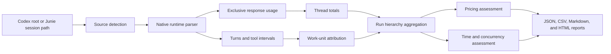

# Component Design: Native Agent Execution Metrics

## 1. Finality

This section defines the outcome and boundary of native Codex and Junie execution reporting.

- **GOAL: GOAL-1** Report resource use for a complete Codex Desktop run
  - **SYNOPSIS:** Extend the cross-tool reporter so a root Codex rollout and every descendant agent thread can be summarized by response, turn, thread, work unit, phase, and complete run.
  - **BECAUSE:** A parent thread does not include the model-token usage of its child threads, so the complete cost of a multi-agent run requires explicit hierarchy traversal and aggregation.

- **GOAL: GOAL-2** Preserve exact measurements separately from estimates
  - **SYNOPSIS:** Report recorded token counters and task durations as measured values while labeling inferred phase attribution, tool duration, critical-path duration, and model cost with their confidence and method.
  - **BECAUSE:** Interrupted, resumed, compacted, and reused threads can make semantic allocation less precise than raw thread totals.

- **GOAL: GOAL-3** Reuse the existing report product
  - **SYNOPSIS:** Add native Codex rollout and Junie session ingestion to `tools/report/scripts/run-timeline.py`, its backend-neutral report model, HTML renderer, pricing registry, fixtures, and regression suite.
  - **BECAUSE:** The repository already owns cross-tool timeline reporting and should not create a competing parser, cost model, or user interface.

- **GOAL: GOAL-4** Report durable Junie sessions without parsing terminal presentation
  - **SYNOPSIS:** Detect Junie `events.jsonl` session streams, reconstruct task and custom-agent boundaries, distinguish user tasks from per-agent task spans and model responses, collapse repeated block updates, recognize terminal heredoc file writes, and aggregate recorded model usage and cost.
  - **BECAUSE:** The rendered Junie transcript omits timestamps, full results, and accounting metadata that remain available in the durable session event stream.

- **GOAL: GOAL-5** Discover reportable runs before selecting one
  - **SYNOPSIS:** Generate separate Codex and Junie HTML catalogs over caller-bounded log stores, filter root runs by inclusive UTC date range, bounded title, or workspace/source path, and optionally generate every selected report as a linked batch.
  - **BECAUSE:** Operators should not need to know a thread ID or manually search active and archived log directories before using the reporter.

- **GOAL: GOAL-6** Share one native discovery engine across command-line and desktop products
  - **SYNOPSIS:** Use a Rust core for concurrent Codex rollout discovery, incremental SQLite indexing, and local run catalog queries; expose it through a required command-line adapter for the Python renderer and as a direct library dependency of a Tauri desktop application.
  - **BECAUSE:** Initial discovery is the dominant cold-start cost, and separate Python and desktop implementations would create performance, invalidation, and parsing drift.

- **REQUIREMENT: REQ-1** Support live and sealed reports
  - **SYNOPSIS:** A live report records an observation timestamp and incomplete work; a sealed report fixes the discovered thread set, terminal states, source digests, metrics, and report artifacts for an archived run.
  - **BECAUSE:** Operators need progress visibility during long runs and reproducible evidence after a run finishes.

- **REQUIREMENT: REQ-2** Avoid content collection by default
  - **SYNOPSIS:** The default report reads structural metadata, counters, timestamps, agent paths, tool identifiers, compact tool-argument summaries, and bounded tool-result previews. It redacts secret-shaped values, replaces message-like bodies with character counts except for a secret-redacted 50-character `send_message` preview, replaces recognized encrypted message tokens with an encrypted-message length placeholder, truncates long summaries, and does not copy prompts, reasoning text, unredacted tool payloads, source code, or final document bodies into metrics outputs. Presentation rules operate only on sanitized summaries; collapsed raw disclosures contain bounded redacted content rather than the original payload.
  - **BECAUSE:** Tool names alone do not explain activity, but rollout files can contain private project material and credentials that are unnecessary for usage accounting.

- **RULE: RULE-1** Do not present estimated API-equivalent cost as an actual Codex charge
  - **SYNOPSIS:** Monetary output must distinguish direct recorded cost, model-price estimate, subscription usage with no monetary telemetry, and unavailable cost.
  - **BECAUSE:** Codex Desktop rollout telemetry records token usage, plan type, and rate-limit state but may not record an actual dollar charge or a public price for the active model.

- **RULE: RULE-1A** Require the native Codex discovery engine
  - **SYNOPSIS:** Codex rollout discovery and incremental index operations fail with an actionable error when the Rust engine cannot start, cannot open its requested index, or returns an incompatible protocol response; the reporter does not fall back to a second Python scanner.
  - **BECAUSE:** This is an unreleased product, so one mandatory implementation is safer and easier to validate than preserving an unneeded compatibility path with different performance and failure behavior.

## 2. Technical Directives

These directives shape parsing, aggregation, attribution, and reporting behavior.

- **RULE: RULE-2** Treat each rollout file as one usage-accounting boundary
  - **SYNOPSIS:** The final cumulative `total_token_usage` in one rollout belongs only to that thread; descendant totals must be discovered through `parent_thread_id` and added exactly once.
  - **BECAUSE:** The parent spends tokens processing child messages but does not roll the child model calls into its own cumulative counter.

- **RULE: RULE-3** Use cumulative deltas for response-level usage
  - **SYNOPSIS:** For every distinct monotonic `token_count` snapshot, subtract the preceding snapshot in the same thread to obtain the usage of the newly recorded model response; ignore unchanged duplicate snapshots.
  - **BECAUSE:** `last_token_usage` can be repeated at task boundaries, while cumulative changes provide an exclusive accounting sequence.

- **RULE: RULE-4** Keep cached input as a subset of input
  - **SYNOPSIS:** Compute uncached input as `input_tokens - cached_input_tokens`; calculate total processed tokens as `input_tokens + output_tokens`; treat reasoning tokens as a reported subset of output rather than adding them again.
  - **BECAUSE:** Adding cached input or reasoning output to their parent counters would overstate usage.

- **RULE: RULE-5** Traverse a closed descendant set
  - **SYNOPSIS:** Starting from a selected root thread ID, recursively include sessions whose `parent_thread_id` points to any included session, reject cycles, and exclude siblings and unrelated top-level sessions.
  - **BECAUSE:** Date-based or directory-wide summation can mix concurrent projects and double-count unrelated work.

- **RULE: RULE-6** Preserve raw provenance for every derived metric
  - **SYNOPSIS:** Every response, turn, thread, work-unit, phase, and run record must retain the source rollout path, thread ID, event positions or timestamps, derivation method, and attribution confidence.
  - **BECAUSE:** A report must be auditable when logs are compacted, duplicated, malformed, or still changing.

- **RULE: RULE-7** Prefer explicit work identifiers over text inference
  - **SYNOPSIS:** Future assignments should carry `run_id`, `phase_id`, `lane_id`, `work_unit_id`, and `activity`; legacy logs may infer these values from agent paths and bounded status labels but must mark the result as inferred.
  - **BECAUSE:** Reused agents keep their original `agent_path`, so a thread named for setup may later perform module, architecture, or functional-specification work.

- **RULE: RULE-8** Separate elapsed time from consumed agent time
  - **SYNOPSIS:** Report run wall time, summed agent-turn time, active-interval union, tool time, time to first token, and critical-path time as different metrics.
  - **BECAUSE:** Parallel agents make summed task duration larger than elapsed wall time, and neither number alone describes concurrency.

- **RULE: RULE-9** Make live parsing append-safe
  - **SYNOPSIS:** Tolerate an incomplete final JSONL line, repeated `session_meta`, unchanged token snapshots, active turns without completion, and files that appear while discovery is running.
  - **BECAUSE:** A live report reads logs that Codex is still appending and may discover newly spawned descendants between scans.

- **RULE: RULE-10** Seal immutable evidence before archival pruning
  - **SYNOPSIS:** A sealed report must record source file identifiers, sizes, modification times, digests, parser version, pricing-table version, observation interval, and terminal-state assessment before source runs are pruned.
  - **BECAUSE:** Later comparison requires proof of which telemetry produced the archived metrics.

- **RULE: RULE-19** Prefer an explicit task title and otherwise derive one from genuine user input
  - **SYNOPSIS:** Use a caller-supplied or stored task title when available. Otherwise derive a bounded title from the first genuine recorded user request after excluding injected plugin catalogs, repository instructions, environment blocks, and ambient browser context. Compose the result as `"<task title>" Agent Report` for both the HTML document title and visible page heading, with a generic metrics title only as the fallback.
  - **BECAUSE:** Host-provided context is useful runtime input but does not identify the work the report is about.

- **RULE: RULE-20** Keep the HTML report frame compact
  - **SYNOPSIS:** Place the run identifier, state, observation timestamp, and the single API-equivalent estimate disclaimer together in the page subtitle; label the agent-and-turn execution section `Timeline`; do not render a separate diagnostics section.
  - **BECAUSE:** The primary report should lead with task identity, resource use, and execution chronology while keeping parser diagnostics in machine-readable provenance rather than a low-value page section.

- **RULE: RULE-21** Render recognized semantic arguments before their raw representation
  - **SYNOPSIS:** Render `update_plan` arguments as a complete bulleted plan with each step's state, and render other recognized tool arguments with their configured human-readable formatter. Keep a collapsed sanitized `raw` disclosure beside the semantic representation.
  - **BECAUSE:** Semantic structures are easier to scan in their natural form, while the raw representation remains available for audit.

- **RULE: RULE-22** Clamp only generic long argument presentations
  - **SYNOPSIS:** Do not clamp a recognized semantic plan or formatted summary. Clamp long generic argument cells to a preview with `more` and `less` controls, and expose their complete bounded sanitized content when expanded.
  - **BECAUSE:** Clamping a specially formatted structure can remove bullets or other meaning, while unformatted payloads still need a bounded initial table height.

- **RULE: RULE-23** Catalog root runs rather than individual agent logs
  - **SYNOPSIS:** A Codex catalog lists only rollouts without `parent_thread_id`; generated reports still include the selected root's closed descendant set. A Junie catalog lists each durable session event stream once.
  - **BECAUSE:** Descendant Codex rollouts are components of one reportable run, not independent operator-facing report choices.

## 3. Information Model

This model retains exact source measurements and progressively aggregated views.

- **ENTITY: ENTITY-1** Run
  - **SYNOPSIS:** The selected root rollout and its recursively discovered descendants.
  - **FIELD:** `run_id`
    - **SYNOPSIS:** Stable caller-supplied identifier or root thread ID.
  - **FIELD:** `root_thread_id`
    - **SYNOPSIS:** Session ID that anchors descendant discovery.
  - **FIELD:** `state`
    - **SYNOPSIS:** `live`, `complete`, `failed`, `aborted`, or `sealed`, with combined complete-with-failed/aborted-child states when only descendants have terminal problems.
  - **FIELD:** `observed_at`
    - **SYNOPSIS:** Timestamp through which the live metrics are known.
  - **FIELD:** `wall_interval`
    - **SYNOPSIS:** Earliest included run event through the latest included event.
  - **FIELD:** `source_manifest`
    - **SYNOPSIS:** Rollout file paths and optional immutable source digests.
  - **FIELD:** `run_label`
    - **SYNOPSIS:** Caller-supplied task title when available, otherwise a bounded title derived from the first genuine recorded user request, composed as `"<task title>" Agent Report` without duplicating an existing `Agent Report` suffix.

- **ENTITY: ENTITY-2** Thread
  - **SYNOPSIS:** One Codex session and its local usage-accounting boundary.
  - **FIELD:** `thread_id`
    - **SYNOPSIS:** Value from the first usable `session_meta.payload.id`.
  - **FIELD:** `parent_thread_id`
    - **SYNOPSIS:** Direct parent used to construct the run hierarchy.
  - **FIELD:** `agent_path`
    - **SYNOPSIS:** Spawn-time role path from `source.subagent.thread_spawn.agent_path`, when present.
  - **FIELD:** `agent_nickname`
    - **SYNOPSIS:** Optional display name from spawn metadata.
  - **FIELD:** `started_at` and `last_observed_at`
    - **SYNOPSIS:** File/event observation bounds for the thread.
  - **FIELD:** `token_totals`
    - **SYNOPSIS:** Final local input, cached input, uncached input, output, reasoning, and total processed tokens.
  - **FIELD:** `terminal_state`
    - **SYNOPSIS:** Complete, failed, aborted, active, or indeterminate. An explicit failed verdict or a reviewer final answer containing categorized findings is failed even when a later interruption records `turn_aborted`; turns interrupted before a final result remain aborted.

- **ENTITY: ENTITY-3** Model response usage
  - **SYNOPSIS:** The smallest exclusive token-accounting unit derived from one positive cumulative counter change.
  - **FIELD:** `event_timestamp`
    - **SYNOPSIS:** Timestamp of the cumulative token snapshot.
  - **FIELD:** `usage_delta`
    - **SYNOPSIS:** Input, cached input, uncached input, output, reasoning, and total-token differences from the preceding distinct snapshot.
  - **FIELD:** `model`
    - **SYNOPSIS:** Closest applicable turn or thread model identifier.
  - **FIELD:** `turn_id`
    - **SYNOPSIS:** Exact active turn when unambiguous; otherwise null with reduced confidence.
  - **FIELD:** `source_position`
    - **SYNOPSIS:** Rollout path and line or event ordinal.

- **ENTITY: ENTITY-4** Agent turn
  - **SYNOPSIS:** Work bounded by `task_started` and matching `task_complete` or `turn_aborted` events.
  - **FIELD:** `turn_id`
    - **SYNOPSIS:** Stable task event identifier.
  - **FIELD:** `started_at`, `completed_at`, and `duration_ms`
    - **SYNOPSIS:** Recorded task timing rather than a duration inferred from file modification time.
  - **FIELD:** `time_to_first_token_ms`
    - **SYNOPSIS:** Recorded completion metric when available.
  - **FIELD:** `outcome`
    - **SYNOPSIS:** Complete, aborted, active, or unmatched.
  - **FIELD:** `abort_reason`
    - **SYNOPSIS:** The reason recorded by `turn_aborted`, when present.
  - **FIELD:** `abort_event_timestamp`
    - **SYNOPSIS:** Millisecond-capable source timestamp of the `turn_aborted` event, retained separately from a lower-precision `completed_at` payload for cross-thread matching.
  - **FIELD:** `abort_initiator_thread_id`, `abort_initiator_agent_path`, `abort_initiator_turn_id`, and `abort_initiator_relationship`
    - **SYNOPSIS:** Cross-thread provenance for an explicit `interrupt_agent` call whose target and timing match this aborted turn. A direct caller is identified as the parent; unmatched aborts do not infer an initiator.
  - **FIELD:** `abort_request_source_path` and `abort_request_source_ordinal`
    - **SYNOPSIS:** Source location of the matched `interrupt_agent` request for audit and reprocessing.
  - **FIELD:** `usage`
    - **SYNOPSIS:** Exclusive response deltas attributed to this turn.
  - **FIELD:** `skills_used`
    - **SYNOPSIS:** Sorted skill names explicitly referenced by tool activity attributed to this turn.
  - **FIELD:** `attribution_confidence`
    - **SYNOPSIS:** `exact`, `bounded`, `inferred`, or `unattributed` with a reason.

- **ENTITY: ENTITY-5** Work unit
  - **SYNOPSIS:** A module, document, review, correction, verification task, or named batch such as `M-011` or `M-011–M-015`.
  - **FIELD:** `work_unit_id`
    - **SYNOPSIS:** Explicit stable identifier when supplied; otherwise an inferred label with provenance.
  - **FIELD:** `activity`
    - **SYNOPSIS:** Author, review, correct, integrate, verify, orchestrate, or other caller-defined activity.
  - **FIELD:** `turn_ids`
    - **SYNOPSIS:** Turns whose exclusive metrics roll into the work unit.
  - **FIELD:** `allocation_method`
    - **SYNOPSIS:** Exact one-turn ownership, explicit multi-turn mapping, equal batch split, size-weighted estimate, activity-weighted estimate, or unavailable.

- **ENTITY: ENTITY-6** Phase and lane
  - **SYNOPSIS:** Caller-defined aggregation boundaries such as configuration, Pass 0 inventory, module design, HLD, architecture, functional specifications, wiki integration, reconstruction, and verification.
  - **FIELD:** `phase_id` and `lane_id`
    - **SYNOPSIS:** Stable identifiers supplied by orchestration metadata or inferred with confidence.
  - **FIELD:** `work_unit_ids`
    - **SYNOPSIS:** Units included exactly once in this aggregation.
  - **FIELD:** `wall_interval`, `active_interval_union`, and `agent_time`
    - **SYNOPSIS:** Distinct concurrency-aware time views.
  - **FIELD:** `usage_totals`
    - **SYNOPSIS:** Sum of exclusive work-unit metrics.

- **ENTITY: ENTITY-7** Cost assessment
  - **SYNOPSIS:** Monetary status plus an optional API-equivalent USD estimate for one aggregation unit.
  - **FIELD:** `status`
    - **SYNOPSIS:** `recorded`, `estimated`, `subscription-no-charge-data`, or `unavailable`.
  - **FIELD:** `pricing_model` and `pricing_version`
    - **SYNOPSIS:** Exact model key and pricing-registry version used for an estimate.
  - **FIELD:** `input_cost`, `cached_input_cost`, and `output_cost`
    - **SYNOPSIS:** Separately calculated components; reasoning is not charged twice when it is included in output.
  - **FIELD:** `total_cost`
    - **SYNOPSIS:** Sum of available cost components with currency and estimate label.
  - **RULE:** Reports do not derive or display Codex credit estimates because rollout telemetry does not establish a run-specific credit charge or balance.

## 4. Structure And Execution

The component extends the existing reporter with a native rollout source adapter and hierarchical aggregation pipeline.

- **MODULE: MODULE-1** Codex rollout source adapter
  - **SYNOPSIS:** Detect and parse native Codex Desktop rollout JSONL without changing the existing prompt-runner Codex parser.
  - **READS:** `~/.codex/sessions/YYYY/MM/DD/rollout-*.jsonl` or caller-supplied session roots.
  - **PRODUCES:** Normalized session metadata, response usage events, task events, tool call/result intervals, model context, and parse diagnostics.
  - **VALIDATES:** JSON shape by feature detection rather than assuming every Codex version exposes every field.

- **MODULE: MODULE-2** Session hierarchy resolver
  - **SYNOPSIS:** Index sessions by ID, connect parent and child sessions, and return the closed descendant set for one selected root.
  - **CHECKS-FILE:** First usable `session_meta` record in each candidate rollout.
  - **VALIDATES:** Unique session ownership, missing parents, duplicate IDs, cycles, unreadable files, and unrelated siblings.
  - **PRODUCES:** Ordered thread nodes plus hierarchy diagnostics.

- **MODULE: MODULE-2A** Junie session source adapter
  - **SYNOPSIS:** Detect a Junie session directory or `events.jsonl`, map sequential task boundaries, and reconstruct main/custom-agent ownership from recorded agent identities and custom-agent model intervals.
  - **READS:** `~/.junie/sessions/session-*/events.jsonl` or a caller-supplied equivalent path.
  - **PRODUCES:** Normalized agent threads, unique user tasks, per-agent task spans, response usage, recorded costs, deduplicated tool intervals, terminal heredoc write targets, bounded result previews, and parser diagnostics.
  - **VALIDATES:** Required event shapes, task completion, agent identity, model-usage counters, repeated `stepId` updates, heredoc boundaries, and incomplete live streams.

- **MODULE: MODULE-3** Usage normalizer
  - **SYNOPSIS:** Convert cumulative token snapshots into exclusive response deltas and reconcile them with final thread totals.
  - **VALIDATES:** Monotonic counters, duplicate snapshots, counter resets, negative deltas, missing categories, and final-sum equality.
  - **PRODUCES:** Exact per-response and per-thread usage plus an unattributed remainder when reconciliation cannot be exact.

- **MODULE: MODULE-4** Turn and work-unit attribution engine
  - **SYNOPSIS:** Associate exclusive response deltas and task timing with turns, then map turns to explicit or inferred work units.
  - **USES:** Event order, task IDs, turn context, assignment metadata, bounded completion labels, and agent paths.
  - **VALIDATES:** Overlapping active turns, repeated starts, missing completions, abort/resume sequences, compacted history, and stale agent names.
  - **PRODUCES:** Attribution records with confidence and explanation; it never silently forces ambiguous usage into a named module.

- **MODULE: MODULE-5** Time and concurrency calculator
  - **SYNOPSIS:** Produce distinct elapsed, consumed, tool, and concurrency-aware time measures.
  - **USES:** Task payload timestamps and durations, rollout timestamps, tool-reported `wall_time_seconds`, and matched call/result timestamps.
  - **PRODUCES:** Run wall time, summed agent time, interval-union active time, peak concurrency, time to first token, tool time, and best-evidence critical path.
  - **GAP:** A dependency-accurate critical path is unavailable when logs do not identify the work-unit handoff that unblocked downstream work; report observed elapsed time and mark the critical path inferred in that case.

- **MODULE: MODULE-6** Cost assessor
  - **SYNOPSIS:** Reuse `docs/reference/openai-model-pricing.json` for optional API-equivalent USD and Codex credit estimates while preserving unavailable actual-charge status.
  - **READS:** Normalized model IDs and aliases, token categories, provider pricing entries, Codex credit entries, pricing effective date, and any direct cost field a source exposes.
  - **PRODUCES:** Component and total USD estimates, optional credit estimates, formula, model mapping, currency, and pricing version.
  - **GAP:** Internal or subscription-only model identifiers may have no supported price; those rows remain unavailable rather than being mapped to a convenient public model.

- **MODULE: MODULE-7** Report integration
  - **SYNOPSIS:** Feed normalized metrics into the existing timeline report model and renderer while adding hierarchy and confidence views.
  - **PRODUCES:** Interactive HTML with a new-tab model-rate reference and nested per-agent and per-turn tool-call drilldowns, machine-readable JSON, turn-oriented CSV, work-unit cost CSV, and compact Markdown summary with the same rates.
  - **SUPPORTS:** Live refresh and sealed archive generation from the same normalized data model.

- **MODULE: MODULE-8** Report catalog indexer
  - **SYNOPSIS:** Read minimal session identity, first-event time, bounded task title, workspace, parent identity, and source path from Codex rollout and Junie event stores.
  - **READS:** `~/.codex/sessions`, `~/.codex/archived_sessions`, `~/.junie/sessions`, or repeated caller-supplied `--catalog-root` paths.
  - **PRODUCES:** A filtered local HTML catalog plus optional child reports under `reports/`, with catalog-to-report and report-to-catalog links.

- **MODULE: MODULE-9** Native rollout discovery core
  - **SYNOPSIS:** Stream candidate JSONL files through a bounded producer-consumer pipeline, extract rollout identity and cross-thread delegation sources, reuse stable metadata from SQLite, and commit changed stable observations through one writer transaction.
  - **READS:** Caller-selected rollout paths plus their device, inode, size, modification time, and change time fingerprints.
  - **PRODUCES:** Input-order-preserving discovery entries and explicit scanned, cached, unstable, and elapsed-time statistics.
  - **VALIDATES:** Protocol version, path ownership, cache schema, before/after fingerprint stability, malformed and partial JSONL, and UTF-8 replacement behavior.

- **MODULE: MODULE-10** Desktop run browser
  - **SYNOPSIS:** Provide a Tauri application that selects bounded local stores, searches the native catalog with progress updates, exports catalog HTML with clickable source locations, and invokes full report generation for a selected root.
  - **USES:** `MODULE-9` as a direct Rust dependency; the webview receives normalized metadata and progress rather than raw transcript content.
  - **PRODUCES:** A responsive local run list and user-selected offline output artifacts.

- **PROCESS: PROCESS-1** Discover and parse a run
  - **SYNOPSIS:** Resolve the selected root, index candidate rollout files, traverse descendants, parse each file once, and record all parse gaps.
  - **VALIDATES:** The root exists and every included thread is connected to it.
  - **PRODUCES:** A normalized live run snapshot.

- **PROCESS: PROCESS-2** Reconcile usage
  - **SYNOPSIS:** Derive response deltas, sum them to thread totals, sum each included thread once to the run total, and expose any remainder.
  - **VALIDATES:** `run total = sum(final local thread totals)` and `thread total = response deltas + explicit unattributed remainder`.
  - **BECAUSE:** These equalities prevent parent/child rollup assumptions and duplicated token events from inflating totals.

- **PROCESS: PROCESS-2A** Reconcile explicit interruptions
  - **SYNOPSIS:** Match an `interrupt_agent` target path and call interval to the target agent's aborted turn, then record the caller and direct-parent relationship.
  - **VALIDATES:** Only a matching target and timestamp interval establishes explicit interruption provenance; the `turn_aborted` reason alone does not identify a caller.
  - **BECAUSE:** An aborted outcome should distinguish a deliberate parent stop from an unattributed interruption without inventing intent.

- **PROCESS: PROCESS-3** Attribute semantic work
  - **SYNOPSIS:** Apply explicit identifiers first, then exact turn ownership, then bounded inference; leave unresolved work unattributed.
  - **PRODUCES:** Phase, lane, work-unit, and activity summaries with confidence distribution.
  - **BECAUSE:** An incomplete semantic breakdown is more trustworthy than a complete-looking allocation built from stale thread names.

- **PROCESS: PROCESS-4** Calculate optional cost
  - **SYNOPSIS:** Multiply uncached input, cached input, and output by matching per-million USD and Codex-credit rates when supported; prefer direct cost if the source records it.
  - **PRODUCES:** Recorded or estimated USD, optional credit consumption, and explicit subscription or unavailable states at turn, agent, work-unit, phase, and run levels.

- **PROCESS: PROCESS-5** Seal a completed report
  - **SYNOPSIS:** Re-scan until the descendant set and source sizes are stable, reject active or indeterminate threads unless the caller explicitly seals an aborted run, write source digests and report artifacts, then mark the snapshot sealed.
  - **BECAUSE:** A live snapshot can change after it is rendered and is not sufficient archival evidence.

- **PROCESS: PROCESS-6** Catalog and batch-generate reports
  - **SYNOPSIS:** Index the selected runtime's bounded log stores, discard Codex descendants from the operator-facing list, apply inclusive UTC date and text filters, write the catalog, and when `--generate-batch` is present generate each selected run through the existing native parser.
  - **PRODUCES:** One catalog in list-only mode or one catalog plus a linked `reports/` directory in batch mode.

- **PROCESS: PROCESS-7** Build or refresh the native discovery index
  - **SYNOPSIS:** Enumerate caller-bounded candidates, fingerprint them, dispatch only missing or changed files to bounded streaming workers, preserve input order, skip caching files that changed during their scan, and persist stable updates in one SQLite transaction.
  - **PRODUCES:** Complete metadata for the requested candidate set plus cache and scan statistics suitable for command-line tests and desktop progress.
  - **BECAUSE:** Parallel reads improve cold-start throughput while a single cache writer avoids SQLite contention and unstable live files remain correct on the next observation.

- **COMMAND: CMD-1** Extend the timeline reporter CLI
  - **SYNOPSIS:** Add a native rollout input form such as `--codex-thread THREAD_ID` with optional `--sessions-root`, `--live`, `--seal`, and machine-output flags while preserving existing path-based prompt-runner and methodology-runner behavior.
  - **PRODUCES:** The same HTML report entry point plus optional JSON, CSV, and Markdown companions.

- **COMMAND: CMD-2** Catalog native agent logs
  - **SYNOPSIS:** Use mutually exclusive `--codex-catalog` and `--junie-catalog` modes with optional `--from-date`, `--to-date`, `--title-contains`, `--workspace-contains`, repeated `--catalog-root`, and `--generate-batch` flags.
  - **PRODUCES:** A runtime-specific HTML catalog and, only when requested, linked per-run HTML reports.

- **COMMAND: CMD-3** Run the native discovery protocol
  - **SYNOPSIS:** `agent-report-engine index` accepts a versioned JSON request on standard input and writes one versioned JSON response on standard output; operational diagnostics use standard error and a nonzero exit status.
  - **PRODUCES:** Discovery metadata and statistics without transcript bodies.

- **COMMAND: CMD-4** Browse and export reports from the desktop application
  - **SYNOPSIS:** Search selected local stores through asynchronous Tauri commands with ordered progress events, then export a native catalog or generate the existing full offline report for a selected root. Remember the last export folder and open each successful local HTML artifact in a separate app window.
  - **PRODUCES:** User-selected HTML artifacts and reopenable report windows without loading a multi-hundred-megabyte report into the catalog webview.

- **FILE: FILE-1** Component design authority
  - **SYNOPSIS:** `docs/design/components/CD-001-codex-rollout-metrics.md` defines the ingestion and aggregation contract.

- **FILE: FILE-2** Report renderer and orchestration implementation
  - **SYNOPSIS:** `tools/report/scripts/run-timeline.py` remains the normalization, accounting, rendering, and public report CLI implementation while delegating all Codex discovery/index work to the required native engine.

- **FILE: FILE-3** Reporter regression suite
  - **SYNOPSIS:** `tools/report/tests/test_run_timeline.py` and sanitized fixtures verify existing and native-rollout inputs.

- **FILE: FILE-4** Pricing registry
  - **SYNOPSIS:** `docs/reference/openai-model-pricing.json` supplies versioned estimate rates without implying an actual Codex subscription charge.

- **FILE: FILE-5** Prior reporting plan
  - **SYNOPSIS:** `docs/superpowers/plans/2026-04-11-codex-timeline-reporting.md` records the earlier prompt-runner Codex integration and remains historical context rather than the authority for native Desktop rollout hierarchy.

- **FILE: FILE-6** Native report workspace
  - **SYNOPSIS:** `tools/report/Cargo.toml` owns the shared Rust workspace; `tools/report/rust/agent-report-core/` owns discovery and indexing, and `tools/report/rust/agent-report-cli/` owns the JSON command adapter.

- **FILE: FILE-7** Desktop report application
  - **SYNOPSIS:** `tools/report/desktop/` owns the strict TypeScript/Vite frontend and its Tauri native application glue.

## 5. Constraints

These constraints prevent inaccurate accounting and unsafe report artifacts.

- **RULE: RULE-11** Maintain backward compatibility
  - **SYNOPSIS:** Existing Claude, prompt-runner Codex, and methodology-runner reports and fixtures must retain their current behavior unless a separately approved schema migration changes them.
  - **BECAUSE:** Native Desktop rollout support is an additional source adapter, not a replacement for established run formats.

- **RULE: RULE-12** Never double-count hierarchy or category subsets
  - **SYNOPSIS:** Include each thread once, cached input only inside input, reasoning only inside output, each response delta once, and each work unit once per requested aggregation.
  - **BECAUSE:** Hierarchical and subset counters are the primary sources of convincing but incorrect totals.

- **RULE: RULE-12A** Keep raw rollout content inside native processing boundaries
  - **SYNOPSIS:** Discovery responses, desktop events, and catalog models contain paths, fingerprints, identity, bounded titles, workspace metadata, and delegation identifiers but never return whole rollout lines or transcript bodies to the webview.
  - **BECAUSE:** The desktop catalog needs operational metadata, not project content, and the repository prohibits unnecessary disclosure of private or company information.

- **RULE: RULE-13** Keep raw logs outside reports by default
  - **SYNOPSIS:** Store source paths and digests rather than embedding rollout JSONL; redact or hash optional labels when privacy mode is selected.
  - **BECAUSE:** Reports are likely to be shared more broadly than the source project and agent transcripts.

- **RULE: RULE-14** Bound source discovery
  - **SYNOPSIS:** Search only configured session roots and dates needed to resolve the selected hierarchy; do not scan unrelated home-directory content.
  - **BECAUSE:** Session roots may contain many concurrent projects and sensitive conversations.

- **RULE: RULE-15** Surface schema drift
  - **SYNOPSIS:** Unknown event types are counted and retained in diagnostics; missing optional fields degrade features; missing identity or usage fields fail only the affected accounting boundary.
  - **BECAUSE:** Codex rollout telemetry is a runtime format that may change independently of this repository.

- **RULE: RULE-16** Distinguish measured, derived, inferred, and unavailable values
  - **SYNOPSIS:** Every output field carries or inherits a provenance class, and user-facing totals show the share of usage that lacks exact semantic attribution.
  - **BECAUSE:** Consumers need to know which comparisons can support optimization decisions.

- **RULE: RULE-17** Do not split batch cost into modules without an allocation declaration
  - **SYNOPSIS:** A five-module turn remains one batch unless explicit work-unit events identify module boundaries; optional equal, document-size, or activity-weighted splits are labeled estimates.
  - **BECAUSE:** File count or output size alone does not reveal how much model reasoning each module required.

- **RULE: RULE-18** Use immutable pricing inputs for sealed reports
  - **SYNOPSIS:** A sealed estimate records the selected pricing entry and digest rather than silently changing when the shared registry is updated.
  - **BECAUSE:** Historical costs must remain reproducible.

## 6. Definition Of Good

These conditions define an acceptable implementation and report.

- **REQUIREMENT: REQ-3** Exact subtree accounting
  - **SYNOPSIS:** The report identifies the selected root and every reachable descendant, excludes unrelated sessions, and reconciles the run total to the sum of local thread totals with no unexplained duplication.
  - **BECAUSE:** The complete multi-agent run is the primary reporting boundary.

- **REQUIREMENT: REQ-4** Useful finest-grain evidence
  - **SYNOPSIS:** Users can inspect response deltas, agent turns, individual matched tool calls, threads, work units, phases, and the whole run, with provenance and confidence at every level.
  - **BECAUSE:** Aggregate totals alone do not reveal which work consumed resources.

- **REQUIREMENT: REQ-5** Honest time reporting
  - **SYNOPSIS:** The report displays wall time and summed agent time together, explains concurrency, and does not label either one as the other.
  - **DISPLAYS:** Human-readable durations below one hour use minutes and seconds; durations of one hour or more use hours, minutes, and seconds.
  - **BECAUSE:** A run can consume many agent-hours while finishing in a shorter elapsed interval.

- **REQUIREMENT: REQ-6** Honest cost reporting
  - **SYNOPSIS:** Direct cost, API-equivalent USD, Codex credit estimates, subscription usage, and unavailable pricing are visually and structurally distinct.
  - **DISPLAYS:** Human-readable cost values use two decimal places; the execution timeline shows each turn estimate and the owning agent total calculated with that agent's model; repeated table cells show compact values while the estimate disclaimer appears once at run level.
  - **BECAUSE:** Token telemetry is sufficient for some estimates but not proof of an actual charge.

- **REQUIREMENT: REQ-7** Live report stability
  - **SYNOPSIS:** Repeated live scans are idempotent for unchanged events, append new events once, show active work, and never require a complete final JSONL line.
  - **BECAUSE:** Long-running multi-agent tasks need trustworthy progress snapshots.

- **REQUIREMENT: REQ-8** Sealed report reproducibility
  - **SYNOPSIS:** Reprocessing the sealed source manifest with the recorded parser and pricing versions yields the same normalized metrics and cost estimate.
  - **BECAUSE:** Archived runs must remain comparable after tooling changes.

- **REQUIREMENT: REQ-9** Current-run validation target
  - **SYNOPSIS:** A fixture modeled on the observed run-02 hierarchy must prove that a parent total smaller than the sum of child totals produces a larger subtree total without treating the parent as a rollup.
  - **BECAUSE:** The observed live run demonstrated this exact accounting boundary and provides a concrete regression case.

- **REQUIREMENT: REQ-10** Configurable tool-argument presentation
  - **SYNOPSIS:** The HTML renderer evaluates ordered, versioned formatter rules against sanitized tool-argument summaries, displays the first matching human-readable summary in full, and retains a collapsed sanitized `raw` disclosure. It renders recognized plans as full bulleted lists and clamps only long generic argument presentations with access to their complete bounded content. A caller may supply a run-specific config with `--formatter-config`.
  - **BECAUSE:** Claims, patches, messages, waits, and agent lifecycle calls repeat recognizable structures that are easier to scan when reduced to their meaningful fields, while a config lets an agent describe new run-specific patterns without changing parser code.

- **REQUIREMENT: REQ-11** Task-specific and compact report presentation
  - **SYNOPSIS:** The HTML document title and page heading identify the reported task, the subtitle carries the observed timestamp and one estimate disclaimer, the execution hierarchy is labeled `Timeline`, and no diagnostics section competes with the primary metrics.
  - **BECAUSE:** A report should be recognizable in a browser tab and understandable at a glance without requiring the reader to infer the task from a thread identifier.

- **REQUIREMENT: REQ-12** Searchable native-run catalogs
  - **SYNOPSIS:** Codex and Junie catalog modes select runs by inclusive UTC date range and optional case-insensitive title or workspace/source-path criteria, show the exact source log, and can batch-generate two-way-linked reports without changing one-off report behavior.
  - **BECAUSE:** Log discovery and report generation are one operator workflow even when report parsing remains runtime-specific.

## 7. Test Cases

These cases verify parsing, accounting, attribution, concurrency, privacy, and compatibility.

- **TASK: TEST-1** Parse one completed thread
  - **SYNOPSIS:** Load a sanitized rollout with cumulative usage and one completed task.
  - **VALIDATES:** Exact response deltas, final thread total, duration, time to first token, and terminal state.

- **TASK: TEST-2** Aggregate a parent and multiple descendants
  - **SYNOPSIS:** Build a root with direct and nested children plus an unrelated sibling.
  - **VALIDATES:** Recursive inclusion, sibling exclusion, each-thread-once accounting, and subtree total equality.

- **TASK: TEST-3** Reject parent rollup assumptions
  - **SYNOPSIS:** Use a parent total lower than the combined child totals.
  - **VALIDATES:** The report adds the parent and children instead of selecting the parent or subtracting descendants from it.

- **TASK: TEST-4** Reconcile cached and reasoning subsets
  - **SYNOPSIS:** Provide input with a cached subset and output with a reasoning subset.
  - **VALIDATES:** Correct uncached input, total processed tokens, and no subset double-counting.

- **TASK: TEST-5** Ignore duplicate token snapshots
  - **SYNOPSIS:** Repeat unchanged cumulative and `last_token_usage` events around task completion.
  - **VALIDATES:** One exclusive response delta and unchanged final total.

- **TASK: TEST-6** Handle compaction and repeated metadata
  - **SYNOPSIS:** Include repeated `session_meta`, `turn_context`, compacted markers, and replayed fork history.
  - **VALIDATES:** Stable thread identity, no duplicate historical task accounting, and preserved diagnostics.

- **TASK: TEST-7** Handle interrupted and resumed work
  - **SYNOPSIS:** Include overlapping starts, an abort, a follow-up turn, and one stale unmatched start.
  - **VALIDATES:** Exact thread total, bounded turn attribution, explicit unattributed remainder, and no forced semantic allocation.

- **TASK: TEST-8** Handle reused agent threads
  - **SYNOPSIS:** Reuse a setup-named agent for module and functional work with explicit work-unit identifiers.
  - **VALIDATES:** Phase allocation follows explicit identifiers rather than stale `agent_path`.

- **TASK: TEST-9** Estimate supported model cost
  - **SYNOPSIS:** Map uncached input, cached input, and output to versioned provider and Codex rate-card entries.
  - **VALIDATES:** Component calculations, per-million conversion, currency, credit estimate, estimate labels, per-turn and per-agent execution-timeline totals, pricing table rendering, and pricing digest.

- **TASK: TEST-10** Refuse unsupported model pricing
  - **SYNOPSIS:** Use an internal model identifier absent from the registry and a Pro subscription rate-limit record with null credits.
  - **VALIDATES:** Token and time reporting continue while monetary status remains unavailable or subscription-no-charge-data.

- **TASK: TEST-11** Distinguish wall and agent time
  - **SYNOPSIS:** Run two overlapping child task intervals under one parent.
  - **VALIDATES:** Wall interval, interval union, peak concurrency, and summed agent time are all different and correctly labeled.

- **TASK: TEST-12** Parse a changing live file
  - **SYNOPSIS:** Read a fixture ending in partial JSON, append completion and a newly spawned child, then rescan.
  - **VALIDATES:** Append safety, idempotency, active-state reporting, and descendant discovery.

- **TASK: TEST-13** Seal and reproduce a report
  - **SYNOPSIS:** Seal a stable completed hierarchy, record source and pricing digests, and regenerate from the sealed manifest.
  - **VALIDATES:** Byte-stable normalized metrics and equal rendered totals.

- **TASK: TEST-14** Preserve existing report backends
  - **SYNOPSIS:** Run the complete existing report fixture suite after native rollout support is added.
  - **VALIDATES:** Claude, prompt-runner Codex, and methodology-runner behavior remains compatible.

- **TASK: TEST-15** Enforce privacy defaults
  - **SYNOPSIS:** Include sensitive prompt, reasoning, tool payload, final-message text, and a secret-shaped `send_message` assignment in test inputs.
  - **VALIDATES:** Default JSON, CSV, Markdown, and HTML outputs contain metrics, provenance, useful redacted tool-argument summaries, and only bounded redacted tool results; `send_message` exposes only its redacted 50-character preview and original character count, while recognized encrypted messages expose only an encrypted-message length placeholder.

- **TASK: TEST-16** Open agent and turn tool-call drilldowns
  - **SYNOPSIS:** Expand an agent in the execution timeline, open its turn list, and select one turn for a focused view of that turn's metrics, attribution, and ordered tool calls.
  - **VALIDATES:** The agent assignment appears in the agent overlay title without a redundant table column; turn links work from both the agent overlay and execution table; the turn overlay shows identity, timing, state, token count, work attribution, each tool call's run-relative offset, name, redacted argument summary, and bounded result preview. Recognized calls use the configured summary plus collapsed sanitized argument and result disclosures. The normal matched-event timing bound is silent and exceptional timing provenance is called out.

- **TASK: TEST-17** Parse a native Junie session
  - **SYNOPSIS:** Build a synthetic session with a main agent, custom agent, repeated terminal updates, file reads, terminal heredoc writes, per-model token metadata, recorded cost, and secret-shaped command output.
  - **VALIDATES:** The adapter detects the session, assigns custom-agent model usage correctly, collapses tool updates by `stepId`, separates one user task from two agent task spans, exposes created file paths without treating heredoc body examples as commands, reports recorded cost, preserves task completion, and excludes the secret value from HTML.

- **TASK: TEST-18** Select a semantic report title
  - **SYNOPSIS:** Provide injected plugin, repository, environment, and browser context before a genuine user request, then repeat the case with an explicit stored title.
  - **VALIDATES:** The first genuine request supplies the quoted task name in `"<task title>" Agent Report` for both the HTML document title and visible heading when no explicit title exists, while the explicit title takes precedence and the generic metrics title remains only a fallback.

- **TASK: TEST-19** Render the compact report frame
  - **SYNOPSIS:** Render a priced report with a fixed observation timestamp.
  - **VALIDATES:** The subtitle places the API-equivalent estimate disclaimer after the observed timestamp exactly once, the execution section is labeled `Timeline`, and the HTML contains no diagnostics section.

- **TASK: TEST-20** Render a complete structured plan
  - **SYNOPSIS:** Provide a long `update_plan` call containing multiple steps and states plus its raw source.
  - **VALIDATES:** Every step appears as a bulleted item with its state, the semantic plan is not clamped, and the collapsed sanitized raw disclosure remains available.

- **TASK: TEST-21** Expand a long generic argument cell
  - **SYNOPSIS:** Provide an unrecognized long tool argument whose bounded full content extends beyond its preview.
  - **VALIDATES:** The initial cell is clamped, `more` reveals the complete bounded sanitized content, `less` restores the preview, and recognized formatted arguments remain unclamped.

- **TASK: TEST-22** Catalog and batch-generate native reports
  - **SYNOPSIS:** Place root and descendant Codex rollouts across active and archived stores plus a Junie session under bounded test roots, then select them by date and text criteria with and without `--generate-batch`.
  - **VALIDATES:** Codex descendants do not appear as separate catalog rows, out-of-range and text-mismatched roots are excluded, Junie sessions are discoverable, list-only mode writes no child directory, and batch mode produces working links in both directions.

- **TASK: TEST-23** Preserve native discovery semantics
  - **SYNOPSIS:** Scan fixtures with nested spawn metadata, escaped and mixed-case delegation markers, malformed lines, partial trailing JSON, and non-UTF-8 bytes.
  - **VALIDATES:** Rust discovery matches the established identity and delegation-source contract without loading an entire rollout into memory.

- **TASK: TEST-24** Reuse and invalidate native index entries
  - **SYNOPSIS:** Index a stable candidate set twice, then append, truncate, and replace individual files.
  - **VALIDATES:** The second observation is cached, only changed files are rescanned, replaced identities replace stale metadata, and an index-open failure is returned instead of falling back.

- **TASK: TEST-25** Bound native discovery concurrency
  - **SYNOPSIS:** Discover more files than the worker and result-channel capacities with a configured worker count.
  - **VALIDATES:** Every input produces one ordered result, the operation completes without an unbounded queue, and statistics reconcile to the candidate count.

- **TASK: TEST-26** Enforce the Python/native protocol boundary
  - **SYNOPSIS:** Run the Python reporter with a valid engine, a missing engine, a nonzero engine, malformed output, and an unsupported response version.
  - **VALIDATES:** Valid output preserves the normalized report while every engine contract failure is explicit and no Python discovery scanner runs.

- **TASK: TEST-27** Operate the desktop catalog and export boundary
  - **SYNOPSIS:** Typecheck and build the frontend, exercise native command request validation and search filtering, verify HTML export escaping, and validate remembered output folders plus local report-window paths.
  - **VALIDATES:** Progress and result variants are exhaustive, unknown input is narrowed, raw transcripts do not cross into the webview, exported catalog links identify the selected source files, and only existing local HTML artifacts can be opened as report windows.

## 8. Proposed Modifications

This section records the implementation surfaces implied by the design and their current delivery status.

- **MODIFICATION: MOD-1** Add native rollout parsing to the report tool
  - **SYNOPSIS:** Introduce backend detection, session discovery, normalized rollout parsing, and hierarchy aggregation behind the existing report CLI.
  - **STATUS:** proposed

- **MODIFICATION: MOD-2** Add hierarchy and attribution views
  - **SYNOPSIS:** Extend the report model and renderer with parent/child threads, confidence, unattributed usage, phase/lane/work-unit summaries, and concurrency-aware time.
  - **STATUS:** proposed

- **MODIFICATION: MOD-3** Add machine-readable companions
  - **SYNOPSIS:** Emit normalized JSON, turn timeline CSV, work-unit allocation CSV, and Markdown summary alongside HTML when requested.
  - **STATUS:** proposed

- **MODIFICATION: MOD-4** Add sealed-run evidence
  - **SYNOPSIS:** Record rollout and pricing source manifests with digests and parser version for archived reports.
  - **STATUS:** proposed

- **MODIFICATION: MOD-5** Add sanitized native-rollout fixtures
  - **SYNOPSIS:** Cover hierarchy, cumulative token semantics, duplicate events, compaction, interruption, active logs, reused threads, pricing gaps, concurrency, and privacy.
  - **STATUS:** proposed

- **MODIFICATION: MOD-6** Replace rollout discovery with the shared Rust engine
  - **SYNOPSIS:** Stream rollout metadata through bounded producer/consumer workers, persist stable fingerprints and normalized metadata in SQLite, and expose one versioned JSON protocol to Python without a fallback scanner.
  - **STATUS:** implemented in 0.6.0

- **MODIFICATION: MOD-7** Add the Tauri run-index application
  - **SYNOPSIS:** Reuse the Rust discovery core for local search, progress, virtualized results, privacy-bounded catalog export, and one-run-at-a-time HTML report generation.
  - **STATUS:** implemented in 0.6.0

- **MODIFICATION: MOD-8** Open and remember desktop exports
  - **SYNOPSIS:** Open successful catalog and full-report exports in separate native windows, retain the last output folder across launches, and allow reopening the last local HTML artifact without rescanning.
  - **STATUS:** implemented in 0.6.1
