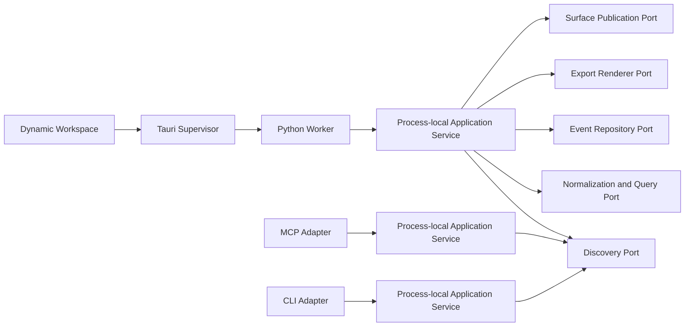
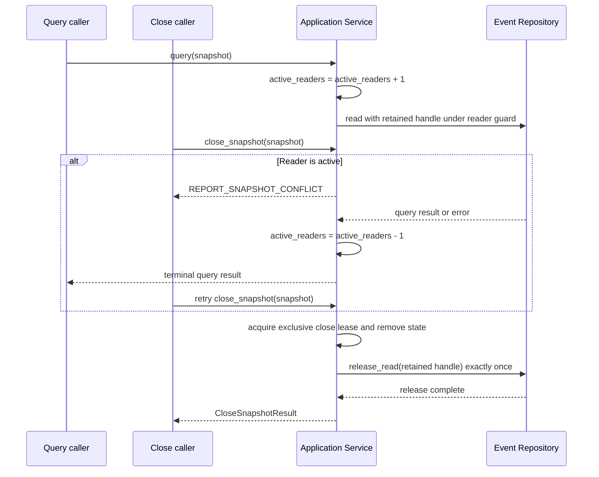
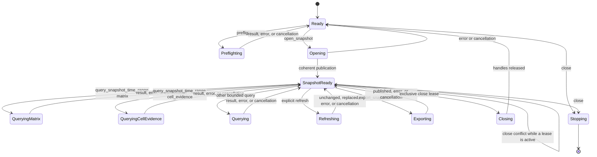
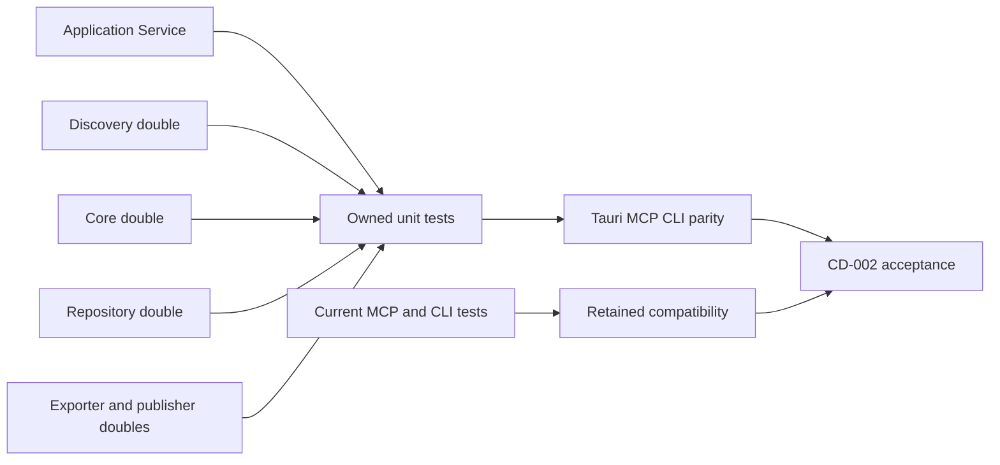

<!--
Copyright (c) 2026 Martin.Bechard@DevConsult.ca
Artifact-ID: 5b4df4d9-8358-4016-86e9-2f1a98c9b4b1
Created-UTC: 2026-08-12T15:00:04Z
Creating-Agent: Dev Documentation Writer
Runtime: Codex
Dispatched-Model: gpt-5.6-sol
Reasoning-Effort: medium
Task-ID: /root/design_application_service
Artifact-ID-Evidence: runtime-supplied
Created-UTC-Evidence: runtime-supplied
Creating-Agent-Evidence: runtime-supplied
Runtime-Evidence: runtime-supplied
Dispatched-Model-Evidence: runtime-supplied
Reasoning-Effort-Evidence: runtime-supplied
Task-ID-Evidence: runtime-supplied
-->

# Shared Report Application Service Design

## Current Understanding

The Shared Report Application Service gives Tauri, CLI, and MCP one Python boundary for dynamic report semantics. Each entry point constructs one process-local service instance. No entry point shares mutable service state with another process.

The module has one primary responsibility: it validates and coordinates scope, snapshot, query, refresh, export, and close operations across accepted dependency ports. It also returns bounded data-transfer objects and structured errors with the same meaning on each entry point.

The module does not own normalized-cache schema or transactions, worker transport, native process control, UI rendering, or export rendering. It coordinates those owners through typed ports.

The initial dynamic scope is Codex-only. The Tauri workspace, explicit CLI streamlined export, and MCP snapshot tools use the same service semantics. The service contract includes the complete Workspace filter, sort, summary, Heatmap matrix, selected-cell evidence, sequence, coordination, detail, refresh, close, and streamlined export semantics. The current classic CLI path and MCP `generate_report` remain adapter-and-renderer compatibility paths outside this service export operation. MCP forensic operations do not require export.

The Heatmap uses one additive, discriminated `query_snapshot_time_range` operation family. A `matrix` request returns only matrix data. A `cell_evidence` request returns only the selected row-period evidence ledger. Both variants derive their `snapshot_id` and `revision_id` from the same retained snapshot-revision handle and use one shared pure semantic calculation over its parsed run.

This design documents the implemented module. Its design mode is **EXISTING_IMPLEMENTATION**.

## Authoritative Sources

The permitted source inventory is complete for this implemented module.

| Source category | Durable source | Authority in this design |
| --- | --- | --- |
| Accepted functional specification | [FR-001](../../requirements/functional/FR-001-agent-report-dynamic-app-and-static-export.md) | Actor-visible operations, selectors, limits, privacy, errors, states, and acceptance behavior |
| Accepted architecture | [ARC-001](../../architecture/ARC-001-agent-report-dynamic-app-and-static-export.md) | ARC-01 through ARC-16, layer direction, local-only execution, and per-process composition |
| Owning high-level design | [HLD-003](../high-level/HLD-003-agent-report-dynamic-app-and-static-export.md) | Application Service ownership, OP-16 through OP-30, CR-03 through CR-13, shared shapes, placement, and implementation order |
| Accepted decisions | Dev Architect reconciliation packet accepted for `/root/report_app_architecture` | Full Workspace semantics, generic Worker transport, cryptographic operation IDs, structured diagnostics, native registries, lifecycle results, and retained-plus-snapshot MCP surfaces |
| Resolved product decisions | Runtime-supplied user decisions on 2026-08-12 | Preserved classic CLI and MCP `generate_report`, separate shared streamlined directory/summary export, Codex-only initial dynamics, Tauri-only workspace, independent local MCP and CLI, and no standalone browser |
| Backlog requirement | [Modularize report tool for concurrent maintenance](../../future-ideas/modularize-report-tool-for-concurrent-maintenance.md) | Separation of shared report behavior from large compatibility code |
| Project configuration | [`pyproject.toml`](../../../tools/report/pyproject.toml) | Python 3.11 or later, package boundary, test runner, and installed entry points |
| Current implementation | [`application_service.py`](../../../tools/report/src/agent_report/application_service.py) | Implemented service contracts, DTOs, state, validation, Heatmap semantics, and dependency boundaries |
| Current owned tests | [`test_application_service.py`](../../../tools/report/tests/test_application_service.py) | Implemented unit and contract coverage for this component |
| Relevant technology guidance | Python standard library typing, dataclasses, threading, HMAC, JSON, and base64url facilities | Allowed implementation mechanisms within the accepted Python boundary |
| Current compatibility evidence | [`mcp_server.py`](../../../tools/report/src/agent_report/mcp_server.py), [`mcp_report.py`](../../../tools/report/src/agent_report/mcp_report.py), [`cli.py`](../../../tools/report/src/agent_report/cli.py) | Current MCP and CLI contracts only; not authority for intended snapshot operations |
| Current test evidence | [`test_mcp_server.py`](../../../tools/report/tests/test_mcp_server.py), [`test_mcp_report.py`](../../../tools/report/tests/test_mcp_report.py), [`test_cli.py`](../../../tools/report/tests/test_cli.py) | Retained surface behavior only |
| Accepted Heatmap delivery plan | [`PLAN-012`](../../plans/PLAN-012-agent-report-dynamic-heatmap-parity.json), SHA-256 `b711b01c519585aa0c155e7c0025ff796387caab7f46d7b1ec80cbaab1fe8bc2` | Cross-language discriminated union, immutable correlation, semantic algorithms, bounds, no-cache-migration boundary, and verification facets |
| Independent review | [RVW-012](../../reviews/RVW-012-cd-002-agent-report-application-service-checklist.md) | Earlier correction requirements; the superseding decision replaces its additive MCP `generate_report` schema finding with exact-schema preservation |
| Dependency design | [CD-003](CD-003-agent-report-normalized-event-cache.md) | Cache internals remain dependency-owned; this document does not derive its service contract from sibling module designs |
| Procedures | [Agent Report README](../../../tools/report/README.md) | Current commands and packaging context; fresh integrated delivery evidence remains required |

The runtime-supplied user decisions supersede conflicting earlier product choices only for export defaults and modes, initial dynamic adapter scope, workspace runtime, and standalone-browser scope. FR-001 wins for other actor-visible behavior. ARC-001 wins for system constraints. HLD-003 wins for component ownership and cross-module contracts. This design wins only for Application Service internals. Current code wins for statements labeled current behavior.

A specific accepted operation contract governs a general rule for that operation. A true conflict remains open and does not become a module proposition.

## Related Code

The owned implementation is [`tools/report/src/agent_report/application_service.py`](../../../tools/report/src/agent_report/application_service.py).

Existing MCP and CLI files are non-owned callers. CD-002 does not authorize changes to their retained public contracts.

## Related Tests

The owned tests are [`tools/report/tests/test_application_service.py`](../../../tools/report/tests/test_application_service.py).

Current MCP and CLI tests remain compatibility evidence. The Verification section identifies the component and integrated evidence required for delivery.

## Related Backlog Items

- [Modularize report tool for concurrent maintenance](../../future-ideas/modularize-report-tool-for-concurrent-maintenance.md)
- No separate accepted work item for CD-002 is identified.

## Related Wiki Pages

- [FR-001](../../requirements/functional/FR-001-agent-report-dynamic-app-and-static-export.md)
- [ARC-001](../../architecture/ARC-001-agent-report-dynamic-app-and-static-export.md)
- [HLD-003](../high-level/HLD-003-agent-report-dynamic-app-and-static-export.md)
- [CD-001 Codex Rollout Metrics](CD-001-codex-rollout-metrics.md)

No project wiki page is identified. Sibling component designs remain navigational context, not authority for this service contract.

## Open Questions

Only HLD OQ-02 remains open for an adjacent cache-policy branch. The user resolved HLD OQ-01, OQ-03, and OQ-04 for the Application Service scope on 2026-08-12.

The resolved export decision is binding:

- Tauri, explicit CLI streamlined export, and MCP `export_snapshot` use one shared streamlined Codex export operation.
- The snapshot export default is complete offline directory. Bounded summary is an explicit selection.
- CD-002 has one streamlined export operation with only `directory` and `summary` modes. It does not own classic rendering.
- MCP forensic query, event-detail, and snapshot operations are primary workflows. They do not require static export.
- Dynamic snapshot operations are Codex-only in the initial release.
- The dynamic workspace is Tauri-only. MCP and CLI remain independent local clients of the Python service.
- The initial release has no standalone-browser runtime.

| ID | Classification | Decision owner | Affected CD-002 contract or phase | Readiness effect |
| --- | --- | --- | --- | --- |
| HLD OQ-02: What event-cache quota and retention policy applies? | Blocking only for production maintenance defaults | Product owner with Dev Architect review | No CD-002 operation owns cache maintenance; `close_snapshot` releases handles without purging | CD-002 implementation is ready; production purge defaults are blocked |

The retained MCP tools keep their current names, exact schemas, defaults, response shapes, selection rules, limits, and error meanings. In particular, `generate_report` does not add `report_mode`, `include_children`, or `include_collaborators`. CD-002 adds separate snapshot operations, including streamlined `export_snapshot`, without changing retained `generate_report`, `query_time_range`, or `get_event_details`.

## Maintenance Notes

Recheck this design when FR-001 operations, ARC-001 constraints, HLD-003 CR boundaries, privacy rules, query limits, error codes, dependency ports, or retained MCP signatures change. Recheck every symbol ledger row when the owned implementation or test file changes.

The latest meaningful source review is 2026-08-13. The configured terminology snapshot reported `terminology.md` as absent at revision `d801aa1fb7ddcc330a5e3173372ea6af4a3d08ec58074478e85aa5603e926658`.

## Requirements Coverage

| Requirement source and ID | Claim mode | Required outcome | Satisfying contract, rule, state, or error path | Status | Out-of-scope authority, rationale, and owning artifact | Verification |
| --- | --- | --- | --- | --- | --- | --- |
| Task assignment and HLD-003 Application Service component | INTENDED_BEHAVIOR | Own exact shared operations, scope, snapshots, limits, structured errors, privacy, and semantic parity for Tauri, MCP, and CLI through separate process-local instances | `ApplicationService`, `create_application_service`, operation ledger, invariants | DEFINED | Cache internals, worker transport, UI, and export rendering remain with HLD-003 sibling components | `test_process_local_composition_has_no_shared_mutable_state`, parity matrix |
| FR-001 FR-02; HLD OP-16 | INTENDED_BEHAVIOR | `preflight_report` resolves root scope with independent child and collaborator flags, returns bounded counts, and creates no snapshot | `PreflightReportRequest`, `PreflightResult`; `Ready -> Preflighting -> Ready` | DEFINED | Discovery scanning and metadata cache belong to Discovery under ARC-04 and ARC-08 | Preflight scope, staleness, cancellation, and no-mutation tests |
| FR-001 FR-02; HLD OP-17 | INTENDED_BEHAVIOR | `open_snapshot` consumes an accepted preflight binding and returns one coherent opaque snapshot | `OpenSnapshotRequest`, `SnapshotMetadata`; `REPORT_SCOPE_CONFLICT` on changed source | DEFINED | Normalization and atomic revision publication belong to Core and Event Repository | Open, reuse, stale preflight, privacy, and cancellation tests |
| FR-001 FR-03; HLD OP-18 | INTENDED_BEHAVIOR | `get_summary` returns bounded goal, state, scope, metrics, provenance, warnings, and recent activity | `SummaryResult`; query guard | DEFINED | Summary calculations come from the query dependency; UI rendering is CD-005 | Bounded summary and privacy tests |
| FR-001 FR-03; HLD OP-19 through OP-21 | INTENDED_BEHAVIOR | Agent, turn, and event lists use stable operation-specific order, opaque bound cursors, default 100, and accepted page sizes 1 through 500 | Three list request types, three row types, `PageResult`, cursor codec | DEFINED | Virtualization and presentation sort state belong to CD-005 | Page boundaries, stable order, cursor mismatch, and reload tests |
| FR-001 HM-F01 through HM-F15; accepted JFP-HM-01 through JFP-HM-03; HLD-003 DEC-05 and DEC-06 | INTENDED_BEHAVIOR | `query_snapshot_time_range` is one discriminated `matrix|cell_evidence` family. It returns exact-revision classic Heatmap semantics, distinct evidence states, a true available/unavailable scale union, bounded lazy evidence, and supported-resolution coarsening. | `HeatmapSnapshotQueryRequest`, `HeatmapSnapshotQueryResult`, shared pure semantic helper, immutable retained-handle identity, and Heatmap bounds | DEFINED | Retained MCP `query_time_range` remains unchanged. CD-003 stores existing normalized list/detail data but does not migrate Heatmap facets. CD-005 owns interaction and presentation. | HM-F01 through HM-F15 facet tests, JFP-HM-01 through JFP-HM-03 review, correlation, privacy, payload, and retained-schema tests |
| FR-001 FR-03; HLD OP-23 | INTENDED_BEHAVIOR | Sequence queries return bounded delegation and communication rows for an exact snapshot, focus, filter, grouping, and cursor | `SequenceQueryRequest`, `SequenceRow`, `PageResult` | DEFINED | Sequence rendering belongs to CD-005 and CD-006 | Sequence filtering, grouping, cursor, and privacy tests |
| FR-001 FR-03; HLD OP-24 | INTENDED_BEHAVIOR | Coordination queries return evidence-derived rows and label prose-derived decisions as inferred | `CoordinationQueryRequest`, `CoordinationRow`; evidence invariant | DEFINED | Visual grouping belongs to CD-005 | Work-item filter, agent filter, inference-label, and cursor tests |
| FR-001 FR-03; HLD OP-25 | INTENDED_BEHAVIOR | Event detail is lazy, bounded, sanitized, and returns event-not-found without closing the snapshot | `EventDetailsRequest`, `EventDetail`; `REPORT_EVENT_NOT_FOUND` | DEFINED | Disclosure rendering belongs to CD-005; raw normalization belongs to Core | Malformed, stale, absent, bounded, ciphertext, and redaction tests |
| FR-001 FR-04; HLD OP-26 | INTENDED_BEHAVIOR | Refresh is explicit, compares current revisions, publishes only a coherent replacement, and preserves the last coherent revision on failure or cancellation | `refresh_snapshot`; per-snapshot mutation guard; conflict and cancellation errors | DEFINED | Forced termination belongs to Tauri Supervisor; repository rollback belongs to CD-003 | Unchanged, changed, conflict, cancel, failure, and concurrent-mutation tests |
| FR-001 FR-05 and Export Rules; HLD OP-27 and OP-28; superseding user decision 2026-08-12 | INTENDED_BEHAVIOR | One shared streamlined export operation serves Tauri, explicit CLI choices, and MCP `export_snapshot`. Snapshot export defaults to `directory`; `summary` is explicit. These are the only accepted streamlined modes. Target intent, replace intent, staging, and atomic publication remain required. Forensic MCP query/detail/snapshot operations require no export. | `resolve_automation_export_mode`, `ExportSnapshotRequest`, export phase ledger, `ExportResult` | DEFINED | Classic rendering stays in `run-timeline.py` and retained adapters. Streamlined content, staging layout, manifest internals, and rendering belong to CD-006; target authority belongs to the surface publisher | Snapshot-default, explicit-summary, unsupported-mode, no-export forensic, cancellation, prior-target, warning, publisher-failure, and classic-bypass tests |
| FR-001 Operation Inventory `close_snapshot` and Report States `Closed`; HLD-003 OP-30 | INTENDED_BEHAVIOR | `close_snapshot` releases process-local live handles only after it proves that no query or mutation uses them. It leaves policy-controlled cache data intact. | `_ReadLease`, `_MutationLease`, `CloseSnapshotRequest`, `CloseSnapshotResult`; `SnapshotReady -> Closing -> Ready` | DEFINED | Cache retention and purge belong to CD-003 and OQ-02 policy | Idempotent close, query-close race, mutation-close race, shutdown-drain, and cache-retention tests |
| ARC-03; HLD CR-03 through CR-05 | INTENDED_BEHAVIOR | Tauri worker, MCP server, and CLI construct separate service instances with identical semantics | Explicit factory and dependency bundle; no singleton | DEFINED | Adapter construction calls remain in caller-owned files | Factory, isolation, and normalized parity tests |
| ARC-13; FR-001 FR-07; HLD OP-13 through OP-15; superseding user decision 2026-08-12 | CURRENT_BEHAVIOR and INTENDED_BEHAVIOR | Preserve the current three MCP tools and independent startup. Keep the exact `generate_report` parameter list and defaults. Add snapshot tools as separate operations. | Retained-tool exact-schema ledger; snapshot `ExportMode`; adapter mapping | DEFINED | Existing MCP adapter and classic renderer own retained `ReportGenerator` behavior. CD-002 owns only the additive snapshot operations. | Existing MCP suite, exact schema/default comparison, classic bundle and inline regression, additive snapshot export modes, and no-export forensic flow |
| ARC-06, ARC-07, ARC-08, ARC-14, ARC-15 | INTENDED_BEHAVIOR | Keep sources read-only, return privacy-bounded DTOs, disclose no cache path, keep ciphertext opaque, and preserve coherent state on cancellation or failure | Dependency contracts, sanitization gate, error redaction, commit ordering, invariants | DEFINED | Source parsing and cache representation belong to Core, Discovery, and CD-003 | Privacy, source immutability, cache-path absence, ciphertext, and fault-injection tests |
| HLD target exclusion: cache internals | INTENDED_BEHAVIOR | CD-002 coordinates repository operations without defining schema, migration SQL, WAL internals, quota, or purge | `EventRepositoryPort` only | OUT_OF_SCOPE | HLD-003 assigns these details to CD-003 | Port contract tests with repository doubles |
| HLD target exclusion: worker transport and native cancellation | INTENDED_BEHAVIOR | CD-002 accepts cancellation checks and reports terminal semantics without owning JSONL framing or process termination | `CancellationToken`, `ProgressSink`; no transport symbol | OUT_OF_SCOPE | HLD-003 assigns protocol and process control to CD-004 | Cooperative-cancellation tests; CD-004 integration later |
| HLD target exclusion: UI and export rendering | INTENDED_BEHAVIOR | CD-002 returns DTOs and coordinates exporter and publisher ports without rendering | DTO types, `ExportRendererPort`, `PublicationPort` | OUT_OF_SCOPE | HLD-003 assigns UI to CD-005 and static rendering to CD-006 | DTO contract and boundary-double tests |
| Superseding user decision: non-Codex static backends | INTENDED_BEHAVIOR | Existing non-Codex static backends remain separate from the shared Codex snapshot and export service | No CD-002 operation or dependency port | OUT_OF_SCOPE | Existing CLI compatibility adapters retain non-Codex static ownership | Existing non-Codex CLI regression tests |

## Runtime Path

The primary runtime path is `tools/report/src/agent_report/application_service.py`. Its Python namespace is `agent_report.application_service`. The package entry points call `create_application_service`; the module has no executable main entry point.

```text
tools/report/
├── src/
│   └── agent_report/
│       └── application_service.py
└── tests/
    └── test_application_service.py
```

No owned configuration, fixture, resource, migration, generated, or script file is planned. Tests use in-file boundary doubles and `tmp_path`; durable shared fixtures remain owned by their existing test families.

### Implementation-Placement And Symbol Ledger

| Leaf | Namespace | Declared symbols | Responsibility |
| --- | --- | --- | --- |
| `application_service.py` | `agent_report.application_service` | Constants, literal aliases, immutable request/result DTOs, typed dependency failures, port protocols, `ApplicationServiceConfig`, `ApplicationServiceDependencies`, `ApplicationService`, `create_application_service`, `resolve_automation_export_mode`, `_query_heatmap_semantics`, and private state/token/lease helpers listed below | Shared validation, orchestration, state, errors, cursors, export defaults, parsed-run Heatmap semantics, and parity semantics |
| `test_application_service.py` | `tests.test_application_service` | Boundary doubles and every exact `test_*` target in Verification | Unit and contract verification for CD-002 |

The production module declares these constants and aliases:

```python
PROTOCOL_VERSION: Final[int] = 1
DEFAULT_PAGE_SIZE: Final[int] = 100
MAX_PAGE_SIZE: Final[int] = 500
MAX_HEATMAP_CELLS: Final[int] = 2_000
MAX_HEATMAP_EVIDENCE_ITEMS: Final[int] = 100
MAX_WORKER_RESULT_BYTES: Final[int] = 1_048_576
MAX_HEATMAP_FORMATTED_VALUE_BYTES: Final[int] = 64
MAX_HEATMAP_LABEL_BYTES: Final[int] = 256
MAX_HEATMAP_SUPPORTING_TEXT_BYTES: Final[int] = 80
MAX_HEATMAP_PREVIEW_BYTES: Final[int] = 4_096
MAX_HEATMAP_PROVENANCE_ITEMS: Final[int] = 32
MAX_HEATMAP_PROVENANCE_BYTES: Final[int] = 256
MAX_ID_BYTES: Final[int] = 256
MAX_FILTER_VALUES: Final[int] = 500
MAX_TEXT_BYTES: Final[int] = 4_096
MAX_DETAIL_FIELD_BYTES: Final[int] = 16_384
MAX_WARNINGS: Final[int] = 100
MAX_PROVENANCE_ITEMS: Final[int] = 100
MAX_RECENT_ACTIVITY: Final[int] = 100

ReportErrorCode = Literal[
    "REPORT_CANCELLED",
    "REPORT_CURSOR_CONFLICT",
    "REPORT_DISCOVERY_FAILED",
    "REPORT_EVENT_NOT_FOUND",
    "REPORT_EXPORT_FAILED",
    "REPORT_GENERATION_FAILED",
    "REPORT_INTERNAL_ERROR",
    "REPORT_INVALID_REQUEST",
    "REPORT_NOT_FOUND",
    "REPORT_PRIVACY_FAILED",
    "REPORT_SCOPE_CONFLICT",
    "REPORT_SNAPSHOT_CONFLICT",
    "REPORT_SNAPSHOT_NOT_FOUND",
    "REPORT_WRITE_FAILED",
]
EvidenceKind = Literal["measured", "derived", "inferred", "unavailable", "estimated"]
SnapshotMode = Literal["live", "sealed"]
ExportMode = Literal["directory", "summary"]
AutomationSurface = Literal["tauri", "cli", "mcp"]
SequenceGrouping = Literal["none", "repeated_messages", "delegation", "agent"]
SortDirection = Literal["ascending", "descending"]
AgentSortKey = Literal["last_activity_at", "started_at", "agent_id"]
TurnSortKey = Literal["started_at", "ended_at", "turn_id"]
EventSortKey = Literal["occurred_at", "event_id"]
SequenceSortKey = Literal["occurred_at", "sequence_id"]
CoordinationSortKey = Literal["occurred_at", "coordination_id"]
HeatmapMode = Literal["wall_time", "tokens", "models"]
HeatmapQueryKind = Literal["matrix", "cell_evidence"]
HeatmapValueState = Literal["measured", "derived", "partial", "unavailable"]
HeatmapScaleAvailability = Literal["available", "unavailable"]
HeatmapScaleBasis = Literal["visible_row_maximum", "context_window_capacity"]
HeatmapRowKind = Literal["runtime_state", "token_measure", "model", "cost"]
HeatmapRowOrder = Literal[
    "runtime_state_contract",
    "token_contract",
    "model_first_occurrence_then_cost",
]
HeatmapEvidenceMethod = Literal[
    "measured",
    "derived",
    "inferred",
    "estimated",
    "unavailable",
]
HeatmapResolutionMinutes = Literal[1, 5, 15, 30, 60]
```

`HeatmapPricingAuthority` is the immutable per-response cost-assessment snapshot. Normalization calls the classic `_cost_for_response(thread, response)` exactly once for every response in stable run order and converts the result to one bounded assessment. The authority records the accepted pricing version and digest plus an ordered complete `(thread_index, response_index, assessment)` tuple. Query processing must use this snapshot and must not call `_cost_for_response`, reload pricing, or recalculate a response assessment.

The production module declares these public common types. All dataclasses are frozen and use slots.

```python
@dataclass(frozen=True, slots=True)
class HeatmapCostAssessment:
    value_usd: float | None
    evidence_method: HeatmapEvidenceMethod
    bounded_method: str

@dataclass(frozen=True, slots=True)
class HeatmapPricingAuthority:
    pricing_version: str
    pricing_digest: str
    assessments: tuple[tuple[int, int, HeatmapCostAssessment], ...]

    def lookup(self, thread_index: int, response_index: int) -> HeatmapCostAssessment | None: raise NotImplementedError

@dataclass(frozen=True, slots=True)
class WarningRecord:
    code: str
    message: str

@dataclass(frozen=True, slots=True)
class ReportError:
    code: ReportErrorCode
    message: str
    recoverable: bool
    operation_id: str | None = None
    current_source_revision: str | None = None
    preflight_required: bool = False
    restart_from_first_page: bool = False

T = TypeVar("T")
F = TypeVar("F")
S = TypeVar("S")

@dataclass(frozen=True, slots=True)
class ServiceResult(Generic[T]):
    ok: bool
    value: T | None = None
    error: ReportError | None = None

@dataclass(frozen=True, slots=True)
class OperationContext:
    protocol_version: int
    operation_id: str

class CancellationToken(Protocol):
    def is_cancelled(self) -> bool: raise NotImplementedError

ProgressSink = Callable[[str, int, int | None, str], None]
```

Every caller creates `operation_id` from 96 cryptographically secure random bits and encodes it as `op_` plus 24 lowercase hexadecimal characters. Sequential counters, timestamps, `Math.random`, and other predictable sources are invalid. The service validates the spelling before dependency work. It does not generate or rewrite a caller operation ID.

`ServiceResult` always contains exactly one of `value` and `error`. Safe errors never contain raw records, input arguments, source paths, staging paths, cache paths, or exception text that a dependency did not classify as safe.

The module owns these request types:

```python
@dataclass(frozen=True, slots=True)
class ReportScope:
    root_thread_id: str
    include_children: bool = False
    include_collaborators: bool = False

@dataclass(frozen=True, slots=True)
class PreflightReportRequest:
    scope: ReportScope

@dataclass(frozen=True, slots=True)
class OpenSnapshotRequest:
    scope: ReportScope
    preflight_token: str

@dataclass(frozen=True, slots=True)
class SnapshotRequest:
    snapshot_id: str

@dataclass(frozen=True, slots=True)
class AgentFilters:
    query: str = ""
    state: str | None = None

@dataclass(frozen=True, slots=True)
class AgentSort:
    key: AgentSortKey = "last_activity_at"
    direction: SortDirection = "descending"
    tie_break_key: Literal["agent_id"] = "agent_id"
    tie_break_direction: Literal["ascending"] = "ascending"

@dataclass(frozen=True, slots=True)
class TurnFilters:
    agent_id: str | None = None
    state: str | None = None

@dataclass(frozen=True, slots=True)
class TurnSort:
    key: TurnSortKey = "started_at"
    direction: SortDirection = "ascending"
    tie_break_key: Literal["turn_id"] = "turn_id"
    tie_break_direction: Literal["ascending"] = "ascending"

@dataclass(frozen=True, slots=True)
class EventFilters:
    agent_id: str | None = None
    turn_id: str | None = None
    kind: str | None = None
    from_time: datetime | None = None
    to_time: datetime | None = None

@dataclass(frozen=True, slots=True)
class EventSort:
    key: EventSortKey = "occurred_at"
    direction: SortDirection = "ascending"
    tie_break_key: Literal["event_id"] = "event_id"
    tie_break_direction: Literal["ascending"] = "ascending"

@dataclass(frozen=True, slots=True)
class ListAgentsRequest:
    snapshot_id: str
    filters: AgentFilters = AgentFilters()
    sort: AgentSort = AgentSort()
    cursor: str | None = None
    page_size: int = DEFAULT_PAGE_SIZE

@dataclass(frozen=True, slots=True)
class ListTurnsRequest:
    snapshot_id: str
    filters: TurnFilters = TurnFilters()
    sort: TurnSort = TurnSort()
    cursor: str | None = None
    page_size: int = DEFAULT_PAGE_SIZE

@dataclass(frozen=True, slots=True)
class ListEventsRequest:
    snapshot_id: str
    filters: EventFilters = EventFilters()
    sort: EventSort = EventSort()
    cursor: str | None = None
    page_size: int = DEFAULT_PAGE_SIZE

@dataclass(frozen=True, slots=True)
class HeatmapMatrixRequest:
    snapshot_id: str
    query_kind: Literal["matrix"]
    from_time: datetime
    to_time: datetime
    mode: HeatmapMode
    requested_resolution_minutes: HeatmapResolutionMinutes
    maximum_rows: int

@dataclass(frozen=True, slots=True)
class HeatmapCellEvidenceRequest:
    snapshot_id: str
    query_kind: Literal["cell_evidence"]
    mode: HeatmapMode
    row_id: str
    period_start_time: datetime
    period_end_time: datetime

HeatmapSnapshotQueryRequest = HeatmapMatrixRequest | HeatmapCellEvidenceRequest

@dataclass(frozen=True, slots=True)
class SequenceFilters:
    focus_agent_id: str | None = None
    event_kinds: Sequence[str] = ()
    grouping: SequenceGrouping = "none"
    include_reasoning: bool = False

@dataclass(frozen=True, slots=True)
class SequenceSort:
    key: SequenceSortKey = "occurred_at"
    direction: Literal["ascending"] = "ascending"
    tie_break_key: Literal["sequence_id"] = "sequence_id"
    tie_break_direction: Literal["ascending"] = "ascending"

@dataclass(frozen=True, slots=True)
class SequenceQueryRequest:
    snapshot_id: str
    filters: SequenceFilters = SequenceFilters()
    sort: SequenceSort = SequenceSort()
    cursor: str | None = None
    page_size: int = DEFAULT_PAGE_SIZE

@dataclass(frozen=True, slots=True)
class CoordinationFilters:
    work_item_id: str | None = None
    delegated_root_id: str | None = None
    agent_id: str | None = None
    operation: str | None = None
    evidence: EvidenceKind | None = None

@dataclass(frozen=True, slots=True)
class CoordinationSort:
    key: CoordinationSortKey = "occurred_at"
    direction: Literal["ascending"] = "ascending"
    tie_break_key: Literal["coordination_id"] = "coordination_id"
    tie_break_direction: Literal["ascending"] = "ascending"

@dataclass(frozen=True, slots=True)
class CoordinationQueryRequest:
    snapshot_id: str
    filters: CoordinationFilters = CoordinationFilters()
    sort: CoordinationSort = CoordinationSort()
    cursor: str | None = None
    page_size: int = DEFAULT_PAGE_SIZE

@dataclass(frozen=True, slots=True)
class EventDetailsRequest:
    snapshot_id: str
    event_id: str

@dataclass(frozen=True, slots=True)
class RefreshSnapshotRequest:
    snapshot_id: str

@dataclass(frozen=True, slots=True)
class ExportSnapshotRequest:
    snapshot_id: str
    surface: AutomationSurface
    target: Path
    replace: bool
    mode: ExportMode | None = None
    include_sqlite_archive: bool = False

@dataclass(frozen=True, slots=True)
class ResolvedExportRequest:
    snapshot_id: str
    surface: AutomationSurface
    target: Path
    replace: bool
    mode: ExportMode
    include_sqlite_archive: bool

@dataclass(frozen=True, slots=True)
class CloseSnapshotRequest:
    snapshot_id: str
```

The module owns these response rows and result types:

```python
@dataclass(frozen=True, slots=True)
class PreflightResult:
    preflight_token: str
    root_thread_id: str
    include_children: bool
    include_collaborators: bool
    source_revision: str
    log_count: int
    total_bytes: int
    child_count: int
    collaborator_count: int
    cached_file_count: int
    changed_file_count: int
    known_event_count: int | None
    warnings: Sequence[WarningRecord]

@dataclass(frozen=True, slots=True)
class SnapshotMetadata:
    protocol_version: int
    snapshot_id: str
    revision: str
    root_thread_id: str
    include_children: bool
    include_collaborators: bool
    source_revision: str
    parser_version: str
    pricing_digest: str
    formatter_digest: str
    observation_time: datetime
    mode: SnapshotMode
    warnings: Sequence[WarningRecord]

@dataclass(frozen=True, slots=True)
class MetricValue:
    metric_id: str
    label: str
    display_value: str
    evidence: EvidenceKind
    description: str | None

@dataclass(frozen=True, slots=True)
class MetricGroup:
    group_id: Literal["overview", "model", "context", "inference", "runtime", "waits", "work_items", "claims", "provenance"]
    label: str
    metrics: Sequence[MetricValue]

@dataclass(frozen=True, slots=True)
class TimeRange:
    from_time: datetime
    to_time: datetime

@dataclass(frozen=True, slots=True)
class SignificantActivity:
    event_id: str
    occurred_at: datetime
    label: str
    evidence: EvidenceKind

@dataclass(frozen=True, slots=True)
class SummaryResult:
    snapshot_id: str
    revision: str
    title: str
    goal: str | None
    state: str
    scope_label: str
    observed_at: datetime
    live: bool
    time_range: TimeRange
    metric_groups: Sequence[MetricGroup]
    recent_activity: Sequence[SignificantActivity]
    warnings: Sequence[WarningRecord]

@dataclass(frozen=True, slots=True)
class AgentRow:
    agent_id: str
    nickname: str | None
    role: str | None
    state: str
    started_at: datetime | None
    last_activity_at: datetime | None
    turn_count: int
    event_count: int

@dataclass(frozen=True, slots=True)
class TurnRow:
    turn_id: str
    agent_id: str
    started_at: datetime
    ended_at: datetime | None
    state: str
    event_count: int
    summary: str | None

@dataclass(frozen=True, slots=True)
class EventRow:
    event_id: str
    occurred_at: datetime
    agent_id: str | None
    turn_id: str | None
    kind: str
    label: str
    evidence: EvidenceKind
    source_key: str | None
    has_detail: bool

@dataclass(frozen=True, slots=True)
class AvailableHeatmapScale:
    availability: Literal["available"]
    minimum: int | float
    maximum: int | float
    basis: HeatmapScaleBasis

@dataclass(frozen=True, slots=True)
class UnavailableHeatmapScale:
    availability: Literal["unavailable"]
    reason: Literal["context_capacity_unavailable"]

HeatmapScale = AvailableHeatmapScale | UnavailableHeatmapScale

@dataclass(frozen=True, slots=True)
class HeatmapMatrixCell:
    start_time: datetime
    end_time: datetime
    value: int | float | None
    formatted_value: str
    value_state: HeatmapValueState
    applicable_zero: bool
    contributing_evidence_count: int
    normalized_intensity: float | None
    supporting_text: str | None

@dataclass(frozen=True, slots=True)
class HeatmapMatrixRow:
    row_id: str
    row_key: str
    row_order_index: int
    row_kind: HeatmapRowKind
    label: str
    scale: HeatmapScale
    cells: Sequence[HeatmapMatrixCell]

@dataclass(frozen=True, slots=True)
class HeatmapEvidenceItem:
    event_id: str | None
    occurred_at: datetime
    value: int | float | None
    formatted_value: str
    duration_ms: int | None
    label: str
    preview: str | None
    evidence_method: HeatmapEvidenceMethod
    value_state: HeatmapValueState
    has_detail: bool

@dataclass(frozen=True, slots=True)
class SequenceRow:
    sequence_id: str
    group_id: str | None
    occurred_at: datetime
    from_agent_id: str | None
    from_agent_label: str | None
    to_agent_id: str | None
    to_agent_label: str | None
    kind: str
    label: str
    evidence: EvidenceKind
    event_id: str | None
    repeat_count: int
    reasoning_available: bool

@dataclass(frozen=True, slots=True)
class SequenceGroup:
    group_id: str
    parent_group_id: str | None
    depth: int
    label: str
    collapsible: bool

@dataclass(frozen=True, slots=True)
class CoordinationRow:
    coordination_id: str
    occurred_at: datetime
    work_item_id: str | None
    delegated_root_id: str | None
    agent_id: str | None
    operation: str
    label: str
    evidence: EvidenceKind
    event_id: str | None

@dataclass(frozen=True, slots=True)
class Disclosure:
    label: str
    content: str
    redacted: bool

@dataclass(frozen=True, slots=True)
class EventDetail:
    snapshot_id: str
    revision: str
    event_id: str
    occurred_at: datetime
    kind: str
    title: str
    evidence: EvidenceKind
    provenance: Sequence[str]
    summary: str | None
    disclosures: Sequence[Disclosure]
    source_key: str | None

@dataclass(frozen=True, slots=True)
class PageResult(Generic[T, F, S]):
    snapshot_id: str
    revision: str
    operation: str
    items: Sequence[T]
    applied_filters: F
    applied_sort: S
    page_size: int
    next_cursor: str | None

@dataclass(frozen=True, slots=True)
class HeatmapMatrixResult:
    snapshot_id: str
    revision_id: str
    query_kind: Literal["matrix"]
    mode: HeatmapMode
    from_time: datetime
    to_time: datetime
    requested_resolution_minutes: HeatmapResolutionMinutes
    actual_resolution_minutes: HeatmapResolutionMinutes
    maximum_rows: int
    omitted_row_count: int
    row_order: HeatmapRowOrder
    total_cell_count: int
    rows: Sequence[HeatmapMatrixRow]
    provenance: Sequence[str]

@dataclass(frozen=True, slots=True)
class HeatmapCellEvidenceResult:
    snapshot_id: str
    revision_id: str
    query_kind: Literal["cell_evidence"]
    mode: HeatmapMode
    row_id: str
    row_key: str
    row_order_index: int
    row_label: str
    period_start_time: datetime
    period_end_time: datetime
    value: int | float | None
    formatted_value: str
    value_state: HeatmapValueState
    applicable_zero: bool
    evidence_items: Sequence[HeatmapEvidenceItem]
    omitted_evidence_count: int
    provenance: Sequence[str]

HeatmapSnapshotQueryResult = HeatmapMatrixResult | HeatmapCellEvidenceResult

@dataclass(frozen=True, slots=True)
class SequenceResult:
    page: PageResult[SequenceRow, SequenceFilters, SequenceSort]
    groups: Sequence[SequenceGroup]

@dataclass(frozen=True, slots=True)
class RefreshSnapshotResult:
    changed: bool
    snapshot: SnapshotMetadata

@dataclass(frozen=True, slots=True)
class ExportOmission:
    section: str
    reason: str
    recovery: str

@dataclass(frozen=True, slots=True)
class ExportResult:
    operation_id: str
    snapshot_id: str
    revision: str
    mode: ExportMode
    published_target: Path
    manifest_sha256: str | None
    file_count: int
    total_byte_count: int
    warnings: Sequence[WarningRecord]
    omissions: Sequence[ExportOmission]

@dataclass(frozen=True, slots=True)
class CloseSnapshotResult:
    snapshot_id: str
    closed: bool
```

The public service signatures are exact:

```python
class ApplicationService:
    def __init__(self, config: ApplicationServiceConfig, dependencies: ApplicationServiceDependencies) -> None: raise NotImplementedError
    def preflight_report(self, context: OperationContext, request: PreflightReportRequest, *, cancellation: CancellationToken, progress: ProgressSink | None = None) -> ServiceResult[PreflightResult]: raise NotImplementedError
    def open_snapshot(self, context: OperationContext, request: OpenSnapshotRequest, *, cancellation: CancellationToken, progress: ProgressSink | None = None) -> ServiceResult[SnapshotMetadata]: raise NotImplementedError
    def get_summary(self, context: OperationContext, request: SnapshotRequest, *, cancellation: CancellationToken) -> ServiceResult[SummaryResult]: raise NotImplementedError
    def list_agents(self, context: OperationContext, request: ListAgentsRequest, *, cancellation: CancellationToken) -> ServiceResult[PageResult[AgentRow, AgentFilters, AgentSort]]: raise NotImplementedError
    def list_turns(self, context: OperationContext, request: ListTurnsRequest, *, cancellation: CancellationToken) -> ServiceResult[PageResult[TurnRow, TurnFilters, TurnSort]]: raise NotImplementedError
    def list_events(self, context: OperationContext, request: ListEventsRequest, *, cancellation: CancellationToken) -> ServiceResult[PageResult[EventRow, EventFilters, EventSort]]: raise NotImplementedError
    def query_snapshot_time_range(self, context: OperationContext, request: HeatmapSnapshotQueryRequest, *, cancellation: CancellationToken) -> ServiceResult[HeatmapSnapshotQueryResult]: raise NotImplementedError
    def query_sequence(self, context: OperationContext, request: SequenceQueryRequest, *, cancellation: CancellationToken) -> ServiceResult[SequenceResult]: raise NotImplementedError
    def query_coordination(self, context: OperationContext, request: CoordinationQueryRequest, *, cancellation: CancellationToken) -> ServiceResult[PageResult[CoordinationRow, CoordinationFilters, CoordinationSort]]: raise NotImplementedError
    def get_event_details(self, context: OperationContext, request: EventDetailsRequest, *, cancellation: CancellationToken) -> ServiceResult[EventDetail]: raise NotImplementedError
    def refresh_snapshot(self, context: OperationContext, request: RefreshSnapshotRequest, *, cancellation: CancellationToken, progress: ProgressSink | None = None) -> ServiceResult[RefreshSnapshotResult]: raise NotImplementedError
    def export_snapshot(self, context: OperationContext, request: ExportSnapshotRequest, *, cancellation: CancellationToken, progress: ProgressSink | None = None) -> ServiceResult[ExportResult]: raise NotImplementedError
    def close_snapshot(self, context: OperationContext, request: CloseSnapshotRequest) -> ServiceResult[CloseSnapshotResult]: raise NotImplementedError
    def close(self) -> None: raise NotImplementedError

def create_application_service(config: ApplicationServiceConfig, dependencies: ApplicationServiceDependencies) -> ApplicationService: raise NotImplementedError

def resolve_automation_export_mode(surface: AutomationSurface, requested_mode: ExportMode | None) -> ServiceResult[ExportMode]: raise NotImplementedError
```

The private implementation contract is complete below. No other file imports these symbols.

```python
_SnapshotStatus = Literal["ready", "refreshing", "exporting", "closing", "closed"]

@dataclass(frozen=True, slots=True)
class _PreflightClaims:
    scope: ReportScope
    source_revision: str
    parser_version: str
    pricing_digest: str
    formatter_digest: str

@dataclass(frozen=True, slots=True)
class _CursorClaims:
    snapshot_id: str
    revision_id: str
    operation: str
    filters_digest: str
    sort: str
    page_size: int
    position: str

@dataclass(slots=True)
class _SnapshotState:
    metadata: SnapshotMetadata
    scope: ReportScope
    revision_id: str
    read_handle: SnapshotReadHandle
    status: _SnapshotStatus = "ready"
    active_readers: int = 0
    mutation_active: bool = False

class _OpaqueTokenCodec:
    def __init__(self, integrity_key: bytes) -> None: raise NotImplementedError
    def encode_preflight(self, claims: _PreflightClaims) -> str: raise NotImplementedError
    def decode_preflight(self, token: str) -> _PreflightClaims: raise NotImplementedError
    def encode_cursor(self, claims: _CursorClaims) -> str: raise NotImplementedError
    def decode_cursor(self, token: str) -> _CursorClaims: raise NotImplementedError

class _TokenDecodeError(ValueError):
    pass

class _ReadLease:
    def __init__(self, service: ApplicationService, snapshot_id: str, state: _SnapshotState) -> None: raise NotImplementedError
    @property
    def state(self) -> _SnapshotState: raise NotImplementedError
    @property
    def snapshot_id(self) -> str: raise NotImplementedError
    @property
    def revision_id(self) -> str: raise NotImplementedError
    @property
    def read_handle(self) -> SnapshotReadHandle: raise NotImplementedError
    def __enter__(self) -> _ReadLease: raise NotImplementedError
    def __exit__(self, exc_type: type[BaseException] | None, exc: BaseException | None, traceback: TracebackType | None) -> Literal[False]: raise NotImplementedError

class _MutationLease:
    def __init__(self, service: ApplicationService, snapshot_id: str, state: _SnapshotState, status: Literal["refreshing", "exporting", "closing"]) -> None: raise NotImplementedError
    @property
    def state(self) -> _SnapshotState: raise NotImplementedError
    def __enter__(self) -> _SnapshotState: raise NotImplementedError
    def __exit__(self, exc_type: type[BaseException] | None, exc: BaseException | None, traceback: TracebackType | None) -> Literal[False]: raise NotImplementedError

def _validate_context(context: OperationContext) -> ReportError | None: raise NotImplementedError
def _validate_page(page_size: int, maximum: int) -> ReportError | None: raise NotImplementedError
def _validate_range(from_time: datetime, to_time: datetime) -> ReportError | None: raise NotImplementedError
def _require_snapshot(self: ApplicationService, snapshot_id: str) -> ServiceResult[_SnapshotState]: raise NotImplementedError
def _acquire_read(self: ApplicationService, snapshot_id: str) -> ServiceResult[_ReadLease]: raise NotImplementedError
def _acquire_mutation(self: ApplicationService, snapshot_id: str, status: Literal["refreshing", "exporting", "closing"], *, require_no_readers: bool) -> ServiceResult[_MutationLease]: raise NotImplementedError
def _query_page(self: ApplicationService, request: ListAgentsRequest | ListTurnsRequest | ListEventsRequest | CoordinationQueryRequest, operation: str, filters: F, sort: S, query: Callable[[SnapshotReadHandle, str | None], QuerySlice[T]]) -> ServiceResult[PageResult[T, F, S]]: raise NotImplementedError
def _query_heatmap_semantics(handle: SnapshotReadHandle, request: HeatmapSnapshotQueryRequest, cancellation: CancellationToken) -> HeatmapSnapshotQueryResult: raise NotImplementedError
def _map_dependency_failure(operation_id: str, failure: DependencyFailure) -> ReportError: raise NotImplementedError
def _safe_internal_error(operation_id: str) -> ReportError: raise NotImplementedError
```

`_SnapshotState.read_handle` is one retained immutable snapshot-revision handle. The service creates it during `open_snapshot`, retains it across repeated queries, and releases it only after replacement, `close_snapshot`, or service shutdown.

`_ReadLease` is a separate per-operation reader guard. `_acquire_read` runs under the service condition lock. It requires status `ready` and no active mutation. It captures the retained handle, increments `active_readers`, and returns the guard. A result uses only the captured handle values. `_ReadLease.__exit__` decrements `active_readers` and notifies the condition. It never calls `EventRepositoryPort.release_read`.

`_acquire_mutation` runs under the same lock. Refresh, export, and close use `require_no_readers=True`. They return `REPORT_SNAPSHOT_CONFLICT` without side effects when a reader or mutation exists. `_MutationLease.__exit__` clears `mutation_active`, restores `ready` unless close committed, and notifies the condition.

`ApplicationService.close()` sets the service-wide closed flag before it waits. New leases then fail. Shutdown waits on the condition until all active readers and mutations drain, releases every remaining handle exactly once, marks each state closed, and returns. The composition root must request cancellation before calling `close()` when it needs bounded shutdown time.

## Parent Context

[HLD-003](../high-level/HLD-003-agent-report-dynamic-app-and-static-export.md) owns the dynamic-analysis and static-export subsystem. CD-002 supplies its transport-neutral semantic boundary.



Tauri uses the Worker transport before calling the service. MCP and CLI call their own instance directly or through caller-owned adapters. The service never imports Tauri, FastMCP, `argparse`, webview, or worker-protocol code.

## Responsibilities

The module owns these testable responsibilities:

- Validate protocol version, operation identity, service request fields, query bounds, and snapshot selectors before dependency work.
- Define root-only scope as the default and keep child and collaborator inclusion independent.
- Create and verify opaque preflight tokens, snapshot IDs, and cursor bindings.
- Coordinate read-only preflight, coherent snapshot open, bounded queries, explicit refresh, export, and close.
- Serialize snapshot-mutating work while allowing reads of the last published revision.
- Convert expected dependency failures into stable safe structured errors.
- Enforce bounded DTO, privacy, evidence-label, cache-path, and ciphertext rules before success.
- Preserve semantic parity across process-local Tauri, MCP, and CLI compositions.

The module does not calculate cache schema, frame worker messages, terminate processes, render UI, render static files, or choose adapter diagnostics.

## Callers

| Caller | Purpose | Boundary |
| --- | --- | --- |
| Planned `agent_report.report_worker` | Invoke all service operations for the Tauri Supervisor | CR-03; worker owns JSONL framing and progress envelopes |
| Existing `agent_report.mcp_server` and `agent_report.mcp_report` | Construct an MCP-local service for added snapshot tools while retaining current tools exactly | CR-04; FastMCP schema and current `ReportGenerator` remain caller-owned |
| Existing `agent_report.cli` and `scripts/run-timeline.py` | Construct a CLI-local service for compatible Codex operations | CR-05; `argparse`, exit codes, current backends, and presentation remain caller-owned |
| `tests.test_application_service` | Exercise contracts through deterministic boundary doubles | In-process unit boundary |

CD-005 does not call the service directly. It calls Tauri, which calls CD-004 and then this module.

## Dependencies

The service receives every dependency through `ApplicationServiceDependencies`. Explicit construction keeps the module testable and avoids a process-wide mutable Singleton.

Each port raises only its declared typed failure. The `safe_message` field is already suitable for caller disclosure. It contains no source, cache, staging, or target path and no raw record, argument, result, ciphertext, or exception text.

```python
DiscoveryFailureKind = Literal["not_found", "invalid_root", "protocol", "read", "cancelled"]
NormalizationFailureKind = Literal["source_conflict", "parse", "privacy", "cancelled"]
RepositoryFailureKind = Literal["schema_newer", "binding_conflict", "read", "publish", "cancelled"]
QueryFailureKind = Literal["invalid_request", "event_not_found", "read", "privacy", "cancelled"]
ExportRenderFailureKind = Literal["invalid_request", "privacy", "render", "cancelled"]
PublicationFailureKind = Literal["unauthorized_target", "replace_required", "write", "cancelled"]
InfrastructureFailureKind = Literal["clock", "id_factory", "logging"]

@dataclass(frozen=True, slots=True)
class DiscoveryFailure(Exception):
    kind: DiscoveryFailureKind
    safe_message: str
    recoverable: bool

@dataclass(frozen=True, slots=True)
class NormalizationFailure(Exception):
    kind: NormalizationFailureKind
    safe_message: str
    recoverable: bool
    current_source_revision: str | None = None

@dataclass(frozen=True, slots=True)
class RepositoryFailure(Exception):
    kind: RepositoryFailureKind
    safe_message: str
    recoverable: bool
    current_source_revision: str | None = None

@dataclass(frozen=True, slots=True)
class QueryFailure(Exception):
    kind: QueryFailureKind
    safe_message: str
    recoverable: bool

@dataclass(frozen=True, slots=True)
class ExportRenderFailure(Exception):
    kind: ExportRenderFailureKind
    safe_message: str
    recoverable: bool

@dataclass(frozen=True, slots=True)
class PublicationFailure(Exception):
    kind: PublicationFailureKind
    safe_message: str
    recoverable: bool

@dataclass(frozen=True, slots=True)
class InfrastructureFailure(Exception):
    kind: InfrastructureFailureKind
    safe_message: str
    recoverable: Literal[False] = False

DependencyFailure = DiscoveryFailure | NormalizationFailure | RepositoryFailure | QueryFailure | ExportRenderFailure | PublicationFailure | InfrastructureFailure
```

```python
@dataclass(frozen=True, slots=True)
class ApplicationServiceConfig:
    authorized_source_roots: Sequence[Path]
    parser_version: str
    pricing_digest: str
    formatter_digest: str
    default_page_size: int = DEFAULT_PAGE_SIZE
    max_page_size: int = MAX_PAGE_SIZE
    max_heatmap_cells: int = MAX_HEATMAP_CELLS

@dataclass(frozen=True, slots=True)
class ApplicationServiceDependencies:
    discovery: DiscoveryPort
    normalization: NormalizationPort
    repository: EventRepositoryPort
    queries: QueryPort
    exporter: ExportRendererPort
    publisher: PublicationPort
    clock: ClockPort
    ids: IdFactoryPort
    logger: LoggerPort
```

| Port | Exact required operations | Purpose and ownership limit |
| --- | --- | --- |
| `DiscoveryPort` | `preflight(scope: ReportScope, roots: Sequence[Path], cancellation: CancellationToken, progress: ProgressSink | None) -> DiscoveredScope`; `recheck(scope: ReportScope, roots: Sequence[Path], cancellation: CancellationToken, progress: ProgressSink | None) -> DiscoveredScope` | Sole Rust discovery adapter; returns bounded identity, counts, and source revision without transcript bodies |
| `NormalizationPort` | `normalize(discovered: DiscoveredScope, parser_version: str, pricing_digest: str, formatter_digest: str, cancellation: CancellationToken, progress: ProgressSink | None) -> NormalizedRevision` | Python Core; preserves privacy and evidence semantics and creates one immutable `HeatmapPricingAuthority` by calling classic `_cost_for_response` once per response before repository publication |
| `EventRepositoryPort` | `known_event_count(source_revision: str) -> int | None`; `reuse_or_publish(revision: NormalizedRevision, cancellation: CancellationToken, progress: ProgressSink | None) -> PublishedRevision`; `open_read(snapshot_id: str, revision_id: str, run: CodexRunMetrics, heatmap_pricing: HeatmapPricingAuthority) -> SnapshotReadHandle`; `release_read(handle: SnapshotReadHandle) -> None` | CD-003 owns schema, migration, WAL, transactions, invalidation, physical paths, and binding validation. `open_read` preserves run-and-authority identity and creates one retained snapshot-revision handle. `release_read` ends that retained handle once after replacement or close, not after each query. |
| `QueryPort` | `get_summary`, `list_agents`, `list_turns`, `list_events`, `query_snapshot_time_range`, `query_sequence`, `query_coordination`, and `get_event_details` with the corresponding request/result types and a `SnapshotReadHandle` first parameter | Existing Python report semantics plus one shared pure classic-Heatmap semantic helper. It returns privacy-bounded values only. |
| `ExportRendererPort` | `stage(handle: SnapshotReadHandle, request: ResolvedExportRequest, cancellation: CancellationToken, progress: ProgressSink | None) -> StagedExport` | CD-006 receives a non-optional `summary|directory` mode and owns content, size caps, omissions, manifest layout, staging cleanup, and rendering |
| `PublicationPort` | `publish(staged: StagedExport, target: Path, replace: bool, cancellation: CancellationToken) -> ExportResult`; `discard(staged: StagedExport) -> None` | Surface adapter validates output authority and owns atomic destination replacement |
| `ClockPort` | `now_utc() -> datetime` | Supplies observation time for deterministic tests |
| `IdFactoryPort` | `new_snapshot_id() -> str`; `new_token_key() -> bytes` | Supplies opaque snapshot IDs and a per-instance token integrity key. Callers, not this port, supply cryptographic operation IDs. |
| `LoggerPort` | `info(event: str, fields: Mapping[str, str | int | bool | None]) -> None`; `error(event: str, fields: Mapping[str, str | int | bool | None]) -> None` | Receives bounded operational metadata without transcript or request payload content |

The port failure sets are exhaustive:

| Port operation | Declared failure type | Kind-to-service mapping | Context and cleanup |
| --- | --- | --- | --- |
| `DiscoveryPort.preflight`, `recheck` | `DiscoveryFailure` | `not_found -> REPORT_NOT_FOUND`; `invalid_root -> REPORT_INVALID_REQUEST`; `protocol|read -> REPORT_DISCOVERY_FAILED`; `cancelled -> REPORT_CANCELLED` | Use typed `recoverable`; no state publication; log operation, dependency `discovery`, and kind only |
| `NormalizationPort.normalize` | `NormalizationFailure` | `source_conflict -> REPORT_SCOPE_CONFLICT`; `parse -> REPORT_GENERATION_FAILED`; `privacy -> REPORT_PRIVACY_FAILED`; `cancelled -> REPORT_CANCELLED` | A source conflict sets `preflight_required=true` and carries only `current_source_revision`; no repository publication |
| `EventRepositoryPort.known_event_count`, `open_read` | `RepositoryFailure` | `schema_newer|binding_conflict -> REPORT_SNAPSHOT_CONFLICT`; `read|publish -> REPORT_GENERATION_FAILED`; `cancelled -> REPORT_CANCELLED` | Preserve the current retained handle. Release a newly opened replacement only if publication or swap fails; log dependency `repository` and kind only. |
| `EventRepositoryPort.reuse_or_publish` | `RepositoryFailure` | `schema_newer|binding_conflict -> REPORT_SCOPE_CONFLICT`; `read|publish -> REPORT_GENERATION_FAILED`; `cancelled -> REPORT_CANCELLED` | Binding conflict sets `preflight_required=true` and may carry only `current_source_revision`; no service binding swap |
| `EventRepositoryPort.release_read` | `RepositoryFailure` | Every kind becomes `REPORT_INTERNAL_ERROR` for refresh/close or a bounded shutdown log | Service attempts release exactly once per retained handle after replacement, close, or shutdown; ordinary query cleanup never calls it. |
| Every `QueryPort` operation | `QueryFailure` | `invalid_request -> REPORT_INVALID_REQUEST`; `event_not_found -> REPORT_EVENT_NOT_FOUND`; `read -> REPORT_GENERATION_FAILED`; `privacy -> REPORT_PRIVACY_FAILED`; `cancelled -> REPORT_CANCELLED` | Per-operation reader guard exits in `finally` and decrements `active_readers`; the retained handle and snapshot remain open; log dependency `query` and kind only |
| `ExportRendererPort.stage` | `ExportRenderFailure` | `invalid_request -> REPORT_INVALID_REQUEST`; `privacy -> REPORT_PRIVACY_FAILED`; `render -> REPORT_EXPORT_FAILED`; `cancelled -> REPORT_CANCELLED` | No publication; discard a returned stage if later validation fails; preserve snapshot and prior target |
| `PublicationPort.publish` | `PublicationFailure` | `unauthorized_target|replace_required -> REPORT_INVALID_REQUEST`; `write -> REPORT_WRITE_FAILED`; `cancelled -> REPORT_CANCELLED` | Attempt `discard` once; preserve prior target; log dependency `publisher` and kind only |
| `PublicationPort.discard` | `PublicationFailure` | Every kind is cleanup-only and does not replace the primary operation error | Log operation, dependency `publisher`, kind, and `cleanup=true`; never disclose staging identity or path |
| `ClockPort.now_utc`, `IdFactoryPort.new_snapshot_id`, `new_token_key` | `InfrastructureFailure` with kind `clock` or `id_factory` | `REPORT_INTERNAL_ERROR` | No token, snapshot, or response publication; log operation, dependency, and kind only |
| `LoggerPort.info`, `error` | `InfrastructureFailure` with kind `logging` | Logging failure is swallowed and never changes the operation result | Do not retry or recursively log; diagnostics are best-effort and never state authority |

Unexpected exceptions from any port bypass typed fields. `_safe_internal_error` returns `REPORT_INTERNAL_ERROR` with the fixed message `The report operation failed unexpectedly.` The logger receives only the operation ID, dependency name, and exception class name.

`DiscoveredScope`, `NormalizedRevision`, `PublishedRevision`, `SnapshotReadHandle`, and `StagedExport` are application-facing protocols. They expose only the identifiers, counts, versions, and release methods required above. `CodexRunMetrics` is the Core-owned parsed-run model whose classic semantic evidence is established by committed `a8eef62` `run-timeline.py`; CD-002 consumes the retained-handle-bound value and does not redefine or persist it. Concrete storage and rendering data remain dependency-owned.

Their complete application-facing contracts are:

```python
SourceRelationship = Literal["root", "child", "collaborator"]

@dataclass(frozen=True, slots=True)
class DiscoveredSource:
    source_key: str
    authorized_path: Path
    source_revision: str
    byte_count: int
    relationship: SourceRelationship

@dataclass(frozen=True, slots=True)
class DiscoveredScope:
    scope: ReportScope
    source_revision: str
    sources: Sequence[DiscoveredSource]
    log_count: int
    total_bytes: int
    child_count: int
    collaborator_count: int
    cached_file_count: int
    changed_file_count: int
    warnings: Sequence[WarningRecord]

class NormalizedRevision(Protocol):
    @property
    def source_revision(self) -> str: raise NotImplementedError
    @property
    def privacy_validated(self) -> bool: raise NotImplementedError
    @property
    def run(self) -> CodexRunMetrics: raise NotImplementedError
    @property
    def heatmap_pricing(self) -> HeatmapPricingAuthority: raise NotImplementedError

@dataclass(frozen=True, slots=True)
class PublishedRevision:
    revision_id: str
    source_revision: str

class SnapshotReadHandle(Protocol):
    @property
    def snapshot_id(self) -> str: raise NotImplementedError
    @property
    def revision_id(self) -> str: raise NotImplementedError
    @property
    def source_revision(self) -> str: raise NotImplementedError
    @property
    def run(self) -> CodexRunMetrics: raise NotImplementedError
    @property
    def heatmap_pricing(self) -> HeatmapPricingAuthority: raise NotImplementedError

@dataclass(frozen=True, slots=True)
class QuerySlice(Generic[T]):
    items: Sequence[T]
    next_position: str | None

class StagedExport(Protocol):
    @property
    def mode(self) -> ExportMode: raise NotImplementedError
    @property
    def stage_id(self) -> str: raise NotImplementedError

class DiscoveryPort(Protocol):
    def preflight(self, scope: ReportScope, roots: Sequence[Path], cancellation: CancellationToken, progress: ProgressSink | None) -> DiscoveredScope: raise NotImplementedError
    def recheck(self, scope: ReportScope, roots: Sequence[Path], cancellation: CancellationToken, progress: ProgressSink | None) -> DiscoveredScope: raise NotImplementedError

class NormalizationPort(Protocol):
    def normalize(self, discovered: DiscoveredScope, parser_version: str, pricing_digest: str, formatter_digest: str, cancellation: CancellationToken, progress: ProgressSink | None) -> NormalizedRevision: raise NotImplementedError

class EventRepositoryPort(Protocol):
    def known_event_count(self, source_revision: str) -> int | None: raise NotImplementedError
    def reuse_or_publish(self, revision: NormalizedRevision, cancellation: CancellationToken, progress: ProgressSink | None) -> PublishedRevision: raise NotImplementedError
    def open_read(self, snapshot_id: str, revision_id: str, run: CodexRunMetrics, heatmap_pricing: HeatmapPricingAuthority) -> SnapshotReadHandle: raise NotImplementedError
    def release_read(self, handle: SnapshotReadHandle) -> None: raise NotImplementedError

class QueryPort(Protocol):
    def get_summary(self, handle: SnapshotReadHandle, snapshot: SnapshotMetadata, cancellation: CancellationToken) -> SummaryResult: raise NotImplementedError
    def list_agents(self, handle: SnapshotReadHandle, filters: AgentFilters, sort: AgentSort, after: str | None, limit: int, cancellation: CancellationToken) -> QuerySlice[AgentRow]: raise NotImplementedError
    def list_turns(self, handle: SnapshotReadHandle, filters: TurnFilters, sort: TurnSort, after: str | None, limit: int, cancellation: CancellationToken) -> QuerySlice[TurnRow]: raise NotImplementedError
    def list_events(self, handle: SnapshotReadHandle, filters: EventFilters, sort: EventSort, after: str | None, limit: int, cancellation: CancellationToken) -> QuerySlice[EventRow]: raise NotImplementedError
    def query_snapshot_time_range(self, handle: SnapshotReadHandle, request: HeatmapSnapshotQueryRequest, cancellation: CancellationToken) -> HeatmapSnapshotQueryResult: raise NotImplementedError
    def query_sequence(self, handle: SnapshotReadHandle, request: SequenceQueryRequest, after: str | None, cancellation: CancellationToken) -> SequenceResult: raise NotImplementedError
    def query_coordination(self, handle: SnapshotReadHandle, request: CoordinationQueryRequest, after: str | None, cancellation: CancellationToken) -> QuerySlice[CoordinationRow]: raise NotImplementedError
    def get_event_details(self, handle: SnapshotReadHandle, event_id: str, cancellation: CancellationToken) -> EventDetail | None: raise NotImplementedError

class ExportRendererPort(Protocol):
    def stage(self, handle: SnapshotReadHandle, request: ResolvedExportRequest, cancellation: CancellationToken, progress: ProgressSink | None) -> StagedExport: raise NotImplementedError

class PublicationPort(Protocol):
    def publish(self, staged: StagedExport, target: Path, replace: bool, cancellation: CancellationToken) -> ExportResult: raise NotImplementedError
    def discard(self, staged: StagedExport) -> None: raise NotImplementedError

class ClockPort(Protocol):
    def now_utc(self) -> datetime: raise NotImplementedError

class IdFactoryPort(Protocol):
    def new_snapshot_id(self) -> str: raise NotImplementedError
    def new_token_key(self) -> bytes: raise NotImplementedError

class LoggerPort(Protocol):
    def info(self, event: str, fields: Mapping[str, str | int | bool | None]) -> None: raise NotImplementedError
    def error(self, event: str, fields: Mapping[str, str | int | bool | None]) -> None: raise NotImplementedError
```

`authorized_path` is internal to the service-to-Core boundary. No public DTO, error, log record, cursor claim, or MCP response contains it. `NormalizedRevision`, `SnapshotReadHandle`, and `StagedExport` remain opaque so CD-002 does not own their cache or rendering representation.

## Public Contracts

All operations are synchronous in Python. A worker or asynchronous adapter runs them off its event loop. The caller supplies a cancellation token for every operation that can read, normalize, query, refresh, or render.

### Operation-Contract Ledger

| Operation | Actor, trigger, and input | Validation, selector, and state owner | Result and disclosure | Side effect, completion, and exact failures |
| --- | --- | --- | --- | --- |
| `preflight_report` | Authorized local caller; explicit `ReportScope`; root ID required; booleans are independent | Service validates protocol, operation ID, configured roots, and root ID. Discovery validates roots and protocol. Service owns `Preflighting`. | `PreflightResult`; bounded counts and warnings; no path or transcript body | Read-only discovery and known-event lookup. Completion is a signed opaque token. Invalid input, discovery failure, privacy failure, or cancellation creates no snapshot. |
| `open_snapshot` | Authorized caller; exact `ReportScope` and opaque preflight token | Service verifies token integrity, explicit scope equality, versions, and current discovery revision. Service owns `Opening`. | `SnapshotMetadata`; immutable binding and no cache path | A scope or source mismatch returns `REPORT_SCOPE_CONFLICT` with current revision and `preflight_required=true`. Normalization precedes repository publication. Failure or cancellation publishes no partial revision or snapshot. |
| `get_summary` | Snapshot holder; exact snapshot ID | Service acquires a per-operation reader guard before it exposes the retained snapshot-revision handle. Query Port validates normalized data. | `SummaryResult`; exact revision, title, goal, state, scope label, observation, live state, range, grouped metrics, recent activity, and structured warnings | Read-only. The guard decrements `active_readers` in `finally`; it does not release the retained handle. Close rejects while the guard exists. Missing or stale snapshot, cancellation, dependency failure, or privacy failure leaves snapshot open. |
| `list_agents` | Snapshot holder; exact query/state filters, requested stable sort, opaque cursor, page size 1-500 | Service owns bounds, accepted sort keys, and cursor binding. Default sort is `last_activity_at descending, agent_id ascending`. | Canonical `PageResult[AgentRow, AgentFilters, AgentSort]`; exact revision, applied filter values, and applied sort values are explicit | Read-only. Malformed input is `REPORT_INVALID_REQUEST`; cross-operation, filter, sort, page-size, snapshot, or revision cursor mismatch is `REPORT_CURSOR_CONFLICT`. |
| `list_turns` | Snapshot holder; exact agent/state filters, requested stable sort, cursor, page size 1-500 | Default sort is `started_at ascending, turn_id ascending`. Other rules match `list_agents`. | Canonical `PageResult[TurnRow, TurnFilters, TurnSort]` | Read-only; query error does not replace caller or service state. |
| `list_events` | Snapshot holder; exact agent/turn/kind/time filters, requested stable sort, cursor, page size 1-500 | Default sort is `occurred_at ascending, event_id ascending`. Other rules match `list_agents`. | Canonical `PageResult[EventRow, EventFilters, EventSort]`; each row can carry a nullable snapshot-scoped opaque `source_key` | Read-only; cache path and raw record remain absent. Tauri alone projects `source_key` to `sourceRef`. |
| `query_snapshot_time_range` | Snapshot holder; exact `matrix|cell_evidence` discriminator. Matrix selects an aware half-open range, one `wall_time|tokens|models` mode, a supported resolution, and the row maximum. Cell evidence selects one returned row and period in the same mode. | Service validates the exact variant, acquires a per-operation reader guard over the retained immutable handle, and derives `snapshot_id`, `revision_id`, and semantic data from that handle. Matrix chooses the nearest supported coarser resolution and deterministically omits trailing rows when 2,000 cells cannot otherwise fit. Cell evidence has a fixed 100-item cap. | Discriminated `HeatmapMatrixResult|HeatmapCellEvidenceResult`. Matrix has rows and cells but no evidence ledger. Cell evidence has one chronological ledger but no matrix. Both include bounded provenance and exact raw nullable values, formatting, applicability, and evidence state. | Read-only. Guard cleanup decrements `active_readers` but retains the handle for later queries. Matrix streams no previews or full details. Cell evidence retains the first 100 chronological safe items and counts all omitted matches. Each encoded result must remain below 1,048,576 bytes. Retained MCP `query_time_range` remains separate and unchanged. |
| `query_sequence` | Snapshot holder; exact focus, event kinds, `none|repeated_messages|delegation|agent` grouping, reasoning flag, requested chronological sort, cursor, and page size | Service binds cursor to every selector and supplies the group hierarchy. Default sort is `occurred_at ascending, sequence_id ascending`. | `SequenceResult`; canonical page metadata, groups, endpoints, repeat count, reasoning availability, evidence, and event selectors are explicit | Read-only. Invalid focus, grouping, hierarchy, cursor, or page uses structured request, contract, or cursor error. |
| `query_coordination` | Snapshot holder; exact work-item, delegated-root, agent, operation, evidence filters, requested chronological sort, cursor, and page size | Service binds cursor to every selector. Default sort is `occurred_at ascending, coordination_id ascending`. | Canonical `PageResult[CoordinationRow, CoordinationFilters, CoordinationSort]`; grouping selectors, operation, event selector, and evidence are explicit | Read-only. A missing canonical work-item or delegated-root ID does not authorize invention; nullable IDs remain explicit. Prose-derived decisions have `evidence="inferred"`. |
| `get_event_details` | Snapshot holder; exact deterministic opaque event ID | Service validates non-empty selectors. Query Port resolves only within the bound revision. | `EventDetail`; exact revision, title, optional summary, structured disclosures, evidence, provenance, and nullable opaque `source_key` | Read-only. Missing or stale event returns `REPORT_EVENT_NOT_FOUND`. The snapshot remains open. Tauri projects `source_key` to a webview `sourceRef`. |
| `refresh_snapshot` | Snapshot holder; explicit request only | Service acquires an exclusive snapshot mutation lease only when no reader or mutation exists, rechecks scope and source revisions, and owns `Refreshing`. | `RefreshSnapshotResult { changed, snapshot }`; the nested snapshot contains the exact applied revision and warnings | No change returns without normalization. A change normalizes and publishes before the service swaps the active binding and releases the old handle. Failure or cancellation retains the prior binding. Concurrent work returns recoverable `REPORT_SNAPSHOT_CONFLICT`. |
| `export_snapshot` | Snapshot holder; surface, optional mode, absolute target, explicit replace, optional SQLite archive only for directory mode | Service resolves an omitted snapshot-export mode to `directory` and acquires an exclusive mutation lease only when no reader or mutation exists. Surface publisher validates destination authority. CD-006 owns staged streamlined content. | Native `ExportResult`; operation/snapshot/revision, mode, published target, manifest digest, `file_count`, `total_byte_count`, structured warnings, and structured omissions | Render to staging, then publish atomically. Cancellation or failure discards staging when possible and leaves an existing target unchanged. Tauri stores the native path in its private export registry and returns only `exportId` and display data to the webview. Any other streamlined mode is invalid. Classic generation does not call this operation. |
| `close_snapshot` | Snapshot holder; exact snapshot ID | Service acquires a close mutation lease only when `active_readers == 0` and no mutation exists. Otherwise it returns recoverable `REPORT_SNAPSHOT_CONFLICT` before removal. Service owns `SnapshotReady -> Closing -> Ready`. | `CloseSnapshotResult`; second close returns `closed=false` without error | Removes state and releases the handle exactly once after exclusive acquisition. It does not purge a cache or source. Unknown IDs are idempotent close results; malformed IDs are invalid requests. |
| `close` | Composition root during shutdown | Service atomically rejects new leases, waits until every active reader and mutation drains, then removes states and releases handles exactly once | No return value | Idempotent. The caller requests cancellation before `close()` when bounded shutdown is required. The service does not terminate a worker process or purge derived data. |

Every summary, list, Heatmap, sequence, coordination, and event-detail operation follows the same reader-guard rule. No Query Port receives the retained handle before `active_readers` increments. Query cleanup only decrements that count. Refresh or close releases a retained handle only after the count returns to zero.

### Heatmap Semantic Contract

`query_snapshot_time_range` uses one pure semantic implementation for both result variants. The implementation reads only `SnapshotReadHandle.run` while its per-operation reader guard is active. It does not reconstruct Heatmap meaning from normalized event-cache rows. Repeated queries can use the same retained handle. The helper traverses agents and responses in stable snapshot source order and performs bounded streaming aggregation. Matrix processing does not create previews or event details. Cell-evidence processing retains only the first 100 chronological safe items while it counts later matches.

The retained handle also carries the identical `HeatmapPricingAuthority` object produced with its normalized run. Before publication, the service validates the configured pricing version and digest, requires assessment coordinates to equal every `(thread_index, response_index)` in run order exactly once, and validates each bounded assessment. After `open_read`, the service requires `handle.run is normalized.run` and `handle.heatmap_pricing is normalized.heatmap_pricing` together with the exact published revision identifiers. A mismatch fails snapshot open or refresh before state publication. Cost rows consume only the stored per-response assessments. This identity binding makes matrix and evidence queries independent of later pricing-file changes and prevents a second `_cost_for_response` call.

The mode rows and order are exact:

| Mode | Rows and order | Calculation | Formatting and scale |
| --- | --- | --- | --- |
| `wall_time` | Present known runtime states in this order: Model inference, Tool execution, Build / Test, Waiting for agent, User pause, Watchdog, Approval / infrastructure, Unattributed. Present unknown states follow by ascending internal-state identifier with title-cased labels. | Clip matching intervals to each half-open period. Merge touching, nested, and overlapping intervals for the same state across agents. Sum the merged union once. | Duration format. Each row uses its visible maximum when available. |
| `tokens` | Uncached input, Cached input, Reasoning, Output, Tool calls, Context size (avg), Context size (max), Cost. | Assign response-owned values to the response completion period. Sum token values. Count completed tool calls. Average positive context observations for `avg`; take their maximum for `max`. Sum recorded or supported API-equivalent costs. | Tokens use compact numbers. Tool calls use integers. Known-capacity context rows show tokens and percentage. Cost uses classic report precision. Non-context rows use their visible maximum. Context rows use known capacity. |
| `models` | One row per normalized model-and-effort identity in first-response occurrence order, then Cost. | Use recorded model, then a single non-mixed thread model, then Unknown model. Use recorded effort, then a single non-mixed thread effort, then no suffix. Sum processed tokens for matching responses by completion period. Sum Cost as for `tokens`. | Model values use compact numbers. Cost uses classic report precision. Each row uses its visible maximum when available. |

Every row carries one semantic `row_key` and one zero-based `row_order_index`. These fields are not labels. The exact catalog and construction rules are:

| Mode and row | Exact `row_key` |
| --- | --- |
| Known `wall_time` rows | `model_inference`, `tool_execution`, `test_process`, `agent_wait`, `user_pause`, `watchdog`, `approval_infrastructure`, `unattributed` |
| Unknown `wall_time` state | `runtime:<case-folded_internal_state_identifier>`; the suffix is non-empty, at most 128 UTF-8 bytes, contains no control or DEL character, and cannot equal a known key |
| Fixed `tokens` rows | `uncached_input_tokens`, `cached_input_tokens`, `reasoning_tokens`, `output_tokens`, `tool_calls`, `context_average`, `context_maximum`, `cost` |
| Dynamic `models` identity | `model:<first 24 lowercase hexadecimal characters of SHA-256 over the UTF-8 JSON array [normalized_model, normalized_effort_or_empty_string] with ensure_ascii=false and compact separators>` |
| `models` Cost | `cost` |

The service assigns `row_order_index` from zero after it constructs the complete ordered mode catalog and before it applies `maximum_rows` or the 2,000-cell omission rule. Known runtime rows keep contract order, unknown runtime states follow in case-folded ascending order, model identities keep first-response order, and Cost is last. `row_id` is `row_` plus the first 24 lowercase hexadecimal characters of SHA-256 over `revision_id + NUL + mode + NUL + internal_row_identity`; labels never participate. Keys must be unique within a mode. `HeatmapCellEvidenceResult` echoes the selected matrix row's exact `row_id`, `row_key`, and `row_order_index`. A mismatch in any of the three fields fails instead of returning evidence for another row.

Friendly agent labels use the recorded role. A root without a role uses `main`; a child without a role uses `default`. The name uses the recorded nickname, then a child assignment. The label is `role (name)` only when the name differs from the role and the literal fallback `root`. Model labels use `model · effort value`, model alone, or `Unknown model` as applicable. Row headings, cell text, evidence headings, and evidence labels use these friendly forms.

Every cell and selected-cell result uses exactly one `value_state`:

| Row family | `measured` or `derived` | `partial` | `unavailable` | Applicable zero |
| --- | --- | --- | --- | --- |
| Runtime state | Interval union is always derived when usable timing exists. | Some matching intervals have usable boundaries and others do not. | The state applies, but no matching interval has usable timing. | Complete interval evidence has no overlap; format as `0ms`. |
| Input, cached input, reasoning, and output | One direct counter is measured. A complete sum or source-defined normalized calculation is derived. | At least one applicable response has no usable counter; return the subtotal. | Applicable responses exist, but none has a usable counter. | Complete applicable usage establishes zero; format as compact `0`. |
| Tool calls | A complete count is derived. | Coverage is explicitly incomplete and the known count is usable. | Tool-event coverage is unavailable. | Complete coverage contains no completed calls; format as integer `0`. |
| Context average | A complete average of positive observations is derived. | Usable positive observations exist, and other applicable responses lack context evidence. | No positive usable observation exists. | Never applicable. A missing or nonpositive placeholder is unavailable. |
| Context maximum | One positive observation is measured. A complete maximum of several observations is derived. | Usable positive observations exist, and other applicable responses lack context evidence. | No positive usable observation exists. | Never applicable. A missing or nonpositive placeholder is unavailable. |
| Cost | One authority assessment is recorded. A complete sum of the normalization-time `HeatmapPricingAuthority` assessments is measured or derived and identifies each classic method. | Return the supported authority subtotal when another applicable response has an unavailable assessment. | No applicable response has a defensible authority assessment. | Complete authority evidence establishes no cost; format as `$0.00`. |
| Model and effort | One direct processed-token value is measured. A complete sum or source-defined processed-token calculation is derived. | Return the usable subtotal when another matching response lacks usage. | The identity exists, but no matching response has usable processed-token evidence. | Complete matching usage establishes zero; format as compact `0`. |

`applicable_zero=true` is valid only with `measured|derived`. Missing timing, usage, pricing, coverage, or capacity never becomes zero. A partial formatted value is `Partial · <formatted known value>`. An unavailable value is raw `None` and formats as `Unavailable`.

Scale availability is a true union. `AvailableHeatmapScale` always has finite numeric `minimum` and `maximum` plus its basis. `UnavailableHeatmapScale` has only `reason="context_capacity_unavailable"`. Mixed nullable scale cross-products are invalid. Context rows use `context_window_capacity` only when capacity is known. Unknown capacity returns the unavailable variant, null `normalized_intensity`, and no percentage or visible-row fallback. A separately evidenced context-token observation may remain in `supporting_text`.

`HeatmapEvidenceItem.value` preserves its raw nullable numeric value. `evidence_method` is exactly `measured|derived|inferred|estimated|unavailable`. Items are ordered by `occurred_at`, then stable source order. A nullable deterministic `event_id` is present only when full lazy detail is available. `has_detail=true` requires that event ID. Labels and nullable bounded previews contain no source path, unrestricted transcript, raw secret, or ciphertext.

A token-response evidence label starts with the friendly agent label and then the friendly model-and-effort label. Other evidence labels use the applicable friendly model-and-effort, runtime-state, or tool label. `duration_ms` is present only when the selected evidence has a defensible duration.

Coarsening considers only `1|5|15|30|60`. The service derives the complete mode-specific row order, retains at most the requested `maximum_rows`, and counts the remaining rows as omitted. It first chooses the requested resolution when those retained rows fit. Otherwise it chooses the nearest larger supported value that fits. If the 60-minute matrix still exceeds 2,000 cells, the service omits trailing retained rows and adds them to `omitted_row_count`. It never invents an unsupported interval. A request whose time span cannot fit one row at 60 minutes returns `REPORT_INVALID_REQUEST`. `row_order` is `runtime_state_contract`, `token_contract`, or `model_first_occurrence_then_cost` for the matching mode.

### Version 1 Field Constraints

The service validates these constraints before the affected dependency call or success response:

| Field family | Requiredness and accepted value | Normalization and failure |
| --- | --- | --- |
| `protocol_version` | Required integer equal to 1 | Any other value returns `REPORT_INVALID_REQUEST` before work |
| `operation_id` | Required `op_` plus 24 lowercase hexadecimal characters generated from 96 cryptographically secure random bits | Any other spelling or predictable-generation contract is invalid; the value is never changed |
| `root_thread_id`, `snapshot_id`, cursor, preflight token, event ID, agent ID, turn ID, work-item ID | Required where named; non-empty UTF-8 string of at most 256 bytes | Leading and trailing whitespace is invalid; malformed opaque values return invalid-request, not-found, or conflict according to the exact selector |
| Snapshot-form `event_id` | Required `evt_` followed by 24 lowercase hexadecimal characters | Other spellings return `REPORT_INVALID_REQUEST` before query execution |
| Filter value sequence | Optional; at most 500 non-empty unique values per field | The service preserves caller order for digest construction and rejects duplicates or overflow |
| `from_time`, `to_time` | Required where named; timezone-aware datetimes; start is earlier than end | Values normalize to UTC for query comparison; reversed or offset-free values are invalid |
| `page_size` | Optional; default 100; integer from 1 through 500 | No clamping occurs; invalid values return `REPORT_INVALID_REQUEST` |
| Agent filters and sort | `query` is bounded text; `state` is nullable. Sort key is `last_activity_at|started_at|agent_id`, direction is explicit, and the tie break is always `agent_id ascending`. | The service returns the exact normalized values in `PageResult.applied_filters` and `applied_sort`; unsupported values fail before query execution. |
| Turn filters and sort | Nullable `agent_id` and `state`. Sort key is `started_at|ended_at|turn_id`, direction is explicit, and the tie break is always `turn_id ascending`. | Exact applied values are returned; unsupported values fail before query execution. |
| Event filters and sort | Nullable `agent_id`, `turn_id`, `kind`, `from_time`, and `to_time`. Sort key is `occurred_at|event_id`, direction is explicit, and the tie break is always `event_id ascending`. | Times are aware and half-open when both are present. Exact applied values are returned. |
| Sequence filters and sort | Nullable focus, bounded event kinds, `none|repeated_messages|delegation|agent` grouping, explicit reasoning flag, and `occurred_at ascending, sequence_id ascending`. | Exact applied values and group hierarchy are returned. Unsupported ordering fails before execution. |
| Coordination filters and sort | Nullable work-item, delegated-root, agent, operation, and evidence filters with `occurred_at ascending, coordination_id ascending`. | Exact applied values are returned. Unsupported ordering fails before execution. |
| Heatmap discriminator and mode | `query_kind` is exactly `matrix|cell_evidence`. `mode` is exactly `wall_time|tokens|models`. Fields from the other variant are forbidden. | The service rejects unknown, missing, or mixed variant fields before semantic aggregation. Dynamic queries reject the retained MCP atomic measures. |
| Matrix selectors | Aware half-open `from_time|to_time`, `requested_resolution_minutes` in `1|5|15|30|60`, and `maximum_rows` from 1 through 200. | The result echoes the applied selectors, returns at most 2,000 cells, and uses only a supported actual resolution. |
| Cell-evidence selectors | Opaque revision-bound `row_id` returned by the matrix; exact aware half-open `period_start_time|period_end_time` returned by the matrix; matching mode and snapshot. | Clients do not synthesize row IDs or periods. The evidence cap is fixed at 100 and is not a request field. A stale or mismatched selection fails instead of returning another cell's data. |
| Heatmap result union | `query_kind` selects exactly one result shape. `snapshot_id` and `revision_id` equal the retained handle captured by the per-operation reader guard. Raw numeric fields and `normalized_intensity` are finite or null. Counts are nonnegative. Collections and provenance are bounded. | Matrix contains no evidence ledger or full detail. Cell evidence contains no matrix. The complete JSONL terminal record, including its LF delimiter, is at most 1,048,576 bytes and is never truncated. |
| Heatmap scale | `available` requires finite numeric minimum and maximum plus `visible_row_maximum|context_window_capacity`. `unavailable` requires only `reason="context_capacity_unavailable"` and forbids basis or numeric scale fields. | Nullable or mixed cross-products are invalid. Unknown context capacity uses `unavailable`; `normalized_intensity` is null and no percentage or fallback scale is returned. |
| Heatmap strings and provenance | JSON-escaped content is at most 256 UTF-8 bytes for each row or evidence label, 64 for each matrix `formatted_value`, 80 for each nullable `supporting_text`, 64 for each evidence `formatted_value`, 4,096 for each nullable evidence preview, and 256 for each provenance item; provenance contains at most 32 items. | Measure the bytes after JSON string escaping and before the surrounding quote characters. Overflow fails before a result is returned. The service does not truncate a semantic value, preview, or provenance item to satisfy the worker bound. |
| `surface` | Required exact `tauri`, `cli`, or `mcp` | Unsupported values are invalid before rendering |
| `mode`; MCP `export_snapshot.report_mode` | Optional exact `directory` or `summary` | The MCP snapshot adapter maps `report_mode` to `ExportSnapshotRequest.mode`. Omitted snapshot-export mode resolves to `directory`. FastMCP rejects any other value at the snapshot-tool schema; the service defensively returns `REPORT_INVALID_REQUEST` before rendering if an incompatible caller bypasses that schema. This field is absent from retained `generate_report`. |
| `target` | Required absolute `Path` for service calls | The surface publisher performs root and permission authorization; a relative value is invalid before staging |
| `replace` | Required boolean | The service does not infer replacement from target existence |
| `include_sqlite_archive` | Optional boolean; default false; true only with `directory` | An incompatible mode is invalid before staging |
| Identifier, label, state, action, summary, goal, and safe message text | At most 4,096 UTF-8 bytes per field | The service rejects a dependency result that exceeds the bound; it does not truncate semantic text silently |
| `bounded_arguments`, `bounded_result` | Nullable; at most 16,384 UTF-8 bytes each after sanitization | Overflow becomes an explicit omission or redaction record; raw overflow is never returned |
| Warnings | At most 100 ordered `WarningRecord { code, message }` values | Additional warnings become one terminal structured omission warning |
| Provenance and redaction entries | At most 100 values in each sequence | Overflow is represented by one bounded omission entry |
| Recent summary activity | At most 100 ordered items | The Query Port selects significant activity; the service rejects an oversized result |
| Page and Heatmap items | At most the requested page size, 2,000 total matrix cells, or 100 selected-cell evidence items | An oversized dependency result is `REPORT_INTERNAL_ERROR`; matrix rows use the defined coarsening and omission rule, while evidence reports exact omission without eager overflow materialization |

Every public collection is returned as an immutable tuple even though the typing contract accepts `Sequence` at dependency boundaries. This copy prevents a dependency from mutating a returned DTO after validation.

### Retained MCP Compatibility

Current source provides the governing signature below. The intended contract preserves it exactly.

```python
# CURRENT_BEHAVIOR and INTENDED_BEHAVIOR
generate_report(
    ctx: Context,
    thread_id: str | None = None,
    from_time: str | None = None,
    to_time: str | None = None,
    name_contains: list[str] | None = None,
    output_path: str | None = None,
    return_via_mcp: bool = False,
    return_format: Literal["html", "markdown", "json"] = "html",
) -> dict[str, object]
```

`generate_report` keeps the current classic renderer and five-role bundle. `return_via_mcp` remains the delivery toggle. `return_format` remains the inline representation selector. Inline delivery remains complete or returns the retained oversize error. Snapshot scope and streamlined output are available through separate additive tools. They do not alter this signature or route this operation through `export_snapshot`.

The retained forensic operations keep these exact signatures:

```python

query_time_range(
    ctx: Context,
    thread_id: str,
    from_time: str | None = None,
    to_time: str | None = None,
    bucket_minutes: Literal[1, 5, 15, 30, 60] = 5,
    measure: Literal[
        "wall_time",
        "uncached_input_tokens",
        "cached_input_tokens",
        "output_tokens",
        "reasoning_tokens",
        "cost_usd",
    ] = "wall_time",
    include_events: bool = False,
) -> dict[str, object]

get_event_details(ctx: Context, thread_id: str, event_id: str) -> dict[str, object]
```

The current top-level `ok`, `code`, `message`, match, inline, byte-count, written-file, warning, range, task, event, and bucket shapes remain unchanged. The retained tools do not gain relationship-scope fields, `snapshot_id`, revision, Workspace filters, or Workspace result fields.

The MCP adapter registers these distinct snapshot tools: `preflight_report`, `open_snapshot`, `get_summary`, `list_agents`, `list_turns`, `list_events`, `query_snapshot_time_range`, `query_sequence`, `query_coordination`, `get_snapshot_event_details`, `refresh_snapshot`, `export_snapshot`, and `close_snapshot`. `query_snapshot_time_range` maps to `ApplicationService.query_snapshot_time_range` and exposes only its discriminated `matrix|cell_evidence` schema. `get_snapshot_event_details` maps to `ApplicationService.get_event_details`. Each new tool maps to its exact request and `ServiceResult` independently. Forensic query, detail, and snapshot calls do not create a static export. No MCP operation requires Tauri.

### Justified Module Propositions

| ID | Proposition | Basis | Necessity | Decision owner |
| --- | --- | --- | --- | --- |
| MP-01 | Use frozen slotted dataclasses and `ServiceResult[T]` for the in-process boundary | HLD-003 fixes stable fields and structured errors but delegates Python class names | Gives callers explicit requiredness and prevents ambiguous success/error combinations | Dev Documentation Writer within CD-002 module authority; implementer may challenge through Dev Architect if a cross-module effect appears |
| MP-02 | Use a per-instance HMAC-SHA256 base64url codec for preflight tokens and cursors | Tokens and cursors must be opaque, scope-bound, filter-bound, sort-bound, snapshot-bound, and process-local | Detects caller modification without repository state or a global secret | Dev Documentation Writer within internal encoding authority |
| MP-03 | Keep snapshot IDs opaque through `IdFactoryPort` and make no format promise | HLD-003 requires opaque IDs and delegates encoding | Supports deterministic tests without making a new public spelling contract | Dev Documentation Writer within internal ID-generation authority |
| MP-04 | Use one condition-protected active-reader count plus one exclusive non-blocking mutation lease per snapshot | HLD-003 requires reads of one coherent revision and only one mutation at a time | Prevents handle release during a query and prevents query, refresh, export, or close races without serializing independent snapshots | Dev Documentation Writer within module concurrency authority |
| MP-05 | Coarsen matrix queries to the nearest larger value in `1|5|15|30|60`. If 60 minutes is still too large, omit trailing rows in exact mode order. Reject an extreme range when even one retained row cannot fit 2,000 cells. | FR-001 HM-F14 and the accepted Heatmap plan require nearest supported coarsening, deterministic omission, and explicit extreme-range behavior. | Keeps matrix limits deterministic without inventing bucket sizes or changing retained MCP buckets. | Dev Architect reconciliation |
| MP-06 | Accept only the explicit operation-specific Workspace sort keys and directions, require stable identity tie breaks, and echo the normalized values in each page. | CD-005 defines visible sort controls and HLD-003 requires exact applied sort state. | Keeps cursors reproducible while preserving the accepted UI contract. | Dev Architect accepted UI/service reconciliation |
| MP-07 | Treat unexpected exceptions as `REPORT_INTERNAL_ERROR` and log only operation metadata | ARC-06 and ARC-15 prohibit raw disclosure; HLD-003 requires safe errors | Prevents exception strings from leaking source or cache paths | Dev Documentation Writer within error-mapping authority |
| MP-08 | Keep retained MCP tool names, exact schemas, defaults, and response semantics. Map only additive snapshot export to the shared service export sequence. | ARC-13 and the superseding user decision preserve `generate_report` compatibility while adding snapshot tools. | Preserves machine clients and keeps classic rendering separate from streamlined export. | User decision and CD-002 orchestration authority |
| MP-09 | Use fixed version 1 byte and collection bounds for DTOs, filters, detail, warnings, provenance, redactions, recent activity, and Heatmap strings. Measure Heatmap limits on JSON-escaped content: 256 bytes for labels, 64 for matrix formatted values, 80 for supporting text, 64 for evidence formatted values, 4,096 for previews, and at most 32 provenance items of 256 bytes each. Include the full envelope and LF when enforcing at most 1,048,576 JSONL bytes. | ARC-06 requires bounded DTOs. HLD-003 fixes the 1,048,576-byte record ceiling and delegates field bounds to CD-002. | Exact escaped-content and complete-record bounds make adversarial serialization testable without changing parent cell, row, evidence, page, or worker limits. | Dev Documentation Writer within CD-002 limit authority |
| MP-10 | Use the exact `REPORT_CURSOR_CONFLICT`, `REPORT_SNAPSHOT_NOT_FOUND`, `REPORT_SNAPSHOT_CONFLICT`, `REPORT_PRIVACY_FAILED`, `REPORT_EXPORT_FAILED`, `REPORT_CANCELLED`, and `REPORT_INTERNAL_ERROR` codes for error categories named but not spelled by HLD-003 | HLD-003 assigns structured errors to this component and requires cursor, snapshot, privacy, export, cancellation, and unexpected-failure distinctions | Gives every adapter one stable machine-readable mapping and avoids string inspection | Dev Documentation Writer within CD-002 structured-error authority |
| MP-11 | Resolve omitted snapshot-export mode to `directory`; accept explicit `directory` or `summary`; reject every other value. An omitted CLI report mode stays outside CD-002 and selects classic generation. | Superseding user decision on 2026-08-12 | Makes streamlined snapshot export deterministic without changing classic defaults. | User decision; Application Service owns streamlined mode orchestration |
| MP-12 | Make `close_snapshot` reject active readers and make service `close()` drain leases after rejecting new work | HLD-003 requires coherent handle lifetime and allows the module to select concurrency internals | Gives interactive close a recoverable non-blocking result and gives composition-root shutdown deterministic ownership | Dev Documentation Writer within module lifecycle authority |
| MP-13 | Require operation IDs to encode 96 cryptographically secure random bits as `op_` plus 24 lowercase hexadecimal characters. | Worker correlation, cancellation, and one-time output grants use the same identifier. | A predictable identifier cannot safely bind concurrent cancellation and publication authority. | Dev Architect accepted UI/service/worker reconciliation |
| MP-14 | Return snapshot-scoped opaque `source_key` values from the service and native published targets from export; let Tauri project both through private registries. | Tauri owns native path authority, while the Worker must remain a generic service transport. | The split keeps paths out of the webview without teaching the generic Rust transport report semantics. | Dev Architect accepted UI/service/worker reconciliation |
| MP-15 | Compute both Heatmap variants through one pure semantic helper over `SnapshotReadHandle.run`; do not add a second evidence operation or migrate the normalized event cache. | HLD-003 DEC-05 and DEC-06 plus PLAN-012 bind semantic evidence to one immutable retained parsed-run handle. | One calculation preserves matrix/evidence agreement, avoids semantic loss in schema-v1 rows, and keeps retained list/detail cache behavior stable. | Dev Architect accepted Heatmap reconciliation |

## External And Asynchronous Effect Phases

The Python calls are synchronous, but discovery, normalization, repository publication, export staging, and destination publication are external effects. Adapters may execute these calls asynchronously.

| Effect and phase | Trigger | State already committed | Initiator | Submission owner | Executor or delivery owner | Response visibility and failure outcome | Retry or compensation | Completion evidence | Source and claim mode |
| --- | --- | --- | --- | --- | --- | --- | --- | --- | --- | --- |
| Preflight discovery | Validated `preflight_report` | No snapshot | Caller | Application Service | Discovery Port | Progress may be visible; error or cancellation returns no token | Caller retries explicitly | `PreflightResult` and opaque token | FR-02, CR-06; INTENDED_BEHAVIOR |
| Snapshot normalization | Validated, current preflight in `open_snapshot` | No new snapshot or revision | Application Service | Application Service | Normalization Port | Progress may be visible; failure returns no snapshot | New preflight after source conflict; otherwise explicit retry | Privacy-valid `NormalizedRevision` | CR-08; INTENDED_BEHAVIOR |
| Snapshot repository publication | Successful normalization | Prior coherent revisions only | Application Service | Application Service | Event Repository Port | Success is not visible until atomic publication completes | Repository rolls back or discards staging | `PublishedRevision` | CR-09 and ARC-14; INTENDED_BEHAVIOR |
| Refresh lease and recheck | Validated `refresh_snapshot` with no active reader or mutation | Current snapshot binding | Caller | Application Service | Discovery Port | Lease conflict returns before discovery; unchanged result is visible; later failure retains current binding | Explicit retry | Exclusive mutation lease, then current or changed `DiscoveredScope` | FR-04, CR-06; INTENDED_BEHAVIOR |
| Refresh normalization and publication | Changed source revision | Current snapshot binding | Application Service | Application Service | Normalization and Event Repository Ports | New binding appears only after atomic publication; cancellation or failure retains old binding | Explicit retry; no partial swap | New `PublishedRevision`, then service binding swap | CR-08 through CR-10; INTENDED_BEHAVIOR |
| Export lease and staging | Validated `export_snapshot` with no active reader or mutation | Snapshot revision and prior target | Caller | Application Service | Export Renderer Port | Lease conflict returns before staging; later progress may be visible; render failure returns no success and preserves target | Service requests staging discard; caller retries | Exclusive mutation lease, then `StagedExport` | CR-11; INTENDED_BEHAVIOR |
| Export publication | Completed staging | Snapshot revision, prior target, staged artifact | Application Service | Application Service | Surface Publication Port | Success becomes visible after atomic replace; write or cancellation preserves prior target | Publisher removes or isolates staging | `ExportResult` | CR-12 and ARC-14; INTENDED_BEHAVIOR |
| Query reader guard | Validated snapshot query | Coherent retained snapshot-revision handle | Caller | Application Service | Query Port | Result or structured error; close returns conflict while the guard exists | Guard decrements `active_readers` in `finally`; retained handle remains available for later queries | Active-reader decrement under condition lock | HLD-003 CR-10; INTENDED_BEHAVIOR |
| Refresh handle swap | Changed revision is published and no reader remains | Current retained handle and new unopened replacement binding | Application Service | Application Service | Event Repository Port | The complete state swaps to the new retained handle; failure preserves the current handle | Release the old handle exactly once after the swap; release an uninstalled replacement once on failure | New state points only to the new handle | HLD-003 DEC-05 and CR-10; INTENDED_BEHAVIOR |
| Close exclusivity | Validated `close_snapshot` | Coherent repository revision remains | Caller | Application Service | Application Service state owner | Active reader or mutation returns `REPORT_SNAPSHOT_CONFLICT`; exclusive close removes state | Repeated close is an idempotent no-op | Exclusive close lease | FR-001 Closed state; HLD-003 OP-30; INTENDED_BEHAVIOR |
| Close handle release | Exclusive close lease and removed service state | Coherent repository revision remains | Application Service | Application Service | Event Repository Port | Handle becomes unavailable only after all readers have ended; derived data remains | No automatic retry of a failed release | One release attempt and `CloseSnapshotResult` | HLD-003 OP-30 and CR-10; INTENDED_BEHAVIOR |

The service never reports export success after staging alone. It never swaps a snapshot binding before repository publication. A publisher rejection is distinct from a renderer failure.

## Trust And Identity Boundaries

Agent Report has no application account, tenancy, or administrator role. Operating-system identity, configured roots, surface authority, and exact opaque selectors define access.

| Operation or data flow | Actor and authentication source | Authorization, ownership, tenancy, and data filtering | Selector and mismatch behavior | Validation owner | Success response and disclosure | State owner and transition | Failure timing and side effects | Sensitive data and logging |
| --- | --- | --- | --- | --- | --- | --- | --- | --- | --- |
| Tauri Worker to service | Worker spawned by OS-user Tauri host | Worker is a configured service adapter; service owns report state; tenancy is not applicable; exact scope filters apply | Operation context plus request selectors; version, operation, or snapshot mismatch rejects before work | Worker validates transport; service validates semantics | In-process DTOs only | Service owns snapshot transitions | Validation precedes dependencies; terminal error follows rollback or no publication | No raw request payload or cache path in errors or logs |
| MCP Adapter to service | MCP client through local stdio server under OS user | Server configuration authorizes roots and outputs; service owns snapshots; tenancy is not applicable | Exact new snapshot-tool selector; stale token, cursor, or snapshot is explicit | Adapter validates tool schema and server config; service validates semantics | Bounded complete structured response; no cache path or unredacted event | MCP-local service instance | Structured cancellation and errors; no Tauri state | Existing retained tool disclosure remains exact; new DTOs apply service privacy rules |
| CLI Adapter to service | Shell caller under OS user | Flags and OS permissions authorize input and output; tenancy is not applicable | Exact CLI mode and service selector; adapter errors remain separate | CLI validates syntax and mode; service validates semantics | Adapter maps DTOs to retained outputs and diagnostics | CLI-local service instance | Argument errors precede service; service errors map without changing meaning | No implicit cache disclosure |
| Service to Discovery | Service under caller OS identity | Configured roots authorize read-only discovery; Codex owns sources | Root thread and independent scope; missing root or relationship mismatch fails before snapshot | Service and Discovery Port | Bounded metadata and counts only | Service owns preflight/open state; Discovery owns metadata scan | Cancellation or failure creates no token or snapshot | Discovery results and logs contain no transcript bodies |
| Service to Core and Repository | Service under caller OS identity | Exact scope and versions authorize normalization and derived storage; tenancy is not applicable | Source revision and version mismatch returns conflict | Service, Core, and Repository validate their layers | Privacy-bounded normalized values and snapshot metadata | Repository owns publication; service owns active binding | Failure precedes active-binding swap | Ciphertext remains opaque; physical cache path never leaves dependency boundary |
| Service to Exporter and Publisher | Snapshot holder under surface OS identity | Snapshot authorizes content; surface authorizes exact target; tenancy is not applicable | Snapshot, mode, target, and replace intent; mismatch rejects before publication | Service, Exporter, and Publisher validate their layers | Completed artifact identity, warnings, and omissions | Exporter owns staging; Publisher owns destination; Service owns operation state | Render, publisher rejection, write failure, and cancellation remain distinct | Content is sanitized before staging; logs omit content and staging paths |

Remote or anonymous network actors have no entry point. The service opens no socket. A separate administrator identity has no special bypass.

## Internal Data And State

An `ApplicationService` instance owns only process-local coordination state:

```python
class ApplicationService:
    _config: ApplicationServiceConfig
    _dependencies: ApplicationServiceDependencies
    _snapshots: dict[str, _SnapshotState]
    _closed: bool
    _state_lock: threading.RLock
    _state_changed: threading.Condition
    _token_codec: _OpaqueTokenCodec
```

- `_snapshots: dict[str, _SnapshotState]` maps opaque IDs to the current published revision, immutable metadata, scope, read handle, and status.
- `_closed: bool` stops new work when composition-root shutdown starts.
- `_state_lock: threading.RLock` protects registry, reader counts, and status transitions.
- `_state_changed: threading.Condition` uses `_state_lock` and wakes shutdown when a reader or mutation lease ends.
- `_SnapshotState.active_readers` counts every query that has captured the shared handle.
- `_SnapshotState.mutation_active` permits at most one refresh, export, or close transition per snapshot.
- `_token_codec: _OpaqueTokenCodec` holds one per-instance integrity key. It encodes preflight and cursor claims but stores no source content.

`_SnapshotState` contains the exact fields declared in Runtime Path. It owns one retained `SnapshotReadHandle`. A `_ReadLease` is only a per-operation reader guard and owns one increment of `active_readers`. A mutation lease owns `mutation_active=True` and the matching status.

Source JSONL and `state_5.sqlite` are authoritative. `PublishedRevision` is a derived coherent value owned by the repository. Service DTOs and cursors are transient derived values. The service persists none of them.

A snapshot becomes stale only when an explicit refresh or a dependency conflict establishes changed source revisions. The service does not poll. A cursor is invalid when its integrity check fails or its snapshot, revision, operation, normalized filters, canonical sort, page size, or continuation binding differs.

On query failure, the reader guard still decrements `active_readers`, and the retained handle survives. On refresh failure, the old `_SnapshotState` and handle survive. On export failure, the snapshot and prior published target survive. A rejected close changes no state. No failed result replaces state or cache.

## Processing Rules

### Common Request Gate

1. The service rejects work after `close()`.
2. The service validates `protocol_version == PROTOCOL_VERSION` and a non-empty operation ID.
3. The operation validates required strings, aware timestamps, enum values, page bounds, and mode-specific options.
4. The operation checks cancellation before each dependency call and before each state publication.
5. Expected dependency failures map to safe structured errors. Unexpected failures map to `REPORT_INTERNAL_ERROR`.

### Preflight And Open

1. `preflight_report` validates the scope and configured roots.
2. Discovery resolves the exact root, child, and collaborator closure.
3. The repository supplies a nullable known-event count for the discovered revision.
4. The service creates an integrity-protected token over scope, source revision, counts, and service-version digests.
5. `open_snapshot` decodes the token and rechecks discovery against its exact scope.
6. A revision mismatch returns `REPORT_SCOPE_CONFLICT` before normalization.
7. The Core normalizes the accepted sources, applies privacy rules, and calls classic `_cost_for_response` exactly once per response to create the immutable `HeatmapPricingAuthority`.
8. The repository reuses or atomically publishes one coherent revision.
9. The service opens the read handle with the exact published snapshot ID, revision ID, privacy-valid `NormalizedRevision.run`, and its identical pricing-authority object. The repository rejects any source, pricing, run, response-order, or response-identity mismatch.
10. The service publishes `_SnapshotState` only after the repository validates that immutable binding.

### Query And Cursor

1. The service validates filters, range, page size, and cursor syntax.
2. `_acquire_read` resolves the exact open snapshot and increments its active-reader count under `_state_changed`.
3. The service validates the cursor against the retained handle's captured revision and selectors.
4. The Query Port reads only the retained handle captured by the reader guard.
5. The service verifies bounds, privacy, evidence labels, and absence of forbidden paths.
6. A non-final page receives an opaque next cursor bound to all query facets.
7. The service exits the reader guard in `finally`, including on cancellation or failure. This decrements `active_readers` and does not release the retained handle.
8. The service returns the value without changing snapshot or repository state.

### Heatmap Matrix And Cell Evidence

1. The service validates the request discriminator and only the fields for that variant.
2. The service acquires one per-operation reader guard and captures the retained handle's immutable `snapshot_id`, `revision_id`, and parsed run.
3. For `matrix`, the service selects the nearest supported resolution and ordered rows that fit 2,000 cells.
4. The pure semantic helper streams intervals, responses, tools, usage, and identity fallbacks from the parsed run. It reads cost assessments only from the handle-bound `HeatmapPricingAuthority`.
5. For `cell_evidence`, the same helper selects the returned row and period, retains 100 chronological safe items, and counts omissions.
6. The service validates evidence states, raw nullable values, formatting, scale union, row-key correlation, privacy, escaped-content byte bounds, and the complete JSONL-with-LF bound of at most 1,048,576 bytes.
7. The service exits the reader guard in `finally`, retains the handle for later queries, and returns exactly one discriminated result.

If parsed-run evidence cannot distinguish applicable zero from missing timing, usage, price, coverage, or capacity, the operation stops. The design gap returns to Dev Architect. The implementation must not coerce absence to zero, query mutable pending state, or add an event-cache migration.

### Refresh

1. The service acquires the snapshot mutation lease without waiting and only when no reader exists.
2. Discovery rechecks the exact stored scope.
3. An unchanged source revision returns the existing metadata.
4. A changed source revision runs normalization and repository publication.
5. The service opens the new read handle with the new published revision and its privacy-valid parsed run.
6. The service atomically swaps the complete `_SnapshotState` binding.
7. Because refresh requires `active_readers == 0`, the service releases the old retained handle exactly once after the swap.
8. Every error or cancellation retains the old state and exits the mutation lease.

### Export And Close

1. `export_snapshot` resolves the mode and rejects invalid combinations before a lease or renderer call.
2. The operation acquires the exclusive mutation lease only when no reader exists and captures the exact read handle.
3. The Export Renderer stages the non-optional `ResolvedExportRequest` from that handle.
4. The Publication Port validates authority and atomically publishes the stage.
5. The service returns success only after publication and exits the mutation lease on every path.
6. `close_snapshot` requests a close mutation lease with `require_no_readers=True`.
7. An active reader or mutation returns `REPORT_SNAPSHOT_CONFLICT` before state removal.
8. Exclusive close removes the state, releases its read handle exactly once, and leaves derived repository data intact.
9. `close()` rejects new leases, waits for existing leases to drain, and then releases remaining handles.

Operations do not retry automatically. Callers choose recovery after a structured result. This rule prevents hidden repeated source reads, writes, or publications.

## Processing Diagram

```mermaid
sequenceDiagram
  actor Caller
  participant Service as Application Service
  participant Discovery
  participant Core as Normalization Core
  participant Repo as Event Repository
  participant Query
  participant Exporter
  participant Publisher
  Caller->>Service: preflight_report(scope)
  Service->>Discovery: preflight(scope, roots)
  Discovery-->>Service: discovered scope and revision
  Service->>Repo: known_event_count(revision)
  Repo-->>Service: nullable count
  Service-->>Caller: PreflightResult and opaque token
  Caller->>Service: open_snapshot(token)
  Service->>Discovery: recheck(bound scope)
  alt Source revision changed
    Service-->>Caller: REPORT_SCOPE_CONFLICT
  else Source revision current
    Service->>Core: normalize(discovered, versions)
    Core->>Core: _cost_for_response once per response
    Core-->>Service: privacy-valid candidate, parsed run, and immutable pricing authority
    Service->>Repo: reuse_or_publish(candidate)
    Repo-->>Service: published revision
    Service->>Repo: open_read(snapshot, revision, parsed run, pricing authority)
    Repo-->>Service: immutable identity-validated handle binding
    Service-->>Caller: SnapshotMetadata
  end
  Caller->>Service: query_snapshot_time_range(matrix selectors)
  Service->>Service: guard retained handle and increment active_readers
  Service->>Query: stream matrix from captured handle.run
  Query-->>Service: bounded matrix without evidence ledger
  Service->>Service: decrement active_readers; retain handle
  Service-->>Caller: correlated matrix result
  Caller->>Service: query_snapshot_time_range(cell_evidence selector)
  Service->>Service: guard same retained handle
  Service->>Query: stream selected row-period evidence from handle.run
  Query-->>Service: at most 100 items and exact omitted count
  Service->>Service: decrement active_readers; retain handle
  Service-->>Caller: correlated cell-evidence result
  Caller->>Service: refresh_snapshot(snapshot)
  Service->>Service: require active_readers = 0 before mutation
  Service->>Discovery: recheck(stored scope)
  alt Unchanged
    Service-->>Caller: existing coherent metadata
  else Changed and committed
    Service->>Core: normalize changed sources and create new pricing authority
    Service->>Repo: publish new revision
    Repo-->>Service: new published revision
    Service->>Repo: open_read(new revision, parsed run, and pricing authority)
    Repo-->>Service: new retained handle
    Service->>Service: swap complete snapshot state
    Service->>Repo: release_read(old handle) exactly once
    Service-->>Caller: new coherent metadata
  else Cancelled or failed
    Service-->>Caller: structured terminal error and old snapshot
  end
  Caller->>Service: export_snapshot(snapshot, mode, target)
  Service->>Exporter: stage(captured read handle)
  Exporter-->>Service: staged export
  Service->>Publisher: publish(stage, target, replace)
  Publisher-->>Service: atomic publication result
  Service-->>Caller: ExportResult
```





## Invariants

- Every entry point uses one explicit process-local service instance. No mutable Singleton or cross-process service registry exists.
- MCP never depends on Tauri, and retained MCP tools keep their current contracts.
- Root-only is the default. Child and collaborator scope flags remain independent.
- Preflight creates no snapshot or normalized revision.
- A snapshot and each cursor bind one coherent revision, scope, and version set.
- A cursor also binds one operation, normalized filters, the accepted requested sort, page size, and continuation position.
- Every canonical `PageResult` carries the exact snapshot revision, exact normalized applied filter values, and exact normalized applied sort values. A digest or free-form sort string is not a substitute.
- Pages contain 1 through 500 requested items, with 100 as the default.
- A matrix result contains at most 2,000 total cells. It enforces the requested row maximum and discloses mode, exact row order, supported actual resolution, scales, evidence states, and omissions.
- A cell-evidence result contains at most 100 chronological items and reports the exact omitted count. A matrix never contains that ledger or full event detail.
- Heatmap scale availability is a discriminated union. Unknown context capacity has `reason="context_capacity_unavailable"`, null `normalized_intensity`, no percentage, and no row-relative fallback.
- Both Heatmap variants derive `snapshot_id`, `revision_id`, and semantic evidence from one retained snapshot-revision handle protected by a per-operation reader guard. They never read mutable pending-handle or latest-run state.
- Every Heatmap result is privacy-bounded and finite-or-null where numeric. Its complete JSONL terminal record, including LF, is at most 1,048,576 bytes. The service never truncates a terminal result to fit.
- Queries never replace a snapshot or repository revision.
- Every query owns one `_ReadLease` reader guard from before handle capture through `finally`. Exiting the guard does not release the retained repository handle.
- A retained handle is released exactly once only after `active_readers == 0` and refresh replacement, snapshot close, or service shutdown owns the snapshot.
- A query, refresh, export, or close request that cannot acquire its required lease returns `REPORT_SNAPSHOT_CONFLICT` without waiting.
- `close_snapshot` is non-blocking. It returns `REPORT_SNAPSHOT_CONFLICT` when exclusive close is unavailable.
- `close()` blocks after rejecting new leases until all existing leases drain, then releases each remaining handle once.
- Only one refresh, export, or close mutation lease exists for one snapshot at a time.
- Refresh occurs only on an explicit request. The module has no watcher or background poller.
- Cancellation and failure never publish a partial revision, swap an active snapshot early, or report an unpublished export as successful.
- Source JSONL and `state_5.sqlite` remain read-only.
- Every success DTO is bounded and sanitized. It contains no raw rollout record, unrestricted path, staging path, or event-cache path.
- Event and detail results can contain only a nullable snapshot-scoped opaque `source_key`. Tauri alone maps it to a webview `sourceRef` and a private native path.
- Native export success contains exact file and byte totals. Tauri stores its native target in a private `exportId` registry before it projects the result to the webview.
- Ciphertext remains opaque. Evidence labels remain distinct.
- Logs and errors contain no transcript body, raw arguments, raw results, secrets, ciphertext, or dependency path text.
- `close_snapshot` and `close()` release handles but do not purge sources, discovery data, normalized data, or completed exports.
- Streamlined snapshot export defaults to `directory` and accepts explicit `summary`. Classic generation remains outside this service operation.

## Configuration

CD-002 reads configuration only through `ApplicationServiceConfig`.

| Field | Requiredness and default | Validation | Reload and owner |
| --- | --- | --- | --- |
| `authorized_source_roots: Sequence[Path]` | Required; no default | Non-empty; every path is absolute and is a directory before the factory returns | Immutable per instance; Tauri settings, CLI flags, or MCP environment own the source value |
| `parser_version: str` | Required | Non-empty, bounded to 128 UTF-8 bytes | Immutable per instance; Core/package owns value |
| `pricing_digest: str` | Required | Exactly 64 lowercase hexadecimal characters | Immutable per instance; pricing configuration owns value |
| `formatter_digest: str` | Required | Exactly 64 lowercase hexadecimal characters | Immutable per instance; formatter configuration owns value |
| `default_page_size: int` | Optional; 100 | From 1 through `max_page_size` | Immutable per instance; CD-002 default |
| `max_page_size: int` | Optional; 500 | From 1 through 500 | Immutable per instance; HLD-003 and FR-001 own ceiling |
| `max_heatmap_cells: int` | Optional; 2,000 | Exactly 2,000 in protocol version 1 | Immutable per instance; HLD-003 and FR-001 own limit |
| Heatmap evidence limit | Fixed; 100 | Not caller-configurable in protocol version 1 | `MAX_HEATMAP_EVIDENCE_ITEMS`; HLD-003 and FR-001 own limit |
| Worker result byte limit | Fixed; 1,048,576 inclusive | Every complete Heatmap JSONL terminal record, including LF, is at most this size; no truncation | `MAX_WORKER_RESULT_BYTES`; CD-004 owns framing and enforces the same limit |

The module reads no environment variable and writes no configuration. Composition roots translate surface configuration into this dataclass before construction. A configuration change requires a new process-local service instance; no live reload occurs.

Output roots, MCP timezone, MCP inline limits, worker concurrency, cancellation grace, cache quota, cache retention, and diagnostic rotation are not CD-002 configuration.

## External Interfaces

The module exposes only an in-process Python interface. It opens no HTTP listener, stdio protocol, browser API, or native window.

Its external effects occur through the dependency ports in Dependencies:

- Rust discovery through `DiscoveryPort`.
- Read-only source normalization through `NormalizationPort`.
- Derived revision access through `EventRepositoryPort`.
- Query semantics through `QueryPort`.
- Static staging through `ExportRendererPort`.
- Surface-authorized atomic publication through `PublicationPort`.
- Bounded structured diagnostics through `LoggerPort`.

FastMCP, CLI argument parsing, JSONL worker envelopes, filesystem dialogs, process trees, and browser navigation remain caller-owned interfaces.

## UI And Notification Behavior

UI and notification behavior are not applicable as owned behavior. CD-002 returns bounded values, progress callbacks, and structured errors. CD-005 decides how to render them. Tauri decides native notifications and windows. CLI and MCP adapters decide their surface presentation while preserving error meaning.

The service does not mutate a signal, store, browser cache, or subscriber state. A caller may update its state only after it receives and validates a `ServiceResult`.

## Error Handling

Expected errors return a failed `ServiceResult` with one `ReportError`. Public methods do not raise expected validation, conflict, not-found, cancellation, privacy, discovery, or export failures.

| Error code | Timing and recoverability | State and side effects | Adapter rule |
| --- | --- | --- | --- |
| `REPORT_INVALID_REQUEST` | Before dependency work; caller can correct input. This includes an invalid Heatmap discriminator, mixed variant fields, mode, range, resolution, row-period selector, extreme unbounded range, or defensively received MCP export mode. | No state change | Adapters reject invalid unions at their boundary. Service validation remains authoritative for callers that bypass an adapter. Retained MCP validation remains unchanged. |
| `REPORT_SCOPE_CONFLICT` | During `open_snapshot` recheck or scope-sensitive work; recoverable after new preflight | No new snapshot or revision | Preserve current revision and `preflight_required=true` |
| `REPORT_CURSOR_CONFLICT` | Before query execution when cursor binding differs; recoverable from first page | Snapshot remains open | Preserve `restart_from_first_page=true` |
| `REPORT_NOT_FOUND` | Discovery cannot find the exact requested root task; recoverable after selector correction | No token, snapshot, or revision | Preserve the retained missing-task meaning without exposing searched paths |
| `REPORT_SNAPSHOT_NOT_FOUND` | Selector does not identify an open snapshot; recoverable by opening | No state change | Do not disclose other snapshot IDs |
| `REPORT_SNAPSHOT_CONFLICT` | Concurrent reader, refresh, export, or close prevents the requested exclusive transition; recoverable after current operation ends | Existing snapshot and handle remain usable; rejected close removes nothing | Caller may retry explicitly |
| `REPORT_EVENT_NOT_FOUND` | Query Port cannot resolve event in bound revision; recoverable by repeating or refreshing query | Snapshot remains open | Preserve exact accepted code |
| `REPORT_DISCOVERY_FAILED` | Discovery rejects or fails before accepted source publication | No preflight token, snapshot, or refresh swap | Message must be safe and path-free |
| `REPORT_GENERATION_FAILED` | Core normalization or query execution fails after validation but before success | No new binding or replacement DTO is published | Preserve a safe generation failure without raw exception text |
| `REPORT_PRIVACY_FAILED` | Sanitization or disclosure validation fails before repository or response publication | Affected success is withheld; prior coherent state remains | Do not fall back to raw content |
| `REPORT_EXPORT_FAILED` | Renderer or publisher fails before published success | Staging is discarded when possible; prior target remains | Keep renderer failure distinct from publisher/write failure in safe message context |
| `REPORT_WRITE_FAILED` | Publication cannot write or replace the validated target | Prior complete target remains | Preserve the write-failure meaning for CLI and MCP mapping |
| `REPORT_CANCELLED` | Cancellation check before a dependency, state publication, or response | Prior coherent revision and export remain; no retry occurs automatically | Adapter maps to one terminal cancelled outcome |
| `REPORT_INTERNAL_ERROR` | Unexpected failure, invalid dependency union, correlation mismatch, non-finite numeric output, or result that violates the strict worker-record bound; recoverability is false for the current operation | Prior coherent state remains; no partial Heatmap result is returned; partial staging is discarded when possible | Return generic safe message and log only operation metadata |

Dependency ports raise only their documented typed safe failures. The service maps them once at the boundary. It does not expose arbitrary `str(exception)` values. Unexpected failures are logged without request fields and return a generic message.

The module performs no automatic retry and no rollback of an already published coherent revision. Its recovery action is to retain the prior binding until the new publication succeeds.

## Documentation Acceptance

**ACCEPTED.** This EXISTING_IMPLEMENTATION module design incorporates the accepted Dev Architect reconciliation, PLAN-012 Heatmap contract, and applicable RVW-012 corrections. It defines the implemented Workspace operation semantics, canonical pages, discriminated Heatmap matrix and cell evidence, sequence and coordination results, bounded detail, cryptographic operation-ID validation, structured diagnostics, opaque source keys, native export results, exact lifecycle results, and retained-plus-snapshot MCP contract. Cache internals, generic Rust transport, UI projection, and export rendering remain outside CD-002.

## Implementation Readiness

**NOT DELIVERY-READY.** The Application Service source, contracts, semantic helper, and owned tests are implemented. Readiness now depends only on fresh integrated verification with CD-003 and CD-004, package and entry-point verification, CD-005 UX projection evidence, platform evidence, CD-006 export integration, and the final delivery gates below. If fresh evidence reveals that the parsed run cannot preserve an HM-F01 through HM-F15 distinction, return that gap for Dev Architect reconciliation instead of migrating the cache or coercing missing evidence.

Production cache-maintenance defaults are **BLOCKED** by OQ-02. Non-Codex dynamic behavior and a standalone-browser runtime are outside the accepted initial scope. Neither blocks the defined CD-002 source and unit-test scope.

## Verification

The test module declares these exact doubles: `FakeDiscoveryPort`, `FakeNormalizationPort`, `FakeEventRepositoryPort`, `FakeQueryPort`, `FakeExportRendererPort`, `FakePublicationPort`, `FakeClock`, `FakeIdFactory`, `RecordingLogger`, `RecordingProgressSink`, and `ManualCancellationToken`.

It declares these exact test functions:

| Test target in `tools/report/tests/test_application_service.py` | Contract proved |
| --- | --- |
| `test_factory_rejects_invalid_configuration_before_dependency_work` | Exact configuration validation and startup failure |
| `test_process_local_composition_has_no_shared_mutable_state` | ARC-03 explicit per-process construction and no Singleton |
| `test_preflight_defaults_to_root_only_and_keeps_relationship_flags_independent` | All four scope combinations and root-only default |
| `test_preflight_returns_bounded_counts_without_snapshot_mutation` | OP-16 result fields and read-only state |
| `test_preflight_cancellation_returns_no_token_or_snapshot` | Cancellation timing and no state publication |
| `test_open_snapshot_rejects_changed_source_revision_with_scope_conflict` | Token recheck and `preflight_required` context |
| `test_open_snapshot_publishes_state_only_after_repository_commit` | Phase order and coherent visibility |
| `test_open_snapshot_privacy_failure_publishes_no_revision_or_snapshot` | Privacy gate before publication |
| `test_get_summary_is_bounded_sanitized_and_read_only` | OP-18 disclosure and state retention |
| `test_list_agents_returns_revision_and_exact_applied_filters_and_sort` | OP-19 limits, requested sort, canonical page metadata, and full row fields |
| `test_list_turns_cursor_binds_snapshot_revision_filters_sort_and_page_size` | OP-20 opaque cursor and exact applied-value contract |
| `test_list_events_rejects_cross_operation_and_cross_snapshot_cursors` | OP-21 cursor conflict, full row fields, and nullable opaque source key |
| `test_heatmap_hm_f01_exposes_only_wall_time_tokens_and_models()` | HM-F01 exact dynamic modes and rejection of retained atomic measures |
| `test_heatmap_hm_f02_orders_present_runtime_states_and_unknown_fallbacks()` | HM-F02 known order, absent-state omission, ascending unknown states, labels, complete zero, overlap, and unavailable timing |
| `test_heatmap_hm_f03_returns_exact_tokens_rows_in_order()` | HM-F03 exact eight Tokens rows |
| `test_heatmap_hm_f04_normalizes_models_efforts_fallbacks_and_order()` | HM-F04 recorded identity, uniform thread fallback, mixed non-fallback, Unknown model, distinct efforts, stable first occurrence, and Cost last |
| `test_heatmap_hm_f05_unions_half_open_runtime_intervals_without_double_counting()` | HM-F05 clipping, touching, nested, multi-agent overlap, partial timing, unavailable timing, and zero |
| `test_heatmap_hm_f06_aggregates_completion_usage_tools_context_cost_and_models()` | HM-F06 response completion buckets, token sums, completed tools, positive context average/maximum, supported cost, processed tokens, and missing contributors |
| `test_heatmap_hm_f07_formats_each_row_family_exactly()` | HM-F07 duration, compact number, integer, known-capacity percentage, cost precision, partial prefix, zero, and unavailable formats |
| `test_heatmap_hm_f08_uses_stable_friendly_agent_model_and_evidence_labels()` | HM-F08 agent roles/names, duplicate suppression, source order, model labels, headings, cells, and evidence labels |
| `test_heatmap_hm_f09_distinguishes_applicable_zero_partial_and_unavailable()` | HM-F09 and JFP-HM-01 for every row family without coercing missing evidence to zero |
| `test_heatmap_hm_f10_uses_true_scale_union_and_na_for_unknown_capacity()` | HM-F10 and JFP-HM-02 available variants, exact unavailable reason, nullable normalized intensity, no percentage or fallback, and optional token supporting text |
| `test_heatmap_hm_f11_separates_matrix_from_bounded_lazy_cell_evidence()` | HM-F11 matrix without evidence/detail, 100 chronological evidence items, exact omission, and separate event detail |
| `test_heatmap_hm_f12_returns_supported_resolution_and_navigation_bindings()` | HM-F12 and JFP-HM-03 service facets for five supported periods, finer/coarser selectors, snapshot boundaries, and stable row-period identities |
| `test_heatmap_hm_f13_returns_raw_nullable_safe_chronological_evidence()` | HM-F13 time, raw value, formatted value, duration, safe preview, evidence method/state, friendly prefixes, privacy, chronology, and optional event identity |
| `test_heatmap_hm_f14_enforces_cells_coarsening_omission_and_extreme_ranges()` | HM-F14 2,000 acceptance, 2,001 coarsening, nearest supported resolution, deterministic row omission, and extreme-range rejection |
| `test_heatmap_hm_f15_supplies_non_color_semantic_fields()` | HM-F15 service fields for row, UTC period, mode, formatted value, availability, scale basis, and synchronized selected evidence |
| `test_heatmap_row_keys_and_order_indexes_follow_exact_catalog_and_echo_in_evidence()` | Exact fixed keys, unknown-state keys, model-identity digest keys, zero-based pre-omission indexes, unique row IDs, and selected-evidence echo |
| `test_heatmap_request_and_result_unions_reject_cross_variant_fields()` | Exact `matrix|cell_evidence` discriminants and shape separation |
| `test_heatmap_results_take_snapshot_and_revision_from_read_lease()` | Immutable lease correlation; mutable pending state cannot alter either identifier |
| `test_heatmap_matrix_and_cell_evidence_use_one_pure_semantic_helper()` | Shared parsed-run algorithms and agreement between a selected cell and its evidence result |
| `test_heatmap_pricing_authority_calls_classic_cost_once_per_response_and_binds_identity()` | Normalization-time `_cost_for_response` call count, immutable complete assessment copies, stable response order, pricing digest, run identity, revision binding, and no query-time repricing |
| `test_two_heatmap_queries_reuse_handle_then_refresh_and_close_release_once()` | Matrix and cell-evidence queries reuse one retained handle; refresh swaps after readers drain and releases the old handle once; close releases the replacement once |
| `test_heatmap_missing_semantic_distinction_fails_without_zero_or_cache_fallback()` | Parsed-run insufficiency stops the query with a concrete internal design gap; no zero coercion, normalized-cache inference, or migration path runs |
| `test_heatmap_escaped_string_limits_cover_ascii_quotes_slashes_controls_and_multibyte_boundaries()` | Exact JSON-escaped-content acceptance and one-byte-over rejection for 256-byte labels, 64-byte matrix/evidence formatted values, 80-byte supporting text, 4,096-byte previews, and 32 provenance items of 256 bytes |
| `test_heatmap_worst_case_union_jsonl_records_fit_inclusive_worker_limit()` | Sanitized worst-case matrix and 100-row evidence terminal envelopes, JSON encoding, and LF are each at most 1,048,576 bytes without truncation; one-byte-over adversarial fixtures fail |
| `test_query_sequence_returns_canonical_page_and_exact_group_hierarchy` | OP-23 selector, sort, endpoint, repetition, and reasoning completeness |
| `test_query_coordination_returns_exact_applied_values_and_labels_inference` | OP-24 filter, sort, row, and epistemic-label completeness |
| `test_get_event_details_is_lazy_bounded_structured_and_returns_only_opaque_source_key` | OP-25 privacy, disclosures, provenance, and source-registry boundary |
| `test_get_event_details_not_found_preserves_open_snapshot` | Exact not-found behavior |
| `test_each_query_family_holds_reader_guard_until_finally_cleanup` | Summary, list, Heatmap matrix, Heatmap cell evidence, sequence, coordination, and detail increment/decrement `active_readers` without releasing the retained handle |
| `test_close_snapshot_rejects_each_active_query_family_without_releasing_handle` | Query-close race safety and recoverable conflict |
| `test_close_snapshot_retry_releases_handle_once_after_reader_finishes` | Non-blocking close retry and exact release count |
| `test_active_reader_rejects_refresh_and_export_without_side_effects` | Exclusive mutation lease across every handle-using operation |
| `test_refresh_unchanged_returns_existing_binding_without_normalization` | Explicit unchanged refresh |
| `test_refresh_swaps_binding_only_after_new_revision_commit` | Atomic refresh transition |
| `test_refresh_failure_or_cancellation_preserves_last_coherent_binding` | Recovery invariant |
| `test_refresh_returns_exact_changed_and_snapshot_shape` | Exact lifecycle result and revision correlation |
| `test_concurrent_snapshot_mutation_returns_snapshot_conflict_without_waiting` | Per-snapshot lease behavior |
| `test_queries_read_last_coherent_revision_during_refresh` | Read/mutation concurrency contract |
| `test_export_validates_mode_specific_options_before_rendering` | Export request validation |
| `test_snapshot_export_omitted_mode_resolves_to_directory` | Streamlined snapshot-export default without changing CLI or `generate_report` defaults |
| `test_summary_export_requires_explicit_mode` | Bounded summary is explicit-only |
| `test_unsupported_codex_export_mode_is_rejected_before_rendering` | No renderer or publisher dependency call |
| `test_export_reports_success_only_after_atomic_publication` | Renderer/publisher phase separation |
| `test_export_result_has_native_target_manifest_digest_exact_counts_and_structured_records` | Native service result and Tauri projection inputs |
| `test_export_failure_or_cancellation_preserves_prior_target_and_snapshot` | ARC-14 publication safety |
| `test_close_snapshot_releases_handle_without_purging_derived_data` | OP-30 ownership boundary |
| `test_close_snapshot_returns_exact_snapshot_id_and_closed_shape` | Exact lifecycle result |
| `test_close_snapshot_is_idempotent_for_unknown_well_formed_id` | Close result semantics |
| `test_service_close_rejects_new_leases_waits_for_active_work_and_releases_once` | Shutdown drain and handle ownership |
| `test_every_typed_dependency_failure_maps_exhaustively_and_safely` | All declared kind/code/recoverability/context mappings |
| `test_cleanup_failure_never_replaces_primary_error_or_discloses_path` | Release/discard cleanup contract |
| `test_structured_errors_never_disclose_source_cache_staging_or_raw_content` | Error privacy and safe mapping |
| `test_operation_context_rejects_noncryptographic_format_before_dependency_work` | Exact cryptographic operation-ID spelling and reserved handshake exclusion |
| `test_close_stops_new_work_and_releases_all_handles` | Composition-root shutdown |
| `test_tauri_mcp_and_cli_adapter_fixtures_have_equal_normalized_service_results` | Cross-entry-point semantic parity |
| `test_mcp_generate_report_schema_and_defaults_are_exactly_unchanged` | Exact retained FastMCP schema with no report-mode or relationship fields |
| `test_mcp_generate_report_keeps_classic_bundle_and_inline_formats` | Current HTML, JSON, CSV, Markdown, inline, size-limit, and error behavior |
| `test_mcp_export_snapshot_directory_and_summary_use_streamlined_exporter` | Additive snapshot export modes and separation from classic generation |
| `test_mcp_forensic_operations_do_not_stage_or_publish_export` | Query, detail, and snapshot workflow independence |
| `test_mcp_snapshot_tool_inventory_uses_distinct_time_and_detail_names` | Exact snapshot names, including `query_snapshot_time_range` and `get_snapshot_event_details` |
| `test_mcp_retained_query_and_detail_schemas_are_unchanged` | Retained `query_time_range` and `get_event_details` compatibility |

The integration and regression gates are:

1. Run `python -m pytest tests/test_application_service.py` from `tools/report`.
2. Run `python -m pytest tests/test_mcp_report.py tests/test_mcp_server.py tests/test_cli.py tests/test_run_timeline.py` from `tools/report`.
3. Compare the FastMCP baseline and target schemas. Confirm that `generate_report`, `query_time_range`, and `get_event_details` match exactly in every name, parameter, default, response field, limit, and error meaning. Confirm that snapshot tools are additive.
4. Run the same snapshot fixture operations through Tauri Worker, MCP snapshot tools, and CLI service mode. Normalize only surface envelopes before comparison.
5. Cancel discovery, normalization, every query family, refresh, export staging, and publication. Confirm that no partial revision, service state, or target becomes visible.
6. Inject safe dependency failures and unexpected exceptions. Confirm exact structured codes and the absence of source, cache, staging, transcript, argument, result, secret, and ciphertext content.
7. Hold every query family at its Query Port boundary. Confirm that `close_snapshot` returns `REPORT_SNAPSHOT_CONFLICT`, releases no handle, and succeeds exactly once after the query exits its reader guard.
8. Omit CLI report mode and confirm classic interactive HTML. Exercise explicit CLI directory and summary. Omit MCP `export_snapshot.report_mode` and confirm directory; request summary explicitly. Confirm that invalid streamlined modes fail before renderer submission and that `generate_report` remains classic.
9. Run one snapshot fixture through service matrix and cell-evidence requests. Confirm exact retained-handle `snapshot_id` and `revision_id`, `row_id`, `row_key`, `row_order_index`, mode and row agreement, raw nullable evidence values, `evidence_method`, and no cross-variant fields.
10. Compare every HM-F01 through HM-F15 and JFP-HM-01 through JFP-HM-03 facet with its named test row above. A feature-name-only test does not establish semantic coverage.
11. Encode worst-case matrix and 100-row cell-evidence terminal envelopes as JSONL. Include the LF and confirm each complete record is at most 1,048,576 bytes without truncation. Exercise exact and one-byte-over escaped-content boundaries with ASCII, quotes, reverse solidus characters, controls, BMP characters, and supplementary Unicode characters.
12. Compare the retained FastMCP `query_time_range` schema, defaults, six atomic measures, responses, 1,000-event cap, IDs, errors, and cancellation before and after this implementation. Confirm that it never calls `query_snapshot_time_range`.
13. Run two sequential Heatmap variants over one retained handle. Refresh after both guards exit, assert one old-handle release, then close and assert one replacement-handle release. Confirm every per-operation cleanup changes only `active_readers`.


