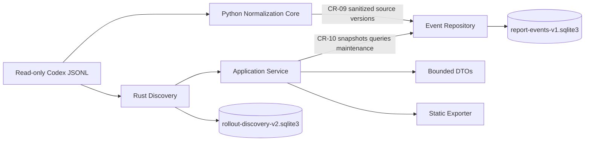
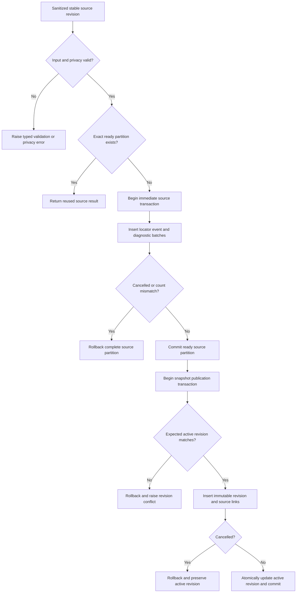
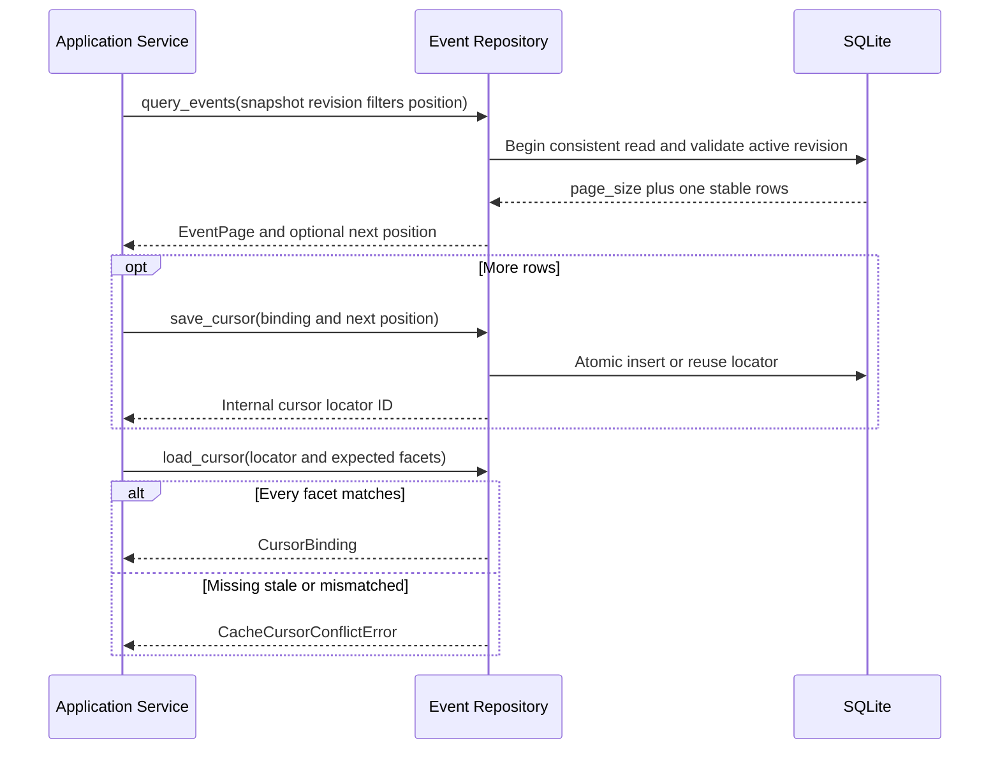
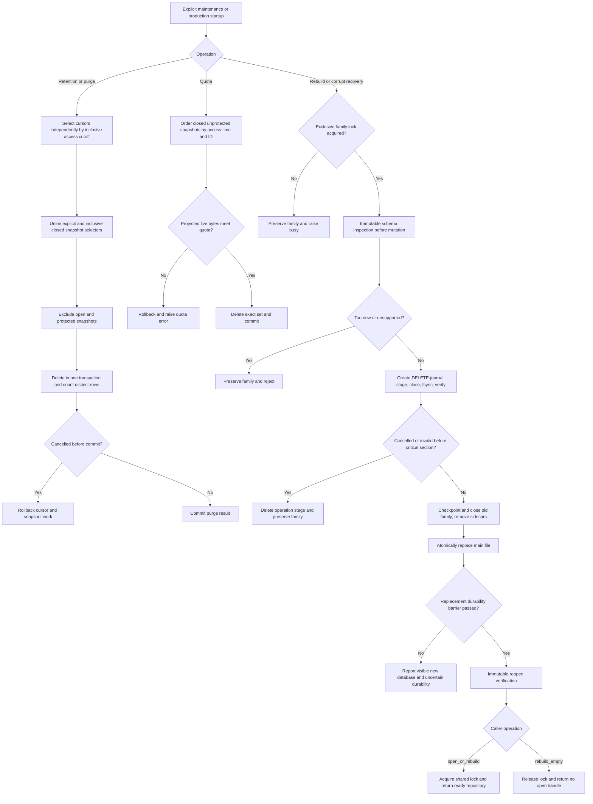
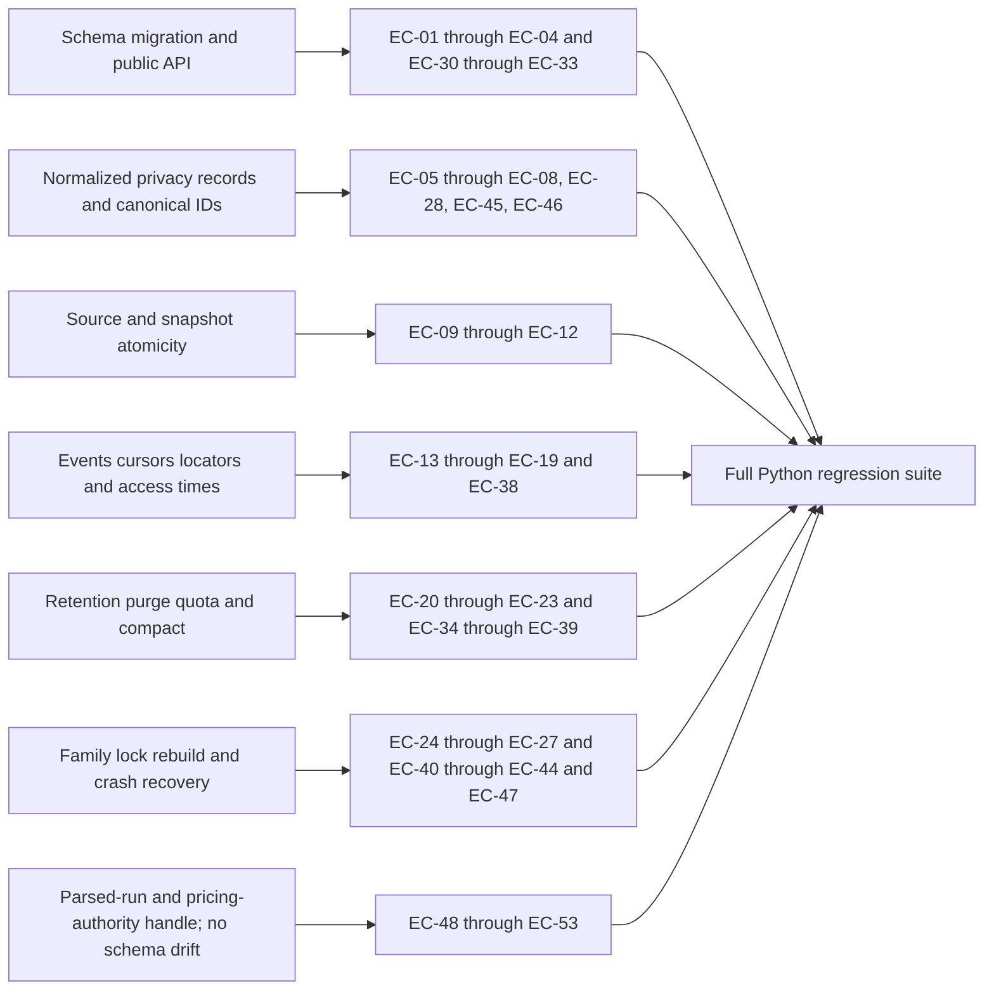

<!--
Copyright (c) 2026 Martin.Bechard@DevConsult.ca
Artifact-ID: 3b422d0c-f6a6-4c40-a4ed-18a20b003db1
Created-UTC: 2026-08-12T15:00:04Z
Creating-Agent: Dev Documentation Writer
Runtime: Codex
Dispatched-Model: gpt-5.6-sol
Reasoning-Effort: medium
Task-ID: /root/design_event_cache
Artifact-ID-Evidence: runtime-supplied
Created-UTC-Evidence: runtime-supplied
Creating-Agent-Evidence: runtime-supplied
Runtime-Evidence: runtime-supplied
Dispatched-Model-Evidence: runtime-supplied
Reasoning-Effort-Evidence: runtime-supplied
Task-ID-Evidence: runtime-supplied
-->

# Agent Report Normalized Event Cache Design

## Current Understanding

The Normalized Event Repository is the disposable SQLite persistence module for privacy-bounded Agent Report evidence. It stores normalized source versions, coherent snapshot bindings, event locators, and cursor locators. Codex JSONL remains the authoritative evidence source.

The module has one primary responsibility: publish and query coherent derived event revisions without exposing or changing source logs. It does not discover files, parse raw JSONL, calculate presentation DTOs, or publish exports.

The version-1 Heatmap does not add cached Heatmap facets. The Application Service calculates matrix cells and selected-cell evidence from the parsed Codex run in `_ReadHandle.run`. One retained read handle binds that process-local run to one immutable `snapshot_id` and `revision_id` from snapshot open through replacement or close. Repeated queries use the same retained handle under separate Application Service reader guards. Existing schema-version-1 normalized rows remain the source for current list and event-detail operations.

The parsed run and its immutable `HeatmapPricingAuthority` are process-local derived evidence. Normalization creates the authority by calling classic `_cost_for_response` exactly once per response. Neither value is serialized into SQLite, restored after restart, or copied into a second cache. A restart reparses the authoritative JSONL and recreates the authority before a new snapshot read handle is available.

This design documents the implemented module in **EXISTING_IMPLEMENTATION** mode. Accepted parent contracts remain authoritative for actor-visible and cross-module requirements; executable source and tests establish current repository behavior.

### Justified Module Propositions

Each proposition stays within the Event Repository boundary delegated by [HLD-003](../high-level/HLD-003-agent-report-dynamic-app-and-static-export.md#constituent-components).

| ID | Proposition | Basis | Necessity | Decision owner |
| --- | --- | --- | --- | --- |
| MP-01 | `event_cache.py` embeds ordered SQLite migrations and owns schema version 1. | HLD-003 assigns embedded migration resources and delegates table names and SQL to CD-003. | One source file keeps schema changes, validators, and migration tests under one module owner. | CD-003 module design; technical soundness remains subject to Dev Architect review. |
| MP-02 | Ready normalized source versions are immutable. A snapshot revision references an ordered set of ready source versions. | ARC-09 requires coherent snapshot bindings. CR-09 requires staged-to-committed publication. | Immutable partitions permit file-level replacement without changing a published snapshot. | CD-003 module design; technical soundness remains subject to Dev Architect review. |
| MP-03 | SQLite uses WAL, `synchronous=FULL`, foreign keys, a 5,000 ms busy timeout, explicit transactions, and a platform-native shared/exclusive family lock. | FR-001 requires WAL and atomic cache updates. ARC-14 prohibits partial publication. | WAL gives concurrent readers a stable revision. A family lock excludes migration and file replacement across processes. | CD-003 module design; technical soundness remains subject to Dev Architect review. |
| MP-04 | The cache persists opaque source keys and revision digests, not source paths or raw source bodies. | ARC-06 through ARC-08 and CD-001 privacy rules bound disclosure and keep source authority external. | The repository can invalidate derived rows without retaining unnecessary local-path or transcript content. | CD-003 module design; technical soundness remains subject to Dev Architect review. |
| MP-05 | Every repository digest uses the canonical byte codec and domain labels defined in Identifier Contracts. Event and revision display IDs use truncated BLAKE2s. Full integrity and binding digests use SHA-256 or full BLAKE2s as specified. | FR-001 requires deterministic opaque event IDs. HLD-003 delegates cursor encoding bytes to component design. | One exact codec lets callers, migrations, and tests independently reproduce every identity. | CD-003 module design; technical soundness remains subject to Dev Architect review. |
| MP-06 | Full-database rebuild checkpoints and closes the old WAL family, verifies a sidecar-independent staging database, durably moves old sidecars away from SQLite-recognized names, and publishes under an exclusive family lock. POSIX uses same-directory rename plus directory `fsync`. Windows uses `MoveFileExW` with replace and write-through flags. | FR-001 requires file-level atomic replacement and safe recovery. | Treating the main database, WAL, and shared-memory files as one family prevents stale WAL replay after main-file replacement. | CD-003 module design; technical soundness remains subject to Dev Architect review. |
| MP-07 | `EventCachePolicy.default()` is the production default. It uses a 5 GiB quota, deterministic least-recently-used eviction of closed unprotected snapshots, no age-based snapshot expiry, and seven-day cursor retention. `recommended()` returns the same policy. | The Product Owner and Dev Architect accepted this production-policy decision on 2026-08-12. | A fixed default removes policy ambiguity while a caller-supplied policy keeps deployments configurable. | Product Owner with Dev Architect review; accepted runtime decision for `/root/design_event_cache`. |
| MP-08 | The module exposes synchronous typed dataclass contracts and stable typed errors. Adapters map them to actor-visible DTOs and errors. | CR-09 and CR-10 require one Python repository boundary while HLD-003 keeps Application Service semantics outside this module. | Exact types and errors give implementation and tests one boundary without coupling SQLite to Tauri, CLI, MCP, or worker transport. | CD-003 module design; technical soundness remains subject to Dev Architect review. |
| MP-09 | Schema version 1 does not persist Heatmap-only semantic facets. One retained `_ReadHandle` carries the parsed Codex run with its immutable snapshot-and-revision binding until replacement or close. | HLD-003 DEC-05 and PLAN-012 require parsed-run Heatmap evidence and no event-cache migration or backfill. | Existing normalized rows do not preserve every interval, applicability, fallback, capacity, price-method, or evidence-ledger distinction required by HM-F01 through HM-F15. | Dev Architect accepted Heatmap reconciliation. |

## Authoritative Sources

### Design Mode And Source Inventory

| Source category permitted by EXISTING_IMPLEMENTATION | Durable source | Use |
| --- | --- | --- |
| Accepted functional specification | [FR-001](../../requirements/functional/FR-001-agent-report-dynamic-app-and-static-export.md) | Privacy, cache location, rebuild, purge, stale-source, cancellation, and actor-visible recovery outcomes |
| Accepted architecture | [ARC-001](../../architecture/ARC-001-agent-report-dynamic-app-and-static-export.md) | ARC-07 through ARC-10, ARC-14, persistence boundary, source authority, and cache separation |
| Owning high-level design | [HLD-003](../high-level/HLD-003-agent-report-dynamic-app-and-static-export.md) | Event Repository ownership, CR-09, CR-10, OP-17 through OP-26, OP-30, OP-41, paths, and implementation order |
| Accepted decisions | Dev Architect packet recorded by ARC-001 and HLD-003 | Python ownership, SQLite WAL, runtime path, component split, and atomicity |
| Backlog requirements | [Modularization backlog item](../../future-ideas/modularize-report-tool-for-concurrent-maintenance.md) | Existing Python decomposition pressure |
| Project configuration | `tools/report/pyproject.toml` | Python 3.11 or later, package root, and pytest root |
| Current implementation | [`event_cache.py`](../../../tools/report/src/agent_report/event_cache.py) | Implemented schema-version-1 repository, migrations, queries, publication, recovery, retention, and read-handle boundary |
| Current tests | [`test_event_cache.py`](../../../tools/report/tests/test_event_cache.py) | Implemented unit, SQLite integration, failure, recovery, and schema-regression coverage |
| Current privacy and metric semantics | [CD-001](CD-001-codex-rollout-metrics.md) | Sanitized summaries, bounded previews, ciphertext opacity, evidence labels, and measured counters |
| Accepted Heatmap delivery plan | [`PLAN-012`](../../plans/PLAN-012-agent-report-dynamic-heatmap-parity.json), SHA-256 `b711b01c519585aa0c155e7c0025ff796387caab7f46d7b1ec80cbaab1fe8bc2` | Retained parsed-run-handle coherence, unchanged schema/migrations, privacy, stop condition, and regression obligations |
| Procedures | [Agent Report README](../../../tools/report/README.md) | Current tool invocation and validation context |
| Delivery evidence | Verification section | Fresh integrated, package, and platform evidence remains required before delivery readiness |

FR-001 governs actor-visible outcomes. ARC-001 governs system constraints. HLD-003 governs component ownership and cross-module contracts. This design governs only delegated Event Repository internals. Current code governs only claims labeled as current behavior.

A specific accepted operation contract governs a general principle for that operation. This design does not change Application Service operation names, response DTOs, or adapter error mappings.

## Related Code

The primary implementation is [`tools/report/src/agent_report/event_cache.py`](../../../tools/report/src/agent_report/event_cache.py), in namespace `agent_report.event_cache`.

The module owns the derived runtime database at `~/.codex/agent-report/report-events-v1.sqlite3`. SQLite may create `report-events-v1.sqlite3-wal` and `report-events-v1.sqlite3-shm`. MP-06 also assigns `report-events-v1.sqlite3.lock`, verified stages named `.report-events-v1.sqlite3.rebuild-<32 lowercase hexadecimal characters>`, and harmless recovery quarantines named `.report-events-v1.sqlite3.old-family-<32 lowercase hexadecimal characters>-wal` or `-shm` to the module.

No generated source, standalone migration folder, configuration file, or script is planned. HLD-003 assigns embedded migration resources to `event_cache.py`.

## Related Tests

The owned tests are [`tools/report/tests/test_event_cache.py`](../../../tools/report/tests/test_event_cache.py).

The test module owns temporary SQLite fixtures for schema 0, schema 1, a corrupt database, and a simulated newer schema. It also owns sanitized event builders and deterministic cancellation checks. Test scenarios are specified in Verification.

## Related Backlog Items

- [Modularize report tool for concurrent maintenance](../../future-ideas/modularize-report-tool-for-concurrent-maintenance.md) supports the dedicated module boundary.
- No separate accepted implementation backlog item for CD-003 is identified.

## Related Wiki Pages

- [FR-001](../../requirements/functional/FR-001-agent-report-dynamic-app-and-static-export.md) defines user-visible cache safety and recovery.
- [ARC-001](../../architecture/ARC-001-agent-report-dynamic-app-and-static-export.md) defines the persistence and privacy boundary.
- [HLD-003](../high-level/HLD-003-agent-report-dynamic-app-and-static-export.md) owns the subsystem decomposition and CR-09/CR-10 contracts.
- [CD-001](CD-001-codex-rollout-metrics.md) defines established normalization, privacy, provenance, and metric semantics.
- No project wiki page is identified.

## Open Questions

No open questions are recorded. The accepted production policy is the `EventCachePolicy.default()` contract in Configuration.

## Maintenance Notes

Recheck this design when the normalized record model, privacy filter, source fingerprint, snapshot metadata, cursor contract, SQLite version, page ordering, event ID contract, purge policy, or cache path changes. Recheck HLD-003 before adding an operation or moving ownership to another module.

Every migration must preserve the no-raw-body invariant and must add a matching schema fixture and migration test. A maintainer must update `LATEST_SCHEMA_VERSION`, `MIGRATIONS`, the schema ledger, the API ledger, and Verification in one change. This Heatmap delivery is not such a migration: `LATEST_SCHEMA_VERSION`, `MIGRATIONS`, every schema-version-1 table, and every persisted column remain unchanged.

The last meaningful source review is 2026-08-13. It covers FR-001, ARC-001, HLD-003, PLAN-012, CD-001, `tools/report/pyproject.toml`, `event_cache.py`, and `test_event_cache.py`.

## Requirements Coverage

| Requirement source and ID | Claim mode | Required outcome | Satisfying contract, rule, state, or error path | Status | Out-of-scope authority, rationale, and owning artifact | Verification |
| --- | --- | --- | --- | --- | --- | --- |
| Target assignment | INTENDED_BEHAVIOR | Own `event_cache.py`, `test_event_cache.py`, and `~/.codex/agent-report/report-events-v1.sqlite3`; define schema, migration, source revisions, normalized records, snapshot bindings, retained parsed-run handles, concurrency, atomic replacement, stale detection, cursor/event locators, purge, quota, rebuild, recovery, and cancellation atomicity. | Runtime Path, Public Contracts, Internal Data And State, Processing Rules, and Verification | DEFINED | Not applicable | EC-01 through EC-53 |
| HLD-003 Event Repository constituent component and HLP-02 | INTENDED_BEHAVIOR | Own normalized cache, migrations, invalidation, snapshot persistence, and atomic revision publication in the fixed Python path. | `EventRepository`, schema version 1, `replace_source()`, `publish_snapshot()`, `open_or_rebuild()`, and the complete SQLite-family publication protocol | DEFINED | Application Service retains surface operation semantics. | EC-01 through EC-17, EC-34 through EC-44 |
| FR-001 FR-02; HLD-003 OP-16 and OP-17 | INTENDED_BEHAVIOR | Report cache reuse and changed-file counts during preflight, then reuse or build one coherent snapshot. | `compare_sources()` and `publish_snapshot()` | DEFINED | Discovery owns relationship closure and accepted source revisions. Application Service owns preflight tokens. | EC-09, EC-10, EC-15 |
| FR-001 FR-03; HLD-003 OP-18 through OP-25 | INTENDED_BEHAVIOR | Support bounded stable queries, lazy event lookup, and snapshot/filter/sort-bound continuation. | `query_events()`, `get_event()`, `save_cursor()`, and `load_cursor()` | DEFINED | Application Service owns actor-visible DTO construction and opaque cursor envelope. | EC-13 through EC-19 |
| FR-001 HM-F01 through HM-F15; HLD-003 DEC-05; PLAN-012 no-cache-migration boundary | INTENDED_BEHAVIOR | Bind one process-local parsed run and its immutable normalization-time `HeatmapPricingAuthority` to the exact retained snapshot-revision handle. Keep schema version 1 and migrations unchanged. Retain normalized-cache ownership for existing lists and details. | `_ReadHandle.run`, `_ReadHandle.heatmap_pricing`, immutable binding validation, schema ledger, privacy boundary, and stop condition | DEFINED | Application Service owns Heatmap aggregation, formatting, evidence states, and bounded DTOs. Source parsing and one-time classic cost assessment remain Core-owned. | EC-48 through EC-53 plus existing EC-01, EC-02, EC-05, EC-13, and EC-17 regressions |
| FR-001 FR-04; HLD-003 OP-26 | INTENDED_BEHAVIOR | Refresh changed sources without replacing the last coherent revision on failure or cancellation. | Immutable source versions, compare-and-swap `publish_snapshot()`, and cancellation checks | DEFINED | Worker and Tauri Supervisor own cooperative and forced process cancellation. | EC-10 through EC-12, EC-24 |
| FR-001 FR-08; ARC-06, ARC-08, ARC-15; HLD-003 CR-09 | INTENDED_BEHAVIOR | Persist privacy-bounded normalized evidence only. Keep ciphertext opaque and raw bodies absent. Keep process-local parsed-run and Heatmap result content out of SQLite. | `NormalizedEventRecord`, canonical repository-derived `record_digest`, `PRIVACY_REGISTRY_V1`, exact bounds, `_ReadHandle` boundary, and schema without raw-body or Heatmap columns | DEFINED | Normalization Core owns semantic redaction. Event Repository owns the exact structural privacy validator. | EC-05 through EC-08, EC-28, EC-45 through EC-47, EC-50 |
| FR-001 FR-09; ARC-08, ARC-09, ARC-14; HLD-003 CR-09 and CR-10 | INTENDED_BEHAVIOR | Keep caches separate; migrate, invalidate, purge, rebuild, and recover atomically; reject a newer schema before mutation. | Non-mutating schema inspection, platform-native family lock, complete WAL-family publication, source partition replacement, `purge()`, `apply_retention()`, `enforce_quota()`, `rebuild_empty()`, and `open_or_rebuild()` | DEFINED | Discovery owns `rollout-discovery-v2.sqlite3`. | EC-01 through EC-04, EC-09 through EC-17, EC-20 through EC-44 |
| ARC-07 | INTENDED_BEHAVIOR | Never change Codex JSONL or `state_5.sqlite`. | Repository API accepts derived values and has no source-write operation. | DEFINED | Discovery and Normalization Core own read-only source access. | EC-28 |
| ARC-10 | INTENDED_BEHAVIOR | Do not watch or poll sources. | `compare_sources()` runs only for an explicit caller request. | DEFINED | Application Service owns explicit refresh. | EC-09 |
| HLD-003 OP-30 | INTENDED_BEHAVIOR | Release a live snapshot handle without treating cache retention as source retention. | `mark_snapshot_closed()` records closure; policy controls later derived eviction. | DEFINED | Application Service owns `close_snapshot`. | EC-19, EC-20 |
| HLD-003 OP-41 and accepted production-policy decision | INTENDED_BEHAVIOR | Apply the accepted configurable production default: 5 GiB, deterministic LRU of closed unprotected snapshots, no age expiry, and seven-day cursor retention. Never remove sources or discovery data. | `EventCachePolicy.default()`, `recommended()`, `apply_retention()`, cursor-only `purge()`, and `enforce_quota()` | DEFINED | Not applicable | EC-22, EC-23, and EC-34 through EC-39 |

## Runtime Path

### Repository And Test Placement

```text
docs/
└── design/
    └── components/
        └── CD-003-agent-report-normalized-event-cache.md
tools/
└── report/
    ├── src/
    │   └── agent_report/
    │       └── event_cache.py
    └── tests/
        └── test_event_cache.py
```

`event_cache.py` is the only production file owned by this design. `test_event_cache.py` is its exact mirrored test module.

### Runtime Persistence Placement

```text
~/.codex/
└── agent-report/
    ├── report-events-v1.sqlite3
    ├── report-events-v1.sqlite3.lock
    ├── report-events-v1.sqlite3-shm
    ├── report-events-v1.sqlite3-wal
    ├── .report-events-v1.sqlite3.rebuild-<32 lowercase hex>
    ├── .report-events-v1.sqlite3.old-family-<32 lowercase hex>-shm
    └── .report-events-v1.sqlite3.old-family-<32 lowercase hex>-wal
```

The tree lists transient alternatives; it does not imply that sidecars, a rebuild stage, or quarantines always exist. A rebuild stage is never a published cache. A quarantine basename cannot be recognized as a sidecar for the published cache.

### Implementation-Placement And Symbol Ledger

| Leaf | Namespace and exact symbol | Kind and responsibility |
| --- | --- | --- |
| `event_cache.py` | `agent_report.event_cache` | Module; all contracts in the API ledger |
| `event_cache.py` | `DEFAULT_CACHE_PATH: Path` | `Path.home() / ".codex" / "agent-report" / "report-events-v1.sqlite3"`; internal/native use only |
| `event_cache.py` | `LATEST_SCHEMA_VERSION: Final[int] = 1` | Highest schema version this implementation writes |
| `event_cache.py` | `DEFAULT_BUSY_TIMEOUT_MS: Final[int] = 5_000` | Default SQLite lock wait |
| `event_cache.py` | `DEFAULT_MAX_BYTES: Final[int] = 5_368_709_120` | Accepted configurable production quota |
| `event_cache.py` | `PRIVACY_REGISTRY_VERSION: Final[str] = "agent-report-privacy-v1"` | Exact structural privacy-validator version |
| `event_cache.py` | `REDACTION_MARKER: Final[str] = "[redacted]"` | Only accepted replacement for a detected secret value |
| `event_cache.py` | `MIGRATIONS: Final[Mapping[int, tuple[str, ...]]]` | Ordered SQL from current version to the next version |
| `event_cache.py` | `source_key_for_path(path: Path) -> SourceKey` | Normalize an absolute source identity transiently and return its SHA-256 key without persisting the path |
| `event_cache.py` | `EventRepository` | Connection, transaction, query, and maintenance owner |
| `event_cache.py` | `_ReadHandle` | Process-local immutable `snapshot_id`, `revision_id`, `SnapshotBinding`, and parsed-run reference retained by Application Service snapshot state until replacement or close; never persisted or exposed as a DTO |
| `event_cache.py` | Dataclasses and enums in Public Contracts | Typed input, result, binding, locator, diagnostic, and policy records |
| `event_cache.py` | Errors in Error Handling | Typed failure contract |
| `test_event_cache.py` | `test_<scenario>` functions EC-01 through EC-53 | Planned unit and integration verification |
| `report-events-v1.sqlite3` | Schema version 1 | Disposable privacy-bounded cache |
| `report-events-v1.sqlite3.lock` | `_CacheFileLock` | Cooperative cross-process shared/exclusive maintenance lock |
| `.report-events-v1.sqlite3.rebuild-<hex>` | `EventRepository.rebuild_empty()` | Same-directory verified staging database |
| `.report-events-v1.sqlite3.old-family-<hex>-wal` and `-shm` | `EventRepository.rebuild_empty()` | Crash-safe quarantine names for old sidecars; eligible for exact stale cleanup |

## Parent Context

[ARC-001](../../architecture/ARC-001-agent-report-dynamic-app-and-static-export.md) defines a local system with read-only sources and separate derived caches. [HLD-003](../high-level/HLD-003-agent-report-dynamic-app-and-static-export.md) assigns the Event Repository to the persistence layer between the Normalization Core and the Application Service.

The Normalization Core supplies sanitized source partitions through CR-09. The Application Service uses CR-10 to compare source revisions, publish snapshots, run bounded queries, persist continuation locators, close snapshots, and request maintenance. Tauri, CLI, MCP, the webview, static exports, and the Rust discovery database do not open this database directly.



## Responsibilities

The module owns these testable responsibilities:

- Open, configure, migrate, validate, and close the event-cache database.
- Persist only validated privacy-bounded normalized event partitions and safe diagnostics.
- Compare an observed source set with one published snapshot revision.
- Publish one coherent snapshot revision with compare-and-swap protection.
- Persist deterministic event locators and internal cursor continuation locators.
- Return stable, bounded event pages and one bounded event record.
- Mark retained snapshot bindings closed without deleting their source evidence.
- Purge selected derived snapshots and unreachable derived partitions only.
- Enforce an explicitly supplied quota through least-recently-used closed-snapshot eviction.
- Rebuild or recover the disposable cache without publishing a partial replacement.
- Preserve the last committed source partition and snapshot revision on validation, contention, failure, or cancellation.

The module does not own discovery, source reads, JSONL parsing, privacy transformation, report metrics, summary DTOs, relationship scope resolution, external cursor envelopes, worker supervision, UI state, exports, source deletion, or discovery-cache maintenance.

## Callers

| Caller | Reason for calling | Boundary |
| --- | --- | --- |
| `agent_report.application_service` | Compare sources, open or refresh snapshots, query events, resolve internal cursors, close snapshots, and request explicit maintenance. | HLD-003 CR-10 and [CD-002](CD-002-agent-report-application-service.md). |
| Normalization Core integration | Publish a complete sanitized normalized partition for one stable source revision. | HLD-003 CR-09 and the current Agent Report Core boundary. |
| `agent_report.report_worker` composition root | Open the repository with validated cache policy and cancellation checks. | HLD-003 worker boundary and [CD-004](CD-004-agent-report-worker-protocol.md). |
| Tauri cache-maintenance command through the Application Service | Request diagnostics, explicit purge, quota enforcement, rebuild, or recovery. | ARC-05 and HLD-003 OP-41. Tauri does not execute repository SQL. |
| `tools/report/tests/test_event_cache.py` | Verify every public contract, schema invariant, and failure path. | Direct unit and temporary-filesystem integration tests. |

MCP and the webview are not direct callers. Their adapters receive bounded service DTOs and never receive the cache path.

## Dependencies

| Dependency | Exact import or interface | Purpose and authority |
| --- | --- | --- |
| Python standard library | `sqlite3` | SQLite connection, transactions, progress handler, WAL, and integrity checks |
| Python standard library | `dataclasses.dataclass` | Frozen input and result records |
| Python standard library | `datetime.datetime`, `datetime.timedelta`, `datetime.timezone` | UTC timestamps and retention bounds |
| Python standard library | `decimal.Decimal` | Exact estimated or recorded cost values without binary float conversion |
| Python standard library | `enum.StrEnum` | Stable string-valued states and error reasons |
| Python standard library | `hashlib.blake2s`, `hashlib.sha256` | Opaque locator IDs, canonical digests, and source-key derivation |
| Python standard library | `json` | Canonical bounded cursor-position encoding only |
| Python standard library | `os`, `pathlib.Path`, `uuid.uuid4` | Cache path, fsync, same-directory staging, and atomic replacement |
| Python standard library | `re` | Identifier, version, and defensive secret-shape validation |
| Python standard library | `errno`, `stat` | Portable contention classification and regular-file validation |
| Python standard library | `time.monotonic`, `time.sleep` | Lock deadline and bounded retry delay |
| Python standard library | `collections.abc.Callable`, `Iterable`, `Mapping`, `Sequence` | Exact public collection and cancellation types |
| POSIX file locking | Internal `_CacheFileLock` using `fcntl.flock(fd, LOCK_SH|LOCK_EX|LOCK_NB)` | Shared lifetime locks and exclusive migration/rebuild locks on Linux and macOS |
| Windows file locking | Internal `_CacheFileLock` using `ctypes.WinDLL("kernel32", use_last_error=True)` with `GetFileAttributesW`, `CreateFileW`, `LockFileEx`, `UnlockFileEx`, `OVERLAPPED`, and `CloseHandle` | Shared or exclusive byte-range lock over offset 0 and length 1; Windows `msvcrt.locking` is not used |
| Windows family publication | Internal `_move_file_write_through()` using `MoveFileExW` with `MOVEFILE_REPLACE_EXISTING | MOVEFILE_WRITE_THROUGH` | Same-volume sidecar quarantine and main-file replacement with write-through completion before success |
| Normalization Core contract | `NormalizedEventRecord` and `NormalizedDiagnostic` values defined here | CR-09 input. Core must sanitize before calling the repository. |
| Application Service contract | Snapshot IDs, source revisions, query bindings, and policy supplied through types defined here | CR-10 input. Service owns actor-visible operation semantics. |

No third-party runtime package is required. The module does not import Tauri, FastMCP, Rust bindings, web code, or the current renderer.

## Public Contracts

### Exact Type Ledger

The following signatures are normative for `agent_report.event_cache`. Python 3.11 syntax applies. `raise NotImplementedError` marks a design declaration and is not prescribed implementation behavior. An ellipsis inside `tuple[T, ...]` is Python's exact homogeneous-tuple type syntax; it does not omit a path, symbol, or field.

```python
from __future__ import annotations

from collections.abc import Callable, Iterable, Mapping, Sequence
from dataclasses import dataclass
from datetime import datetime, timedelta
from decimal import Decimal
from enum import StrEnum
from pathlib import Path
from typing import Final, NewType, Protocol, Self

SnapshotId = NewType("SnapshotId", str)
SnapshotRevisionId = NewType("SnapshotRevisionId", str)
SourceKey = NewType("SourceKey", str)
SourceRevisionDigest = NewType("SourceRevisionDigest", str)
EventId = NewType("EventId", str)
CursorLocatorId = NewType("CursorLocatorId", str)
CancellationCheck = Callable[[], bool]
CursorScalar = str | int | float | bool | None

DEFAULT_CACHE_PATH: Final[Path]
LATEST_SCHEMA_VERSION: Final[int] = 1
DEFAULT_BUSY_TIMEOUT_MS: Final[int] = 5_000
DEFAULT_MAX_BYTES: Final[int] = 5_368_709_120
PRIVACY_REGISTRY_VERSION: Final[str] = "agent-report-privacy-v1"
REDACTION_MARKER: Final[str] = "[redacted]"
NEVER_CANCELLED: Final[CancellationCheck]
MIGRATIONS: Final[Mapping[int, tuple[str, ...]]]

def source_key_for_path(path: Path) -> SourceKey:
    raise NotImplementedError

class SnapshotState(StrEnum):
    LIVE = "live"
    SEALED = "sealed"

class EvidenceMethod(StrEnum):
    MEASURED = "measured"
    DERIVED = "derived"
    INFERRED = "inferred"
    UNAVAILABLE = "unavailable"
    ESTIMATED = "estimated"

class CursorOperation(StrEnum):
    LIST_AGENTS = "list_agents"
    LIST_TURNS = "list_turns"
    LIST_EVENTS = "list_events"
    QUERY_SEQUENCE = "query_sequence"
    QUERY_COORDINATION = "query_coordination"

class CursorConflictReason(StrEnum):
    NOT_FOUND = "not_found"
    SNAPSHOT_MISMATCH = "snapshot_mismatch"
    REVISION_MISMATCH = "revision_mismatch"
    OPERATION_MISMATCH = "operation_mismatch"
    FILTER_MISMATCH = "filter_mismatch"
    SORT_MISMATCH = "sort_mismatch"
    PAGE_SIZE_MISMATCH = "page_size_mismatch"

class RecoveryAction(StrEnum):
    OPENED = "opened"
    CREATED = "created"
    REBUILT_CORRUPT = "rebuilt_corrupt"

class PublicationPhase(StrEnum):
    BEFORE_REPLACE = "before_replace"
    REPLACED_NOT_DURABLE = "replaced_not_durable"
    REOPEN_VERIFICATION = "reopen_verification"

class PurgeReason(StrEnum):
    OPERATOR = "operator"
    RETENTION = "retention"
    QUOTA = "quota"
    RECOVERY = "recovery"

@dataclass(frozen=True, slots=True)
class EventCachePolicy:
    max_bytes: int | None
    closed_snapshot_retention: timedelta | None
    cursor_retention: timedelta

    @classmethod
    def default(cls) -> Self:
        raise NotImplementedError

    @classmethod
    def recommended(cls) -> Self:
        raise NotImplementedError

@dataclass(frozen=True, slots=True)
class SourceRevision:
    source_key: SourceKey
    revision_digest: SourceRevisionDigest
    byte_count: int
    mtime_ns: int
    parser_version: str
    privacy_version: str

@dataclass(frozen=True, slots=True)
class NormalizedEventRecord:
    source_ordinal: int
    timestamp_utc: datetime
    kind: str
    agent_id: str | None
    turn_id: str | None
    work_item_id: str | None
    tool_name: str | None
    model: str | None
    status: str | None
    evidence_method: EvidenceMethod
    duration_ms: int | None
    uncached_input_tokens: int | None
    cached_input_tokens: int | None
    output_tokens: int | None
    reasoning_tokens: int | None
    cost_usd: Decimal | None
    summary_text: str | None
    argument_summary: str | None
    result_preview: str | None
    message_preview: str | None
    message_char_count: int | None
    ciphertext_char_count: int | None
    redaction_count: int
    privacy_status: str

@dataclass(frozen=True, slots=True)
class NormalizedDiagnostic:
    code: str
    count: int
    safe_message: str | None

@dataclass(frozen=True, slots=True)
class SourcePublishResult:
    source: SourceRevision
    event_count: int
    diagnostic_count: int
    reused: bool

@dataclass(frozen=True, slots=True)
class SnapshotBindingInput:
    root_thread_id: str
    include_children: bool
    include_collaborators: bool
    parser_version: str
    pricing_version: str
    formatter_version: str
    privacy_version: str
    observation_time_utc: datetime
    state: SnapshotState

@dataclass(frozen=True, slots=True)
class SnapshotBinding:
    snapshot_id: SnapshotId
    revision_id: SnapshotRevisionId
    root_thread_id: str
    include_children: bool
    include_collaborators: bool
    source_set_digest: str
    scope_digest: str
    parser_version: str
    pricing_version: str
    formatter_version: str
    privacy_version: str
    observation_time_utc: datetime
    state: SnapshotState
    source_count: int

class ParsedCodexRun(Protocol):
    @property
    def run_id(self) -> str:
        raise NotImplementedError

class HeatmapPricingAssessment(Protocol):
    value_usd: float | None
    evidence_method: str
    bounded_method: str

class HeatmapPricingAuthority(Protocol):
    pricing_version: str
    pricing_digest: str
    assessments: tuple[tuple[int, int, HeatmapPricingAssessment], ...]

@dataclass(frozen=True, slots=True)
class _ReadHandle:
    snapshot_id: SnapshotId
    revision_id: SnapshotRevisionId
    binding: SnapshotBinding
    run: ParsedCodexRun
    heatmap_pricing: HeatmapPricingAuthority

@dataclass(frozen=True, slots=True)
class StaleSourceSet:
    reusable: tuple[SourceRevision, ...]
    changed: tuple[SourceRevision, ...]
    added: tuple[SourceRevision, ...]
    removed_source_keys: tuple[SourceKey, ...]
    binding_changed: bool

@dataclass(frozen=True, slots=True)
class EventFilter:
    from_time_utc: datetime | None = None
    to_time_utc: datetime | None = None
    agent_id: str | None = None
    turn_id: str | None = None
    work_item_id: str | None = None
    kind: str | None = None

@dataclass(frozen=True, slots=True)
class EventQuery:
    snapshot_id: SnapshotId
    revision_id: SnapshotRevisionId
    filters: EventFilter
    page_size: int
    after: tuple[CursorScalar, ...] | None = None
    descending: bool = False

@dataclass(frozen=True, slots=True)
class StoredEvent:
    event_id: EventId
    source_key: SourceKey
    source_revision: SourceRevisionDigest
    record: NormalizedEventRecord

@dataclass(frozen=True, slots=True)
class EventPage:
    snapshot_id: SnapshotId
    revision_id: SnapshotRevisionId
    items: tuple[StoredEvent, ...]
    next_position: tuple[CursorScalar, ...] | None

@dataclass(frozen=True, slots=True)
class CursorBinding:
    snapshot_id: SnapshotId
    revision_id: SnapshotRevisionId
    operation: CursorOperation
    filters_digest: str
    sort_digest: str
    page_size: int
    position: tuple[CursorScalar, ...]

@dataclass(frozen=True, slots=True)
class PurgeRequest:
    snapshot_ids: tuple[SnapshotId, ...] = ()
    closed_before_utc: datetime | None = None
    cursor_accessed_before_utc: datetime | None = None
    reason: PurgeReason = PurgeReason.OPERATOR

@dataclass(frozen=True, slots=True)
class PurgeResult:
    removed_snapshots: int
    removed_snapshot_revisions: int
    removed_source_versions: int
    removed_events: int
    removed_cursors: int
    live_bytes_before: int
    live_bytes_after: int

@dataclass(frozen=True, slots=True)
class QuotaResult:
    enabled: bool
    limit_bytes: int | None
    live_bytes_before: int
    live_bytes_after: int
    evicted_snapshot_ids: tuple[SnapshotId, ...]

@dataclass(frozen=True, slots=True)
class CacheDiagnostics:
    schema_version: int
    database_id: str
    allocated_bytes: int
    live_bytes: int
    wal_bytes: int
    snapshot_count: int
    closed_snapshot_count: int
    source_version_count: int
    event_count: int
    cursor_count: int
    stale_rebuild_file_count: int
    integrity_ok: bool

@dataclass(frozen=True, slots=True)
class OpenResult:
    repository: EventRepository
    action: RecoveryAction

class EventRepository:
    @classmethod
    def open(
        cls,
        cache_path: Path,
        *,
        policy: EventCachePolicy | None = None,
        busy_timeout_ms: int = DEFAULT_BUSY_TIMEOUT_MS,
        cancellation_check: CancellationCheck = NEVER_CANCELLED,
    ) -> Self:
        raise NotImplementedError

    @classmethod
    def open_or_rebuild(
        cls,
        cache_path: Path,
        *,
        policy: EventCachePolicy | None = None,
        busy_timeout_ms: int = DEFAULT_BUSY_TIMEOUT_MS,
        cancellation_check: CancellationCheck = NEVER_CANCELLED,
    ) -> OpenResult:
        raise NotImplementedError

    @classmethod
    def rebuild_empty(
        cls,
        cache_path: Path,
        *,
        policy: EventCachePolicy | None = None,
        busy_timeout_ms: int = DEFAULT_BUSY_TIMEOUT_MS,
        cancellation_check: CancellationCheck = NEVER_CANCELLED,
    ) -> None:
        raise NotImplementedError

    def close(self) -> None:
        raise NotImplementedError

    def __enter__(self) -> Self:
        raise NotImplementedError

    def __exit__(self, exc_type: object, exc: object, traceback: object) -> None:
        raise NotImplementedError

    def compare_sources(
        self,
        *,
        snapshot_id: SnapshotId | None,
        observed_sources: Sequence[SourceRevision],
        binding: SnapshotBindingInput,
    ) -> StaleSourceSet:
        raise NotImplementedError

    def replace_source(
        self,
        source: SourceRevision,
        records: Iterable[NormalizedEventRecord],
        diagnostics: Iterable[NormalizedDiagnostic] = (),
        *,
        cancellation_check: CancellationCheck = NEVER_CANCELLED,
    ) -> SourcePublishResult:
        raise NotImplementedError

    def publish_snapshot(
        self,
        *,
        snapshot_id: SnapshotId,
        expected_active_revision: SnapshotRevisionId | None,
        binding: SnapshotBindingInput,
        sources: Sequence[SourceRevision],
        cancellation_check: CancellationCheck = NEVER_CANCELLED,
    ) -> SnapshotBinding:
        raise NotImplementedError

    def get_snapshot(self, snapshot_id: SnapshotId) -> SnapshotBinding:
        raise NotImplementedError

    def open_read(
        self,
        *,
        snapshot_id: SnapshotId,
        revision_id: SnapshotRevisionId,
        run: ParsedCodexRun,
        heatmap_pricing: HeatmapPricingAuthority,
    ) -> _ReadHandle:
        raise NotImplementedError

    def release_read(self, handle: _ReadHandle) -> None:
        raise NotImplementedError

    def query_events(
        self,
        query: EventQuery,
        *,
        cancellation_check: CancellationCheck = NEVER_CANCELLED,
    ) -> EventPage:
        raise NotImplementedError

    def get_event(
        self,
        *,
        snapshot_id: SnapshotId,
        revision_id: SnapshotRevisionId,
        event_id: EventId,
    ) -> StoredEvent:
        raise NotImplementedError

    def save_cursor(
        self,
        binding: CursorBinding,
        *,
        accessed_at_utc: datetime,
    ) -> CursorLocatorId:
        raise NotImplementedError

    def load_cursor(
        self,
        cursor_id: CursorLocatorId,
        *,
        expected_snapshot_id: SnapshotId,
        expected_revision_id: SnapshotRevisionId,
        expected_operation: CursorOperation,
        expected_filters_digest: str,
        expected_sort_digest: str,
        expected_page_size: int,
        accessed_at_utc: datetime,
    ) -> CursorBinding:
        raise NotImplementedError

    def mark_snapshot_closed(
        self,
        snapshot_id: SnapshotId,
        *,
        closed_at_utc: datetime,
    ) -> None:
        raise NotImplementedError

    def purge(
        self,
        request: PurgeRequest,
        *,
        protected_snapshot_ids: Sequence[SnapshotId] = (),
        cancellation_check: CancellationCheck = NEVER_CANCELLED,
    ) -> PurgeResult:
        raise NotImplementedError

    def apply_retention(
        self,
        *,
        now_utc: datetime,
        protected_snapshot_ids: Sequence[SnapshotId] = (),
        cancellation_check: CancellationCheck = NEVER_CANCELLED,
    ) -> PurgeResult:
        raise NotImplementedError

    def enforce_quota(
        self,
        *,
        protected_snapshot_ids: Sequence[SnapshotId] = (),
        cancellation_check: CancellationCheck = NEVER_CANCELLED,
    ) -> QuotaResult:
        raise NotImplementedError

    def compact(
        self,
        *,
        cancellation_check: CancellationCheck = NEVER_CANCELLED,
    ) -> None:
        raise NotImplementedError

    @classmethod
    def remove_stale_rebuild_files(
        cls,
        cache_path: Path,
        *,
        older_than_utc: datetime,
        busy_timeout_ms: int = DEFAULT_BUSY_TIMEOUT_MS,
        cancellation_check: CancellationCheck = NEVER_CANCELLED,
    ) -> int:
        raise NotImplementedError

    def diagnostics(self) -> CacheDiagnostics:
        raise NotImplementedError
```

### Input And Result Constraints

- `EventCachePolicy.max_bytes` is `None` or at least 16 MiB. `default()` returns 5,368,709,120 bytes, no age-based snapshot retention, and seven-day cursor retention. `recommended()` returns exactly `default()` for API compatibility.
- `max_bytes` applies to logical live page bytes: `(page_count - freelist_count) * page_size`. `allocated_bytes` separately reports the main database, WAL, and shared-memory file allocation. `compact()` can reduce allocation after a logical purge.
- A `None` repository policy resolves to `EventCachePolicy.default()`. A composition root can supply a validated override.
- `busy_timeout_ms` is from 1 through 60,000.
- Every `datetime` is timezone-aware and normalized to UTC before storage.
- `snapshot_id` matches `snap_[0-9a-f]{24}`. `revision_id` matches `srev_[0-9a-f]{24}`.
- `source_key` and `revision_digest` are 64 lowercase hexadecimal characters. The source key is the SHA-256 digest of the normalized absolute source identity. The database does not store the source path.
- `parser_version`, `pricing_version`, `formatter_version`, and `privacy_version` contain 1 through 128 printable non-control characters.
- A source has nonnegative `byte_count` and `mtime_ns`. A caller must not publish an unstable before-and-after fingerprint as a `SourceRevision`.
- `source_ordinal`, durations, token counts, message counts, ciphertext counts, and redaction counts are nonnegative.
- `kind` contains 1 through 128 printable characters. Optional identifiers and labels contain at most 512 printable characters.
- `summary_text` has at most 1,024 characters. `argument_summary` and `result_preview` each have at most 4,096 characters. `message_preview` has at most 50 characters.
- A diagnostic `code` matches `[A-Z][A-Z0-9_]{0,127}`, `count` is positive, and `safe_message` is null or at most 512 characters. `safe_message` is subject to the same control-character, secret-pattern, and ciphertext checks as event display text.
- `privacy_status` is exactly `sanitized`. `SourceRevision.privacy_version` and `SnapshotBindingInput.privacy_version` must equal `PRIVACY_REGISTRY_VERSION` for schema version 1.
- The Normalization Core remains the semantic privacy validator. The repository check is a second structural defense and does not claim to prove semantic redaction.
- `cost_usd` is nonnegative and stored as a canonical decimal string.
- A page size is from 1 through 500. Event ordering is `(timestamp_utc, source_key, source_ordinal, event_id)`, ascending by default and fully reversed when `descending` is true.
- `EventFilter.from_time_utc` is inclusive. `EventFilter.to_time_utc` is exclusive and must be later than `from_time_utc` when both exist.
- A cursor position has one through eight JSON scalar values. A string position value has at most 256 characters. Canonical JSON uses UTF-8, sorted keys where applicable, and separators `(',', ':')`.
- A cursor floating-point value must be finite. `NaN`, positive infinity, and negative infinity are invalid.
- `observed_sources` and snapshot `sources` must contain unique source keys in ascending source-key order. This canonical order defines `source_order` and the source-set digest.
- `open_read()` requires an active `snapshot_id` and exact `revision_id`. It rejects a stale, foreign, closed, or inactive binding before it constructs `_ReadHandle`.
- `open_read().run` and `open_read().heatmap_pricing` are the process-local parsed Codex run and identical immutable normalization-time assessment snapshot supplied for that exact published binding. The Application Service validates pricing version and digest plus complete ordered `(thread_index, response_index)` coverage, then validates returned run and authority object identity with the exact published revision before state publication. Application Service snapshot state retains the handle across repeated queries. The repository does not serialize, copy, hash, backfill, or recover either value from SQLite.
- `release_read()` accepts only a retained handle from the same repository instance and releases it once after replacement, snapshot close, or service shutdown. Per-query reader-guard cleanup never calls it. Release does not purge or mutate the persisted snapshot revision.
- `PurgeRequest` must name at least one snapshot, closed-time boundary, or cursor-time boundary. It cannot mean “purge everything” by omission. Duplicate snapshot IDs and duplicate protected snapshot IDs are invalid. Protection applies only to snapshot deletion; it does not retain independent cursor locators.

### Identifier Contracts

Every repository digest uses the following canonical byte codec. No digest uses JSON, locale-dependent formatting, Python `repr()`, a filesystem-native string encoding, or an omitted optional field.

1. Start with the ASCII bytes `agent-report-cache-c14n-v1` followed by one zero byte.
2. Append the domain as `0x01 || u64be(UTF8_length) || UTF8(domain)`. Domain strings are ASCII subsets of NFC UTF-8.
3. Append each named field in the order specified below. A field is `u16be(name_length) || UTF8(name) || type_tag || u64be(value_length) || value`.
4. Normalize every string to Unicode NFC, then encode it as UTF-8. The type tag is `0x01`.
5. Encode null with type tag `0x00` and zero value length.
6. Encode false and true with type tag `0x02` and one value byte `0x00` or `0x01`.
7. Encode an integer with type tag `0x03` and its minimal ASCII decimal form. Zero is `0`; no plus sign or leading zero is allowed.
8. Encode a finite `Decimal` with type tag `0x04`. Use fixed-point ASCII, remove trailing fractional zeroes and a trailing decimal point, and encode negative zero as `0`.
9. Encode a UTC datetime with type tag `0x05` and exactly `YYYY-MM-DDTHH:MM:SS.ffffffZ` in ASCII.
10. Encode a finite binary64 float with type tag `0x06` and IEEE-754 network-order eight bytes. Reject NaN and infinity.
11. Encode a sequence with type tag `0x07`. Its value is `u32be(item_count)` followed by each item as `type_tag || u64be(value_length) || value`. A sequence can contain scalar values or one nested sequence level. A nested sequence cannot contain another sequence. Mappings are invalid.

Field names and domains are the exact ASCII spellings in this section. A `StrEnum` encodes its `.value` as a string. The encoder tests `bool` before `int`. Optional fields encode null; they are never omitted. SHA-256 means `hashlib.sha256(canonical_bytes).hexdigest()`. BLAKE2s means `hashlib.blake2s(canonical_bytes, digest_size=32)` with no key, salt, or personalization, followed by lowercase `hexdigest()`.

Digest ownership and field order are exact:

| Value | Algorithm and domain | Ordered fields |
| --- | --- | --- |
| `SourceKey` | SHA-256; `source-key-v1` | `normalized_absolute_path`; `source_key_for_path()` applies `os.path.abspath(os.fspath(path))` without resolving symlinks, applies `os.path.normcase()` only on Windows, replaces `\` with `/`, NFC-normalizes, and does not persist the result |
| `record_digest` | SHA-256; `normalized-record-v1` | Every `NormalizedEventRecord` field in declaration order, from `source_ordinal` through `privacy_status`; the repository derives this value after validation and the caller does not supply it |
| `event_id` locator digest | BLAKE2s; `event-locator-v1` | `source_key`, `revision_digest`, `parser_version`, `privacy_version`, `source_ordinal`, `kind` |
| `source_set_digest` | SHA-256; `source-set-v1` | `sources`, a sequence whose items are sequences containing `source_key`, `revision_digest`, `byte_count`, `mtime_ns`, `parser_version`, and `privacy_version` in ascending source-key order |
| `scope_digest` | SHA-256; `scope-v1` | `root_thread_id`, `include_children`, `include_collaborators` |
| `filters_digest` | SHA-256; `event-filter-v1` | `from_time_utc`, `to_time_utc`, `agent_id`, `turn_id`, `work_item_id`, `kind` |
| `sort_digest` | SHA-256; `event-sort-v1` | `keys`, fixed sequence `timestamp_utc`, `source_key`, `source_ordinal`, `event_id`; `descending` |
| `revision_id` digest | BLAKE2s; `snapshot-revision-v1` | `snapshot_id`, `root_thread_id`, `include_children`, `include_collaborators`, `source_set_digest`, `scope_digest`, `parser_version`, `pricing_version`, `formatter_version`, `privacy_version`, `observation_time_utc`, `state` |
| `CursorLocatorId` | BLAKE2s; `cursor-locator-v1` | `snapshot_id`, `revision_id`, `operation`, `filters_digest`, `sort_digest`, `page_size`, `position` |

`event_id` is `evt_` plus the first 24 lowercase hexadecimal characters of its full BLAKE2s digest. `event_locators.locator_digest` stores the full 64-character digest. `revision_id` is `srev_` plus the first 24 lowercase hexadecimal characters of its full digest. `CursorLocatorId` is its full 64-character lowercase digest.

An unchanged snapshot binding reuses its active revision without recalculating observation time. A changed binding uses the supplied observation time in the revision digest. Any truncated-ID collision whose full digest or canonical fields differ raises `CacheIdentityCollisionError` and rolls back.

The Application Service owns an external authenticated opaque cursor envelope. It must not expose `CursorLocatorId` as a documented public format.

### Operation Ownership

All methods are synchronous local calls. The invoking Application Service or Worker owns asynchronous scheduling, progress messages, actor validation, and user-visible errors. The repository owns input validation, SQLite state, cancellation checks, and typed exceptions.

## External And Asynchronous Effect Phases

The repository has no network or provider effect. Its external effects are local SQLite and filesystem mutations. The phase ledger uses the synchronous caller as initiator and executor.

| Effect and phase | Trigger | State already committed | Initiator | Submission owner | Executor or delivery owner | Response visibility and failure outcome | Retry or compensation | Completion evidence | Source and claim mode |
| --- | --- | --- | --- | --- | --- | --- | --- | --- | --- |
| Open: immutable inspection | `open()` or `open_or_rebuild()` | Existing cache family only | Application Service composition root | Not applicable | Event Repository | Reads both schema authorities through `mode=ro&immutable=1` before a write-capable pragma. Newer, unsupported, or mismatched schema raises with database-family bytes unchanged. | Retry after contention; use a compatible application for newer schema. | Inspection result and unchanged family hashes on rejection | FR-09, ARC-08, HLD CR-10; INTENDED_BEHAVIOR |
| Open: configure or create | Supported inspection or missing database | Existing supported cache or no database | Application Service composition root | Not applicable | Event Repository | A current cache enters configured WAL mode. Creation occurs under exclusive lock and publishes a checkpointed schema. | Retry after contention. | WAL mode, matching schema authorities, and `quick_check` pass | FR-09, ARC-08, HLD CR-10; INTENDED_BEHAVIOR |
| Source replacement: validate | `replace_source()` | Last ready source version | Normalization Core | Not applicable | Event Repository | Invalid or privacy-unsafe input raises before transaction. | Correct input and retry. | Complete input validation | HLD CR-09; INTENDED_BEHAVIOR |
| Source replacement: transaction | Valid records | Last ready source version | Normalization Core | Not applicable | Event Repository | Inserts locators, events, and diagnostics in one `BEGIN IMMEDIATE` transaction. Cancel/error rolls back. | Repeat the full source version. | Committed source-version row and counts | FR-09, ARC-14, HLD CR-09; INTENDED_BEHAVIOR |
| Snapshot publication | `publish_snapshot()` | Ready source versions and prior active revision | Application Service | Not applicable | Event Repository | Compare-and-swap inserts the revision and changes the active pointer in one transaction. Conflict/cancel leaves prior pointer. | Refresh source set and retry. | Active revision equals returned revision | ARC-09, ARC-14, HLD OP-17/OP-26; INTENDED_BEHAVIOR |
| Query and cursor persistence | `query_events()`, `save_cursor()`, or `load_cursor()` | Published snapshot revision | Application Service | Not applicable | Event Repository | A read returns one revision. Cursor save is atomic. Mismatch returns typed conflict. | Restart from the first page. | Stable ordered rows or cursor row | FR-03, HLD CR-10; INTENDED_BEHAVIOR |
| Retained parsed-run handle | `open_read(snapshot_id, revision_id, run, heatmap_pricing)` | Published active snapshot revision; no persisted parsed run or pricing authority | Application Service | Not applicable | Event Repository preserves the binding and run-authority identity; Application Service validates and retains the handle; Query Core consumes it under per-operation guards | Success exposes one immutable `_ReadHandle`. Repeated queries reuse the run and authority. A mismatch fails before semantic calculation. No schema row changes. | Refresh swaps after active readers drain and releases the old handle once; close or shutdown releases the current handle once; reparse and recreate authority after process restart | Handle with exact snapshot, revision, binding, process-local run, and immutable authority; one lifetime release | FR-001 HM-F01 through HM-F15, HLD-003 DEC-05; INTENDED_BEHAVIOR |
| Cursor retention | Startup or explicit maintenance calls `apply_retention()` or cursor-only `purge()` | Published snapshots and cursors | Application Service composition root or Tauri maintainer | Not applicable | Event Repository | One transaction removes cursors at or before the cutoff without removing snapshots or events. Cancel/error rolls back. | Retry with the same cutoff. | Cursor-only count and unchanged snapshot count | FR-09, HLD OP-41; INTENDED_BEHAVIOR |
| Snapshot purge or quota eviction | Explicit maintenance, configured retention, or quota enforcement | Published and closed snapshot state | Application Service composition root or Tauri maintainer | Not applicable | Event Repository | One transaction removes selected closed unprotected bindings and unreachable partitions. Cancel/error rolls back. | Retry the same selector. | Distinct counts and live-byte result | FR-09, HLD OP-41; INTENDED_BEHAVIOR |
| Compact | Explicit maintenance request | Logical purge or quota result | Tauri maintainer through Application Service | Not applicable | SQLite through Event Repository | Changes allocation only. Cancellation preserves logical rows and may defer reclaimed disk space. | Retry compaction. | `freelist_count` and file diagnostics | MP-03; PROPOSED_CHANGE |
| Rebuild or recovery: stage | Explicit rebuild or corrupt-cache recovery | Existing cache family | Application Service composition root | Not applicable | Event Repository | Creates, checkpoints, closes, fsyncs, and validates a sidecar-independent same-directory database. Cancel/error removes staging and leaves the old family unchanged. | Retry after contention or cleanup. | Staging has expected database ID, valid schema, and no live WAL or shared-memory dependency | FR-09, ARC-14, MP-06; INTENDED_BEHAVIOR |
| Rebuild: neutralize old WAL family | Verified stage and final cancellation check | Existing cache family | Application Service composition root | Not applicable | Event Repository | Under exclusive lock, checkpoint and close a healthy old database, then durably rename any sidecars to operation-specific non-sidecar quarantine names. For proven corruption, close all handles and durably quarantine unusable sidecars. This phase is noncancellable. | A crash leaves an old main file with no SQLite-recognized sidecar. Reopen recovery. | No live connection and no sidecar at the old WAL or shared-memory basename | FR-09, ARC-14, MP-06; INTENDED_BEHAVIOR |
| Rebuild: replace and durability | Neutral old family | Old clean main file | Application Service composition root | Not applicable | Event Repository | POSIX replaces then fsyncs the parent directory. Windows uses write-through replacement. A pre-replace error leaves the old clean main. A post-replace durability error reports the new visible database ID and uncertain durability. | Close and reopen. Normalize sources only after reopen verification. | Replacement call, platform durability barrier, and immutable reopen verification pass | FR-09, ARC-14, MP-06; INTENDED_BEHAVIOR |

## Trust And Identity Boundaries

| Operation or data flow | Actor and authentication source | Authorization, ownership, tenancy, and data filtering | Selector and mismatch behavior | Validation owner | Success response and disclosure | State owner and transition | Failure timing and side effects | Sensitive data and logging |
| --- | --- | --- | --- | --- | --- | --- | --- | --- | --- |
| CR-09 normalized source publication | Normalization Core in the local OS-user process | Service-authorized source revision; Repository owns only derived cache; tenancy not applicable; sanitized-record filter | Exact source key, revision, parser, and privacy versions; mismatch or collision rejects | Core validates semantic privacy; Repository validates structure, bounds, schema, and binding | Counts and opaque identities only | Repository changes absent/reusable source version to ready in one transaction | Validation precedes write; cancel/error rolls back | No raw/unredacted body, credential, ciphertext body, or source path is stored or logged |
| CR-10 snapshot query | Snapshot holder through the validated Application Service | Snapshot authorizes read; Repository owns derived state; tenancy not applicable; snapshot/filter bounds | Exact snapshot and revision; stale or missing binding is explicit | Application Service validates caller; Repository validates binding and query | Privacy-bounded normalized rows only | Consistent read; no snapshot transition | Error precedes result; committed state is unchanged | Cache path and raw source are absent from returned values |
| CR-10 cursor persistence | Snapshot holder through the validated Application Service | Snapshot authorizes locator use; tenancy not applicable; operation/filter/sort/page binding | Every expected facet must match; mismatch names one conflict reason | Application Service validates external envelope; Repository validates stored binding | Internal position values only | Atomic insert or access-time update | Conflict leaves snapshot and cursor state usable | Cursor fields contain no request or transcript body |
| CR-10 maintenance | Local Tauri maintainer through Application Service | Tauri capability authorizes derived-cache maintenance; no source or discovery ownership | Explicit snapshots or time boundaries; an empty selector rejects | Application Service validates actor; Repository validates request and transaction | Counts and bounded diagnostics | Atomic purge/quota transition | Cancel/error rolls back logical deletion | Source logs, exports, discovery cache, raw bodies, and cache path are outside the result |
| Cache file open and recovery | Composition root under local OS identity | OS permissions and configured cache path; no remote actor or tenancy | Exact cache path; too-new schema rejects without overwrite | Composition root validates configured path; Repository validates database | Repository handle and recovery action | Open, migrate, or atomic empty replacement | Pre-replace failure leaves the old target; post-replace failure identifies and retains the visible new target for reopen or recovery | Diagnostics use safe codes and counts; they do not include event text |

There is no application account, remote tenancy, network listener, anonymous caller, or administrator bypass. Operating-system identity and the validated process composition root provide authentication.

## Internal Data And State

### Heatmap Version-1 Cache Boundary

`_ReadHandle` is a process-local retained snapshot-revision value. `open_read()` validates the requested snapshot and active revision in one repository read transaction. It then binds the caller-supplied parsed run and its identical `HeatmapPricingAuthority` to that immutable `SnapshotBinding`. The handle exposes the exact `snapshot_id`, `revision_id`, binding, `run`, and authority. Application Service snapshot state retains it across sequential queries. `release_read()` ends the retained handle exactly once after replacement, snapshot close, or service shutdown. Neither operation inserts, updates, backfills, or deletes a schema row.

The repository preserves object identity but does not calculate or inspect pricing. The Application Service requires one ordered assessment for every run response coordinate, matching configured pricing metadata, and requires the returned handle to expose the identical run and authority objects with the published revision identifiers. A mismatch prevents snapshot-state publication. This check binds the normalization-time `_cost_for_response` results to the published revision without adding a table, column, migration, backfill, or recoverable cache representation.

A later refresh or snapshot publication does not mutate an existing handle. The Application Service prevents refresh while `active_readers` is nonzero. After readers drain, it opens a replacement handle, atomically swaps the complete snapshot state, and releases the prior handle exactly once. Close removes snapshot state and releases the current handle exactly once after readers drain. A Heatmap result therefore cannot combine a new revision ID with an earlier parsed run.

The schema-version-1 cache remains authoritative for its existing derived responsibilities:

- normalized list and event-detail rows;
- source-version and snapshot-revision publication;
- deterministic event locators;
- cursor locators;
- closed-snapshot retention, purge, and quota state.

The schema does not claim to be a complete Heatmap semantic projection. It intentionally lacks these Heatmap-only facets:

- complete runtime-state intervals with boundary provenance and incomplete-timing coverage;
- stable parsed-run agent and response traversal needed for first-occurrence ordering;
- thread-level non-mixed model and effort fallbacks;
- processed-token calculation inputs and contributor applicability;
- positive context observations with model context-window capacity;
- complete versus incomplete tool-event coverage;
- recorded-cost versus supported-estimate method and missing-price contributors;
- normalization-time per-response `CostAssessment` snapshots and their pricing, run, response-order, and revision identity;
- cell-specific chronological evidence selection before preview materialization.

Some schema-version-1 fields overlap with Heatmap inputs. That overlap does not prove semantic completeness. A missing cache value cannot establish applicable zero, partial evidence, unavailable evidence, or N/A capacity. For this delivery, adding columns would create a new persistence and backfill contract without resolving parsed-run source-order and applicability semantics. Therefore `LATEST_SCHEMA_VERSION` remains 1, `MIGRATIONS` remains unchanged, and no schema version 2 exists.

The read handle carries only the already privacy-bounded parsed run and immutable pricing-assessment authority produced for the accepted source revision. It does not carry raw JSONL records, unrestricted paths, secrets, or ciphertext bodies into a public response. The Application Service still sanitizes previews and bounds evidence before disclosure. The repository never serializes `run`, `HeatmapPricingAuthority`, assessments, previews, or Heatmap result DTOs.

If the parsed run cannot preserve a required HM-F01 through HM-F15 distinction, Heatmap implementation stops and reports the concrete gap to Dev Architect. It must not infer the missing fact from schema-version-1 absence, convert absence to zero, backfill the cache, or invent a schema version 2.

### Schema Version 1

Schema version 1 is the first Event Repository schema. SQLite `PRAGMA user_version` and the `schema_metadata.schema_version` value must both equal `LATEST_SCHEMA_VERSION`.

```sql
CREATE TABLE schema_metadata (
    singleton INTEGER PRIMARY KEY CHECK (singleton = 1),
    schema_version INTEGER NOT NULL CHECK (schema_version >= 1),
    database_id TEXT NOT NULL CHECK (length(database_id) = 32),
    created_utc TEXT NOT NULL,
    migrated_utc TEXT NOT NULL
) STRICT;

CREATE TABLE source_versions (
    source_key TEXT NOT NULL CHECK (length(source_key) = 64),
    revision_digest TEXT NOT NULL CHECK (length(revision_digest) = 64),
    parser_version TEXT NOT NULL,
    privacy_version TEXT NOT NULL,
    byte_count INTEGER NOT NULL CHECK (byte_count >= 0),
    mtime_ns INTEGER NOT NULL CHECK (mtime_ns >= 0),
    normalized_utc TEXT NOT NULL,
    last_accessed_utc TEXT NOT NULL,
    event_count INTEGER NOT NULL CHECK (event_count >= 0),
    diagnostic_count INTEGER NOT NULL CHECK (diagnostic_count >= 0),
    PRIMARY KEY (source_key, revision_digest, parser_version, privacy_version)
) STRICT;

CREATE TABLE event_locators (
    event_id TEXT PRIMARY KEY CHECK (length(event_id) = 28),
    source_key TEXT NOT NULL,
    revision_digest TEXT NOT NULL,
    parser_version TEXT NOT NULL,
    privacy_version TEXT NOT NULL,
    source_ordinal INTEGER NOT NULL CHECK (source_ordinal >= 0),
    kind TEXT NOT NULL,
    locator_digest TEXT NOT NULL CHECK (length(locator_digest) = 64),
    UNIQUE (source_key, revision_digest, parser_version, privacy_version, source_ordinal),
    FOREIGN KEY (source_key, revision_digest, parser_version, privacy_version)
        REFERENCES source_versions (source_key, revision_digest, parser_version, privacy_version)
        ON DELETE CASCADE
) STRICT;

CREATE TABLE events (
    event_id TEXT PRIMARY KEY,
    timestamp_utc TEXT NOT NULL,
    agent_id TEXT,
    turn_id TEXT,
    work_item_id TEXT,
    tool_name TEXT,
    model TEXT,
    status TEXT,
    evidence_method TEXT NOT NULL CHECK (evidence_method IN ('measured','derived','inferred','unavailable','estimated')),
    duration_ms INTEGER CHECK (duration_ms IS NULL OR duration_ms >= 0),
    uncached_input_tokens INTEGER CHECK (uncached_input_tokens IS NULL OR uncached_input_tokens >= 0),
    cached_input_tokens INTEGER CHECK (cached_input_tokens IS NULL OR cached_input_tokens >= 0),
    output_tokens INTEGER CHECK (output_tokens IS NULL OR output_tokens >= 0),
    reasoning_tokens INTEGER CHECK (reasoning_tokens IS NULL OR reasoning_tokens >= 0),
    cost_usd TEXT,
    summary_text TEXT CHECK (summary_text IS NULL OR length(summary_text) <= 1024),
    argument_summary TEXT CHECK (argument_summary IS NULL OR length(argument_summary) <= 4096),
    result_preview TEXT CHECK (result_preview IS NULL OR length(result_preview) <= 4096),
    message_preview TEXT CHECK (message_preview IS NULL OR length(message_preview) <= 50),
    message_char_count INTEGER CHECK (message_char_count IS NULL OR message_char_count >= 0),
    ciphertext_char_count INTEGER CHECK (ciphertext_char_count IS NULL OR ciphertext_char_count >= 0),
    redaction_count INTEGER NOT NULL CHECK (redaction_count >= 0),
    privacy_status TEXT NOT NULL CHECK (privacy_status = 'sanitized'),
    record_digest TEXT NOT NULL CHECK (length(record_digest) = 64),
    FOREIGN KEY (event_id) REFERENCES event_locators (event_id) ON DELETE CASCADE
) STRICT;

CREATE TABLE source_diagnostics (
    source_key TEXT NOT NULL,
    revision_digest TEXT NOT NULL,
    parser_version TEXT NOT NULL,
    privacy_version TEXT NOT NULL,
    code TEXT NOT NULL,
    count INTEGER NOT NULL CHECK (count > 0),
    safe_message TEXT CHECK (safe_message IS NULL OR length(safe_message) <= 512),
    PRIMARY KEY (source_key, revision_digest, parser_version, privacy_version, code),
    FOREIGN KEY (source_key, revision_digest, parser_version, privacy_version)
        REFERENCES source_versions (source_key, revision_digest, parser_version, privacy_version)
        ON DELETE CASCADE
) STRICT;

CREATE TABLE snapshot_bindings (
    snapshot_id TEXT PRIMARY KEY CHECK (length(snapshot_id) = 29),
    root_thread_id TEXT NOT NULL,
    include_children INTEGER NOT NULL CHECK (include_children IN (0, 1)),
    include_collaborators INTEGER NOT NULL CHECK (include_collaborators IN (0, 1)),
    active_revision_id TEXT,
    created_utc TEXT NOT NULL,
    last_accessed_utc TEXT NOT NULL,
    closed_utc TEXT
) STRICT;

CREATE TABLE snapshot_revisions (
    revision_id TEXT PRIMARY KEY CHECK (length(revision_id) = 29),
    snapshot_id TEXT NOT NULL,
    source_set_digest TEXT NOT NULL CHECK (length(source_set_digest) = 64),
    scope_digest TEXT NOT NULL CHECK (length(scope_digest) = 64),
    parser_version TEXT NOT NULL,
    pricing_version TEXT NOT NULL,
    formatter_version TEXT NOT NULL,
    privacy_version TEXT NOT NULL,
    observation_utc TEXT NOT NULL,
    state TEXT NOT NULL CHECK (state IN ('live', 'sealed')),
    published_utc TEXT NOT NULL,
    source_count INTEGER NOT NULL CHECK (source_count >= 0),
    UNIQUE (snapshot_id, source_set_digest, scope_digest, parser_version, pricing_version, formatter_version, privacy_version, observation_utc, state),
    FOREIGN KEY (snapshot_id) REFERENCES snapshot_bindings (snapshot_id) ON DELETE CASCADE
) STRICT;

CREATE TABLE snapshot_sources (
    revision_id TEXT NOT NULL,
    source_order INTEGER NOT NULL CHECK (source_order >= 0),
    source_key TEXT NOT NULL,
    revision_digest TEXT NOT NULL,
    parser_version TEXT NOT NULL,
    privacy_version TEXT NOT NULL,
    PRIMARY KEY (revision_id, source_order),
    UNIQUE (revision_id, source_key),
    FOREIGN KEY (revision_id) REFERENCES snapshot_revisions (revision_id) ON DELETE CASCADE,
    FOREIGN KEY (source_key, revision_digest, parser_version, privacy_version)
        REFERENCES source_versions (source_key, revision_digest, parser_version, privacy_version)
        ON DELETE RESTRICT
) STRICT;

CREATE TABLE cursor_locators (
    cursor_id TEXT PRIMARY KEY CHECK (length(cursor_id) = 64),
    snapshot_id TEXT NOT NULL,
    revision_id TEXT NOT NULL,
    operation TEXT NOT NULL CHECK (operation IN ('list_agents','list_turns','list_events','query_sequence','query_coordination')),
    filters_digest TEXT NOT NULL CHECK (length(filters_digest) = 64),
    sort_digest TEXT NOT NULL CHECK (length(sort_digest) = 64),
    page_size INTEGER NOT NULL CHECK (page_size BETWEEN 1 AND 500),
    position_json TEXT NOT NULL CHECK (length(position_json) <= 2048),
    created_utc TEXT NOT NULL,
    last_accessed_utc TEXT NOT NULL,
    FOREIGN KEY (snapshot_id) REFERENCES snapshot_bindings (snapshot_id) ON DELETE CASCADE,
    FOREIGN KEY (revision_id) REFERENCES snapshot_revisions (revision_id) ON DELETE CASCADE
) STRICT;

CREATE TRIGGER snapshot_active_revision_guard
BEFORE UPDATE OF active_revision_id ON snapshot_bindings
WHEN NEW.active_revision_id IS NOT NULL
BEGIN
    SELECT RAISE(ABORT, 'active revision does not belong to snapshot')
    WHERE NOT EXISTS (
        SELECT 1 FROM snapshot_revisions
        WHERE revision_id = NEW.active_revision_id
          AND snapshot_id = NEW.snapshot_id
    );
END;

CREATE INDEX events_timestamp_index ON events (timestamp_utc, event_id);
CREATE INDEX events_agent_index ON events (agent_id, timestamp_utc, event_id);
CREATE INDEX events_turn_index ON events (turn_id, timestamp_utc, event_id);
CREATE INDEX events_work_item_index ON events (work_item_id, timestamp_utc, event_id);
CREATE INDEX event_locator_source_index ON event_locators (source_key, revision_digest, parser_version, privacy_version, source_ordinal);
CREATE INDEX snapshot_source_lookup_index ON snapshot_sources (source_key, revision_digest, parser_version, privacy_version, revision_id);
CREATE INDEX snapshot_access_index ON snapshot_bindings (closed_utc, last_accessed_utc, snapshot_id);
CREATE INDEX cursor_access_index ON cursor_locators (last_accessed_utc, cursor_id);
```

`MIGRATIONS[0]` contains this schema creation in dependency order, inserts the singleton metadata row with a random 32-character lowercase hexadecimal database ID, and sets `PRAGMA user_version = 1`. Version 0 means a new or empty SQLite database only. There is no pre-existing Event Repository schema to reinterpret.

### Connection State

Every open connection applies and verifies these values:

```text
PRAGMA journal_mode = WAL
PRAGMA synchronous = FULL
PRAGMA foreign_keys = ON
PRAGMA busy_timeout = <validated busy_timeout_ms>
PRAGMA temp_store = MEMORY
```

New databases set `PRAGMA auto_vacuum = INCREMENTAL` before schema creation. Read methods use explicit deferred transactions. Mutations use `BEGIN IMMEDIATE`. Migration uses `BEGIN EXCLUSIVE` under the exclusive cache lock.

The repository installs a SQLite progress handler every 1,000 virtual-machine opcodes during cancellable work. A true cancellation check interrupts SQLite and maps the interrupt to `CacheCancelledError`.

### Cross-Platform Family Lock

The lock file is a zero-length coordination file. The implementation locks byte range offset 0, length 1; a byte-range lock can extend beyond end of file, so initialization needs no data write. All conforming Agent Report processes use this protocol:

- POSIX initializes the lock file with `os.open(path, O_CREAT | O_RDWR, 0o600)` and rejects a non-regular file. Windows uses the `CreateFileW` call below with `OPEN_ALWAYS` and rejects a directory or reparse-point target. A concurrent initializer opens the same filesystem object; initialization never truncates or replaces it.
- POSIX shared and exclusive modes use nonblocking `flock`. Windows opens the lock file with `CreateFileW(GENERIC_READ | GENERIC_WRITE, FILE_SHARE_READ | FILE_SHARE_WRITE, OPEN_ALWAYS, FILE_ATTRIBUTE_NORMAL)` and does not grant `FILE_SHARE_DELETE`. Windows shared mode calls `LockFileEx` without `LOCKFILE_EXCLUSIVE_LOCK`. Windows exclusive mode includes `LOCKFILE_EXCLUSIVE_LOCK`. Both Windows modes include `LOCKFILE_FAIL_IMMEDIATELY` during retry attempts.
- Acquisition uses one `time.monotonic()` deadline, checks cancellation before each attempt, and waits for `min(0.010, remaining_seconds)`. POSIX `EACCES` and `EAGAIN`, and Windows `ERROR_LOCK_VIOLATION`, are contention and retry. Expiry raises `CacheBusyError`. Any other lock error closes the handle and raises `CacheIoError`.
- A normal repository holds one shared lock from readiness through `close()`. Multiple normal repositories can coexist. SQLite remains the single-writer coordinator for their ordinary transactions.
- Creation, migration, rebuild, and complete-family recovery require an exclusive lock. An instance never attempts an in-place upgrade. It closes its SQLite connection, releases its shared lock, acquires exclusivity, and repeats non-mutating inspection before any mutation.
- After exclusive work, an instance releases exclusivity and reacquires a shared lock before it opens the normal writable connection. A competing process can win this gap, so readiness inspection repeats after shared acquisition.
- `close()` closes SQLite before release. POSIX calls `flock(fd, LOCK_UN)` and then closes the descriptor. Windows calls `UnlockFileEx` with the same zeroed `OVERLAPPED`, offset, and length, then `CloseHandle`. Release failure is reported only after the SQLite handle is closed. Process exit releases POSIX and Windows kernel locks. No stale-process cleanup or PID trust is required.
- An unexpected lock-file deletion is an operator error. Existing handles remain valid, but a new inode or file object could split coordination. The parent directory and lock file must therefore be writable only by the local owner, and maintenance never deletes the lock file.

### State Authority And Lifetime

- Source JSONL and discovery fingerprints are authoritative outside this module.
- A `source_versions` row is an immutable derived partition for one source revision, parser version, and privacy version.
- An `event_locators` row is the persisted source-position identity of one normalized event.
- An `events` row is a privacy-bounded record. It contains no original JSON, prompt, reasoning body, source code, final message body, full tool arguments, full tool result, or ciphertext body.
- A `snapshot_revisions` row is immutable after publication.
- `snapshot_bindings.active_revision_id` is the only mutable pointer that selects the current coherent revision for a snapshot handle.
- A `cursor_locators` row is derived continuation state. It can be removed without removing events or snapshots.
- An `_ReadHandle` is process-local and immutable. It holds one validated binding, one parsed-run object reference, and the identical immutable `HeatmapPricingAuthority` for the retained snapshot-state lifetime. None is SQLite state.
- Repository close invalidates all process-local handles. Reopen restores persisted bindings and normalized events only; it does not restore parsed runs or pricing authorities.
- `CacheDiagnostics.stale_rebuild_file_count` counts exact stage and old-family quarantine regular files in the cache parent. It does not count symlinks, directories, or near-match names.
- Returned `StoredEvent` and `EventPage` values are transient copies. Returning them does not mutate persistent state except for bounded last-access timestamps.

### Stale Detection

`compare_sources()` compares ordered source identities, each full revision tuple, and every snapshot binding version. The result uses these rules:

- A source is reusable only when source key, revision digest, byte count, modification time, parser version, and privacy version all match a ready partition.
- A known source key with any changed revision field is changed.
- An unknown source key is added.
- A source key bound to the active revision but absent from the observed set is removed.
- Changed scope, parser, pricing, formatter, privacy, live/sealed state, or ordered source set makes `binding_changed` true.
- A changed file is never patched in place. The caller normalizes the complete stable file into a new source version.
- A file that changes during parsing never reaches `replace_source()`. If it does, a later compare detects the mismatch and prevents snapshot publication.

### Privacy-Bounded Record Validation

The Normalization Core must apply CD-001 privacy rules before CR-09. Schema version 1 then applies the exact `PRIVACY_REGISTRY_V1` structural defense. `PRIVACY_REGISTRY_VERSION` owns changes to this registry. A registry change requires a new privacy version and makes prior source partitions stale.

`PRIVACY_REGISTRY_V1` has these constants:

```text
redaction marker: [redacted]
sensitive exact keys: api_key, client_secret, private_key, access_token, refresh_token
sensitive key components: authorization, cookie, credential, credentials, passwd, password, secret, token
scanned fields: summary_text, argument_summary, result_preview, message_preview, safe_message
assignment expression: (?P<key>[A-Za-z_][A-Za-z0-9_-]*)(?P<separator>\s*=\s*)(?P<value>"[^"]*"|'[^']*'|[^\s]+)
mapping expression: (?P<key>[A-Za-z_][A-Za-z0-9_-]*)(?P<separator>\s*:\s*)(?P<value>"(?:\\.|[^"\\])*"|'(?:\\.|[^'\\])*'|[^\s,}]+)
authorization expression: (?i)(?P<prefix>\b(?:authorization|bearer)\s*[:=]?\s+)(?P<value>\S+)
flag expression: (?i)(?P<prefix>--(?:api-key|client-secret|private-key|access-token|refresh-token|token|secret|password|passwd|authorization|cookie|credential)(?:=|\s+))(?P<value>"[^"]*"|'[^']*'|\S+)
cipher token expression: [A-Za-z0-9_-]+={0,2}
```

A key is sensitive when its lowercase form, after leading hyphens are removed and hyphens become underscores, equals a sensitive exact key. A key is also sensitive when one underscore-separated component equals a sensitive key component. A matched sensitive value is safe only when removing one matching pair of single or double quotes yields exactly `[redacted]`.

A cipher token is recognized only when the complete token has at least 80 characters, starts with `gAAAAA`, and matches the cipher token expression. A scanned field that contains a recognized cipher token is invalid. Ciphertext can be represented only by `ciphertext_char_count` with no corresponding text.

The repository performs these checks in field declaration order:

- Reject `privacy_status` other than `sanitized`.
- Reject a source or snapshot privacy version other than `agent-report-privacy-v1`.
- Reject control characters except tab and newline in bounded display fields.
- Reject field lengths above their exact limits.
- Apply all four secret expressions to every scanned field. Reject the first matched sensitive value that is not the exact redaction marker.
- Reject the first recognized cipher token in a scanned field. Store only its character count.
- Reject impossible preview/count combinations, including a message preview longer than the recorded message.
- Derive `record_digest` from the validated record through the canonical codec. The caller does not supply or validate this digest.

The defensive scan is failure-closed. Its error names the field and registry rule, not the rejected value. A malformed regular expression or unsupported registry version prevents repository readiness rather than disabling the scan.

## Processing Rules

### Open And Migration

1. Normalize the exact cache path. Creation can create only its parent `agent-report` directory and lock file before database inspection.
2. Open the zero-length lock file with owner read/write permissions. Acquire a shared family lock with bounded nonblocking retries.
3. If the database exists and is nonempty, open it with SQLite URI parameters `mode=ro&immutable=1`. Do not issue a write-capable pragma. Immutable inspection reads the main database without creating, reading, or modifying WAL or shared-memory sidecars.
4. Read `PRAGMA user_version`, confirm the `schema_metadata` table exists, then read its one `schema_version`. Schema migrations must checkpoint their schema pages into the main file before publication, so both authorities are inspectable without WAL replay.
5. If either authority exceeds `LATEST_SCHEMA_VERSION`, close inspection, release the lock, and raise `CacheSchemaTooNewError`. The database, WAL, and shared-memory bytes remain unchanged.
6. If the authorities differ, the table is absent for a nonempty database, or `user_version` is zero for a nonempty database, raise `CacheCorruptError` or `CacheSchemaUnsupportedError` without a writable open.
7. For a current supported schema, run `quick_check` on the immutable connection. Close it, then open the configured writable connection and apply WAL, synchronous, foreign-key, timeout, and temporary-store pragmas. Retain the shared family lock for the repository lifetime.
8. For a missing or zero-length database, release the shared lock and acquire the exclusive family lock. Repeat steps 3 through 6 because another process can win the transition.
9. Create schema version 1 in one exclusive transaction. Run a full WAL checkpoint with truncation, close the creator connection, and verify both schema authorities through immutable inspection.
10. Release exclusivity, reacquire the shared lifetime lock, open the configured writable connection, and verify readiness.
11. `open_or_rebuild()` creates a missing cache through steps 8 through 10 and rebuilds only a proven corrupt disposable cache. It never rebuilds a too-new, nonempty version-0, unsupported, or busy cache.

### Source Partition Replacement

1. Validate the `SourceRevision`, every event, every diagnostic, and deterministic identity before `BEGIN IMMEDIATE`.
2. Return `reused=True` when the exact ready source version and its counts already exist.
3. Insert one source-version row, its event locators, event rows, and diagnostics in batches of 256.
4. Check cancellation before the transaction, between batches, and immediately before commit.
5. Verify inserted counts and record digests.
6. Commit the complete source partition. Any error rolls back every row for that partition.

### Snapshot Publication

1. Validate the binding, ordered unique source list, and cancellation state.
2. Require every referenced source version to exist and match the binding parser and privacy versions.
3. For an existing snapshot ID, require the same root thread and relationship scope. A changed root or scope requires a new snapshot ID after preflight.
4. When the active revision has the same source set, versions, scope, and live/sealed state, return that binding unchanged. Keep its observation time and perform no write.
5. Calculate the source-set digest, scope digest, and deterministic revision ID for a changed coherent revision.
6. Start `BEGIN IMMEDIATE` and read the current active revision.
7. Compare the current value with `expected_active_revision`. A mismatch raises `CacheRevisionConflictError`.
8. Insert or verify the immutable snapshot revision and its ordered source links.
9. Check cancellation, then update `active_revision_id` with the same expected-value predicate.
10. Commit and return the exact published binding. Zero updated rows is a conflict and rolls back.

### Query And Locator Processing

1. `open_read()` validates the snapshot and exact active revision in one read transaction.
2. The repository creates `_ReadHandle` with the caller-supplied parsed run and `HeatmapPricingAuthority` object references; the Application Service validates their identity with the normalized candidate and published binding before snapshot-state publication.
3. Application Service snapshot state retains the handle across sequential queries and uses separate per-operation `active_readers` guards.
4. The repository does not persist, clone, or recalculate the run, authority assessments, or Heatmap presentation facets.
5. A refresh opens one replacement handle only after active readers drain, swaps complete snapshot state, and releases the old handle once.
6. Snapshot close or service shutdown releases the current handle once after active readers drain.
7. `query_events()` validates the snapshot and exact active revision in one read transaction.
8. The query joins `snapshot_sources`, `event_locators`, and `events` and applies only parameterized filters.
9. It orders by the four-field stable key and fetches `page_size + 1` rows.
10. It returns at most `page_size` items. The extra row determines whether a continuation position exists.
11. `save_cursor()` stores only the canonical binding and position. `load_cursor()` compares every expected facet before returning a position.
12. `get_event()` requires the event locator to belong to the exact snapshot revision. A locator from another revision is not transferred.
13. A successful `get_snapshot()`, `open_read()`, `query_events()`, or `get_event()` sets the selected snapshot's `last_accessed_utc` to the operation's UTC transaction time. A successful `save_cursor()` or `load_cursor()` sets the cursor's `last_accessed_utc` to its validated `accessed_at_utc`. A failed lookup does not change an access time.

### Purge And Quota

Snapshot retention and cursor retention are independent selectors:

1. Validate the request, normalize every cutoff to UTC, and deduplicate the protected set before `BEGIN IMMEDIATE`.
2. A snapshot named by `snapshot_ids` is eligible only when it exists, has non-null `closed_utc`, and is not protected. If any named snapshot is missing, open, or protected, the complete request raises `CacheValidationError` without deletion.
3. `closed_before_utc` selects every unprotected snapshot whose non-null `closed_utc` is less than or equal to the cutoff. It skips open and protected snapshots. When explicit IDs and this time selector are both present, their distinct union is the snapshot deletion set.
4. `cursor_accessed_before_utc` independently selects every cursor whose `last_accessed_utc` is less than or equal to the cutoff. It can delete a cursor for an open, closed, or protected snapshot because cursor retention does not delete the snapshot or its events.
5. In one immediate transaction, delete the independently selected cursors, then the selected snapshot bindings. Cascades delete their revisions and remaining bound cursors. Delete only source versions that no remaining snapshot revision references; their event locators, events, and diagnostics then cascade.
6. Check cancellation before the transaction, between candidate-selection pages, between deletion batches, and immediately before commit. Any cancellation rolls back both cursor and snapshot work.
7. Count each deleted row once after combining explicit deletion and cascade results. `removed_cursors` includes independently selected and snapshot-cascaded cursors without double counting. The other fields count only rows deleted by the same transaction. Repeating the same time-based request is successful and returns zero counts.
8. `apply_retention()` derives `cursor_accessed_before_utc = now_utc - policy.cursor_retention`. It derives `closed_before_utc = now_utc - policy.closed_snapshot_retention` only when snapshot retention is not `None`. Equality at either cutoff is eligible. With the accepted default, this is a cursor-only purge because `closed_snapshot_retention` is `None`.
9. The production composition root invokes `apply_retention()` and then `enforce_quota()` after a successful open or recovery, after `mark_snapshot_closed()`, and for OP-41 explicit maintenance. It passes all live request-protected snapshot IDs. The repository does not schedule a timer, watcher, or implicit background purge.
10. Quota enforcement measures live bytes inside one transaction. It selects only closed unprotected snapshots and sorts them by `last_accessed_utc`, then `snapshot_id`. It adds candidates until projected live bytes are at or below `max_bytes`, deletes that exact set, removes newly unreachable source versions, remeasures, and commits only when the limit is met.
11. If quota is disabled, return `enabled=False` without mutation. If the limit cannot be met because remaining state belongs to open or protected snapshots, roll back and raise `CacheQuotaExceededError`.
12. No maintenance operation deletes Codex JSONL, `state_5.sqlite`, completed exports, or `rollout-discovery-v2.sqlite3`.

`compact()` is a separate allocation operation. It runs `PRAGMA wal_checkpoint(PASSIVE)`, then `PRAGMA incremental_vacuum` with the current free-page count while the shared family lock remains held. It checks cancellation through the progress handler. Cancellation can leave fewer free pages, but it does not change logical rows or undo an earlier committed purge.

### Rebuild And Recovery

`rebuild_empty()` treats the main database, WAL, and shared-memory files as one publication family:

1. A caller closes any repository instance for the target path. The class method opens the persistent lock file and acquires its exclusive lock. Lock timeout or cancellation makes no database-family change.
2. Under exclusivity, perform the non-mutating schema inspection from Open And Migration. Reject a too-new or unsupported schema before a writable open, staging deletion, checkpoint, sidecar removal, or replacement. A missing or proven corrupt cache can proceed.
3. Create one owner-only, same-directory staging database with the exact `.report-events-v1.sqlite3.rebuild-<32 lowercase hexadecimal characters>` name. Use `journal_mode=DELETE`, `synchronous=FULL`, and `auto_vacuum=INCREMENTAL` so the closed stage has no WAL dependency.
4. Create schema version 1, commit, close, fsync the stage, and reopen it through immutable inspection. Require matching schema authorities, the expected new database ID, `quick_check=ok`, no foreign-key violations, and absent staging `-wal` and `-shm` files. Any failure before publication deletes this operation's stage and preserves the old family.
5. Check cancellation for the final time. After this check, old-family neutralization, replacement, durability, and reopen verification are a noncancellable critical section. A cancellation that becomes true during this section does not turn a completed publication into a cancellation error; it applies to the caller's next operation.
6. For a healthy supported old family, open it read/write, run `PRAGMA wal_checkpoint(TRUNCATE)`, require a successful checkpoint, close it, fsync the main file, and require the old WAL to be absent or zero length. For a proven corrupt old family that cannot checkpoint, close every handle. Move each existing old `-wal` and `-shm` file to this operation's exact `.old-family-<operation UUID>-wal` or `-shm` basename. POSIX uses same-directory `os.replace()` calls followed by parent-directory `fsync`. Windows uses same-volume `MoveFileExW(..., MOVEFILE_REPLACE_EXISTING | MOVEFILE_WRITE_THROUGH)`. A failure in this step is a `BEFORE_REPLACE` failure and does not replace the old main file. A quarantine is not a SQLite-recognized sidecar and is safe to leave after a crash.
7. Publish only the stage main file. POSIX calls `os.replace(stage, cache_path)` and then `fsync` on an opened parent-directory descriptor. Windows calls the same write-through `MoveFileExW` helper on the same volume; it does not assume directory handles can be fsynced. No old or staging file exists at the published WAL or shared-memory basename at replacement time.
8. If replacement fails, inspect the target immutably while exclusivity remains held. If it has the old database ID or remains the proven corrupt old main, raise `CachePublicationError(old_database_id, BEFORE_REPLACE)`. If it has the staged database ID, raise `CacheDurabilityError(new_database_id, REPLACED_NOT_DURABLE)` because replacement visibility occurred without a success durability result. Any other target raises `CachePublicationVerificationError(observed_database_id, REOPEN_VERIFICATION)`. A POSIX directory-`fsync` failure after successful replacement also raises `CacheDurabilityError(new_database_id, REPLACED_NOT_DURABLE)`. Never describe the old database as authoritative after the staged ID becomes visible.
9. While exclusivity remains held, reopen the visible main file with immutable read-only inspection. Require the staged database ID, schema agreement, `quick_check=ok`, and no WAL or shared-memory sidecar. Failure raises `CachePublicationVerificationError(database_id, REOPEN_VERIFICATION)` and leaves the visible new database in place for explicit recovery; it does not restore the old file silently.
10. `rebuild_empty()` releases exclusivity after successful verification and returns `None`; it does not leak a SQLite connection or shared lock. `open_or_rebuild()` then acquires a shared lifetime lock, repeats readiness inspection, opens the configured writable WAL connection, and returns `OpenResult(repository, REBUILT_CORRUPT)`. Source normalization can begin only after a caller has a ready repository.

A crash before step 7 leaves either a healthy checkpointed old main file or the previously proven corrupt main file, with no SQLite-recognized sidecar. A crash during the atomic replacement leaves either the old main or the complete staged main at the target path. A crash after replacement leaves the complete new main; the next open verifies it before use. Because old sidecars have durable non-sidecar quarantine names before replacement and all stage sidecars are absent, no crash state can replay an old WAL over a new main file.

`remove_stale_rebuild_files()` is separate from publication. Let `N = re.escape(cache_path.name)`. The only accepted basenames match `\A\.` + `N` + `\.rebuild-[0-9a-f]{32}\Z` or `\A\.` + `N` + `\.old-family-[0-9a-f]{32}-(?:wal|shm)\Z`. Under the exclusive family lock, the method selects at most 1,024 matching regular files whose resolved parent is the cache parent and whose modification time is at or before `older_than_utc`. It sorts by `(mtime_ns, basename)`. It checks cancellation before acquiring the lock and before the first deletion. Once the deletion batch begins, it defers cancellation until the batch is complete, so it never raises `CacheCancelledError` after a partial cleanup. Missing candidates are ignored; a non-missing deletion error raises `CacheIoError` with the completed deletion count available only in the chained internal cause, not in a public message.

## Processing Diagram

### Source Replacement And Snapshot Publication



### Query And Cursor Lifecycle



### Retained Parsed-Run Handle Lifecycle

```mermaid
sequenceDiagram
  participant Service as Application Service
  participant Repo as Event Repository
  participant SQLite
  participant Core as Query Core
  Service->>Repo: open_read(snapshot_id, revision_id, parsed run, pricing authority)
  Repo->>SQLite: Validate exact active binding
  alt Binding is stale, foreign, or inactive
    Repo-->>Service: CacheRevisionConflictError
  else Binding is exact
    Repo->>Repo: validate run, authority, response order, pricing, revision identity
    Repo-->>Service: retained immutable _ReadHandle with run and authority
    Service->>Service: active_readers = 1
    Service->>Core: first Heatmap query over handle.run
    Core-->>Service: first bounded result
    Service->>Service: active_readers = 0; retain handle
    Service->>Service: active_readers = 1
    Service->>Core: second Heatmap query over same handle.run
    Core-->>Service: second bounded result
    Service->>Service: active_readers = 0; retain handle
    Service->>Repo: open_read(new revision, parsed run, and new authority)
    Repo-->>Service: replacement retained handle
    Service->>Service: atomically swap snapshot state
    Service->>Repo: release_read(old handle) exactly once
    Service->>Service: close snapshot after readers drain
    Service->>Repo: release_read(current handle) exactly once
    Note over Repo,SQLite: No per-query release, schema write, or migration
  end
```

### Purge, Quota, And Rebuild Recovery



## Invariants

- Codex JSONL, `state_5.sqlite`, completed exports, and `rollout-discovery-v2.sqlite3` are never written, moved, or deleted by this module.
- `report-events-v1.sqlite3` contains only derived privacy-bounded values. It contains no raw or unredacted transcript, prompt, reasoning, tool payload, source code, final body, credential, or ciphertext body.
- The cache does not persist a source path. A source key is an opaque SHA-256 identity digest.
- A ready source version is immutable. Replacement creates a distinct source-version identity.
- A published snapshot revision references only complete ready source versions.
- `active_revision_id` changes only in the transaction that completes publication.
- A failed or cancelled source replacement does not expose a partial file partition.
- A failed, conflicted, or cancelled snapshot publication preserves the prior active revision.
- A query observes exactly one snapshot revision.
- `_ReadHandle` binds one process-local parsed run and its identical immutable `HeatmapPricingAuthority` to the exact active `snapshot_id` and `revision_id`. The binding cannot change during its retained snapshot-state lifetime.
- Sequential queries reuse the retained handle. Per-operation reader guards change `active_readers` but never call `release_read()`.
- Refresh swaps the complete retained handle only after active readers drain and releases the old handle exactly once.
- Snapshot close or service shutdown releases the current retained handle exactly once after active readers drain.
- The parsed run, `HeatmapPricingAuthority`, per-response assessments, Heatmap matrix, and selected-cell evidence are never persisted, backfilled, or recovered from the event cache.
- `LATEST_SCHEMA_VERSION` remains 1 for this Heatmap delivery. No schema version 2 or Heatmap migration exists.
- Missing schema-version-1 fields never establish zero, partial, unavailable, capacity, price method, or evidence applicability.
- Existing normalized rows remain available for list and event-detail operations without Heatmap-driven schema changes.
- Event ordering is total and deterministic. Cursor identity binds the exact snapshot, revision, operation, filters, sort, page size, and position.
- An event locator resolves only within a snapshot revision that contains its exact source version.
- A newer schema is never migrated down, rebuilt automatically, or overwritten.
- A newer schema rejection occurs before a write-capable database open, pragma, checkpoint, stage cleanup, sidecar deletion, or replacement. Rejection leaves the main, WAL, and shared-memory bytes unchanged.
- Cursor retention can delete stale cursor locators without deleting their open, closed, or protected snapshot.
- Snapshot purge and quota remove only selected closed unprotected derived snapshots, their bound cursors, and source versions that become unreachable.
- An open or caller-protected snapshot is never evicted for quota.
- The production policy default and `recommended()` both use 5,368,709,120 bytes, no age-based snapshot expiry, and seven-day cursor retention. A validated composition-root override remains permitted.
- Cancellation before a logical commit rolls back the complete logical mutation.
- Full rebuild publishes only a closed, sidecar-independent, verified staging database through same-directory atomic replacement.
- The old WAL family is checkpointed or classified as corrupt, closed, and moved to durable non-sidecar quarantine names before main-file replacement. An old WAL cannot replay over the new main file.
- A pre-replace rebuild error leaves the old main file at the target. A post-replace durability or verification error identifies the visible new database and requires reopen or explicit recovery.
- Errors and diagnostics do not echo rejected sensitive values or event bodies.
- MCP and webview responses never include the cache path or an internal cursor locator ID as a documented format.

## Configuration

| Configuration | Type, default, and validation | Reload behavior | Owner and effect |
| --- | --- | --- | --- |
| Cache path | `Path`; `DEFAULT_CACHE_PATH` is `~/.codex/agent-report/report-events-v1.sqlite3` | Fixed for one repository instance. A path change requires close and reopen. | Native composition root validates and supplies it. MCP/webview do not receive it. |
| Cache policy | `EventCachePolicy`; omitted or `None` resolves to `EventCachePolicy.default()`: `max_bytes=5_368_709_120`, `closed_snapshot_retention=None`, `cursor_retention=timedelta(days=7)` | Fixed for one repository instance. A policy change requires close and reopen. A maintenance call uses the instance policy. | The production composition root uses this accepted default branch. A composition root can supply a validated override. `recommended()` returns the same value as `default()`. |
| Busy timeout | `int`; 5,000 ms; valid 1 through 60,000 | Fixed on each connection. | Composition root supplies it. Repository maps timeout to `CacheBusyError`. |
| Schema version | `int`; latest 1 | Migration occurs only during open under exclusive lock. | `event_cache.py` owns it. A newer database blocks readiness. |
| WAL and durability | WAL, `synchronous=FULL`, foreign keys on | Applied and verified on every connection. | Repository-owned fixed behavior; no user override. |
| Parser version | 1 through 128 printable characters in each source and snapshot binding | A change makes source partitions stale and requires explicit rebuild through normalization. | Normalization Core and Application Service supply the accepted version. |
| Privacy version | Exactly `agent-report-privacy-v1` for schema 1 | A registry change requires a new schema/privacy contract and makes prior source partitions stale. | Normalization Core supplies it; Repository validates it against `PRIVACY_REGISTRY_VERSION`. |
| Pricing and formatter versions | 1 through 128 printable characters in each snapshot binding | A change creates a new snapshot revision but can reuse unchanged normalized source partitions. | Application Service supplies them. |

The production composition root passes no override unless deployment configuration explicitly selects one. After each successful open or recovery, it invokes `apply_retention()` and `enforce_quota()` with the current protected snapshot set before serving a new request.

## External Interfaces

The module has one external interface: the local filesystem and SQLite database rooted at the exact configured cache path. It uses no network, browser API, subprocess, remote service, environment-variable read, or command-line surface.

The SQLite interface includes the main database, WAL and shared-memory sidecars, a cooperative lock file, and same-directory rebuild staging. All SQL uses parameter binding. The module does not accept arbitrary SQL, table names, sort expressions, or filesystem globs from callers.

Source files are not an Event Repository interface. Discovery and Normalization Core read them under their own authority and pass opaque revisions and sanitized records.

## UI And Notification Behavior

This module has no UI, renderer, progress display, or notification surface. It returns typed results and typed exceptions to the Application Service or Worker.

The Application Service owns structured public errors. The Worker owns bounded progress. Tauri owns user-visible cache diagnostics, recovery prompts, and maintenance controls. Those layers must not forward the cache path, rejected event content, or internal locator values to the webview or MCP.

## Error Handling

### Exact Error Ledger

Every error extends `EventCacheError`. Each error has a stable `code` class attribute and a safe message. Internal causes use exception chaining but are not copied into public DTOs without adapter sanitization.

| Error and exact constructor | Stable code | Trigger and timing | State and recovery |
| --- | --- | --- | --- |
| `EventCacheError(message: str)` | `REPORT_CACHE_ERROR` | Base for an unexpected repository failure | Transaction rolls back. Caller can report a generic cache failure. |
| `CacheValidationError(field: str, rule: str)` | `REPORT_INVALID_REQUEST` | Invalid path-independent field, range, identifier, policy, query, or purge selector before mutation | No state change. Correct input and retry. |
| `CachePrivacyViolationError(field: str, rule: str)` | `REPORT_PRIVACY_VIOLATION` | Record fails structural privacy validation before source transaction | No state change. Normalization Core must correct or omit the record. |
| `CacheSchemaTooNewError(found_version: int, supported_version: int)` | `REPORT_CACHE_SCHEMA_TOO_NEW` | `user_version` or metadata version is greater than supported during open | File is unchanged. Use a compatible application or a different cache. |
| `CacheSchemaUnsupportedError(found_version: int, reason: str)` | `REPORT_CACHE_SCHEMA_UNSUPPORTED` | A nonempty database is schema 0, lacks schema metadata, or has a representation that this implementation cannot migrate | Database-family bytes are unchanged. Use a compatible application or explicitly remove the disposable cache outside this module. |
| `CacheMigrationError(from_version: int, to_version: int)` | `REPORT_CACHE_MIGRATION_FAILED` | Supported migration or post-migration validation fails | Migration transaction rolls back. `open_or_rebuild()` may rebuild only when failure is classified as corrupt, not too-new. |
| `CacheCorruptError(check: str)` | `REPORT_CACHE_CORRUPT` | SQLite open, schema agreement, foreign-key check, or `quick_check` proves corruption | Strict `open()` fails unchanged. `open_or_rebuild()` can stage and atomically publish an empty derived cache. |
| `CacheBusyError(timeout_ms: int)` | `REPORT_CACHE_BUSY` | SQLite or file lock remains unavailable after `busy_timeout_ms` | No mutation is committed. Retry after competing work completes. |
| `CacheCancelledError(operation: str)` | `REPORT_CANCELLED` | Cancellation check is true before commit or SQLite progress interrupts work | Current transaction rolls back. The last committed partition and active revision remain. |
| `CacheClosedError()` | `REPORT_CACHE_CLOSED` | Method is called after `close()` | No state change. Open a repository instance. |
| `CacheSnapshotNotFoundError(snapshot_id: SnapshotId)` | `REPORT_SNAPSHOT_NOT_FOUND` | Snapshot ID is absent or closed use is disallowed by the caller contract | No state change. Reopen a snapshot. |
| `CacheRevisionConflictError(snapshot_id: SnapshotId, expected: SnapshotRevisionId | None, actual: SnapshotRevisionId | None)` | `REPORT_SNAPSHOT_CONFLICT` | Expected active revision differs, source binding is stale, or query revision is not active | No publication or view replacement. Repeat preflight or refresh. |
| `CacheCursorConflictError(cursor_id: CursorLocatorId, reason: CursorConflictReason)` | `REPORT_CURSOR_CONFLICT` | Cursor is missing or any bound facet differs | Snapshot remains open. Restart from the first page. |
| `CacheEventNotFoundError(event_id: EventId)` | `REPORT_EVENT_NOT_FOUND` | Event ID is absent from the exact snapshot revision | Snapshot remains open. Repeat the query after refresh. |
| `CacheIdentityCollisionError(identity_kind: str, identifier: str)` | `REPORT_CACHE_IDENTITY_COLLISION` | Deterministic event, revision, or cursor ID maps to different canonical fields | Transaction rolls back. Escalate as an implementation defect. |
| `CacheQuotaExceededError(limit_bytes: int, live_bytes: int, protected_snapshot_count: int)` | `REPORT_CACHE_QUOTA_EXCEEDED` | Explicit quota remains exceeded after considering all evictable closed snapshots | Quota transaction rolls back. Close or unprotect a snapshot, raise the explicit limit, or purge manually. |
| `CachePublicationError(database_id: str, phase: PublicationPhase)` | `REPORT_CACHE_PUBLICATION_FAILED` | Rebuild staging, old-family neutralization, or atomic replacement fails before a successful replace; `phase` must be `BEFORE_REPLACE` | The old main file remains at the target, with no replayable WAL after neutralization. Retry rebuild or open it for verification. |
| `CacheDurabilityError(database_id: str, phase: PublicationPhase)` | `REPORT_CACHE_DURABILITY_UNCERTAIN` | POSIX replacement succeeds but the parent-directory durability barrier fails; `phase` must be `REPLACED_NOT_DURABLE` | The identified new database is visible, but crash durability is uncertain. Close all handles and reopen before any normalization. |
| `CachePublicationVerificationError(database_id: str, phase: PublicationPhase)` | `REPORT_CACHE_PUBLICATION_INVALID` | The visible replacement fails immutable database-ID, schema, integrity, or sidecar-independence verification; `phase` must be `REOPEN_VERIFICATION` | The identified new database remains visible and is not ready. Run explicit recovery; do not silently restore or report the old database as active. |
| `CacheIoError(operation: str)` | `REPORT_CACHE_IO_ERROR` | Non-publication filesystem or SQLite I/O fails, or a stale-stage deletion fails | Current transaction rolls back. A stale-stage batch can have completed earlier deletions as documented, but database state is unchanged. |

The repository does not retry mutations automatically. Automatic retries could duplicate caller progress, hide contention, or outlive cancellation. The caller can retry a complete idempotent source replacement or unchanged deterministic snapshot publication.

Expected errors are raised synchronously before a success result. No repository error is swallowed. `compact()` may return success when logical state is unchanged and all requested compaction work completes; a cancellation raises even though previously committed logical purge state remains valid.

## Documentation Acceptance

**ACCEPTED.** This EXISTING_IMPLEMENTATION design traces the implemented Event Repository to FR-001 cache rules, ARC-001 constraints, HLD-003 CR-09/CR-10 and DEC-05 boundaries, PLAN-012, the resolved production policy, exact placement, schema, migrations, types, signatures, state, atomicity, privacy, errors, portability, and verification obligations. It keeps Heatmap semantic evidence and the immutable normalization-time `HeatmapPricingAuthority` in the retained parsed-run handle and keeps schema version 1 unchanged. Each delegated internal choice remains within the repository boundary and does not replace an upstream actor-visible or cross-module decision.

## Implementation Readiness

**NOT DELIVERY-READY.** The Event Repository source, schema-version-1 contract, migrations, retained parsed-run-and-pricing-authority boundary, and owned tests are implemented. Readiness now depends only on fresh integrated Application Service and Worker verification, package verification, native Linux/macOS/Windows locking and replacement evidence, and the final delivery gates below. A verification failure involving insufficient parsed-run or pricing-authority evidence returns for Dev Architect reconciliation and never authorizes a cache migration or schema version 2.

## Verification

All tests belong in `tools/report/tests/test_event_cache.py`. They use temporary cache roots, sanitized synthetic records, and no user runtime database.

| ID | Exact test function | Scenario and assertions |
| --- | --- | --- |
| EC-01 | `test_open_creates_schema_v1_with_required_pragmas()` | Open a missing cache. Assert every table, trigger, index, `user_version=1`, metadata version, WAL, full synchronous mode, foreign keys, busy timeout, and incremental auto-vacuum contract. |
| EC-02 | `test_open_migrates_empty_schema_v0_atomically()` | Open an empty version-0 fixture. Assert one schema-1 result and no intermediate state. Inject one failing statement and assert rollback. |
| EC-03 | `test_open_rejects_newer_schema_before_any_mutating_pragma()` | Open fixtures where each schema authority reports version 2. Trace SQLite and filesystem calls. Assert immutable inspection precedes any writable connection or mutating pragma, `CacheSchemaTooNewError`, no stage cleanup, and byte-identical main, WAL, and shared-memory files. |
| EC-04 | `test_open_or_rebuild_recovers_corrupt_cache_atomically()` | Open a corrupt fixture through recovery. Assert `REBUILT_CORRUPT`, valid empty schema, changed database ID, and no surviving staging file. |
| EC-05 | `test_replace_source_persists_only_allowed_normalized_fields()` | Publish every allowed scalar and bounded sanitized text field. Inspect schema and rows. Assert no source path or raw-body column/value. |
| EC-06 | `test_replace_source_rejects_unredacted_secret_ciphertext_or_oversized_content()` | Supply every unredacted secret shape, a recognized ciphertext token, forbidden control characters, invalid diagnostics, and each over-limit text. Assert `CachePrivacyViolationError` or `CacheValidationError` before write. |
| EC-07 | `test_replace_source_preserves_cd001_message_and_ciphertext_bounds()` | Publish a redacted 50-character `send_message` preview and ciphertext length only. Assert exact persisted bounds and no ciphertext content. |
| EC-08 | `test_replace_source_rolls_back_on_identity_collision_or_count_mismatch()` | Force an event-ID collision and inserted-count mismatch. Assert no source-version, locator, event, or diagnostic row commits. |
| EC-09 | `test_compare_sources_classifies_reusable_changed_added_removed_and_binding_change()` | Compare exact, appended, truncated, replaced, removed, version-changed, and scope-changed sets. Assert each deterministic classification. |
| EC-10 | `test_replace_source_reuses_exact_partition_and_replaces_changed_file_atomically()` | Publish one partition twice, then a changed revision. Assert reuse for exact input, distinct immutable changed partition, and unchanged old snapshot visibility. |
| EC-11 | `test_replace_source_cancellation_rolls_back_every_batch()` | Cancel before begin, between 256-row batches, and before commit. Assert no partial partition and prior ready partition survives. |
| EC-12 | `test_publish_snapshot_compare_and_swap_preserves_last_coherent_revision()` | Publish initial, unchanged, changed, conflicted, failed, and cancelled revisions. Assert deterministic reuse and one active pointer. |
| EC-13 | `test_query_events_uses_stable_total_order_and_page_bounds()` | Insert equal timestamps across sources and ordinals. Query ascending and descending with page sizes 1 and 500. Assert stable complete traversal without duplicates. |
| EC-14 | `test_query_events_applies_each_parameterized_filter()` | Exercise time, agent, turn, work item, and kind filters alone and together. Assert exact rows and no arbitrary SQL interpolation. |
| EC-15 | `test_query_rejects_stale_or_cross_snapshot_revision()` | Query old, foreign, missing, and inactive revisions. Assert snapshot/revision conflict and unchanged snapshot state. |
| EC-16 | `test_event_locator_is_deterministic_and_snapshot_bound()` | Publish identical and changed source evidence. Assert `evt_` plus 24 hex, deterministic same-evidence identity, and no lookup through a snapshot without the exact source version. |
| EC-17 | `test_get_event_returns_bounded_record_or_event_not_found()` | Resolve one present event and one absent/stale event. Assert exact record and stable error. |
| EC-18 | `test_cursor_locator_round_trips_and_rejects_each_mismatch()` | Save one cursor. Vary snapshot, revision, operation, filters, sort, and page size. Assert exact conflict reason and no event leakage. |
| EC-19 | `test_mark_snapshot_closed_preserves_cache_until_policy_removes_it()` | Close a snapshot. Assert queries through the Service policy can stop while rows remain for explicit retention. |
| EC-20 | `test_purge_removes_only_selected_closed_derived_state()` | Purge explicit and time-selected closed snapshots. Assert the distinct union is removed, open/protected snapshots reject or skip according to selector type, and source logs, exports, and discovery fixture remain byte-identical. |
| EC-21 | `test_purge_cancellation_rolls_back_cursor_and_snapshot_deletions()` | Cancel between cursor and snapshot candidate pages, deletion batches, and before commit. Assert every cursor, snapshot, revision, source version, event, and diagnostic remains. |
| EC-22 | `test_default_and_recommended_policy_are_the_accepted_production_policy()` | Assert `default()` and `recommended()` equal 5,368,709,120 bytes, `closed_snapshot_retention=None`, and seven-day cursor retention. Assert omitted and `None` policy resolve to this value and an explicit validated override wins. |
| EC-23 | `test_enforce_quota_evicts_closed_snapshots_in_deterministic_lru_order()` | Exceed a small explicit test quota. Assert `last_accessed_utc` then snapshot-ID order, unreachable partition cleanup, and protected/open preservation. Assert rollback when the limit cannot be met. |
| EC-24 | `test_sqlite_busy_timeout_and_wal_keep_readers_coherent()` | Hold a competing writer, read the active snapshot, then exhaust timeout on a second writer. Assert coherent read and `CacheBusyError` without partial write. |
| EC-25 | `test_rebuild_empty_publishes_a_sidecar_independent_database_family()` | Rebuild a populated WAL cache. Assert the stage uses DELETE journal mode, is closed and verified, the old family is checkpointed, old sidecars receive exact quarantine names before replacement, replacement is same-directory, the new database ID is visible, and no old or stage file remains at a SQLite sidecar basename. |
| EC-26 | `test_rebuild_pre_replace_failures_preserve_the_old_main_file()` | Cancel before stage, during stage creation, and at the final cancellation seam; inject stage fsync, stage check, old checkpoint, sidecar-quarantine, and replacement failures. Assert `BEFORE_REPLACE`, the old main file remains at the target, and no partial stage is published. |
| EC-27 | `test_recovery_never_overwrites_newer_unsupported_or_busy_cache()` | Call `open_or_rebuild()` on newer, nonempty schema-0, unsupported, and exclusively locked fixtures. Assert exact errors and byte-identical database families. |
| EC-28 | `test_cache_inspection_contains_no_raw_bodies_paths_secrets_or_ciphertext()` | Process the FR-08 privacy fixture, inspect every text column and SQLite page-visible string, and assert only allowed redacted summaries, counts, opaque IDs, versions, record digests, and safe diagnostics. |
| EC-29 | `test_remove_stale_rebuild_files_is_exact_bounded_and_ordered()` | Create more than 1,024 matching old stages and quarantines, a boundary-equal artifact, a new artifact, symlinks, directories, near-match names, and unrelated siblings. Assert the exact regular-file selectors, `(mtime_ns, basename)` order, inclusive boundary, 1,024 limit, and exclusive locking. |
| EC-30 | `test_source_key_for_path_matches_posix_and_windows_reference_vectors()` | Test relative, nonexistent, Unicode-decomposed, mixed-separator, case-varying, and dot-segment paths against platform-specific reference vectors. Assert no source path enters the cache or diagnostics. |
| EC-31 | `test_open_rejects_nonempty_schema_zero_without_mutation()` | Open a nonempty schema-0 SQLite family. Assert `CacheSchemaUnsupportedError`, no writable connection or journal-mode pragma, and byte-identical main and sidecars. |
| EC-32 | `test_context_manager_and_close_make_every_public_method_closed()` | Exercise `with EventRepository.open(...)` and repeated `close()`. After exit, call every instance public method and assert `CacheClosedError`; assert lock release lets another process acquire exclusivity. |
| EC-33 | `test_diagnostics_reports_exact_schema_counts_bytes_and_integrity()` | Populate known rows and sidecar allocation. Assert every `CacheDiagnostics` field, live-byte formula, allocated family bytes, stale-stage count, and safe output after close/error boundaries. |
| EC-34 | `test_cursor_only_purge_is_independent_of_snapshot_protection()` | Create stale and fresh cursors for open, closed, and protected snapshots. Apply only the inclusive cursor cutoff. Assert stale cursors are removed, fresh cursors and all snapshot/event rows remain, and counts are exact. |
| EC-35 | `test_default_retention_uses_seven_day_cursor_cutoff_only()` | Apply the default at a fixed `now_utc`. Assert equality is eligible, no snapshot is age-expired, a repeated call is idempotent, and the production invocation order calls retention before quota. |
| EC-36 | `test_combined_purge_selectors_union_and_count_cascades_once()` | Combine duplicate-overlap time and explicit selectors with cursor selection. Assert union semantics, cascaded cursor de-duplication, unreachable-source cleanup, and every `PurgeResult` count. |
| EC-37 | `test_snapshot_retention_override_preserves_open_and_protected_snapshots()` | Use a non-null snapshot-retention override. Assert inclusive closed cutoff, open skip, protected skip, and deletion only of eligible closed snapshots. |
| EC-38 | `test_successful_reads_update_snapshot_and_cursor_lru_timestamps()` | Exercise `get_snapshot()`, `query_events()`, `get_event()`, `save_cursor()`, and `load_cursor()`. Assert successful access updates the correct timestamp and LRU order; failures do not. |
| EC-39 | `test_compact_changes_only_allocation_and_is_cancellable()` | Purge rows, run passive checkpoint and incremental vacuum, and cancel through the progress handler. Assert logical tables and active revisions remain identical while free-page or allocation state can change. |
| EC-40 | `test_posix_family_lock_supports_shared_exclusive_timeout_and_crash_release()` | On native Linux and macOS, use separate processes to prove concurrent shared locks, exclusive exclusion, bounded timeout, release/reacquire, creation serialization, close release, and kernel release after forced process exit. |
| EC-41 | `test_windows_lockfileex_supports_shared_exclusive_timeout_and_crash_release()` | On native Windows, use separate processes and `LockFileEx` to prove concurrent shared locks, exclusive exclusion, bounded timeout, release/reacquire, creation serialization, close release, and kernel release after forced process exit. Assert `msvcrt.locking` is never called. |
| EC-42 | `test_rebuild_quarantines_old_wal_before_replacing_main_file()` | Put committed rows and a schema fixture in the old WAL, rebuild, and assert checkpoint/close and durable sidecar renames precede main replacement. Open the new database and prove quarantined old frames cannot replay because their basenames are not recognized sidecars. |
| EC-43 | `test_rebuild_crash_probes_leave_a_classified_complete_family()` | Terminate helper processes after stage commit, stage fsync, stage verification, old checkpoint, each sidecar quarantine, main replacement, durability barrier, and reopen verification. Assert each resulting family is exactly the documented old-clean, old-corrupt, new-visible-uncertain, or new-verified state and is safely reopenable or recoverable. |
| EC-44 | `test_post_replace_durability_and_verification_failures_name_visible_database()` | Inject POSIX directory-fsync failure, Windows write-through replacement failure with old and new target outcomes, and immutable reopen failure. Assert target-ID inspection, exact error and `PublicationPhase`, no claim that an absent old database is active, and mandatory reopen before normalization. |
| EC-45 | `test_every_identifier_digest_matches_canonical_reference_vectors()` | Use independent vectors for null, booleans, integers, decimals, UTC datetimes, binary64, sequences, one nested sequence, and NFC strings. Assert exact SourceKey, record, event, source-set, scope, filter, sort, revision, and cursor bytes and digests; reject deeper nesting, mappings, NaN, and infinity. |
| EC-46 | `test_privacy_registry_enforces_marker_patterns_cipher_and_versions()` | For every scanned field, exact sensitive key, sensitive key component, assignment/mapping/authorization/flag form, quoting form, cipher threshold, control character, and version mismatch, assert the exact safe rule error. Assert `[redacted]` passes and rejected values never appear in error text or database pages. |
| EC-47 | `test_stale_rebuild_cleanup_cancellation_never_reports_partial_success()` | Cancel before lock and before the first stage-or-quarantine deletion and assert zero deletion. Trigger cancellation after deletion begins and assert the bounded batch completes without `CacheCancelledError`; inject a later deletion failure and assert active database-family bytes remain unchanged and the public error omits candidate paths. |
| EC-48 | `test_retained_read_handle_supports_two_queries_refresh_swap_and_close_release()` | Publish a snapshot with a parsed run and identical immutable `HeatmapPricingAuthority`, then retain its handle. Run matrix and cell-evidence queries over the same handle without release. Publish a refresh, wait for `active_readers == 0`, install the replacement run and authority, and assert one old-handle release. Close and assert one replacement-handle release. Assert no handle is released twice. |
| EC-49 | `test_retained_heatmap_handle_does_not_change_schema_v1_or_migrations()` | Snapshot every table, column, index, trigger, pragma authority, `LATEST_SCHEMA_VERSION`, and `MIGRATIONS`. Open, reuse, replace, and close handles carrying runs and pricing authorities. Assert the before/after inventory is identical, both schema authorities remain 1, and no Heatmap or pricing-authority table, column, migration, or backfill statement exists. |
| EC-50 | `test_parsed_run_pricing_authority_and_heatmap_facets_are_never_persisted()` | Use a parsed-run fixture with one normalization-time assessment per response, runtime intervals, model/effort fallbacks, context capacity, price method, and safe evidence previews. Inspect all SQLite rows and page-visible strings. Assert none of the run object, pricing authority, assessment data, Heatmap-only facets, matrix cells, evidence ledger, paths, secrets, or ciphertext bodies is stored. |
| EC-51 | `test_existing_list_and_event_detail_cache_contracts_do_not_drift_for_heatmap()` | Run existing `query_events()` and `get_event()` fixtures before and after retained Heatmap-handle use. Assert byte-equivalent schema rows and equivalent ordered results, event IDs, locators, privacy fields, and errors. |
| EC-52 | `test_repository_reopen_requires_a_new_parsed_run_and_pricing_authority_without_backfill()` | Close and reopen a populated schema-version-1 repository. Assert snapshots and existing cached list/detail rows remain valid, no parsed-run object or pricing authority is restored, and a new read handle requires a caller-supplied reparsed run and newly created authority for the exact binding. |
| EC-53 | `test_open_read_rejects_pricing_authority_identity_or_revision_mismatch()` | Vary pricing version, pricing digest, response-coordinate count and order, returned run identity, returned authority identity, and published revision identifiers. Assert each mismatch prevents snapshot-state publication and leaves schema version 1, migrations, and persisted rows byte-equivalent. |

Integration verification also requires these gates:

1. Run `python -m pytest tests/test_event_cache.py` from `tools/report`.
2. Run `python -m pytest tests` from `tools/report` to catch CLI and MCP privacy regressions.
3. Run the same sanitized fixture through CLI, MCP, and Tauri Application Service adapters. Compare normalized event IDs, snapshot bindings, and privacy fields.
4. Inspect a temporary `report-events-v1.sqlite3` for privacy-bounded content and a temporary `rollout-discovery-v2.sqlite3` for metadata-only content.
5. Cancel normalization, source replacement, snapshot publication, cursor-only purge, combined purge, quota enforcement, compaction, rebuild staging, and every pre-critical-section rebuild seam.
6. Run native multiprocess cache suites on Linux x64, Windows x64, and Apple Silicon macOS. Verify POSIX `flock`, `os.replace`, and directory `fsync`; Windows `LockFileEx`, `UnlockFileEx`, and write-through `MoveFileExW`; WAL coherence; crash release; and stale-WAL exclusion.
7. Run the independent canonical-digest vector generator against every digest contract. Its implementation must not import `agent_report.event_cache`.
8. Compare the schema-version-1 inventory and `MIGRATIONS` before and after retained parsed-run-handle tests. Confirm byte-equivalent schema authority and no version-2 artifact.
9. Exercise existing list, cursor, and event-detail operations before and after retained-handle Heatmap queries. Confirm that their results and privacy boundaries do not change.
10. Close and reopen the repository. Confirm that no parsed run, pricing authority, assessment, or Heatmap result is recovered from SQLite and that authoritative JSONL must be reparsed and classic response costs reassessed once before a new retained Heatmap handle opens.


