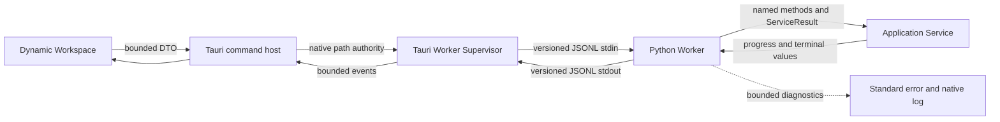
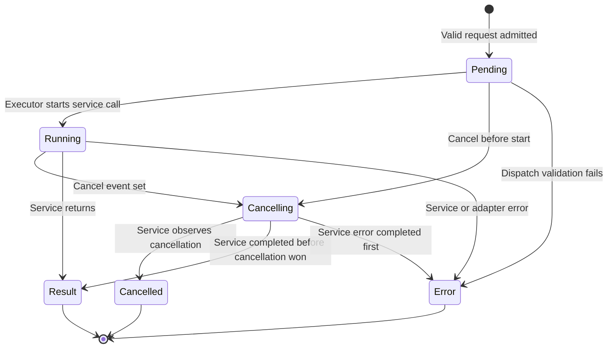
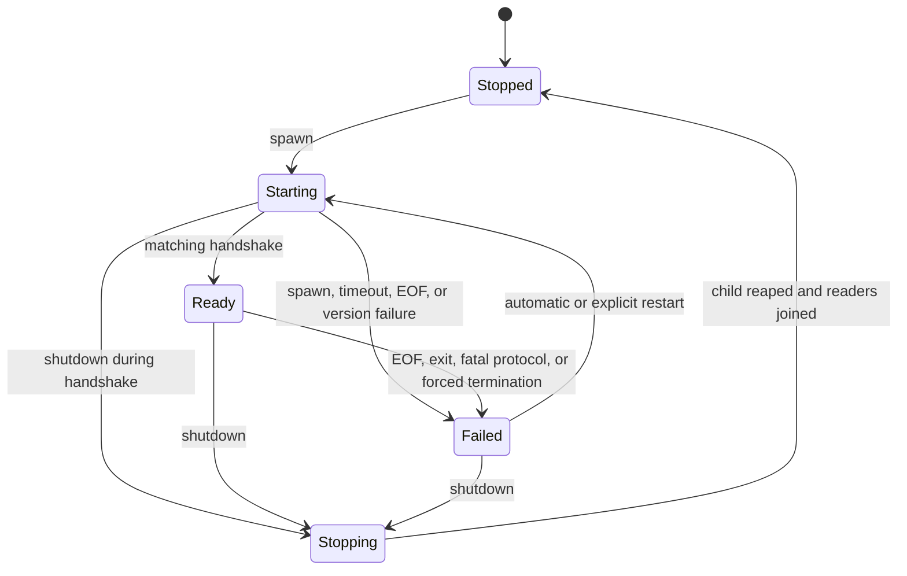
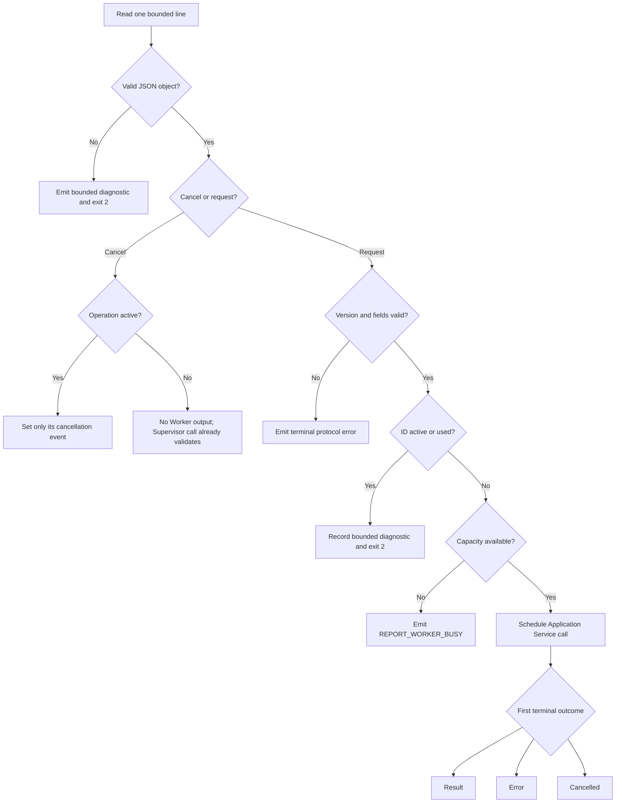
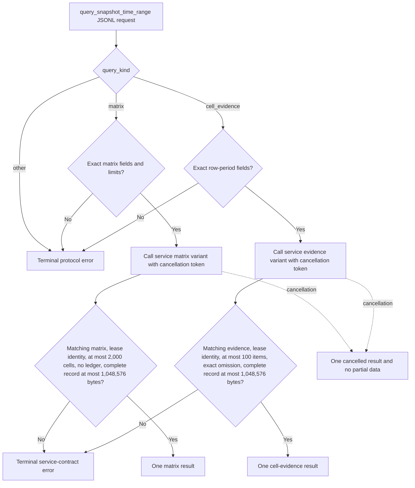

<!--
Copyright (c) 2026 Martin.Bechard@DevConsult.ca
Artifact-ID: cc0e0811-a0db-40d8-8d13-a2ad51af6570
Created-UTC: 2026-08-12T15:00:04Z
Creating-Agent: Dev Documentation Writer
Runtime: Codex
Dispatched-Model: gpt-5.6-sol
Reasoning-Effort: medium
Task-ID: /root/design_worker_protocol
Artifact-ID-Evidence: runtime-supplied
Created-UTC-Evidence: runtime-supplied
Creating-Agent-Evidence: runtime-supplied
Runtime-Evidence: runtime-supplied
Dispatched-Model-Evidence: runtime-supplied
Reasoning-Effort-Evidence: runtime-supplied
Task-ID-Evidence: runtime-supplied
-->

# Agent Report Worker Protocol Design

## Current Understanding

The Agent Report Worker Protocol connects the Tauri native host to one long-lived Python Application Service instance. The Python Worker adapts versioned JSON Lines (JSONL) messages to service calls. The Tauri Supervisor owns the worker process, validates protocol records, enforces native path authority, and recovers after process failure.

The module has one primary responsibility: provide a bounded, cancellable, and restartable process boundary without changing report semantics.

This design defines intended behavior. The selected design mode is **PLANNED_DEVELOPMENT**.

The module does not own report calculations, snapshot business rules, export content, webview state, or user-interface rendering. The Application Service owns those semantics. The Dynamic Workspace owns presentation.

## Authoritative Sources

The authoritative input set is:

| Source category | Durable source | Use in this design |
| --- | --- | --- |
| Accepted functional specification | [FR-001](../../requirements/functional/FR-001-agent-report-dynamic-app-and-static-export.md) | Actor-visible progress, cancellation, recovery, privacy, and atomic-publication outcomes |
| Accepted delivery plan | [PLAN-012](../../plans/PLAN-012-agent-report-dynamic-heatmap-parity.json) | Exact discriminated Heatmap operation family, cross-language field inventory, limits, compatibility isolation, and facet verification |
| Accepted architecture | [ARC-001](../../architecture/ARC-001-agent-report-dynamic-app-and-static-export.md) | Local processing, Tauri native authority, worker boundary, read-only sources, atomicity, startup validation, and compatibility |
| Owning high-level design | [HLD-003](../high-level/HLD-003-agent-report-dynamic-app-and-static-export.md) | Component ownership, exact paths, OP-31 through OP-34, CR-02, CR-03, TB-02, TB-03, lifecycle, and minimum cross-module fields |
| Accepted dependency module design | [CD-002](CD-002-agent-report-application-service.md) | Named service methods, request/result dataclasses, `OperationContext`, `CancellationToken`, `ProgressSink`, and returned `ServiceResult[T]` failures |
| Independent review evidence | [RVW-014](../../reviews/RVW-014-cd-004-agent-report-worker-protocol-checklist.md) | Eight required contract, safety, verification, and readiness corrections |
| Accepted decisions | Dev Architect reconciliation packet accepted for `/root/report_app_architecture` | Python-owned operation schemas, generic Rust result transport, cryptographic operation IDs, structured diagnostics, Tauri-only registry projections, long-lived process, cancellation escalation, and placement |
| Backlog requirement | [Modularize report tool for concurrent maintenance](../../future-ideas/modularize-report-tool-for-concurrent-maintenance.md) | Separation from the monolithic Python renderer |
| Project configuration | `tools/report/pyproject.toml`, `tools/report/desktop/src-tauri/Cargo.toml` | Python 3.11 or later, Rust crate, Serde, Tauri, and packaging boundaries |
| Relevant technology guidance | Python and Rust project configuration in ARC-001 | Standard-library Python worker and Serde-based Rust framing |
| Current implementation evidence | Not authoritative for planned protocol behavior | Existing Tauri process launch, progress parsing, diagnostics, and process-tree termination are compatibility evidence only |
| Procedures and runtime evidence | [Agent Report README](../../../tools/report/README.md); retained runtime evidence is not required | Current build and test entry points |

FR-001 wins for actor-visible behavior. ARC-001 wins for system-wide authority and constraints. HLD-003 wins for component ownership and cross-module fields. CD-002 wins for the exact in-process service API and expected-failure model. PLAN-012 supplies the accepted Heatmap cross-language field inventory while HLD-003 and CD-002 reconcile that inventory. This module design wins only for Worker and Supervisor internals. Current source wins only for statements explicitly labeled as current behavior.

## Related Code

The planned production files are not yet implemented:

```text
tools/report/
├── desktop/
│   └── src-tauri/
│       └── src/
│           └── report_worker.rs
└── src/
    └── agent_report/
        └── report_worker.py
```

Existing integration surfaces are `tools/report/desktop/src-tauri/src/lib.rs` and `tools/report/src/agent_report/application_service.py`. They are outside this module's file ownership.

## Related Tests

The planned tests are not yet implemented:

```text
tools/report/
├── desktop/
│   └── src-tauri/
│       └── tests/
│           └── report_worker.rs
└── tests/
    └── test_report_worker.py
```

Current renderer cancellation and process-tree tests in `tools/report/desktop/src-tauri/src/lib.rs` are compatibility evidence. They do not prove this planned protocol.

## Related Backlog Items

- [Modularize report tool for concurrent maintenance](../../future-ideas/modularize-report-tool-for-concurrent-maintenance.md) explains the required Python boundary.
- No separate accepted backlog item for CD-004 is identified.

## Related Wiki Pages

- [FR-001](../../requirements/functional/FR-001-agent-report-dynamic-app-and-static-export.md) defines visible progress, cancellation, and recovery.
- [ARC-001](../../architecture/ARC-001-agent-report-dynamic-app-and-static-export.md) defines the system boundary and native authority.
- [HLD-003](../high-level/HLD-003-agent-report-dynamic-app-and-static-export.md) defines the parent subsystem and cross-module contracts.
- [CD-001](CD-001-codex-rollout-metrics.md) defines established discovery, privacy, diagnostics, and packaging behavior.
- [CD-002](CD-002-agent-report-application-service.md) defines the process-local request and result types that the Worker preserves.
- [CD-005](CD-005-agent-report-dynamic-workspace.md) consumes the exact camel-case Tauri projection of the Worker result union.
- No project wiki page is identified.

## Open Questions

No blocking CD-004 question is recorded.

The four HLD-003 product questions remain outside this module's decision authority:

| Parent question | CD-004 classification | Accountable role | Affected contract and readiness effect |
| --- | --- | --- | --- |
| OQ-01: compatibility-default timing | Non-blocking and out of scope | Product owner | Does not change the Worker protocol. It blocks only later default changes. |
| OQ-02: event-cache quota and retention | Non-blocking and out of scope | Product owner with Dev Architect review | Does not change supervision. It blocks production cache-maintenance defaults. |
| OQ-03: first-release non-Codex dynamic scope | Non-blocking and out of scope | Product owner | Does not change the transport. It blocks only non-Codex dynamic modules. |
| OQ-04: standalone-browser support | Non-blocking and out of scope | Product owner with Dev Architect review | Does not change the Tauri Worker path. It blocks only a browser transport. |

## Maintenance Notes

Recheck this design when HLD-003 changes the operation envelope, progress fields, process ownership, cancellation policy, snapshot lifecycle, Heatmap union, or path authority. Recheck it when `application_service.py`, the Tauri sidecar composition root, package versions, process-tree behavior, or diagnostics policy changes.

The latest meaningful source review is 2026-08-13. The review used FR-001 HM-F01 through HM-F15, PLAN-012, ARC-001, HLD-003, project configuration, and current Tauri process-management evidence.

## Requirements Coverage

| Requirement source and ID | Claim mode | Required outcome | Satisfying contract, rule, state, or error path | Status | Out-of-scope authority, rationale, and owning artifact | Verification |
| --- | --- | --- | --- | --- | --- | --- |
| Target assignment: Python Worker Protocol Adapter and Tauri Worker Supervisor | INTENDED_BEHAVIOR | One shared module design defines the Python adapter and Rust supervisor without owning business semantics or UI. | Runtime Path, Responsibilities, Public Contracts, and symbol ledger | DEFINED | Business semantics: CD-002; UI: CD-005 | Python and Rust symbol and boundary tests |
| Target assignment: versioned JSONL request, progress, result, error, and cancel envelopes | INTENDED_BEHAVIOR | Every transport message has a version and stable correlation fields. Each operation receives at most one terminal record. | PC-01 through PC-07; INV-01 through INV-05 | DEFINED | Result payload semantics: CD-002 | Framing, schema, correlation, and terminal-cardinality tests |
| Target assignment: minimum stable fields and stdout purity | INTENDED_BEHAVIOR | Standard output contains only bounded UTF-8 JSONL protocol records. | PC-01 through PC-07; PR-01; INV-01 | DEFINED | Diagnostic presentation: Tauri host and CD-005 | Stdout contamination and line-bound tests |
| Target assignment: bounded progress | INTENDED_BEHAVIOR | Progress is ordered per operation, monotonic within a phase, and numerically bounded. | PC-03; PR-06; Python Transport Errors | DEFINED | Phase meaning: operation owner in CD-002 | Progress boundary and ordering tests |
| Target assignment: per-operation cancellation | INTENDED_BEHAVIOR | A cancel envelope targets one operation and does not cancel unrelated work. | PC-06; PR-07; operation state diagram | DEFINED | Service cancellation checkpoints: CD-002 and report core | Cooperative-cancel and isolation tests |
| Target assignment: grace and forced process-tree termination | INTENDED_BEHAVIOR | Tauri waits for a terminal cancellation record, then terminates only its owned process tree after the grace period. | PC-10; PR-08; EP-04 through EP-06 | DEFINED | OS implementation remains in the Supervisor | Acknowledged and forced-cancel tests on Unix and Windows |
| Target assignment: restart | INTENDED_BEHAVIOR | A failed or forcibly terminated worker is replaced and revalidated. In-flight work is never replayed automatically. | PC-11; PR-09; supervisor state diagram | DEFINED | Snapshot reopen semantics: CD-002 | EOF, protocol-failure, forced-restart, and no-replay tests |
| Target assignment: atomic publication | INTENDED_BEHAVIOR | A terminal result becomes visible only after the Application Service completes its atomic state or artifact publication. Failure and cancellation publish no partial state. | PC-04; EP-02; INV-09 | DEFINED | Cache transaction: CD-003; export staging: CD-006 | Terminal-order and cancellation-at-publication tests |
| Target assignment: path authority | INTENDED_BEHAVIOR | Only Tauri-authorized roots, exact native-dialog targets, and the host-selected worker executable reach the worker. | PC-09; Trust And Identity Boundaries; INV-11 | DEFINED | Application semantic validation: CD-002 | Root, target, symlink-escape, and executable tests |
| Target assignment: diagnostics privacy | INTENDED_BEHAVIOR | Diagnostics are bounded and omit arguments, results, raw records, transcript text, cache paths, and unrestricted filesystem paths. | PC-08; INV-10; Error Handling | DEFINED | User-visible diagnostic rendering: Tauri host | Redaction, truncation, and stderr-bound tests |
| Target assignment: startup version validation | INTENDED_BEHAVIOR | The Supervisor completes an exact protocol and package-version handshake before accepting work. | PC-07; PR-03; Error Handling | DEFINED | Bundled discovery validation remains OP-42 and CD-001 | Match, mismatch, timeout, and pre-ready rejection tests |
| Target assignment: lifecycle and concurrency | INTENDED_BEHAVIOR | The module bounds concurrent work, serializes operation-state mutation, accepts cancel during saturation, and closes cleanly. | PC-12; Internal Data And State; both state diagrams | DEFINED | Snapshot semantic conflicts: CD-002 | Capacity, duplicate-ID, concurrent-output, shutdown, and race tests |
| HLD-003 OP-31 | INTENDED_BEHAVIOR | Worker emits ordered bounded progress without state publication. | PC-03 | DEFINED | Phase content: CD-002 | `test_progress_is_ordered_bounded_monotonic_and_rate_limited_per_operation` |
| HLD-003 OP-32 | INTENDED_BEHAVIOR | Worker emits one terminal success envelope. | PC-04 | DEFINED | Result content: CD-002 | `test_success_is_emitted_once_after_service_completion` |
| HLD-003 OP-33 | INTENDED_BEHAVIOR | Worker emits one structured terminal error and preserves coherent state. | PC-05; Error Handling | DEFINED | Rollback and state coherence: CD-002, CD-003, CD-006 | `test_service_error_is_terminal_and_not_republished` |
| HLD-003 OP-34 | INTENDED_BEHAVIOR | Worker or Supervisor emits one terminal cancelled outcome and preserves coherent state. | PC-06; PC-10; EP-03 through EP-06 | DEFINED | Service rollback checkpoints: CD-002 | Cooperative and forced cancellation tests |
| HLD-003 CR-02 and TB-02 | INTENDED_BEHAVIOR | Tauri owns its spawned process; Supervisor validates version, framing, IDs, terminal cardinality, and bounded disclosure. | PC-07 through PC-11; Trust And Identity Boundaries | DEFINED | None | Rust protocol and process tests |
| HLD-003 CR-03 and TB-03 | INTENDED_BEHAVIOR | Worker maps every configured operation to one exact named method on one process-local CD-002 service instance. | PC-01A; `WorkerRuntime`; PR-04 through PR-07 | DEFINED | Operation semantics and state transitions: CD-002 | Named-method dispatch and `ServiceResult` tests |
| FR-001 HM-F01 through HM-F10; PLAN-012 cross-language inventory | INTENDED_BEHAVIOR | `query_snapshot_time_range` carries one exact `matrix|cell_evidence` discriminated request and result family. It preserves mode, exact semantic `row_key` catalog, `row_order_index`, value state, scale, and immutable snapshot/revision semantics without a second evidence operation. | PC-01A Heatmap wire contract; `OperationBinding`; result correlation rules | DEFINED | Aggregation and formatting: CD-002; presentation: CD-005 | Exact-union, semantic-row, discriminant, field, scale, revision, and cross-language preservation tests |
| FR-001 HM-F11 and HM-F13 | INTENDED_BEHAVIOR | Matrix records contain no evidence ledger or eager detail. Cell-evidence records contain at most 100 chronological sanitized items and an exact omitted count. | PC-01A Heatmap wire contract; PR-04 through PR-07; INV-19 | DEFINED | Evidence calculation and sanitation: CD-002 | Matrix-exclusion, evidence-cap, chronology, privacy, and streaming tests |
| FR-001 HM-F12; JFP-HM-03 | INTENDED_BEHAVIOR | Preserve the exact mode, row ID, echoed semantic row key and order index, period boundaries, requested and actual resolution, snapshot range, and revision fields required for selection, drilldown, step-back, breadcrumbs, adjacent-period movement, scrolling, period controls, and disabled boundaries. | PC-01A Heatmap wire contract; lossless snake-case to camel-case projection | OUT_OF_SCOPE | CD-005 owns pointer, keyboard, focus, navigation-history, visible-control, and disabled-boundary behavior. CD-004 transports the required selectors and results but does not implement UI interaction. | Worker/Rust field-preservation and evidence-correlation tests; CD-005 pointer, keyboard, navigation, and accessibility tests |
| FR-001 HM-F14 | INTENDED_BEHAVIOR | Matrix results contain at most 2,000 cells. Every complete request and result JSONL record, including its line feed, is no greater than 1,048,576 bytes. | Protocol Constants; PC-01A; INV-02 and INV-19 | DEFINED | Coarsening and row omission: CD-002 | 2,000-cell, 2,001-rejection, and worst-case encoded-record tests |
| FR-001 HM-F15; JFP-HM-01 and JFP-HM-02 | INTENDED_BEHAVIOR | Preserve losslessly the mode, friendly row label, local-period source instants, formatted and raw nullable values, value state, `applicable_zero`, scale availability and reason, scale basis and bounds, normalized intensity, supporting text, `evidence_method`, and selection-bound evidence identity. Missing evidence never becomes zero. Unknown context capacity retains unavailable scale, N/A reason, null intensity, and no percentage or fallback. | PC-01A Heatmap wire contract; exact serializer; Rust generic-map validation and camel-case projection | DEFINED | CD-002 owns semantic calculation. CD-005 owns actor-visible wording, local-time formatting, non-color rendering, selection state, and contextual UX review. | Python and Rust exact-field, null, discriminant, scale-union, N/A, and case-projection tests; CD-005 wording and non-color tests |
| FR-001 retained MCP compatibility; PLAN-012 compatibility boundary | CURRENT_BEHAVIOR and INTENDED_BEHAVIOR | The Worker snapshot binding is named `query_snapshot_time_range`. Retained MCP `query_time_range` remains separate and never enters this Worker dispatch table. | `OperationName`; PC-01A; INV-20 | DEFINED | Retained MCP implementation and schema: MCP adapter | Exhaustive operation inventory and retained-schema isolation tests |
| ARC-01, ARC-03, ARC-05, ARC-06 | INTENDED_BEHAVIOR | Processing stays local; each process owns a service instance; Tauri owns native authority; webview data stays bounded. | Parent Context, PC-09, Trust And Identity Boundaries | DEFINED | UI DTO fields: CD-005 | Boundary and path tests |
| ARC-07, ARC-14, ARC-15, ARC-16 | INTENDED_BEHAVIOR | Sources stay read-only; failure cannot publish partial state; opaque and epistemic data remain safe; bundled versions validate at startup. | INV-09 through INV-12; startup handshake | DEFINED | Discovery engine implementation: CD-001 | Privacy, atomicity, startup, and no-source-write tests |
| HLD-003 OQ-01 through OQ-04 | OPEN_QUESTION | Preserve the parent questions without choosing answers in CD-004. | Open Questions | OUT_OF_SCOPE | Product decisions affect other branches, as defined by HLD-003. | HLD requirements review |

## Runtime Path

The Python folder entry point is module `agent_report.report_worker`. Its executable entry point is `agent_report.report_worker:main`.

The Rust folder entry point is crate module `agent_report_desktop::report_worker`. The existing crate root must declare `pub mod report_worker;` during integration. That integration edit is outside CD-004 file ownership.

```text
tools/report/
├── desktop/
│   └── src-tauri/
│       ├── src/
│       │   └── report_worker.rs
│       └── tests/
│           └── report_worker.rs
├── src/
│   └── agent_report/
│       └── report_worker.py
└── tests/
    └── test_report_worker.py
```

### Python Symbol Ledger

| Symbol | Exact signature or shape | Responsibility |
| --- | --- | --- |
| `PROTOCOL_VERSION` | `Final[int] = 1` | Current protocol version |
| `MAX_RECORD_BYTES` | `Final[int] = 1_048_576` | Maximum UTF-8 bytes in one input or output record, including the newline |
| `MAX_HEATMAP_CELLS` | `Final[int] = 2_000` | Maximum total matrix cells in one result |
| `MAX_HEATMAP_EVIDENCE_ITEMS` | `Final[int] = 100` | Protocol-fixed selected-cell evidence cap |
| `MAX_MESSAGE_CHARS` | `Final[int] = 512` | Maximum safe progress or error message length |
| `JsonValue` | `None | bool | int | float | str | list[JsonValue] | dict[str, JsonValue]` | JSON-compatible recursive value |
| `WorkerConfig` | `@dataclass(frozen=True, slots=True)` with `protocol_version: int`, `package_version: str`, `max_in_flight: int`, and `max_record_bytes: int` | Validated Worker limits |
| `RequestEnvelope` through `CancelledEnvelope` | Exact frozen slotted dataclasses below | Cross-language wire records |
| `StructuredError` | Exact frozen slotted dataclass below | Wire projection of CD-002 `ReportError` |
| `ThreadCancellationToken` | `class ThreadCancellationToken(CancellationToken)` with `def is_cancelled(self) -> bool` | Adapt one operation's `threading.Event` to CD-002 |
| `MonotonicClock` | Protocol method `def now(self) -> float` | Supply deterministic monotonic seconds |
| `ApplicationServiceFactory` | `Callable[[ApplicationServiceConfig], ApplicationService]` | Construct one CD-002 service after handshake validation; the closure binds dependencies |
| `parse_input_line` | `def parse_input_line(line: bytes, *, max_record_bytes: int = MAX_RECORD_BYTES) -> RequestEnvelope | CancelEnvelope` | Decode and validate exactly one JSONL input record |
| `encode_output_record` | `def encode_output_record(record: ProgressEnvelope | ResultEnvelope | ErrorEnvelope | CancelledEnvelope, *, max_record_bytes: int = MAX_RECORD_BYTES) -> bytes` | Serialize exactly one compact UTF-8 JSON record plus `b"\n"` |
| `decode_service_request` | `def decode_service_request(request: RequestEnvelope) -> ServiceRequestValue` | Reject unknown or mismatched fields and construct one accepted CD-002 request dataclass |
| `ServiceRequestValue` | Union of the CD-002 request dataclasses named in PC-01A; thirteen operations use fourteen classes because Heatmap has two discriminated variants | Exact decoded request type |
| `ServiceResultValue` | Exact union below, including each concrete `PageResult` item specialization | Exhaustive accepted CD-002 success-value set |
| `OperationBinding` | Frozen slotted dataclass with `request_types: tuple[type[ServiceRequestValue], ...]`, `method_name: ServiceMethodName`, `result_types: tuple[type[ServiceResultValue], ...]`, `page_item_type: type[PageRowValue] | None`, and `serialize_result: ResultSerializer` | Bind one operation to its exact request/result class set, named method, optional page-row type, and wire schema; only Heatmap has two classes in each tuple |
| `OPERATION_BINDINGS` | `Final[dict[OperationName, OperationBinding]]` with exactly the thirteen PC-01A entries | Runtime authority for exhaustive dispatch and result validation; module initialization asserts key equality with `get_args(OperationName)` |
| `dispatch_service_operation` | `def dispatch_service_operation(service: ApplicationService, request: RequestEnvelope, *, cancellation: ThreadCancellationToken, progress: ProgressSink) -> ServiceResult[ServiceResultValue]` | Call one named CD-002 method and preserve its returned failure model |
| `serialize_service_value` | `def serialize_service_value(request: RequestEnvelope, value: ServiceResultValue) -> dict[str, JsonValue]` | Require the request operation's exact success type, nested row types, and correlation fields before deterministic serialization |
| `OperationSlot` | Exact mutable slotted dataclass below | Own one operation's cancellation, terminal, and progress state |
| `OperationState` | Enum values `PENDING`, `RUNNING`, `CANCELLING`, `RESULT`, `ERROR`, `CANCELLED` | Enforce one legal terminal transition |
| `WorkerRuntime.__init__` | `def __init__(self, service_factory: ApplicationServiceFactory, config: WorkerConfig, *, clock: MonotonicClock, stdin: BinaryIO, stdout: BinaryIO, stderr: TextIO) -> None` | Delay construction of one service until handshake validation |
| `WorkerRuntime.run` | `def run(self) -> int` | Read input until clean EOF or fatal transport failure |
| `WorkerRuntime.submit` | `def submit(self, request: RequestEnvelope) -> None` | Register and schedule one request |
| `WorkerRuntime.cancel` | `def cancel(self, request: CancelEnvelope) -> None` | Set only the selected operation's cancellation event |
| `WorkerRuntime._record_progress` | `def _record_progress(self, operation_id: str, phase: str, completed: int, total: int | None, message: str) -> None` | Apply the exact per-operation progress state machine and emit only eligible records |
| `WorkerRuntime.shutdown` | `def shutdown(self, *, wait: bool) -> None` | Stop admission, cancel active work, and close the executor |
| `create_worker_runtime` | `def create_worker_runtime(config: WorkerConfig, *, stdin: BinaryIO, stdout: BinaryIO, stderr: TextIO) -> WorkerRuntime` | Bind the production service factory and dependencies; the runtime invokes it after handshake validation |
| `main` | `def main(argv: Sequence[str] | None = None) -> int` | Run `worker` stdio mode and map startup or fatal transport failure to exit status |

The Python declarations are exact:

```python
@dataclass(frozen=True, slots=True)
class RequestEnvelope:
    protocol_version: int
    operation_id: str
    operation: str
    snapshot_id: str | None
    arguments: dict[str, JsonValue]

@dataclass(frozen=True, slots=True)
class CancelEnvelope:
    protocol_version: int
    operation_id: str
    type: Literal["cancel"] = "cancel"

@dataclass(frozen=True, slots=True)
class StructuredError:
    code: str
    message: str
    operation_id: str | None
    recoverable: bool
    current_source_revision: str | None = None
    preflight_required: bool = False
    restart_from_first_page: bool = False

@dataclass(frozen=True, slots=True)
class ProgressEnvelope:
    protocol_version: int
    operation_id: str
    type: Literal["progress"]
    operation: str
    snapshot_id: str | None
    phase: str
    completed: int
    total: int | None
    message: str

@dataclass(frozen=True, slots=True)
class ResultEnvelope:
    protocol_version: int
    operation_id: str
    type: Literal["result"]
    operation: str
    snapshot_id: str | None
    ok: Literal[True]
    result: dict[str, JsonValue]

@dataclass(frozen=True, slots=True)
class ErrorEnvelope:
    protocol_version: int
    operation_id: str
    type: Literal["error"]
    operation: str
    snapshot_id: str | None
    ok: Literal[False]
    error: StructuredError

@dataclass(frozen=True, slots=True)
class CancelledEnvelope:
    protocol_version: int
    operation_id: str
    type: Literal["cancelled"]
    operation: str
    snapshot_id: str | None
    ok: Literal[False]
    error: StructuredError

@dataclass(slots=True)
class OperationSlot:
    request: RequestEnvelope
    cancellation_event: threading.Event
    state: OperationState
    last_observed_phase: str | None
    last_observed_completed: int
    last_observed_progress: ProgressEnvelope | None
    last_emitted_progress: ProgressEnvelope | None
    pending_progress: ProgressEnvelope | None
    next_progress_at: float
    lock: threading.Lock
```

Python integers that cross the wire fit unsigned 64-bit range `0` through `18_446_744_073_709_551_615`. A parser rejects `bool` where an integer is required.

The result unions are exact:

```python
OperationName = Literal[
    "preflight_report",
    "open_snapshot",
    "get_summary",
    "list_agents",
    "list_turns",
    "list_events",
    "query_snapshot_time_range",
    "query_sequence",
    "query_coordination",
    "get_event_details",
    "refresh_snapshot",
    "export_snapshot",
    "close_snapshot",
]

ServiceResultValue = (
    PreflightResult
    | SnapshotMetadata
    | SummaryResult
    | PageResult[AgentRow, AgentFilters, AgentSort]
    | PageResult[TurnRow, TurnFilters, TurnSort]
    | PageResult[EventRow, EventFilters, EventSort]
    | HeatmapSnapshotQueryResult
    | SequenceResult
    | PageResult[CoordinationRow, CoordinationFilters, CoordinationSort]
    | EventDetail
    | RefreshSnapshotResult
    | ExportResult
    | CloseSnapshotResult
)

PageRowValue = AgentRow | TurnRow | EventRow | SequenceRow | CoordinationRow

ServiceMethodName = Literal[
    "preflight_report",
    "open_snapshot",
    "get_summary",
    "list_agents",
    "list_turns",
    "list_events",
    "query_snapshot_time_range",
    "query_sequence",
    "query_coordination",
    "get_event_details",
    "refresh_snapshot",
    "export_snapshot",
    "close_snapshot",
]

ResultSerializer = Callable[[ServiceResultValue], dict[str, JsonValue]]
```

Python erases generic parameters at runtime. Therefore, a binding for a page operation validates both `type(value) is PageResult` and `type(item) is` the operation's exact row class for every item. Every non-page binding validates exact membership in its `result_types`. Only Heatmap has two permitted result classes, and its request discriminant selects one of them. Subclasses are not accepted. These checks occur before any dataclass traversal or output write.

`main` accepts only `--max-in-flight INTEGER` and `--protocol-version INTEGER`. The package composition root supplies worker mode. Development invocation is `python -m agent_report.report_worker`. Packaged invocation is `agent-report worker`. The CLI adapter owns registration of the packaged subcommand.

### Rust Symbol Ledger

| Symbol | Exact signature or shape | Responsibility |
| --- | --- | --- |
| `WORKER_PROTOCOL_VERSION` | `pub const WORKER_PROTOCOL_VERSION: u32 = 1;` | Current protocol version |
| `MAX_WORKER_RECORD_BYTES` | `pub const MAX_WORKER_RECORD_BYTES: usize = 1_048_576;` | Maximum record size |
| `MAX_HEATMAP_CELLS` | `pub const MAX_HEATMAP_CELLS: usize = 2_000;` | Maximum total matrix cells validated before projection |
| `MAX_HEATMAP_EVIDENCE_ITEMS` | `pub const MAX_HEATMAP_EVIDENCE_ITEMS: usize = 100;` | Maximum cell-evidence items validated before projection |
| `WorkerSupervisorConfig` | `pub struct WorkerSupervisorConfig { pub max_in_flight: usize, pub cancellation_grace: Duration, pub startup_timeout: Duration, pub max_record_bytes: usize, pub max_stderr_bytes: usize, pub expected_package_version: String, pub service_configuration: ServiceConfiguration, pub path_authority: PathAuthority }` | Validated native limits, CD-002 startup values, and authority |
| `ServiceConfiguration` | `pub struct ServiceConfiguration { pub parser_version: String, pub pricing_digest: String, pub formatter_digest: String, pub default_page_size: u16, pub max_page_size: u16, pub max_heatmap_cells: u32 }` | Non-path fields inserted into the trusted startup handshake |
| `WorkerLaunchSpec` | `pub struct WorkerLaunchSpec { pub executable: PathBuf, pub arguments: Vec<OsString>, pub environment: BTreeMap<OsString, OsString> }` | Host-selected executable and environment |
| `ProcessTreeHandle` | Exact target-specific declarations below | Store only the verified Unix process group or owned Windows Job Object that this Supervisor can terminate |
| `PathAuthority` | `pub struct PathAuthority { pub source_roots: Vec<PathBuf> }` | Canonical allowed read roots; export destination authority remains per-operation |
| `OutputGrant` | Non-`Clone` opaque struct with private `operation_id: String`, `target: PathBuf`, and `replace: bool` fields | Consumable native-dialog authority for one exact publication target |
| `AutomationSurfaceWire` | Serde enum values `tauri`, `cli`, and `mcp` | Exact CD-002 automation-surface wire vocabulary without owning selection semantics |
| `ExportModeWire` | Serde enum values `summary` and `directory` | Exact nullable CD-002 export-mode wire vocabulary without resolving its default |
| `RequestEnvelope` through `CancelledEnvelope` | Exact Serde declarations below | Cross-language wire records |
| `StructuredError` | Exact Serde struct below | Stable CD-002 error projection |
| `WorkerWireRecord` | Internally tagged Serde enum below | Exhaustive Worker stdout record |
| `HostCancelledOutcome` | Exact host-only struct below | Represent cooperative or forced host cancellation without posing as a Worker wire record |
| `HostTerminalOutcome` | Exact host-only enum below | Supervisor event; it does not deserialize from Worker stdout |
| `TrustedWorkerRequest` | Opaque struct with private `envelope: RequestEnvelope` and `output_grant: Option<OutputGrant>` | Prevent generic untrusted JSON submission |
| `SupervisorCommand` | Private enum with the exact variants below | Serialize every lifecycle and terminal trigger through one owner |
| `RecoveryAttempt` | Private struct with `source_generation: u64` and `target_generation: u64` | Distinguish active Failed-state cleanup from a stable Failed state |
| `RecoveryCoordinator` | Private single-thread event loop owning `CoordinatorState` | Sole owner of generation replacement, observer completion, and process reaping |
| `SupervisorState` | `pub enum SupervisorState { Stopped, Starting, Ready, Stopping, Failed }` | Process lifecycle |
| `RestartReason` | `pub enum RestartReason { ForcedCancellation, EndOfFile, ProtocolFailure, ProcessExit, Explicit }` | Record why a generation is replaced without exposing diagnostics |
| `PathKind` | `pub enum PathKind { WorkerExecutable, Source, StagingRoot, OutputTarget }` | Identify a rejected authority class without disclosing its path |
| `OperationObserver` | `pub trait OperationObserver: Send + Sync + 'static` with `fn on_progress(&self, value: ProgressEnvelope)` and `fn on_terminal(&self, value: HostTerminalOutcome)` | Thread-safe Tauri-channel adapter seam |
| `WorkerSupervisor::spawn` | `pub fn spawn(launch: WorkerLaunchSpec, config: WorkerSupervisorConfig) -> Result<Arc<Self>, SupervisorError>` | Validate static inputs, start the coordinator and initial process tree, and return the Supervisor in Starting |
| `WorkerSupervisor::wait_until_ready` | `pub fn wait_until_ready(&self) -> Result<(), SupervisorError>` | Join the current startup or recovery attempt; return after Ready or its Failed/Stopping result |
| `WorkerSupervisor::grant_output_target` | `pub fn grant_output_target(&self, operation_id: &str, target: &Path, replace: bool) -> Result<OutputGrant, SupervisorError>` | Bind one native-dialog target to one operation |
| `TrustedWorkerRequest::path_free` | `pub fn path_free(envelope: RequestEnvelope) -> Result<Self, SupervisorError>` | Validate one PC-01A operation other than `export_snapshot`; reject every path field |
| `TrustedWorkerRequest::export` | `pub fn export(operation_id: &str, snapshot_id: &str, surface: AutomationSurfaceWire, mode: Option<ExportModeWire>, include_sqlite_archive: bool, grant: OutputGrant) -> Result<Self, SupervisorError>` | Consume the grant and construct the entire export envelope with its exact target and replace decision |
| `WorkerSupervisor::submit` | `pub fn submit(&self, request: TrustedWorkerRequest, observer: Arc<dyn OperationObserver>) -> Result<(), SupervisorError>` | Submit only a request produced by PC-09 typed constructors |
| `WorkerSupervisor::cancel` | `pub fn cancel(&self, operation_id: &str) -> Result<(), SupervisorError>` | Write one cancel line and start the grace timer |
| `WorkerSupervisor::restart` | `pub fn restart(&self, reason: RestartReason) -> Result<(), SupervisorError>` | Enqueue one serialized lifecycle command and await its coalesced outcome |
| `WorkerSupervisor::shutdown` | `pub fn shutdown(&self) -> Result<(), SupervisorError>` | Enqueue shutdown and await process reaping |
| `parse_worker_record` | `pub fn parse_worker_record(line: &[u8], max_record_bytes: usize) -> Result<WorkerWireRecord, SupervisorError>` | Validate framing, version, field types, bounds, and record-specific invariants |
| `validate_snapshot_heatmap_request` | `fn validate_snapshot_heatmap_request(snapshot_id: &str, arguments: &serde_json::Map<String, serde_json::Value>) -> Result<HeatmapQueryKindWire, SupervisorError>` | Validate one exact snake-case matrix or cell-evidence request without accepting retained MCP fields |
| `validate_snapshot_heatmap_result` | `fn validate_snapshot_heatmap_result(request: &RequestEnvelope, result: &serde_json::Map<String, serde_json::Value>) -> Result<(), SupervisorError>` | Validate the matching union variant, immutable identity correlation, true scale union, numeric bounds, 2,000/100 limits, and record size before projection |
| `project_snapshot_heatmap_result` | `fn project_snapshot_heatmap_result(result: serde_json::Map<String, serde_json::Value>) -> Result<serde_json::Map<String, serde_json::Value>, SupervisorError>` | Rename exact snake-case keys to camel case recursively while preserving every value, null, discriminant, evidence method, and ordered array |
| `force_terminate_process_tree` | `pub fn force_terminate_process_tree(tree: &ProcessTreeHandle) -> Result<(), SupervisorError>` | Terminate only the verified Supervisor-owned process group or Job Object |
| `SupervisorError` | Error enum listed in Error Handling | Native startup, path, protocol, capacity, I/O, and lifecycle failures |

The Rust declarations are exact. `OwnedHandle` is `std::os::windows::io::OwnedHandle` on Windows.

```rust
#[cfg(unix)]
pub struct ProcessTreeHandle {
    process_id: u32,
    process_group_id: libc::pid_t,
}

#[cfg(windows)]
pub struct ProcessTreeHandle {
    process_id: u32,
    job: OwnedHandle,
    process: OwnedHandle,
}

#[derive(Debug, Clone, Serialize, Deserialize)]
#[serde(deny_unknown_fields)]
pub struct RequestEnvelope {
    pub protocol_version: u32,
    pub operation_id: String,
    pub operation: String,
    #[serde(deserialize_with = "deserialize_required_nullable_string")]
    pub snapshot_id: Option<String>,
    pub arguments: serde_json::Map<String, serde_json::Value>,
}

#[derive(Debug, Clone, Serialize, Deserialize)]
#[serde(deny_unknown_fields)]
pub struct CancelEnvelope {
    pub protocol_version: u32,
    pub operation_id: String,
    #[serde(rename = "type")]
    pub record_type: CancelRecordType,
}

#[derive(Debug, Clone, Serialize, Deserialize)]
pub enum CancelRecordType {
    #[serde(rename = "cancel")]
    Cancel,
}

#[derive(Debug, Clone, Serialize, Deserialize)]
#[serde(rename_all = "lowercase")]
pub enum AutomationSurfaceWire {
    Tauri,
    Cli,
    Mcp,
}

#[derive(Debug, Clone, Serialize, Deserialize)]
#[serde(rename_all = "lowercase")]
pub enum ExportModeWire {
    Summary,
    Directory,
}

#[derive(Debug, Clone, Copy, PartialEq, Eq, Serialize, Deserialize)]
#[serde(rename_all = "snake_case")]
pub enum HeatmapQueryKindWire {
    Matrix,
    CellEvidence,
}

#[derive(Debug, Clone, Serialize, Deserialize)]
#[serde(deny_unknown_fields)]
pub struct StructuredError {
    pub code: String,
    pub message: String,
    #[serde(deserialize_with = "deserialize_required_nullable_string")]
    pub operation_id: Option<String>,
    pub recoverable: bool,
    #[serde(deserialize_with = "deserialize_required_nullable_string")]
    pub current_source_revision: Option<String>,
    pub preflight_required: bool,
    pub restart_from_first_page: bool,
}

#[derive(Debug, Clone, Serialize, Deserialize)]
#[serde(deny_unknown_fields)]
pub struct ProgressEnvelope {
    pub protocol_version: u32,
    pub operation_id: String,
    pub operation: String,
    #[serde(deserialize_with = "deserialize_required_nullable_string")]
    pub snapshot_id: Option<String>,
    pub phase: String,
    pub completed: u64,
    #[serde(deserialize_with = "deserialize_required_nullable_u64")]
    pub total: Option<u64>,
    pub message: String,
}

#[derive(Debug, Clone, Serialize, Deserialize)]
#[serde(deny_unknown_fields)]
pub struct ResultEnvelope {
    pub protocol_version: u32,
    pub operation_id: String,
    pub operation: String,
    #[serde(deserialize_with = "deserialize_required_nullable_string")]
    pub snapshot_id: Option<String>,
    pub ok: bool,
    pub result: serde_json::Map<String, serde_json::Value>,
}

#[derive(Debug, Clone, Serialize, Deserialize)]
#[serde(deny_unknown_fields)]
pub struct ErrorEnvelope {
    pub protocol_version: u32,
    pub operation_id: String,
    pub operation: String,
    #[serde(deserialize_with = "deserialize_required_nullable_string")]
    pub snapshot_id: Option<String>,
    pub ok: bool,
    pub error: StructuredError,
}

#[derive(Debug, Clone, Serialize, Deserialize)]
#[serde(deny_unknown_fields)]
pub struct CancelledEnvelope {
    pub protocol_version: u32,
    pub operation_id: String,
    pub operation: String,
    #[serde(deserialize_with = "deserialize_required_nullable_string")]
    pub snapshot_id: Option<String>,
    pub ok: bool,
    pub error: StructuredError,
}

#[derive(Debug, Clone, Serialize, Deserialize)]
#[serde(tag = "type", rename_all = "snake_case")]
pub enum WorkerWireRecord {
    Progress(ProgressEnvelope),
    Result(ResultEnvelope),
    Error(ErrorEnvelope),
    Cancelled(CancelledEnvelope),
}

#[derive(Debug, Clone)]
pub struct HostCancelledOutcome {
    pub operation_id: String,
    pub operation: String,
    pub snapshot_id: Option<String>,
    pub error: StructuredError,
    pub forced: bool,
}

#[derive(Debug, Clone)]
pub enum HostTerminalOutcome {
    Result(ResultEnvelope),
    Error(ErrorEnvelope),
    Cancelled(HostCancelledOutcome),
}

pub trait OperationObserver: Send + Sync + 'static {
    fn on_progress(&self, value: ProgressEnvelope);
    fn on_terminal(&self, value: HostTerminalOutcome);
}

enum SupervisorCommand {
    WaitUntilReady {
        reply: SyncSender<Result<(), SupervisorError>>,
    },
    Submit {
        request: TrustedWorkerRequest,
        observer: Arc<dyn OperationObserver>,
        reply: SyncSender<Result<(), SupervisorError>>,
    },
    Cancel {
        operation_id: String,
        reply: SyncSender<Result<(), SupervisorError>>,
    },
    Restart {
        reason: RestartReason,
        reply: SyncSender<Result<(), SupervisorError>>,
    },
    Shutdown {
        reply: SyncSender<Result<(), SupervisorError>>,
    },
    WorkerRecord {
        generation_id: u64,
        record: WorkerWireRecord,
    },
    WorkerProtocolFailure {
        generation_id: u64,
        error: SupervisorError,
    },
    WorkerEof {
        generation_id: u64,
    },
    ProcessExited {
        generation_id: u64,
        exit_code: Option<i32>,
    },
    GraceExpired {
        generation_id: u64,
        operation_id: String,
    },
    StartupExpired {
        generation_id: u64,
    },
}

struct RecoveryAttempt {
    source_generation: u64,
    target_generation: u64,
}
```

`CancelRecordType` has one Serde spelling, `cancel`. The decoder requires every nullable field to be present, even when its value is null. It also requires `ok == true` for a result and `ok == false` for an error or cancelled record. Custom field visitors enforce required nullable fields because Serde otherwise accepts a missing `Option<T>`.

The production composition root resolves the bundled executable and builds `WorkerLaunchSpec`. Tests can supply a controlled executable without adding a second production transport.

## Parent Context

[HLD-003](../high-level/HLD-003-agent-report-dynamic-app-and-static-export.md) places this module between the Dynamic Workspace/Tauri command boundary and the Python Application Service. The Supervisor converts trusted native requests to process messages. The Worker converts process messages to in-process calls.



The process edge crosses a runtime and failure boundary. The webview never receives the worker executable, raw process handles, configured roots, or unrestricted output paths.

## Responsibilities

The Python Worker owns these responsibilities:

- Parse and validate input framing and protocol fields.
- Construct one process-local Application Service instance.
- Bound admitted operations and schedule accepted service calls.
- Keep one cancellation event and one terminal state for each operation.
- Convert service progress, results, structured errors, and cancellation to JSONL records.
- Serialize each standard-output record atomically under one output lock.
- Keep operational diagnostics on standard error.

The Tauri Supervisor owns these responsibilities:

- Resolve and launch the host-selected worker executable.
- Create and terminate one owned process tree.
- Validate the startup handshake before accepting work.
- Validate native paths and bind output authority to exact operations.
- Serialize requests and cancellation records to standard input.
- Parse bounded standard-output records and route them by operation ID.
- Enforce one terminal outcome and a bounded in-flight count.
- Escalate cancellation after the configured grace period.
- Restart after a forced termination, EOF, or fatal protocol error.
- Bound and sanitize standard-error diagnostics.

The module does not discover files, normalize events, calculate metrics, select snapshot semantics, define export contents, mutate source logs, or render UI.

## Callers

| Caller | Purpose | Contract |
| --- | --- | --- |
| Tauri command host in `tools/report/desktop/src-tauri/src/lib.rs` | Start the Worker, build typed trusted requests, cancel them, project bounded results, and relay bounded events | Calls the Rust symbols in Runtime Path; owns command DTO validation, native-dialog selection, the snapshot-scoped `source_key -> native path` registry, the `exportId -> published path` registry, and webview-safe projections |
| CD-002 Application Service factory | Supply one process-local service instance | Supplies the exact named methods, `OperationContext`, `CancellationToken`, `ProgressSink`, and `ServiceResult[T]` contracts |
| Python worker executable entry point | Run long-lived JSONL mode | Calls `create_worker_runtime` and `WorkerRuntime.run` |
| Python and Rust tests | Verify protocol, lifecycle, privacy, path, and process behavior | Use service doubles and controlled subprocesses |

CD-005 consumes Supervisor events through the Tauri command host. It does not call `report_worker.rs` directly.

## Dependencies

| Dependency | Exact location or type | Purpose and authority |
| --- | --- | --- |
| Application Service | Planned `tools/report/src/agent_report/application_service.py`; exact CD-002 `ApplicationService` | Owns all report operations, snapshot transitions, validation, and returned business errors |
| Python standard library | `argparse`, `concurrent.futures`, `dataclasses`, `importlib.metadata`, `json`, `re`, `sys`, `threading`, `typing` | Implements the worker without a second async framework |
| Serde | Existing `serde` and `serde_json` dependencies in `tools/report/desktop/src-tauri/Cargo.toml` | Encodes and validates protocol records |
| Rust standard library | `std::process`, `std::sync::mpsc`, `std::thread`, `std::time`, `std::path` | Owns process, pipes, the lifecycle-command channel, coordinator thread, timers, and paths |
| Tauri command host | Existing `tools/report/desktop/src-tauri/src/lib.rs` | Supplies native path choices, channels, application logs, and packaged executable resolution |
| Unix process API | `std::os::unix::process::CommandExt::process_group(0)`; `libc::getpgid` and `libc::kill` | Creates and verifies one new process group, then signals only its negative process-group ID |
| Windows process API | `std::os::windows::io::{FromRawHandle, OwnedHandle}`; `windows-sys` pipe, process, thread, and Job Object APIs | Creates the child suspended, assigns it to one kill-on-close Job Object before any child code runs, resumes it, and terminates only that job |
| Package metadata | `tools/report/pyproject.toml` and `tools/report/desktop/src-tauri/Cargo.toml` | Supplies the exact Python and Rust package version for startup validation |

The Python Worker does not import Tauri. The Rust Supervisor does not import Python report semantics.

Implementation requires target-specific Cargo dependencies outside this file's ownership:

```toml
[target.'cfg(unix)'.dependencies]
libc = "0.2"

[target.'cfg(windows)'.dependencies]
windows-sys = { version = "0.61", features = [
  "Win32_Foundation",
  "Win32_Security",
  "Win32_System_JobObjects",
  "Win32_System_Pipes",
  "Win32_System_Threading",
] }
```

## Public Contracts

### Operation-Contract Ledger

| Exact operation | Actor and trigger | Required input and validation | State and side-effect ownership | Completion and failure timing |
| --- | --- | --- | --- | --- |
| `WorkerRuntime.run` | Packaged worker process starts | Valid `WorkerConfig`, service factory, monotonic clock, binary stdin/stdout, and text stderr | Worker owns input admission and transport state; Application Service owns report state after handshake construction | Returns `0` after clean EOF, `2` after fatal input/protocol failure, or `3` after output failure |
| `WorkerSupervisor::spawn` | Tauri composition root creates a Supervisor | Absolute host-selected executable, valid limits, canonical authority roots, exact package and service configuration | Recovery Coordinator owns process generation; no report state changes before Worker service construction | Returns an Arc in Starting after process ownership is established, or returns a static-validation or spawn error |
| `WorkerSupervisor::wait_until_ready` | Composition root gates command exposure after `spawn` or recovery | Existing Supervisor in Starting, Ready, Failed, or Stopping | Recovery Coordinator owns the startup waiter and handshake transition | Returns success in Ready; returns the accepted startup, restart, or shutdown error otherwise |
| `WorkerSupervisor::submit` | Validated Tauri command | Opaque `TrustedWorkerRequest`, unique ID, Ready state, and capacity | Supervisor initiates; Recovery Coordinator submits; Worker calls the named service method; Application Service owns state | `Ok(())` means child-stdin write completion. Observer receives progress and one later host terminal outcome. |
| `WorkerSupervisor::cancel` | Caller cancels one active operation | Active operation ID; Supervisor validates before write | Worker operation event owns cooperative cancellation; Supervisor owns escalation | Returns after the coordinator writes and flushes the cancel line and starts grace timing. Terminal outcome or forced recovery occurs asynchronously. |
| `WorkerSupervisor::restart` | Fatal generation event or explicit native recovery | `RestartReason`; no operation request or webview path | Recovery Coordinator owns termination, observer completion, replacement, and handshake | Concurrent triggers coalesce. Active work fails once. No operation is replayed. |
| `WorkerSupervisor::shutdown` | Tauri application stops, including during handshake | Starting, Ready, or Failed generation | Recovery Coordinator stops admission, cancels where applicable, terminates, and reaps | Concurrent calls coalesce and return after Stopped or safe cleanup error. |

These operations expose transport and process state only. They do not define report selectors, result rows, snapshot conflict policy, or actor-visible copy.

### Protocol Constants

- Protocol version is integer `1`.
- Every record is one compact JSON object followed by one line feed byte.
- Record encoding is UTF-8. A byte-order mark is invalid.
- One record, including its line feed, is at most `1_048_576` bytes.
- One matrix result contains at most `2_000` total cells.
- One cell-evidence result contains at most `100` items. The caller cannot change this cap.
- Unknown top-level fields are rejected. PC-01A defines and validates every `arguments` object. A `result` contains only the deterministic serialization of its named CD-002 result type.
- Ordinary operation IDs contain 96 bits from an operating-system cryptographic random generator and encode as `op_` plus 24 lowercase hexadecimal digits. Counters, timestamps, process IDs, and non-cryptographic pseudo-random generators are invalid sources. The Worker and Supervisor validate but do not generate these IDs. The reserved all-zero handshake ID is the only exception.
- Operation names match `^[a-z][a-z0-9_]{0,63}$`.
- A present snapshot ID is 1 through 128 visible ASCII characters and contains no whitespace.
- A safe message is at most 512 Unicode scalar values after control characters are removed.

### PC-01 Request Envelope

```json
{"protocol_version":1,"operation_id":"op_75ffcf97671b4ccbaf96790c","operation":"list_events","snapshot_id":"snap_46b9630e96ce4dc5a678a517","arguments":{"filters":{"agent_id":null,"turn_id":null,"kind":null,"from_time":null,"to_time":null},"sort":{"key":"occurred_at","direction":"ascending","tie_break_key":"event_id","tie_break_direction":"ascending"},"cursor":null,"page_size":100}}
```

| Field | Type | Required | Validation and owner |
| --- | --- | --- | --- |
| `protocol_version` | integer | Yes | Must equal `1`; Supervisor and Worker |
| `operation_id` | string | Yes | Must match the operation-ID pattern and be unique during one worker process; Supervisor and Worker |
| `operation` | string | Yes | Must match the operation-name pattern; Worker rejects an unsupported service operation before dispatch |
| `snapshot_id` | string or null | Yes | Null when the operation is not snapshot-bound; Worker validates shape, Application Service validates meaning |
| `arguments` | object | Yes | At most the record limit; Supervisor validates native path-bearing fields, Application Service validates operation semantics |

The Supervisor is the side-effect initiator and submission owner for Tauri requests. The Worker is the executor adapter. The Application Service owns state and semantic completion.

### PC-01A Service Dispatch And Argument Schemas

The Worker constructs `OperationContext(protocol_version=request.protocol_version, operation_id=request.operation_id)` for every service call. The envelope `snapshot_id` is the only snapshot selector. An `arguments` object must not contain `snapshot_id`.

`ServiceRequestValue` is this exact union:

```python
ServiceRequestValue = (
    PreflightReportRequest
    | OpenSnapshotRequest
    | SnapshotRequest
    | ListAgentsRequest
    | ListTurnsRequest
    | ListEventsRequest
    | HeatmapSnapshotQueryRequest
    | SequenceQueryRequest
    | CoordinationQueryRequest
    | EventDetailsRequest
    | RefreshSnapshotRequest
    | ExportSnapshotRequest
    | CloseSnapshotRequest
)
```

The adapter dispatch and result ledger is exact:

| Wire `operation` | Required `snapshot_id` and exact `arguments` fields | Exact CD-002 request and method | Exact returned service type | Exact wire `result` schema | Progress |
| --- | --- | --- | --- | --- | --- |
| `preflight_report` | null; `scope: {root_thread_id: string, include_children: boolean, include_collaborators: boolean}` | `PreflightReportRequest`; `service.preflight_report(context, value, cancellation=token, progress=sink)` | `ServiceResult[PreflightResult]` | `preflight_token: string`; `root_thread_id: string`; `include_children: boolean`; `include_collaborators: boolean`; `source_revision: string`; `log_count: integer`; `total_bytes: integer`; `child_count: integer`; `collaborator_count: integer`; `cached_file_count: integer`; `changed_file_count: integer`; `known_event_count: integer|null`; `warnings: WarningRecord[]` | Yes |
| `open_snapshot` | null; `scope` with the same exact fields; `preflight_token: string` | `OpenSnapshotRequest`; `service.open_snapshot(context, value, cancellation=token, progress=sink)` | `ServiceResult[SnapshotMetadata]` | `protocol_version`; `snapshot_id`; `revision`; root and independent scope flags; `source_revision`; parser, pricing, and formatter digests; `observation_time`; exact mode; structured warnings | Yes |
| `get_summary` | non-null; empty object | `SnapshotRequest`; `service.get_summary(context, value, cancellation=token)` | `ServiceResult[SummaryResult]` | `snapshot_id`; `revision`; title, goal, state, scope label, observed time, live state, exact time range, metric groups, significant activity, structured warnings | No |
| `list_agents` | non-null; exact `AgentFilters {query,state}`; exact `AgentSort`; `cursor`; `page_size` | `ListAgentsRequest`; `service.list_agents(context, value, cancellation=token)` | `ServiceResult[PageResult[AgentRow, AgentFilters, AgentSort]]` | Canonical page with `revision`, exact applied filters and sort, and full agent rows | No |
| `list_turns` | non-null; exact `TurnFilters {agent_id,state}`; exact `TurnSort`; `cursor`; `page_size` | `ListTurnsRequest`; `service.list_turns(context, value, cancellation=token)` | `ServiceResult[PageResult[TurnRow, TurnFilters, TurnSort]]` | Canonical page with `revision`, exact applied filters and sort, and full turn rows | No |
| `list_events` | non-null; exact `EventFilters {agent_id,turn_id,kind,from_time,to_time}`; exact `EventSort`; `cursor`; `page_size` | `ListEventsRequest`; `service.list_events(context, value, cancellation=token)` | `ServiceResult[PageResult[EventRow, EventFilters, EventSort]]` | Canonical page with full event rows and nullable snapshot-scoped opaque `source_key` | No |
| `query_snapshot_time_range` | non-null; exact discriminated `matrix` or `cell_evidence` arguments defined below | `HeatmapSnapshotQueryRequest`; `service.query_snapshot_time_range(context, value, cancellation=token)` | `ServiceResult[HeatmapSnapshotQueryResult]` | Exact matching `HeatmapMatrixResult | HeatmapCellEvidenceResult` variant with read-lease-owned `snapshot_id` and `revision_id`; no eager cross-variant fields | No |
| `query_sequence` | non-null; exact `SequenceFilters`, exact `SequenceSort`, cursor, and page size | `SequenceQueryRequest`; `service.query_sequence(context, value, cancellation=token)` | `ServiceResult[SequenceResult]` | Canonical sequence page plus group hierarchy; rows include endpoints, labels, event identity, repetition, and reasoning availability | No |
| `query_coordination` | non-null; exact `CoordinationFilters`, exact `CoordinationSort`, cursor, and page size | `CoordinationQueryRequest`; `service.query_coordination(context, value, cancellation=token)` | `ServiceResult[PageResult[CoordinationRow, CoordinationFilters, CoordinationSort]]` | Canonical page with work-item, delegated-root, agent, operation, label, evidence, and event fields | No |
| `get_event_details` | non-null; `event_id: string` | `EventDetailsRequest`; `service.get_event_details(context, value, cancellation=token)` | `ServiceResult[EventDetail]` | Exact revision, title, optional summary, bounded structured disclosures, evidence, provenance, and nullable opaque `source_key` | No |
| `refresh_snapshot` | non-null; empty object | `RefreshSnapshotRequest`; `service.refresh_snapshot(context, value, cancellation=token, progress=sink)` | `ServiceResult[RefreshSnapshotResult]` | `changed: boolean`; `snapshot: SnapshotMetadata` | Yes |
| `export_snapshot` | non-null; exact `surface`; `target`; `replace`; nullable exact `mode`; `include_sqlite_archive` | `ExportSnapshotRequest`; `service.export_snapshot(context, value, cancellation=token, progress=sink)` | `ServiceResult[ExportResult]` | Operation, snapshot, revision, resolved mode, native `published_target`, manifest SHA-256, `file_count`, `total_byte_count`, structured warnings, and structured omissions | Yes |
| `close_snapshot` | non-null; empty object | `CloseSnapshotRequest`; `service.close_snapshot(context, value)` | `ServiceResult[CloseSnapshotResult]` | `snapshot_id: string`; `closed: boolean` | No |

#### `query_snapshot_time_range` JSONL union

`query_snapshot_time_range` is one snapshot operation with two request variants. The outer request envelope supplies `snapshot_id`. The `arguments` object does not repeat it. No `query_snapshot_cell_evidence` operation exists.

The matrix request arguments are exact:

```json
{
  "query_kind": "matrix",
  "from_time": "2026-08-13T12:00:00Z",
  "to_time": "2026-08-13T13:00:00Z",
  "mode": "tokens",
  "requested_resolution_minutes": 5,
  "maximum_rows": 100
}
```

The cell-evidence request arguments are exact:

```json
{
  "query_kind": "cell_evidence",
  "mode": "tokens",
  "row_id": "row_0123456789abcdef01234567",
  "period_start_time": "2026-08-13T12:00:00Z",
  "period_end_time": "2026-08-13T12:05:00Z"
}
```

`mode` is exactly `wall_time|tokens|models`. `query_kind` is exactly `matrix|cell_evidence`. Matrix resolution is exactly `1|5|15|30|60`. Matrix `maximum_rows` is an integer from 1 through 200. Both time ranges are non-empty, half-open UTC ranges. A request decoder rejects fields from the other variant, including a row selector on `matrix` and a matrix range, resolution, or row limit on `cell_evidence`.

The selected-cell request keeps `row_id` as its only row selector. The result echoes the selected row's semantic `row_key` and zero-based `row_order_index`. The Rust and TypeScript consumers correlate those echoed values with the selected matrix row before they accept the evidence result. This check detects a stale or mismatched row even when a service-owned friendly label changes.

The matrix result object has these exact fields in order:

| Field | Exact wire type and rule |
| --- | --- |
| `snapshot_id` | Non-empty string derived by the Application Service from the acquired immutable read lease; must equal the request-envelope selector |
| `revision_id` | Non-empty string derived from the same read lease; never read from mutable pending-handle state |
| `query_kind` | Literal `matrix` |
| `mode` | Literal `wall_time|tokens|models`; must equal the request |
| `from_time`, `to_time` | RFC3339 UTC instants; must equal the requested half-open range |
| `requested_resolution_minutes` | Literal `1|5|15|30|60`; must equal the request |
| `actual_resolution_minutes` | Supported literal `1|5|15|30|60`; must equal or be coarser than the request |
| `maximum_rows` | Integer from 1 through 200; must equal the request |
| `omitted_row_count` | Non-negative integer |
| `row_order` | Literal `runtime_state_contract|token_contract|model_first_occurrence_then_cost`; must match the mode |
| `total_cell_count` | Non-negative integer no greater than 2,000; must equal the sum of all row cell counts |
| `rows` | Ordered `HeatmapMatrixRow` array no longer than `maximum_rows` |
| `provenance` | CD-002 bounded provenance array |

`HeatmapMatrixRow` has `row_id`, `row_key`, `row_order_index`, `row_kind`, `label`, `scale`, and `cells` in that order. `row_id` is opaque and revision-bound. `row_key` is the stable semantic key. `row_order_index` is a zero-based integer that equals the row's array index and is less than 200. `row_kind` is exactly `runtime_state|token_measure|model|cost`. The label is the service-owned friendly label.

The semantic row catalogs and order are exact:

| Mode | Exact `row_key` catalog and order |
| --- | --- |
| `wall_time` | Include present known keys in this order: `model_inference`, `tool_execution`, `test_process`, `agent_wait`, `user_pause`, `watchdog`, `approval_infrastructure`, `unattributed`. Then include present unknown-state keys as `runtime:<normalized-state>` in ascending suffix order. |
| `tokens` | `uncached_input_tokens`, `cached_input_tokens`, `reasoning_tokens`, `output_tokens`, `tool_calls`, `context_average`, `context_maximum`, `cost`. |
| `models` | One `model:<24-lowercase-hex-digest>` key per normalized model-and-effort identity in first-response occurrence order, followed by `cost`. |

Known Wall time keys and `runtime:` keys use `row_kind="runtime_state"`. Token keys use `row_kind="token_measure"`, except `cost`, which uses `row_kind="cost"`. Model digest keys use `row_kind="model"`, and the final `cost` key uses `row_kind="cost"`. Keys are unique within a result. The Worker and Supervisor validate the catalog, kind, and order from `row_key` and `row_order_index`; they never derive semantics from `label`.

The `scale` field is a true discriminated union:

```text
{availability:"available", minimum:number, maximum:number,
 basis:"visible_row_maximum"|"context_window_capacity"}
|
{availability:"unavailable", reason:"context_capacity_unavailable"}
```

An available scale contains finite numeric bounds and one basis. An unavailable scale contains only `availability` and the exact N/A reason `context_capacity_unavailable`. The decoder and serializer reject nullable bounds, a basis on an unavailable variant, a reason on an available variant, an unknown reason, and every mixed cross-product. They validate context scale semantics only from `row_key`: `context_average` and `context_maximum` require `context_window_capacity` or the unavailable variant, and all other row keys require `visible_row_maximum`. A friendly label never selects scale rules.

Each matrix cell has `start_time`, `end_time`, `value`, `formatted_value`, `value_state`, `applicable_zero`, `contributing_evidence_count`, `normalized_intensity`, and `supporting_text` in that order. `value` and `normalized_intensity` are finite numbers or null. `value_state` is exactly `measured|derived|partial|unavailable`. `applicable_zero` is boolean. The evidence count is a non-negative integer. `normalized_intensity` is null or a number from 0 through 1. An unavailable value has null `value`. Unknown context capacity uses the unavailable scale variant, null normalized intensity, no percentage, and no row-relative fallback. A separately evidenced observed token count can appear only in nullable `supporting_text`.

The matrix variant contains no evidence-item array, preview, disclosure, or event detail. It streams aggregation into bounded row and cell accumulators. It does not materialize a full evidence ledger before serialization.

The cell-evidence result object has these exact fields in order:

| Field | Exact wire type and rule |
| --- | --- |
| `snapshot_id`, `revision_id` | Service-owned identifiers from the same immutable read lease; `snapshot_id` must equal the request-envelope selector |
| `query_kind` | Literal `cell_evidence` |
| `mode`, `row_id` | Must equal the request |
| `row_key` | Stable semantic key for the selected row; must equal the matrix row retained in selection state and be valid for `mode` |
| `row_order_index` | Zero-based matrix row index; must equal the selected matrix row's index and be less than 200 |
| `row_label` | Bounded service-owned friendly label |
| `period_start_time`, `period_end_time` | Must equal the requested half-open period |
| `value` | Raw finite numeric value or null |
| `formatted_value` | Bounded measure-specific string |
| `value_state` | Literal `measured|derived|partial|unavailable` |
| `applicable_zero` | Boolean with the FR-001 evidence-state meaning |
| `evidence_items` | Chronological array of at most 100 `HeatmapEvidenceItem` values |
| `omitted_evidence_count` | Exact count of matching evidence rows not returned |
| `provenance` | CD-002 bounded provenance array |

`HeatmapEvidenceItem` has `event_id`, `occurred_at`, `value`, `formatted_value`, `duration_ms`, `label`, `preview`, `evidence_method`, `value_state`, and `has_detail` in that order. `event_id`, raw numeric `value`, `duration_ms`, and sanitized `preview` are nullable. `evidence_method` is exactly `measured|derived|inferred|estimated|unavailable`. `value_state` uses its separate four-value literal. Items sort by `occurred_at` and then stable snapshot source order. `has_detail=true` requires a non-null deterministic event ID. The service streams matching evidence, retains only the first 100 ordered items, and increments `omitted_evidence_count` for the remainder. It never loads full event detail or creates previews for omitted items.

Heatmap string limits count UTF-8 bytes after JSON escaping and exclude the surrounding quotation marks. A row or evidence label is at most 256 escaped-content bytes. A matrix cell `formatted_value` is at most 64 bytes, and nullable `supporting_text` is at most 80 bytes. A selected-cell result or evidence-item `formatted_value` is at most 64 bytes. A nullable evidence `preview` is at most 4,096 bytes. `provenance` contains at most 32 non-empty items, each at most 256 escaped-content bytes. The serializer applies these field limits before it applies the record limit.

The immutable pricing assessment stays inside the read-lease-owned service calculation. When cost is relevant, the Worker transports only the resulting cell and evidence semantics: raw nullable value, formatted value, value state, applicability, supporting text, and evidence method. The wire schema does not contain a pricing table, model-price mapping, pricing assessment object, or raw pricing input.

The Worker checks cancellation while decoding, before service dispatch, during service-owned streamed aggregation through the supplied token, before result serialization, and before the terminal write. Cancellation emits one `cancelled` terminal record and no partial matrix or evidence result. The strict record limit applies to the complete compact UTF-8 JSONL record, including its line feed: the record must be no greater than 1,048,576 bytes. A valid worst-case 2,000-cell matrix and a valid 100-item evidence result must each satisfy that limit. Oversize is a bounded terminal protocol error, not a truncated success.

`WarningRecord`, `ReportScope`, summary types, every filter and sort, every row type, heatmap types, sequence groups, detail disclosures, export omissions, and nested `SnapshotMetadata` use every CD-002 field in declaration order. No field is renamed, omitted, added, or flattened. Enum literals and nullable fields remain as CD-002 declares them.

The nested wire schemas are exact:

| CD-002 type | Exact wire fields in declaration order |
| --- | --- |
| `WarningRecord` | `code: string`, `message: string` |
| `ReportScope` | `root_thread_id: string`, `include_children: boolean`, `include_collaborators: boolean` |
| `MetricValue` | `metric_id`, `label`, `display_value`, exact evidence, nullable `description` |
| `AgentRow` | `agent_id`, nullable nickname and role, state, nullable start and last-activity times, turn count, event count |
| `TurnRow` | `turn_id`, `agent_id`, start time, nullable end time, state, event count, nullable summary |
| `EventRow` | `event_id`, occurrence time, nullable agent and turn IDs, kind, label, evidence, nullable opaque `source_key`, `has_detail` |
| `HeatmapMatrixRow` | `row_id`, stable semantic `row_key`, zero-based `row_order_index`, `row_kind`, friendly `label`, true available/unavailable `scale` union, and ordered bounded cells |
| `HeatmapEvidenceItem` | Nullable deterministic event identity, time, raw nullable value, formatted value, nullable duration, friendly label, sanitized nullable preview, evidence method, value state, and detail availability |
| `SequenceRow` | Sequence/group IDs, occurrence time, nullable endpoint IDs and labels, kind, label, evidence, nullable event ID, repeat count, reasoning availability |
| `CoordinationRow` | Coordination identity and time, nullable work-item/delegated-root/agent IDs, operation, label, evidence, nullable event ID |
| `EventDetail` | Snapshot/revision/event/time/kind/title/evidence/provenance, nullable summary, bounded disclosure objects, nullable opaque `source_key` |

The `SnapshotMetadata` nested schema is the exact schema in the `open_snapshot` row. A serializer recursively validates all these fields and types. It does not accept arbitrary dataclasses that happen to contain compatible fields.

Each operation decoder rejects an absent field, an unknown field at any listed object level, a wrong JSON type, a non-RFC3339 time, and a snapshot nullability mismatch. Arrays contain strings only. CD-002 performs semantic limits and selector validation after typed construction.

`dispatch_service_operation` obtains the binding before it decodes the request. It requires the decoded request's exact class to be one of `binding.request_types` and calls only `binding.method_name`. Every ordinary binding contains one request and one result class. The Heatmap binding contains the matrix and cell-evidence class pairs and also checks their discriminants. When `ok` is true, `value` must be non-null and `error` null. Python validates the operation-specific result and every specialized page item before serialization. Thus, a valid `SummaryResult` returned by `list_events`, or a turn page returned by `list_agents`, is `REPORT_WORKER_SERVICE_CONTRACT`; it is never serialized as the requested operation. When `ok` is false, `error` must be non-null, `value` null, and `error.operation_id` equal to the envelope operation ID. `REPORT_CANCELLED` becomes a cancelled envelope. Every other `ReportError` becomes an error envelope with the same accepted fields. Expected service failures never raise.

`close_snapshot` has no CD-002 cancellation parameter. A cancel that wins while the slot is Pending prevents the method call. After the slot enters Running, `close_snapshot` and the cancel race for the terminal lock; the returned `ServiceResult` can win. The Worker does not invent a cancellation checkpoint inside the service method.

`serialize_service_value` indexes `OPERATION_BINDINGS` by the request's already validated `OperationName`. It applies that binding's result validator and serializer. For every snapshot-bound result with a top-level `snapshot_id`, that value must equal `request.snapshot_id`. Every `PageResult.operation` must equal `request.operation`; `SequenceResult.page.operation` must equal `query_sequence`. A nested `RefreshSnapshotResult.snapshot.snapshot_id` must also equal the request snapshot. For `query_snapshot_time_range`, the result `query_kind`, mode, selector fields, and exact variant must match the request. Its `snapshot_id` and `revision_id` must come from the one read lease used by the service call. The serializer never substitutes an identifier from a mutable Worker or pending-handle field. The Tauri adapter also compares `revision_id` with the current snapshot revision before webview publication. The serializer uses CD-002 dataclass field names unchanged. It encodes dataclasses as objects, sequences as arrays, aware datetimes as RFC3339 UTC with `Z`, `Path` values as strings, and literals unchanged. It rejects a wrong operation/result pairing, wrong nested page-row class, correlation mismatch, unsupported Python object, non-finite float, naive datetime, non-string map key, or integer outside the wire range before output.

Rust preserves the full generic result map and also validates the exact `query_snapshot_time_range` discriminated structure before forwarding it. `ResultEnvelope.result` remains a bounded `serde_json::Map<String, serde_json::Value>`; Rust does not calculate Heatmap semantics or reserialize one variant as the other. The Supervisor validates framing, discriminants, correlation, numeric bounds, size, and terminal cardinality. It maps snake-case Python fields to the exact camel-case Tauri projection without dropping raw nullable evidence values, `evidence_method`, scale availability, N/A reason, or immutable revision identity. The Tauri command adapter performs the only native business projections: it replaces nullable service `source_key` values with webview `sourceRef` values backed by its private authorized source registry, and it strips native `published_target` after recording an `exportId -> published path` capability. The webview receives neither native path.

Retained MCP `query_time_range` is outside this Worker operation union. The Worker does not accept, rename, route, or adapt that legacy thread-based operation. Its thread selector, optional range, `bucket_minutes`, six atomic measures, `include_events`, defaults, limits, results, errors, and cancellation remain owned by the retained MCP implementation. `query_snapshot_time_range` never calls retained `query_time_range`, and retained `query_time_range` never calls the snapshot operation.

### PC-02 Operation Acceptance

A valid request is accepted only when the Supervisor is Ready, the operation ID is unused, capacity is available, and trusted construction passed. `submit` returning `Ok(())` means that the coordinator wrote and flushed the complete request line to child standard input. It does not mean that the Worker or Application Service accepted semantic work.

The Worker emits no separate acceptance record. The first progress or terminal record proves Worker acceptance. Worker rejection uses an error record.

### PC-03 Progress Envelope

```json
{"protocol_version":1,"operation_id":"op_75ffcf97671b4ccbaf96790c","type":"progress","operation":"list_events","snapshot_id":"snap_46b9630e96ce4dc5a678a517","phase":"query","completed":64,"total":100,"message":"Reading normalized events"}
```

Stable fields are `protocol_version`, `operation_id`, `type`, `operation`, `snapshot_id`, `phase`, `completed`, `total`, and `message`. `type` is exactly `progress`. `phase` uses the operation-name pattern. `completed` is a non-negative integer. `total` is null or an integer greater than or equal to `completed`. A null total means indeterminate progress.

Within one phase, `completed` cannot decrease. A phase change resets only that monotonic comparison. The Worker suppresses identical consecutive observed records.

Each operation uses a 50-millisecond minimum emission interval from an injected `MonotonicClock`. `_record_progress` applies these steps while holding the operation lock:

1. Reject a record for a terminal slot. Validate the fields against PC-03.
2. If the phase equals `last_observed_phase`, reject a lower `completed` value. A different phase starts a new monotonic comparison.
3. Suppress the record when it equals `last_observed_progress`. Otherwise, store it as `last_observed_progress` and update the observed phase and count.
4. If `last_emitted_progress` is null, select the current record for immediate emission.
5. If `last_emitted_progress` is not null and `now < next_progress_at`, replace `pending_progress` with the current record and return without output.
6. If `now >= next_progress_at`, clear `pending_progress` and select the current record, which is the latest observation, for emission.
7. For an emitted record, set `last_emitted_progress` to that record and set `next_progress_at = now + 0.050`.
8. Acquire the process-wide output lock while retaining the operation lock. Write and flush the complete line, then release the locks in reverse order.

The first observation therefore emits immediately. Every later emission for the same operation is at least 0.050 monotonic seconds after its predecessor. This spacing permits at most 20 emissions in any half-open one-second interval for one operation.

A phase change follows the same interval. It replaces an older pending record because the new phase is more current. Before a terminal record, the Worker emits pending progress only when the clock has reached `next_progress_at`. It otherwise discards the pending record. There is no final-record exception to the 20-per-second bound. Each operation owns an independent coalescer. The Supervisor rejects progress after a terminal record.

### PC-04 Result Envelope

```json
{"protocol_version":1,"operation_id":"op_75ffcf97671b4ccbaf96790c","type":"result","operation":"list_events","snapshot_id":"snap_46b9630e96ce4dc5a678a517","ok":true,"result":{"snapshot_id":"snap_46b9630e96ce4dc5a678a517","revision":"rev_9f8c","operation":"list_events","items":[],"applied_filters":{"agent_id":null,"turn_id":null,"kind":null,"from_time":null,"to_time":null},"applied_sort":{"key":"occurred_at","direction":"ascending","tie_break_key":"event_id","tie_break_direction":"ascending"},"page_size":100,"next_cursor":null}}
```

Stable fields are `protocol_version`, `operation_id`, `type`, `operation`, `snapshot_id`, `ok`, and `result`. `type` is `result`. `ok` is `true`. `result` is an object. The record is terminal.

The Worker emits this record only after the named CD-002 method returns a `ServiceResult` with `ok=True`, a non-null typed value, and `error=None`. For a mutating service operation, that return follows the service's atomic commit or publication. Python applies the deterministic operation-specific rules in PC-01A. Rust transports the resulting JSON map generically.

If the encoded result would exceed the record limit, the Worker emits one `REPORT_WORKER_RESULT_TOO_LARGE` error envelope. It never truncates or splits a result across records.

### PC-05 Error Envelope

```json
{"protocol_version":1,"operation_id":"op_75ffcf97671b4ccbaf96790c","type":"error","operation":"list_events","snapshot_id":"snap_46b9630e96ce4dc5a678a517","ok":false,"error":{"code":"REPORT_INVALID_REQUEST","message":"page_size must be between 1 and 500","operation_id":"op_75ffcf97671b4ccbaf96790c","recoverable":true,"current_source_revision":null,"preflight_required":false,"restart_from_first_page":false}}
```

Stable fields are `protocol_version`, `operation_id`, `type`, `operation`, `snapshot_id`, `ok`, and `error`. `type` is `error`. `ok` is `false`. `error` contains `code`, `message`, `operation_id`, `recoverable`, nullable `current_source_revision`, `preflight_required`, and `restart_from_first_page`. The record is terminal.

CD-002 `ReportError` fields pass through unchanged after structural and size validation. The Worker uses only the transport codes listed in Error Handling. It replaces an invalid or oversized service result contract with `The operation failed; inspect bounded diagnostics` and code `REPORT_WORKER_SERVICE_CONTRACT`.

### PC-06 Cancel And Cancelled Envelopes

The cancel request is the per-operation cancellation token:

```json
{"protocol_version":1,"operation_id":"op_75ffcf97671b4ccbaf96790c","type":"cancel"}
```

Stable cancel fields are `protocol_version`, `operation_id`, and `type`. `type` is `cancel`. Cancellation is idempotent for an accepted nonterminal operation. An unknown or terminal operation produces `REPORT_OPERATION_NOT_ACTIVE` as a Supervisor call error. It does not create a Worker operation.

A cooperative terminal cancellation is:

```json
{"protocol_version":1,"operation_id":"op_75ffcf97671b4ccbaf96790c","type":"cancelled","operation":"list_events","snapshot_id":"snap_46b9630e96ce4dc5a678a517","ok":false,"error":{"code":"REPORT_CANCELLED","message":"Operation cancelled","operation_id":"op_75ffcf97671b4ccbaf96790c","recoverable":true,"current_source_revision":null,"preflight_required":false,"restart_from_first_page":false}}
```

`CancelledEnvelope` is a Worker wire record and never has a `forced` field. The Supervisor copies its operation ID, operation, snapshot ID, and error into a `HostCancelledOutcome` with `forced: false`. If the grace period expires, the Supervisor constructs `HostCancelledOutcome` directly with `forced: true` and error code `REPORT_WORKER_TERMINATED`. It does not construct or claim to have decoded a `CancelledEnvelope`. The Supervisor never parses a host-only field from Worker stdout.

### PC-07 Startup Handshake

The Supervisor sends the first request with reserved operation ID `op_000000000000000000000000`, operation `worker_handshake`, null snapshot, and these arguments:

```json
{"protocol_version":1,"operation_id":"op_000000000000000000000000","operation":"worker_handshake","snapshot_id":null,"arguments":{"supervisor_protocol_version":1,"expected_package_version":"0.10.2","service_config":{"authorized_source_roots":["/authorized/codex/sessions"],"parser_version":"parser-v1","pricing_digest":"sha256:pricing","formatter_digest":"sha256:formatters","default_page_size":100,"max_page_size":500,"max_heatmap_cells":2000}}}
```

The Supervisor builds `service_config.authorized_source_roots` only from canonical `PathAuthority.source_roots`. The other values come from the native composition root. The Worker rejects unknown, missing, relative, or duplicate roots and invalid limit values. It compares both version values with `PROTOCOL_VERSION` and `importlib.metadata.version("agent-report")`. It then constructs exactly one CD-002 `ApplicationServiceConfig` and one `ApplicationService` through `ApplicationServiceFactory`.

The Worker returns the handshake result only after service construction succeeds:

```json
{"protocol_version":1,"operation_id":"op_000000000000000000000000","type":"result","operation":"worker_handshake","snapshot_id":null,"ok":true,"result":{"worker_protocol_version":1,"worker_package_version":"0.10.2"}}
```

The Supervisor enters Ready only after exact matches. A mismatch, malformed response, unexpected progress record, service-construction error, EOF, or timeout ends startup with `REPORT_WORKER_VERSION_MISMATCH`, `REPORT_WORKER_PROTOCOL`, `REPORT_WORKER_STARTUP_FAILED`, `REPORT_WORKER_EOF`, or `REPORT_WORKER_STARTUP_TIMEOUT`. No ordinary operation can enter the writer queue before Ready.

### PC-08 Diagnostic Contract

The Worker writes diagnostics only to standard error. Each intended diagnostic is one compact JSON object with `timestamp`, `level`, `event`, nullable `operation_id`, nullable `code`, and `message`. One Worker line is at most 4,096 bytes.

Diagnostics never contain `arguments`, `result`, raw JSONL, transcript or message content, tool arguments or results, source roots, source paths, cache paths, output targets, environment values, or stack local values. An unexpected exception records only its exception class and a fixed safe message. Full tracebacks are disabled in production worker mode.

The Supervisor treats every child stderr byte as untrusted, including bytes written by the loader, Python runtime, dependencies, and operating system before Worker startup. Its stderr reader:

1. Buffers at most 4,096 bytes, including the terminating line feed. After the limit, it clears the buffer, sets `stderr_discarding_oversize`, and discards bytes through the next line feed.
2. Decodes strict UTF-8. Invalid UTF-8 is discarded.
3. Parses one JSON object and rejects unknown fields.
4. Requires `timestamp` as an RFC3339 UTC string of at most 40 characters. It accepts `level` only as `info`, `warning`, or `error`; an event matching `^[a-z][a-z0-9_.]{0,63}$`; a valid nullable operation ID; a nullable code matching `^[A-Z][A-Z0-9_]{0,63}$`; and a message of at most 512 control-free characters.
5. Drops the child timestamp and message. It maps only an allowlisted `(event, code)` pair to fixed native text and adds the native receipt time.
6. Emits one fixed `worker.stderr_rejected` native diagnostic for the first rejected line in a generation. It emits no raw child bytes or parse error text.
7. Stops producing native diagnostics after 65,536 serialized sanitized bytes for the generation and emits one fixed `worker.stderr_limit_reached` record.

The accepted pairs and their complete fixed-message mapping are:

| Child event | Accepted child code | Fixed native message |
| --- | --- | --- |
| `worker.startup_failed` | `REPORT_WORKER_STARTUP_FAILED` | `Worker startup failed.` |
| `worker.invalid_input` | `REPORT_WORKER_INVALID_JSON` | `Worker input validation failed.` |
| `worker.invalid_input` | `REPORT_WORKER_INVALID_ENVELOPE` | `Worker envelope validation failed.` |
| `worker.service_contract` | `REPORT_WORKER_SERVICE_CONTRACT` | `Worker service contract failed.` |
| `worker.internal_failure` | `REPORT_WORKER_INTERNAL` | `Worker execution failed.` |
| `worker.output_failed` | `REPORT_WORKER_OUTPUT_FAILED` | `Worker protocol output failed.` |
| `worker.shutdown_failed` | `REPORT_WORKER_SHUTDOWN_FAILED` | `Worker shutdown failed.` |

No pair with a null code is accepted. `worker.stderr_rejected` uses fixed native text `Worker diagnostic input was rejected.` `worker.stderr_limit_reached` uses fixed native text `Worker diagnostic limit was reached.` The native diagnostic owner never receives the child-provided timestamp or message, even when the JSON shape is valid.

### PC-09 Native Path Authority

`WorkerLaunchSpec.executable` must be an absolute regular file selected by the Tauri composition root. The Supervisor never accepts an executable path from the webview or a Worker request.

`PathAuthority` canonicalizes configured source roots at Supervisor startup. The Supervisor copies only those canonical roots into PC-07 `service_config.authorized_source_roots`. No ordinary request carries a source root or source path. CD-006 and the publication adapter own internal export staging; CD-004 authorizes only the final target and replace decision.

`grant_output_target` accepts only a target returned by the native save or directory dialog. It canonicalizes the closest existing ancestor and rejects a symlink escape. It returns a non-`Clone` `OutputGrant` bound to the normalized target, replace decision, and operation ID.

Path validation is operation-specific:

| Operation family | Path-bearing field | Trusted construction and rejection rule |
| --- | --- | --- |
| `worker_handshake` | `arguments.service_config.authorized_source_roots[]` | The Supervisor constructs the array from canonical `PathAuthority.source_roots`. No caller-supplied handshake is accepted. |
| `export_snapshot` | `arguments.target` and `arguments.replace` | `TrustedWorkerRequest::export` consumes one `OutputGrant` and constructs the whole envelope. It copies the grant's canonical target and replace decision into the arguments. The caller cannot supply either value through this API. A missing, reused, or operation-ID-mismatched grant returns `OutputGrantMismatch` before submission. |
| All other PC-01A operations | None | `TrustedWorkerRequest::path_free` applies the exact recursive PC-01A schema. A `target`, `path`, `root`, `source_roots`, or any other unknown key is rejected at its containing object. |

`WorkerSupervisor::submit` accepts only an opaque `TrustedWorkerRequest`. Its private fields prevent external code from constructing an unvalidated request. `path_free` validates operation ID, snapshot nullability, the exact recursive argument schema, and the PC-01A path-free operation allowlist. `export` fixes the operation to `export_snapshot`, validates its IDs and non-path fields, and inserts the consumed grant fields. The Worker repeats exact schema validation before typed CD-002 construction. Arbitrary nested JSON cannot become path authority.

### PC-10 Cancellation Escalation

`cancel` sends `SupervisorCommand::Cancel` to the `RecoveryCoordinator`. The coordinator validates the active operation, writes and flushes the complete cancel line, records one grace deadline from the completed flush, and starts a timer that can only send `GraceExpired { generation_id, operation_id }`. The timer never terminates a process or completes an observer. The public call returns after the coordinator acknowledges those steps.

The default grace period is 5 seconds. A cooperative terminal record reaches the same coordinator, which removes the deadline before observer completion. A current-generation grace event wins only when its operation remains active and its recorded deadline has expired. The coordinator then terminates the owned process group or Job Object.

Forced termination is process-wide. The selected operation receives `REPORT_WORKER_TERMINATED` with `forced: true`. Other active operations receive `REPORT_WORKER_RESTARTED` because their executor disappeared. No operation is replayed.

### PC-11 Restart Contract

EOF, malformed output, an unknown record type, version mismatch, unknown operation ID, duplicate terminal output, forced termination, or unexpected process exit submits one generation-tagged command to the coordinator. Only the coordinator changes lifecycle state.

The first current-generation fatal trigger linearizes recovery by changing Ready to Failed. It rejects new submissions, removes all observers before callback delivery, completes each observer once, closes pipes, terminates and reaps the owned tree, increments the generation ID, spawns one replacement, and enters Starting. Later EOF, exit, protocol, or timer commands for the failed generation are ignored.

Repeated automatic triggers coalesce into the current recovery. `CoordinatorState.active_recovery` is `Some(RecoveryAttempt)` from the first accepted fatal trigger until its replacement handshake succeeds or fails. An explicit `restart` during that interval joins the attempt and does not create another process. An explicit `restart` in stable Failed state, where `active_recovery` is `None`, starts one new attempt. An explicit `restart` during Ready starts the same serialized recovery path. Startup and restart waiters are completed together after handshake success or startup failure.

Shutdown has priority. A shutdown command during Starting cancels the startup deadline, changes Starting to Stopping, terminates and reaps the startup process, completes startup and restart waiters with `InvalidState`, and never spawns a replacement. A shutdown command during Ready or Failed follows the same Stopping path. Repeated shutdown calls coalesce and all shutdown waiters receive the same final cleanup result.

The Supervisor does not replay requests. The Tauri host can keep the last coherent rendered data visible. A later query or refresh requires the Application Service's accepted reopen or recovery path.

### PC-12 Concurrency Contract

`max_in_flight` defaults to 4 and accepts 1 through 64. It bounds accepted ordinary operations in both the Supervisor and Worker. The reserved handshake and cancel records bypass this capacity.

The Worker uses one `ThreadPoolExecutor` with `max_workers=max_in_flight`. One reader thread admits input. One output lock serializes records. Each operation owns one cancellation event and one state lock. The Application Service owns snapshot semantic conflicts and the rule that only one mutating operation changes a snapshot revision at a time. The Worker never creates a second service instance to increase concurrency.

On the Rust side, public methods and reader, timer, and reaper threads only submit `SupervisorCommand` values. One `RecoveryCoordinator` thread owns `CoordinatorState`, process handles, generation IDs, operation observers, grace deadlines, startup waiters, restart waiters, shutdown waiters, and writer admission. This command receive loop is the linearization point for admission, terminal delivery, recovery, explicit restart, and shutdown.

Submitting a duplicate operation ID returns `REPORT_DUPLICATE_OPERATION`. Submitting at capacity returns `REPORT_WORKER_BUSY`. These failures occur before the request line reaches the Worker. If a duplicate bypasses the Supervisor, the Worker treats the stream as fatally ambiguous and exits without emitting a second correlated terminal record. A terminal record removes capacity only after the observer receives that record.

### Justified Module Propositions

| Proposition | Decision | Basis | Necessity | Decision owner |
| --- | --- | --- | --- | --- |
| WP-01 | Use protocol version `1`, strict envelopes, and a 1 MiB line limit. | HLD-003 fixes a versioned JSONL envelope and bounded DTOs. | Strict framing prevents ambiguous parsing and unbounded memory use. | CD-004 module design |
| WP-02 | Use a request/result handshake with exact package-version equality. | ARC-16 requires startup validation; HLD-003 requires version validation before dispatch. | The Supervisor must reject incompatible packaged halves before work. | CD-004 module design |
| WP-03 | Default to four operations and permit 1 through 64. | FR-001 and HLD-003 retain worker bounds of 1 through 64. | A deterministic default supports parallel bounded queries without unbounded threads. | CD-004 module design |
| WP-04 | Treat the operation ID as the cancellation token. | FR-001 supplies this exact cancel record and HLD-003 requires per-operation cancellation. | A second token would add an unsupported cross-module field. | CD-004 module design |
| WP-05 | Use a five-second grace default. | Parent designs require a grace period but delegate its value. | A finite default makes recovery testable and remains configurable by the composition root. | CD-004 module design |
| WP-06 | Restart a failed generation without replay. | ARC-001 identifies restart as mitigation and requires coherent state on failure. | Automatic replay can duplicate writes or publish against stale authority. | CD-004 module design |
| WP-07 | Use one-time output grants and canonical source-root checks. | ARC-05 and ARC-06 give native path authority to Tauri. | Grants prevent a validated dialog choice from becoming reusable filesystem authority. | CD-004 module design |
| WP-08 | Bound diagnostics separately from protocol output. | ARC-001 and HLD-003 require stdout purity and privacy-bounded diagnostics. | Separation keeps parsing deterministic and limits data exposure. | CD-004 module design |
| WP-09 | Use one service instance and one bounded thread pool. | ARC-03 requires a per-process service instance; HLD-003 permits concurrent bounded work. | The model preserves shared snapshot state while permitting cancellation and query concurrency. | CD-004 module design |

## External And Asynchronous Effect Phases

| Effect and phase | Trigger | State already committed | Initiator | Submission owner | Executor or delivery owner | Response visibility and failure outcome | Retry or compensation | Completion evidence | Source and claim mode |
| --- | --- | --- | --- | --- | --- | --- | --- | --- | --- |
| EP-01 Request submission | Tauri accepts an authorized command | No report mutation | Tauri command host | Recovery Coordinator | Python Worker | `submit` returns after complete child-stdin write; write failure is `REPORT_WORKER_IO` and starts recovery | No automatic retry | Complete line flushed to child stdin | HLD-003 CR-02; INTENDED_BEHAVIOR |
| EP-02 Service execution and result | Worker accepts a request | Prior coherent state only | Worker | Worker operation slot | Application Service | Progress is visible; success becomes visible only after service completion | Service-owned recovery only | One result record | HLD-003 CR-03 and ARC-14; INTENDED_BEHAVIOR |
| EP-03 Cooperative cancellation | Caller cancels an operation | Prior coherent state remains | Tauri command host | Recovery Coordinator | Worker cancellation event and Application Service checkpoints | Cancelling state, then one cancelled or race-winning terminal outcome | Caller can submit a later operation | Cancelled or other terminal record | FR-001 FR-04 and OP-34; INTENDED_BEHAVIOR |
| EP-04 Grace wait | Cancel line was written | Prior coherent state remains | Recovery Coordinator | Timer sends one generation-tagged command | Existing Worker generation | No new terminal state until acknowledgement or deadline | Not retried | Terminal record or coordinator-accepted deadline | HLD-003 lifecycle; INTENDED_BEHAVIOR |
| EP-05 Forced termination | Coordinator accepts an expired deadline | No partial service publication is visible | Recovery Coordinator | Recovery Coordinator | Unix process group or Windows Job Object | Forced cancellation for target; restart error for peers | Replacement process only; no operation replay | Process exit and reaping | ARC-05, ARC-14; INTENDED_BEHAVIOR |
| EP-06 Restart and handshake | Coordinator accepts the first fatal trigger | Derived committed cache/export remains; live handles are generation-bound | Recovery Coordinator | Recovery Coordinator | Replacement Worker | Ready after exact handshake or Failed with startup error | Concurrent triggers coalesce; no operation replay | Matching handshake result | ARC-16 and HLD-003 recovery; INTENDED_BEHAVIOR |
| EP-07 Shutdown | Application exits | Committed cache/export remains | Tauri host | Recovery Coordinator | Worker, Application Service, operating system | New work rejected; active work cancelled where possible; forced stop after grace | No restart during Stopping | Pipes closed and child reaped | ARC-001 Lifecycle Policy; INTENDED_BEHAVIOR |

The current caller receives `submit` acceptance, not a business result. Persistent or reactive UI state is not mutated by this module. The Supervisor retains operation routing state until one terminal event. Subscriber side effects occur only through `OperationObserver`. A failed operation does not create a result cache in CD-004.

## Trust And Identity Boundaries

| Operation or data flow | Actor and authentication source | Authorization, ownership, tenancy, and data filtering | Selector and mismatch behavior | Validation owner | Success response and disclosure | State owner and transition | Failure timing and side effects | Sensitive data and logging |
| --- | --- | --- | --- | --- | --- | --- | --- | --- | --- |
| Tauri command to Supervisor | Local operator through OS-user Tauri process | Tauri capabilities and native dialogs authorize the operation. Tauri owns paths and process. No tenancy. | Operation ID plus host-held source or output authority; mismatches reject before submission. | Tauri command host, then Supervisor | Queue acceptance and bounded observer events; no raw path authority enters webview | Supervisor owns admission and operation routing | Validation and capacity errors occur before child stdin write | Arguments and paths are not logged |
| Supervisor to Worker | Host-spawned process under the same OS user | Only the exact spawned process is authorized. Supervisor owns process; Worker owns transport execution. | Protocol version, operation ID, operation, optional snapshot; mismatch is fatal to the generation | Supervisor framing; Worker request validation | Versioned JSONL only | Supervisor: Starting/Ready/Failed; Worker: pending/running/terminal | Protocol failure terminates active operations and starts recovery | Stdout is protocol-only; stderr follows PC-08 |
| Worker to Application Service | Worker in the same Python process and OS identity | Configured operations and host-authorized roots. Service owns report state. No tenancy. | PC-01A typed request plus `OperationContext`; invalid or stale selector returns a failed `ServiceResult` | Worker validates transport and typed conversion; Service validates semantics | Privacy-bounded value or `ReportError` supplied by Service | Service owns snapshot transition; Worker mirrors terminal state | Validation precedes mutation; cancellation/error follows service rollback or no publication | Worker never logs request or result bodies |
| Supervisor to filesystem and process API | OS-user Tauri process | Canonical configured roots, exact native-dialog target, host-selected executable, and owned process tree only | Canonical path, one-time output grant, or owned process ID; mismatch rejects | Supervisor | Canonical authorized path or successful process action | Supervisor owns grant and process lifecycle | Path error occurs before work; kill occurs only after grace or fatal recovery | Paths stay in native memory and are excluded from diagnostics |

Authentication is the local operating-system context. This module adds no accounts, roles, remote tenancy, or network authentication. Authorization is path and process capability, not report-content permission. The Application Service owns content filtering.

## Internal Data And State

### Python State

`WorkerRuntime` owns one immutable `WorkerConfig`, one service factory, one injected monotonic clock, one bounded executor, one input loop, one output lock, and an operation dictionary keyed by operation ID. Before a valid handshake, its service field is null. A matching handshake constructs exactly one Application Service instance and makes that field immutable for the process lifetime.

Each `OperationSlot` has these states:



The terminal transition uses compare-and-set under the operation lock. The first terminal transition wins. The dictionary entry is removed after the output line flushes. A failed output flush ends the process because the Supervisor cannot determine delivery.

### Rust State

`WorkerSupervisor` owns immutable launch and configuration values, a bounded `SyncSender<SupervisorCommand>`, and the coordinator join handle. `RecoveryCoordinator` alone owns mutable `CoordinatorState`. That state contains the lifecycle, numeric generation ID, optional `active_recovery`, process and process-tree handle, stdin writer, reader handles, operation observers, grace deadlines, startup waiters, restart waiters, and shutdown waiters. Its diagnostic state contains `stderr_line_buffer: Vec<u8>`, `stderr_discarding_oversize: bool`, `stderr_rejection_reported: bool`, `sanitized_stderr_bytes: usize`, and `stderr_limit_reported: bool`. A new generation initializes the vector empty, each boolean false, and the byte count to zero.



The coordinator command loop is the only state-transition owner. Generation IDs prevent a late reader, reaper, startup timer, or grace timer from affecting a replacement process. The coordinator removes an observer before invoking its terminal callback. A callback therefore cannot be completed twice, including when EOF and process exit arrive together.

An `OutputGrant` is consumed by `TrustedWorkerRequest::export` before submission. Progress records are derived transient values. Terminal delivery releases one capacity slot. Stopping rejects every command except reader/reaper completion and repeated shutdown. Stopped makes every later lifecycle call idempotent except a new explicit `spawn`.

The module has no persistent store or shared result cache. Committed report state and artifacts are owned by CD-002, CD-003, and CD-006. The Supervisor can retain only bounded diagnostics and operation metadata.

## Processing Rules

### PR-01 Input Framing

The Worker reads through a bounded byte buffer until one line feed. It rejects a record before JSON parsing when the buffer exceeds `max_record_bytes`. EOF with an empty buffer is clean shutdown. EOF with a partial record is `REPORT_WORKER_INVALID_JSON` and exit status `2`.

### PR-02 Supervisor Spawn

The coordinator validates configuration, canonicalizes authority roots, verifies the executable, creates pipes, establishes platform process-tree ownership, starts stdout/stderr readers, and enters Starting. `spawn` waits on a one-use bootstrap reply channel only until those steps succeed or fail. It does not wait for the handshake. A spawn or process-ownership failure terminates and reaps the child and leaves no active generation.

On Unix, `std::os::unix::process::CommandExt::process_group(0)` configures the child as leader of a new process group before `spawn`. After spawn, `libc::getpgid(child.id())` must return a positive ID equal to the child process ID. The coordinator stores that value in `ProcessTreeHandle.process_group_id`. Forced termination calls `libc::kill(-tree.process_group_id, libc::SIGKILL)` only after rechecking that the stored ID is positive. It then calls `Child::wait` to reap the leader. `ESRCH` is accepted only when `Child::try_wait` confirms that the leader has exited; other errors become `ProcessTermination`. A group mismatch fails startup and never signals a negative ID.

On Windows, the coordinator creates anonymous inherited pipes with `CreatePipe` and removes inheritance from each parent endpoint with `SetHandleInformation`. It creates a non-inheritable Job Object with `CreateJobObjectW` and applies `JOB_OBJECT_LIMIT_KILL_ON_JOB_CLOSE` through `SetInformationJobObject`; it does not enable either breakaway flag. It then calls `CreateProcessW` with `CREATE_SUSPENDED | CREATE_UNICODE_ENVIRONMENT`, `STARTF_USESTDHANDLES`, the three child pipe handles in `STARTUPINFOW`, and `bInheritHandles = TRUE`. It closes the child pipe endpoints in the parent after process creation. It immediately calls `AssignProcessToJobObject` with `PROCESS_INFORMATION.hProcess`. Only a successful assignment permits `ResumeThread(PROCESS_INFORMATION.hThread)`. The coordinator closes the primary-thread handle after resume and retains owned process and Job Object handles in `ProcessTreeHandle`. No child instruction can run before Job Object assignment.

If pipe creation, Job Object configuration, process creation, assignment, or resume fails, the coordinator calls `TerminateProcess(process, 1)` when a process exists, waits with `WaitForSingleObject`, closes every acquired handle, and leaves no active generation. Forced tree termination calls `TerminateJobObject(job, 1)`, waits for the process handle with `WaitForSingleObject`, and closes the Job Object only after reaping. A wait failure or timeout becomes `ProcessTermination`; cleanup still closes the kill-on-close Job Object. The implementation does not enumerate processes and does not invoke `taskkill`.

### PR-03 Startup

After `spawn` returns the Starting Supervisor, the coordinator writes the handshake request and waits up to 10 seconds by default. The composition root stores the Arc before calling `wait_until_ready`, so application shutdown can call `shutdown` during the handshake. Only the exact handshake result is valid while Starting. The Worker validates versions and service configuration, constructs one CD-002 service, and returns the result. A valid result changes Starting to Ready and completes startup waiters. A startup failure or shutdown during handshake cancels the deadline, reaps the child, and completes those waiters with the accepted error.

### PR-04 Request Dispatch

`TrustedWorkerRequest` construction validates exact operation schema and path authority before `submit`. For `query_snapshot_time_range`, it validates exactly one matrix or cell-evidence argument variant and rejects legacy atomic-measure or grouping fields. The coordinator validates Ready state, ID uniqueness, capacity, and record bounds. It registers the observer before writing the line. The Worker repeats framing and PC-01A validation, registers an `OperationSlot`, and submits `_execute` to its executor.

### PR-05 Service Execution

`_execute` changes Pending to Running. It resolves the exact PC-01A `OperationBinding`, constructs `OperationContext`, `ThreadCancellationToken`, and the binding's exact request type, and calls only the bound `ApplicationService` method. The `query_snapshot_time_range` binding calls the same method for both variants and requires the result discriminant to match the request. A successful `ServiceResult` becomes PC-04 only after its exact result class, page-row class where applicable, and nested wire schema pass. A failed `ServiceResult` becomes PC-05, except `REPORT_CANCELLED`, which becomes PC-06. An invalid success/error combination, wrong operation/result class, wrong page-row class, mismatched Heatmap variant, or invalid nested result field becomes `REPORT_WORKER_SERVICE_CONTRACT`. Expected service failures do not raise.

### PR-06 Progress Publication

The Worker obtains `now = clock.now()` under the slot lock and applies PC-03. All output paths acquire locks in the order operation lock, then process-wide output lock. An eligible progress path writes and flushes its line while it holds both locks. A terminal path claims terminal state under the operation lock. If pending progress is eligible at the same observed time, it writes that progress line and then the terminal line while it holds the output lock; otherwise, it discards pending progress and writes only the terminal line. This lock order prevents progress from appearing after terminal output. The output path never acquires an operation lock while it already holds the output lock. The Supervisor revalidates each emitted record and routes it only to the matching active observer.

### PR-07 Cooperative Cancellation

The Supervisor writes PC-06 for one active operation. The Worker sets only its `threading.Event`. Pending work can transition directly to Cancelled. Running work stops at Application Service checkpoints, including streamed Heatmap aggregation and evidence collection. The Worker checks the token again before compact serialization and terminal write. A result or error that wins the terminal lock remains the terminal outcome.

### PR-08 Forced Cancellation

The grace timer captures the generation ID and operation ID and sends one command at its deadline. The coordinator ignores it after terminal completion, generation change, or Stopping. A winning command invokes the platform mechanism in PR-02. Only the coordinator completes observers and starts recovery.

### PR-09 Restart

The first fatal current-generation command changes Ready to Failed. The coordinator removes observers, delivers terminal failures once, closes pipes, terminates and reaps the tree, increments the generation, and repeats PR-02 and PR-03. Later triggers coalesce. It never reuses operation IDs or output grants from the failed generation.

### PR-10 Shutdown

Shutdown changes Starting, Ready, or Failed to Stopping. During Ready it writes cancel records for active operations. During Starting it skips cooperative cancellation because no ordinary operation exists. It waits one grace period where applicable, terminates any remaining owned tree, closes pipes, joins readers, completes observers and lifecycle waiters once, and enters Stopped. Shutdown does not restart. Repeated shutdown commands join the same cleanup result.

## Processing Diagram

```mermaid
sequenceDiagram
  actor UI as Dynamic Workspace
  participant Host as Tauri Command Host
  participant Sup as Worker Supervisor
  participant Coord as Recovery Coordinator
  participant Worker as Python Worker
  participant Service as Application Service
  participant OS as Process API

  Host->>Sup: spawn(launch, config)
  Sup->>Coord: Start command
  Coord->>OS: Start owned process tree
  Coord->>Worker: worker_handshake and service config
  Worker->>Service: create_application_service
  Worker-->>Coord: Matching result
  Sup-->>Host: Ready

  UI->>Host: Bounded operation
  Host->>Sup: submit(trusted typed request, observer)
  Sup->>Coord: Submit command
  Coord->>Worker: One JSONL request
  Worker->>Service: Named method(context, typed request, token)
  loop Bounded progress
    Service-->>Worker: phase and counts
    Worker-->>Coord: Progress envelope
    Coord-->>Host: on_progress
    Host-->>UI: Sanitized progress
  end

  alt Service completes
    Service-->>Worker: ServiceResult success after commit
    Worker-->>Coord: One result envelope
    Coord-->>Host: HostTerminalOutcome Result
  else Service fails
    Service-->>Worker: Failed ServiceResult after rollback or no publication
    Worker-->>Coord: One error envelope
    Coord-->>Host: HostTerminalOutcome Error
  else Caller cancels
    UI->>Host: cancel(operation_id)
    Host->>Sup: cancel(operation_id)
    Sup->>Coord: Cancel command
    Coord->>Worker: Cancel envelope
    alt Worker acknowledges within grace
      Worker->>Service: cancellation checkpoint
      Service-->>Worker: REPORT_CANCELLED ServiceResult
      Worker-->>Coord: Cancelled wire envelope
      Coord-->>Host: Host cancellation, forced=false
    else Grace expires
      Coord->>OS: Terminate owned group or Job Object
      Coord-->>Host: Host cancellation, forced=true
      Coord->>OS: Spawn one replacement
      Coord->>Worker: worker_handshake request
      Worker-->>Coord: Matching result
      Coord-->>Host: Ready; no request replay
    end
  end
```





## Invariants

- **INV-01:** Standard output contains only valid PC-03 through PC-07 JSONL response records.
- **INV-02:** Every output record uses the protocol version and operation ID of its accepted request.
- **INV-03:** One accepted ordinary operation produces zero or more progress records and exactly one terminal Supervisor outcome.
- **INV-04:** Progress never follows a terminal record.
- **INV-05:** The Worker and Supervisor each enforce operation-ID uniqueness for one process generation.
- **INV-06:** Cancellation selects one operation until forced process-wide recovery is necessary.
- **INV-07:** Cancel and handshake control records remain available when ordinary capacity is full.
- **INV-08:** A failed generation never receives new work and no request is replayed automatically.
- **INV-09:** A result is not visible before the Application Service completes atomic publication. Failure and cancellation cannot expose a partial revision or export.
- **INV-10:** Diagnostics are bounded and contain no intentional transcript body, request arguments, result body, cache path, or unrestricted path.
- **INV-11:** Only the host-selected executable, canonical authorized source roots, and exact one-time native-dialog targets cross the Supervisor boundary.
- **INV-12:** The Worker never discovers Codex sources independently, mutates source JSONL or `state_5.sqlite`, decrypts ciphertext, or changes evidence labels.
- **INV-13:** One Worker process contains one Application Service instance.
- **INV-14:** Generation IDs isolate late pipe, timer, and exit events from a replacement process.
- **INV-15:** Shutdown leaves no owned child or descendant process.
- **INV-16:** Only the Recovery Coordinator changes Supervisor lifecycle, replaces a generation, completes an observer, or reaps a process.
- **INV-17:** Worker wire cancellation never contains the host-only `forced` field.
- **INV-18:** Child stderr bytes never enter native diagnostics without allowlist mapping to fixed text.
- **INV-19:** A `matrix` result has at most 2,000 cells and no evidence ledger. A `cell_evidence` result has at most 100 ordered items and no eager full detail. Each complete compact JSONL record, including its line feed, is no greater than 1,048,576 bytes.
- **INV-20:** The Worker accepts only snapshot `query_snapshot_time_range`. Retained MCP `query_time_range` never crosses this protocol boundary.

## Configuration

| Configuration field | Type and default | Validation owner | Reload behavior and use |
| --- | --- | --- | --- |
| `protocol_version` | integer; `1` | Worker and Supervisor | Fixed for a process generation; handshake validates it |
| `max_in_flight` | integer; `4` | Composition root, Supervisor, Worker | 1 through 64; requires worker restart to change |
| `progress_interval` | duration; 50 milliseconds | Worker | Fixed by protocol version; changing it requires a protocol revision |
| `cancellation_grace` | duration; 5 seconds | Tauri composition root and Supervisor | Positive and at most 60 seconds; applies to new cancels without restart |
| `startup_timeout` | duration; 10 seconds | Tauri composition root and Supervisor | Positive and at most 60 seconds; applies to each spawn |
| `max_record_bytes` | integer; 1,048,576 | Worker and Supervisor | 4,096 through 1,048,576; both sides must use the same value; restart to change |
| Heatmap result caps | 2,000 matrix cells; 100 cell-evidence items | Application Service, Worker, and Supervisor | Fixed by the protocol contract; changing either value requires coordinated schema review |
| `max_stderr_bytes` | integer; 65,536 | Supervisor | 4,096 through 1,048,576 per generation; restart resets retained count |
| `expected_package_version` | exact package version string | Tauri composition root | Fixed per packaged application; handshake validates exact equality |
| `service_configuration` | exact CD-002 parser/pricing/formatter versions and page/bucket limits | Tauri composition root and Worker | Sent once in handshake; creates one service; change requires restart |
| `source_roots` | non-empty absolute path list | Tauri settings and Supervisor | Canonicalized at startup; changing roots requires a worker restart |
| output grant | exact path, replace boolean, and operation ID | Native dialog and Supervisor | One operation only; consumed at submission or discarded at terminal state |

No environment variable changes a running Supervisor. The composition root can populate `WorkerLaunchSpec.environment`, but the Supervisor does not log it and the webview cannot supply it.

## External Interfaces

### Standard Input

Standard input carries PC-01, PC-06 cancel, and PC-07 handshake records. The Supervisor is the only writer. It writes a complete encoded line through one writer queue. Closing standard input requests Worker shutdown.

### Standard Output

Standard output carries PC-03 through PC-07 response records. It is protocol-only. A non-JSON line, partial line at EOF, unknown type, oversized line, or invalid field makes the generation unusable.

### Standard Error

Standard error is an untrusted byte stream. It is not protocol output. The Supervisor applies the complete incremental decoding, schema allowlist, fixed-message mapping, and generation byte cap in PC-08. It never forwards a child-provided message or raw byte.

### Process Interface

The Supervisor launches one local executable with piped standard input, standard output, and standard error. Unix uses `CommandExt::process_group(0)`, verifies `getpgid(pid) == pid`, and signals only the negative owned group ID. Windows uses suspended `CreateProcessW`, assigns the process to a kill-on-close Job Object before `ResumeThread`, and terminates only that Job Object. PR-02 defines the exact APIs and failure behavior.

The module opens no socket, HTTP listener, or network connection.

### Filesystem Interface

The Supervisor validates the worker executable, configured source roots, and native-dialog output targets. The Worker and Application Service receive only authorized values. CD-004 stores no report file, owns no export staging path, and owns no publication format.

## UI And Notification Behavior

This module does not own UI rendering or notification copy.

It supplies bounded progress and one terminal outcome to the Tauri command host. CD-005 maps those values to visible progress, Cancelling, Failed, recovery, and Ready states. The Supervisor reports whether cancellation was cooperative or forced. It does not expose stderr, process IDs, executable paths, source roots, output targets, or raw service values to the webview.

During restart, the last coherent view data remains unchanged. The command host receives a recoverable worker-restarted terminal error for interrupted operations and a separate Ready transition after a successful handshake.

## Error Handling

### Python Transport Errors

| Code | Timing | Recoverable | Worker behavior |
| --- | --- | --- | --- |
| `REPORT_WORKER_INVALID_JSON` | Before dispatch | False for process generation | Write bounded diagnostic and exit `2`; do not attempt stream resynchronization |
| `REPORT_WORKER_PROTOCOL_MISMATCH` | Before dispatch | False for process generation | Emit terminal error when correlation is valid, then exit `2` during handshake or reject the operation |
| `REPORT_WORKER_INVALID_ENVELOPE` | Before dispatch | True when operation ID is valid | Emit one terminal error; no service call |
| `REPORT_WORKER_UNKNOWN_OPERATION` | Before service call | True | Emit one terminal error; no state mutation |
| `REPORT_DUPLICATE_OPERATION` | Before child write in the Supervisor, or before service call in a bypassed Worker stream | True only at the Supervisor boundary | Supervisor rejects before write. A bypassed Worker duplicate is fatally ambiguous, records a bounded diagnostic, and exits `2`. |
| `REPORT_WORKER_BUSY` | Before service call | True | Emit one terminal error; cancel and handshake remain available |
| `REPORT_WORKER_STARTUP_FAILED` | During handshake service construction | False for the generation | Emit one safe handshake error and exit `2` |
| `REPORT_WORKER_SERVICE_CONTRACT` | After a named CD-002 method returns an invalid success/error combination, a success value other than that operation's exact result class, a wrong specialized page-row class, or a value that fails its exact nested wire schema | False for the operation | Emit one error envelope with fixed message `The service returned an invalid result for this operation.`; write no result record and never reinterpret the mismatch as a business error |
| `REPORT_WORKER_RESULT_TOO_LARGE` | After service return and before terminal output | True when the caller can request a smaller result | Emit one bounded terminal error; do not emit a partial result |
| `REPORT_CANCELLED` | During pending or running work | True | Emit one terminal cancelled record after service cancellation preserves coherent state |

Unexpected Python exceptions become `REPORT_WORKER_INTERNAL` with a fixed safe message. The Worker emits the terminal error when its output channel remains usable. A fatal output failure exits `3` without retry.

### Rust Supervisor Errors

`SupervisorError` has these exact variants:

```rust
pub enum SupervisorError {
    InvalidConfiguration { field: &'static str, message: String },
    InvalidState { expected: SupervisorState, actual: SupervisorState },
    Spawn { message: String },
    ProcessOwnership { platform: &'static str, message: String },
    StartupTimeout,
    VersionMismatch { expected_protocol: u32, actual_protocol: u32, expected_package: String, actual_package: String },
    Io { phase: &'static str, message: String },
    Protocol { code: &'static str, message: String },
    DuplicateOperation { operation_id: String },
    Busy { maximum: usize },
    OperationNotActive { operation_id: String },
    PathNotAuthorized { kind: PathKind },
    OutputGrantMismatch { operation_id: String },
    ProcessTermination { process_id: u32, message: String },
    RestartFailed { message: String },
    CoordinatorClosed,
    StderrLimitExceeded,
}
```

Display messages do not contain paths, environment values, request bodies, result bodies, or child stderr. The diagnostic owner can record the variant name, safe message, generation ID, and operation ID.

### Failure Timing And Recovery

- Startup errors occur before Ready and before any ordinary side effect.
- Submission validation errors occur before child stdin write.
- A child stdin failure invalidates the generation because delivery is unknown.
- A service error occurs after Worker acceptance and after service rollback or no publication.
- A cooperative cancellation occurs after the cancel line and before the grace deadline.
- Forced termination can interrupt I/O. ARC-14 requires staging, transactions, and startup cleanup to keep partial state invisible.
- EOF, protocol corruption, duplicate terminal output, or an unknown operation ID invalidates the generation. Active observers complete once and recovery starts.
- Restart failure leaves the Supervisor Failed. An explicit later `restart` can retry.
- Shutdown errors are escalated to native diagnostics. The Supervisor still attempts tree termination and reaping.

The module never swallows a terminal service error. It never converts an error to a result. It never retries a report operation.

## Documentation Acceptance

**ACCEPTED.** This PLANNED_DEVELOPMENT design incorporates the accepted Dev Architect reconciliation and the applicable RVW-014 corrections. It defines exact Python operation dispatch, a generic bounded Rust result map, cryptographic operation-ID validation, structured diagnostics, Tauri-only source/export registry projections, one lifecycle coordinator, deterministic progress coalescing, untrusted-stderr sanitation, platform process ownership, errors, and tests. Parent business semantics and UI ownership remain intact.

## Implementation Readiness

**IMPLEMENTED; INTEGRATED VERIFICATION PENDING.** The owned Python Worker, Rust Supervisor, and their focused tests implement the accepted CD-004 contract. No Worker or Supervisor source implementation remains an unblock condition.

The remaining acceptance evidence is:

- Verify the packaged `agent-report worker` entry point, `ApplicationServiceFactory` binding, Rust crate registration, and target-specific dependencies in the integrated desktop composition.
- Run the complete Worker, native command, Application Service, and Workspace path through the packaged application.
- Prove descendant termination and unrelated-process survival on Linux x64, Apple Silicon macOS, and native Windows x64.
- Pass the repository link, packaging, and delivery gates.

OQ-01 through OQ-04 do not block CD-004. The pending status concerns integrated, packaged, native-platform, and delivery evidence. It does not indicate missing owned implementation or unresolved business semantics.

## Verification

### Python Test Targets

`tools/report/tests/test_report_worker.py` defines these exact tests:

- `test_handshake_accepts_exact_protocol_and_package_versions`
- `test_handshake_rejects_protocol_version_before_service_creation`
- `test_handshake_rejects_package_version_before_ordinary_work`
- `test_parse_input_line_rejects_invalid_json_oversize_and_unknown_fields`
- `test_operation_id_accepts_only_cryptographic_format_and_reserves_all_zero_for_handshake`
- `test_stdout_contains_only_compact_jsonl_protocol_records`
- `test_each_wire_operation_calls_its_exact_named_service_method_with_operation_context`
- `test_each_operation_decoder_constructs_the_exact_cd002_request_type`
- `test_operation_bindings_exhaustively_equal_operation_name_literals`
- `test_each_operation_binding_declares_exact_request_method_result_and_page_row_types`
- `test_operation_decoder_rejects_unknown_nested_fields_and_snapshot_mismatch`
- `test_successful_service_result_serializes_cd002_dataclass_fields_deterministically`
- `test_each_operation_serializes_its_exact_cd002_result_wire_schema`
- `test_pages_serialize_revision_and_exact_applied_filter_and_sort_objects`
- `test_query_snapshot_time_range_accepts_only_exact_matrix_and_cell_evidence_requests`
- `test_query_snapshot_time_range_serializes_the_matching_exact_result_variant`
- `test_heatmap_scale_is_a_true_available_or_unavailable_union`
- `test_heatmap_semantic_row_keys_indices_catalogs_and_label_independent_scales`
- `test_heatmap_cell_evidence_echoes_selected_row_key_and_order_index`
- `test_heatmap_result_preserves_raw_nullable_values_evidence_method_and_revision_identity`
- `test_heatmap_matrix_has_at_most_2000_cells_and_no_evidence_ledger`
- `test_heatmap_cell_evidence_streams_at_most_100_chronological_items_and_exact_omission`
- `test_heatmap_streaming_does_not_materialize_eager_previews_or_event_details`
- `test_heatmap_json_escaped_content_caps_accept_boundary_and_reject_overflow`
- `test_heatmap_adversarial_quotes_reverse_solidi_controls_and_multibyte_unicode_use_escaped_utf8_bytes`
- `test_worst_case_valid_matrix_and_evidence_records_are_each_at_most_1048576_bytes_with_line_feed`
- `test_heatmap_cancellation_emits_no_partial_result_and_one_cancelled_terminal`
- `test_retained_query_time_range_is_absent_from_worker_operation_bindings`
- `test_sequence_coordination_detail_refresh_close_and_export_results_match_cd002`
- `test_each_operation_rejects_every_other_valid_cd002_result_dataclass_before_serialization`
- `test_each_page_operation_rejects_a_valid_page_result_with_the_wrong_row_class`
- `test_result_serializer_rejects_snapshot_and_page_operation_correlation_mismatch`
- `test_result_serializer_rejects_wrong_nested_type_nonfinite_float_naive_datetime_and_out_of_range_integer`
- `test_failed_service_result_maps_report_error_without_raising`
- `test_cancelled_service_result_maps_only_to_wire_cancelled_envelope`
- `test_invalid_service_result_becomes_service_contract_error`
- `test_progress_is_ordered_bounded_monotonic_and_rate_limited_per_operation`
- `test_progress_emits_at_zero_and_fifty_milliseconds_but_not_before_boundary`
- `test_progress_coalesces_to_latest_record_and_phase_per_operation`
- `test_pending_progress_does_not_bypass_interval_before_terminal`
- `test_concurrent_operations_have_independent_progress_intervals`
- `test_success_is_emitted_once_after_service_completion`
- `test_service_error_is_terminal_and_not_republished`
- `test_cancel_sets_only_the_selected_operation_event`
- `test_cancel_before_executor_start_returns_cancelled_without_service_call`
- `test_result_wins_when_service_finishes_before_cancellation`
- `test_duplicate_operation_id_is_fatal_and_never_replaces_the_original_slot`
- `test_oversized_service_result_becomes_bounded_terminal_error`
- `test_capacity_rejects_ordinary_work_but_accepts_cancel`
- `test_concurrent_operations_never_interleave_stdout_bytes`
- `test_clean_eof_cancels_active_work_and_returns_zero`
- `test_partial_record_at_eof_returns_transport_exit_two`
- `test_output_failure_returns_fatal_exit_three`
- `test_intended_worker_diagnostics_use_only_fixed_safe_templates`
- `test_one_runtime_constructs_one_application_service_instance`

Service doubles expose barriers before return, before simulated atomic commit, and at cancellation checkpoints. Tests assert that no result line appears before the commit barrier and that cancellation emits no result.

### Rust Test Targets

`tools/report/desktop/src-tauri/tests/report_worker.rs` defines these exact tests:

- `starts_worker_and_validates_handshake_before_ready`
- `spawn_returns_starting_and_wait_until_ready_gates_command_exposure`
- `rejects_submission_until_handshake_completes`
- `rejects_protocol_and_package_version_mismatch`
- `times_out_and_reaps_a_worker_that_never_completes_handshake`
- `round_trips_exact_wire_records_and_rejects_unknown_missing_nullable_and_wrong_literal_fields`
- `result_transport_preserves_generic_json_maps_without_operation_specific_rust_dtos`
- `query_snapshot_time_range_validates_exact_discriminants_bounds_and_correlation`
- `query_snapshot_time_range_preserves_python_fields_in_exact_camel_case_projection`
- `query_snapshot_time_range_rejects_mixed_scale_variants_nonfinite_values_and_wrong_revision`
- `query_snapshot_time_range_validates_semantic_row_catalog_order_and_label_independent_scale_correlation`
- `query_snapshot_time_range_rejects_mismatched_evidence_row_key_and_order_index`
- `query_snapshot_time_range_accepts_2000_cells_rejects_2001_and_bounds_100_evidence_items`
- `counts_json_escaped_content_at_exact_and_plus_one_boundaries`
- `query_snapshot_time_range_adversarial_escape_and_multibyte_boundaries_match_python`
- `query_snapshot_time_range_complete_jsonl_plus_lf_accepts_1048576_and_rejects_1048577_bytes`
- `query_snapshot_time_range_cancellation_preserves_one_terminal_outcome`
- `worker_inventory_excludes_retained_mcp_query_time_range`
- `tauri_command_adapter_projects_source_keys_and_published_targets_through_private_registries`
- `operation_observer_satisfies_send_sync_static_bounds`
- `writes_each_request_and_cancel_as_one_complete_json_line`
- `routes_progress_and_terminal_records_to_the_matching_observer`
- `rejects_progress_after_terminal_and_restarts_the_generation`
- `rejects_duplicate_terminal_and_unknown_operation_records`
- `bounds_in_flight_operations_and_allows_cancel_at_capacity`
- `canonicalizes_authorized_source_paths_and_rejects_symlink_escape`
- `binds_one_output_grant_to_one_operation_and_replace_decision`
- `export_builder_inserts_target_and_replace_only_from_consumed_grant`
- `rejects_export_without_grant_and_rejects_reused_or_mismatched_grant`
- `rejects_path_fields_in_every_path_free_operation_at_any_nesting_level`
- `builds_handshake_roots_only_from_canonical_path_authority`
- `rejects_worker_executable_paths_not_selected_by_the_host`
- `cooperative_cancel_prevents_forced_termination`
- `wire_cancelled_rejects_forced_and_maps_to_host_forced_false`
- `forced_host_cancel_is_synthesized_without_a_wire_cancelled_record`
- `grace_expiry_terminates_the_owned_process_tree`
- `forced_termination_reports_target_cancel_and_peer_restart_errors_once`
- `restart_revalidates_versions_and_never_replays_requests`
- `eof_fails_active_operations_and_starts_a_new_generation`
- `late_reader_and_timer_events_cannot_affect_a_replacement_generation`
- `simultaneous_eof_exit_and_grace_events_start_one_replacement_and_complete_once`
- `explicit_restarts_during_recovery_coalesce_on_one_generation`
- `shutdown_during_handshake_transitions_starting_to_stopping_without_replacement`
- `repeated_shutdown_calls_share_one_cleanup_and_leave_no_child`
- `stderr_allowlist_maps_valid_record_to_fixed_native_message`
- `stderr_rejects_traceback_paths_environment_text_and_unknown_fields_without_forwarding_bytes`
- `stderr_rejects_invalid_utf8_and_oversized_unterminated_line_with_one_fixed_record`
- `stderr_generation_cap_emits_one_fixed_limit_record`
- `shutdown_rejects_work_cancels_operations_and_reaps_descendants`
- `unix_process_group_kill_terminates_descendants_and_preserves_unrelated_sentinel`
- `windows_job_termination_terminates_descendants_and_preserves_unrelated_sentinel`

Unix process tests assert that `getpgid(child_pid) == child_pid`, start a descendant in that group, and retain a separate sentinel group. They pass only when negative-group signalling terminates the child and descendant but not the sentinel.

Windows tests instrument the child so that its first instruction writes a readiness byte. They assert that `AssignProcessToJobObject` succeeds before `ResumeThread`, then require the readiness byte and handshake. They start a descendant within that job and an unrelated sentinel outside it. They pass only when `TerminateJobObject` terminates the child and descendant, `WaitForSingleObject` confirms process exit, and the sentinel remains alive. Native Windows execution is required; Wine or a compile-only target is not evidence.

### Cross-Boundary Checks

1. Send the FR-001 `list_events` example through the Supervisor and a service double. Compare every stable request, progress, and result field.
2. Cancel one of four concurrent operations. Confirm that the other three complete unless process-wide escalation is required.
3. Cancel during simulated cache commit and export replacement. Confirm that CD-003 and CD-006 leave prior published state visible and CD-004 emits no success.
4. Inject malformed JSON, oversized records, wrong versions, wrong IDs, duplicate terminals, EOF, and stderr noise. Confirm deterministic terminal or restart behavior.
5. Inspect captured stdout and diagnostics for raw fixture text, secret-shaped values, source paths, cache paths, output targets, and environment values. No value can appear.
6. Run `python -m pytest tests/test_report_worker.py` from `tools/report`.
7. Run `cargo fmt --check`, `cargo clippy --workspace --all-targets -- -D warnings`, `cargo test --workspace`, and `cargo build --workspace` from `tools/report` after Rust integration.
8. Run process-tree tests on Linux x64, Windows x64, and Apple Silicon macOS.
9. Run the complete Python, Tauri, and packaging gates from HLD-003 after composition-root integration.

Expected verification errors are explicit. A test does not treat a helper, fixture, or compile-only path as branch coverage.
