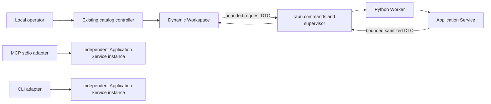
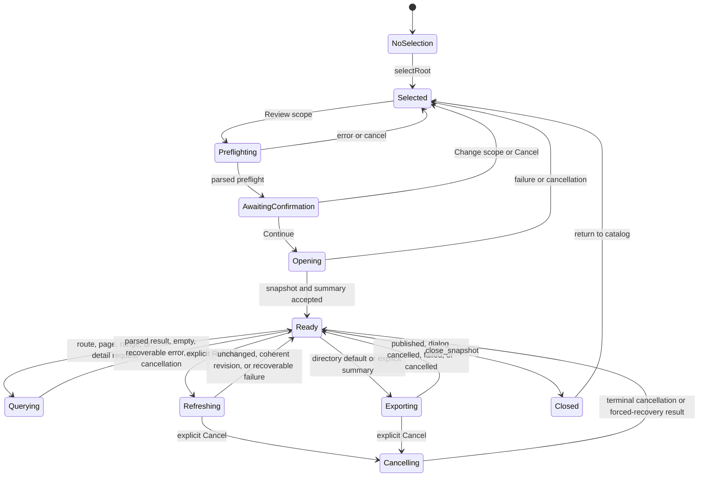
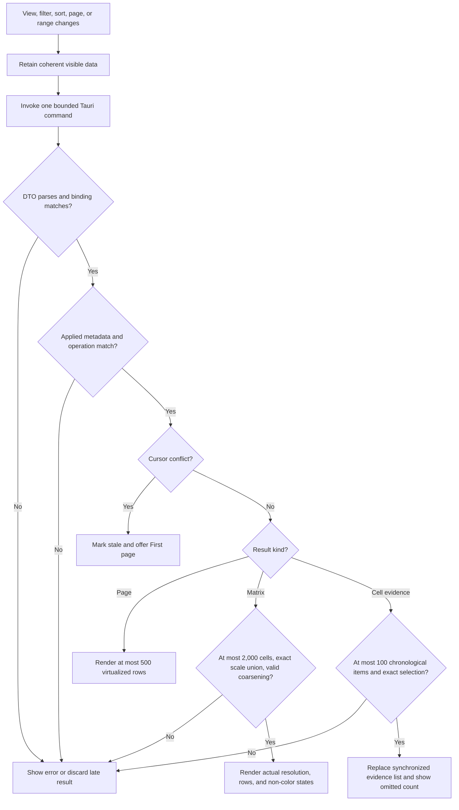
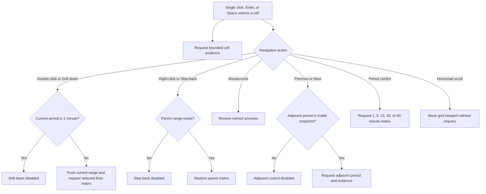

<!--
Copyright (c) 2026 Martin.Bechard@DevConsult.ca
Artifact-ID: f85048d5-a493-4107-80d4-941cdb73fedf
Created-UTC: 2026-08-12T15:00:04Z
Creating-Agent: Dev Documentation Writer
Runtime: Codex
Dispatched-Model: gpt-5.6-sol
Reasoning-Effort: medium
Task-ID: /root/design_dynamic_workspace
Artifact-ID-Evidence: runtime-supplied
Created-UTC-Evidence: runtime-supplied
Creating-Agent-Evidence: runtime-supplied
Runtime-Evidence: runtime-supplied
Dispatched-Model-Evidence: runtime-supplied
Reasoning-Effort-Evidence: runtime-supplied
Task-ID-Evidence: runtime-supplied
-->

# Agent Report Dynamic Workspace Design

## Current Understanding

The Dynamic Workspace is the TypeScript presentation module for one local Codex report snapshot. It controls root selection handoff, preflight confirmation, snapshot navigation, bounded view requests, and lazy detail disclosure.

The module has one primary responsibility: it presents bounded sanitized report data without acquiring native device or source-file authority.

This design defines intended behavior. Its design mode is **PLANNED_DEVELOPMENT**. Existing desktop catalog code supplies integration evidence only.

The workspace runs only inside the Tauri webview. The first dynamic release supports Codex snapshots only. Current non-Codex static adapters remain separate from the dynamic scope.

The workspace calls Tauri commands through an injected transport. It does not call MCP, Python, SQLite, raw rollout files, or browser network APIs. MCP remains independently runnable and is the primary forensic surface for LLM clients.

The accepted export decision gives Tauri only streamlined complete-directory and bounded-summary export. Classic interactive generation remains available through CLI and MCP `generate_report`, outside this Tauri workspace.

## Authoritative Sources

### Design Mode And Source Inventory

| Source category permitted by PLANNED_DEVELOPMENT | Durable source | Use |
| --- | --- | --- |
| Accepted functional specification | [FR-001](../../requirements/functional/FR-001-agent-report-dynamic-app-and-static-export.md) | Operator workflows, UI states, views, paging, time, accessibility, privacy, and error outcomes |
| Accepted delivery plan | [PLAN-012](../../plans/PLAN-012-agent-report-dynamic-heatmap-parity.json) | Exact cross-language Heatmap union, modes, bounds, navigation, evidence loading, compatibility isolation, and verification facets |
| Accepted architecture | [ARC-001](../../architecture/ARC-001-agent-report-dynamic-app-and-static-export.md) | Local processing, Tauri authority, bounded DTOs, explicit refresh, and independent MCP |
| Owning high-level design | [HLD-003](../high-level/HLD-003-agent-report-dynamic-app-and-static-export.md) | Dynamic Workspace ownership, OP-01, OP-03, OP-18 through OP-26, CR-01, CR-13, paths, and stable surface IDs |
| Accepted decisions | Dev Architect reconciliation packet accepted for `/root/report_app_architecture` | Full Workspace DTO semantics, generic Worker transport, cryptographic operation IDs, structured diagnostics, native registries, lifecycle results, and export counts |
| Resolved product decisions | User decisions supplied to `/root/design_dynamic_workspace` on 2026-08-12 | Codex-only first dynamic release; Tauri-only dynamic runtime; complete-directory default; explicit bounded summary; no classic control required in Tauri; preserved classic CLI and MCP generation; shared streamlined exporter |
| Backlog requirements | [Modularization backlog item](../../future-ideas/modularize-report-tool-for-concurrent-maintenance.md) | Separation from the current catalog controller |
| Project configuration | `tools/report/desktop/package.json`, `tools/report/desktop/tsconfig.json` | TypeScript, Vite, Vitest, DOM, and strict compiler constraints |
| Current implementation evidence | `tools/report/desktop/src/contracts.ts`, `tools/report/desktop/src/main.ts`, `tools/report/desktop/index.html`, `tools/report/desktop/src/styles.css` | Existing catalog state, virtualization, local-time formatting, progress, diagnostics, and native invocation patterns |
| Current test evidence | `tools/report/desktop/src/contracts.test.ts` | Existing unknown-value narrowing and local-time tests |
| Dependency status | Application Service, Worker, and Static Exporter contracts are synchronized independently from the same accepted reconciliation | This design does not derive its presentation contract from a sibling module design |
| Procedures and runtime evidence | [Agent Report README](../../../tools/report/README.md); retained runtime evidence is not required | Desktop build and test commands |

The resolved product decisions win where FR-001, ARC-001, or HLD-003 still describe an open export branch. FR-001 otherwise wins for operator-visible behavior. PLAN-012 supplies the accepted Heatmap cross-language inventory and delivery constraints. ARC-001 wins for system-wide authority and privacy. HLD-003 wins for component ownership and cross-module operations. This design wins for Dynamic Workspace state, TypeScript symbols, rendering, and tests. Existing code wins only for implemented-baseline claims.

An operation-specific parent contract governs a general rule for that operation. A module proposition cannot change an actor-visible or cross-module contract.

## Related Code

The primary files are:

- Planned implementation: `tools/report/desktop/src/report-workspace.ts`.
- [Desktop DTO contracts](../../../tools/report/desktop/src/contracts.ts), with assigned workspace DTO and parser additions.
- [Desktop composition root](../../../tools/report/desktop/src/main.ts), with assigned workspace construction and catalog-to-workspace routing changes.
- [Desktop document](../../../tools/report/desktop/index.html), with assigned semantic workspace containers and stable element IDs.
- [Desktop styles](../../../tools/report/desktop/src/styles.css), with assigned responsive workspace, view, table, heatmap, sequence-ledger, and state styles.

The module does not own native command implementations, the Python worker, the Application Service, normalized storage, static export construction, or MCP.

## Related Tests

- Planned unit and DOM contract tests: `tools/report/desktop/src/report-workspace.test.ts`.
- [Desktop contract tests](../../../tools/report/desktop/src/contracts.test.ts) receive DTO-parser boundary cases when `contracts.ts` changes.
- Native supervisor and command integration tests are planned at `tools/report/desktop/src-tauri/tests/report_worker.rs` and remain owned by CD-004.

No browser end-to-end test file is accepted. The Verification section records the required DOM-level Vitest scenarios and manual keyboard checks.

## Related Backlog Items

- [Modularize report tool for concurrent maintenance](../../future-ideas/modularize-report-tool-for-concurrent-maintenance.md)
- No separate accepted Dynamic Workspace backlog item is identified.

## Related Wiki Pages

- [FR-001](../../requirements/functional/FR-001-agent-report-dynamic-app-and-static-export.md)
- [ARC-001](../../architecture/ARC-001-agent-report-dynamic-app-and-static-export.md)
- [HLD-003](../high-level/HLD-003-agent-report-dynamic-app-and-static-export.md)
- [CD-001](./CD-001-codex-rollout-metrics.md)
- [CD-002](./CD-002-agent-report-application-service.md)
- [CD-004](./CD-004-agent-report-worker-protocol.md)

No project wiki page is identified. CD-002 and CD-004 are durable planned-design dependencies. FR-001 and PLAN-012 remain the Heatmap functional and delivery authorities when those sibling designs are being reconciled in parallel.

## Open Questions

No open question is recorded for this module. JFP-HM-01 requires a contextual UX review of actor-visible partial, unavailable, and N/A language for every row family. The review is a delivery gate with an accepted functional outcome. It is not unresolved product action and does not reopen the evidence-state decisions.

The first dynamic release is Codex-only and Tauri-only. It has no standalone-browser runtime. Tauri uses the shared streamlined exporter. Complete offline directory is the default, and bounded summary is explicit. Classic generation remains outside this module.

The event-cache quota and retention decision belongs to the Event Repository and Tauri maintenance configuration. It does not affect a Dynamic Workspace contract. Any later change to operation names, DTO meanings, native authority, or dynamic adapter scope must return to the owning HLD or architecture.

## Maintenance Notes

Recheck this design when FR-001 view behavior, HLD-003 operation fields, worker protocol, Heatmap modes or evidence states, command names, DTO limits, snapshot rules, privacy, navigation, accessibility, or desktop element IDs change.

Keep the DTO parsers and their tests synchronized. Never add a response field directly to rendering code without boundary validation in `contracts.ts`.

Keep each route's request, cache, cursor, and focus policy synchronized with `SURFACE_DEFINITIONS`. Recheck local-time rendering after browser or Tauri WebView changes.

The latest source review is 2026-08-13. It includes FR-001 HM-F01 through HM-F15, JFP-HM-01 through JFP-HM-03, and PLAN-012.

## Requirements Coverage

| Requirement source and ID | Claim mode | Required outcome | Satisfying contract, rule, state, or error path | Status | Out-of-scope authority, rationale, and owning artifact | Verification |
| --- | --- | --- | --- | --- | --- | --- |
| Target assignment; HLD-003 Dynamic Workspace constituent component | INTENDED_BEHAVIOR | Own `report-workspace.ts`, its test, and assigned integration changes. Render bounded summary, coordination, heatmap, timeline, sequence, agent, turn, tool, model, context, inference, runtime, wait, work-item, claim, detail, provenance, and diagnostic views. | Runtime Path ledger; `ReportWorkspaceController`; `SURFACE_DEFINITIONS`; view composition rules | DEFINED | Native commands, worker, service, repository, exporter, and MCP remain outside this module | Placement, symbol, route, and view tests |
| FR-001 FR-01; HLD OP-01 | INTENDED_BEHAVIOR | Preserve authorized-root search, inclusive local date-hours, virtual results, selection, and independent relationship scope. | Existing catalog controller; `WorkspaceSelection`; `selectRoot`; local-time rule | DEFINED | Rust Discovery and Tauri catalog command own search semantics | Catalog regression and handoff tests |
| FR-001 FR-02; HLD OP-16 and OP-17 | INTENDED_BEHAVIOR | Preflight every selected or materially changed scope. Continue opens a coherent snapshot. Change scope or Cancel creates no snapshot. | `WorkspaceLifecycle`; `preflight`; `openSnapshot`; `cancelOperation`; preflight dialog focus policy | DEFINED | Application Service owns scope closure and snapshot creation | Four-scope, stale-preflight, cancel, and focus-return tests |
| FR-001 FR-03; HLD OP-18 | INTENDED_BEHAVIOR | Load a bounded summary first. Show goal, state, scope, metrics, provenance, warnings, and recent significant activity. | `ReportSummaryDto`; `loadSurface("summary")`; `renderSummary` | DEFINED | Application Service owns summary calculation | Initial-load and no-eager-detail tests |
| FR-001 FR-03; HLD OP-19 through OP-21 | INTENDED_BEHAVIOR | Page agents, turns, and events with operation-specific filters, requested sort, applied filter and sort metadata, opaque cursors, and current-page virtualization. | `CursorPageRequestDto<F, S>`; `CursorPageDto<T, F, S>`; exact sort contracts; `loadCursorPage`; `computeVirtualWindow`; page size 100 default and 500 maximum | DEFINED | Application Service validates filters, sort, cursor, and deterministic order | First, next, previous, filter/sort change, metadata mismatch, stale-cursor, chronology, and virtualization tests |
| FR-001 HM-F01 through HM-F08 | INTENDED_BEHAVIOR | Expose exactly Wall time, Tokens, and Models with their stable row families, local period labels, measure-specific values, and friendly row and evidence labels. | `HeatmapMode`; matrix DTO union; Heatmap Visible-Range Contract; View Behavior | DEFINED | Application Service owns row construction, aggregation, formatting, and source order | Mode inventory, row-order, label, local-time, and value-format tests |
| FR-001 HM-F09 and HM-F10; JFP-HM-01 and JFP-HM-02 | INTENDED_BEHAVIOR | Keep complete zero distinct from partial and unavailable. Use a true per-row scale union. Unknown context capacity shows N/A scale semantics and intensity, no percentage, and no fallback. | Value-state and scale DTO unions; State Presentation; contextual UX review gate | DEFINED | Application Service owns evidence classification and known capacity | Zero/state, scale-union, N/A, supporting-text, non-fallback, and contextual UX review evidence |
| FR-001 HM-F11 and HM-F13 | INTENDED_BEHAVIOR | Load matrix and selected-cell evidence through one discriminated operation family. Keep matrix results free of evidence ledgers. Show at most 100 synchronized chronological evidence items, exact omissions, and lazy event detail. | `HeatmapMatrixRequestDto`; `HeatmapCellEvidenceRequestDto`; `HeatmapInteractionState`; detail action | DEFINED | Application Service owns sanitized evidence selection; existing event-detail operation owns full detail | Initial-load, selection, 100-item, omission, chronology, and lazy-detail tests |
| FR-001 HM-F12 and HM-F15; JFP-HM-03 | INTENDED_BEHAVIOR | Preserve single-click selection, double-click drilldown, right-click step-back, breadcrumbs, adjacent movement, horizontal scroll, five period controls, keyboard operation, non-color semantics, and visible controls labeled exactly `Drill down` and `Step back` with disabled boundaries. | Controller API; Heatmap Interaction; View Behavior; focus and accessible-name rules | DEFINED | None | Pointer, keyboard, focus, disabled-boundary, breadcrumb, period, scroll, and synchronized-ledger tests |
| FR-001 HM-F14 | INTENDED_BEHAVIOR | Accept at most 2,000 matrix cells and show the service-owned actual supported resolution and omitted row count. | Matrix parser, visible-range contract, resolution label | DEFINED | Application Service owns nearest-supported coarsening and row omission | 2,000 acceptance, 2,001 rejection, coarsening, and omission tests |
| FR-001 FR-03; HLD OP-23 | INTENDED_BEHAVIOR | Show bounded sequence groups and rows with zoom, fit, hierarchy collapse, agent focus, event filters, repeated-message grouping, reasoning disclosures, endpoint selection, and an accessible ledger. | `SequencePageDto`; `SequenceGroupDto`; `SequenceRowDto`; `SequenceFiltersDto`; `SequencePresentationState`; exact controller actions | DEFINED | Application Service owns evidence order and group hierarchy; Workspace owns zoom, fit, collapse, and selection state | Filter, zoom, fit, focus, collapse, endpoint, repeated-message, ledger, and reasoning tests |
| FR-001 FR-03; HLD OP-24 | INTENDED_BEHAVIOR | Show deterministic chronological coordination pages with exact work-item, delegated-root, agent, operation, and evidence filters. Group evidence by canonical work item or delegated root and label prose-derived decisions as inferred. | `CoordinationFiltersDto`; `CoordinationSortDto`; `CoordinationPageDto`; `loadCoordination`; applied-metadata validation; evidence badge rule | DEFINED | Application Service owns evidence reconstruction, provenance, filter validation, and ordering | Cursor, filter, sort, metadata mismatch, canonical grouping, and inferred-label tests |
| FR-001 FR-03; HLD OP-25 | INTENDED_BEHAVIOR | Load bounded redacted event details only after selection. Keep raw disclosures collapsed by default. | `EventDetailDto`; `openDetail`; `closeDetail`; `DisclosureDto`; detail dialog | DEFINED | Application Service and Tauri own sanitization and output validation | Lazy-load, redaction, collapse, not-found, Escape, and focus-return tests |
| FR-001 FR-04; HLD OP-26 and OP-31 through OP-34 | INTENDED_BEHAVIOR | Refresh only on explicit request. Show progress and cancellation. Preserve the last coherent snapshot and view data on failure or cancellation. | `refreshSnapshot`; `cancelOperation`; stale `LoadState`; lifecycle state diagram | DEFINED | Supervisor owns process-tree termination; Service owns coherent revision publication | Refresh success, unchanged, cancel, forced termination result, and failure-retention tests |
| Resolved export decision; FR-001 FR-05; HLD OP-27 and OP-28 | INTENDED_BEHAVIOR | Use the shared streamlined exporter in Tauri. Tauri defaults to complete offline directory. Bounded summary requires explicit choice. Classic generation is not exposed in this Workspace. Export selection, publication, cancellation, and reopen disclose no output path to the webview. | `ExportMode`; `ExportSnapshotRequestDto`; `ExportSnapshotResultDto`; `exportSnapshot`; `reopenExport`; export effect phase and error rules | DEFINED | Static Exporter owns construction; Tauri owns target choice and publication; Workspace owns presentation | Default, explicit-summary, mode-boundary, replace, cancellation, failure-retention, opaque-result, and reopen tests |
| FR-001 FR-08; ARC-06 and ARC-15; HLD CR-01 and CR-13 | INTENDED_BEHAVIOR | Accept bounded sanitized DTOs only. Expose no raw rollout, cache path, unrestricted filesystem path, or decrypted ciphertext. | Parsers in `contracts.ts`; DTO caps; `WorkspaceTransport`; opaque `sourceRef`; disclosure rules | DEFINED | Tauri and Application Service own upstream validation and sanitization | Oversize, unknown-field, path-field, ciphertext, and secret-shaped fixture tests |
| FR-001 FR-10 | INTENDED_BEHAVIOR | Provide stable navigation, keyboard operation, visible progress, non-color states, breadcrumbs, narrow-layout disclosure, local time, and predictable focus. | `SURFACE_DEFINITIONS`; focus ledger; keyboard map; ARIA rules; responsive layout | DEFINED | Native window and source/report opening remain Tauri-owned | Keyboard-only, focus, reduced-motion, live-region, narrow-layout, and local-time tests |
| Resolved scope; ARC-02 and HLD Current Understanding | INTENDED_BEHAVIOR | Keep the dynamic workspace Codex-only and Tauri-only. Keep MCP independently runnable as the primary forensic surface for LLMs. | No MCP import, call, route, or state in this module; explicit non-goals | DEFINED | MCP Adapter owns its separate process-local Application Service; current non-Codex static adapters retain their separate surfaces | Import sweep, route inventory, and architecture review |
| Current desktop compatibility evidence; resolved migration | CURRENT_BEHAVIOR and PROPOSED_CHANGE | Preserve catalog discovery, virtualization, local time, catalog export, diagnostics, preferences, report-window opening, and parent-event handling. Replace Codex `generate-report`, `generating`, `cancel-generation`, and per-source legacy report history with Review scope, dynamic snapshot, shared export, active-operation cancellation, and opaque export identity. | Current Desktop Preservation And Migration Ledger; assigned `main.ts`, `index.html`, `styles.css`, and `contracts.ts` integration | DEFINED | Current non-Codex static adapters remain outside this component | Baseline catalog regression plus explicit legacy-control removal and replacement tests |
| HLD OP-36 and OP-40 | INTENDED_BEHAVIOR | Open an authorized source reference or current diagnostic log through Tauri only. | `openSourceLocation`; `openDiagnosticLog`; opaque selectors; no path DTO | DEFINED | Tauri validates and performs native open | Command argument and unavailable-result tests |

## Runtime Path

The module uses this exact placement:

```text
tools/report/desktop/
├── index.html
└── src/
    ├── contracts.test.ts
    ├── contracts.ts
    ├── main.ts
    ├── report-workspace.test.ts
    ├── report-workspace.ts
    └── styles.css
```

`tools/report/desktop/src/report-workspace.ts` is the production entry point for module `report-workspace`. `tools/report/desktop/src/report-workspace.test.ts` is its direct Vitest target.

### Implementation-Placement And Symbol Ledger

| Tree leaf | Exact symbols or assigned responsibility | Kind and ownership |
| --- | --- | --- |
| `report-workspace.ts` | `ReportWorkspaceController`, `createReportWorkspace`, `WorkspaceElements`, `WorkspaceTransport`, `WorkspaceLifecycle`, `WorkspaceRoute`, `WorkspaceState`, `WorkspaceSelection`, `WorkspaceSurfaceId`, `LoadState<T>`, `CursorPagerState<T, F, S>`, `SequencePresentationState`, `VirtualWindow`, `SURFACE_DEFINITIONS`, `WORKSPACE_COMMANDS`, `computeVirtualWindow`, `formatLocalInstant`, `heatmapResolutionLabel` | Planned production source; Dynamic Workspace owns every symbol |
| `report-workspace.test.ts` | Suites named `ReportWorkspaceController`, `cursor pagination and virtualization`, `heatmap bounds`, and `workspace accessibility`; helpers `createWorkspaceFixture` and `RecordingWorkspaceTransport` | Planned unit and DOM tests; Dynamic Workspace owns every symbol |
| `contracts.ts` | Add exact DTO types, discriminated error types, and `parse*Dto` functions from Public Contracts. Keep current catalog contracts unchanged. | Existing shared boundary file; Dynamic Workspace owns only assigned additions |
| `contracts.test.ts` | Add strict parser tests for workspace DTOs, limits, unknown variants, path exclusion, redaction markers, and timestamp validation. | Existing shared boundary test; contract owner accepts assigned additions |
| `main.ts` | Import `createReportWorkspace`; implement `TauriWorkspaceTransport`; pass only opaque catalog identity and bounded display metadata; route catalog selection into the workspace; preserve catalog behavior; replace Codex legacy generation with dynamic snapshot and shared-export actions. | Existing composition root; assigned integration and migration changes only |
| `index.html` | Add the stable element IDs in the HTML Integration Contract. Retain one module script entry. | Existing document shell; assigned semantic markup only |
| `styles.css` | Add `.report-workspace`, `.workspace-nav`, `.workspace-view`, `.workspace-table`, `.heatmap-grid`, `.sequence-ledger`, `.state-panel`, `.detail-dialog`, and narrow-window rules. | Existing stylesheet; assigned workspace presentation only |

No configuration, fixture, generated, migration, or script file is owned by this module.

## Parent Context

[HLD-003](../high-level/HLD-003-agent-report-dynamic-app-and-static-export.md) owns the Agent Report dynamic-analysis subsystem. This module is its webview presentation component.

The Workspace sends bounded request DTOs to Tauri. Tauri supervises the Python Worker. The Worker invokes its process-local Application Service. The same service and exporter semantics remain available to CLI and MCP through their own processes. MCP is the primary forensic surface for LLM clients and never depends on Tauri.



The Workspace never imports MCP or application-service code. It never opens files. Native source and diagnostic actions use opaque selectors through Tauri commands.

## Responsibilities

The module owns these responsibilities:

- Maintain one explicit root, preflight, snapshot, operation, route, and focus state.
- Validate every unknown Tauri result through `contracts.ts` before state mutation.
- Render the bounded summary first after snapshot open.
- Request one active view and one visible cursor page or time range at a time.
- Virtualize current-page rows without retaining unbounded row data.
- Preserve coherent visible data while a query, refresh, or cancellation is pending.
- Render loading, empty, stale, error, and cancelled states with text and ARIA semantics.
- Provide keyboard, pointer, narrow-layout, reduced-motion, and focus behavior.
- Format instants in the browser's local timezone while retaining UTC values in `dateTime` attributes and requests.
- Keep event details lazy, bounded, redacted, and collapsed by default.
- Send native actions only through `WorkspaceTransport`.

The module does not discover sources, parse rollouts, normalize events, calculate metrics, issue cursors, coarsen time buckets, sanitize raw values, supervise processes, publish files, or implement MCP. It does not provide dynamic non-Codex views or a standalone-browser runtime.

## Callers

| Caller | Reason for calling | Contract |
| --- | --- | --- |
| `tools/report/desktop/src/main.ts` | Construct the workspace, pass selected catalog identity, and dispose it during app shutdown | `createReportWorkspace(elements, transport, options): ReportWorkspaceController` |
| Local operator through `index.html` | Select scope, accept preflight, navigate views, page rows, manipulate visualizations, refresh, cancel, inspect detail, export, and open diagnostics | DOM event and accessibility contracts in UI And Notification Behavior |
| `report-workspace.test.ts` | Drive deterministic state and DOM behavior through a fake transport | Public controller methods plus injected `WorkspaceTransport` |

No native, Python, CLI, or MCP component calls the Workspace directly.

## Dependencies

| Dependency | Exact location or name | Purpose and authority |
| --- | --- | --- |
| Desktop boundary contracts | `tools/report/desktop/src/contracts.ts` | Own strict unknown-value parsing before DTOs enter Workspace state |
| Tauri invocation adapter | `@tauri-apps/api/core` in `main.ts` only | Invoke native commands; `report-workspace.ts` receives an injected port and has no direct Tauri import |
| DOM and accessibility APIs | TypeScript `DOM` library | Render semantic elements, focus controls, listen for input, and observe viewport size |
| `Intl.DateTimeFormat` | Browser standard API | Display UTC instants in the operator's local timezone |
| `ResizeObserver` | Browser standard API | Recalculate current-page virtual and heatmap visible ranges |
| `requestAnimationFrame` | Browser standard API | Batch viewport rendering without changing service data |
| `AbortController` | Browser standard API | Stop superseded frontend render work; service cancellation still uses an operation ID command |
| Vitest | `tools/report/desktop/package.json` | Run controller, state, parser, and DOM tests |
| Parent contracts | FR-001, ARC-001, HLD-003 | Define actor outcomes, authority, operations, limits, and stable surface IDs |

The module uses no network client, filesystem API, SQLite API, Python bridge, MCP client, or raw rollout parser.

## Public Contracts

### Current Desktop Preservation And Migration Ledger

The integration preserves established catalog behavior unless this ledger names an intentional Codex migration. Current non-Codex static adapters are unaffected.

| Current surface or contract | Baseline evidence | Intended integration contract | Regression obligation |
| --- | --- | --- | --- |
| Catalog root controls | `#add-root`, `#root-list`; `roots`, `addRoot`, `renderRoots` | Preserve multiple authorized roots, removal, empty state, and native directory selection. Tauri returns opaque `rootRef` and bounded `displayName`, not the selected path. | Add/remove roots and no-root validation behave as before; no path enters a webview DTO. |
| Catalog search and local dates | `#query`, `#from-date`, `#to-date`, `#search`; `currentRequest`, `dateRangeError`, `localDateHourToUtc`, `runSearch` | Preserve text search, inclusive browser-local date-hour inputs, UTC boundary conversion, Enter submission, progress, and editable failure state. | Existing `contracts.test.ts` local-date tests and focused search tests remain green. |
| Relationship and worker preferences | `#include-descendants`, `#include-collaborators`, `#worker-threads`; `agent-report:include-children:v1`, `agent-report:include-collaborators:v1`, `agent-report:worker-threads:v1` | Preserve independent child/collaborator booleans, 1 through 64 workers, and existing keys. New root selection still defaults the new snapshot scope to root-only until the operator applies stored controls. | Restore, change, clamp, and persistence tests cover every key. |
| Catalog virtualization | `ROW_HEIGHT = 118`, `OVERSCAN = 5`, `#results-viewport`, `#results-canvas`; `renderVirtualRows` | Preserve bounded catalog DOM rendering, selection, scroll, resize, and last-activity order. Workspace virtualization uses separate constants. | First, middle, last, scroll, resize, and selected-row tests remain. |
| Catalog export | `#export-catalog`; `export_catalog`; `parseExportResult` | Preserve run-index export as a catalog operation while migrating its result to opaque `exportId`, bounded `displayName`, and entry count. Tauri chooses and retains the path. | Export count, chooser cancellation, open failure, and remembered opaque catalog export regressions remain. |
| Diagnostics | `#open-diagnostic-log`; `open_diagnostic_log`; `record_client_error` | Preserve explicit native log opening and safe frontend error recording. Workspace errors add no DTO body or disclosure content. | Success, unavailable, and safe-error-message tests remain. |
| Report window opening | `open_report_window`; `openLastExport`, `openRememberedReport` | Replace path input with opaque `exportId` for catalog and dynamic exports. Tauri resolves and validates the native target. | Catalog and dynamic exports reopen by opaque identity only. |
| Parent report event | `view-parent-report`; `generateParentReport` | Preserve listener registration and payload validation during migration. Route a Codex parent to selection plus preflight. Route a supported non-Codex static parent to its existing adapter. | Listener, missing ID, Codex route, and non-Codex route tests are required. |
| Codex generation button | `#generate-report`; `generateReport`, `generateReportFor`; `generate_report` | Remove the control and Codex legacy command route. Replace it with **Review scope**, preflight, and **Open workspace**. | DOM and command-sweep tests prove `#generate-report` and Codex `generate_report` are absent after migration. |
| Codex generation cancellation | `#cancel-generation`; `reportCancellationRequested`; `cancel_report_generation` | Remove the legacy-only state and command. The shared progress area uses `activeOperationId` and `cancel_report_operation`. | Tests prove one operation-bound cancel and no legacy cancel command. |
| Per-source Codex legacy report history | `agent-report:last-report-by-source:v1`; `ReportHistory`; `rememberGeneratedReport` | Stop writing and reading this key for Codex dynamic work. Native export history owns opaque `exportId`. A one-time migration may ignore the old mapping because no legacy-full artifact is a current Codex workspace contract. | Tests prove no new writes and no path import into Workspace state. |
| Last catalog export preference | `agent-report:last-export-path:v1` | Stop reading and writing the path key. Use `agent-report:last-catalog-export-id:v2` with opaque `exportId` and bounded `displayName`. Ignore the old path value during one-time migration. | Catalog reopen behavior remains; tests prove no path import or new path-key write. |

The assigned `contracts.ts` migration replaces path-bearing catalog boundary fields with these exact shapes:

```ts
export interface RootReferenceDto {
  readonly rootRef: string;
  readonly displayName: string;
}

export interface DesktopDefaults {
  readonly roots: readonly RootReferenceDto[];
  readonly diagnosticsAvailable: boolean;
}

export interface SearchRequest {
  readonly rootRefs: readonly string[];
  readonly query: string;
  readonly fromDate: string;
  readonly toDate: string;
  readonly includeDescendants: boolean;
  readonly workers: number | null;
}

export interface CatalogEntry {
  readonly threadId: string;
  readonly parentThreadId: string;
  readonly taskTitle: string;
  readonly startedAt: string;
  readonly lastActivityAt: string;
  readonly workspaceLabel: string;
  readonly sourceRef: string;
  readonly sourceLabel: string;
  readonly agentLabel: string;
  readonly agentNickname: string;
  readonly delegationCount: number;
  readonly diagnostic: CatalogDiagnosticDto | null;
}

export interface CatalogDiagnosticDto {
  readonly code: string;
  readonly message: string;
}

export interface ExportResult {
  readonly exportId: string;
  readonly displayName: string;
  readonly entryCount: number;
}
```

`add_root` returns `RootReferenceDto[]`. `desktop_defaults` returns the revised `DesktopDefaults`. `export_catalog` opens its native target chooser and returns the revised `ExportResult`. `open_report_window` accepts `{ exportId }`. The webview displays bounded labels and asks Tauri to open opaque references. It never receives an index path, title-database path, diagnostic-log path, source path, agent path, workspace path, or export path.

`displayName`, `workspaceLabel`, `sourceLabel`, `agentLabel`, and export `displayName` are non-authority labels. Their parsers reject `/`, `\\`, URI schemes, drive-letter prefixes, and strings that equal the corresponding opaque reference. A diagnostic message contains a safe category and action only. It contains no native path or raw record excerpt.

This ledger preserves the catalog and replaces the former Tauri generation action with the accepted dynamic and streamlined-export workflow. It does not govern classic CLI or MCP generation.

### Justified Module Propositions

The parent sources delegate subordinate DTO representation and internal view composition to this module. These propositions resolve that module-internal work.

| ID | Proposition | Basis | Necessity | Decision owner |
| --- | --- | --- | --- | --- |
| DWP-01 | `report-workspace.ts` uses an injected `WorkspaceTransport` instead of importing Tauri. | ARC-02 and ARC-06 separate presentation from native authority. HLD HLP-04 isolates the Workspace from `main.ts`. | A fake transport makes operation, cancellation, stale-result, and error tests deterministic. | Dev Documentation Writer within delegated module design authority |
| DWP-02 | The Workspace stores only one current cursor page per paged view plus a bounded cursor history of 100 entries. | FR-001 requires cursor paging and virtualization. ARC performance rules require bounded presentation. | A current-page model keeps row DTO memory at 500 items or fewer. A capped history supports Previous without retaining old rows indefinitely. | Dev Documentation Writer within delegated module design authority |
| DWP-03 | Each route has an independent `LoadState<T>` and monotonically increasing client request sequence. | HLD CR-13 requires pending/result/error state and rejection before replacement. | A sequence check discards late responses from superseded filters or routes. | Dev Documentation Writer within delegated module design authority |
| DWP-04 | Metric-oriented HLD surfaces select bounded metric groups from `ReportSummaryDto`; timeline and tool surfaces select filtered event pages. | HLD delegates internal view composition and provides only OP-18 through OP-25. | This composition exposes every named surface without inventing another service operation. | Dev Documentation Writer within delegated module design authority |
| DWP-05 | Heatmap matrix requests use the visible UTC range and one supported requested resolution. The service returns the actual supported resolution. Cell evidence uses a separate variant of the same operation. | FR-001 HM-F11 and HM-F14 and PLAN-012 require one discriminated operation family, a 2,000-cell cap, and service coarsening. | The UI labels coarsening and loads selected evidence without duplicating service aggregation rules or adding another operation. | Accepted functional and delivery authorities |
| DWP-06 | Source opening uses `sourceRef`, not a path. The service returns a nullable snapshot-scoped `source_key`; Tauri registers its authorized native path from the discovery closure and projects the key to `sourceRef`. | ARC-05, ARC-06, HLD TB-01, OP-36, and the accepted reconciliation keep filesystem authority in Tauri. | `open_source_location(snapshotId, sourceRef)` can resolve only through Tauri's private current-snapshot registry. The webview cannot construct a file target. | Dev Architect reconciliation |
| DWP-07 | The navigation uses buttons in a named `nav` region with roving focus. It does not use ARIA tabs. | FR-001 requires stable navigation and keyboard control, not a tab-widget contract. | Button navigation avoids hidden-tab-panel focus rules while preserving arrow, Home, End, Enter, and Space operation. | Dev Documentation Writer within delegated module design authority |
| DWP-08 | Heatmap and sequence visuals have synchronized text ledgers. The Heatmap ledger is the bounded `cell_evidence` result for the selected row-period. | FR-001 HM-F11, HM-F13, HM-F15, and FR-10 require non-color evidence and accessible event labels. | A text ledger keeps equivalent evidence available when visual geometry is unavailable. | Accepted functional authority |
| DWP-09 | Every webview boundary parser recursively rejects response objects that contain `sourcePath`, `outputPath`, `cachePath`, `filesystemPath`, `rawRecord`, or `rawRollout`. It also rejects every key ending in `Path`. | ARC-05, ARC-06, HLD CR-01, and HLD CR-13 keep native paths and raw records outside the webview. | Exact recursive rejection catches privacy and authority regressions before rendering or logging. | Dev Documentation Writer within delegated module design authority |
| DWP-10 | Operator-visible strings are capped at 4,096 UTF-16 code units, warning lists at 100 items, and disclosure blocks at 16,384 code units after upstream redaction. | HLD requires bounded DTOs but delegates subordinate limits. | Explicit client caps prevent accidental unbounded DOM and diagnostic content. The disclosure cap remains large enough for bounded event inspection. | Dev Documentation Writer within delegated module design authority |
| DWP-11 | Dynamic export uses opaque `exportId` and bounded `displayName`; it never returns a target path. The Tauri command opens the native target chooser, owns replacement confirmation, records the service's native `published_target` in a private `exportId -> published path` registry, and strips that target before returning. | The resolved export decision and accepted reconciliation make Tauri the dynamic surface while ARC-05 retains native path and publication authority. | The Workspace can show success and reopen an export without acquiring filesystem authority. CLI and MCP can receive authorized local publication paths under their own configured path authority. | Dev Architect reconciliation |
| DWP-12 | Every webview boundary parser rejects path-shaped string values that start with `/`, `\\`, a drive-letter root, or `file:`. Opaque references and bounded labels remain distinct. | Key rejection alone cannot stop a native path embedded in a generic `message` or `label` field. | Recursive value checks enforce the no-unrestricted-path disclosure rule across diagnostics and future envelope fields. | Dev Documentation Writer within delegated module design authority |
| DWP-13 | A contextual UX specialist reviews the actor-visible partial, unavailable, and N/A text for every Heatmap row family before implementation acceptance. | Accepted JFP-HM-01 requires contextual UX review but leaves no product decision open. | The review proves that exact evidence states are understandable without changing their semantics. | Product owner requirement; contextual UX reviewer supplies gate evidence |

### Exact TypeScript Module API

`report-workspace.ts` exports these exact symbols:

```ts
export const DEFAULT_PAGE_SIZE = 100;
export const MAX_PAGE_SIZE = 500;
export const MAX_CURSOR_HISTORY = 100;
export const MAX_HEATMAP_CELLS = 2_000;
export const MAX_HEATMAP_ROWS = 200;
export const MAX_HEATMAP_EVIDENCE_ITEMS = 100;
export const DEFAULT_ROW_HEIGHT_PX = 44;
export const DEFAULT_OVERSCAN_ROWS = 8;

export type WorkspaceSurfaceId =
  | "summary"
  | "coordination"
  | "heatmap"
  | "timeline"
  | "sequence"
  | "agents"
  | "turns"
  | "tools"
  | "model"
  | "context"
  | "inference"
  | "runtime-waits"
  | "work-items-claims"
  | "detail"
  | "provenance"
  | "diagnostics";

export type WorkspaceLifecycle =
  | "no-selection"
  | "selected"
  | "preflighting"
  | "awaiting-confirmation"
  | "opening"
  | "ready"
  | "querying"
  | "refreshing"
  | "exporting"
  | "cancelling"
  | "failed"
  | "closed";

export type WorkspaceRoute =
  | { readonly kind: "catalog" }
  | { readonly kind: "preflight"; readonly rootThreadId: string }
  | {
      readonly kind: "snapshot";
      readonly snapshotId: string;
      readonly surface: WorkspaceSurfaceId;
    };

export type LoadState<T> =
  | { readonly kind: "not-requested" }
  | { readonly kind: "loading"; readonly previous: T | null; readonly operationId: string }
  | { readonly kind: "ready"; readonly value: T }
  | { readonly kind: "empty"; readonly value: T }
  | { readonly kind: "stale"; readonly value: T; readonly reason: string }
  | { readonly kind: "error"; readonly previous: T | null; readonly error: ReportErrorDto }
  | { readonly kind: "cancelled"; readonly previous: T | null; readonly operationId: string };

export interface WorkspaceSelection {
  readonly rootThreadId: string;
  readonly title: string;
  readonly includeChildren: boolean;
  readonly includeCollaborators: boolean;
}

export interface CursorPagerState<T, F, S> {
  readonly pageSize: number;
  readonly currentCursor: string | null;
  readonly previousCursors: readonly (string | null)[];
  readonly nextCursor: string | null;
  readonly page: LoadState<CursorPageDto<T, F, S>>;
  readonly virtualWindow: VirtualWindow;
}

export interface VirtualWindow {
  readonly startIndex: number;
  readonly endIndexExclusive: number;
  readonly offsetTopPx: number;
  readonly totalHeightPx: number;
}

export interface WorkspaceElements {
  readonly catalogRegion: HTMLElement;
  readonly workspaceRegion: HTMLElement;
  readonly preflightDialog: HTMLDialogElement;
  readonly navigation: HTMLElement;
  readonly viewHeading: HTMLElement;
  readonly viewRegion: HTMLElement;
  readonly statusRegion: HTMLElement;
  readonly progressRegion: HTMLElement;
  readonly detailDialog: HTMLDialogElement;
}

export interface WorkspaceTransport {
  invoke(command: WorkspaceCommandName, request: unknown): Promise<unknown>;
  subscribeProgress(listener: (value: unknown) => void): () => void;
}

export interface ReportWorkspaceController {
  selectRoot(selection: WorkspaceSelection, trigger: HTMLElement): void;
  updateScope(includeChildren: boolean, includeCollaborators: boolean): void;
  preflight(): Promise<void>;
  openSnapshot(): Promise<void>;
  changeScope(): void;
  cancelActiveOperation(): Promise<void>;
  navigate(surface: WorkspaceSurfaceId, trigger?: HTMLElement): Promise<void>;
  nextPage(): Promise<void>;
  previousPage(): Promise<void>;
  selectHeatmapCell(rowId: string, periodStartTime: string, periodEndTime: string): Promise<void>;
  drillDownHeatmap(): Promise<void>;
  stepBackHeatmap(): Promise<void>;
  moveHeatmapPeriod(direction: "previous" | "next"): Promise<void>;
  setHeatmapPeriod(minutes: HeatmapRequestedResolutionMinutes): Promise<void>;
  refreshSnapshot(): Promise<void>;
  exportSnapshot(mode?: ExportMode): Promise<void>;
  reopenExport(exportId: string): Promise<void>;
  openDetail(eventId: string, trigger: HTMLElement): Promise<void>;
  closeDetail(): void;
  closeSnapshot(): Promise<void>;
  getState(): Readonly<WorkspaceState>;
  dispose(): void;
}

export interface CreateReportWorkspaceOptions {
  readonly now?: () => number;
  readonly requestAnimationFrame?: (callback: FrameRequestCallback) => number;
  readonly cancelAnimationFrame?: (handle: number) => void;
  readonly resizeObserverFactory?: (callback: ResizeObserverCallback) => ResizeObserver;
}

export function newOperationId(): string;

export function createReportWorkspace(
  elements: WorkspaceElements,
  transport: WorkspaceTransport,
  options?: CreateReportWorkspaceOptions,
): ReportWorkspaceController;

export function computeVirtualWindow(input: {
  readonly itemCount: number;
  readonly rowHeightPx: number;
  readonly scrollTopPx: number;
  readonly viewportHeightPx: number;
  readonly overscanRows: number;
}): VirtualWindow;

export function formatLocalInstant(isoInstant: string): string;

export function heatmapResolutionLabel(
  requestedMinutes: number,
  actualMinutes: number,
): string;
```

`WorkspaceState` is internal to module mutation but remains exported as a read-only test and integration contract:

```ts
export interface WorkspaceState {
  readonly lifecycle: WorkspaceLifecycle;
  readonly route: WorkspaceRoute;
  readonly selection: WorkspaceSelection | null;
  readonly preflight: LoadState<PreflightReportDto>;
  readonly snapshot: SnapshotMetadataDto | null;
  readonly summary: LoadState<ReportSummaryDto>;
  readonly pagers: Readonly<
    Record<
      "agents" | "turns" | "events" | "sequence" | "coordination",
      CursorPagerState<unknown, unknown, unknown>
    >
  >;
  readonly timeSeries: LoadState<HeatmapMatrixResultDto>;
  readonly heatmapInteraction: HeatmapInteractionState;
  readonly detail: LoadState<EventDetailDto>;
  readonly exportState: LoadState<ExportSnapshotResultDto>;
  readonly sequencePresentation: SequencePresentationState;
  readonly activeOperationId: string | null;
  readonly activeOperation: WorkspaceOperationName | null;
  readonly requestSequence: number;
}
```

The implementation uses private reducer-style functions. No mutable state object is exported. `getState()` returns the current frozen state in development and a read-only reference in production.

### Tauri Command Contract

`WORKSPACE_COMMANDS` is an exact constant:

```ts
export const WORKSPACE_COMMANDS = {
  preflightReport: "preflight_report",
  openSnapshot: "open_snapshot",
  getSummary: "get_summary",
  listAgents: "list_agents",
  listTurns: "list_turns",
  listEvents: "list_events",
  querySnapshotTimeRange: "query_snapshot_time_range",
  querySequence: "query_sequence",
  queryCoordination: "query_coordination",
  getEventDetails: "get_event_details",
  refreshSnapshot: "refresh_snapshot",
  exportSnapshot: "export_snapshot",
  closeSnapshot: "close_snapshot",
  cancelOperation: "cancel_report_operation",
  openSourceLocation: "open_source_location",
  openDiagnosticLog: "open_diagnostic_log",
  reopenExport: "reopen_export",
} as const;

export type WorkspaceCommandName =
  (typeof WORKSPACE_COMMANDS)[keyof typeof WORKSPACE_COMMANDS];

export type WorkspaceOperationName = ReportOperationName;
```

`ReportOperationName` is imported from `contracts.ts`. It is the single operation-name authority for request, progress, and terminal binding.

`main.ts` implements `TauriWorkspaceTransport`. It calls `invoke<unknown>(command, { request })`. It never declares a typed native result before a parser accepts that result.

Every request that can run asynchronously contains a client-generated `operationId`. Cancellation sends only `{ operationId }`. Opening a source sends `{ snapshotId, sourceRef }`. No Workspace request contains a source path, cache path, output path, or raw record.

For `query_snapshot_time_range`, Tauri maps the exact camel-case request union to the corresponding snake-case Worker fields. It maps the matching Worker result back to camel case without changing array order, numeric values, nulls, value state, scale availability, evidence method, or immutable identity. It rejects cross-variant fields. This command never invokes or projects retained MCP `query_time_range`.

`newOperationId()` obtains 12 bytes from `globalThis.crypto.getRandomValues`, encodes them as lowercase hexadecimal, and prefixes `op_`. The resulting ID contains 96 cryptographically secure random bits and matches `^op_[0-9a-f]{24}$`. The Workspace never uses counters, timestamps, `Math.random`, or another predictable source. The all-zero ID is reserved for the native Worker handshake and is never returned by this function.

### Boundary DTO Types In `contracts.ts`

The assigned `contracts.ts` additions use camel-case webview fields. Tauri owns any native naming conversion.

```ts
export type ReportOperationName =
  | "preflight_report"
  | "open_snapshot"
  | "get_summary"
  | "list_agents"
  | "list_turns"
  | "list_events"
  | "query_snapshot_time_range"
  | "query_sequence"
  | "query_coordination"
  | "get_event_details"
  | "refresh_snapshot"
  | "export_snapshot"
  | "close_snapshot";

export type EvidenceLabel = "measured" | "derived" | "inferred" | "unavailable" | "estimated";

export type ReportErrorCode =
  | "REPORT_CANCELLED"
  | "REPORT_CURSOR_CONFLICT"
  | "REPORT_DISCOVERY_FAILED"
  | "REPORT_EVENT_NOT_FOUND"
  | "REPORT_EXPORT_FAILED"
  | "REPORT_GENERATION_FAILED"
  | "REPORT_INTERNAL_ERROR"
  | "REPORT_INVALID_REQUEST"
  | "REPORT_NOT_FOUND"
  | "REPORT_PRIVACY_FAILED"
  | "REPORT_SCOPE_CONFLICT"
  | "REPORT_SNAPSHOT_CONFLICT"
  | "REPORT_SNAPSHOT_NOT_FOUND"
  | "REPORT_WRITE_FAILED"
  | "REPORT_PROTOCOL_ERROR"
  | "REPORT_UNAVAILABLE";

export interface WarningRecordDto {
  readonly code: string;
  readonly message: string;
}

export interface ReportErrorDto {
  readonly code: ReportErrorCode;
  readonly message: string;
  readonly operationId: string | null;
  readonly recoverable: boolean;
  readonly currentSourceRevision: string | null;
  readonly preflightRequired: boolean;
  readonly restartFromFirstPage: boolean;
}

export interface WorkspaceOperationRequestDto {
  readonly operationId: string;
}

export interface PreflightReportRequestDto extends WorkspaceOperationRequestDto {
  readonly rootThreadId: string;
  readonly includeChildren: boolean;
  readonly includeCollaborators: boolean;
}

export interface PreflightReportDto {
  readonly preflightToken: string;
  readonly rootThreadId: string;
  readonly includeChildren: boolean;
  readonly includeCollaborators: boolean;
  readonly sourceRevision: string;
  readonly logCount: number;
  readonly totalBytes: number;
  readonly childCount: number;
  readonly collaboratorCount: number;
  readonly cachedFileCount: number;
  readonly changedFileCount: number;
  readonly knownEventCount: number | null;
  readonly warnings: readonly WarningRecordDto[];
}

export interface OpenSnapshotRequestDto extends WorkspaceOperationRequestDto {
  readonly rootThreadId: string;
  readonly includeChildren: boolean;
  readonly includeCollaborators: boolean;
  readonly preflightToken: string;
}

export interface SnapshotMetadataDto {
  readonly protocolVersion: number;
  readonly snapshotId: string;
  readonly revision: string;
  readonly rootThreadId: string;
  readonly includeChildren: boolean;
  readonly includeCollaborators: boolean;
  readonly sourceRevision: string;
  readonly parserVersion: string;
  readonly pricingDigest: string;
  readonly formatterDigest: string;
  readonly observationTime: string;
  readonly mode: "live" | "sealed";
  readonly warnings: readonly WarningRecordDto[];
}

export type SummaryMetricGroupId =
  | "overview"
  | "model"
  | "context"
  | "inference"
  | "runtime"
  | "waits"
  | "work_items"
  | "claims"
  | "provenance";

export interface SummaryMetricDto {
  readonly metricId: string;
  readonly label: string;
  readonly displayValue: string;
  readonly evidence: EvidenceLabel;
  readonly description: string | null;
}

export interface SummaryMetricGroupDto {
  readonly groupId: SummaryMetricGroupId;
  readonly label: string;
  readonly metrics: readonly SummaryMetricDto[];
}

export interface SignificantActivityDto {
  readonly eventId: string;
  readonly occurredAt: string;
  readonly label: string;
  readonly evidence: EvidenceLabel;
}

export interface ReportTimeRangeDto {
  readonly fromTime: string;
  readonly toTime: string;
}

export interface ReportSummaryDto {
  readonly snapshotId: string;
  readonly revision: string;
  readonly title: string;
  readonly goal: string | null;
  readonly state: string;
  readonly scopeLabel: string;
  readonly observedAt: string;
  readonly live: boolean;
  readonly timeRange: ReportTimeRangeDto;
  readonly metricGroups: readonly SummaryMetricGroupDto[];
  readonly recentActivity: readonly SignificantActivityDto[];
  readonly warnings: readonly WarningRecordDto[];
}

export type SortDirection = "ascending" | "descending";

export interface StableSortDto<K extends string> {
  readonly key: K;
  readonly direction: SortDirection;
  readonly tieBreakKey: string;
  readonly tieBreakDirection: SortDirection;
}

export interface CursorPageRequestDto<F, S> extends WorkspaceOperationRequestDto {
  readonly snapshotId: string;
  readonly cursor: string | null;
  readonly pageSize: number;
  readonly filters: F;
  readonly sort: S;
}

export type CursorPageOperation =
  | "list_agents"
  | "list_turns"
  | "list_events"
  | "query_sequence"
  | "query_coordination";

export interface CursorPageDto<T, F, S> {
  readonly snapshotId: string;
  readonly revision: string;
  readonly operation: CursorPageOperation;
  readonly items: readonly T[];
  readonly appliedFilters: F;
  readonly appliedSort: S;
  readonly pageSize: number;
  readonly nextCursor: string | null;
}

export interface AgentFiltersDto {
  readonly query: string;
  readonly state: string | null;
}

export interface AgentSortDto
  extends StableSortDto<"last_activity_at" | "started_at" | "agent_id"> {
  readonly tieBreakKey: "agent_id";
  readonly tieBreakDirection: "ascending";
}

export interface AgentRowDto {
  readonly agentId: string;
  readonly nickname: string | null;
  readonly role: string | null;
  readonly state: string;
  readonly startedAt: string | null;
  readonly lastActivityAt: string | null;
  readonly turnCount: number;
  readonly eventCount: number;
}

export interface TurnFiltersDto {
  readonly agentId: string | null;
  readonly state: string | null;
}

export interface TurnSortDto
  extends StableSortDto<"started_at" | "ended_at" | "turn_id"> {
  readonly tieBreakKey: "turn_id";
  readonly tieBreakDirection: "ascending";
}

export interface TurnRowDto {
  readonly turnId: string;
  readonly agentId: string;
  readonly startedAt: string;
  readonly endedAt: string | null;
  readonly state: string;
  readonly eventCount: number;
  readonly summary: string | null;
}

export interface EventFiltersDto {
  readonly agentId: string | null;
  readonly turnId: string | null;
  readonly kind: string | null;
  readonly fromTime: string | null;
  readonly toTime: string | null;
}

export interface EventSortDto extends StableSortDto<"occurred_at" | "event_id"> {
  readonly tieBreakKey: "event_id";
  readonly tieBreakDirection: "ascending";
}

export interface EventRowDto {
  readonly eventId: string;
  readonly occurredAt: string;
  readonly agentId: string | null;
  readonly turnId: string | null;
  readonly kind: string;
  readonly label: string;
  readonly evidence: EvidenceLabel;
  readonly sourceRef: string | null;
  readonly hasDetail: boolean;
}

export type HeatmapRequestedResolutionMinutes = 1 | 5 | 15 | 30 | 60;
export type HeatmapScaleBasis = "visible_row_maximum" | "context_window_capacity";
export type HeatmapMode = "wall_time" | "tokens" | "models";
export type HeatmapValueState = "measured" | "derived" | "partial" | "unavailable";
export type HeatmapRowKind = "runtime_state" | "token_measure" | "model" | "cost";
export type HeatmapRowOrder =
  | "runtime_state_contract"
  | "token_contract"
  | "model_first_occurrence_then_cost";
export type HeatmapEvidenceMethod =
  | "measured"
  | "derived"
  | "inferred"
  | "estimated"
  | "unavailable";

export interface HeatmapMatrixRequestDto extends WorkspaceOperationRequestDto {
  readonly snapshotId: string;
  readonly queryKind: "matrix";
  readonly fromTime: string;
  readonly toTime: string;
  readonly mode: HeatmapMode;
  readonly requestedResolutionMinutes: HeatmapRequestedResolutionMinutes;
  readonly maximumRows: number;
}

export interface HeatmapCellEvidenceRequestDto extends WorkspaceOperationRequestDto {
  readonly snapshotId: string;
  readonly queryKind: "cell_evidence";
  readonly mode: HeatmapMode;
  readonly rowId: string;
  readonly periodStartTime: string;
  readonly periodEndTime: string;
}

export type HeatmapRequestDto =
  | HeatmapMatrixRequestDto
  | HeatmapCellEvidenceRequestDto;

export type HeatmapScaleDto =
  | {
      readonly availability: "available";
      readonly minimum: number;
      readonly maximum: number;
      readonly basis: HeatmapScaleBasis;
    }
  | {
      readonly availability: "unavailable";
      readonly reason: "context_capacity_unavailable";
    };

export interface HeatmapMatrixCellDto {
  readonly startTime: string;
  readonly endTime: string;
  readonly value: number | null;
  readonly formattedValue: string;
  readonly valueState: HeatmapValueState;
  readonly applicableZero: boolean;
  readonly contributingEvidenceCount: number;
  readonly normalizedIntensity: number | null;
  readonly supportingText: string | null;
}

export interface HeatmapMatrixRowDto {
  readonly rowId: string;
  readonly rowKind: HeatmapRowKind;
  readonly label: string;
  readonly scale: HeatmapScaleDto;
  readonly cells: readonly HeatmapMatrixCellDto[];
}

export interface HeatmapMatrixResultDto {
  readonly snapshotId: string;
  readonly revisionId: string;
  readonly queryKind: "matrix";
  readonly mode: HeatmapMode;
  readonly fromTime: string;
  readonly toTime: string;
  readonly requestedResolutionMinutes: HeatmapRequestedResolutionMinutes;
  readonly actualResolutionMinutes: HeatmapRequestedResolutionMinutes;
  readonly maximumRows: number;
  readonly omittedRowCount: number;
  readonly rowOrder: HeatmapRowOrder;
  readonly totalCellCount: number;
  readonly rows: readonly HeatmapMatrixRowDto[];
  readonly provenance: readonly string[];
}

export interface HeatmapEvidenceItemDto {
  readonly eventId: string | null;
  readonly occurredAt: string;
  readonly value: number | null;
  readonly formattedValue: string;
  readonly durationMs: number | null;
  readonly label: string;
  readonly preview: string | null;
  readonly evidenceMethod: HeatmapEvidenceMethod;
  readonly valueState: HeatmapValueState;
  readonly hasDetail: boolean;
}

export interface HeatmapCellEvidenceResultDto {
  readonly snapshotId: string;
  readonly revisionId: string;
  readonly queryKind: "cell_evidence";
  readonly mode: HeatmapMode;
  readonly rowId: string;
  readonly rowLabel: string;
  readonly periodStartTime: string;
  readonly periodEndTime: string;
  readonly value: number | null;
  readonly formattedValue: string;
  readonly valueState: HeatmapValueState;
  readonly applicableZero: boolean;
  readonly evidenceItems: readonly HeatmapEvidenceItemDto[];
  readonly omittedEvidenceCount: number;
  readonly provenance: readonly string[];
}

export type HeatmapResultDto =
  | HeatmapMatrixResultDto
  | HeatmapCellEvidenceResultDto;

export interface HeatmapPeriodHistoryEntry {
  readonly fromTime: string;
  readonly toTime: string;
  readonly requestedResolutionMinutes: HeatmapRequestedResolutionMinutes;
}

export interface HeatmapInteractionState {
  readonly mode: HeatmapMode;
  readonly visibleFromTime: string;
  readonly visibleToTime: string;
  readonly requestedResolutionMinutes: HeatmapRequestedResolutionMinutes;
  readonly selectedCell: {
    readonly rowId: string;
    readonly periodStartTime: string;
    readonly periodEndTime: string;
  } | null;
  readonly history: readonly HeatmapPeriodHistoryEntry[];
  readonly evidence: LoadState<HeatmapCellEvidenceResultDto>;
}

export interface SequenceFiltersDto {
  readonly focusAgentId: string | null;
  readonly eventKinds: readonly string[];
  readonly grouping: "none" | "repeated_messages" | "delegation" | "agent";
  readonly includeReasoning: boolean;
}

export interface SequenceSortDto extends StableSortDto<"occurred_at" | "sequence_id"> {
  readonly direction: "ascending";
  readonly tieBreakKey: "sequence_id";
  readonly tieBreakDirection: "ascending";
}

export interface SequenceGroupDto {
  readonly groupId: string;
  readonly parentGroupId: string | null;
  readonly depth: number;
  readonly label: string;
  readonly collapsible: boolean;
}

export interface SequenceRowDto {
  readonly sequenceId: string;
  readonly groupId: string | null;
  readonly occurredAt: string;
  readonly fromAgentId: string | null;
  readonly fromAgentLabel: string | null;
  readonly toAgentId: string | null;
  readonly toAgentLabel: string | null;
  readonly kind: string;
  readonly label: string;
  readonly evidence: EvidenceLabel;
  readonly eventId: string | null;
  readonly repeatCount: number;
  readonly reasoningAvailable: boolean;
}

export interface SequencePageDto {
  readonly page: CursorPageDto<SequenceRowDto, SequenceFiltersDto, SequenceSortDto> & {
    readonly operation: "query_sequence";
  };
  readonly groups: readonly SequenceGroupDto[];
}

export interface SequencePresentationState {
  readonly zoomScale: number;
  readonly fitMode: "fit-all" | "fit-width" | "manual";
  readonly collapsedGroupIds: ReadonlySet<string>;
  readonly focusedAgentId: string | null;
  readonly selectedEndpoint: {
    readonly sequenceId: string;
    readonly endpoint: "from" | "to";
  } | null;
}

export interface CoordinationFiltersDto {
  readonly workItemId: string | null;
  readonly delegatedRootId: string | null;
  readonly agentId: string | null;
  readonly operation: string | null;
  readonly evidence: EvidenceLabel | null;
}

export interface CoordinationSortDto
  extends StableSortDto<"occurred_at" | "coordination_id"> {
  readonly direction: "ascending";
  readonly tieBreakKey: "coordination_id";
  readonly tieBreakDirection: "ascending";
}

export interface CoordinationRowDto {
  readonly coordinationId: string;
  readonly occurredAt: string;
  readonly workItemId: string | null;
  readonly delegatedRootId: string | null;
  readonly agentId: string | null;
  readonly operation: string;
  readonly label: string;
  readonly evidence: EvidenceLabel;
  readonly eventId: string | null;
}

export interface CoordinationPageDto
  extends CursorPageDto<CoordinationRowDto, CoordinationFiltersDto, CoordinationSortDto> {
  readonly operation: "query_coordination";
}

export interface DisclosureDto {
  readonly label: string;
  readonly content: string;
  readonly redacted: boolean;
}

export interface EventDetailDto {
  readonly snapshotId: string;
  readonly revision: string;
  readonly eventId: string;
  readonly occurredAt: string;
  readonly kind: string;
  readonly title: string;
  readonly evidence: EvidenceLabel;
  readonly provenance: readonly string[];
  readonly summary: string | null;
  readonly disclosures: readonly DisclosureDto[];
  readonly sourceRef: string | null;
}

export type ExportMode = "directory" | "summary";

export interface ExportSnapshotRequestDto extends WorkspaceOperationRequestDto {
  readonly snapshotId: string;
  readonly mode: ExportMode;
}

export interface ExportOmissionDto {
  readonly section: string;
  readonly reason: string;
  readonly recovery: string;
}

export interface ExportSnapshotResultDto {
  readonly operationId: string;
  readonly snapshotId: string;
  readonly revision: string;
  readonly exportId: string;
  readonly displayName: string;
  readonly mode: ExportMode;
  readonly manifestSha256: string | null;
  readonly fileCount: number;
  readonly totalByteCount: number;
  readonly warnings: readonly WarningRecordDto[];
  readonly omissions: readonly ExportOmissionDto[];
}

export interface RefreshSnapshotResultDto {
  readonly changed: boolean;
  readonly snapshot: SnapshotMetadataDto;
}

export interface CloseSnapshotResultDto {
  readonly snapshotId: string;
  readonly closed: boolean;
}

export interface WorkspaceProgressDto {
  readonly protocolVersion: number;
  readonly operationId: string;
  readonly operation: ReportOperationName;
  readonly snapshotId: string | null;
  readonly phase: string;
  readonly completed: number;
  readonly total: number | null;
  readonly message: string;
}
```

`contracts.ts` exports exact parsers named `parseReportErrorDto`, `parsePreflightReportDto`, `parseSnapshotMetadataDto`, `parseReportSummaryDto`, `parseAgentPageDto`, `parseTurnPageDto`, `parseEventPageDto`, `parseHeatmapResultDto`, `parseSequencePageDto`, `parseCoordinationPageDto`, `parseEventDetailDto`, `parseExportSnapshotResultDto`, and `parseWorkspaceProgressDto`.

The page and progress parsers use these exact signatures:

```ts
export interface ExpectedPageBinding<F, S, O extends CursorPageOperation> {
  readonly snapshotId: string;
  readonly revision: string;
  readonly operation: O;
  readonly filters: F;
  readonly sort: S;
}

export function parseAgentPageDto(
  value: unknown,
  expected: ExpectedPageBinding<AgentFiltersDto, AgentSortDto, "list_agents">,
): CursorPageDto<AgentRowDto, AgentFiltersDto, AgentSortDto>;

export function parseTurnPageDto(
  value: unknown,
  expected: ExpectedPageBinding<TurnFiltersDto, TurnSortDto, "list_turns">,
): CursorPageDto<TurnRowDto, TurnFiltersDto, TurnSortDto>;

export function parseEventPageDto(
  value: unknown,
  expected: ExpectedPageBinding<EventFiltersDto, EventSortDto, "list_events">,
): CursorPageDto<EventRowDto, EventFiltersDto, EventSortDto>;

export function parseSequencePageDto(
  value: unknown,
  expected: ExpectedPageBinding<SequenceFiltersDto, SequenceSortDto, "query_sequence">,
): SequencePageDto;

export function parseCoordinationPageDto(
  value: unknown,
  expected: ExpectedPageBinding<CoordinationFiltersDto, CoordinationSortDto, "query_coordination">,
): CoordinationPageDto;

export function parseHeatmapResultDto(
  value: unknown,
  expected: HeatmapRequestDto & { readonly revisionId: string },
): HeatmapResultDto;

export function parseExportSnapshotResultDto(
  value: unknown,
  expected: Readonly<Pick<ExportSnapshotRequestDto, "operationId" | "snapshotId" | "mode">> & {
    readonly revision: string;
  },
): ExportSnapshotResultDto;

export function parseRefreshSnapshotResultDto(
  value: unknown,
  expectedSnapshotId: string,
): RefreshSnapshotResultDto;

export function parseCloseSnapshotResultDto(
  value: unknown,
  expectedSnapshotId: string,
): CloseSnapshotResultDto;

export function parseWorkspaceProgressDto(
  value: unknown,
  expectedOperationId: string,
  expectedOperation: ReportOperationName,
): WorkspaceProgressDto;
```

Each parser takes `unknown` and returns its named DTO. Each parser rejects missing fields, wrong primitive types, invalid ISO instants, negative counts, non-integer counts, empty opaque IDs, page sizes outside 1 through 500, item counts above the declared page size, sequence group arrays above 500, matrix results above 2,000 total cells, cell-evidence arrays above 100 items, unknown evidence, sort, Heatmap, or export variants, forbidden keys, and strings above their client cap.

`parseHeatmapResultDto` first matches `queryKind` to the exact request discriminant. It rejects fields from the other variant. For a matrix, it also checks mode, range, requested resolution, row limit, supported actual resolution, total, and immutable `snapshotId` and `revisionId`. `wall_time` requires `rowOrder="runtime_state_contract"`. `tokens` requires `rowOrder="token_contract"`. `models` requires `rowOrder="model_first_occurrence_then_cost"`. For cell evidence, the parser checks mode, row, period, immutable identities, nondecreasing `occurredAt`, and the exact omission count. It preserves service order for equal times because stable source order is not exposed as a field. `hasDetail=true` requires a non-null `eventId`.

The scale parser accepts only `{availability:"available",minimum,maximum,basis}` or `{availability:"unavailable",reason:"context_capacity_unavailable"}`. It rejects nullable numeric members, unknown reasons, and every mixed cross-product. A cell parser rejects non-finite values and `normalizedIntensity` outside 0 through 1. An unavailable value has null `value`. An unavailable scale requires null `normalizedIntensity`. Context rows with unavailable capacity cannot contain a percentage or a `visible_row_maximum` fallback. Separately evidenced token support remains nullable text.

Every page parser takes the expected request filters and sort as separate arguments. It requires deep equality with `appliedFilters` and `appliedSort` after the same normalization used before submission. It also requires the returned operation, snapshot ID, and revision to match the active request. A mismatch becomes `REPORT_PROTOCOL_ERROR` before page state changes.

The progress subscriber calls exactly `parseWorkspaceProgressDto(value, state.activeOperationId, state.activeOperation)` after it proves that both state fields are non-null. The second argument is the expected operation ID. The third argument is the expected operation name. No overload or alternate argument order exists. The parser rejects a progress record when either identity differs, even if the other identity matches. Rejected progress does not change `activeOperationId`, progress text, counts, or `aria-busy`.

The recursive forbidden-key and value scan runs before operation-specific parsing. Its exact key deny set is `sourcePath`, `outputPath`, `cachePath`, `filesystemPath`, `rawRecord`, and `rawRollout`, plus every key whose spelling ends in `Path`. It rejects string values that begin with `/`, `\\`, an ASCII drive letter followed by `:\\` or `:/`, or the case-insensitive `file:` scheme. The scan includes nested arrays and objects. The parser reports only the key and object location; it never includes the rejected value.

Parsers allow extra non-forbidden keys only at the outer Tauri envelope. Nested DTO records are exact. This rule supports protocol envelope evolution but prevents unreviewed presentation fields from entering state.

### Surface Definitions And Operation Binding

`SURFACE_DEFINITIONS` is a read-only record keyed by every `WorkspaceSurfaceId`. Each entry has `label`, `group`, `operation`, `emptyMessage`, and `headingId`.

| Surface | Bound operation and composition | Cursor and reload rule |
| --- | --- | --- |
| `summary` | `get_summary`; render overview groups, warnings, and recent activity | Reload after snapshot open or a refresh that returns a new revision; retain after an unchanged refresh |
| `coordination` | `query_coordination` with exact work-item, delegated-root, agent, operation, evidence, and chronological sort inputs | First cursor after filter, sort, or revision change; reuse requires matching applied metadata |
| `heatmap` | `query_snapshot_time_range`; `matrix` loads the visible range and `cell_evidence` loads one selected row-period ledger | Reload matrix after range, mode, requested resolution, or revision changes. Reload evidence after selection. Reuse requires matching exact discriminants, selectors, immutable snapshot ID, and revision ID. |
| `timeline` | `list_events` with active time filters and chronological sort | First cursor after filter, sort, or revision change; parser verifies applied metadata and adjacent chronology |
| `sequence` | `query_sequence` with agent focus, event kinds, grouping, reasoning, and chronological sort | First cursor after query filter, sort, or revision change; zoom, fit, collapse, and endpoint selection do not reload evidence |
| `agents` | `list_agents` with query/state filters and explicit stable sort | First cursor after filter, sort, or revision change; reuse requires matching applied metadata |
| `turns` | `list_turns` with agent/state filters and explicit stable sort | First cursor after filter, sort, or revision change; reuse requires matching applied metadata |
| `tools` | `list_events` with `kind="tool"`, active agent/turn/time filters, and chronological sort | First cursor after filter, sort, or revision change; reuse requires matching applied metadata |
| `model` | `get_summary`; select metric group `model` | Reuse summary for the current revision |
| `context` | `get_summary`; select metric group `context` | Reuse summary for the current revision |
| `inference` | `get_summary`; select metric group `inference` | Reuse summary for the current revision |
| `runtime-waits` | `get_summary`; select metric groups `runtime` and `waits` | Reuse summary for the current revision |
| `work-items-claims` | `get_summary` plus `query_coordination`; select `work-items` and `claims` groups | Summary reloads by revision; evidence page restarts on filter change |
| `detail` | `get_event_details`; rendered in the modal detail region rather than primary navigation | Discard after a refresh that returns a new revision, event-not-found, or explicit close; retain after an unchanged refresh when its snapshot and revision binding remains valid |
| `provenance` | `get_summary`; select `provenance` group and snapshot metadata | Reuse summary for the current revision |
| `diagnostics` | Local UI state plus `open_diagnostic_log` action | No report query; native open is explicit |

The Workspace sends an explicit sort for every cursor request. The Application Service validates the requested sort and returns exact `appliedFilters` and `appliedSort` metadata. The Workspace renders a page only after that metadata equals the normalized request.

Agents default to `last_activity_at descending` with `agent_id ascending` as the tie break. Turns default to `started_at ascending` with `turn_id ascending` as the tie break. Events, Timeline, Tools, Sequence, and Coordination use chronological `occurred_at ascending` with their opaque row identity ascending as the tie break. Timeline rendering additionally checks adjacent returned `occurredAt` and identity values against `appliedSort`; a disorder is a protocol error.

A filter or sort change clears current and previous cursors before the next request. A successful refresh to a new revision clears cached pages and cursor history, then reloads the active route from its first page. An unchanged refresh retains a page and its cursor history only when revision, normalized filters, requested sort, applied filters, and applied sort still match. The same binding rule governs route return.

### Cursor Pagination And Virtualization

The pager validates `pageSize` before calling the transport. The default is 100. The accepted range is 1 through 500.

`nextPage()` pushes the current cursor to `previousCursors`, caps the list at 100 entries, and requests `nextCursor`. `previousPage()` pops one cursor and requests that page. When history has reached its cap, the UI provides **First page** and clears the history before requesting `cursor=null`.

Only the current page's row DTOs remain in the pager. Route changes preserve the current page for that route during the snapshot revision. A successful refresh that returns a different revision clears every current page and cursor-history entry because those values bind the prior revision. A successful refresh that returns the same revision retains a page and cursor history only while the revision, normalized filters, requested sort, applied filters, and applied sort remain equal to their stored bindings.

`computeVirtualWindow` clamps all numeric inputs. It returns an empty window for zero items. For a non-empty page, it calculates the first visible row, applies eight overscan rows on both sides, and never returns an index outside the current item count.

### Heatmap Visible-Range Contract

The Heatmap owns `visibleFromTime`, `visibleToTime`, `mode`, `requestedResolutionMinutes`, and `maximumRows`. The start is inclusive. The end is exclusive. Both values are valid ISO UTC instants, and `fromTime < toTime`. Requested resolution is exactly 1, 5, 15, 30, or 60 minutes. `maximumRows` defaults to 100 and accepts 1 through 200.

The mode selector exposes exactly **Wall time**, **Tokens**, and **Models**. It never exposes an atomic token measure as another top-level mode.

Wall time rows include only runtime states present in the snapshot. Known states use this order and these labels: Model inference, Tool execution, Build / Test, Waiting for agent, User pause, Watchdog, Approval / infrastructure, and Unattributed. Other present states follow in ascending internal-state order and use a title-cased label.

Tokens rows are exactly Uncached input, Cached input, Reasoning, Output, Tool calls, Context size (avg), Context size (max), and Cost in that order. Models rows use the service-owned first-occurrence order for normalized model-and-effort labels and place Cost last. The Workspace does not sort, add, merge, or relabel rows.

The Workspace renders service-owned friendly labels without exposing internal identifiers. A model label is `model · effort value`, model only, or Unknown model. An agent label uses the recorded role, with main for an unlabeled root and default for an unlabeled child. It adds the recorded nickname or child assignment as `role (name)` only when that name adds information. Token-response evidence starts with the friendly agent label and then the friendly model label. Other evidence uses the applicable friendly runtime-state, tool, or model label.

The Workspace never asks for the complete snapshot solely because the Heatmap route opened. The initial matrix range equals `ReportSummaryDto.timeRange`. A matrix request contains `queryKind="matrix"` and no evidence selector. A cell selection sends a separate `queryKind="cell_evidence"` request through the same `query_snapshot_time_range` command. Initial matrix loading never contains the cell-evidence ledger, previews, or full event details.

The service returns an actual resolution from 1, 5, 15, 30, or 60 minutes. It selects the nearest supported coarser resolution that keeps the matrix at or below 2,000 cells. The Workspace displays the returned actual resolution and exact omitted row count. It does not calculate or validate an unsupported intermediate resolution.

Each non-context row has its own available scale with `basis="visible_row_maximum"`. Context rows have an available `context_window_capacity` scale only when capacity is known. An unavailable scale has no numeric domain. The Workspace never derives a scale or intensity from another row.

When context capacity is unknown, the scale label and intensity semantics are N/A. Each affected cell has null `normalizedIntensity`. The Workspace shows no capacity percentage and does not substitute a visible-row maximum. It can show a separately evidenced observed token count only as supporting text. The accessible description states that context capacity is unavailable and that intensity is N/A.

Every cell displays its service-owned `formattedValue`. A measured or derived complete zero displays as zero only when `applicableZero` is true. A partial cell displays the `Partial · ` prefix with its known formatted subtotal or value. An unavailable cell displays `Unavailable` and no numeric value. These text states appear in the grid and synchronized evidence region. Color is supplemental.

The Workspace formats every period in browser-local time. The UTC `startTime` and `endTime` remain in `dateTime` attributes, request fields, and correlation state. Local labels cover the exact half-open period and include enough date context to distinguish day or daylight-saving transitions.

The parser verifies `rows.length <= maximumRows`, exact mode-specific `rowOrder`, and `totalCellCount === sum(row.cells.length)`. It rejects totals above 2,000, unsupported resolution values, mixed scale variants, non-finite numeric values, unordered or overlapping periods, identity mismatches, and fields from the wrong query variant.

`heatmapResolutionLabel` returns an empty string when actual equals requested. Otherwise, it returns `Showing <actual>-minute periods; requested <requested>-minute periods.` The view places this text beside the heading and in the status live region. A positive omission count produces `Showing <rows> rows; <omitted> rows omitted.`

The Workspace does not reaggregate cells, calculate values, replace evidence states, normalize model identity, calculate percentages, or change scale semantics. It uses the validated service response as authoritative.

## External And Asynchronous Effect Phases

Every external effect crosses the injected Tauri command transport. Rendering, focus, and in-memory state changes remain inside the webview.

| Effect and phase | Trigger | State already committed | Initiator | Submission owner | Executor or delivery owner | Response visibility and failure outcome | Retry or compensation | Completion evidence | Source and claim mode |
| --- | --- | --- | --- | --- | --- | --- | --- | --- | --- |
| Preflight submission | Operator selects **Review scope** | Selection and scope are in Workspace state; no snapshot exists | Workspace | `TauriWorkspaceTransport` | Tauri Supervisor and Worker | Progress is visible only when operation ID and operation name both match. Validation or discovery error leaves selection editable. | No automatic retry. Operator corrects scope or retries. | Parsed `PreflightReportDto` or `ReportErrorDto` | FR-02, OP-16; INTENDED_BEHAVIOR |
| Snapshot open submission | Operator selects **Continue** | A parsed preflight token and exact root/relationship scope exist | Workspace | Transport | Tauri Supervisor, Worker, Application Service | Opening progress is visible. Failure or cancellation returns to selected state without snapshot. | The token binds the preflight source revision; scope conflict requires a new preflight. | Parsed `SnapshotMetadataDto`, then parsed summary | FR-02, OP-17 and OP-18; INTENDED_BEHAVIOR |
| Bounded query submission | Route, page, filter, visible range, or detail selection changes | Coherent snapshot and prior visible data remain committed | Workspace | Transport | Worker and Application Service | Loading state overlays prior data. Error or cancellation does not replace prior data. | Cursor conflict restarts first page only after operator action. Other recoverable failures expose Retry. | Parsed page, time series, detail, or summary DTO with matching snapshot and revision | FR-03, OP-18 through OP-25; INTENDED_BEHAVIOR |
| Refresh submission | Operator selects **Refresh** | Current snapshot and view data remain committed | Workspace | Transport | Worker, Application Service, and Event Repository | Old observation time stays visible. Failure or cancellation marks data stale and preserves it. | No automatic retry. Operator may retry. | Parsed unchanged or distinct `SnapshotMetadataDto`, followed by new summary | FR-04, OP-26; INTENDED_BEHAVIOR |
| Cancellation submission | Operator selects **Cancel** for the active operation | Active operation ID and last coherent UI state exist | Workspace | Transport | Tauri Supervisor first requests worker cancellation and can terminate its owned process tree | UI enters `cancelling`. One terminal cancelled or error result ends the state. | No duplicate cancel command. Tauri owns forced recovery. | Terminal cancellation result or structured terminal error | FR-04, OP-31 through OP-34; INTENDED_BEHAVIOR |
| Export target selection and submission | Operator activates **Export complete directory** or explicitly chooses **Export bounded summary** | A coherent snapshot remains visible; no filesystem target is in Workspace state | Workspace | Transport | Tauri chooses the native target and replacement decision, then submits to Application Service and Static Exporter | `exporting` progress is visible only for matching operation identity. Dialog cancellation returns to ready without submission. Construction, publication, or cancellation failure preserves the snapshot and prior published export. | No automatic retry. Operator chooses Export again. | Parsed `ExportSnapshotResultDto` with opaque `exportId`, or structured terminal error/cancellation | Resolved export decision; FR-05; OP-27 and OP-28; INTENDED_BEHAVIOR |
| Export reopen | Operator activates a successful export record | A bounded `ExportSnapshotResultDto` is in UI state | Workspace | Transport | Tauri resolves `exportId` and opens the authorized published artifact | Acknowledgement changes status only. Missing or stale identity is recoverable. | Operator can export again. | Empty acknowledgement or `REPORT_NOT_FOUND` | Resolved export decision; OP-39 adapted to opaque identity; INTENDED_BEHAVIOR |
| Snapshot close submission | Operator returns to catalog or app shuts down | Snapshot ID exists; no new operation starts | Workspace | Transport | Application Service through Worker | Workspace disables report actions. Failure appears as bounded diagnostic and local state still closes. | No automatic retry during shutdown. | Terminal close result or bounded error | OP-30; INTENDED_BEHAVIOR |
| Source or diagnostic open | Operator activates an explicit native action | Snapshot and rendered data are unchanged | Workspace | Transport | Tauri native host | Success sets a status message. Rejection shows recoverable unavailable state. | Operator can retry after the native target becomes available. | Resolved command or structured unavailable error | OP-36 and OP-40; INTENDED_BEHAVIOR |

No phase sends data to MCP. No phase opens a network connection. The Workspace initiates export but never constructs, stages, publishes, or locates an artifact. MCP invokes the same exporter through its independent process-local service.

## Trust And Identity Boundaries

The local operating-system user running Tauri is the only actor identity. The Workspace has no account, administrator role, tenancy, or network identity.

| Operation or data flow | Actor and authentication source | Authorization, ownership, tenancy, and data filtering | Selector and mismatch behavior | Validation owner | Success response and disclosure | State owner and transition | Failure timing and side effects | Sensitive data and logging |
| --- | --- | --- | --- | --- | --- | --- | --- | --- | --- |
| Every workspace report command | Local operator in OS-user Tauri process | Tauri capability authorizes command. Service snapshot authorizes bounded read. Workspace owns UI only. Tenancy is not applicable. | Exact operation ID, snapshot ID, cursor, filters, or event ID. Unknown or stale selector fails before replacement. | Tauri validates inbound and outbound DTOs. `contracts.ts` validates again before UI state. | Bounded sanitized DTO only | Service owns snapshot/query state. Workspace owns pending/result/error. | Validation error precedes native work. Operation error precedes UI data replacement. | No raw rollout, cache path, filesystem path, secret, or decrypted ciphertext enters state or client-error logging. |
| Preflight and open | Local operator | Configured roots and selected root authorize discovery. Workspace never receives root paths for this operation. | Exact `rootThreadId`, independent booleans, token, and revision. Mismatch returns scope conflict. | Service and Tauri; Workspace parses result | Counts, opaque token, revision, then opaque snapshot metadata | Workspace moves selected to preflight to snapshot only on parsed success. | Failure or cancel creates no snapshot. | Warnings are bounded. No transcript body is present. |
| Source open | Local operator | Tauri capability and snapshot scope authorize one known source reference. | Exact `snapshotId` plus opaque `sourceRef`. Unknown, stale, or unrelated reference is rejected. | Tauri | Native open acknowledgement only | Tauri owns open state. Workspace report state is unchanged. | Error occurs before native open. | Webview never receives or logs the resolved path. |
| Event detail | Snapshot holder | Snapshot and event selector authorize one privacy-bounded detail | Exact deterministic event ID. Missing or stale ID returns `REPORT_EVENT_NOT_FOUND`. | Service sanitizes; Tauri validates; parser bounds | Redacted summary and collapsed bounded disclosures | Workspace owns detail dialog state only | Error arrives before replacing current detail. | Forbidden keys fail closed. Disclosure content is never written to diagnostics. |
| Dynamic export | Snapshot holder | Snapshot authorizes report content. Tauri owns target choice, replacement confirmation, and publication. Workspace owns mode selection and status only. Tenancy is not applicable. | Exact snapshot ID, operation ID, `directory|summary` mode, and native replacement decision. `legacy` is invalid. | Workspace validates mode; Tauri validates native target and outbound DTO; Service and Exporter validate snapshot and content. | Opaque `exportId`, bounded display name, mode, counts, warnings, and omissions. No target or output path is disclosed. | Workspace moves `ready -> exporting -> ready`. Tauri and Exporter own publication. | Native-dialog cancellation precedes submission. Construction, cancellation, and publication failure preserve snapshot and previous export. | Recursive forbidden-key scan includes `outputPath` and every `*Path` key. Target and staged paths are never logged by the Workspace. |
| Export reopen | Local operator | Tauri resolves one opaque export identity created by this app | Exact `exportId`; stale or unknown identity is rejected | Tauri | Native-open acknowledgement only | Tauri owns open state; Workspace report state is unchanged | Error occurs before native open | No path crosses the boundary. |
| Diagnostic open | Local operator | Tauri current-log capability only | No path selector from the webview | Tauri | Native open acknowledgement only | Tauri owns file and open state | Unavailable error precedes native open | Workspace sends no diagnostic content. |
| Remote or anonymous actor | No authentication source | No authorization. ARC-01 provides no listener. | No selector or entry point | Not applicable | No disclosure | No state | No effect | No data path exists. |

## Internal Data And State

`WorkspaceState` is the single authoritative UI state. DOM content is derived and is never read back as report authority.

| State | Lifetime and authority | Invalidation and retention |
| --- | --- | --- |
| `selection` | In-memory operator choice from the current catalog | A different root replaces it and resets preflight, snapshot, cursors, detail, and view data. Scope changes invalidate preflight. |
| `preflight` | Parsed read-only estimate bound to one source revision | Scope change, root change, stale preflight, successful open, or cancel clears it. |
| `snapshot` | Parsed opaque snapshot metadata | Successful refresh replaces it only with a coherent returned revision. Close clears it. Failure or cancellation retains it. |
| `route` | Current catalog, preflight, or snapshot surface | Snapshot navigation changes only the surface. It never changes snapshot identity. |
| `summary` | Parsed bounded summary for one snapshot revision | A refresh that returns a new revision invalidates it for immediate reload. An unchanged refresh retains it. Query failure retains it. Close clears it. |
| `pagers` | One current page, normalized requested filters and sort, applied metadata, and bounded cursor history per paged view | Filter, sort, or revision change clears its page and cursors. Route change retains it only when all request and applied bindings match. |
| `timeSeries` | One visible-range Heatmap matrix with mode-specific rows and exact immutable snapshot/revision binding | Range, mode, requested resolution, or revision change makes it stale until a parsed replacement arrives. |
| `heatmapInteraction` | Current mode, visible range, five-value period setting, selected row-period, bounded range history, and selected-cell evidence state | Mode or revision change clears selection and evidence. Matrix replacement keeps selection only when the exact row and period remain valid. History holds at most 100 entries and never crosses a snapshot revision. |
| `detail` | One selected event detail | Close, a refresh that returns a new revision, event-not-found, root change, or snapshot close clears it. An unchanged refresh retains it when its snapshot and revision binding remains valid. Query failure can retain a prior detail only when the event selector is unchanged. |
| `sequencePresentation` | Zoom scale, fit mode, collapsed group IDs, focused agent, and selected endpoint for the current sequence revision | Evidence filter or revision change validates and removes missing group or endpoint identities. Zoom, fit, collapse, and endpoint selection do not request another page. |
| `exportState` | Last bounded dynamic export result and current export loading/error state | A successful export replaces it. Failure or cancellation retains the prior result. Snapshot close clears it. No path is stored. |
| `activeOperationId` | One mutating or foreground query operation | A matching terminal result clears it. A mismatched late result is discarded. |
| `activeOperation` | Exact operation name paired with `activeOperationId` | A progress or terminal record must match both fields before state mutation. |
| `requestSequence` | Monotonic client-only stale-response guard | Increments before each request. It is never sent as report identity and resets only on controller disposal. |
| focus ledger | Trigger element and last focused navigation item | Dialog close returns focus to a connected trigger. Route activation focuses the view heading. Disposal clears references. |

`LoadState<T>` separates returned values from state mutation. A successful parsed response replaces state only when its operation, request sequence, snapshot ID, and revision match the current request.

A failed or cancelled request never replaces a coherent cached UI value. The state becomes `error`, `cancelled`, or `stale` with the prior value. Subscriber side effects are limited to rendering, live-region text, and focus updates.

The module has no persistent cache. Browser local storage retains only existing desktop preferences managed by `main.ts`. Snapshot IDs, cursors, detail, filters, and DTO content are not persisted.

## Processing Rules

### Selection And Preflight

1. `selectRoot` records the exact root thread ID and display title.
2. A new selection applies root-only scope.
3. `preflight` validates that a selection exists and creates one operation ID.
4. The controller sets `preflighting` before invoking `preflight_report`.
5. A matching parsed result opens the confirmation dialog and sets `awaiting-confirmation`.
6. **Change scope** closes the dialog, preserves selection, and clears the preflight token.
7. **Cancel** closes the dialog, preserves selection, and creates no snapshot.
8. **Continue** sends the token and source revision to `open_snapshot`.
9. A matching parsed snapshot sets route `summary` and requests `get_summary`.

### Route Query

1. `navigate` validates the surface and requires a current snapshot.
2. The controller updates the route and visible heading immediately.
3. The controller reuses ready data only when its snapshot revision and normalized filters match.
4. Otherwise, the controller retains previous data and marks the route loading.
5. The route definition creates one exact bounded request with normalized filters and explicit stable sort when the operation is paged.
6. The boundary parser validates the unknown result.
7. The controller discards a response with a superseded request sequence, operation ID, snapshot ID, or revision.
8. A page result must echo matching applied filters and sort. Timeline pages must also satisfy chronological adjacent-row validation.
9. A valid empty page enters `empty`. A valid non-empty result enters `ready`.
10. Rendering updates the status region and focuses the route heading only for an operator-initiated route change.

### Cursor Page Change

1. A Next action requires a non-null `nextCursor`.
2. The controller records the current cursor in bounded history.
3. A Previous action requires one history entry.
4. The controller requests one page and retains the old page while loading.
5. A cursor conflict marks the old page stale and shows **First page**.
6. **First page** clears history and requests `cursor=null`.
7. A filter change always clears history before requesting its first page.

### Heatmap Interaction

1. The route derives one visible UTC range from the current viewport and period controls.
2. It sends `query_kind=matrix`, the selected `wall_time|tokens|models` mode, that range, one supported period, and a row limit from 1 through 200.
3. It accepts no more than 2,000 total parsed cells across all rows.
4. It validates the exact variant, immutable identity, mode, range, row limit, row order, omission count, supported coarsening, ordered half-open cells, value states, and scale union.
5. It renders service-owned values and actual resolution. It does not reaggregate values or calculate scales.
6. Single click, Enter, or Space selects one cell and sends `query_kind=cell_evidence` for its exact mode, row, and period.
7. The response replaces only the synchronized evidence list after exact selection and revision correlation.
8. Double-click or the visible **Drill down** button pushes the current range to bounded history and loads the selected period as a finer matrix.
9. Right-click or the visible **Step back** button restores the most recent parent range.
10. A breadcrumb restores its named ancestor and discards later history.
11. Previous and Next move the selected period to the adjacent period without leaving the snapshot range.
12. Horizontal scroll controls move the visible grid without changing evidence. Period controls select exactly 1, 5, 15, 30, or 60 minutes and load a superseding matrix.
13. **Drill down** is disabled at 1 minute. **Step back** is disabled without a parent. Previous and Next are disabled outside the snapshot range.

### Sequence And Coordination Interaction

1. Sequence sends exact focus, event-kind, repeated-message grouping, reasoning, cursor, page, and chronological sort inputs.
2. The parser validates applied filters, applied sort, group uniqueness, parent existence, acyclic hierarchy, depth, row group references, endpoint fields, and row chronology.
3. Zoom clamps `zoomScale` to 0.25 through 4.00. **Fit all** and **Fit width** set their exact fit modes. Manual zoom sets `fitMode="manual"`.
4. Collapse changes only `collapsedGroupIds`. Descendant rows hide visually but remain represented in the accessible ledger with their collapsed ancestor named.
5. Agent focus changes the sequence filter and restarts at the first cursor. Endpoint selection changes only local selection and exposes the selected endpoint's agent label and detail action.
6. Coordination sends exact work-item, delegated-root, agent, operation, evidence, cursor, page, and chronological sort inputs.
7. The parser validates matching applied metadata and chronological order. Rendering groups by non-null canonical work item, then non-null delegated root, then an explicit ungrouped label.
8. An `inferred` coordination row always renders a visible evidence badge and accessible evidence text.

### Refresh And Cancellation

1. Refresh is available only for a live ready snapshot.
2. The controller leaves the current snapshot, route, and visible data rendered.
3. It sends `refresh_snapshot` with a new operation ID.
4. Cancel sends `cancel_report_operation` once for that operation ID.
5. A cancelled or failed refresh retains snapshot metadata and marks visible data stale with the prior observation time.
6. The parser accepts only `RefreshSnapshotResultDto {changed, snapshot}` and requires `snapshot.snapshotId` to equal the current snapshot ID.
7. If `changed=false`, `snapshot.revision` must equal the current revision. The controller clears the stale label and retains only pages whose revision, normalized filters, requested sort, applied filters, and applied sort still match. It also retains their cursor histories and other revision-bound views.
8. If `changed=true`, `snapshot.revision` must differ. The controller clears every pager page and cursor-history entry, clears detail, invalidates other prior-revision view data, replaces snapshot metadata, and reloads summary.
9. After a changed revision, the controller preserves the active surface when that surface remains valid and reloads it from its first page or current visible-range controls. An unchanged revision makes no route request for already-valid data.

### Export And Reopen

1. The primary Export action calls `exportSnapshot()` with no mode argument.
2. An omitted mode normalizes to `directory`. Only an explicit secondary **Bounded summary** choice sends `summary`.
3. The controller rejects every other value, including `legacy`, before invoking Tauri.
4. Tauri opens the native target chooser and owns the target path and replacement confirmation.
5. Dialog cancellation returns `ready` without starting exporter work.
6. After target acceptance, progress must match both `operationId` and `operation="export_snapshot"`.
7. A parsed success stores only `exportId`, `displayName`, mode, counts, warnings, and omissions.
8. Failure or cancellation preserves the snapshot, visible route, and prior successful export state.
9. `reopenExport` sends only `{ exportId }`. Tauri resolves and opens the target.

### Detail Disclosure

1. `openDetail` requires a current snapshot and a non-empty deterministic event ID.
2. The controller records the trigger and opens the dialog in loading state.
3. It invokes `get_event_details` and parses the bounded DTO.
4. It renders every disclosure as a closed native `details` element.
5. It marks redacted disclosures with visible text.
6. Close or Escape clears the detail state and returns focus to the connected trigger.

## Processing Diagram

The lifecycle diagram shows root, preflight, snapshot, query, refresh, cancellation, and close transitions.



The command sequence preserves validation and coherent state before replacement.

```mermaid
sequenceDiagram
  actor Operator
  participant UI as ReportWorkspaceController
  participant Contracts as contracts.ts parsers
  participant Host as Tauri command transport
  participant Worker as Supervised Python Worker
  Operator->>UI: Select route or operation
  UI->>UI: Retain coherent data and set loading
  UI->>Host: Bounded request with operation ID and operation
  Host->>Worker: Versioned operation
  Worker-->>Host: Progress records
  Host-->>UI: Unknown progress payload
  UI->>Contracts: parseWorkspaceProgressDto(value, activeOperationId, activeOperation)
  Contracts-->>UI: Bounded progress
  Worker-->>Host: One terminal result or error
  Host-->>UI: Unknown terminal payload
  UI->>Contracts: Parse operation-specific DTO
  alt IDs and revision match current request
    Contracts-->>UI: Accepted bounded DTO
    UI->>UI: Replace only affected view state
  else Invalid or superseded
    UI->>UI: Reject or discard; retain prior data
  end
```

The paged and Heatmap query flow exposes conflict, union, and coarsening branches.



Heatmap navigation keeps pointer and keyboard actions equivalent.



## Invariants

- The Workspace calls Tauri commands only through `WorkspaceTransport`.
- The Workspace has no MCP, network, filesystem, SQLite, Python, or raw-rollout dependency.
- Every unknown native payload passes an operation-specific parser before state mutation.
- Progress changes state only when both operation ID and operation name match the active operation.
- The recursive forbidden-key scan rejects `sourcePath`, `outputPath`, `cachePath`, `filesystemPath`, `rawRecord`, `rawRollout`, and every `*Path` field.
- The recursive value scan rejects Unix, UNC, drive-rooted, and `file:` path-shaped strings before webview state mutation.
- A Workspace DTO contains no raw rollout, raw record, cache path, filesystem path, output path, or unrestricted source path.
- Source actions use an opaque `sourceRef` plus the current snapshot ID.
- Root-only is the default. Children and collaborators remain independent.
- Preflight precedes every snapshot open after a root or scope change.
- One snapshot revision is authoritative for every rendered view.
- A route change never changes snapshot identity.
- A filter or sort change clears its cursor history.
- Every rendered cursor page matches its requested and applied filters and sort.
- Timeline, tool, sequence, and coordination pages validate chronological order and their stable identity tie break.
- A cursor page has 1 through 500 requested items and never renders more than 500 returned items.
- Only the current cursor page retains row DTOs.
- Heatmap exposes exactly Wall time, Tokens, and Models with the accepted stable row families.
- A Heatmap matrix contains at most 2,000 total cells across all rows and no eager evidence ledger.
- A selected-cell evidence result contains at most 100 chronological items and an exact omitted count.
- Heatmap rows retain independent true scale variants. Unknown context capacity always has unavailable scale and N/A intensity, with no percentage or fallback.
- Complete applicable zero, partial, and unavailable remain different visible and accessible states.
- The UI labels any difference between requested and actual supported Heatmap resolution.
- Full event detail remains a separate lazy request.
- Visible controls labeled exactly **Drill down** and **Step back** remain keyboard operable and expose disabled boundaries.
- Raw detail is lazy, bounded, redacted, and collapsed by default.
- A late, invalid, failed, or cancelled result cannot replace coherent visible data.
- Refresh is explicit. The module creates no watcher, polling timer, or background refresh.
- A successful refresh to the same revision retains pages and cursor history only while all revision, normalized-filter, requested-sort, applied-filter, and applied-sort bindings remain valid.
- A successful refresh to a new revision clears pager pages, cursor history, and selected detail.
- Operator-visible instants use the browser's local timezone. Machine values remain ISO UTC.
- Every color-coded state also has visible text or an accessible label.
- Focus returns to the initiating control after a modal dialog closes when that control still exists.
- Dynamic export defaults to complete directory. Bounded summary requires explicit selection. Classic generation is not a Workspace mode.
- Dynamic export and reopen use opaque export identity and never expose a target path.
- The first dynamic release is Codex-only and Tauri-only. No standalone-browser runtime exists.
- MCP remains independently runnable, absent from this module, and the primary forensic surface for LLM clients.

## Configuration

The module reads no environment variable, file, or persisted application configuration.

| Configuration value | Exact value or source | Validation, reload, and owner |
| --- | --- | --- |
| Default page size | `DEFAULT_PAGE_SIZE = 100` | Compile-time module constant. Request validation enforces it. HLD-003 owns the value. |
| Maximum page size | `MAX_PAGE_SIZE = 500` | Compile-time module constant. Parser and controller enforce it. HLD-003 owns the value. |
| Maximum heatmap cells | `MAX_HEATMAP_CELLS = 2_000` | Compile-time module constant. Parser rejects overflow across all rows. FR-001 and HLD-003 own the value. |
| Maximum heatmap rows | `MAX_HEATMAP_ROWS = 200`; default request 100 | Compile-time module proposition. Service echoes the applied limit and omission count. |
| Maximum Heatmap evidence items | `MAX_HEATMAP_EVIDENCE_ITEMS = 100` | Protocol-fixed cap. The caller cannot request a larger value. Parser rejects overflow and requires the exact omitted count. |
| Heatmap periods | `1 | 5 | 15 | 30 | 60` minutes | Accepted request and actual-resolution union. The parser rejects every other value. |
| Cursor history cap | `MAX_CURSOR_HISTORY = 100` | Compile-time module proposition DWP-02. A rebuild is required to change it. |
| Row estimate | `DEFAULT_ROW_HEIGHT_PX = 44` | Compile-time rendering default. `ResizeObserver` recalculates the viewport but does not mutate row data. |
| Overscan | `DEFAULT_OVERSCAN_ROWS = 8` | Compile-time rendering default. It affects DOM count only. |
| String and list caps | 4,096 text units, 16,384 disclosure units, 100 warnings | `contracts.ts` parser constants. Tauri can enforce equal or stricter caps. |
| Local timezone | Browser runtime | Read through `Intl.DateTimeFormat().resolvedOptions().timeZone`; changes apply on next render or app restart. |

Authorized source roots, worker concurrency, cancellation grace, output authority, cache quota, pricing, formatter versions, and diagnostic rotation belong to Tauri or the Application Service. The Workspace receives only outcomes needed for presentation.

## External Interfaces

The only external interface is the Tauri command and progress-event port represented by `WorkspaceTransport`.

`main.ts` owns the concrete Tauri import. `report-workspace.ts` owns only the port. This boundary keeps native transport details out of UI algorithms.

The module does not use `fetch`, `XMLHttpRequest`, `WebSocket`, browser file handles, Node APIs, local HTTP, MCP, or direct Tauri filesystem plugins.

Native actions have these exact webview request shapes:

| Command | Request | Result consumed by Workspace |
| --- | --- | --- |
| `preflight_report` | `PreflightReportRequestDto` | `PreflightReportDto` |
| `open_snapshot` | `OpenSnapshotRequestDto` | `SnapshotMetadataDto` |
| `get_summary` | `{ operationId, snapshotId }` | `ReportSummaryDto` |
| `list_agents` | `CursorPageRequestDto<AgentFiltersDto, AgentSortDto>` | `CursorPageDto<AgentRowDto, AgentFiltersDto, AgentSortDto>` |
| `list_turns` | `CursorPageRequestDto<TurnFiltersDto, TurnSortDto>` | `CursorPageDto<TurnRowDto, TurnFiltersDto, TurnSortDto>` |
| `list_events` | `CursorPageRequestDto<EventFiltersDto, EventSortDto>` | `CursorPageDto<EventRowDto, EventFiltersDto, EventSortDto>` |
| `query_snapshot_time_range` | Exact `HeatmapMatrixRequestDto | HeatmapCellEvidenceRequestDto` discriminated request | Matching `HeatmapMatrixResultDto | HeatmapCellEvidenceResultDto` discriminated result |
| `query_sequence` | `CursorPageRequestDto<SequenceFiltersDto, SequenceSortDto>` | `SequencePageDto` |
| `query_coordination` | `CursorPageRequestDto<CoordinationFiltersDto, CoordinationSortDto>` | `CoordinationPageDto` |
| `get_event_details` | `{ operationId, snapshotId, eventId }` | `EventDetailDto` |
| `refresh_snapshot` | `{ operationId, snapshotId }` | `RefreshSnapshotResultDto` with exact `{changed, snapshot}` |
| `close_snapshot` | `{ operationId, snapshotId }` | `CloseSnapshotResultDto` with exact `{snapshotId, closed}` |
| `cancel_report_operation` | `{ operationId }` | Empty acknowledged result; terminal operation result follows |
| `export_snapshot` | `ExportSnapshotRequestDto`; Tauri obtains the target and replacement decision natively | `ExportSnapshotResultDto`; no path field |
| `reopen_export` | `{ exportId }` | Empty acknowledged result |
| `open_source_location` | `{ snapshotId, sourceRef }` | Empty acknowledged result |
| `open_diagnostic_log` | `{}` | Empty acknowledged result |

The export request omits a target path. `directory` is the default mode. `summary` is accepted only after explicit operator selection. `legacy` is not a valid `ExportMode` and fails client validation before invoke. Tauri supplies the native target and replacement decision to the shared exporter without disclosing either path to the Workspace. CD-006 must preserve this boundary when it defines exporter internals.

## UI And Notification Behavior

### HTML Integration Contract

`index.html` retains the existing catalog interface and adds these exact elements:

- `#catalog-workspace`: existing catalog region.
- `#report-workspace`: hidden until a snapshot workspace is active.
- `#report-workspace-title`: current run title.
- `#report-workspace-observation`: live or sealed state and local observation time.
- `#report-scope-summary`: root, children, and collaborator scope.
- `#report-preflight-dialog`: modal scope confirmation.
- `#report-preflight-summary`: preflight counts and warnings.
- `#report-workspace-nav`: named view navigation.
- `#report-workspace-nav-disclosure`: narrow-window navigation disclosure.
- `#report-view-heading`: focus target for the active view.
- `#report-view-status`: polite status region.
- `#report-progress`: progress region with determinate or indeterminate semantics.
- `#report-view`: active view region.
- `#report-detail-dialog`: modal lazy event detail.
- `#report-refresh`, `#report-export-directory`, `#report-export-summary`, `#report-open-diagnostics`, and `#report-close`: persistent workspace actions. The directory action is primary. The summary action is secondary and explicitly labeled **Bounded summary**.

The existing module script remains `/src/main.ts`. `main.ts` constructs the Workspace after current desktop defaults load.

### Stable Navigation

The primary navigation uses the HLD stable surface IDs. Related items can share visual group labels, but each route remains addressable.

On wide windows, navigation appears beside the active view. On narrow windows, `#report-workspace-nav-disclosure` appears above the view. The run title, selected scope, observation time, Refresh, and Cancel remain visible.

Arrow Up and Arrow Down move roving focus between navigation buttons. Home and End move to the first and last button. Enter and Space activate the focused route. Route activation focuses `#report-view-heading` after its loading shell is available.

Browser history and URL fragments are not authoritative. A route exists only in `WorkspaceState` for the open desktop workspace.

### State Presentation

| State | Visible and accessible behavior |
| --- | --- |
| Loading | Retain prior coherent data when available. Set `aria-busy=true`. Show progress text. Do not move focus for background page or refresh requests. |
| Empty | Show the route name, active filters, and one direct recovery action. Keep navigation and filters enabled. |
| Stale | Keep prior data visible. Show its observation time and a text label that names cancellation, refresh failure, or cursor conflict. |
| Error | Show safe message, error code, and permitted Retry or First page action. Use `role=alert` only for the newly arrived error. |
| Cancelled | Keep prior coherent data. Announce cancellation through the polite status region. Restore operation controls. |
| Failed startup or open | Preserve catalog selection. Show the bounded diagnostic and return action. No report view becomes active. |

Progress messages use `role=status` and a `progressbar` only when the total is known. A terminal result removes `aria-busy`. Status icons always have adjacent text.

Heatmap evidence states use this actor-visible baseline:

| State | Visible baseline |
| --- | --- |
| Complete applicable zero | The measure-specific zero, such as `0ms`, compact `0`, integer `0`, or `$0.00`; never `Unavailable` |
| Partial | `Partial · <formatted known value>` plus a concise safe explanation in the synchronized evidence region |
| Unavailable | `Unavailable` with no numeric value plus a concise safe explanation in the synchronized evidence region |
| Unknown context capacity | `N/A` for capacity and intensity; optional separately evidenced token supporting text; no percentage or fallback scale |

Before implementation acceptance, a contextual UX review evaluates this language in every runtime, token, context, model, and cost row family. The review covers compact grid text, accessible names, synchronized evidence text, and wide and narrow layouts. The reviewer can improve plain-language phrasing but cannot merge partial with unavailable, convert missing evidence to zero, add a capacity percentage, or add a fallback intensity. The completed contextual UX review is required verification evidence. It is not a user-action request.

### View Behavior

- Summary displays title, goal, report state, scope, local observation time, metric groups, warnings, and recent activity.
- Agents and Turns use semantic tables for the virtual current page. Sort controls expose only their declared sort keys and directions. Row actions are buttons with the entity name in their accessible label.
- Every paged view shows the active filters and sort in its controls. It keeps a visually-hidden applied-metadata summary. A response mismatch produces a protocol error instead of silently changing the controls.
- Events and Timeline use the same cursor source. Timeline fixes chronological ascending presentation and does not offer a contradictory descending control. Event selection opens lazy detail.
- Tools filters Events with the fixed tool kind and keeps agent, turn, and time filters available.
- Heatmap exposes exactly **Wall time**, **Tokens**, and **Models**. The active mode has a visible and programmatic selected state.
- Heatmap uses a semantic grid. Arrow keys move cell focus. Enter or Space selects a cell. The grid preserves single click, double-click, and right-click behavior.
- After selection, visible keyboard-operable buttons are labeled exactly **Drill down** and **Step back**. Previous, Next, breadcrumbs, horizontal scroll controls, and 1, 5, 15, 30, and 60 minute period controls are also keyboard operable.
- **Drill down** is disabled at 1 minute. **Step back** is disabled without a parent range. Previous and Next are disabled when the target period is outside the snapshot range.
- Heatmap color never carries the only meaning. Each cell exposes mode, friendly row label, local half-open period, formatted value, value state, applicable-zero meaning, scale availability, supporting text, and selection state in accessible text.
- Each row renders its own returned scale. An available scale labels its basis and numeric endpoints. An unavailable scale shows N/A and its bounded reason. Unknown context capacity produces N/A intensity, no percentage, and no fallback legend.
- A synchronized selected-cell evidence list shows the friendly row label, local period, raw nullable value through its formatted projection, value state, evidence method, friendly evidence label, sanitized preview, and exact omitted count. It renders at most 100 chronological items. A detail button appears only when `hasDetail` is true and requests the existing lazy event detail.
- Sequence renders its visual geometry as supplemental. Controls provide **Zoom in**, **Zoom out**, **Fit all**, **Fit width**, hierarchy collapse, agent focus, event-kind filters, repeated-message grouping, and reasoning disclosure. Pointer and keyboard users can select the source or destination endpoint separately.
- A synchronized sequence ledger exposes hierarchy, order, both endpoint labels, selected endpoint, kind, evidence, repeat count, reasoning availability, and detail action. Collapsed visual descendants remain discoverable in the ledger.
- Coordination applies returned chronological sort metadata. It renders canonical work-item, delegated-root, and explicit ungrouped sections and shows an `inferred` text badge for prose-derived decisions.
- Model, Context, Inference, Runtime and waits, Work items and claims, and Provenance select their fixed summary metric groups. Missing groups show an unavailable state, not zero.
- Diagnostics provides the explicit native log action and bounded frontend state. It does not render diagnostic file content.
- Detail uses a modal dialog. Disclosures are closed by default. Redaction is visible in text.
- Export complete directory is the primary action and default. Bounded summary is a separate explicit action. The Workspace has no classic-generation control.

### Catalog-To-Workspace Migration

The catalog layout, search, virtualization, local date-hours, independent relationship controls, worker setting, catalog export, diagnostics, and parent-event listener remain available.

For a Codex selection, the current **Generate full report** action becomes **Review scope**. The preflight dialog then provides **Continue to workspace**, **Change scope**, and **Cancel**. The current `generating` view state becomes operation-bound `preflighting`, `opening`, `querying`, `refreshing`, `exporting`, or `cancelling` state.

The current `#cancel-generation` control becomes one shared Cancel control that sends `cancel_report_operation` with the active operation ID. The current per-source legacy report link is not shown for Codex dynamic work. Successful dynamic exports show the bounded display name and a **Reopen export** action backed by `exportId`.

The migration removes `#generate-report`, `generateReport`, `generateReportFor`, `cancel_report_generation`, `reportCancellationRequested`, and Codex reads or writes of `agent-report:last-report-by-source:v1`. It does not remove non-Codex static adapter entry points.

### Focus, Time, And Motion

Preflight and detail dialogs receive focus on their headings. Closing a dialog returns focus to its connected initiating control. If that control no longer exists, focus moves to the active view heading or selected catalog row.

Every UTC instant renders through `formatLocalInstant`. The corresponding `time` element keeps the original ISO instant in `dateTime`. Local date-hour inputs convert to UTC only at the native boundary through the existing `localDateHourToUtc` function.

The workspace respects `prefers-reduced-motion`. Virtual scrolling, progress, heatmap selection, and sequence focus do not require animation.

## Error Handling

The Workspace fails closed at the DTO boundary. A parser error becomes `REPORT_PROTOCOL_ERROR`, reports only the parser context and safe message to `record_client_error`, and preserves prior data. It never logs the rejected payload.

| Error or condition | Timing and state effect | User recovery and ownership |
| --- | --- | --- |
| Invalid root, scope, page size, range, resolution, filter, or event ID | Client validation occurs before invoke. No operation state or native side effect starts. | Correct the control. Workspace owns the validation message. |
| `REPORT_SCOPE_CONFLICT` | Arrives before snapshot creation. Clears the stale preflight token and preserves selection. | Review current counts through a new preflight. Service owns conflict detection. |
| `REPORT_SNAPSHOT_CONFLICT` | Arrives before query data replacement. Current snapshot and prior view remain visible. | Refresh or reopen as directed by `preflightRequired`. Service owns conflict. |
| `REPORT_CURSOR_CONFLICT` | Arrives before page replacement. Marks prior page stale and clears its next cursor. | Select **First page**. Service owns cursor validation. |
| `REPORT_EVENT_NOT_FOUND` | Arrives before detail replacement. Closes or clears stale detail for that event. | Repeat the query or refresh. Service owns event identity. |
| `REPORT_CANCELLED` or terminal cancelled result | Ends one operation. Preserves the last coherent snapshot and visible data. | Retry explicitly. Supervisor and Service own terminal cancellation. |
| Discovery, snapshot construction, protocol, or unavailable error during open | Creates no snapshot. Catalog state and selection remain. | Correct configuration or retry. Tauri and Worker own bounded diagnostics. |
| Query error | Does not replace prior route data. `LoadState` retains `previous`. | Retry or change filters. Workspace owns presentation. |
| Refresh error or forced worker recovery | Does not replace snapshot metadata, cursors, or visible data. Marks data stale with prior observation time. | Retry Refresh. Tauri owns forced recovery. |
| Forbidden key or oversized DTO | Parser rejects the entire result before mutation. The payload is not logged. | Treat as protocol/privacy defect. No unsafe partial rendering occurs. |
| Progress operation mismatch | Parser rejects the record before progress, active operation, or ARIA state changes. | Treat as protocol defect. Await the matching terminal result or cancel explicitly. |
| Page applied-filter or applied-sort mismatch | Parser rejects the page before replacement. The prior page becomes stale with a protocol error. | Retry from the first page after correcting the service defect. |
| Invalid Heatmap query variant, mode, range, row order, scale union, value state, cell order, total, evidence bound, revision, or supported coarsening | Parser rejects the result before replacing the matrix or evidence list. | Preserve the prior coherent Heatmap and report a protocol error. |
| Export chooser cancelled | Occurs before exporter submission. Returns directly to ready. | No error alert and no state replacement. |
| Export construction, publication, or cancellation failure | Occurs after submission but before successful result. Preserves snapshot, current route, and prior successful export result. | Retry explicitly. Tauri and Exporter own cleanup and atomicity. |
| Unknown export identity on reopen | Occurs before native open. Report state is unchanged. | Export again or select another retained export. |
| Frontend exception | Global handler sends context and safe error message only through existing native diagnostics. | Workspace shows a bounded error state when possible. It never includes DTO content or disclosure text. |

The controller performs no automatic retry. Automatic retry could repeat expensive work or obscure a changed snapshot. The operator chooses Retry, First page, Refresh, or Reopen.

Errors are not swallowed. A disposed or superseded request is the only silently discarded result, and tests verify that it cannot mutate state.

## Documentation Acceptance

**ACCEPTED.** This PLANNED_DEVELOPMENT design incorporates the accepted Dev Architect reconciliation and the accepted Heatmap product decisions. It defines exact placement, cryptographic operation-ID generation, structured diagnostics, canonical applied page metadata, full summary, the discriminated Heatmap matrix and cell-evidence family, sequence, coordination, detail, refresh, close, export-count, source-reference, and export-identity DTOs. It also defines Tauri commands, lifecycle, routes, state retention, accessibility, privacy, and tests. Each module-internal choice has a justified proposition.

## Implementation Readiness

**BLOCKED.** The documentation contract is accepted, but implementation readiness remains blocked until the assigned Workspace, DTO-parser, Tauri-adapter, HTML, style, and test sources implement the reconciled cryptographic ID, structured diagnostic, lifecycle-result, exact-page, Heatmap union, source-registry, and export-registry contracts. Contextual UX review must also validate actor-visible partial, unavailable, and N/A language. This review is required delivery evidence, not unresolved product action. The accepted Application Service, Worker, and Static Exporter boundaries are fixed dependencies, not circular sources of this design.

Dynamic non-Codex support, a standalone-browser runtime, and classic generation controls are excluded from this Workspace. Classic CLI and MCP generation and current non-Codex static adapters remain available outside this component. Cache quota and retention defaults belong to another component and do not block this Workspace.

## Verification

### Exact Unit And Contract Scenarios

`tools/report/desktop/src/report-workspace.test.ts` contains these required scenario groups:

| Group | Exact scenarios and assertions |
| --- | --- |
| Construction and disposal | Missing required element fails before listeners attach; construction renders catalog state; disposal unsubscribes progress, disconnects observers, cancels animation frames, and ignores late responses. |
| Selection and scope | New root uses root-only; child and collaborator booleans remain independent; root or scope change clears preflight, snapshot, cursor, time-series, and detail state. |
| Preflight | All four scope combinations send exact request fields; counts render; Continue is disabled until parsed success; Change scope and Cancel create no snapshot; stale token requires new preflight. |
| Snapshot open | Open uses the exact token and root/relationship scope; the token binds the source revision. Summary is the first query; initial load contains no list, heatmap, sequence, coordination, or detail request; open failure returns to selection. |
| Routes | Every stable surface ID has one definition and accessible label; route operation binding matches the Surface Definitions table; route change preserves snapshot and only filter/sort/revision-matched route state. |
| Summary composition | Metric groups map to summary, model, context, inference, runtime-waits, work-items-claims, and provenance; missing group renders unavailable; warnings and recent events stay bounded. |
| Cursor paging and metadata | Default 100 and accepted 1/500 boundaries; 0 and 501 fail before invoke; next pushes cursor; previous pops cursor; filter or sort change restarts; 100-entry history cap offers First page; stale cursor preserves page; applied-filter or sort mismatch rejects before replacement. |
| Deterministic ordering | Agent, turn, event, timeline, tool, sequence, and coordination requests send exact default sorts; each parser validates applied sort and identity tie break; timeline, tool, sequence, and coordination pages reject adjacent chronological disorder. |
| Virtualization | Empty input; first, middle, and final viewport; overscan clamp; negative and non-finite inputs; no returned index exceeds a 500-row page; scroll changes DOM rows but not DTO items. |
| Heatmap modes and rows | Exactly Wall time, Tokens, and Models render. Wall time uses present runtime rows in accepted order. Tokens uses the exact eight rows. Models preserves normalized model-and-effort order and Cost last. Atomic token measures are not top-level modes. |
| Heatmap matrix contract | `queryKind="matrix"`, exact half-open UTC range, mode, requested supported resolution, and row limit enter the request. Matching immutable snapshot and revision, row order, omitted count, IDs, friendly labels, true scale unions, cells, total, and supported coarsening validate. Exactly 2,000 cells pass; 2,001 fail. Matrix responses contain no evidence list or eager detail. |
| Heatmap values and scales | Duration, compact-number, integer tool count, known-capacity token/percentage, and cost formats render. Complete applicable zero differs from partial and unavailable. Every row scales independently. Unknown context capacity produces unavailable scale, N/A intensity, null `normalizedIntensity`, no percentage, no fallback, and optional separately evidenced token support. |
| Heatmap evidence | Selection sends only the exact `cell_evidence` variant. Raw nullable value, formatted value, nullable duration, friendly label, bounded sanitized preview, evidence method, value state, and detail availability render. At most 100 chronological rows and the exact omitted count pass. Full detail remains lazy. |
| Heatmap navigation and access | Single click, double-click, right-click, exact **Drill down** and **Step back** buttons, breadcrumbs, Previous, Next, horizontal scrolling, five periods, arrow/Enter/Space keyboard operation, local period labels, focus, disabled boundaries, non-color accessible names, and synchronized evidence all pass. |
| Contextual Heatmap UX review | A contextual UX reviewer evaluates partial, unavailable, and N/A language for every row family in grid, evidence, accessible, wide, and narrow contexts. Evidence states and accepted N/A rules remain unchanged. The recorded review is required before implementation acceptance and is not user action. |
| Sequence | Focus, event kinds, grouping, reasoning, and chronological sort enter the request; group hierarchy validates; zoom clamps to 0.25/4.00; fit modes, collapse, focus, endpoint selection, repeated count, reasoning disclosure, and synchronized ledger behavior pass with keyboard and pointer. |
| Coordination | Work-item, delegated-root, agent, operation, evidence, and chronological sort changes restart cursor; applied metadata validates; canonical work-item, delegated-root, and ungrouped sections render; inferred decisions have visible and accessible evidence labels. |
| Event detail | No request before selection; loading dialog has heading focus; parser-bounded detail renders; disclosures start closed; redaction text is visible; event-not-found clears stale selector; close and Escape restore focus. |
| Refresh | Only live snapshot enables Refresh; old data and observation time remain during work; the same revision retains pages and cursor history when all five stored bindings still match and sends no request for valid data; a changed revision clears every pager page and cursor-history entry plus detail, reloads summary, and reloads the active surface from its first page or current visible range; error and cancellation retain coherent data and mark stale. |
| Cancellation | One cancel request uses the active operation ID; repeated activation sends no duplicate; terminal cancel restores controls; unrelated terminal operation cannot change state. |
| Operation identity | `newOperationId()` uses `crypto.getRandomValues` for 12 bytes, emits the exact lowercase format, never emits the reserved all-zero ID, and has no counter, timestamp, or `Math.random` fallback. |
| Progress identity | Matching operation ID with wrong operation and matching operation with wrong ID both fail before progress state; a fully matching progress record updates counts and `aria-busy`. |
| Export and reopen | Calling `exportSnapshot()` defaults to `directory`; explicit summary sends `summary`; `legacy` fails before invoke; target chooser cancellation starts no export; success stores exact file and total-byte counts but no path; progress/cancel/failure preserve snapshot; `reopenExport` sends only opaque identity. |
| Catalog preservation | Opaque roots, search, inclusive local date-hours, independent scope toggles, worker clamp and preference keys, catalog virtualization, catalog export, opaque report-window opening, diagnostics, and `view-parent-report` routing pass their bounded baseline scenarios. Revised DTO tests prove labels and opaque references preserve behavior without paths. |
| Codex legacy migration | `#generate-report`, `generate_report`, `cancel_report_generation`, the legacy generating state, and new writes to `agent-report:last-report-by-source:v1` are absent; Review scope, shared operation cancellation, dynamic export, and opaque reopen replace them. Non-Codex static adapter routes remain. |
| Pre-cutover regression characterization | Before removal, fixtures record current Codex generate-button enablement, progress, cancellation, report history, parent-event handling, and report-window outcomes. After cutover, tests map each scenario to Review scope, operation progress/cancel, opaque export history, parent preflight routing, and opaque reopen. No scenario is silently deleted. |
| Loading, empty, stale, error, cancelled | Each discriminant has visible text and correct `aria-busy`, `role=status`, or `role=alert`; coherent previous content remains visible where specified. |
| Local time | UTC instants render through browser local time; `dateTime` stays UTC; invalid timestamp fails parser; daylight-saving boundary uses `Intl.DateTimeFormat`. |
| Accessibility | Navigation arrow/Home/End/Enter/Space; heading focus; dialog focus return; narrow disclosure; heatmap arrow and explicit gesture equivalents; sequence ledger; non-color labels; reduced-motion behavior. |
| Privacy and authority | No MCP import or call; no fetch/XHR; all webview requests and results contain no unrestricted path; recursive scan rejects forbidden keys and Unix, UNC, drive-rooted, or `file:` path-shaped values; source open uses `sourceRef`; export uses `exportId`; rejected values and detail content are absent from client-error arguments. |

`tools/report/desktop/src/contracts.test.ts` adds these parser scenarios:

- Accept one complete valid instance of every workspace DTO.
- Reject each missing required field and wrong primitive type.
- Reject negative or non-integer counts.
- Reject empty opaque IDs and invalid ISO instants.
- Reject page sizes outside 1 through 500 and item arrays longer than `pageSize`.
- Accept only the exact `matrix|cell_evidence` Heatmap request and result pair. Reject mixed fields and wrong discriminants.
- Reject 2,001 total matrix cells and accept exactly 2,000. Reject 101 evidence items and accept exactly 100.
- Reject mixed or nullable scale cross-products, unknown unavailable-scale reasons, non-finite values, invalid `normalizedIntensity`, unsupported resolution, wrong immutable revision, chronology mismatch, and coarsening mismatch.
- Preserve raw nullable evidence values and `evidenceMethod`; reject eager matrix evidence or detail fields.
- Reject unknown evidence and error-code variants.
- Reject `sourcePath`, `outputPath`, `cachePath`, `filesystemPath`, `rawRecord`, `rawRollout`, and every `*Path` key at every nested depth.
- Reject Unix, UNC, drive-rooted, and `file:` path-shaped strings in every DTO field, including labels, warnings, and errors.
- Accept an export result with opaque `exportId` and bounded `displayName`; reject every path-bearing export result.
- Accept only exact `{changed, snapshot}` refresh and `{snapshotId, closed}` close results.
- Accept structured warning records and structured errors; reject string warning arrays and unknown error-code variants.
- Accept exact `fileCount` and `totalByteCount`; reject the former `byteCount` field.
- Reject text, warnings, and disclosures above their exact client limits.
- Confirm errors expose safe context without the rejected payload.

### Build And Review Gates

Run these gates from `tools/report/desktop`:

1. Run `pnpm test`.
2. Run `pnpm build`.

Then run these repository checks:

1. Run `git diff --check` for the assigned files.
2. Search `report-workspace.ts` for `fetch`, `XMLHttpRequest`, `WebSocket`, `mcp`, filesystem plugins, raw-rollout access, and direct `invoke` imports. The expected result is no prohibited dependency.
3. Search all webview DTO definitions for `sourcePath`, `outputPath`, `cachePath`, `filesystemPath`, `rawRecord`, `rawRollout`, and every `*Path` field. The expected result is no match.
4. Search intended Codex UI and command routing for `generate-report`, `generate_report`, `cancel_report_generation`, and `legacy`. The expected result is no Codex compatibility route. Allow only migration tests or non-Codex adapter evidence.
5. Run the CD-004 Tauri worker and command tests when those commands exist.
6. Run the FR-001 FR-03, FR-05, and FR-10 large-fixture acceptance scenarios when the Application Service and exporter fixtures exist.

Manual verification uses one keyboard-only pass at wide and narrow window sizes. It covers root selection, preflight, every navigation item, pagination, Heatmap modes, **Drill down**, **Step back**, adjacent movement, period and scroll controls, synchronized evidence, sequence ledger, detail disclosures, refresh cancellation, error recovery, and focus return.

The contextual UX review records row-family evidence for complete zero, partial, unavailable, and unknown-capacity N/A language. It must confirm understandable text without changing the accepted evidence-state or no-fallback rules.

The page-level source, structure, link, steady-state, and unresolved-placeholder checks must pass before implementation handoff. Native command runtime tests and full large-snapshot integration remain planned because the corresponding implementations do not yet exist.
