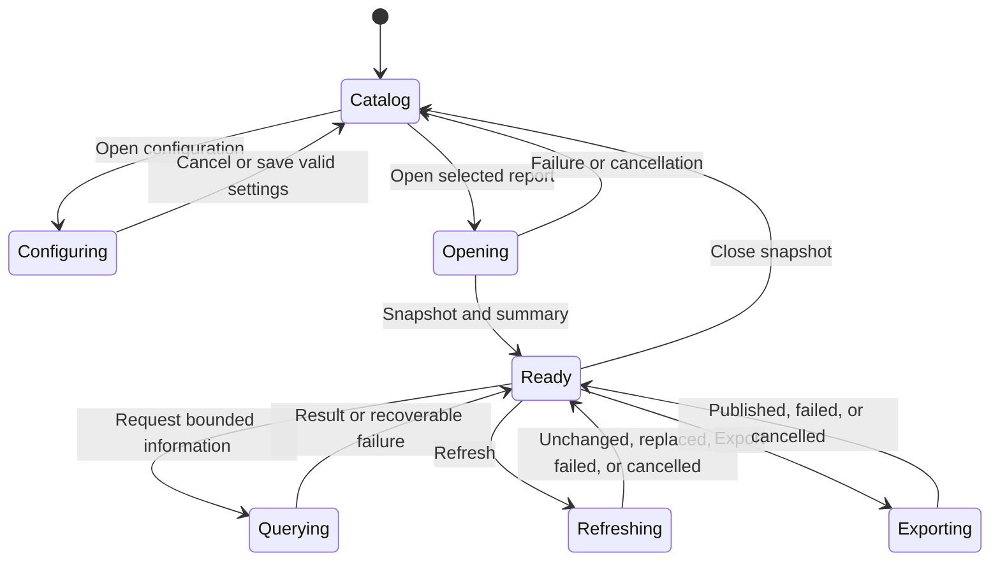

<!--
Copyright (c) 2026 Martin.Bechard@DevConsult.ca
Artifact-ID: f85048d5-a493-4107-80d4-941cdb73fedf
Created-UTC: 2026-08-12T15:00:04Z
Creating-Agent: Dev Documentation Writer
Runtime: Codex
-->

# Agent Report Dynamic Workspace Design

## Current Understanding

The Dynamic Workspace presents bounded, sanitized information about a selected Codex run and its configured relationship scope. It defines information, actions, state, and boundaries—not a fixed layout or one view per data family. Design mode: **PLANNED_DEVELOPMENT**.

## Authoritative Sources

1. [FR-001](../../requirements/functional/FR-001-agent-report-dynamic-app-and-static-export.md) owns actor-visible information, actions, configuration, and outcomes.
2. [ARC-001](../../architecture/ARC-001-agent-report-dynamic-app-and-static-export.md) owns native authority, persistence, privacy, and process boundaries.
3. [HLD-003](../high-level/HLD-003-agent-report-dynamic-app-and-static-export.md) owns operations, component allocation, and DTO families.
4. Current source and tests describe implemented catalog behavior but do not override planned contracts.

## Related Code

```text
tools/report/desktop/
├── index.html
├── src/
│   ├── contracts.ts
│   ├── main.ts
│   ├── report-workspace.ts
│   └── styles.css
└── src-tauri/
    └── src/
        └── lib.rs
```

`report-workspace.ts` owns presentation and interaction state. `contracts.ts` validates boundaries. `main.ts` joins catalog selection and application configuration. Tauri owns settings, native paths, database identity, filesystem effects, and worker lifecycle.

## Related Tests

Existing tests under `tools/report/desktop/src/` and `tools/report/desktop/tests/browser/` are baseline evidence. Configuration, direct-open, information-family, action, accessibility, and cancellation tests are planned.

## Related Backlog Items

- [Modularize report tool for concurrent maintenance](../../feature-backlog/modularize-report-tool-for-concurrent-maintenance.md) affects renderer boundaries.
- A dedicated work item for desktop configuration and direct snapshot opening is not yet identified.

## Related Wiki Pages

No project wiki page is yet identified.

## Open Questions

No product question blocks this design. UX design owns the number, names, grouping, ordering, and responsive arrangement of surfaces, subject to FR-001's information and action contract.

## Maintenance Notes

Recheck this design when FR-001, HLD operations, DTOs, the configuration schema, Tauri commands, privacy rules, or accessibility requirements change. Do not reintroduce a preflight operation, token, dialog, state, or confirmation.

## Requirements Coverage

| Requirement | Workspace obligation | Status |
|---|---|---|
| FR-01 | Search configured roots, show progress/empty/errors, select, and open. | DEFINED |
| FR-02 and DEC-05 | Edit all configuration values atomically and use relationship defaults for direct open. | DEFINED |
| FR-03 | Expose every required information family through bounded requests. | DEFINED |
| HM-F01–HM-F15 | Provide three modes, truthful evidence states, bounded drilldown, and pointer/keyboard actions. | DEFINED |
| FR-04 | Preserve coherent content during refresh, cancellation, and failure. | DEFINED |
| FR-05 | Present export mode, destination, omissions, replacement, progress, result, and reopen. | DEFINED |
| FR-08 | Expose provenance without native cache/database paths or unrestricted source paths. | DEFINED |
| FR-10 | Provide keyboard operation, focus management, announcements, and non-color meaning. | DEFINED |

## Runtime Path

The module runs in the Tauri webview from `tools/report/desktop/src/report-workspace.ts`, instantiated by `tools/report/desktop/src/main.ts`. It communicates only through parsed Tauri commands and events.

## Parent Context

HLD-003 assigns bounded presentation, interaction state, configuration presentation, lazy request submission, progress/cancellation presentation, and accessibility. Discovery, relationship closure, normalization, durable configuration, database selection, export publication, native path access, and worker termination remain outside this module.

## Responsibilities

Its primary responsibility is to present the information and actions required by FR-001 using bounded, correlated results. It keeps catalog selection separate from snapshots, edits configuration as a draft, requests only the active information context, rejects stale responses, retains the last coherent result, and presents progress, cancellation, empty, partial, unavailable, N/A, failure, and success states.

## Callers

| Caller | Contract |
|---|---|
| Desktop bootstrap | Creates the workspace, supplies transport, and forwards catalog selection. |
| Local operator | Searches, configures, opens, inspects, navigates, refreshes, cancels, exports, opens authorized sources, and closes snapshots. |
| Tauri event adapter | Delivers bounded progress and one correlated terminal outcome. |

## Dependencies

| Dependency | Permitted use | Prohibited use |
|---|---|---|
| Tauri transport | Settings, search, direct open, query, refresh, export, cancel, opaque reference opening. | Arbitrary filesystem or shell access. |
| Contract parsers | Validate every native response/event before mutation. | Unchecked payload casts. |
| DOM/accessibility APIs | Render content, actions, focus, status, and disclosures. | Transcript data in storage, URLs, or diagnostics. |
| Service DTOs | Supply bounded semantic data. | Presentation-side semantic reaggregation. |

## Public Contracts

| Operation | Input and success | Failure rule |
|---|---|---|
| `loadConfiguration` | Returns the complete active display configuration. | Show retry/configuration unavailable; never invent defaults over invalid persisted data. |
| `saveConfiguration` | Submits one complete draft; success returns the active configuration. | Field errors remain on the draft; no partial application. Database identity change is disabled while any snapshot/operation is active. |
| `search` | Text and local date-hour range return bounded ordered catalog data. | Preserve criteria/selection; invalid root offers configuration. |
| `openSnapshot` | Selected root; host injects saved relationship defaults; returns snapshot metadata and summary. | No preflight exists. Failure/cancellation preserves selection and prior snapshot. |
| `loadInformation` | Snapshot/revision plus typed bounded context returns a correlated result. | Ignore stale results and retain current coherent content. |
| `refreshSnapshot` | Returns unchanged or atomically replaced metadata/summary. | Retain prior revision on failure/cancellation. |
| `exportSnapshot` | Mode, optional destination override, replace choice, archive option return opaque export identity/counts/digest/warnings. | No partial publication. |
| `cancelOperation` | Active operation ID reaches terminal cancellation. | Remain cancelling until acknowledgement/terminal event. |
| `closeSnapshot` | Closes active snapshot and clears bound state. | A recoverable failure retains the snapshot identity. |

## External And Asynchronous Effect Phases

| Effect | Submission/executor | Completion | Failure |
|---|---|---|---|
| Configuration save | Workspace submits complete draft; Tauri validates and atomically persists. | Active configuration returned. | Draft retained; active configuration unchanged. |
| Snapshot open | Workspace submits selection; host/worker resolve scope and normalize. | Snapshot and summary returned. | Selection retained; no new snapshot published. |
| Query | Workspace submits bounded typed context; service reads immutable lease. | Correlated result returned. | Prior result retained. |
| Refresh | Host/worker prepares replacement. | Unchanged or atomic replacement. | Prior revision retained. |
| Export | Exporter stages then publishes. | Opaque export result returned. | Prior target/workspace retained. |

## Trust And Identity Boundaries

The local OS user is the actor. Tauri owns real scan, report, database, and source paths. The webview receives display labels and opaque folder/source/export references where required. Snapshot plus revision identifies query state; operation ID identifies progress/cancellation; cursors identify exact continuations. No webview value grants general filesystem authority.

## Internal Data And State

```ts
type WorkspacePhase = "catalog" | "configuring" | "opening" | "ready" |
  "querying" | "refreshing" | "exporting" | "cancelling" | "failed";

interface WorkspaceState {
  readonly phase: WorkspacePhase;
  readonly activeConfiguration: DesktopConfigurationDto | null;
  readonly configurationDraft: DesktopConfigurationDraft | null;
  readonly selection: CatalogSelection | null;
  readonly snapshot: SnapshotMetadataDto | null;
  readonly informationContext: InformationContext;
  readonly activeOperationId: string | null;
  readonly coherentResults: ReadonlyMap<string, ParsedResult>;
  readonly selectedEventId: string | null;
}
```

`InformationContext` is a typed presentation grouping, not a fixed route list. A configuration draft never mutates active settings before successful save.

## Processing Rules

1. Parse every native payload before changing state.
2. Correlate progress and terminal events by operation ID and kind.
3. Submit the selected root once on Open report; Tauri injects saved relationship defaults and performs scope resolution inside `open_snapshot`.
4. Load Summary after open; load other information only on demand.
5. Replace a context result only for the active snapshot and revision.
6. Disable database folder/name changes while a snapshot or operation is active; tell the operator to close it first. Never move or delete the old database.
7. Keep source opening and native destination selection in Tauri.

## Processing Diagram



## Invariants

- No preflight operation, token, state, dialog, or confirmation exists.
- Include children and Include collaborators are independent configuration defaults.
- Failed/cancelled settings do not change active configuration.
- Database identity cannot change while snapshot work is active.
- Failed queries, refreshes, and exports retain last coherent content.
- Every result belongs to the active snapshot/revision; collections remain bounded.
- Zero, partial, unavailable, and N/A remain distinct without relying on color.
- The webview never receives unrestricted path authority.

## Configuration

| Setting | Validation | Use |
|---|---|---|
| Folders to scan | Ordered non-empty readable directories | Subsequent search/open |
| Include children | Boolean; initial `false` | Subsequent search/new snapshots |
| Include collaborators | Boolean; initial `false`; independent | Subsequent search/new snapshots |
| Worker threads | Integer from 1 through 64 | Subsequent search/report operations |
| Report output folder | Writable directory | Default export destination; per-export override does not save |
| Database folder | Writable directory | Combined by Tauri with database name |
| Database name | Filename only, `.sqlite3`, no separator, not `.`/`..` | Worker database identity at trusted startup |

Tauri stores these in a versioned atomic configuration file, never `localStorage` or the database the settings locate. The Workspace owns draft editing, validation presentation, Save, and Cancel.

## External Interfaces

Required Tauri interfaces load configuration, choose native folders, save the complete configuration, search, and call direct `open_snapshot`. Tauri assembles the database path and supplies it at trusted worker startup rather than in per-operation DTOs. Worker and MCP inventories contain no `preflight_report`. Exact DTO encoding belongs to `contracts.ts` and the Tauri command design.

## UI And Notification Behavior

UX may combine, split, reorder, or rename surfaces if these information/action contracts remain discoverable and testable:

| Information | Required content | Actions |
|---|---|---|
| Run/outcome/scope | Identity, workspace/store, times, state, goal, activity, observation/live state, effective relationship scope, warnings | Search, select, open, configure, refresh, cancel |
| Time/utilization | Range, runtime states, active/waiting/tool/inference/build/test time, concurrency, provenance | Filter range/resolution, inspect evidence |
| Tokens/context/models/cost | Token families, tool count, context avg/max/capacity, model/effort, price/cost, evidence state | Choose mode/period, select, drill down/back, adjacent period |
| Agents/turns | Identity, relationship, status, timing, activity, metrics | Filter, sort, page, related events |
| Tools/events | Time, actor, operation, duration, status, bounded disclosure, evidence, opaque source ref | Filter, sort, page, expand, detail/source |
| Coordination/work | Dispatch, delegation, messages, waits, interrupts, work items, claims, handoffs, inferred markers | Filter/group, related event |
| Sequence | Chronology, endpoints, grouping, hierarchy, reasoning availability, accessible ledger | Focus, filter, group, collapse, zoom/fit, event |
| Provenance/diagnostics | Revisions, versions, omissions, evidence labels, cache/parse warnings, bounded diagnostics | Expand, copy safe ID, open log |
| Export | Mode, scope, destination, omissions, progress, digest/counts/warnings | Choose, replace, cancel, reopen |

Configuration is a discoverable application action containing exactly the settings above; search does not duplicate them as primary controls. Use an ARIA live region for status. Move error focus to a summary or first invalid field. Return focus to initiating controls. Every pointer action has a visible keyboard equivalent.

## Error Handling

| Error | Retained state | Recovery |
|---|---|---|
| Invalid configuration | Complete draft and active configuration | Correct or cancel |
| Unavailable configured folder | Criteria and selection | Configure or retry |
| Open/source conflict | Selection and prior snapshot | Retry |
| Stale cursor/query | Coherent context | Restart context |
| Missing event | Snapshot and context | Repeat query |
| Refresh failure/cancel | Prior revision/observation | Retry |
| Export failure/cancel | Workspace and existing target | Correct/retry |
| Contract parse failure | Coherent state and bounded diagnostic | Retry/open diagnostics |

Diagnostics exclude transcript bodies, sensitive raw payloads, database paths, and unrestricted source paths.

## Documentation Acceptance

**ACCEPTED.** This design replaces the rejected layout and preflight model with explicit information, actions, configuration, state, ownership, processing, and verification contracts while leaving visual composition to UX design.

## Implementation Readiness

**BLOCKED.** Implementation requires Tauri configuration persistence/schema, configuration DTOs/commands, removal of every preflight contract and test assumption, direct-open integration, contextual UX design, and planned automated verification.

## Verification

Verify configuration load/edit/choice/validation/atomic save/cancel/restart; database-change blocking during active work; absence of preflight names, DTOs, tokens, states, controls, worker messages, MCP tools, and tests; all required information and actions; stale-response rejection and coherent-state retention; bounds/paging; keyboard, focus, announcements, and non-color meaning; and privacy across DTOs, DOM, logs, source opening, database settings, and export reopening. Run TypeScript, browser, Tauri, Rust, Python service/worker, and MCP test suites after implementation.
