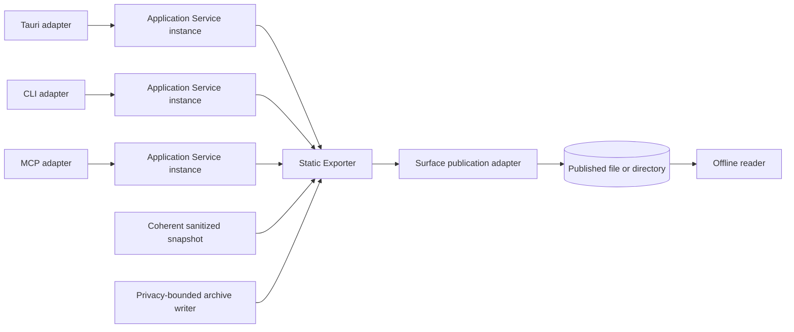
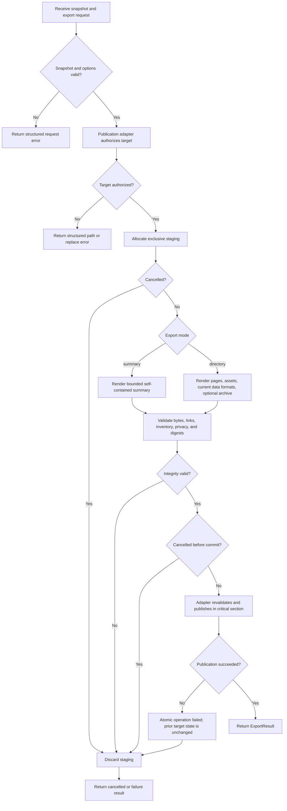
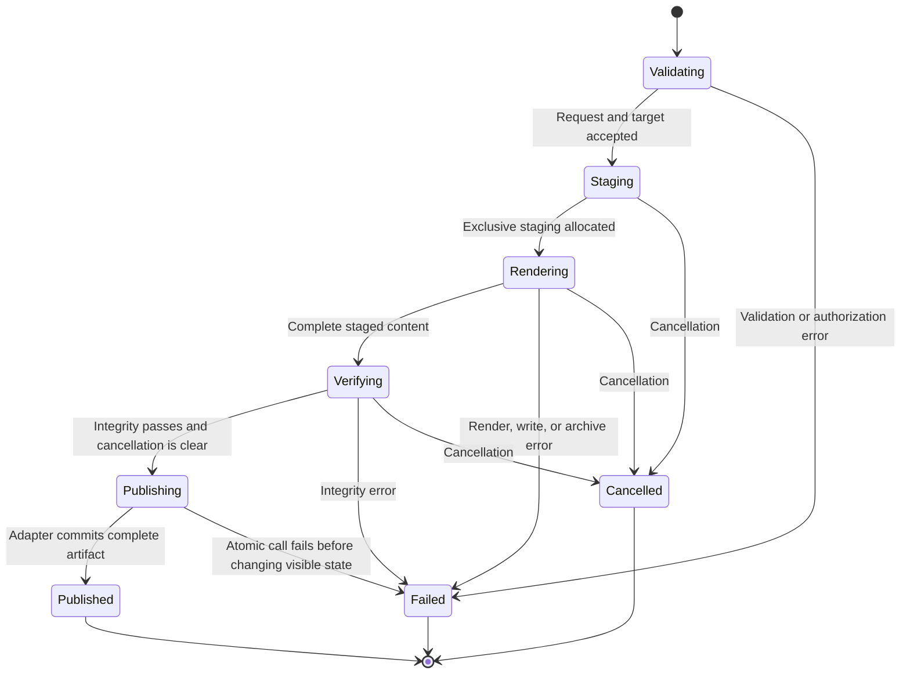

<!--
Copyright (c) 2026 Martin.Bechard@DevConsult.ca
Artifact-ID: 5bd1d0cd-4fe7-43d9-a4ee-aa9ef55360c4
Created-UTC: 2026-08-12T15:00:04Z
Creating-Agent: Dev Documentation Writer
Runtime: Codex
Dispatched-Model: gpt-5.6-sol
Reasoning-Effort: medium
Task-ID: /root/design_static_export
Artifact-ID-Evidence: runtime-supplied
Created-UTC-Evidence: runtime-supplied
Creating-Agent-Evidence: runtime-supplied
Runtime-Evidence: runtime-supplied
Dispatched-Model-Evidence: runtime-supplied
Reasoning-Effort-Evidence: runtime-supplied
Task-ID-Evidence: runtime-supplied
-->

# Agent Report Static Export Design

## Current Understanding

> This gives implementers, test authors, and reviewers a shared baseline for the module before they interpret detailed contracts. Module designers, implementers, test authors, and reviewers use it during assignment, onboarding, and review to state the module's purpose, single responsibility, current or intended behavior, and design mode.

The Static Exporter converts one coherent Codex Agent Report snapshot into a portable streamlined artifact. It publishes a complete offline directory or a bounded self-contained summary.

The module has one primary responsibility: it renders and stages a privacy-bounded snapshot as a deterministic static artifact. A surface-specific publication adapter validates the destination and commits the staged artifact.

This design defines intended behavior. Its design mode is **PLANNED_DEVELOPMENT**. One shared streamlined exporter serves Tauri, explicit CLI `directory|summary` choices, and MCP `export_snapshot`. The current classic interactive renderer remains separate. It continues to serve omitted-mode CLI generation and MCP `generate_report` with their current contracts. Current `run-timeline.py` behavior remains evidence for semantics that streamlined output must preserve where applicable.

## Authoritative Sources

> This lets reviewers distinguish accepted module contracts from inference and apply source precedence at the correct level of specificity. Module designers, implementers, test authors, and reviewers use it during design and maintenance to link parent requirements, decisions, implementation, tests, and procedures and to resolve genuine conflicts without erasing operation-specific rules.

The permitted source inventory is:

| Source category | Durable source | Use |
| --- | --- | --- |
| Accepted functional specification | [FR-001](../../requirements/functional/FR-001-agent-report-dynamic-app-and-static-export.md) | Actor-visible export modes, offline behavior, warnings, errors, privacy, and acceptance scenarios |
| Accepted architecture | [ARC-001](../../architecture/ARC-001-agent-report-dynamic-app-and-static-export.md) | ARC-01 through ARC-16, static startup constraints, compatibility, native authority, and atomic publication |
| Owning high-level design | [HLD-003](../high-level/HLD-003-agent-report-dynamic-app-and-static-export.md) | Static Exporter ownership, OP-27 through OP-29, CR-11, CR-12, CR-15, placement, and implementation order |
| Accepted technical decisions | Dev Architect reconciliation packet accepted for `/root/report_app_architecture`, narrowed by the user's 2026-08-12 superseding decision | Python ownership, offline directory, adapter boundary, structured results and diagnostics, exact planned paths, classic-renderer preservation and separation, snapshot-directory default, and explicit summary mode |
| Backlog requirement | [Modularization backlog item](../../feature-backlog/modularize-report-tool-for-concurrent-maintenance.md) | Separation from the monolithic compatibility renderer |
| Project configuration | [`tools/report/pyproject.toml`](../../../tools/report/pyproject.toml) | Python version, packaging, and test environment |
| Current implementation evidence | [`run-timeline.py`](../../../tools/report/scripts/run-timeline.py), [`cli.py`](../../../tools/report/src/agent_report/cli.py), [`mcp_report.py`](../../../tools/report/src/agent_report/mcp_report.py), and [`mcp_server.py`](../../../tools/report/src/agent_report/mcp_server.py) | Implemented renderer symbols, existing formats, CLI backends, MCP bundle behavior, and compatibility semantics |
| Current test evidence | [`test_run_timeline.py`](../../../tools/report/tests/test_run_timeline.py), [`test_cli.py`](../../../tools/report/tests/test_cli.py), [`test_mcp_report.py`](../../../tools/report/tests/test_mcp_report.py), and [`test_mcp_server.py`](../../../tools/report/tests/test_mcp_server.py) | Implemented output, sequence-companion, CLI, and MCP behavior |
| Current product guide | [Agent Report README](../../../tools/report/README.md) and [CD-001](CD-001-codex-rollout-metrics.md) | Current backends, output use, measurement, privacy, and provenance semantics |
| Dependency status | Application Service and Event Repository contracts are synchronized independently from HLD-003 and the accepted reconciliation | This design does not derive its exporter result contract from a sibling module design |
| Procedures and retained runtime evidence | Not yet identified beyond the validation commands in HLD-003 and the README | No runtime transcript evidence is required for this planned module |

FR-001 wins for actor-visible behavior. ARC-001 wins for system-wide constraints. HLD-003 wins for component ownership and cross-module contracts. This design owns module-internal symbols, algorithms, rendering layout, and test seams. Current code and tests win only for claims about retained behavior.

A specific current `run-timeline.py` format contract governs that compatibility operation. The broader static safety rules do not silently change its supported backend, filename, or representation semantics.

## Related Code

> This gives implementers and reviewers a direct path from the module design to the artifacts it owns. Module designers, implementers, test authors, and reviewers use it during implementation, refactoring, code review, and reverse engineering to locate the entry point, internal files, configuration, scripts, generated artifacts, and runtime files.

The module owns the planned source file `tools/report/src/agent_report/static_export.py`. The file is not yet implemented.

The module integrates the existing compatibility core in [`tools/report/scripts/run-timeline.py`](../../../tools/report/scripts/run-timeline.py). It does not take ownership of that file or of the entry-point adapters.

## Related Tests

> This shows which module responsibilities and failure paths are exercised and where verification is still absent. Module designers, implementers, test authors, and reviewers use it during review, regression analysis, and change planning to find tests, fixtures, snapshots, manual checks, and generated evidence.

The planned unit and integration target is `tools/report/tests/test_static_export.py`. The file is not yet implemented.

Existing compatibility coverage remains in [`tools/report/tests/test_run_timeline.py`](../../../tools/report/tests/test_run_timeline.py), [`tools/report/tests/test_cli.py`](../../../tools/report/tests/test_cli.py), [`tools/report/tests/test_mcp_report.py`](../../../tools/report/tests/test_mcp_report.py), and [`tools/report/tests/test_mcp_server.py`](../../../tools/report/tests/test_mcp_server.py).

## Related Backlog Items

> This preserves the decisions, defects, and planned changes that explain the module's current design or may alter it. Module designers, implementers, test authors, and reviewers use it during planning, triage, and maintenance to connect the design to active and historical work.

- [Modularize report tool for concurrent maintenance](../../feature-backlog/modularize-report-tool-for-concurrent-maintenance.md) requires a boundary that permits independent report work.
- No separate accepted Static Exporter backlog item is identified.

## Related Wiki Pages

> This helps readers navigate from implementation detail to parent context, dependencies, callers, and shared terminology without duplicating those artifacts. Module designers, implementers, test authors, and reviewers use it during onboarding and impact analysis to locate designs, functional pages, decisions, and known defects.

- [FR-001](../../requirements/functional/FR-001-agent-report-dynamic-app-and-static-export.md) defines actor-visible static export behavior.
- [ARC-001](../../architecture/ARC-001-agent-report-dynamic-app-and-static-export.md) defines the system boundary and cross-cutting invariants.
- [HLD-003](../high-level/HLD-003-agent-report-dynamic-app-and-static-export.md) assigns this module and its cross-module contracts.
- [CD-001](CD-001-codex-rollout-metrics.md) defines current report measurement, privacy, and rendering evidence that the shared exporter must preserve where applicable.
- CD-002 and CD-003 are sibling implementation dependencies. They are navigational context, not authority for this exporter contract.
- No project wiki page is identified.

## Open Questions

> This prevents unresolved module contracts or authority conflicts from becoming unsupported implementation guesses. Module designers, implementers, test authors, and reviewers use it before implementation and during review to classify each question's impact, blocking status, decision owner, affected contract or transition, and required evidence.

| ID | Question | Classification and effect | Decision owner and required evidence |
| --- | --- | --- | --- |
| OQ-02 | What event-cache quota and retention policy applies? | Non-blocking for this module. It affects the Event Repository and Tauri cache maintenance, not export staging cleanup. | Product owner with Dev Architect review; disk-use and purge evidence |
| OQ-03 | Must the first dynamic release support non-Codex adapters? | Non-blocking for this module. Existing non-Codex static backends remain in `run-timeline.py`; dynamic snapshot export remains Codex-first. | Product owner; release-scope decision |
| OQ-04 | Must the workspace run in a standalone browser? | Non-blocking for static output. Directory output remains readable in a browser through `file://`; the question governs the dynamic workspace transport. | Product owner with Dev Architect review; trust-boundary decision |

OQ-01 is resolved. Omitted CLI mode and MCP `generate_report` retain classic interactive output. Explicit CLI streamlined export and MCP `export_snapshot` provide complete directory or bounded summary. MCP query operations do not create static output.

No module-internal technical question remains open. The propositions in this design resolve internal types, ordering, limits, manifest spelling, and test seams within the delegated Static Exporter boundary.

## Maintenance Notes

> This helps future maintainers recognize when callers, dependencies, exports, side effects, or tests have made the design stale. Module designers, implementers, test authors, and reviewers use it after module changes to identify revalidation work and record the last meaningful source review.

Recheck this design when OP-27, OP-28, CR-11, CR-12, CR-15, classic-renderer ownership, snapshot metadata, privacy rules, sealing rules, the current output formats, directory sequence behavior, browser `file://` constraints, or publication adapters change.

Re-run Codex export parity tests when current JSON, turns CSV, work-unit CSV, Markdown, heatmap, or sequence semantics change. The same release removes `render_codex_rollout_html`, `_split_codex_sequence_document`, and `_write_codex_outputs` from the Codex export path. Current non-Codex adapters remain separate in `run-timeline.py` and are outside this module.

The latest source review is 2026-08-12. It includes the current dirty-worktree versions of the named authorities and compatibility sources.

## Requirements Coverage

> This prevents parent requirements and scope-bearing qualifiers from disappearing into generic module prose. Module designers, implementers, test authors, and reviewers use it during design review, implementation planning, and change assessment to map every requirement to its claim mode, satisfying contract, status, ownership, and verification.

The runtime assignment requires a PLANNED_DEVELOPMENT design for the Static Exporter. The resolved decision requires complete offline directory and bounded summary as streamlined modes without replacing classic interactive generation. It also requires an optional privacy-bounded SQLite archive, exact stable files, no dynamic startup loader, staging, truthful atomic publication, cancellation, cleanup, provenance, sealing, path errors, adapter boundaries, retained data formats, and implementation-ready symbols and tests.

HLD-003 assigns this component only streamlined summary and directory output. The classic interactive renderer remains in `run-timeline.py` and is not an export mode of this component.

| Requirement source and ID | Claim mode | Required outcome | Satisfying contract, rule, state, or error path | Status | Out-of-scope authority, rationale, and owning artifact | Verification |
| --- | --- | --- | --- | --- | --- | --- |
| Runtime assignment and resolved decision; Static Exporter scope | INTENDED_BEHAVIOR | Own only `static_export.py`, its module contract, and `test_static_export.py`. Provide streamlined output for Tauri, explicit CLI modes, and MCP `export_snapshot` without owning classic generation. | Runtime Path, Responsibilities, `StaticExporter.export`, and Codex Export Model | DEFINED | Classic Codex and non-Codex adapters remain separate in `run-timeline.py`; resolved user decision | Placement, import, and renderer-separation tests |
| FR-001 FR-05; OP-27 | INTENDED_BEHAVIOR | Publish a self-contained bounded summary with a recommended 2 MiB cap and an explicit omission ledger. | `ExportMode.SUMMARY`, `DEFAULT_SUMMARY_MAX_BYTES`, `_render_summary`, and `SUMMARY_OMISSION_PRIORITY` | DEFINED | Application Service owns snapshot selection and DTO construction; HLD-003 | Summary cap, omission, self-containment, and determinism tests |
| FR-001 FR-05; OP-28 | INTENDED_BEHAVIOR | Publish a complete `file://` directory with a small entry page, classic assets, exact manifest, current data formats, paginated pages, sequence, and optional SQLite archive. | Directory File Contract, `ExportMode.DIRECTORY`, `_render_directory`, and manifest validation | DEFINED | Event Repository owns archive extraction; CD-003 | Offline browser, file inventory, pagination, digest, and archive tests |
| FR-001 FR-05; ARC-12 | INTENDED_BEHAVIOR | Static startup uses no fetch, XHR, JavaScript module, service worker, or SQLite-WASM. | Invariants, `report.js` contract, and forbidden-token verification | DEFINED | Network hosting and a dynamic standalone browser are outside ARC-001 | Network-disabled browser and source-token tests |
| Resolved renderer-separation decision; OQ-01 | PROPOSED_CHANGE | Keep classic interactive HTML and its sequence companion in the existing renderer. Add two streamlined modes without using them as implicit CLI or `generate_report` replacements. | Two-value `ExportMode`, adapter routing, and renderer-ownership ledger | DEFINED | FR-001, ARC-001, and HLD-003 | Classic-regression, explicit-routing, and separation tests |
| FR-001 FR-06; ARC-13 narrowed by resolved decision | CURRENT_BEHAVIOR and PROPOSED_CHANGE | Preserve current Codex JSON, turns CSV, work-unit CSV, Markdown, measurement, privacy, heatmap, and sequence semantics in the new directory. Keep Junie, prompt-runner, methodology-runner, comparison, catalog, and other non-Codex static adapters separate. | `CodexExportModel`, exact directory files, and non-Codex exclusion | DEFINED | Existing non-Codex adapter selection remains in `run-timeline.py`; user decision | Codex format parity and existing non-Codex regression suites |
| FR-001 FR-07; CR-12 | INTENDED_BEHAVIOR | Tauri, CLI, and MCP use the same exporter semantics while each adapter retains its own output authority and result mapping. | `PublicationAdapter`, `PublicationPlan`, and adapter-specific path rules | DEFINED | Surface configuration and inline limits stay with each adapter; HLD-003 | Fake-adapter contract tests plus cross-entry-point parity |
| FR-001 privacy, cost, and provenance; ARC-15 | CURRENT_BEHAVIOR and INTENDED_BEHAVIOR | Export only sanitized evidence. Keep ciphertext opaque and evidence labels distinct. | `CodexExportModel`, manifest provenance, archive writer contract, and privacy invariants | DEFINED | Normalization Core and Application Service own source parsing and sanitization; HLD-003 CR-08 and CR-11 | Secret, ciphertext, epistemic-label, and archive-inspection tests |
| FR-001 sealing; ARC-09 | INTENDED_BEHAVIOR | Bind sealed exports to snapshot, source, parser, pricing, formatter, scope, and observation provenance. | `SnapshotProvenance`, `_validate_snapshot_binding`, and manifest fields | DEFINED | Application Service owns creation of the coherent snapshot binding; CD-002 | Live and sealed provenance tests |
| FR-001 cancellation; ARC-14 | INTENDED_BEHAVIOR | A failed or cancelled export publishes no partial artifact and preserves an existing target. | Staging state machine, cancellation checks, integrity gate, one atomic adapter commit, and cleanup | DEFINED | Tauri owns forced worker termination; CD-004 | Fault injection at every phase and cancellation tests |
| FR-001 path edges; CR-12 | INTENDED_BEHAVIOR | Reject unauthorized, changed, incompatible, missing-parent, permission-denied, or unconfirmed replacement targets before destructive publication. | `PublicationAdapter.authorize`, opaque authority token, and structured path errors | DEFINED | OS dialogs, CLI permissions, and MCP output roots remain adapter-owned | Tauri/CLI/MCP fake-adapter path matrix |
| HLD-003 CR-15; OP-38 | INTENDED_BEHAVIOR | Use only relative export-root navigation inside the complete directory, including `sequence/index.html`. | Directory links and link verifier | DEFINED | Tauri validates native popup requests when used; HLD-003 | Relative-link and unrelated-target tests |
| HLD-003 OQ-02 | OPEN_QUESTION | Do not use the unresolved event-cache quota as an export cleanup policy. | Open Questions and staging-only cleanup contract | OUT_OF_SCOPE | Product owner with Dev Architect review; CD-003 and Tauri maintenance | Confirm no cache purge API is imported or called |
| HLD-003 OQ-03 and OQ-04 | OPEN_QUESTION | Preserve current non-Codex static behavior and keep dynamic non-Codex or standalone transport outside this module. | Compatibility and Non-Goals statements | OUT_OF_SCOPE | Product owner; FR-001 and HLD-003 | Regression tests and dependency audit |

## Runtime Path

> This makes physical placement, entry points, symbols, and ownership directly usable so contributors do not invent competing paths or incomplete package structures. Module designers, implementers, test authors, and reviewers use it during implementation assignment, code review, and refactoring to map production, test, configuration, fixture, generated, and migration artifacts.

The source entry point is `tools/report/src/agent_report/static_export.py` in namespace `agent_report.static_export`.

```text
docs/
└── design/
    └── components/
        └── CD-006-agent-report-static-export.md
tools/
└── report/
    ├── scripts/
    │   └── run-timeline.py
    ├── src/
    │   └── agent_report/
    │       └── static_export.py
    └── tests/
        ├── test_run_timeline.py
        └── test_static_export.py
```

| Tree leaf | Namespace or symbols | Responsibility |
| --- | --- | --- |
| `CD-006-agent-report-static-export.md` | Artifact ID `5bd1d0cd-4fe7-43d9-a4ee-aa9ef55360c4` | Planned module contract |
| `static_export.py` | `agent_report.static_export`; every symbol in Public Contracts | Exact Codex export model, deterministic rendering, manifest, staging coordination, serialization, and verification helpers |
| `test_static_export.py` | Pytest module `test_static_export` | Exact module, offline, privacy, cancellation, integrity, path, and adapter tests |
| `run-timeline.py` | Existing adapter, normalization module, and classic renderer | Supplies current semantic evidence and retains Codex interactive HTML, sibling sequence, CLI default, and MCP `generate_report` rendering while non-Codex adapters remain |
| `test_run_timeline.py` | Existing pytest module | Current classic Codex, semantic, and non-Codex adapter regression coverage |

No configuration file, fixture file, migration, generated source, or embedded binary is owned by this module. CSS and JavaScript are deterministic constants in `static_export.py` and become generated export files only.

## Parent Context

> This keeps the module aligned with the subsystem, workflow, and architectural boundary it serves rather than optimizing locally in isolation. Module designers, implementers, test authors, and reviewers use it during module design and review to identify the owning parent, the module's contribution, and any qualifying caller, dependency, trust, or runtime topology.

[HLD-003](../high-level/HLD-003-agent-report-dynamic-app-and-static-export.md) owns the dynamic-analysis and static-export subsystem. This module implements OP-27 and OP-28 at CR-11, records the resolved removal of OP-29, and hands completed staging content to CR-12. It also creates the relative sequence links required by CR-15.



The Application Service owns snapshot lifecycle and the `SnapshotReady -> Exporting -> SnapshotReady` transition. This module owns staged content. The publication adapter owns path authority, final replacement, and surface-specific result mapping.

## Responsibilities

> This establishes a testable ownership boundary and prevents work from being duplicated across callers, dependencies, and sibling modules. Module designers, implementers, test authors, and reviewers use it during decomposition, implementation, and review to state only the narrow responsibilities this module owns.

- Validate export-specific mode and option combinations.
- Render a deterministic bounded summary and record every omitted section.
- Render a complete pre-rendered offline directory with classic local assets.
- Generate and validate the versioned manifest and file digests.
- Ask an archive writer for a privacy-bounded SQLite archive only when selected.
- Serialize the exact `CodexExportModel` to the current JSON, turns CSV, work-unit CSV, and Markdown roles.
- Render heatmap and sequence pages from exact pre-sanitized export rows without calling the separate classic interactive renderer.
- Write only inside the authorized staging directory.
- Check cancellation during rendering and before the final integrity gate.
- Give one validated staged artifact to the selected publication adapter.
- Remove current-operation staging content after failure or cancellation.
- Expose stale-staging cleanup through the publication adapter without touching sources, caches, or completed exports.

The module does not select source runs, discover files, normalize raw events, manage snapshots, authorize OS paths, update export history, open windows, enforce MCP inline limits, or terminate processes.

## Callers

> This reveals who depends on the module and why, making compatibility and change impact visible. Module designers, implementers, test authors, and reviewers use it during contract design, refactoring, and review to enumerate direct callers, their purpose, and links to their owning designs.

| Caller | Reason for call | Boundary |
| --- | --- | --- |
| Planned Application Service in `agent_report.application_service` | Execute streamlined OP-27 and OP-28 against one coherent snapshot and preserve snapshot state | HLD-003 CR-11 plus resolved decision |
| Existing CLI adapter in [`cli.py`](../../../tools/report/src/agent_report/cli.py) and [`run-timeline.py`](../../../tools/report/scripts/run-timeline.py) | Keep omitted-mode classic generation; route only explicit `directory|summary` to this exporter; preserve non-Codex adapters separately | HLD-003 CR-05 narrowed by the resolved decision |
| Existing MCP adapter in [`mcp_report.py`](../../../tools/report/src/agent_report/mcp_report.py) and [`mcp_server.py`](../../../tools/report/src/agent_report/mcp_server.py) | Keep `generate_report` exact and classic; route additive `export_snapshot` to this exporter | HLD-003 CR-04 narrowed by the resolved decision |
| Planned Tauri Supervisor | Supply native save authority, cancellation escalation, atomic publication, export history, and reopen behavior | HLD-003 CR-01, CR-02, and CR-12 |
| `test_static_export.py` | Exercise all pure rendering and adapter boundaries with deterministic doubles | This design |

Each entry point constructs or obtains its own process-local Application Service. No caller depends on another surface or on a process-wide mutable singleton.

## Dependencies

> This exposes every capability the module relies on so hidden coupling, unavailable paths, and ownership gaps can be found before implementation. Module designers, implementers, test authors, and reviewers use it during design, build planning, and change review to identify each dependency, its purpose, authority, and exact location.

| Dependency | Exact location or type | Purpose and authority |
| --- | --- | --- |
| Python standard library | `dataclasses`, `datetime`, `enum`, `hashlib`, `html`, `json`, `os`, `pathlib`, `shutil`, `tempfile`, `types`, `typing`, and `urllib.parse` | Models, canonical bytes, escaping, paths, staging, type protocols, and relative links; no third-party export library is required |
| Application Service snapshot DTO | Planned `agent_report.application_service` contract constrained by HLD-003 | Supplies one coherent sanitized snapshot and owns snapshot validation |
| Event Repository archive writer | Planned CD-003 contract implementing `SQLiteArchiveWriter` | Produces a privacy-bounded immutable archive for the selected snapshot; the exporter never copies the live cache file |
| Codex export producer | Planned Application Service contract constrained by HLD-003 and the exact `CodexExportModel` below | Supplies exact sanitized rows and values. It does not supply HTML or a broad runtime object. |
| Surface publication adapter | `PublicationAdapter` implementation in Tauri, CLI, or MCP composition code | Owns path authorization, capability proof, one atomic publication transition, prior-directory cleanup after exchange, and stale-staging enumeration |
| Browser file runtime | Classic HTML, CSS, and JavaScript under `file://` | Reads pre-rendered local pages without a server or startup data loader |

The module does not depend on Tauri APIs, FastMCP, a browser network API, the Rust discovery engine, the live event-cache path, `run-timeline.py` callbacks, or a dynamically loaded renderer module. HLD-003 verifies all planned dependency paths.

## Public Contracts

> This gives callers and implementers one operation-specific contract for inputs, identity, validation, outputs, state, side effects, timing, and failures. Module designers, implementers, test authors, and reviewers use it during API, event, command, and module integration design to preserve exact source specificity, reconcile compatible evidence, and keep unresolved facets open without transferring sibling behavior.

### Export Types

`static_export.py` declares these exact types:

```python
ProgressCallback: TypeAlias = Callable[["ExportProgress"], None]

class ExportMode(str, Enum):
    SUMMARY = "summary"
    DIRECTORY = "directory"

class SnapshotState(str, Enum):
    LIVE = "live"
    SEALED = "sealed"

class ExportState(str, Enum):
    VALIDATING = "validating"
    STAGING = "staging"
    RENDERING = "rendering"
    VERIFYING = "verifying"
    PUBLISHING = "publishing"
    PUBLISHED = "published"
    CANCELLED = "cancelled"
    FAILED = "failed"
```

The immutable request and snapshot contracts use exact exporter-owned types. No field accepts `object`, `Any`, a general mapping, or a general sequence.

```python
EvidenceKind: TypeAlias = Literal[
    "measured", "derived", "inferred", "unavailable", "estimated"
]

@dataclass(frozen=True, slots=True)
class ExportScope:
    include_children: bool
    include_collaborators: bool

@dataclass(frozen=True, slots=True)
class SnapshotProvenance:
    snapshot_id: str
    revision: str
    root_thread_id: str
    scope: ExportScope
    observed_at: datetime
    state: SnapshotState
    source_digest: str
    parser_version: str
    pricing_version: str
    pricing_digest: str
    formatter_version: str
    formatter_digest: str

@dataclass(frozen=True, slots=True)
class MetricExport:
    metric_id: str
    label: str
    display_value: str
    numeric_value: int | float | None
    unit: str | None
    evidence: EvidenceKind

@dataclass(frozen=True, slots=True)
class ExportWarningRecord:
    code: str
    message: str

@dataclass(frozen=True, slots=True)
class SummaryExport:
    title: str
    goal: str | None
    run_state: str
    metrics: tuple[MetricExport, ...]
    recent_activity: tuple[str, ...]
    warnings: tuple[ExportWarningRecord, ...]

@dataclass(frozen=True, slots=True)
class AgentExportRow:
    thread_id: str
    parent_thread_id: str | None
    task_title: str
    agent_role: str
    model: str
    effort: str
    started_at: str
    last_observed_at: str
    terminal_state: str
    turn_count: int
    tool_count: int
    mcp_call_count: int
    wall_time_ms: int
    agent_time_ms: int
    input_tokens: int
    cached_input_tokens: int
    output_tokens: int
    reasoning_tokens: int
    estimated_cost_usd: float | None
    cost_evidence: EvidenceKind

@dataclass(frozen=True, slots=True)
class TurnExportRow:
    thread_id: str
    turn_id: str
    started_at: str
    completed_at: str
    duration_ms: int
    time_to_first_token_ms: int | None
    outcome: str
    abort_reason: str
    abort_event_timestamp: str
    abort_initiator_thread_id: str
    abort_initiator_agent_path: str
    abort_initiator_turn_id: str
    abort_initiator_relationship: str
    abort_request_source_path: str
    abort_request_source_ordinal: int
    phase_id: str
    lane_id: str
    work_unit_id: str
    activity: str
    attribution_confidence: str
    input_tokens: int
    cached_input_tokens: int
    uncached_input_tokens: int
    output_tokens: int
    reasoning_tokens: int
    processed_tokens: int
    source_path: str
    source_ordinal: int

@dataclass(frozen=True, slots=True)
class WorkUnitExportRow:
    work_unit_id: str
    phase_id: str
    lane_id: str
    activity: str
    turn_ids: tuple[str, ...]
    allocation_method: str
    attribution_confidence: str
    input_tokens: int
    cached_input_tokens: int
    uncached_input_tokens: int
    output_tokens: int
    reasoning_tokens: int
    processed_tokens: int
    cost_status: str
    estimated_usd: float | None

@dataclass(frozen=True, slots=True)
class EventExportRow:
    event_id: str
    thread_id: str
    turn_id: str | None
    timestamp: str
    kind: str
    label: str
    summary: str
    evidence: EvidenceKind
    source_ordinal: int

@dataclass(frozen=True, slots=True)
class HeatmapCellExport:
    thread_id: str
    bucket_start: str
    bucket_end: str
    measure: str
    numeric_value: int | float
    display_value: str
    evidence: EvidenceKind

@dataclass(frozen=True, slots=True)
class SequenceParticipantExport:
    thread_id: str
    parent_thread_id: str | None
    display_name: str
    role: str

@dataclass(frozen=True, slots=True)
class SequenceEventExport:
    sequence_order: int
    event_id: str
    timestamp: str
    kind: str
    source_thread_id: str
    target_thread_id: str | None
    label: str
    detail: str
    evidence: EvidenceKind

@dataclass(frozen=True, slots=True)
class CodexExportModel:
    provenance: SnapshotProvenance
    summary: SummaryExport
    agents: tuple[AgentExportRow, ...]
    turns: tuple[TurnExportRow, ...]
    work_units: tuple[WorkUnitExportRow, ...]
    events: tuple[EventExportRow, ...]
    heatmap_cells: tuple[HeatmapCellExport, ...]
    sequence_participants: tuple[SequenceParticipantExport, ...]
    sequence_events: tuple[SequenceEventExport, ...]

@dataclass(frozen=True, slots=True)
class ExportRequest:
    operation_id: str
    snapshot_id: str
    revision: str
    mode: ExportMode
    requested_target: Path
    replace: bool
    include_sqlite: bool = False
    page_size: int = DEFAULT_DIRECTORY_PAGE_SIZE
    summary_max_bytes: int = DEFAULT_SUMMARY_MAX_BYTES
```

`operation_id`, request `snapshot_id`, request `revision`, provenance `snapshot_id`, provenance `revision`, `root_thread_id`, and digest fields must be non-empty. Digests must contain 64 lowercase hexadecimal characters. `observed_at` must be timezone-aware. `page_size` must be 1 through 500. `summary_max_bytes` must be 65,536 through 2,097,152 bytes. `include_sqlite` is valid only for `directory`.

Before path authorization or staging, `StaticExporter.export` compares `ExportRequest.snapshot_id` with `CodexExportModel.provenance.snapshot_id`. It also compares `ExportRequest.revision` with `CodexExportModel.provenance.revision`. Either mismatch raises `REPORT_SNAPSHOT_CONFLICT`. The error identifies the requested and supplied snapshot IDs and revisions but discloses no cache path or raw evidence.

### Publication And Cancellation Types

```python
@dataclass(frozen=True, slots=True)
class PublicationPlan:
    adapter_name: Literal["tauri", "cli", "mcp"]
    authority_token: str
    requested_target: Path
    absolute_target: Path
    staging_directory: Path
    target_kind: Literal["file", "directory"]
    commit_strategy: Literal[
        "atomic-file-replace",
        "atomic-directory-rename",
        "atomic-directory-exchange",
    ]
    replace: bool

class PublicationAdapter(Protocol):
    def authorize(self, request: ExportRequest) -> PublicationPlan:
        raise NotImplementedError

    def publish(
        self,
        plan: PublicationPlan,
        staged_entry: Path,
        expected_relative_paths: tuple[PurePosixPath, ...],
    ) -> Path:
        raise NotImplementedError

    def discard(self, plan: PublicationPlan) -> None:
        raise NotImplementedError

    def cleanup_stale(self, *, older_than: datetime) -> tuple[Path, ...]:
        raise NotImplementedError

class CancellationToken(Protocol):
    def raise_if_cancelled(self) -> None:
        raise NotImplementedError

class SQLiteArchiveWriter(Protocol):
    def write_archive(
        self,
        destination: Path,
        provenance: SnapshotProvenance,
        cancellation: CancellationToken,
    ) -> None:
        raise NotImplementedError
```

`PublicationAdapter.authorize` validates the target before staging. Its opaque `authority_token` binds the resolved parent, target kind, replacement decision, surface authority, filesystem identity, and commit strategy. `publish` must revalidate that binding before replacement. The exporter never derives authority from `Path.exists()` or from write access alone.

Summary mode stages one temporary file in the target's existing parent. `atomic-file-replace` uses the platform's same-filesystem atomic replace operation for an absent or existing file.

Directory mode stages one complete directory in the target's existing parent. `atomic-directory-rename` applies only when the target does not exist. It publishes with one same-filesystem rename. When the target exists and `replace=True`, authorization requires a platform-proven atomic directory-exchange primitive. `atomic-directory-exchange` swaps the staged and published directory names in one atomic operation. The adapter then removes the prior directory from the hidden staging name after successful publication. If the platform or filesystem cannot prove atomic exchange support, authorization fails with `REPORT_ATOMIC_REPLACE_UNSUPPORTED`. It does not perform move-old-then-move-new, copy-over, multi-step rollback, or another observable partial replacement.

The adapter capability contract is exact:

| Platform and filesystem capability | New directory | Existing directory with `replace=True` |
| --- | --- | --- |
| macOS with same-volume `renamex_np` and `RENAME_SWAP` support | Same-parent rename | One `renamex_np` exchange |
| Linux with same-mount `renameat2` and `RENAME_EXCHANGE` support | Same-parent rename | One `renameat2` exchange |
| Windows or another runtime without a proven atomic directory exchange | Same-parent directory rename when the destination is absent | Reject with `REPORT_ATOMIC_REPLACE_UNSUPPORTED` before staging |
| Any cross-filesystem target | Reject before staging | Reject before staging |

The CLI and MCP adapters can invoke the same small native publication capability used by the Tauri host. They do not emulate directory exchange with Python copy or rename sequences. Package startup validates the native capability before it advertises directory replacement.

Tauri authorization comes from a native save or directory dialog and a Tauri capability. CLI authorization comes from the explicit resolved CLI target and operating-system permissions. MCP authorization comes from its configured output root and existing relative-resolution precedence. MCP inline size validation remains in the MCP adapter. Inline output is complete or fails with `REPORT_TOO_LARGE_FOR_MCP`.

### Manifest Types

```python
FileRole: TypeAlias = Literal[
    "entry",
    "data-json",
    "summary-markdown",
    "turns-csv",
    "work-units-csv",
    "stylesheet",
    "classic-script",
    "agents-page",
    "turns-page",
    "events-page",
    "heatmap-page",
    "sequence-page",
    "sqlite-archive",
]

@dataclass(frozen=True, slots=True)
class ManifestFile:
    path: PurePosixPath
    role: FileRole
    byte_count: int
    sha256: str

@dataclass(frozen=True, slots=True)
class ManifestOmission:
    section: str
    reason: str
    recovery: str

@dataclass(frozen=True, slots=True)
class ExportManifest:
    manifest_version: int
    snapshot_id: str
    revision: str
    root_thread_id: str
    include_children: bool
    include_collaborators: bool
    observed_at: str
    snapshot_state: Literal["live", "sealed"]
    source_digest: str
    parser_version: str
    pricing_version: str
    pricing_digest: str
    formatter_version: str
    formatter_digest: str
    files: tuple[ManifestFile, ...]
    omissions: tuple[ManifestOmission, ...]
    warnings: tuple[ExportWarningRecord, ...]
```

`manifest.json` uses these exact snake-case JSON names. `files` sorts by POSIX path. `omissions` preserves summary-priority order. `warnings` preserves input order after exact duplicate removal. JSON uses UTF-8, LF, `ensure_ascii=False`, separators `(',', ':')`, sorted object keys, and one trailing LF.

`manifest.json` does not list itself because a file cannot contain its own final digest. The exporter hashes every other published payload. A caller hashes `manifest.json` after generation and returns that digest as `manifest_sha256` in `ExportResult`.

### Result And Error Types

```python
@dataclass(frozen=True, slots=True)
class ExportProgress:
    operation_id: str
    state: ExportState
    completed: int
    total: int | None
    message: str

@dataclass(frozen=True, slots=True)
class ExportResult:
    operation_id: str
    snapshot_id: str
    revision: str
    mode: ExportMode
    published_target: Path
    manifest_sha256: str | None
    file_count: int
    total_byte_count: int
    warnings: tuple[ExportWarningRecord, ...]
    omissions: tuple[ManifestOmission, ...]

@dataclass(frozen=True, slots=True)
class ExportErrorRecord:
    code: str
    message: str
    operation_id: str
    recoverable: bool
    target: str | None = None
    requested_snapshot_id: str | None = None
    supplied_snapshot_id: str | None = None
    requested_revision: str | None = None
    supplied_revision: str | None = None
    actual_bytes: int | None = None
    maximum_bytes: int | None = None
    written_files: tuple[str, ...] = ()
    warnings: tuple[ExportWarningRecord, ...] = ()
    commit_strategy: str | None = None

class StaticExportError(RuntimeError):
    error: ExportErrorRecord
```

The entry operation is:

```python
class StaticExporter:
    def __init__(
        self,
        archive_writer: SQLiteArchiveWriter | None = None,
    ) -> None:
        raise NotImplementedError

    def export(
        self,
        model: CodexExportModel,
        request: ExportRequest,
        publication: PublicationAdapter,
        cancellation: CancellationToken,
        progress: ProgressCallback | None = None,
    ) -> ExportResult:
        raise NotImplementedError

    def cleanup_stale_staging(
        self,
        publication: PublicationAdapter,
        *,
        now: datetime,
    ) -> tuple[Path, ...]:
        raise NotImplementedError
```

`export` returns only after publication succeeds. It does not mutate the snapshot, the event cache, a source log, export history, or a UI store. An error raises `StaticExportError`. The caller maps the stable error without changing its meaning.

### Private Symbol And Progress Ledger

`static_export.py` declares these exact private symbols:

```python
SUMMARY_OMISSION_PRIORITY: tuple[str, ...] = (
    "recent_activity",
    "agents",
    "coordination",
    "time_and_runtime",
    "model_tokens_and_cost",
)
REPORT_CSS: str
REPORT_JS: str

def _validate_snapshot_binding(
    model: CodexExportModel,
    request: ExportRequest,
) -> None:
    raise NotImplementedError

def _emit_progress(
    callback: ProgressCallback | None,
    operation_id: str,
    state: ExportState,
    completed: int,
    total: int | None,
    message: str,
) -> None:
    raise NotImplementedError

def _render_summary(
    model: CodexExportModel,
    max_bytes: int,
    cancellation: CancellationToken,
) -> tuple[bytes, tuple[ManifestOmission, ...]]:
    raise NotImplementedError

def _render_directory(
    model: CodexExportModel,
    root: Path,
    page_size: int,
    include_sqlite: bool,
    archive_writer: SQLiteArchiveWriter | None,
    cancellation: CancellationToken,
    progress: ProgressCallback | None,
    operation_id: str,
) -> tuple[PurePosixPath, ...]:
    raise NotImplementedError

def _render_report_json(model: CodexExportModel) -> bytes:
    raise NotImplementedError
def _render_turns_csv(rows: tuple[TurnExportRow, ...]) -> bytes:
    raise NotImplementedError
def _render_work_units_csv(rows: tuple[WorkUnitExportRow, ...]) -> bytes:
    raise NotImplementedError
def _render_report_markdown(model: CodexExportModel) -> bytes:
    raise NotImplementedError
def _render_agent_page(rows: tuple[AgentExportRow, ...], page: int, pages: int) -> bytes:
    raise NotImplementedError
def _render_turn_page(rows: tuple[TurnExportRow, ...], page: int, pages: int) -> bytes:
    raise NotImplementedError
def _render_event_page(rows: tuple[EventExportRow, ...], page: int, pages: int) -> bytes:
    raise NotImplementedError
def _render_heatmap_page(cells: tuple[HeatmapCellExport, ...]) -> bytes:
    raise NotImplementedError
def _render_sequence_page(
    participants: tuple[SequenceParticipantExport, ...],
    events: tuple[SequenceEventExport, ...],
) -> bytes:
    raise NotImplementedError
def _build_manifest(
    provenance: SnapshotProvenance,
    files: tuple[ManifestFile, ...],
    omissions: tuple[ManifestOmission, ...],
    warnings: tuple[ExportWarningRecord, ...],
) -> ExportManifest:
    raise NotImplementedError
def _verify_staged_directory(root: Path, manifest: ExportManifest) -> None:
    raise NotImplementedError
```

`_emit_progress` is the only progress bridge. It constructs one `ExportProgress` and calls `ProgressCallback` once. Rendering uses exporter-owned progress values: 0 `VALIDATING`, 5 `STAGING`, 10 `RENDERING`, 15 through 80 for completed page groups, 85 for the optional archive, 90 `VERIFYING`, 95 `PUBLISHING`, and 100 `PUBLISHED`. Failure and cancellation do not call the current `run-timeline.py` three-argument or four-argument callbacks. They emit one final `FAILED` or `CANCELLED` record through the exporter callback. Every renderer is synchronous. Cancellation is checked before and after each private renderer and before every page write.

The classic renderer contracts remain separate from this component:

| Current `run-timeline.py` symbol and exact type | Intended disposition | Replacement |
| --- | --- | --- |
| `render_codex_rollout_html(run: CodexRunMetrics, formatter_config: ToolFormatterConfig | None = None, *, nav_links: list[tuple[str, str]] | None = None, progress: Callable[[int, str, str], None] | None = None, worker_progress: Callable[[int, str, str, str], None] | None = None, workers: int = 1) -> str` | Retained for classic CLI and MCP `generate_report`. | `_render_summary` and `_render_directory` independently consume `CodexExportModel`. |
| `_split_codex_sequence_document(full_html: str, sequence_filename: str) -> tuple[str, str] | None` | Retained for the classic sibling sequence publication. | `_render_sequence_page` writes `sequence/index.html` inside a streamlined directory. |
| `_write_codex_outputs(run: CodexRunMetrics, html_output: Path, *, formatter_config: ToolFormatterConfig | None = None, nav_links: list[tuple[str, str]] | None = None, json_output: Path | None = None, turn_csv_output: Path | None = None, work_unit_csv_output: Path | None = None, markdown_output: Path | None = None, emit_progress: bool = False, workers: int = 1) -> None` | Retained for classic CLI generation and its selected companion outputs. | `StaticExporter.export` writes one streamlined directory or summary. |
| `codex_run_to_json(run: CodexRunMetrics) -> str` | Its output role is retained, but no dynamic callback bridge is retained. | `_render_report_json(model: CodexExportModel) -> bytes`. |
| `render_codex_rollout_turn_csv(run: CodexRunMetrics) -> str` | Its exact current columns are represented by `TurnExportRow`. | `_render_turns_csv(rows: tuple[TurnExportRow, ...]) -> bytes`. |
| `render_codex_rollout_work_unit_csv(run: CodexRunMetrics) -> str` | Its exact current columns are represented by `WorkUnitExportRow`. | `_render_work_units_csv(rows: tuple[WorkUnitExportRow, ...]) -> bytes`. |
| `render_codex_rollout_markdown(run: CodexRunMetrics) -> str` | Its privacy-safe summary role remains. | `_render_report_markdown(model: CodexExportModel) -> bytes`. |

`ToolFormatterConfig`, current `nav_links`, current renderer `ProgressCallback`, current `WorkerProgressCallback`, and `workers` are not inputs to the shared exporter. The Application Service converts normalized current Codex metrics to `CodexExportModel` before calling the exporter. That conversion is part of the Application Service operation contract and is tested through cross-entry-point semantic parity.

### Justified Module Propositions

| Proposition | Decision | Basis | Necessity | Decision owner |
| --- | --- | --- | --- | --- |
| MP-01 | `DEFAULT_SUMMARY_MAX_BYTES` and the maximum accepted cap are 2,097,152 UTF-8 bytes; callers may select a smaller cap down to 65,536 bytes. | FR-001 proposes a 2 MiB default and requires bounded output. | A hard module maximum prevents a surface from changing “bounded summary” into an unbounded report. | Dev Documentation Writer within delegated module internals; bounded outcome supplied by FR-001 |
| MP-02 | Directory pages default to 500 records and accept 1 through 500. A collection can contain at most 9,999 pages. | FR-001 and HLD-003 set 500 as the page maximum and require four-digit page numbers. | Exact limits make file naming and excessive-output failures deterministic. | Dev Documentation Writer within delegated module internals |
| MP-03 | `manifest.json` omits its self-entry and the result carries its digest separately. | HLD-003 requires file digests and manifest identity. | Self-hashing is recursive. The separate result digest closes integrity without an unstable exception field. | Dev Documentation Writer within delegated module internals |
| MP-04 | Classic CSS and JavaScript are source constants in `static_export.py`. | ARC-12 requires local classic assets, and HLD-003 assigns one Python source path. | This avoids unregistered source assets while producing exact files for browser caching and review. | Dev Documentation Writer within delegated module internals |
| MP-05 | Summary uses same-parent atomic file replacement. A new directory uses same-parent atomic rename. An existing directory uses a proven atomic directory exchange or fails as unsupported. | ARC-14 requires complete old or complete new output. | These are single visibility transitions. Multi-step rollback is not atomic and is prohibited. | Dev Documentation Writer within delegated module internals; adapter must meet CR-12 |
| MP-06 | Staging names start with `.agent-report-export-` and stale staging becomes eligible after 86,400 seconds. | ARC-001 identifies stale temporary state as a forced-cancellation risk. | A fixed prefix and age allow bounded cleanup without scanning or deleting unrelated files. | Dev Documentation Writer within delegated module internals; adapter retains path authority |
| MP-07 | The optional SQLite file is produced through `SQLiteArchiveWriter`; it is never a copy of `report-events-v1.sqlite3`. | ARC-08 separates disposable cache authority from privacy-bounded output. | A purpose-built archive prevents cache-only fields or unrelated snapshots from leaking into a portable report. | Dev Documentation Writer within delegated module internals; CD-003 owns archive extraction |
| MP-08 | Omitted CLI mode and MCP `generate_report` stay classic. Explicit CLI streamlined modes and MCP `export_snapshot` use this exporter. Snapshot export defaults to directory; summary can be explicit. MCP query tools do not invoke the exporter. | User-resolved 2026-08-12 product decision | Separate routing preserves compatibility and keeps query-only tools free of publication side effects. | Product owner through the resolved user decision |

## External And Asynchronous Effect Phases

> This prevents commit, submission, execution, delivery, response, and failure timing from being collapsed into one misleading asynchronous outcome. Module designers, implementers, test authors, and reviewers use it during effect design, error analysis, and review to assign every phase to its initiator and owner and to record visibility, retry, compensation, and completion evidence.

| Effect and phase | Trigger | State already committed | Initiator | Submission owner | Executor or delivery owner | Response visibility and failure outcome | Retry or compensation | Completion evidence | Source and claim mode |
| --- | --- | --- | --- | --- | --- | --- | --- | --- | --- |
| Export authorization | `StaticExporter.export` receives a request | Snapshot revision is already coherent; no export state is published | Application Service | Static Exporter calls `PublicationAdapter.authorize` | Surface adapter | Path or replace error returns before staging | Caller corrects target or replacement choice | Valid `PublicationPlan` with authority token | HLD-003 CR-11 and CR-12; INTENDED_BEHAVIOR |
| Staging allocation | Authorization succeeds | No target change | Static Exporter | Static Exporter | Surface adapter provides the authorized staging path; exporter owns content | Allocation failure returns `REPORT_EXPORT_WRITE_FAILED` | Exporter calls `discard`; caller can retry | Empty exclusive staging directory with the required prefix | ARC-14 and MP-06; PROPOSED_CHANGE |
| Deterministic rendering | Staging exists | No target change | Static Exporter | Static Exporter | Static Exporter and optional archive writer | Progress is visible; render, archive, or cancellation error leaves only staging | No automatic retry; discard staging | Complete staged payloads | FR-001 FR-05, HLD-003 OP-27 and OP-28, and resolved removal of OP-29; INTENDED_BEHAVIOR |
| Integrity validation | Rendering completes | No target change | Static Exporter | Static Exporter | Static Exporter | Link, digest, cap, layout, or forbidden-startup-token failure returns before publication | Discard staging; fix defect before retry | Exact inventory, resolved links, verified digests, and valid manifest | ARC-12 and ARC-14; INTENDED_BEHAVIOR |
| Publication acceptance | Integrity passes and cancellation is clear | No target change | Static Exporter | Static Exporter calls `PublicationAdapter.publish` | Surface adapter | Adapter can reject a changed path or replacement binding before commit | Discard staging and repeat authorization | Revalidated authority token | HLD-003 CR-12; INTENDED_BEHAVIOR |
| Final summary publication | Adapter accepts the staged file | Previous complete file can exist | Surface adapter | Surface adapter | Surface adapter | One same-filesystem atomic file replacement; cancellation does not interrupt it | No rollback sequence; operation failure before the atomic call leaves the target unchanged | Published summary file | ARC-14, CR-12, and MP-05; INTENDED_BEHAVIOR |
| Final new-directory publication | Adapter accepts staging and target is absent | No target exists | Surface adapter | Surface adapter | Surface adapter | One same-filesystem atomic directory rename; cancellation does not interrupt it | No rollback sequence; operation failure before rename leaves target absent | Published complete directory | ARC-14, CR-12, and MP-05; INTENDED_BEHAVIOR |
| Final directory replacement | Adapter proves atomic exchange and target exists | Previous complete directory exists | Surface adapter | Surface adapter | Surface adapter | One atomic exchange makes the complete new directory visible and moves the old directory to the hidden staging name | Cleanup of old hidden directory can retry; lack of exchange support fails before commit | Published complete directory plus removable old hidden directory | ARC-14, CR-12, and MP-05; INTENDED_BEHAVIOR |
| Terminal success | Publication completes | Complete target is visible | Surface adapter | Static Exporter | Application Service maps result; Tauri may update export history | One `ExportResult`; history changes only after this result | Not applicable | Published target, manifest digest, exact `file_count`, exact `total_byte_count`, structured warnings, and structured omissions | FR-001 export state; INTENDED_BEHAVIOR |
| Failure or cancellation cleanup | Any pre-publication failure | Previous target is unchanged | Static Exporter | Static Exporter calls `discard` | Surface adapter removes only authorized staging | Structured terminal error; no success or history update | Stale cleanup after 86,400 seconds if immediate removal fails | Staging absent or retained under the fixed hidden prefix | ARC-14 and MP-06; INTENDED_BEHAVIOR |

No phase retries automatically. A caller starts a new operation with a new `operation_id` after correcting the cause.

## Trust And Identity Boundaries

> This prevents authentication, authorization, ownership, disclosure, validation, and sensitive-data rules from being inferred from names or framework conventions. Module designers, implementers, test authors, and reviewers use it during security review and operation design to map each actor and protected flow to its evidence, selectors, state effects, failure timing, and logging restrictions.

| Operation or data flow | Actor and authentication source | Authorization, ownership, tenancy, and data filtering | Selector and mismatch behavior | Validation owner | Success response and disclosure | State owner and transition | Failure timing and side effects | Sensitive data and logging |
| --- | --- | --- | --- | --- | --- | --- | --- | --- | --- |
| Application Service to Static Exporter | Snapshot holder under local OS-user surface | Snapshot grants read access to one sanitized revision. No remote tenancy exists. Scope filters bind root, children, and collaborators. | `snapshot_id`, revision, and mode must match the request. A stale binding returns snapshot conflict before rendering. | Application Service validates snapshot; exporter validates export options | Only privacy-bounded snapshot fields and existing sanitized render input cross | Service owns `SnapshotReady -> Exporting`; exporter owns staged state | Validation failure writes nothing | No raw source record, secret, cache path, or decrypted ciphertext enters the exporter |
| Static Exporter to publication adapter | Local operator, CLI caller, or MCP caller under OS identity | Tauri capability, explicit CLI target, or MCP output root authorizes one destination. Tenancy is not applicable. | Adapter resolves target and returns an authority token. Path, type, parent, symlink, permission, or replacement mismatch fails before commit. | Surface adapter | Completed staged artifact and exact inventory only | Adapter owns target replacement; exporter owns staging | Authorization failure precedes staging; commit failure rolls back | Diagnostics include bounded codes and targets but no transcript bodies or cache path |
| Static Exporter to archive writer | Same process and snapshot authority | Writer can export only the bound privacy-bounded snapshot revision | Exact snapshot provenance must match; mismatch fails before a valid archive exists | Archive writer and exporter integrity gate | Immutable `report.sqlite` containing only export-approved rows | Archive writer owns its staged file only | Error or cancellation removes staged archive | The live cache path and unrelated snapshot rows are never disclosed |
| Static reader to published directory | File possession under OS permissions | Reader can access only files present in the export. No account or network tenancy exists. | Relative link must remain inside export root. Missing or escaping path is invalid. | Exporter at creation; Tauri/browser host at open | Pre-rendered pages and approved local data files | Published report is immutable | Link failure changes no report state | Omitted evidence remains omitted; startup performs no source or cache query |

Authentication is the local operating-system context. Authorization, data filtering, target authority, and snapshot ownership remain separate decisions.

## Internal Data And State

> This makes state authority, lifetime, derivation, caching, and failure preservation explicit so returned values are not mistaken for durable mutation. Module designers, implementers, test authors, and reviewers use it during algorithm design, concurrency review, debugging, and testing to distinguish authoritative, derived, transient, persisted, reactive, and cached values.

`CodexExportModel` is the immutable authoritative input for one operation. Source JSONL remains the system authority, but this module never reads it. `SnapshotProvenance` binds the export to the coherent derived revision supplied by the Application Service.

The exporter keeps these transient values during one call:

- the authorized `PublicationPlan`;
- the current `ExportState`;
- canonical UTF-8 payload bytes keyed by relative path;
- generated page links and page counts;
- ordered manifest files, omissions, and warnings;
- the staged entry path;
- the terminal `ExportResult` or `ExportErrorRecord`.

The module has no process-wide mutable state and no shared cache. CSS and JavaScript constants are immutable module values. A `StaticExporter` instance retains only its optional archive writer.

Staging moves through `allocated`, `rendering`, `complete`, `verified`, and `committing`. Only the publication adapter can make it `published`. Cancellation or failure changes it to `discarding`, then `discarded` when cleanup succeeds. A failed cleanup leaves a hidden stale directory but does not create a published result.

An existing published target survives every pre-publication error. A cancelled call returns no transient value as success, mutates no persistent report state, replaces no cache, and triggers no subscriber effect. Surface UI state and export history remain caller-owned.

## Processing Rules

> This turns the module's internal behavior into a reviewable algorithm and exposes branches, retries, ordering, and failure paths before code is written or changed. Module designers, implementers, test authors, and reviewers use it during implementation and test design to describe named processing steps and keep them consistent with accepted effect phases.

### Export Coordination

1. Validate the request snapshot ID and revision against the model provenance, then validate the mode-specific fields.
2. Ask the selected publication adapter to authorize the target.
3. Confirm that the returned staging directory is empty, exclusive, and outside the published target.
4. Check cancellation before writing content.
5. Render the selected mode into the staging directory.
6. Validate byte limits, required files, relative links, forbidden startup mechanisms, and file digests.
7. Write `manifest.json` last for directory mode, then validate its canonical bytes.
8. Check cancellation immediately before publication.
9. Call `PublicationAdapter.publish` with the exact inventory.
10. After the adapter confirms publication, compute `file_count` and `total_byte_count` from the published artifact and return one `ExportResult`. Directory mode counts every published regular file, including `manifest.json`, and sums their exact final byte lengths. Summary mode returns `file_count=1` and the exact byte length of the published HTML file.

An exception before step 9 calls `discard`. At step 9, the adapter performs exactly one authorized atomic visibility operation. A failed atomic call leaves the previous target state unchanged. After a successful directory exchange, failure to remove the hidden prior directory becomes a cleanup warning and does not change publication success. The exporter does not retry publication.

### Summary Rendering

The summary is one UTF-8 HTML file with inline CSS and classic inline JavaScript. It contains no external reference except relative recovery text shown to the reader.

The renderer always includes the document shell, title, scope, state, observation, versions, provenance, warnings, headline metrics, and omission section. It then includes optional material in this priority:

1. recent significant activity;
2. agent summary;
3. coordination summary;
4. time and runtime summary;
5. model, token, and estimated-cost summary.

The renderer first renders all sections. If the encoded file exceeds `summary_max_bytes`, it removes the lowest-priority remaining optional section and adds one `ManifestOmission`. It repeats until the file fits. It removes individual trailing items within the last retained section only when all lower-priority sections are absent. The output must fit after each omission-ledger update. Failure of the required shell to fit returns `REPORT_SUMMARY_CAP_TOO_SMALL` before publication.

### Directory Rendering

The directory renderer creates each required file from the Directory File Contract. It chunks agents, turns, and events without reordering the supplied stable sequences. Page numbers start at one and use four digits. An empty collection still gets `page-0001.html` with an explicit empty state.

`index.html` includes summary facts and relative links to every first page, `manifest.json`, `report.json`, both CSV files, `report.md`, heatmap, and sequence. It does not embed the complete archive. Each collection page includes previous, index, and next links and its item range. `report.js` implements only local DOM filtering, grouping, disclosure, zoom, fit, breadcrumbs, and page-local navigation. It reads no file at startup.

The exporter creates `report.json`, `turns.csv`, `work-units.csv`, and `report.md` through `_render_report_json`, `_render_turns_csv`, `_render_work_units_csv`, and `_render_report_markdown`. The exact exporter-owned rows preserve the current fields and calculations supplied by the Application Service. The optional archive writer creates `report.sqlite` after the normal files and before manifest hashing.

### Classic Renderer Separation

`render_codex_rollout_html`, `_split_codex_sequence_document`, and `_write_codex_outputs` remain the classic renderer path. Omitted CLI mode and MCP `generate_report` continue to call that path. Explicit CLI `directory|summary` and MCP `export_snapshot` call the streamlined exporter. Tauri calls only the streamlined exporter.

The streamlined exporter rejects a decoded or programmatic mode value other than `summary` or `directory` with `REPORT_INVALID_REQUEST`. `html` is not a streamlined mode because classic HTML is selected by the retained CLI or MCP operation, not by an exporter alias. MCP `query_time_range`, `get_event_details`, and snapshot query operations return bounded data only. They never invoke static export.

Junie, prompt-runner, methodology-runner, comparison, catalog, and other non-Codex static adapters remain in their current separate paths. This module does not route, rewrite, or remove them.

### Integrity And Cleanup

Every directory payload except `manifest.json` is hashed after its final bytes are on disk. The exporter rejects duplicate normalized paths, absolute paths, `..` segments, backslashes, symbolic links, non-regular payload files, unexpected files, digest mismatches, unresolved relative links, and more than 9,999 pages in one collection.

`cleanup_stale_staging` subtracts 86,400 seconds from the supplied aware UTC time and calls `PublicationAdapter.cleanup_stale`. The adapter can remove only entries it created under an authorized parent with the `.agent-report-export-` prefix. Cleanup never examines or removes source logs, either cache, or a completed export.

## Processing Diagram

> This makes qualifying processing sequences, branches, states, retries, and external handoffs visible when prose or phase tables would hide their relationships. Module designers, implementers, test authors, and reviewers use it during design and review to select a sequence, state, or flow diagram that matches the module's actual processing topology.





## Invariants

> This identifies non-negotiable properties that must survive every path through the module and every future refactor. Module designers, implementers, test authors, and reviewers use it during implementation, testing, and review to state ordering, retention, filtering, validation, privacy, and state-consistency guarantees.

- One export reads one snapshot ID and revision. It never mixes revisions.
- The exporter reads no source JSONL, discovery database, title database, or live cache path.
- All disclosed values are already privacy-bounded. The module adds escaping and size bounds but does not weaken upstream filtering.
- Ciphertext stays opaque. Estimated, inferred, derived, measured, and unavailable labels remain distinct.
- Summary HTML contains at most 2,097,152 UTF-8 bytes and lists each omission.
- Directory startup uses no fetch, XHR, JavaScript module, service worker, SQLite-WASM, or network request.
- Every directory link is relative, normalized, and contained by the export root.
- Directory `files` manifest entries exactly equal the payload files other than `manifest.json`.
- Every manifest file byte count and SHA-256 digest matches the staged bytes.
- `report.json`, `turns.csv`, `work-units.csv`, and `report.md` retain current renderer roles.
- `report.sqlite`, when present, contains only the selected privacy-bounded revision and is not a live-cache copy.
- Classic interactive HTML remains available through the current CLI default and MCP `generate_report`, not as a streamlined exporter mode.
- Explicit CLI streamlined export and MCP `export_snapshot` use directory or summary. MCP queries do not export.
- Summary publication uses one atomic file replacement. New-directory publication uses one atomic directory rename.
- Existing-directory replacement uses one proven atomic directory exchange or fails before commit with `REPORT_ATOMIC_REPLACE_UNSUPPORTED`.
- A failure or cancellation before commit publishes no partial artifact and preserves the previous complete target.
- The final publication critical section is not interrupted by cancellation.
- The exporter writes only inside the authorized staging directory.
- Stale cleanup removes only adapter-owned hidden staging paths older than the fixed threshold.
- No entry point requires another entry point or a singleton service to run.

## Configuration

> This prevents settings from having unclear defaults, validation, reload behavior, or ownership. Module designers, implementers, test authors, and reviewers use it during implementation, operations, and review to define every configuration field the module reads or writes and how changes affect runtime behavior.

The module reads no environment variable or configuration file directly. Each process-local composition root validates surface configuration and places the accepted values in `ExportRequest` or its injected adapter.

| Constant or request field | Exact default and bounds | Reload behavior | Owner |
| --- | --- | --- | --- |
| `MANIFEST_VERSION` | `1`; fixed | Requires an accepted format change and compatibility tests | Static Exporter |
| `DEFAULT_SUMMARY_MAX_BYTES` | `2_097_152`; request accepts `65_536..2_097_152` | Per operation | Static Exporter default; caller can select a smaller bound |
| `DEFAULT_DIRECTORY_PAGE_SIZE` | `500`; request accepts `1..500` | Per operation | Static Exporter default |
| `MAX_DIRECTORY_PAGES_PER_COLLECTION` | `9_999`; fixed for four-digit filenames | Requires a manifest and filename contract change | Static Exporter |
| `STAGING_PREFIX` | `.agent-report-export-`; fixed | Requires cleanup migration review | Static Exporter and publication adapters |
| `STALE_STAGING_SECONDS` | `86_400`; fixed | Applied on an explicit startup or maintenance call | Static Exporter |
| `replace` | `False` | Per operation | Caller chooses; publication adapter validates |
| `include_sqlite` | `False`; directory only | Per operation | Caller chooses; archive writer executes |
| Omitted snapshot-export mode | `directory` | Per operation | Application Service applies the streamlined snapshot-export default |
| Omitted CLI report mode | Classic interactive HTML | Per invocation | CLI compatibility adapter and `run-timeline.py` |
| MCP `generate_report` | Current classic report bundle and `return_format="html"` default | Per tool call | MCP compatibility adapter and `run-timeline.py` |
| Explicit summary mode | `summary` | Per operation | Caller must select it |

OQ-02 does not alter these values. It governs event-cache quota and retention, not export staging.

## External Interfaces

> This exposes the boundaries where the module interacts with systems, tools, files, browsers, networks, or operators outside its internal API. Module designers, implementers, test authors, and reviewers use it during integration, security, and failure review to define each interface and any request, response, or operational contract the module owns.

### Directory File Contract

The complete directory has this stable root and required placement:

```text
agent-report-export/
├── index.html
├── manifest.json
├── report.json
├── report.md
├── turns.csv
├── work-units.csv
├── report.sqlite
├── assets/
│   ├── report.css
│   └── report.js
├── pages/
│   ├── agents/
│   │   └── page-0001.html
│   ├── turns/
│   │   └── page-0001.html
│   ├── events/
│   │   └── page-0001.html
│   └── heatmap/
│       └── overview.html
└── sequence/
    └── index.html
```

`report.sqlite` is optional. Every other displayed file is required. Additional collection pages use consecutive names from `page-0002.html` through `page-9999.html`. No other root filename or folder is part of manifest version 1.

Each HTML file uses UTF-8, a language attribute, one H1, keyboard-reachable navigation, visible focus, non-color state text, and relative links. Page files link to `index.html` through the necessary `../` segments. `assets/report.js` is a classic script loaded with `defer`; it does not use `type="module"`.

### Summary File And Classic Contract Separation

Summary mode publishes exactly the selected HTML target. It embeds its CSS, JavaScript, provenance, warnings, and omission ledger.

Classic interactive HTML and its sibling `<stem>-sequence.html` remain owned by `run-timeline.py`. They are outside this module's `ExportMode`. The complete streamlined directory keeps sequence at `sequence/index.html` and keeps `report.json`, `turns.csv`, `work-units.csv`, and `report.md` under fixed names. Existing non-Codex caller-selected outputs continue through their separate compatibility adapters.

### Manifest Example

The shape below is illustrative. Field names and nesting are normative.

```json
{
  "files": [
    {
      "byte_count": 1200,
      "path": "index.html",
      "role": "entry",
      "sha256": "0123456789abcdef0123456789abcdef0123456789abcdef0123456789abcdef"
    }
  ],
  "formatter_digest": "0123456789abcdef0123456789abcdef0123456789abcdef0123456789abcdef",
  "formatter_version": "1",
  "include_children": false,
  "include_collaborators": false,
  "manifest_version": 1,
  "observed_at": "2026-08-12T15:00:04Z",
  "omissions": [],
  "parser_version": "1",
  "pricing_digest": "0123456789abcdef0123456789abcdef0123456789abcdef0123456789abcdef",
  "pricing_version": "1",
  "revision": "revision-1",
  "root_thread_id": "thread-1",
  "snapshot_id": "snap_1",
  "snapshot_state": "sealed",
  "source_digest": "0123456789abcdef0123456789abcdef0123456789abcdef0123456789abcdef",
  "warnings": []
}
```

The module has no HTTP, WebSocket, remote service, or browser-storage interface. All browser operation is local and pre-rendered.

## UI And Notification Behavior

> This keeps user-visible rendering, status, chart, and notification responsibilities from being scattered or implicitly owned. Module designers, implementers, test authors, and reviewers use it during UI integration and acceptance review to define the outputs and update rules this module controls.

The module controls the content and accessibility of static output. It does not own the dynamic workspace or native notifications.

Summary output shows the task title or bounded fallback, root and relationship scope, live or sealed state, observation time, metrics, provenance, warnings, and omissions. Each omission names the missing section, explains the bound, and directs the reader to a directory export or the dynamic application.

Directory `index.html` shows the same headline state and clear navigation to all included evidence. Collection pages show item ranges and empty states. Heatmap and sequence pages preserve the current interaction meanings where the exported data supports them. Static controls work with keyboard and pointer input. Meaning does not depend only on color or arrows.

`ExportProgress` messages are bounded and never include transcript bodies. The module emits state, completed count, nullable total, and a safe message. The caller owns progress presentation, cancellation controls, success notification, export history, and reopen actions.

## Error Handling

> This makes failure timing, propagation, committed side effects, logging, recovery, and user notification predictable across callers and effects. Module designers, implementers, test authors, and reviewers use it during implementation, incident analysis, and testing to define how expected and unexpected errors behave before, during, and after responses.

| Error code | Condition and validation owner | Timing and committed side effects | Recovery and surface mapping |
| --- | --- | --- | --- |
| `REPORT_INVALID_REQUEST` | Exporter rejects empty IDs, invalid digest, naive observation time, invalid cap or page size, incompatible option, or any mode other than `directory` and `summary` | Before staging; none | Caller corrects request; CLI maps to retained diagnostic, MCP returns structured error, Tauri shows field error |
| `REPORT_SNAPSHOT_CONFLICT` | Exporter detects request/model snapshot ID or revision mismatch, or the Application Service detects a stale snapshot | Before authorization or staging; none | Refresh or reopen snapshot and submit its exact identifiers |
| `REPORT_OUTPUT_PATH_INVALID` | Adapter rejects relative resolution, incompatible target kind, missing parent policy, symlink/reparse escape, changed target, or unauthorized root | Before staging or before final commit; target unchanged | Select or correct target |
| `REPORT_OUTPUT_EXISTS` | Adapter sees an existing target without `replace=True` | Before staging; target unchanged | Choose another target or confirm replacement |
| `REPORT_OUTPUT_PERMISSION_DENIED` | Adapter cannot create staging or invoke the authorized atomic operation under the OS context | Before or during publication; previous visible state remains unchanged | Correct permissions or select another target |
| `REPORT_SUMMARY_CAP_TOO_SMALL` | Required summary shell cannot fit within the validated cap | During render; target unchanged | Use the 2 MiB cap or directory mode |
| `REPORT_EXPORT_TOO_MANY_PAGES` | One collection needs more than 9,999 pages | During render; target unchanged | Use a larger valid page size or narrow the accepted snapshot scope |
| `REPORT_EXPORT_RENDER_FAILED` | Escaping, serialization, page construction, or archive writer fails | During render; staging discarded; target unchanged | Fix deterministic defect or input and retry |
| `REPORT_EXPORT_WRITE_FAILED` | Staging allocation, file write, fsync, or close fails | Before publication; staging discarded when possible; target unchanged | Free space, repair filesystem, or choose target |
| `REPORT_EXPORT_INTEGRITY_FAILED` | Required file, link, digest, byte count, manifest, privacy marker, or startup constraint fails | Before publication; staging discarded; target unchanged | Treat as implementation defect and do not publish |
| `REPORT_EXPORT_CANCELLED` | Cancellation is observed before the final critical section | Before publication; staging discarded; target unchanged | Caller can retry with a new operation ID |
| `REPORT_ATOMIC_REPLACE_UNSUPPORTED` | Adapter cannot prove an atomic directory-exchange primitive for an existing directory target | During authorization; no staging or target change | Select a new directory target or use a supported filesystem/platform |
| `REPORT_EXPORT_PUBLICATION_FAILED` | The authorized atomic file replace, directory rename, or directory exchange fails | During final publication; prior visible target state remains unchanged | Surface escalates diagnostic; no success/history update |
| `REPORT_TOO_LARGE_FOR_MCP` | MCP adapter cannot return requested complete inline bytes | After complete files can be written; no truncation | MCP returns actual bytes, maximum bytes, written files, and warnings |

`StaticExportError` is the only expected exception crossing the module boundary. The implementation catches unexpected exceptions, preserves the cause for local diagnostics, and exposes `REPORT_EXPORT_RENDER_FAILED` or `REPORT_EXPORT_PUBLICATION_FAILED` with a safe message. It never logs raw render inputs, transcript bodies, secrets, or SQLite rows.

Cancellation checks occur before authorization return processing, before each page or data-file write, before optional archive generation, before integrity validation, and immediately before publication. Cancellation after publication starts is deferred. The operation then reports the actual publication result.

## Documentation Acceptance

> This distinguishes an accurate module design for the current reverse-engineering pass from permission to implement or change the module. Module designers, implementers, test authors, and reviewers use it during review and handoff to record whether source evidence, accepted prerequisites, and current-pass requirements are reconciled without concealing defects, unimplemented behavior, open decisions, or current limitations.

**ACCEPTED.** This PLANNED_DEVELOPMENT design incorporates the accepted Dev Architect reconciliation and the superseding renderer-separation decision. It binds request snapshot identity, defines implementable atomic publication transitions, preserves the separate classic renderer, and supplies exact exporter-owned types, structured warnings and errors, exact file and total-byte counts, private symbols, progress mapping, files, and tests. It preserves current Codex data-format roles and separate non-Codex adapters without treating planned behavior as implemented.

## Implementation Readiness

> This prevents a reviewed module design from being mistaken for permission to implement while critical contracts or questions remain unresolved. Module designers, implementers, test authors, and reviewers use it during work assignment and handoff to record READY or BLOCKED and name the exact decisions or upstream artifacts required before coding.

**BLOCKED.** The documentation contract is accepted, but implementation readiness remains blocked until the Static Exporter source and tests implement the reconciled structured warning/error records and exact `file_count` and `total_byte_count` success fields. The Application Service and Event Repository remain independently owned implementation dependencies. OQ-02 through OQ-04 do not change this accepted module contract.

## Verification

> This makes module responsibilities, contracts, edge cases, and failures provable and exposes missing test seams. Module designers, implementers, test authors, and reviewers use it during implementation, review, regression analysis, and release assessment to map unit, integration, manual, and build evidence to the behavior it verifies.

`tools/report/tests/test_static_export.py` must define these exact tests:

| Test symbol | Verification obligation |
| --- | --- |
| `test_export_summary_is_self_contained_and_at_most_two_mibibytes` | Inline assets, required facts, UTF-8 byte cap, and no external startup dependency |
| `test_export_summary_omits_sections_in_stable_priority_and_lists_each_omission` | Deterministic omission algorithm and recovery text |
| `test_export_summary_fails_when_required_shell_cannot_fit` | `REPORT_SUMMARY_CAP_TOO_SMALL` and no publication |
| `test_export_directory_matches_manifest_version_one_file_contract` | Exact required tree, optional SQLite absence, and no unexpected file |
| `test_export_directory_creates_consecutive_bounded_collection_pages` | Page size, stable ordering, empty page, four-digit names, and 9,999-page bound |
| `test_export_directory_manifest_is_canonical_and_every_payload_digest_matches` | Field spelling, canonical JSON, ordering, byte counts, digests, and separate manifest digest |
| `test_export_directory_result_reports_exact_file_and_total_byte_counts` | Count includes every published regular file, including the manifest, and byte total equals final published bytes |
| `test_export_summary_result_reports_one_file_and_exact_total_byte_count` | Summary returns `file_count=1` and the final HTML byte length |
| `test_export_warnings_and_errors_are_structured_records` | Every warning has code and safe message; every error retains its stable structured fields |
| `test_export_directory_opens_from_file_url_with_network_disabled` | Small entry page, relative navigation, pages, heatmap, and sequence through `file://` |
| `test_export_directory_startup_uses_no_fetch_xhr_module_service_worker_or_sqlite_wasm` | Forbidden mechanisms absent from every HTML and script startup path |
| `test_export_directory_includes_current_json_csv_and_markdown_representations` | Exact names, CSV columns, JSON field meanings, Markdown roles, calculations, and privacy parity with fixed current-behavior fixtures |
| `test_export_directory_optional_sqlite_uses_archive_writer_for_exact_snapshot` | Archive writer binding, privacy-bounded content, and no live-cache copy |
| `test_export_rejects_snapshot_id_mismatch_before_authorization` | FIND-1 request/model snapshot selector and zero side effects |
| `test_export_rejects_revision_mismatch_before_authorization` | FIND-1 request/model revision selector and zero side effects |
| `test_cli_omitted_mode_and_mcp_generate_report_do_not_call_static_exporter` | Classic renderer ownership and preserved defaults |
| `test_cli_explicit_modes_and_mcp_export_snapshot_use_static_exporter` | Additive streamlined routing |
| `test_snapshot_export_omission_defaults_to_directory` | Snapshot-export default only |
| `test_mcp_query_operations_never_invoke_static_export` | Query and publication side-effect separation |
| `test_streamlined_export_rejects_non_streamlined_mode_aliases` | Exact two-value exporter contract |
| `test_classic_and_streamlined_paths_keep_separate_renderer_ownership` | Classic calls remain intact and streamlined export does not invoke them |
| `test_private_renderers_accept_only_exact_exporter_owned_types` | Exact `CodexExportModel` rows and no `object`, `Any`, mapping, or general sequence contract |
| `test_export_progress_uses_exact_export_progress_mapping` | Exact state, percentage, message, terminal, and cancellation callback contract |
| `test_export_rejects_invalid_mode_option_combinations_before_staging` | Field-level validation ownership and zero side effects |
| `test_tauri_cli_and_mcp_publication_adapters_receive_identical_staged_bytes` | Shared exporter semantics and surface-only authority differences |
| `test_publication_adapter_rejects_unauthorized_changed_or_unconfirmed_target` | Path, authority token, target type, and replacement errors |
| `test_cancel_at_each_render_checkpoint_discards_staging_and_preserves_target` | Cooperative cancellation and last complete export retention |
| `test_summary_publication_uses_one_atomic_same_parent_file_replace` | Complete-old-or-complete-new single-file visibility |
| `test_new_directory_publication_uses_one_atomic_same_parent_rename` | Complete directory becomes visible through one rename |
| `test_existing_directory_replacement_uses_one_atomic_exchange` | No intermediate missing or mixed directory state |
| `test_existing_directory_replacement_fails_when_atomic_exchange_is_unavailable` | `REPORT_ATOMIC_REPLACE_UNSUPPORTED` before commit and prior target preserved |
| `test_atomic_publication_failure_preserves_prior_visible_target_state` | Fault injection before the atomic call and no success/history update |
| `test_cancellation_is_deferred_after_publication_critical_section_starts` | MP-05 and truthful terminal result |
| `test_cleanup_stale_staging_removes_only_owned_prefix_after_fixed_age` | Exact prefix, threshold, adapter authority, and source/cache/export exclusions |
| `test_export_rejects_absolute_parent_or_symlink_escape_in_manifest_paths` | Export-root containment and link safety |
| `test_export_rejects_missing_extra_or_digest_mismatched_staged_file` | Integrity failure before publication |
| `test_export_preserves_privacy_ciphertext_epistemic_labels_and_sealed_provenance` | Privacy, opacity, evidence labels, snapshot binding, and sealed fields |
| `test_live_export_records_observation_and_warning_without_claiming_sealed_state` | Live provenance accuracy |
| `test_static_export_has_no_dependency_on_tauri_fastmcp_rust_discovery_or_live_cache_path` | Dependency direction and independent entry points |

Existing tests in [`test_run_timeline.py`](../../../tools/report/tests/test_run_timeline.py) must continue to prove classic interactive HTML, sibling sequence, current JSON, turns CSV, work-unit CSV, Markdown, measurement, privacy, sealed input, and non-Codex adapter behavior. Streamlined directory and summary tests are additive. Existing CLI and MCP suites must continue to prove classic defaults and schemas, diagnostics, exits, complete inline behavior, structured errors, and explicit streamlined routing.

Implementation verification runs:

1. `python -m pytest tools/report/tests/test_static_export.py tools/report/tests/test_run_timeline.py tools/report/tests/test_cli.py tools/report/tests/test_mcp_report.py tools/report/tests/test_mcp_server.py` from `tools/report`.
2. `python -m pytest tools/report/tests` from `tools/report`.
3. Static browser tests with network access disabled for summary, directory, and sequence entry points.
4. Identical sealed fixture export through Tauri, CLI, and MCP adapters. Compare manifest bytes, payload digests, warnings, omissions, and privacy output.
5. Cancellation and write-fault injection at authorization, staging, each collection, archive generation, integrity, pre-commit, atomic file replacement, directory rename, and directory exchange.
6. Directory inspection that confirms every link resolves, every file stays inside the root, and `report.sqlite` contains only export-approved snapshot rows.

Template verification must compare all ordered level-two headings with the module design template. Provenance validation must compare this document with its runtime envelope. Markdown link verification must resolve every durable local link from this installed path. No implementation claim passes until the planned source and tests exist and the exact tests above execute the named branches.
