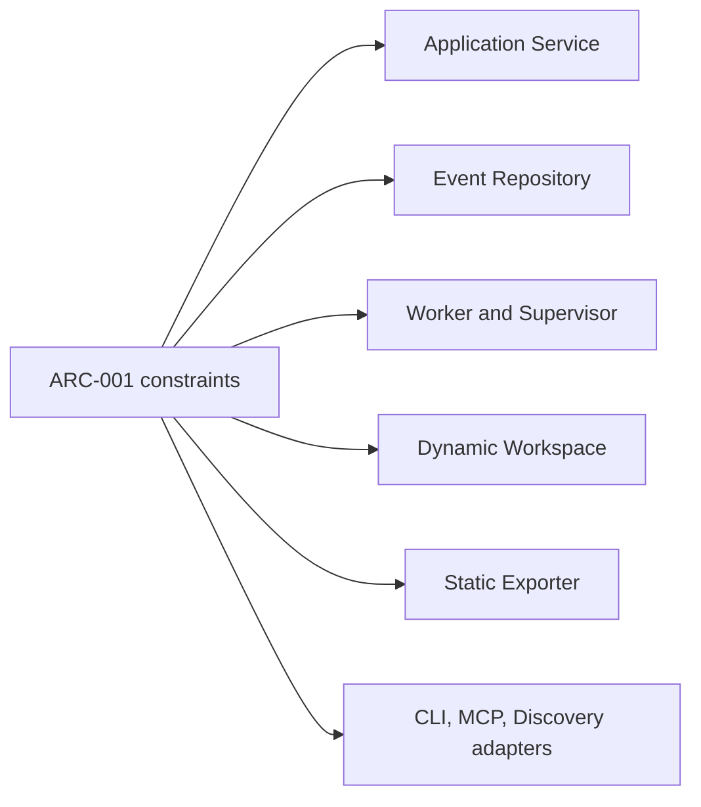
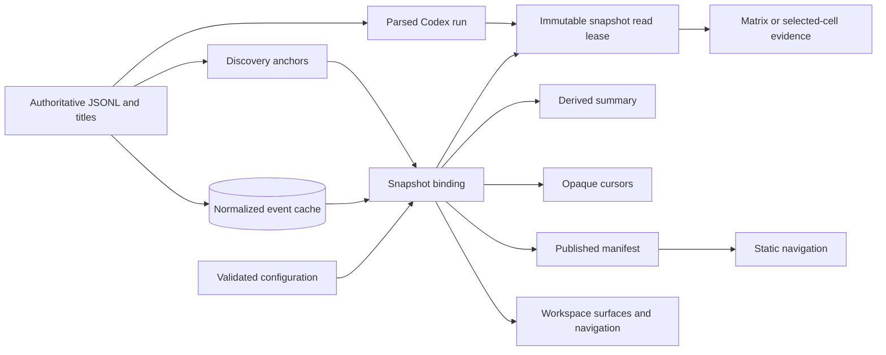
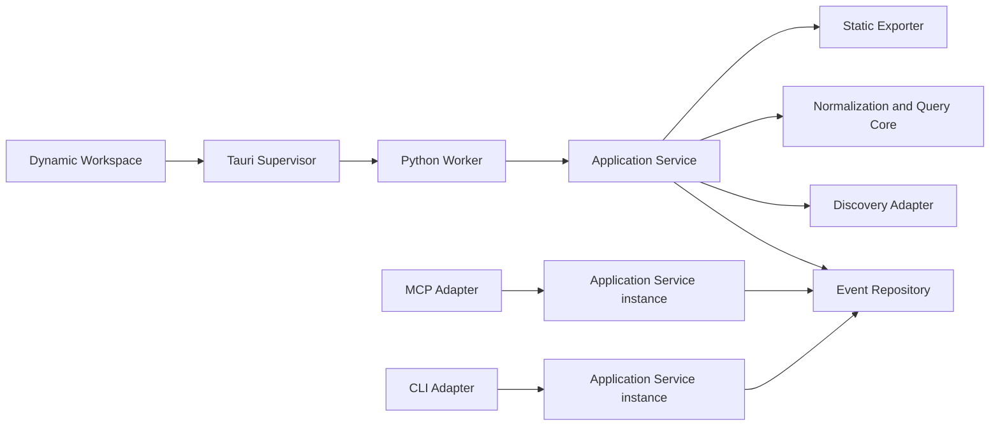
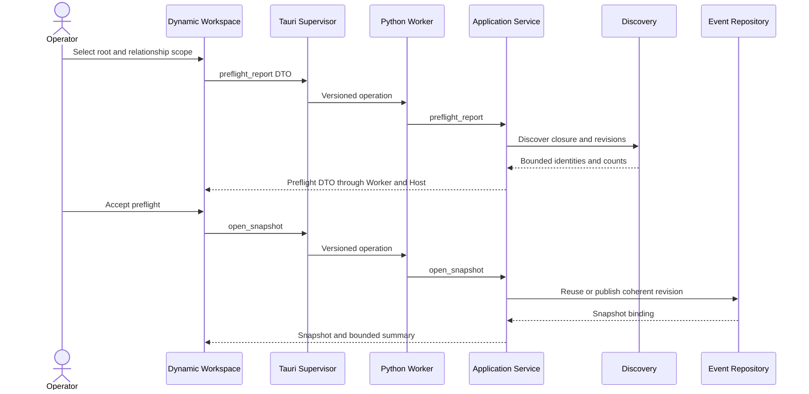
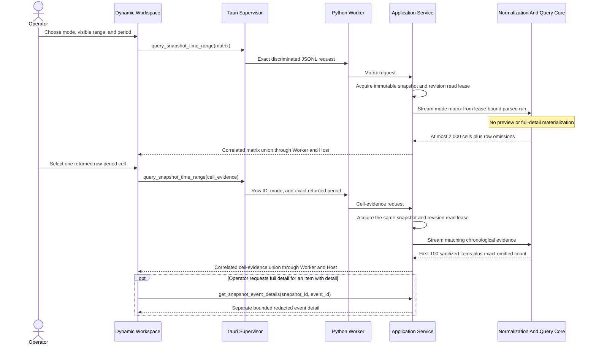
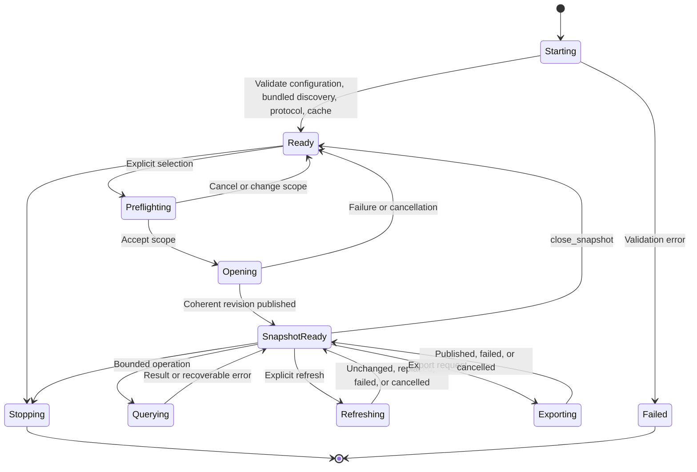
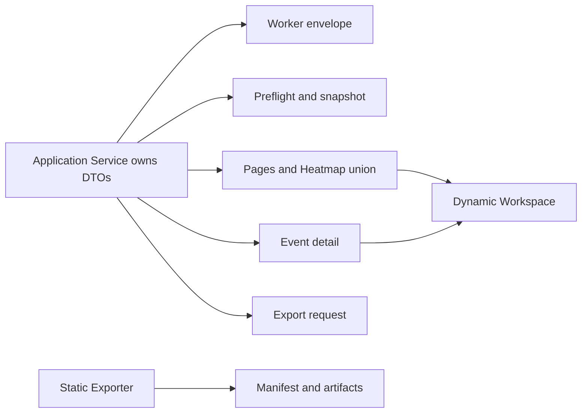
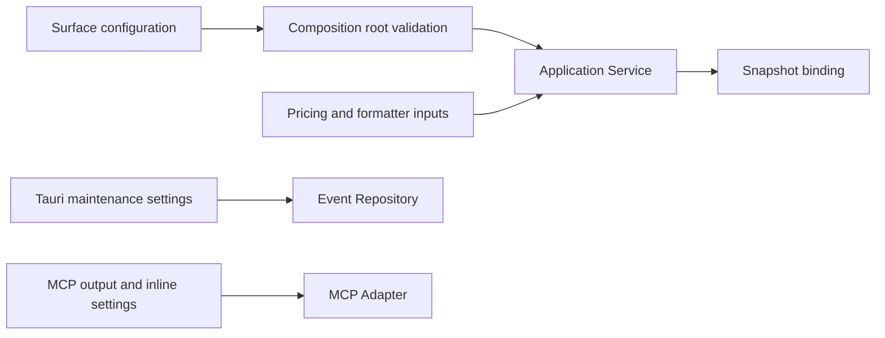
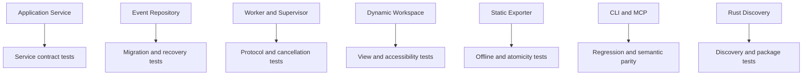

<!--
Copyright (c) 2026 Martin.Bechard@DevConsult.ca
Artifact-ID: 1227610a-2ca7-4157-8615-d6c60c9f0cad
Created-UTC: 2026-08-12T13:50:14Z
Creating-Agent: Dev Documentation Writer
Runtime: Codex
Dispatched-Model: gpt-5.6-sol
Reasoning-Effort: medium
Task-ID: /root/rewrite_arch_and_hld
Artifact-ID-Evidence: runtime-supplied
Created-UTC-Evidence: runtime-supplied
Creating-Agent-Evidence: runtime-supplied
Runtime-Evidence: runtime-supplied
Dispatched-Model-Evidence: runtime-supplied
Reasoning-Effort-Evidence: runtime-supplied
Task-ID-Evidence: runtime-supplied
-->

# Agent Report Dynamic Application And Static Export High-Level Design

## Current Understanding

This high-level design defines the Agent Report dynamic-analysis and static-export subsystem. The subsystem lets a local operator select a bounded Codex run scope, open a coherent snapshot, inspect evidence on demand, and publish offline reports.

The design describes intended behavior. Its mode is **PLANNED_DEVELOPMENT**. Current CLI, MCP, desktop catalog, discovery, normalization, and static rendering provide compatibility evidence. Planned modules reuse those semantics through one Python application-service boundary.

The first dynamic release is Codex-only and Tauri-only. CLI primarily automates reports. MCP primarily provides bounded drill-down and forensic investigation by an LLM. MCP is first-class, independently runnable, and does not require Tauri or static report generation. The classic interactive renderer remains the CLI default and continues to serve MCP `generate_report`. A separate streamlined exporter serves Tauri, explicit CLI `directory|summary` choices, and MCP `export_snapshot`.

## Authoritative Sources

### Design Mode And Source Inventory

| Source category permitted by PLANNED_DEVELOPMENT | Durable source | Use |
|---|---|---|
| Accepted functional specification | [FR-001](../../requirements/functional/FR-001-agent-report-dynamic-app-and-static-export.md) | Actor-visible outcomes, exact operations, errors, privacy, and acceptance scenarios |
| Accepted parent architecture | [ARC-001](../../architecture/ARC-001-agent-report-dynamic-app-and-static-export.md) | System boundary and ARC-01 through ARC-16 |
| Accepted decisions | Dev Architect reconciliation packet accepted for `/root/report_app_architecture`; Dev Architect Heatmap reconciliation accepted on 2026-08-13 | Component split, full Workspace semantics, generic Rust result transport, cryptographic operation IDs, structured diagnostics, native registries, lifecycle results, MCP surface, parsed-run Heatmap evidence, one discriminated snapshot query family, no cache migration, and implementation sequence |
| Backlog requirements | [Modularization future idea](../../future-ideas/modularize-report-tool-for-concurrent-maintenance.md) | Existing Python decomposition pressure |
| Project configuration | `tools/report/pyproject.toml`, `tools/report/Cargo.toml`, `tools/report/desktop/package.json`, `tools/report/desktop/src-tauri/Cargo.toml` | Runtime and build boundaries |
| Current source evidence | Committed `a8eef62` version of `tools/report/scripts/run-timeline.py`; `tools/report/src/agent_report/`, `tools/report/rust/`, `tools/report/desktop/` | Classic Heatmap semantic authority plus compatibility and reuse evidence; uncommitted renderer changes are not design evidence |
| Current test evidence | `tools/report/tests/`, `tools/report/rust/*/tests/`, `tools/report/desktop/src/contracts.test.ts`, `tools/report/desktop/src-tauri/tests/` | Implemented baseline only |
| Synchronized module-design set | CD-002 through CD-006 are maintained from this HLD and the same accepted reconciliation | Component designs elaborate owned internals; they are not authorities for each other or for this HLD |
| Procedures and runtime evidence | [Agent Report README](../../../tools/report/README.md); retained runtime evidence is not required for the planned contracts | Current use and validation commands |

FR-001 wins for actor-visible behavior. ARC-001 wins for system-wide constraints. This HLD wins for subsystem component ownership and interaction. Current code wins only for implemented-baseline claims. Component designs may elaborate internals but cannot change these boundaries.

## Related Code

The planned and existing code roots are shown in Constituent Components and Artifact-Placement Ledger. Existing source is compatibility evidence. A planned path does not imply that a file is implemented.

## Related Tests

Existing regression tests are listed in Verification. Planned test files are fixed in the artifact-placement ledger so component work can start without inventing test locations.

## Related Backlog Items

- [Modularize report tool for concurrent maintenance](../../future-ideas/modularize-report-tool-for-concurrent-maintenance.md)
- No separate accepted backlog item for this subsystem is identified.

## Related Wiki Pages

- [ARC-001](../../architecture/ARC-001-agent-report-dynamic-app-and-static-export.md)
- [FR-001](../../requirements/functional/FR-001-agent-report-dynamic-app-and-static-export.md)
- [CD-001](../components/CD-001-codex-rollout-metrics.md)

No project wiki page is identified.

## Open Questions

No open product questions are recorded for this subsystem.

## Accepted Product Decisions

| ID | Accepted decision | HLD effect |
|---|---|---|
| DEC-01 | Preserve the classic interactive renderer, CLI omitted-mode behavior, and exact MCP `generate_report` signature and defaults. Add one shared streamlined exporter for Tauri, explicit CLI `directory|summary` choices, and MCP `export_snapshot`. | Classic generation stays in `run-timeline.py` and the retained MCP adapter. Static Exporter owns only streamlined directory and summary. MCP investigation operations require no export. |
| DEC-02 | Cache default is configurable 5 GiB, exactly 5,368,709,120 bytes. Deterministic LRU evicts only closed, unprotected snapshots. Open/protected snapshots are never evicted. Sources and discovery cache are never deleted. Snapshots do not expire by age. Cursor retention is seven days. | Event Repository and Tauri maintenance implement the exact policy and diagnostics. |
| DEC-03 | The first dynamic release is Codex-only. | Dynamic Workspace and snapshot operations accept Codex inputs only. Existing non-Codex static adapters remain separate supported CLI backends. |
| DEC-04 | The dynamic workspace is Tauri-only. | No standalone-browser runtime or browser transport is planned. Static output remains `file://` compatible. |
| DEC-05 | Dynamic Heatmap reads the parsed Codex run held by the exact snapshot read lease. The normalized event-cache schema remains unchanged for this delivery. | The Application Service derives matrix and cell evidence from `_ReadHandle.run` while the immutable snapshot-and-revision lease is active. The Event Repository remains the binding, publication, list, and existing-detail authority; it is not a complete Heatmap semantic projection. |
| DEC-06 | Add one discriminated `query_snapshot_time_range` family with `matrix` and `cell_evidence` variants. Keep full event detail separate and retain MCP `query_time_range` unchanged. | All dynamic adapters share one operation name and exact request/result union. Matrix loading never includes evidence rows or full detail; selected-cell evidence is capped at 100 rows and full detail remains `get_snapshot_event_details`. |

## Maintenance Notes

Recheck this HLD when FR-001 operations, ARC-001 constraints, planned paths, report schemas, discovery protocol, privacy rules, pricing, formatter configuration, or compatibility policy changes. The latest source review is 2026-08-13.

## Requirements Coverage

| Requirement and claim mode | Required outcome and concrete interaction | Components and CR boundary | State or transition | Operation-specific error path | Status and verification |
|---|---|---|---|---|---|
| FR-001 FR-01; INTENDED_BEHAVIOR | The operator searches authorized roots with text and inclusive local date-hour filters, receives ordered virtual rows, selects one root, and chooses children and collaborators independently. | Dynamic Workspace, Tauri host, Discovery; CR-01, CR-06, CR-07; OP-01, OP-35, OP-36 | `Ready -> Searching -> Ready`; selection becomes the input to `Preflighting`. | Missing root, reversed range, discovery failure, or empty result preserves filters and permits correction. | DEFINED; `contracts.test.ts`, `catalog.rs`, `discovery.rs`, workspace tests |
| FR-001 FR-02; INTENDED_BEHAVIOR | `preflight_report` resolves the selected relationship closure, returns counts without mutation, and lets the operator continue, change scope, or cancel. Continue calls `open_snapshot`. | Application Service, Discovery, Event Repository; CR-03, CR-06, CR-07, CR-10; OP-16, OP-17 | `Ready -> Preflighting -> Ready|Opening -> SnapshotReady`; cancel creates no snapshot. | Stale preflight returns `REPORT_SCOPE_CONFLICT`, current revision/counts, and `preflight_required`; discovery or cancellation returns no snapshot. | DEFINED; service, discovery, repository, and worker tests |
| FR-001 FR-03; INTENDED_BEHAVIOR | The client gets the summary, changes views, pages agents/turns/events, requests Heatmap, sequence, and coordination data, and opens redacted detail lazily. | Application Service, Event Repository, Workspace; CR-08, CR-10, CR-13; OP-18 through OP-25 | `SnapshotReady -> Querying -> SnapshotReady`; every query holds one immutable snapshot-and-revision read lease and never replaces the snapshot. | Invalid page size returns `REPORT_INVALID_REQUEST`; stale cursor, row, period, or filter mismatch returns a validation or conflict error; missing event returns `REPORT_EVENT_NOT_FOUND`; an oversized Heatmap range uses the nearest supported coarser resolution and deterministic row omission. | DEFINED; service paging, query, detail, DTO, view, and accessibility tests |
| FR-001 HM-F01 through HM-F15 and JFP-HM-01 through JFP-HM-03; INTENDED_BEHAVIOR | Heatmap exposes exactly Wall time, Tokens, and Models. A matrix request returns only bounded mode-specific rows and cells. Selecting a cell requests at most 100 chronological evidence rows with an exact omitted count; full event detail remains separately lazy. Values distinguish measured, derived, partial, unavailable, and applicable zero. Unknown context capacity has an unavailable scale and N/A intensity. Visible keyboard controls supplement pointer interactions. | Application Service, Normalization And Query Core, Worker, Workspace, MCP Adapter; CR-02 through CR-04, CR-08, CR-10, CR-13; OP-22 and OP-25 | `SnapshotReady` enters either `QueryingMatrix` or `QueryingCellEvidence`, then returns to `SnapshotReady`; matrix and evidence results derive identity from the same immutable read lease and stale responses never replace current view state. | Invalid discriminator, mode, range, resolution, row identity, or cross-revision cell returns `REPORT_INVALID_REQUEST` or `REPORT_SNAPSHOT_CONFLICT`; cancellation returns no partial result; a result that cannot fit one worker record fails rather than truncates. | DEFINED; HM-F01 through HM-F15 service, worker, contract, Workspace, MCP, privacy, payload-bound, and browser verification |
| FR-001 FR-04; INTENDED_BEHAVIOR | The operator explicitly refreshes or cancels. The service asks the Worker to cancel; Tauri terminates its owned process tree only after the grace period. | Application Service, Worker, Supervisor, Event Repository; CR-02, CR-03, CR-09, CR-10; OP-26, OP-31 through OP-34 | `SnapshotReady -> Refreshing -> SnapshotReady`; shutdown goes to `Stopping`; last coherent revision remains visible. | Source conflict, parse failure, cancellation, or forced termination returns a structured terminal result and publishes no partial revision. | DEFINED; refresh, cooperative-cancel, forced-recovery, and last-coherent-state tests |
| FR-001 FR-05; INTENDED_BEHAVIOR | The shared streamlined exporter stages a complete directory or bounded summary for Tauri, explicit CLI streamlined export, and `export_snapshot`. It validates replace intent, publishes atomically, and enables reopen/navigation. | Application Service, Static Exporter, publication adapter; CR-04, CR-05, CR-11, CR-12, CR-15; OP-04, OP-05, OP-27, OP-28, OP-37 through OP-39 | `SnapshotReady -> Exporting -> SnapshotReady`; explicit CLI streamlined generation reaches the same exporter; only success updates export history. | Summary overflow records omissions; existing target requires replace; invalid mode fails validation; write/cancel failure leaves the prior target intact; invalid companion popup is rejected. | DEFINED; cross-surface directory/summary parity, offline browser, manifest, omission, staging, atomicity, navigation, and reopen tests |
| FR-001 FR-06 baseline; CURRENT_BEHAVIOR | Existing CLI selects thread/path, Codex or Junie catalog, Codex/Junie/methodology/prompt-runner/comparison/sealed input, validates exact mode/options, and publishes current formats with retained exits. | CLI and current adapters; CR-05; OP-05 through OP-12 | `Invoked -> Validating -> Processing -> Published|Failed`; one command lifetime. | `argparse` misuse exits nonzero; handled input/discovery/parse/render/write/seal errors exit 1; no failed replacement is published. | DEFINED; current CLI and renderer regression tests plus OP-05..OP-12 subcontracts |
| FR-001 FR-06 target; INTENDED_BEHAVIOR | CLI keeps classic interactive Codex HTML when report mode is omitted. Explicit `directory` or `summary` maps to the process-local Application Service and streamlined exporter. Separate non-Codex backends, compatible data formats, diagnostics, and exits remain. | CLI, classic renderer, and Application Service; CR-05, CR-06, CR-08, CR-11, CR-12; OP-05 through OP-12 and OP-16 through OP-28 where exposed | Classic and one-shot CLI backends keep one-command lifecycle; streamlined service operations use snapshot lifecycle internally. | Structured service errors map to retained CLI diagnostics/exits; classic regression and explicit-mode parity tests detect unintended drift. | DEFINED; classic renderer regression, streamlined directory/summary tests, non-Codex regression, and CLI packaging tests |
| FR-001 FR-07 baseline; CURRENT_BEHAVIOR | Independent MCP stdio retains `generate_report`, `query_time_range`, and `get_event_details` with exact selection, limits, inline/output, errors, and cancellation. | MCP Adapter; CR-04, CR-06, CR-08, CR-11, CR-12; OP-13 through OP-15 | Per-tool `Validating -> Processing -> Success|Error|Cancelled`; no Tauri state. | Ambiguity, invalid request, discovery, generation, write, cancellation, `REPORT_EVENT_NOT_FOUND`, and `REPORT_TOO_LARGE_FOR_MCP` remain machine-readable. | DEFINED; MCP configuration, report, query, detail, cancellation, and output-root tests |
| FR-001 FR-07 target; INTENDED_BEHAVIOR | MCP adds preflight, snapshot, bounded query/detail, refresh, streamlined snapshot export, and close through its own process-local Application Service. Retained `generate_report` keeps its exact signature, defaults, and classic bundle. Investigation operations never require generation. | MCP Adapter, classic renderer, and Application Service; CR-04, CR-06, CR-08, CR-10, CR-11, CR-12; OP-13 through OP-28 | Full `Ready -> Preflighting -> Opening -> SnapshotReady -> Querying|Refreshing|Exporting -> Ready` lifecycle without Tauri; querying can close without `Exporting`. | Adds scope conflict, stale cursor, snapshot conflict, validation, and cancellation errors; never discloses event-cache path. | DEFINED; retained-schema/classic regression, no-export investigation, snapshot-operation, streamlined export, and semantic-parity tests |
| FR-001 FR-08; CURRENT_BEHAVIOR and INTENDED_BEHAVIOR | Normalization labels measured, derived, inferred, unavailable, and estimated values; privacy filtering precedes cache, DTO, inline, and export disclosure. | Core, Event Repository, Application Service, Workspace, Exporter; CR-08 through CR-13 | Privacy validation occurs before every revision publication or response. | Ciphertext remains opaque; unsupported pricing becomes unavailable/partial; privacy failure blocks only the affected publication. | DEFINED; privacy, cost, provenance, ciphertext, cache-inspection, DTO, MCP-inline, and export tests |
| FR-001 FR-09; INTENDED_BEHAVIOR | Discovery metadata and normalized events remain separate; each snapshot binds exact revisions and versions; cache uses the accepted quota, deterministic LRU eligibility, protection, no-age-expiry, and seven-day cursor policy. | Discovery, Event Repository, Application Service, Supervisor; CR-06, CR-07, CR-09, CR-10; OP-41 | `Opening|Refreshing -> SnapshotReady` only after atomic commit; closed unprotected snapshots can become evicted; open/protected snapshots remain; corrupt/absent cache enters rebuild; newer schema enters `Failed`. | Corrupt cache rebuilds; newer schema is not overwritten; source change invalidates affected data; failure/cancel leaves prior revision; eviction never deletes source or discovery cache. | DEFINED; quota-boundary, deterministic-LRU, protection, no-age-expiry, seven-day-cursor, migration, rebuild, safe-purge, and cache-separation tests |
| FR-001 FR-10; INTENDED_BEHAVIOR | Workspace and static readers use stable navigation, keyboard controls, visible progress, non-color state, breadcrumbs, disclosures, source/report links, and bounded diagnostics. | Workspace, Tauri host, Worker progress, Exporter; CR-01, CR-02, CR-13 through CR-15; OP-31, OP-36 through OP-40 | Navigation changes active view without changing snapshot; progress ends in one terminal state; report windows remain local. | Missing source/report/log produces a recoverable unavailable result; unrelated popup target is rejected; frontend exception is logged without transcript content. | DEFINED; browser, accessibility, navigation, native-window, progress, and diagnostic tests |

### Exact Operation And Obligation Inventory

Each named operation remains independently traceable. `DEFINED` means this HLD assigns its component boundary; a component design still owns its internal signature.

| ID | Exact operation or obligation | Actor or trigger | Selector, predicate, or schedule | State, result, error, and side effect | Configuration and verification | Status and owner |
|---|---|---|---|---|---|---|
| OP-01 | Desktop catalog search | Operator | Roots, query, inclusive local date-hour range, children, collaborators, workers 1-64 | Bounded virtual rows and progress; updates metadata cache; structured validation errors | Desktop settings; contract, catalog, discovery tests | DEFINED; Dynamic Workspace and Discovery |
| OP-02 | Desktop catalog export | Operator | Current catalog result and output file | Escaped offline catalog; remembers output folder; write errors | Native save policy; Tauri tests | DEFINED; Tauri host |
| OP-03 | Desktop dynamic workspace open | Operator | Selected root and accepted scope | Opens one snapshot; no report HTML preload; validation, discovery, cancellation errors | Page 100 default, 500 maximum; workspace tests | DEFINED; Dynamic Workspace |
| OP-04 | Desktop Codex export | Operator | Snapshot or exact root, validated output target, `directory|summary` mode | Calls the shared streamlined exporter. It publishes the selected complete offline directory or bounded summary, with progress and cancellation. Tauri does not expose classic generation. | DEC-01; CR-01, CR-02, CR-11, CR-12; exporter and Tauri tests | DEFINED; Tauri adapter and Static Exporter |
| OP-05 | `agent-report` single report | CLI caller | Select exactly one path or `--codex-thread`. Retain output flags, JSON/CSV/Markdown roles, `--live` versus `--seal`, title overrides, formatter configuration, worker bounds, session roots, and independent Codex children/delegation scope. Accept optional explicit `directory|summary`. Relationship flags remain invalid for non-Codex input. | Omitted report mode keeps classic interactive Codex HTML and the sequence companion. Explicit `directory` or `summary` calls the streamlined exporter. Success exits 0. Input, discovery, parse, render, write, or seal failure exits 1. Argument/mode misuse prints `argparse` usage and exits nonzero. | FR-001 DEC-01, Operation Inventory and CLI examples; CR-05, CR-06, CR-08, CR-11, CR-12; classic CLI and explicit streamlined exporter tests | DEFINED; FR-06 baseline and additive target; CLI adapter |
| OP-06 | `agent-report --codex-catalog` | CLI caller | Retain inclusive UTC date or hour bounds, title and workspace filters, configured/catalog session roots, output, and `--generate-batch`. Catalog mode is mutually exclusive with a path, `--codex-thread`, and Junie catalog mode. `--generate-batch` requires a catalog mode. | Publishes one root-run Codex catalog and, when requested, linked per-run reports under its report directory. Success exits 0. Invalid mode combinations are `argparse` errors; discovery/render/write failures exit 1 without partial replacement. | FR-001 Operation Inventory and CLI Example B; CR-05, CR-06, CR-11, CR-12; renderer and Rust discovery tests | DEFINED; FR-06 baseline and target; CLI adapter |
| OP-07 | `agent-report --junie-catalog` | CLI caller | Retain inclusive UTC date or hour bounds, title and workspace filters, Junie catalog roots, output, and `--generate-batch`. It is distinct from Codex catalog and mutually exclusive with a path, `--codex-thread`, and Codex catalog mode. | Publishes a Junie root catalog and optional linked batch reports. Success exits 0. Mode conflict is an `argparse` error; input/render/write failures exit 1. | FR-001 Operation Inventory and CLI Example C; CR-05, CR-11, CR-12; renderer tests | DEFINED; FR-06 baseline; CLI compatibility adapter |
| OP-08 | Methodology workspace static input | CLI caller | Detect an existing methodology workspace path. Retain compatible title, formatter, worker, output, JSON, CSV, and Markdown options; reject Codex-only relationship or seal options. | Publishes the methodology timeline and requested companion formats. Missing path or handled adapter/render/write failure exits 1; invalid option family is an `argparse` error. | FR-001 CLI Operation-To-Example Map and Example E; CR-05, CR-11, CR-12; renderer tests | DEFINED; FR-06 baseline; CLI compatibility adapter |
| OP-09 | Prompt-runner directory static input | CLI caller | Detect an existing prompt-runner directory. Retain compatible title, formatter, worker, output, JSON, CSV, and Markdown options; reject Codex-only relationship or seal options. | Publishes the prompt-runner timeline and requested companion formats. Missing path or handled adapter/render/write failure exits 1; invalid option family is an `argparse` error. | FR-001 CLI Operation-To-Example Map and Example E; CR-05, CR-11, CR-12; renderer tests | DEFINED; FR-06 baseline; CLI compatibility adapter |
| OP-10 | Comparison manifest static input | CLI caller | Detect an existing comparison manifest. Retain compatible title, formatter, worker, output, JSON, CSV, and Markdown options; reject Codex-only relationship or seal options. | Publishes the comparison timeline and requested companion formats. Missing path or handled adapter/render/write failure exits 1; invalid option family is an `argparse` error. | FR-001 CLI Operation-To-Example Map and Example E; CR-05, CR-11, CR-12; renderer tests | DEFINED; FR-06 baseline; CLI compatibility adapter |
| OP-11 | Codex rollout or sealed Codex input | CLI caller | Accept a native rollout path with Codex identity or a sealed Codex JSON path. Retain live/seal behavior, source/session roots, relationship scope, output/companion and data formats, title, formatter, and worker options. | A native rollout publishes Codex and sequence reports. Missing Codex identity exits 1. A sealed report reproduces output only when its source digest validates; digest mismatch exits 1 and publishes no replacement. | FR-001 CLI Operation-To-Example Map, Examples A and F; CR-05, CR-06, CR-08, CR-11, CR-12; renderer/sealing tests | DEFINED; FR-06 baseline and target; CLI compatibility adapter |
| OP-12 | Native Junie session input | CLI caller | Accept an existing native Junie session with compatible title, formatter, worker, output, JSON, CSV, and Markdown options. Reject Codex-only relationship flags and sealing. | Publishes the Junie execution report and requested formats. `--seal` is a handled unsupported-operation failure with exit 1. Missing/input/render/write failure exits 1. | FR-001 CLI Operation-To-Example Map and Example D; CR-05, CR-11, CR-12; Junie renderer tests | DEFINED; FR-06 baseline; CLI compatibility adapter |
| OP-13 | MCP `generate_report` | MCP client | Keep the exact current parameters: optional `thread_id`; optional half-open `[from_time,to_time)` ISO selection; optional case-insensitive `name_contains`; `output_path`; `return_via_mcp=False`; and `return_format` in `html|markdown|json` with `html` default. Configured session roots constrain discovery. Relative output resolves against client workspace root, then configured workspace root, then server working directory; omitted output uses the configured default. | One match uses the classic renderer and writes the current HTML, JSON, turns CSV, work-unit CSV, and Markdown bundle. Inline content is complete or absent. No match, ambiguity, invalid request, discovery, generation, write, and oversize responses retain their structured fields, including `actual_bytes`, `maximum_bytes`, `written_files`, and warnings. Query/detail/snapshot operations do not call this operation. | FR-001 DEC-01, Operation Inventory, MCP examples/rules, oversize edge case; CR-04, CR-06, CR-08; exact FastMCP schema, selection, output, inline, classic-renderer, and error regression tests | DEFINED; FR-07 retained exact contract; MCP adapter and classic renderer |
| OP-14 | MCP `query_time_range` retained form | MCP client | Require exact non-empty `thread_id`; accept optional ISO `from_time` and `to_time`, exact `bucket_minutes` in `1|5|15|30|60`, exact measure in `wall_time|uncached_input_tokens|cached_input_tokens|output_tokens|reasoning_tokens|cost_usd`, and `include_events`. | Returns bucketed telemetry for the selected range. Included retained-operation events are capped at 1,000 and use deterministic opaque IDs. Invalid thread/range/bucket/measure is `REPORT_INVALID_REQUEST`; missing task is `REPORT_NOT_FOUND`; discovery or generation retains its structured code; cancellation is structured and publishes no file. | FR-001 Operation Inventory and MCP Rules; CR-04, CR-06, CR-08; MCP measure, bucket, event-cap, identity, and cancellation tests | DEFINED; FR-07 baseline and target; MCP adapter |
| OP-15 | MCP `get_event_details` retained form | MCP client | Require exact non-empty `thread_id` and event ID matching `evt_` plus 24 lowercase hexadecimal characters. The event identity is deterministic for the current selected evidence. | Returns one full privacy-safe current event. Invalid selector is `REPORT_INVALID_REQUEST`; absent or stale event is `REPORT_EVENT_NOT_FOUND`; task/discovery/generation/cancellation errors stay structured. It writes no report and discloses no event-cache path. | FR-001 Operation Inventory, MCP Rules, and event-disappears edge case; CR-04, CR-06, CR-08; MCP validation, not-found, privacy, and cancellation tests | DEFINED; FR-07 baseline and target; MCP adapter |
| OP-16 | `preflight_report` | Tauri, CLI service caller, or MCP | Root, children boolean, collaborators boolean | Counts closure, files, bytes, cache reuse, change set, known events; no snapshot mutation | Authorized roots; preflight tests | DEFINED; Application Service and Discovery |
| OP-17 | `open_snapshot` | Authorized caller | Accepted preflight binding | Opaque snapshot ID and coherent metadata; cache build or reuse; structured conflict/cancellation | Snapshot policy; service, repository, worker tests | DEFINED; Application Service |
| OP-18 | `get_summary` | Snapshot holder | Snapshot ID | Bounded overview, metrics, provenance, warnings; not-found/conflict errors | DTO limit; service and workspace tests | DEFINED; Application Service |
| OP-19 | `list_agents` | Snapshot holder | Snapshot; exact query/state filters; requested `last_activity_at|started_at|agent_id` sort with stable `agent_id` tie break; cursor; page 1-500 | Canonical page with exact revision, applied filter values, applied sort values, rows, and next cursor | Default 100; paging, sort, applied-metadata, and reload tests | DEFINED; Application Service |
| OP-20 | `list_turns` | Snapshot holder | Snapshot; exact agent/state filters; requested `started_at|ended_at|turn_id` sort with stable `turn_id` tie break; cursor; page 1-500 | Canonical page with exact revision and applied values | Default 100; paging, sort, applied-metadata, and reload tests | DEFINED; Application Service |
| OP-21 | `list_events` | Snapshot holder | Snapshot; exact agent/turn/kind/half-open-time filters; requested `occurred_at|event_id` sort with stable `event_id` tie break; cursor; page 1-500 | Canonical page with exact revision and applied values; rows can include a nullable snapshot-scoped opaque source key | Default 100; paging, sort, privacy, source-registry, and reload tests | DEFINED; Application Service |
| OP-22 | Additive `query_snapshot_time_range` discriminated family | Snapshot holder | Common selector is `snapshot_id`. `query_kind=matrix` adds a half-open visible range, a mode of `wall_time`, `tokens`, or `models`, a requested resolution of 1, 5, 15, 30, or 60 minutes, and `maximum_rows` from 1 through 200. `query_kind=cell_evidence` adds mode, opaque matrix-returned `row_id`, and the exact returned period start and end. No request accepts a generic measure, grouping, or caller-selected evidence limit. | `matrix` returns only the exact-revision mode matrix, at most 2,000 cells, actual resolution, deterministic row order and omission count, value evidence state, applicable-zero flag, and a discriminated scale. `cell_evidence` returns only the selected row-period value and at most 100 chronological sanitized evidence items with exact omission count. Both results derive `snapshot_id` and `revision_id` from the acquired read lease. Invalid variant fields, stale row/period identity, or correlation mismatch fails without partial data. | HM-F01 through HM-F15; exact-union, mode-row, interval-union, token/model, value-state, scale, coarsening, 2,000-cell, 100-evidence, privacy, cancellation, sub-1-MiB worker-record, MCP parity, and retained-tool isolation tests | DEFINED; Application Service; Worker and adapters preserve the same discriminated operation |
| OP-23 | `query_sequence` | Snapshot holder | Snapshot; focus agent; event kinds; `none|repeated_messages|delegation|agent` grouping; reasoning flag; chronological sort; cursor; page | Exact-revision canonical page plus group hierarchy, endpoints, repeat counts, reasoning availability, evidence, and event selectors | Query limits; hierarchy, grouping, sort, cursor, and sequence tests | DEFINED; Application Service |
| OP-24 | `query_coordination` | Snapshot holder | Snapshot; work-item, delegated-root, agent, operation, and evidence filters; chronological sort; cursor; page | Exact-revision canonical page with applied values and evidence-derived coordination rows; prose-derived decisions labeled inferred | Query limits; grouping, sort, applied-metadata, and provenance tests | DEFINED; Application Service |
| OP-25 | `get_event_details` snapshot form; MCP `get_snapshot_event_details` | Snapshot holder | Snapshot and deterministic event ID | Exact-revision lazy detail with title, optional summary, bounded structured disclosures, evidence, provenance, and nullable opaque source key; or not-found/conflict | Detail limit; privacy, source-registry, and MCP parity tests | DEFINED; Application Service |
| OP-26 | `refresh_snapshot` | Snapshot holder | Snapshot ID | Structured `{changed, snapshot}` with the exact applied revision; conflict, cancelled, or recoverable failure; no background trigger | Explicit action only; refresh/recovery and exact-shape tests | DEFINED; Application Service |
| OP-27 | `export_snapshot` summary | Snapshot holder | Snapshot, explicit summary mode, output target | Streamlined exporter publishes bounded summary with omission ledger; atomic publish or structured error | Size cap and cross-surface parity; export tests | DEFINED; Static Exporter |
| OP-28 | `export_snapshot` directory/default | Snapshot holder | Snapshot, omitted or explicit directory mode, target, optional SQLite archive | Streamlined exporter publishes complete offline directory and manifest atomically | DEC-01, offline startup, snapshot-export default; browser/export tests | DEFINED; Static Exporter |
| OP-30 | `close_snapshot` | Snapshot holder or shutdown | Snapshot ID | Structured `{snapshot_id, closed}`; releases live handles; retained cache remains policy-controlled | Lifetime policy; exact-shape and lifecycle tests | DEFINED; Application Service |
| OP-31 | Worker progress message | Worker | Operation ID, optional snapshot, phase, bounded counts | Ordered progress DTO; no state publication | Versioned protocol; worker tests | DEFINED; Worker |
| OP-32 | Worker success message | Worker | Operation ID | One terminal success envelope | Versioned protocol; worker tests | DEFINED; Worker |
| OP-33 | Worker error message | Worker | Operation ID and structured error | One terminal error; preserves coherent state | Versioned protocol; worker tests | DEFINED; Worker |
| OP-34 | Worker cancelled message | Worker | Operation and cancellation token | One terminal cancelled result; preserves coherent state | Grace policy; worker/supervisor tests | DEFINED; Worker and Supervisor |
| OP-35 | Local title lookup | Discovery | Exact discovered thread IDs | Saved title or prompt fallback; read-only `state_5.sqlite` | Codex roots; Rust tests | DEFINED; Discovery |
| OP-36 | Open source location | Operator | Authorized existing rollout path | Native open or rejection; no webview path authority | Tauri capability; native tests | DEFINED; Tauri host |
| OP-37 | Open report window | Operator | Existing published HTML | Separate native report window or rejection | Tauri capability; native tests | DEFINED; Tauri host |
| OP-38 | Open sequence companion | Static report reader | Matching existing same-folder companion only | Opens companion or rejects unrelated popup | Window policy; native/static tests | DEFINED; Tauri host and Static Exporter |
| OP-39 | Reopen last export | Operator | Persisted existing output path | Opens artifact or reports missing path | Desktop settings; native tests | DEFINED; Tauri host |
| OP-40 | Open diagnostic log | Operator | Current app log action | Opens current bounded JSONL diagnostic log | 5 MiB rotation and one previous file; native tests | DEFINED; Tauri host |
| OP-41 | Cache maintenance | Operator or quota enforcement | Configurable quota default 5,368,709,120 bytes; deterministic last-use ordering; only closed unprotected snapshots eligible; no age predicate; cursor retention seven days | Evicts least-recently-used eligible snapshots until within quota. Never evicts open/protected snapshots or deletes source logs/discovery cache. Reports protected over-quota state without unsafe eviction. | DEC-02; exact-byte, deterministic-order, protection, no-age-expiry, seven-day-cursor, repository/native tests | DEFINED; Tauri host and Event Repository |
| OP-42 | Bundled discovery startup validation | Every service startup | Bundled engine path and protocol version | Ready or startup failure; never downloads or compiles | Package config; wheel and sidecar tests | DEFINED; composition roots |
| OP-43 | MCP snapshot-tool registration | MCP server startup | Register `preflight_report`, `open_snapshot`, `get_summary`, `list_agents`, `list_turns`, `list_events`, `query_snapshot_time_range`, `query_sequence`, `query_coordination`, `get_snapshot_event_details`, `refresh_snapshot`, `export_snapshot`, and `close_snapshot` beside retained tools | Each tool maps to the shared service and returns its structured result/error. Retained `generate_report`, `query_time_range`, and `get_event_details` schemas and defaults remain unchanged. | MCP schema snapshots, name inventory, no-export forensic flow, retained-schema tests, and snapshot-export tests | DEFINED; MCP Adapter and Application Service |

## Parent Architecture

[ARC-001](../../architecture/ARC-001-agent-report-dynamic-app-and-static-export.md) governs this subsystem. The HLD inherits all sixteen constraints without narrowing their force.

| Parent ID | HLD enforcement point |
|---|---|
| ARC-01 | Worker stdio and per-process service composition; no HTTP component |
| ARC-02 | Dynamic Workspace plus independent MCP and CLI adapters |
| ARC-03 | Application Service and parity gates |
| ARC-04 | Discovery adapter and Python normalization/query core |
| ARC-05 | Tauri Supervisor and native commands |
| ARC-06 | Workspace DTO contracts and native validation |
| ARC-07 | Discovery and normalization source adapters |
| ARC-08 | Event Repository separate from Rust discovery repository |
| ARC-09 | Snapshot anchors and service contracts |
| ARC-10 | Explicit `refresh_snapshot`; no scheduled refresh operation |
| ARC-11 | Separate classic-renderer compatibility plus shared streamlined directory and summary export |
| ARC-12 | Static directory contract and offline tests |
| ARC-13 | CLI/MCP compatibility operation rows |
| ARC-14 | Event Repository, Worker, Supervisor, and Exporter atomicity |
| ARC-15 | Normalized shapes, provenance, and privacy tests |
| ARC-16 | Composition-root startup validation and package tests |



## Scope

The subsystem includes run selection integration, explicit relationship scope, preflight, snapshot lifecycle, bounded queries, dynamic views, privacy-safe detail, explicit refresh, cancellation, recovery, static publication, compatibility adapters, navigation, diagnostics, and cache maintenance.

Remote service operation, source mutation, multi-user tenancy, automatic watching, standalone-browser transport, first-release dynamic non-Codex adapters, and internal module algorithms are outside the HLD. Current classic Codex generation and non-Codex static adapters remain supported.

## Data Anchors

| Anchor | Type | Authority | Owner and representation | Constraint for component designs |
|---|---|---|---|---|
| Selected root and relationship scope | Selector | FR-001 FR-01/FR-02; ARC-02 | Application Service receives root, children, collaborators | Root-only default; children and collaborators stay independent. |
| Codex JSONL source revision set | Read-only source | ARC-07, ARC-09 | Discovery fingerprints; Worker reads accepted paths | A snapshot binds exact revisions and never mutates them. |
| Saved title lookup | Read-only metadata | ARC-07 | Rust Discovery reads `state_5.sqlite` | Read-only exact-ID lookup; prompt fallback remains distinguishable. |
| Discovery metadata cache | Persisted derived data | ARC-08 | Rust Discovery owns `rollout-discovery-v2.sqlite3` | Metadata-only; no transcript content. |
| Normalized event cache | Persisted derived data | ARC-08; DEC-02 | Event Repository owns `report-events-v1.sqlite3`, byte accounting, last-use ordering, open/closed state, and protection state | Configurable default quota is 5,368,709,120 bytes. Deterministic LRU evicts only closed unprotected snapshots. No age expiration exists. Never delete sources or discovery cache. |
| Snapshot binding and parsed-run read lease | Transient and persisted identity plus process-local semantic evidence | ARC-09; DEC-05 | Application Service owns the opaque public snapshot ID and immutable revision binding. The repository read handle carries the matching process-local parsed Codex run as `_ReadHandle.run`. | Bind source revisions, scope, parser/pricing/formatter versions, observation time, live/sealed state, and parsed run for the active lease. Query results derive public snapshot and revision identity from that lease, never from mutable pending-handle state or a latest-run lookup. Refresh swaps the complete binding only after publication and active leases drain; close releases it. A process restart reparses authoritative source instead of restoring the parsed run from SQLite. |
| Opaque cursor | Transient query identity | FR-001 FR-03; DEC-02 | Application Service issues it; Event Repository retains the cursor record for seven days | Bind to snapshot, operation, filters, sort, and continuation. Seven-day retention does not override snapshot invalidation. Encoding bytes stay in component design. |
| Bounded summary | Derived DTO | FR-001 FR-03 | Application Service derives it from snapshot data | Replace on refresh; never append across revisions. |
| Heatmap parsed-run evidence | Process-local derived evidence | FR-001 HM-F01 through HM-F15; DEC-05 | The Normalization And Query Core exposes one shared pure semantic helper over the read-lease-bound parsed run. Application Service streams matrix aggregation or one selected-cell evidence ledger from that helper. | The schema-v1 normalized event cache is a privacy-bounded list/detail and lifecycle projection, not complete Heatmap semantic authority. Missing cache fields are never interpreted as zero or unavailable. Matrix processing materializes no preview or event detail, holds no second full-run copy, and stays bounded by 2,000 cells. Cell evidence retains only the first 100 chronological sanitized items while counting all omitted matches. |
| Heatmap query family | Derived DTO union | FR-001 HM-F01 through HM-F15; DEC-06 | Application Service owns the `matrix` and `cell_evidence` request/result variants and exact correlation fields. Worker, Tauri, TypeScript, and MCP project the same family without semantic aggregation. | Recompute within one read lease. Matrix and cell-evidence variants are mutually exclusive. Full event detail remains a separate operation. Every encoded terminal worker result is less than 1,048,576 bytes and is never truncated. |
| Worker operation envelope | Process contract | ARC-03, ARC-14 | Worker and Supervisor exchange versioned JSONL | Each non-handshake operation ID contains 96 cryptographically secure random bits encoded as `op_` plus 24 lowercase hexadecimal characters. Progress is bounded. One terminal result follows. Python validates operation-specific service results; Rust transports the result as a generic bounded JSON object. Every complete record is less than the 1,048,576-byte protocol limit. |
| Export manifest | Published contract | FR-001 FR-05; ARC-11 | Static Exporter writes it | Identify snapshot, scope, omissions, files, versions, and integrity data at design level. Exact fields stay in CD-006. |
| Diagnostic log | File/log | FR-001 FR-10 | Tauri owns bounded JSONL logs | No intentional transcript bodies; rotate at 5 MiB with one previous file. |
| Authorized source roots | Configuration | FR-001 FR-01/FR-07; ARC-05, ARC-07 | Tauri settings, CLI flags, or MCP configured session roots supply an ordered set; each composition root validates existence and authority | Discovery and source readers consume only validated roots for the process lifetime. A changed root set requires a new preflight and snapshot. |
| Output authority | Configuration | FR-001 FR-05/FR-07; ARC-05, ARC-14 | Tauri native save selection, CLI output target, or MCP `output_path` under server output/workspace-root precedence | Static Exporter consumes a validated absolute target per request. A target change does not change snapshot identity. Publication remains staged and atomic. |
| MCP timezone and inline limit | Configuration | FR-001 FR-07 MCP Rules | MCP server owns validated startup values for selection timezone and `maximum_bytes` | `generate_report` consumes them for its process lifetime. Invalid startup configuration prevents MCP readiness; inline output is complete or returns actual/max bytes. |
| Pricing and formatter versions | Configuration and snapshot identity | FR-001 FR-08; ARC-09, ARC-15 | Pricing JSON and formatter configuration resolve to version or digest values in the Application Service composition root | Normalization, snapshots, summaries, queries, and exports reuse the same bound values. A change requires explicit refresh or a new snapshot. |
| Worker protocol version | Configuration and process contract | ARC-03, ARC-16 | Supervisor and Worker expose one supported protocol version in every envelope and startup handshake | Both sides validate before work. A mismatch prevents readiness and never triggers download or compilation. |
| Workspace surface identity | UI surface | FR-001 FR-03/FR-10 UI Layout Contract | Dynamic Workspace owns stable surface IDs `summary`, `coordination`, `heatmap`, `timeline`, `sequence`, `agents`, `turns`, `tools`, `model`, `context`, `inference`, `runtime-waits`, `work-items-claims`, `detail`, `provenance`, and `diagnostics` | Navigation consumers map one surface ID to one bounded operation set. Changing views preserves the active snapshot, scope, filters that belong to the view, and keyboard focus context. |
| Workspace navigation state | Transient UI state | FR-001 FR-03/FR-10 Workflows and UI Layout Contract | Dynamic Workspace owns active surface, snapshot ID, selected scope, per-view filters/cursor, selected event, and narrow-layout disclosure state in memory | State lasts for the open workspace. Refresh clears stale cursors and selected detail but preserves scope and active surface when valid. It is not persisted in the event cache. |
| Source registry | Private native capability state | ARC-05, ARC-06; OP-36 | Tauri builds a snapshot-scoped `source_key -> authorized native path` registry from the accepted discovery closure and a webview-facing `sourceRef -> source_key` capability map | The service returns only nullable opaque `source_key`. Rust transports that value generically. The command adapter projects it to `sourceRef`; `open_source_location(snapshotId, sourceRef)` resolves only through both private maps. The webview never receives the path. Close or revision replacement invalidates obsolete entries. |
| Export registry | Private native capability state | ARC-05, ARC-14; OP-39 | Tauri owns `exportId -> published native path` after successful publication | Native service result contains the authorized target for Tauri mapping. The command adapter returns only `exportId`, bounded display name, mode, counts, warnings, and omissions to the webview. CLI and MCP can return paths under their own path authority. |
| Static navigation identity | Published UI surface | FR-001 FR-05/FR-10 Static Directory Contract | Static Exporter owns relative index, page, breadcrumb, and matching `-sequence` companion links in the export manifest | Static readers consume relative links under `file://`. Missing or omitted evidence remains explicit; no startup network request or unrelated popup is allowed. |



## Constituent Components

| Component | Responsibility | Module design |
|---|---|---|
| Application Service | Own exact operations, scope, snapshots, immutable read leases, limits, structured errors, Heatmap query/result unions, and semantic parity. | Planned: `docs/design/components/CD-002-agent-report-application-service.md` |
| Event Repository | Own the schema-v1 normalized cache, invalidation, snapshot persistence, atomic revision publication, existing list/detail projections, and lifecycle binding. It does not aggregate Heatmap or require a Heatmap migration. | Planned: `docs/design/components/CD-003-agent-report-normalized-event-cache.md` |
| Python Worker | Adapt versioned stdio operations to one Application Service instance, validate the exact Heatmap union, and keep every complete JSONL record below 1,048,576 bytes. | Planned: `docs/design/components/CD-004-agent-report-worker-protocol.md` |
| Tauri Supervisor | Own worker process, native cancellation escalation, protocol validation, and recovery. | Planned: `docs/design/components/CD-004-agent-report-worker-protocol.md` |
| Dynamic Workspace | Render bounded summary, coordination, three-mode Heatmap matrix and synchronized selected-cell evidence, timeline, sequence, agent, turn, tool, model, context, inference, runtime, wait, work-item, claim, detail, provenance, and diagnostic views. It owns Heatmap navigation and accessibility, not aggregation. | Planned: `docs/design/components/CD-005-agent-report-dynamic-workspace.md` |
| Classic Interactive Renderer | Keep the current rich Codex HTML, separate sequence companion, current CLI default, and MCP `generate_report` bundle. | Existing `tools/report/scripts/run-timeline.py`; current renderer tests |
| Static Exporter | Provide one streamlined Codex export function for Tauri, explicit CLI `directory|summary` choices, and MCP `export_snapshot`. | Planned: `docs/design/components/CD-006-agent-report-static-export.md` |
| MCP Adapter | Retain existing MCP tools unchanged and expose the additive discriminated `query_snapshot_time_range` family without Tauri. | HLD-003 and existing MCP source are sufficient until scope changes. |
| CLI Adapter | Retain exact input backends, formats, validation, and exit behavior. | HLD-003 and existing CLI source are sufficient until scope changes. |
| Discovery Adapter | Use the existing bundled Rust engine as the sole Codex discovery implementation. | [CD-001](../components/CD-001-codex-rollout-metrics.md) and ARC-001 |
| Normalization And Query Core | Reuse the committed classic Python Heatmap semantics through one pure parsed-run helper shared by matrix and selected-cell evidence. Stream rows and counters without eager preview generation or a second full-run payload. | [CD-001](../components/CD-001-codex-rollout-metrics.md) and CD-002 |

### Exact Planned Placement

```text
docs/design/components/
├── CD-002-agent-report-application-service.md
├── CD-003-agent-report-normalized-event-cache.md
├── CD-004-agent-report-worker-protocol.md
├── CD-005-agent-report-dynamic-workspace.md
└── CD-006-agent-report-static-export.md
tools/report/
├── desktop/
│   ├── index.html
│   ├── src/
│   │   ├── contracts.ts
│   │   ├── main.ts
│   │   ├── report-workspace.test.ts
│   │   ├── report-workspace.ts
│   │   └── styles.css
│   └── src-tauri/
│       ├── src/report_worker.rs
│       └── tests/report_worker.rs
├── scripts/run-timeline.py
├── src/agent_report/
│   ├── application_service.py
│   ├── cli.py
│   ├── event_cache.py
│   ├── mcp_report.py
│   ├── mcp_server.py
│   ├── report_worker.py
│   └── static_export.py
└── tests/
    ├── test_application_service.py
    ├── test_event_cache.py
    ├── test_mcp_report.py
    ├── test_mcp_server.py
    ├── test_report_worker.py
    ├── test_run_timeline.py
    └── test_static_export.py
```

Python modules use package names `agent_report.application_service`, `agent_report.event_cache`, `agent_report.report_worker`, and `agent_report.static_export`. The Tauri supervisor uses module `agent_report_desktop::report_worker`. The workspace is a TypeScript module rooted at `tools/report/desktop/src/report-workspace.ts`.

### Justified HLD Placement Propositions

The accepted Dev Architect packet supplies each placement family below. These records make the leaf choices inspectable without transferring internal component design into this HLD. Dev Architect owns and may revise each technical placement decision. Dev Documentation Writer owns its accurate recording.

| Proposition | Planned placement family | Basis | Necessity | Decision owner |
|---|---|---|---|---|
| HLP-01 | Application Service source, test, namespace, and CD-002 paths | ARC-03 assigns shared Python semantics per process. The existing `agent_report` package already owns CLI and MCP report behavior. | One package-level service location prevents Tauri, CLI, and MCP from creating divergent semantic cores and gives its tests and design one owner. | Dev Architect; accepted packet for `/root/report_app_architecture` |
| HLP-02 | Event Repository source, test, runtime cache, and CD-003 paths | ARC-08 requires a separate Python-owned privacy-bounded event cache and keeps the Rust discovery cache metadata-only. | A dedicated `agent_report.event_cache` module and test surface separate schema, invalidation, migration, purge, and atomic publication from discovery and presentation. | Dev Architect; accepted packet for `/root/report_app_architecture` |
| HLP-03 | Python Worker, Tauri Supervisor, their mirrored tests, and shared CD-004 path | ARC-03, ARC-05, and ARC-14 split application semantics from native process and forced-cancellation authority. | Separate Python and Rust modules make the stdio producer/consumer contract and process ownership testable while one shared design prevents incompatible protocol assumptions. | Dev Architect; accepted packet for `/root/report_app_architecture` |
| HLP-04 | Dynamic Workspace source, test, integration surfaces, and CD-005 path | ARC-02 and ARC-06 make Tauri the primary dynamic Codex UI and limit the webview to bounded sanitized DTOs. | A dedicated TypeScript workspace module isolates dynamic view state from current catalog/controller code while retaining `contracts.ts`, `main.ts`, `index.html`, and `styles.css` as integration points. | Dev Architect; accepted packet for `/root/report_app_architecture` |
| HLP-05 | Static Exporter source, test, namespace, and CD-006 paths | ARC-11 through ARC-14 and DEC-01 require one cross-surface streamlined export function, two modes, offline startup constraints, classic renderer separation, retained MCP identity, and atomic publication. | A dedicated Python exporter prevents Tauri, explicit CLI streamlined export, and MCP snapshot export from inventing different file layouts or staging rules. It does not replace the classic renderer. | Dev Architect plus accepted product decision |
| HLP-06 | Existing MCP, CLI, discovery, and normalization paths | ARC-02, ARC-04, and ARC-13 retain independent MCP/CLI entry points, Rust-only discovery, and current Python semantics. FR-001 HM-F01 through HM-F15 require classic Heatmap parity, bounded lazy evidence, and retained MCP isolation. | Reusing `_ReadHandle.run` and one shared pure semantic helper is the smallest viable Heatmap approach. It avoids parallel adapters, a second discovery engine, duplicated aggregation, eager preview payloads, and an event-cache schema migration. A separate cell-evidence operation would duplicate the same lease, selectors, transport, and error handling without a distinct authority or lifecycle. | Dev Architect; accepted Heatmap reconciliation |



## Artifact-Placement Ledger

| Short label | Exact path and namespace | Kind and owner | Verification |
|---|---|---|---|
| Service source | `tools/report/src/agent_report/application_service.py`; `agent_report.application_service` | Planned source; Application Service | `tools/report/tests/test_application_service.py` |
| Service design | `docs/design/components/CD-002-agent-report-application-service.md` | Planned component design | Architecture and HLD review |
| Repository source | `tools/report/src/agent_report/event_cache.py`; `agent_report.event_cache` | Planned source plus embedded migration resources; Event Repository | `tools/report/tests/test_event_cache.py` |
| Repository design | `docs/design/components/CD-003-agent-report-normalized-event-cache.md` | Planned component design | Architecture and HLD review |
| Worker source | `tools/report/src/agent_report/report_worker.py`; `agent_report.report_worker` | Planned source; Python Worker | `tools/report/tests/test_report_worker.py` |
| Supervisor source | `tools/report/desktop/src-tauri/src/report_worker.rs`; `agent_report_desktop::report_worker` | Planned source; Tauri Supervisor | `tools/report/desktop/src-tauri/tests/report_worker.rs` |
| Worker design | `docs/design/components/CD-004-agent-report-worker-protocol.md` | Planned shared design | Protocol and supervisor review |
| Workspace source | `tools/report/desktop/src/report-workspace.ts` | Planned source; Dynamic Workspace | `tools/report/desktop/src/report-workspace.test.ts` |
| Workspace integration | `tools/report/desktop/src/contracts.ts`, `tools/report/desktop/src/main.ts`, `tools/report/desktop/index.html`, `tools/report/desktop/src/styles.css` | Existing integration surfaces | Existing plus workspace tests |
| Workspace design | `docs/design/components/CD-005-agent-report-dynamic-workspace.md` | Planned component design | UI and accessibility review |
| Export source | `tools/report/src/agent_report/static_export.py`; `agent_report.static_export` | Planned source; Static Exporter | `tools/report/tests/test_static_export.py` |
| Export design | `docs/design/components/CD-006-agent-report-static-export.md` | Planned component design | Offline and publication review |
| MCP source | `tools/report/src/agent_report/mcp_report.py`, `tools/report/src/agent_report/mcp_server.py` | Existing adapter | `tools/report/tests/test_mcp_report.py`, `tools/report/tests/test_mcp_server.py` |
| CLI source | `tools/report/src/agent_report/cli.py`, `tools/report/scripts/run-timeline.py` | Existing adapter and compatibility core | `tools/report/tests/test_cli.py`, `tools/report/tests/test_run_timeline.py` |
| Discovery source | `tools/report/rust/agent-report-core/src/lib.rs`, `tools/report/rust/agent-report-cli/src/main.rs` | Existing Rust discovery | Existing Rust tests |
| Runtime event cache | `~/.codex/agent-report/report-events-v1.sqlite3` | Derived runtime data; Event Repository | Cache inspection and recovery tests |
| Runtime discovery cache | `~/.codex/agent-report/rollout-discovery-v2.sqlite3` | Derived metadata; Discovery | Metadata-only inspection |

No separate migration folder is planned. `event_cache.py` owns schema resources until CD-003 selects a different accepted location. CD-003 owns internal table names and migration SQL. Dynamic Heatmap does not change the schema version, add migration SQL, or backfill cached events; any future persisted Heatmap projection requires a separate evidence-backed architecture decision.

## Boundary-Edge Inventory

| Edge ID | Producer to consumer | Contract and trust significance | Reconciled row | Trust row |
|---|---|---|---|---|
| BE-01 | Workspace to Tauri Supervisor | Bounded command DTO across webview/native boundary | CR-01 | TB-01 |
| BE-02 | Tauri Supervisor to Python Worker | Versioned JSONL operation and process control | CR-02 | TB-02 |
| BE-03 | Python Worker to Application Service | Per-process service invocation | CR-03 | TB-03 |
| BE-04 | MCP Adapter to Application Service | Independent stdio client authority | CR-04 | TB-04 |
| BE-05 | CLI Adapter to Application Service | CLI validation and exit mapping | CR-05 | TB-05 |
| BE-06 | Application Service to Discovery | Caller-bounded discovery request and fingerprint result | CR-06 | TB-06 |
| BE-07 | Discovery to Codex stores | Read-only JSONL and title metadata access | CR-07 | TB-07 |
| BE-08 | Application Service to Normalization And Query Core | Accepted sources and snapshot configuration; read-lease-bound parsed-run Heatmap query | CR-08 | TB-08 |
| BE-09 | Normalization Core to Event Repository | Sanitized normalized revision publication | CR-09 | TB-09 |
| BE-10 | Application Service to Event Repository | Snapshot binding, schema-v1 list/detail query, invalidation, and maintenance contract; no Heatmap aggregation | CR-10 | TB-10 |
| BE-11 | Application Service to Static Exporter | Coherent snapshot model and output request | CR-11 | TB-11 |
| BE-12 | Static Exporter to Tauri or MCP publication adapter | Staged artifact publication | CR-12 | TB-12 |
| BE-13 | Application Service to Workspace | Bounded sanitized response DTO, including the exact Heatmap matrix or cell-evidence union | CR-13 | TB-13 |
| BE-14 | Tauri diagnostics to Operator | Bounded diagnostic file open | CR-14 | TB-14 |
| BE-15 | Static report to matching companion | Relative same-folder navigation | CR-15 | TB-15 |

## Interaction Model



MCP and CLI omit the Workspace and Tauri hops. Each adapter invokes its own Application Service instance. Every query uses the same operation contract and snapshot semantics.

Heatmap uses one operation family and two deliberately separate loads:



The Service releases each read lease after the complete result or terminal error. Refresh publishes a replacement binding atomically and retires the prior parsed run only after active leases drain. Workspace accepts a Heatmap result only when its snapshot ID, revision, query kind, mode, row identity when applicable, and requested range still match current state. Double-click or the visible Drill down control issues a finer `matrix` request; selecting a cell issues `cell_evidence`; these actions never cause one variant to carry the other variant's payload.

## Critical Trust And Identity Boundaries

Agent Report has no application account, remote tenancy, or administrator role. The authenticated identity is the local operating-system user or the MCP/CLI process running under that user. Denied actors remain explicit below.

| ID and boundary | Actor and authentication source | Role and protected asset | Authorization | Ownership, tenancy, and filtering | Selector and mismatch | Disclosure and sensitive-data rule | Validation and state owner | Async, cancellation, and error timing |
|---|---|---|---|---|---|---|---|---|
| TB-01 / Webview commands | Local operator; OS-user Tauri process | Operator; native paths, processes, windows, snapshots | Tauri capability plus validated roots/snapshot | Tauri owns native assets; Workspace owns UI state; tenancy N/A; bounded DTO filter | Exact command/selector; unknown, invalid, or stale input rejects before work | No raw rollout, cache path, or unrestricted path; redact sensitive detail | Tauri validates boundary; Service owns report state; Workspace owns pending/result/error | Async command; cancel by operation ID; validation error precedes side effect. See CR-01. |
| TB-02 / Worker supervision | Tauri host under OS user | Service supervisor; owned worker process and forced cancellation | Only the host-spawned process tree | Supervisor owns process; Worker owns operation; tenancy N/A; protocol/config filters | Protocol/version/operation/process handle; mismatch is terminal protocol error | Protocol stdout and bounded diagnostics only | Supervisor validates framing and owns process state; Worker owns operation state | Async stdio; cooperative cancel then forced termination after grace. See CR-02. |
| TB-03 / Worker to service | Background worker; same OS identity and process | Service adapter; snapshot/cache operations | Configured operation set and validated request | Service owns report state; Worker owns transport; tenancy N/A; scope filters | Versioned operation/snapshot; invalid/stale selector is structured error | Sanitized application values only | Service validates and owns state transition | In-process call; cancellation token; one terminal result. See CR-03. |
| TB-04 / MCP operations | MCP client over configured stdio; server OS identity | MCP caller; sources, outputs, inline content, snapshots | Configured session/output roots and tool schema | Server owns config; Service owns snapshots; tenancy N/A; root/scope filters | Exact retained/snapshot tool selectors; ambiguity, invalid, stale, or not-found is explicit | Complete bounded inline or oversize metadata; no cache path, truncation, or unredacted event | Adapter validates config; Service validates semantics and owns state | Async tool; structured cancellation/errors; no Tauri dependency. See CR-04. |
| TB-05 / CLI operations | Shell caller under OS user | CLI caller; selected sources and outputs | Flags plus OS filesystem permissions | CLI owns invocation; Service owns report state; tenancy N/A; backend/root filters | Exact backend/mode/options; misuse is `argparse`, handled mismatch exits 1 | Retained report/privacy output; no implicit cache disclosure | CLI validates mode; Service validates operation; publisher validates target | One command lifetime; errors precede exit; cancel maps to retained behavior. See CR-05. |
| TB-06 / Discovery request | Application Service under OS user | Discovery client; local store enumeration | Validated caller-bounded roots | Service owns scope; Discovery owns derived identities; tenancy N/A; time/text/relationship filters | Preflight/open predicate; missing root/range/protocol mismatch before snapshot | Bounded metadata only; no transcript body in result/cache | Service and Discovery validate their boundaries; Service owns preflight/open state | Read-only async scan; cancellation/error before snapshot. See CR-06. |
| TB-07 / Source reads | Discovery and Worker under OS user | Read-only source readers; JSONL and `state_5.sqlite` | OS permissions plus validated roots/revisions | Codex owns sources; Agent Report owns no source; tenancy N/A; exact path/ID filter | Accepted path/ID; missing/replaced file invalidates, missing title falls back | Ciphertext opaque; raw data normalized before disclosure; title DB read-only | Discovery/Core validate reads; source remains authoritative | Read-only I/O; changed/cancelled read prevents derived publication. See CR-07 and CR-08. |
| TB-08 / Normalization and parsed-run query | Application Service under OS user | Coordinator; transcript-derived evidence and Heatmap semantics | Accepted snapshot scope, versions, and active read lease | Service owns binding; Core owns semantics; tenancy N/A; revision/privacy/query filters | Exact revisions/versions; Heatmap additionally requires an exact discriminator, mode, row identity when applicable, and period; mismatch is validation or conflict | Privacy filter before repository, DTO, inline, or export; preserve evidence labels; matrix has no preview/detail and cell evidence is bounded and sanitized | Service validates binding and result correlation; Core validates records and semantic inputs; Service owns operation state | Bounded worker task; cancellation/parse/query error before publication or complete response. See CR-08. |
| TB-09 / Cache publication | Background normalization actor under OS user | Cache producer; derived event revision | Service-authorized snapshot write only | Repository owns event cache; Codex owns source; tenancy N/A; sanitized-revision filter | Exact snapshot/source/version; mismatch/newer schema rejects | Privacy-bounded normalized values; no raw ciphertext body | Core validates privacy; Repository validates schema/binding and owns staging/commit | SQLite atomic transaction; cancel/error rolls back. See CR-09. |
| TB-10 / Cache query and maintenance | Snapshot holder or Tauri maintainer under OS user | Query/maintenance roles; derived snapshots and disk use | Snapshot authorizes schema-v1 list/detail reads; Tauri capability authorizes event-cache purge | Repository owns event cache only; tenancy N/A; snapshot or maintenance predicate filters | Snapshot/cursor/predicate; not-found, stale, invalid, or newer schema explicit | No event-cache path to MCP/webview; never purge source/discovery; absent Heatmap facets in the cache are not interpreted as semantic evidence | Service and Repository validate; Repository owns revision/maintenance state; the parsed run remains bound to the Service read lease | Consistent read or atomic write/purge; cancellation preserves commit. See CR-10. |
| TB-11 / Export construction | Validated snapshot holder under surface OS identity | Export caller; report content and staged artifact | Snapshot plus surface output authority | Service owns snapshot; Exporter owns staging; tenancy N/A; scope/mode/privacy filters | Snapshot/mode/options/replace intent; invalid/stale/oversize is mode-specific | Privacy-bounded output with explicit omissions/warnings | Service validates request; Exporter validates layout and owns staged state | Async render; cancellation/error before publication. See CR-11. |
| TB-12 / Export publication | Tauri host, CLI, or MCP server under OS user | Publisher; selected output target | Surface-specific validated destination and replace decision | Adapter owns destination; Exporter owns staging; tenancy N/A; exact-target filter | Absolute authorized target; outside root, permission, or replace mismatch rejects | Completed artifact only; sensitive data already filtered | Publication adapter validates and owns staging-to-published state | Atomic replace; cancellation/write failure leaves prior target. See CR-12. |
| TB-13 / Query response | Snapshot holder through validated surface | Viewer; normalized summary/list/aggregate/detail, including Heatmap matrix and selected-cell evidence | Valid snapshot and exact operation-variant selector | Service owns DTO/snapshot; Workspace owns render; tenancy N/A; filter/cursor/event/Heatmap bounds | Exact snapshot/revision/cursor/filter/event or Heatmap discriminator/mode/row/period; mismatch is validation/conflict/not-found | Bounded sanitized DTO; raw record, cache path, and filesystem authority absent; Heatmap evidence includes only bounded friendly preview and optional opaque event ID | Service and Tauri validate; Service owns query state; Workspace owns view state and rejects stale correlation | Async result; cancel/error before view data replacement; every worker record stays below 1,048,576 bytes. See CR-13. |
| TB-14 / Diagnostics open | Local operator in OS-user Tauri app | Diagnostic reader; bounded native logs | Tauri current-log capability only | Tauri owns logs; tenancy N/A; current/previous rotation filter | Open-current-log; unavailable/unrelated path rejected | No intentional transcript body; 5 MiB plus one previous file | Tauri validates and owns log/open state; report state unchanged | Native side effect; cancellation N/A; error before external open. See CR-14. |
| TB-15 / Static navigation | Static reader; file possession, no app authentication | Offline reader; published sibling files | Published relative links only | Export root owns files; tenancy N/A; same-folder filter | Matching relative companion; missing unavailable, unrelated popup denied | Exported evidence only; no fetch, source, or cache access | Exporter validates creation; host/browser validates open; browser owns navigation | Local navigation; cancellation N/A; no report mutation. See CR-15. |
| TB-16 / Remote or anonymous network actor | No authentication source | Denied actor; all local data/operations | None; ARC-01 defines no listener | Ownership N/A; tenancy N/A; filtering N/A because no boundary exists | No selector or entry point | No disclosure | Validation/state owner N/A | Async/cancellation/error timing N/A; connection surface does not exist. |
| TB-17 / Administrator role | No separate application authentication; invoking OS identity only | Equivalent local caller; no elevated application asset | Same surface authorization as operator, CLI, or MCP caller | No app-owned administrator role; tenancy N/A; same surface filters | Applicable exact surface selector and mismatch | Same privacy and disclosure limits | Same surface validator and state owner | Same surface asynchronous, cancellation, and error contract; no special bypass. |

## Lifecycle



Only one mutating operation for a snapshot revision runs at a time. Every read query holds one immutable lease over the public snapshot ID, repository revision, source revision, scope, and process-local parsed run. Refresh may prepare a replacement concurrently, but it publishes the complete replacement binding atomically and releases the prior parsed run only after active leases drain. Close prevents new leases, drains active reads, and releases the run. A process restart rebuilds it from the authoritative source revision. Tauri first sends a cancellation token. If the grace period expires, Tauri terminates its worker tree. Other adapters own equivalent process cleanup without depending on Tauri.

## Data Shapes And Contracts

This HLD fixes the minimum fields that every producer and consumer shares. Component designs own class names, language types, encoding bytes, optional internal fields, and storage representation. They must not remove, rename, or reinterpret the stable fields below without an accepted HLD change.

| Shape | Owner | Design-level content | Boundary and consumers |
|---|---|---|---|
| Operation envelope | Application Service and Worker | Every request has `protocol_version`, cryptographic `operation_id`, `operation`, optional `snapshot_id`, and `arguments`. Every progress record has the same version and operation ID plus `type=progress`, `phase`, `completed`, nullable `total`, and a safe message. Exactly one terminal record has `type=result|error|cancelled`, the same IDs, and its bounded result or structured error. | JSONL stdio; Worker and Supervisor. Python owns operation-specific request/result validation. Rust keeps `result` as a generic bounded JSON object and validates only transport framing, correlation, limits, and terminal cardinality. |
| Structured error | Application Service | Every error has `code` and safe `message`. Operation-bound errors also have `operation_id`. `recoverable` states whether the caller can retry without reopening. Selection ambiguity adds bounded `matches`. Inline oversize adds `actual_bytes`, `maximum_bytes`, `written_files`, and warnings. Scope/snapshot conflict adds current revision and whether preflight is required. Cursor conflict identifies restart-from-first-page. No error includes raw records or cache paths. | All adapters and UI. Surface adapters preserve codes and stable context while mapping presentation or CLI exit behavior. |
| Preflight result | Application Service | `preflight_token`, root thread ID, independent `include_children` and `include_collaborators`, source revision, log/file count, total bytes, child and collaborator counts, cached and changed file counts, nullable known-event count, and structured warnings. | Tauri, CLI service mode, MCP. The token binds the source revision; `open_snapshot` submits the same exact scope and token. A mismatch returns scope conflict and creates no snapshot. |
| Snapshot metadata | Application Service | `protocol_version`, opaque `snapshot_id`, exact `revision`, root thread ID, independent relationship scope, source revision, parser version, pricing digest, formatter digest, observation time, exact live/sealed mode, and structured warnings. | All query clients. These fields are immutable for one snapshot revision. Refresh returns unchanged metadata or a distinct coherent revision; close ends live-handle use. |
| Opaque cursor | Application Service | Cursor contract binds `snapshot_id` and revision, operation name, normalized filters, stable sort contract, page size, and continuation position. The encoded bytes remain internal. | List and sequence/coordination consumers. Another snapshot, operation, filter, sort, or invalidated revision returns cursor conflict and leaves the snapshot open. |
| Bounded summary | Application Service | Exact snapshot ID and revision, title, goal, state, scope label, observation time, live state, half-open time range, grouped metrics, recent significant activity, and structured warnings | Dynamic Workspace and summary exporter |
| Canonical page result | Application Service | Exact `snapshot_id`, `revision`, operation identity, stable ordered `items`, exact normalized `applied_filters`, exact normalized `applied_sort`, page size, and nullable `next_cursor` | Agent, turn, event, and coordination views. A digest or free-form applied string is insufficient. Sequence uses the same canonical page plus group hierarchy. |
| Heatmap discriminants | Application Service | `query_kind` is exactly `matrix` or `cell_evidence`. `mode` is exactly `wall_time`, `tokens`, or `models`. `value_state` is exactly `measured`, `derived`, `partial`, or `unavailable`. `evidence_method` is exactly `measured`, `derived`, `inferred`, `estimated`, or `unavailable`. `scale.availability` is exactly `available` or `unavailable`. Supported resolution minutes are exactly 1, 5, 15, 30, and 60. | Every Python, worker, Rust/Tauri, TypeScript, and MCP Heatmap contract. A variant rejects unknown fields and fields owned by the other variant. |
| Heatmap matrix request | Application Service | `snapshot_id`, `query_kind=matrix`, aware half-open `from_time` and `to_time`, `mode`, `requested_resolution_minutes`, and `maximum_rows` from 1 through 200. | Additive `query_snapshot_time_range` consumers. Generic atomic measure and `group_by` inputs are absent. |
| Heatmap cell-evidence request | Application Service | `snapshot_id`, `query_kind=cell_evidence`, `mode`, opaque revision-bound matrix-returned `row_id`, and the exact matrix-returned `period_start_time` and `period_end_time`. The evidence limit is protocol-fixed at 100 and is not a request field. | Additive `query_snapshot_time_range` consumers. The Service validates the row token, mode, period, snapshot, and active read-lease revision before scanning evidence; clients do not synthesize row IDs. |
| Heatmap matrix result | Application Service | Lease-derived `snapshot_id` and `revision_id`; `query_kind=matrix`; mode; exact requested range; requested and actual resolution; applied `maximum_rows`; nonnegative `omitted_row_count`; mode-specific `row_order`; nonnegative `total_cell_count`; ordered rows; bounded provenance. `row_order` is `runtime_state_contract` for Wall time, `token_contract` for Tokens, and `model_first_occurrence_then_cost` for Models. | Matrix consumers. The result contains no evidence ledger, preview, or full event detail and has at most 2,000 cells across all returned rows. |
| Heatmap row and scale union | Application Service | Each row has opaque revision-bound `row_id`; `row_kind` equal to `runtime_state`, `token_measure`, `model`, or `cost`; friendly `label`; one discriminated `scale`; and ordered cells. An available scale has `availability=available`, `basis` equal to `visible_row_maximum` or `context_window_capacity`, and finite numeric `minimum` and `maximum`. An unavailable scale has exactly `availability=unavailable` and `reason=context_capacity_unavailable`; it has no basis or numeric bounds. | Matrix consumers. Non-context rows use their own visible maximum. Context rows use known capacity. Unknown capacity uses the unavailable variant and cannot fall back to a visible-row maximum. Mixed or nullable scale cross-products are invalid. |
| Heatmap matrix cell | Application Service | A cell has `start_time`, `end_time`, raw nullable finite numeric `value`, bounded `formatted_value`, `value_state`, `applicable_zero`, nonnegative `contributing_evidence_count`, nullable finite `normalized_intensity`, and nullable bounded `supporting_text`. | Matrix consumers. Unknown context capacity requires null intensity and no percentage; an evidenced observed token count may remain supporting text. Measured or derived complete zero is distinct from partial and unavailable. |
| Heatmap cell-evidence result | Application Service | Lease-derived `snapshot_id` and `revision_id`; `query_kind=cell_evidence`; mode; row ID and friendly row label; exact period start and end; raw nullable finite numeric value; formatted value; value state; applicable-zero flag; ordered evidence items; exact nonnegative `omitted_evidence_count`; bounded provenance. | Selected-cell consumers. At most 100 evidence items are returned and the aggregate value and state match the corresponding matrix semantics for the same lease, row, and period. |
| Heatmap evidence item | Application Service | Nullable deterministic opaque `event_id`, aware `occurred_at`, raw nullable finite numeric `value`, bounded `formatted_value`, nullable nonnegative `duration_ms`, friendly `label`, nullable bounded sanitized `preview`, `evidence_method`, `value_state`, and `has_detail`. | Selected-cell ledger. Items are chronological. `has_detail=true` requires an event ID that can be passed separately to `get_snapshot_event_details`; full disclosure is never embedded. Paths, raw arguments/results, transcript bodies, secrets, and ciphertext plaintext are absent. |
| Sequence result | Application Service | Canonical sequence page plus group hierarchy. Rows contain group, endpoints and labels, kind, label, evidence, event ID, repeat count, and reasoning availability. | Dynamic sequence and accessible ledger |
| Coordination result | Application Service | Canonical page with work-item, delegated-root, agent, operation, evidence, and event fields | Coordination and work-item views |
| Event detail | Application Service | Snapshot and revision, identity and time, title, optional summary, evidence, provenance, bounded structured disclosures, and nullable snapshot-scoped opaque source key | Lazy detail view and MCP `get_snapshot_event_details` |
| Progress record | Worker | Operation, phase, bounded counts, determinate/indeterminate state | Tauri, CLI, MCP adapters |
| Refresh and close results | Application Service | Refresh returns exact `{changed, snapshot}`. Close returns exact `{snapshot_id, closed}`. | Tauri, CLI service mode, and MCP snapshot lifecycle tools |
| Streamlined export request/result | Static Exporter | Request has snapshot ID, optional `directory|summary` mode where omission resolves to directory for snapshot export, validated target, explicit replace decision, and mode options. Native success has operation, snapshot, revision, mode, published target, manifest digest, `file_count`, `total_byte_count`, structured warnings, and structured omissions. | Tauri, explicit CLI streamlined export, and MCP `export_snapshot`. Tauri projects the native target through its private export registry. Failure or cancellation returns no success and cannot replace an existing complete target. |
| Export manifest | Static Exporter | Stable fields are manifest format version, snapshot ID and revision, root thread ID, independent relationship scope, observation time and live/sealed state, parser/pricing/formatter versions or digests, ordered file entries with relative path, role, byte count and integrity digest, ordered omissions with reason and recovery path, and structured warnings. | Static reader and verification. Paths are relative to the export root. CD-006 owns JSON spelling for subordinate records but not their meaning or omission. |

### Heatmap Mode Semantics

| Mode | Row inventory and order | Cell calculation |
|---|---|---|
| Wall time | Present known runtime states in the FR-001 order, followed by present unknown states sorted by identifier; absent states are omitted. | Clip matching half-open intervals to each period and take their union so nested, touching, and multi-agent overlap is not double counted. Missing or invalid boundaries produce partial or unavailable evidence according to FR-001. |
| Tokens | `Uncached input`, `Cached input`, `Reasoning`, `Output`, `Tool calls`, `Context size (avg)`, `Context size (max)`, `Cost`, in that order. | Bucket response-owned usage and cost and completed tool calls by completion time. Sum token counters and cost, count completed tools, and calculate positive context average or maximum. Preserve missing usage, coverage, price, and capacity as partial, unavailable, or N/A rather than zero. |
| Models | Each normalized model-and-effort identity in first response occurrence order across stable agent source order, followed by `Cost`. Use the FR-001 uniform non-mixed thread fallback, model-only identity, and `Unknown model` rules. | Sum processed tokens for matching completed responses. Cost uses the same recorded or supported API-equivalent subtotal semantics as Tokens. Missing effort affects identity only under the accepted fallback rules; missing usage or price affects value state. |

One pure semantic helper owns interval merging, response bucketing, row identity and order, value-state calculation, formatting, and friendly labels for both query variants. Its behavior is characterized against the committed `a8eef62` classic Heatmap. The matrix path streams only counters needed for visible rows and periods. The cell-evidence path scans only the selected row and period, maintains a 100-item chronological buffer and exact omitted counter, and creates a preview only for a retained item. Neither path builds the classic all-event preview payload or copies the parsed run.

The Service retains rows in mode-specific order up to `maximum_rows`, then selects the nearest supported resolution at or above the request that can meet the 2,000-cell limit and deterministically omits trailing rows only when required. It reports the exact resolution and omitted-row count. If no supported resolution can fit even one applicable row across the exact requested range, the Service returns `REPORT_INVALID_REQUEST`; it does not invent a period, shorten the range, or truncate cells. The Service rejects any inconsistent row order, cell count, scale variant, evidence count, non-finite value, or snapshot/revision correlation before returning a result. Bounded strings and non-repeated labels keep the worst-case matrix and 100-item evidence variants below the worker's 1,048,576-byte record limit; oversize output fails safely and is never truncated.

### Justified Heatmap HLD Propositions

| ID | Technical decision | Smallest viable approach and larger alternative | Basis and necessity | Decision owner and status |
|---|---|---|---|---|
| HHP-01 | Use the parsed run held by the immutable read lease and leave schema-v1 unchanged. | Reuse `_ReadHandle.run`. A cache projection would require schema versioning, migration and backfill, privacy-registry review, invalidation changes, and duplicated semantic data. | FR-001 requires runtime intervals, model effort, context capacity, source order, and evidence distinctions that the current privacy-bounded cache does not completely retain. The parsed run already exists for the snapshot lifetime. | Dev Architect; accepted as DEC-05 |
| HHP-02 | Use one discriminated operation family. | Add `matrix` and `cell_evidence` variants under `query_snapshot_time_range`. A separate evidence operation would add another service method, worker binding, Tauri command, MCP tool, TypeScript state path, and duplicate correlation and cancellation behavior without a distinct authority or lifecycle. | HM-F11 requires two lazy payloads but both use the same snapshot lease, mode and row semantics. An exact discriminator preserves separation at smaller delivery and maintenance cost. | Dev Architect; accepted as DEC-06 |
| HHP-03 | Bind row IDs to the matrix revision and reject an impossible exact range. | Return an opaque revision-bound row token and `REPORT_INVALID_REQUEST` when no supported period can fit one applicable row. Alternatives would add a request revision field not in the accepted family, accept stale row identity, invent an unsupported period, shorten the requested range, or violate the cell limit. | Immutable snapshot/revision coherence and HM-F14 require stale-cell detection, an exact range, supported periods, and no more than 2,000 cells. | Dev Architect; accepted in this HLD |
| HHP-04 | Stream bounded semantic state and prove the complete worker record size. | Share one pure helper; build no matrix previews; retain only 100 selected-cell items; bound strings and reject oversize output. Reusing the eager classic all-event payload would duplicate the parsed run into response structures and expose unnecessary preview data. | HM-F11, HM-F13, privacy rules, and the existing 1,048,576-byte worker limit require bounded computation and disclosure while the committed classic renderer remains semantic evidence. | Dev Architect; accepted in this HLD |



Internal SQLite table definitions, migration SQL, cursor bytes, class names, and internal view-model types remain for CD-002 through CD-006.

## Cross-Module Contract Reconciliation

| ID and boundary | Producer and consumer | Actor and authentication source | Role, authorization, ownership, tenancy, and filtering | Selector and mismatch behavior | Payload, disclosure, and sensitive-data rule | Validation owner | State owner and transition | Transaction, asynchronous boundary, cancellation, and error timing | Status |
|---|---|---|---|---|---|---|---|---|---|
| CR-01 / BE-01 | Workspace to Tauri Supervisor | Local operator; authenticated only by the OS-user Tauri process | Role: operator. Tauri capabilities authorize commands. Tauri owns native resources; Workspace owns UI state. Tenancy: N/A. Filter: selected roots/snapshot and bounded DTO fields. | Exact command, snapshot, scope, cursor, event, or Heatmap variant selector. `querySnapshotTimeRange` projects exact camelCase field names with the unchanged `matrix` or `cell_evidence` discriminator value to exact snake_case worker fields; unknown fields, stale selectors, and mixed variants reject before native work. Retained MCP `query_time_range` is not a Tauri route. | Request DTO only; no raw rollout, cache path, or unrestricted filesystem path. Sensitive fields are absent or redacted. | Tauri command boundary validates request and result projections; the Worker retains generic bounded result transport. | Workspace owns request state; Application Service owns report state. UI moves pending to result/error without changing snapshot on validation failure. | Async native command. Cancellation uses operation ID. Validation error precedes side effects; operation error follows terminal worker/service result. | AGREED |
| CR-02 / BE-02 | Tauri Supervisor to Python Worker | Background worker spawned by the same OS-user Tauri host | Role: service worker. Supervisor authorizes only its spawned process. Supervisor owns process; Worker owns protocol handling. Tenancy: N/A. Filter: protocol operation and native-configured roots. | Protocol version, operation ID, operation name, optional snapshot. The snapshot operation inventory contains `query_snapshot_time_range`, not a snapshot-internal `query_time_range`. Version/ID mismatch fails before dispatch. Duplicate terminal record is protocol failure. | Versioned JSONL only; each record is less than 1,048,576 bytes; stdout has protocol records, stderr/logs are bounded; no intentional transcript body. | Supervisor validates envelope framing/version/correlation/size; Worker validates request semantics before service call; the Tauri command adapter validates the operation-specific projection. | Supervisor owns process lifecycle; Worker owns operation pending/progress/terminal transition. | Async stdio. Cooperative cancel first; forced process-tree termination after grace. EOF, oversize, or protocol failure is terminal and preserves last coherent snapshot. | AGREED |
| CR-03 / BE-03 | Python Worker to Application Service | Background worker; same process and OS identity | Role: service adapter. Service authorizes configured operations. Worker owns transport; Service owns semantics. Tenancy: N/A. Filter: operation arguments and bound scope. | Exact operation and snapshot selector. `query_snapshot_time_range` requires one exact request variant and returns the matching exact result variant. Unknown operation, bad version, invalid variant, stale snapshot, or result-correlation mismatch returns structured error. | In-process request/result shapes; disclosure follows operation DTO contract and privacy filter. Matrix carries no evidence/detail, selected-cell evidence is bounded, and results are sized before serialization. | Application Service | Service owns operation, immutable read lease, and snapshot transition; Worker mirrors one terminal state. | In-process synchronous call within async worker operation. Cancellation token is checked during work; validation precedes mutation or complete response; terminal error follows rollback/no publication. | AGREED |
| CR-04 / BE-04 | MCP Adapter to Application Service or Classic Renderer | MCP client over configured stdio; server runs under local OS user | Role: MCP caller. Server configuration authorizes session/output roots. Adapter owns MCP surface; Service owns snapshot state; Classic Renderer owns retained report generation. Tenancy: N/A. Filters: configured roots and exact selectors. | Exact retained or snapshot-tool selector. Additive `query_snapshot_time_range` accepts the same exact `matrix` or `cell_evidence` variant as other service clients. Retained `query_time_range` keeps its thread selector, optional range, `bucket_minutes`, six atomic measures, `include_events`, defaults, limits, results, errors, and cancellation unchanged and is never routed through the snapshot family. Multiple time/name matches return bounded ambiguity; invalid selector/range/format/version returns validation; stale cursor/snapshot returns conflict. | Structured MCP response; complete inline data or oversize metadata; never cache path, unrestricted source path, truncated inline, or unredacted event. Matrix excludes evidence/detail; cell evidence is bounded; full detail remains the separate snapshot tool. | MCP Adapter validates server/surface config and exact variant fields; Application Service validates snapshot semantics; Classic Renderer retains generation semantics. | Service instance owns snapshots; retained operations keep their independent lifecycle. | In-process call inside async MCP tool. Cancellation is structured. Discovery/generation/write/query errors occur before success; written-file warnings remain explicit. | AGREED |
| CR-05 / BE-05 | CLI Adapter to Application Service | Shell caller; local OS identity and filesystem permissions | Role: CLI caller. CLI flags and OS permissions authorize paths. CLI owns argument/output mapping; Service owns report state. Tenancy: N/A. Filters: selected backend, roots, scope, modes. | Exact path/thread/catalog/backend and options. Mutually exclusive or backend-inapplicable option fails in `argparse`; source/digest mismatch is handled failure. | CLI diagnostics plus requested files. Privacy rules match service/export contract. No cache path unless a separate administrative command is later accepted. | CLI validates syntax/mode; Service validates semantic operation; publication adapter validates target. | CLI owns one-command exit state; Service owns snapshot state when service operations are used. | One process lifetime. Argument errors precede work; handled work errors exit 1; cancellation maps to retained diagnostic; successful publication precedes exit 0. | AGREED |
| CR-06 / BE-06 | Application Service to Discovery | Service actor under local OS user | Role: discovery client. Validated roots authorize enumeration. Service owns requested scope; Discovery owns identities/fingerprints. Tenancy: N/A. Filter: roots, time/text, relationship predicate. | Caller-bounded roots and exact predicates. Missing root, reversed range, unsupported protocol, or relationship mismatch returns discovery/validation error before snapshot. | Bounded metadata, title, paths/revisions for authorized processing; transcript bodies are excluded from discovery results/cache. | Service validates request bounds; Discovery validates roots and protocol. | Discovery owns scan/cache progress; Service owns preflight/open transition. | Subprocess or library adapter; read-only scan and metadata-cache transaction. Cancellation stops scan. Error occurs before snapshot publication. | AGREED |
| CR-07 / BE-07 | Discovery to Codex stores | Discovery process under local OS user | Role: read-only source reader. OS permissions and configured roots authorize reads. Codex owns sources; Discovery owns derived metadata. Tenancy: N/A. Filter: accepted path and exact thread IDs. | Exact file path or title ID. Missing/replaced file invalidates fingerprint; absent title uses prompt fallback. | JSONL bytes are inspected only as required for discovery; metadata cache contains no transcript content; `state_5.sqlite` is read-only. | Discovery | Codex owns source state; Discovery updates only derived metadata after stable scan. | Read-only filesystem/SQLite plus atomic metadata-cache update. Cancellation or changed-during-scan prevents unstable cache publication. | AGREED |
| CR-08 / BE-08 | Application Service to Normalization And Query Core | Service actor under local OS user | Role: normalization and Heatmap-query coordinator. Snapshot scope authorizes exact source revisions. The active read lease authorizes only its bound parsed run. Service owns the public snapshot/revision binding; Core owns normalization and pure Heatmap semantics. Tenancy: N/A. Filters: accepted source set, parser/pricing/formatter versions, privacy rules, and exact query variant. | Normalization requires exact revisions and versions. Heatmap requires `matrix` or `cell_evidence`, a valid mode, and variant-specific range or returned row-period identity. Changed source, stale lease, wrong row/mode/period, or correlation mismatch returns validation or conflict; no fallback to the latest run occurs. | Source records enter Core; only sanitized normalized values leave. Matrix has no preview or detail. Cell evidence exposes at most 100 chronological bounded items with nullable raw values, evidence methods, friendly labels, and sanitized previews. Ciphertext stays opaque; epistemic labels and pricing provenance remain. | Application Service validates binding, discriminator, bounds, and result identity; Core validates source records and semantic inputs. | Service owns operation/snapshot state and the lease lifetime; Core owns transient parse/query state. Refresh replaces the complete run binding only after publication and lease drain. | Bounded worker task. Cancellation is checked during parse and streaming query. Matrix never eagerly generates previews; cell evidence keeps a bounded buffer and exact omission counter. Any error precedes repository/export publication or a complete response. | AGREED |
| CR-09 / BE-09 | Normalization Core to Event Repository | Background normalization actor under local OS user | Role: cache producer. Service-authorized snapshot permits write. Repository owns derived cache; source ownership remains Codex. Tenancy: N/A. Filter: privacy-bounded normalized records for exact revisions. | Snapshot/source/version binding must match. Mismatch or newer schema rejects transaction. | Sanitized normalized revision and provenance only; no opaque ciphertext body or unrestricted raw record. | Core validates privacy; Event Repository validates schema and binding. | Event Repository owns staged and published revision states; transition is staging to committed or discarded. | One SQLite transaction/WAL publication. Cancellation/error rolls back or discards staging before visibility. | AGREED |
| CR-10 / BE-10 | Application Service to Event Repository | Snapshot holder through validated surface, or Tauri maintenance actor; local OS identity | Roles: list/detail query caller, binding holder, or cache maintainer. Snapshot authorizes schema-v1 reads; Tauri maintenance capability authorizes derived-cache purge. Repository owns cache. Tenancy: N/A. Filters: snapshot scope, or deterministic LRU predicate over closed unprotected snapshots when bytes exceed the configurable 5,368,709,120-byte default. | Opaque snapshot/cursor or maintenance selector. Not-found, stale binding, cursor mismatch, invalid predicate, newer schema, or protected over-quota state is explicit. Seven-day cursor retention does not override snapshot validity. | Bounded normalized rows/metadata only; cache path is not disclosed to MCP/webview; purge never reaches open/protected snapshots, source logs, or discovery cache. The cache is not asked to reconstruct Heatmap runtime intervals, model effort, context capacity, or complete usage/cost evidence. | Application Service validates caller/selector; Repository validates schema/binding/transaction and exact eviction eligibility. | Repository owns persisted snapshot-revision, protection, last-use, cursor-retention, and maintenance transitions. Service owns open/query/refresh/close and its process-local parsed-run binding. No age-expiry or Heatmap-schema transition exists. | Consistent read or atomic write/purge. Cancellation preserves committed revision. Errors occur before state transition. Dynamic Heatmap causes no schema migration or backfill. | AGREED |
| CR-11 / BE-11 | Application Service to Static Exporter | Validated snapshot holder or explicit CLI streamlined export caller under surface OS identity | Role: export caller. Snapshot/source selection and surface output authority authorize request. Service owns coherent report model; Exporter owns staged artifact. Tenancy: N/A. Filter: exact Codex scope, `directory|summary` mode, privacy, omissions. | Snapshot/source selection, streamlined mode, options, target intent. Snapshot-export omission selects directory. Unsupported mode, invalid/stale snapshot, oversize summary, or missing replace decision returns a mode-specific error/result. | One coherent model enters the shared function; directory or summary applies privacy and omission rules identically for Tauri, explicit CLI streamlined export, and MCP `export_snapshot`. Classic report generation does not cross this boundary. | Service validates selection/snapshot/mode; Exporter validates content bounds/layout. | Service owns `SnapshotReady -> Exporting -> SnapshotReady` or explicit one-shot streamlined state; Exporter owns staged/rendered state. | Async staged render. Cancellation/render error occurs before publication. Summary overflow records omissions. | AGREED |
| CR-12 / BE-12 | Static Exporter to Tauri, CLI, or MCP publication adapter | Local operator/CLI/MCP caller under OS identity | Role: publisher. Surface validates output authority. Adapter owns destination; Exporter owns staging. Tenancy: N/A. Filter: exact validated target and replace decision. | Absolute authorized target. Outside-root, missing permission, existing target without replace, or target change is rejected before replace. | Completed artifact/manifest only. Sensitive content already filtered; warning and omission records remain. | Surface publication adapter | Adapter owns staged-to-published atomic transition and export history on success. | Filesystem atomic replacement. Cancellation/write error leaves prior target and no success/history update. | AGREED |
| CR-13 / BE-13 | Application Service to Dynamic Workspace | Snapshot holder through validated Tauri command; local OS-user app | Role: operator viewer. Snapshot authorizes bounded read. Service owns DTO and Heatmap semantics; Workspace owns rendering and navigation. Tenancy: N/A. Filters: operation, view, snapshot, cursor, event, or exact Heatmap variant. | Snapshot/cursor/filter/event selector. Heatmap additionally validates snapshot, revision, query kind, mode, row ID when applicable, and period. Mismatch returns validation, cursor conflict, snapshot conflict, or event-not-found without closing snapshot. | Bounded sanitized DTO only; no raw record, cache path, or filesystem authority. Matrix and cell-evidence shapes are mutually exclusive. Cell evidence includes only bounded sanitized preview; detail disclosure is a separate explicit redacted request. | Service validates semantic result and record-size bounds; Tauri validates the exact result union and outbound DTO; Workspace rejects unknown fields, invalid discriminants, and stale correlation. | Service owns snapshot/query state. Workspace owns active view, mode/range history, selection, pending/result/error, and clears invalidated cursor/detail/evidence on refresh while preserving valid navigation state. | Async response. Matrix and evidence load independently. Cancellation returns terminal cancelled state. Error arrives before UI commits replacement view data. A complete worker record is below 1,048,576 bytes and is never truncated. | AGREED |
| CR-14 / BE-14 | Tauri diagnostics to Operator | Local operator in OS-user Tauri app | Role: diagnostic reader. Tauri capability authorizes current log only. Tauri owns log. Tenancy: N/A. Filter: current app log path. | Open-current-log action. Missing/unavailable/unrelated path is rejected. | Bounded JSONL, 5 MiB rotation and one previous file; no intentional transcript body. | Tauri host | Tauri owns log rotation and native-open state; report snapshot is unchanged. | Native side effect, not transactional. Error occurs before external open. Cancellation: N/A. | AGREED |
| CR-15 / BE-15 | Static page to matching sequence companion | Static reader through browser or authorized report window | Role: offline reader. File possession authorizes only published files. Export root owns links. Tenancy: N/A. Filter: same-folder relative companion. | Exact relative matching `-sequence` target. Missing target is unavailable; unrelated popup is denied. | Published HTML/navigation only; omitted evidence stays omitted; no fetch or source/cache access. | Static Exporter validates links at creation; Tauri/browser host validates target at open. | Browser owns navigation state; report and snapshot state are immutable. | Local navigation. Cancellation: N/A. Error occurs at link verification/open; no report mutation. | AGREED |

## Configuration

| Configuration | Definition and validation owner | Storage or source | Consumers and propagation |
|---|---|---|---|
| Authorized source roots | Tauri settings, CLI flags, or MCP environment | Surface-specific durable settings or invocation | Passed to each process-local Application Service |
| Output authority | Native dialog, CLI target, or MCP configured directory | Surface-specific | Validated before Static Exporter publication |
| Relationship scope | Application Service | Request and snapshot binding | Discovery, normalization, query, export |
| Page and Heatmap limits | Application Service | Versioned defaults: page 100, maximum 500; Heatmap matrix maximum 2,000 total cells and 1-200 requested rows; cell evidence protocol-fixed at 100 rows with exact omission count; supported periods 1, 5, 15, 30, and 60 minutes | All adapters and Workspace |
| Worker record limit | Worker and Supervisor | Existing maximum 1,048,576 bytes for one complete JSONL record; Heatmap strings and arrays are bounded so both worst-case result variants remain below it | Worker serialization, Rust framing, Tauri projection, and payload-bound tests; no truncation |
| Worker concurrency and cancellation grace | Tauri/CLI/MCP composition root, bounded by service | Desktop settings, CLI flags, MCP configuration | Supervisor and Worker |
| Event-cache quota and retention | Event Repository validates configurable byte quota; Tauri owns maintenance trigger and protection controls | Default 5,368,709,120 bytes; deterministic LRU over closed unprotected snapshots; no age expiration; cursor retention seven days | Event Repository and diagnostics; never source or discovery cache |
| Pricing and formatter versions | Existing pricing JSON and formatter configuration | `docs/reference/openai-model-pricing.json`, `tools/report/tool-formatters.json` | Snapshot binding, normalization, provenance |
| MCP timezone and inline limit | MCP adapter | Existing MCP environment/configuration | MCP selection and response publication |
| Diagnostic rotation | Tauri host | 5 MiB current log plus one previous file | Native diagnostics only |



## Implementation Order

All entry points remain available throughout the sequence. The accepted product decisions define the delivery boundary.

1. Reconcile and accept HLD-003 plus CD-002 through CD-005 before source mutation. Freeze DEC-01 through DEC-06, the exact Heatmap union, parsed-run coherence, no-cache-migration boundary, retained MCP contract, and verification ownership.
2. Characterize classic CLI, classic Heatmap semantics from committed `a8eef62`, retained MCP tools, and static baseline behavior with focused regression fixtures.
3. Add the Application Service and structured operations and errors without changing retained outputs.
4. Add scope closure and read-only preflight through the Rust discovery engine.
5. Add the Event Repository, supported baseline migrations, invalidation, snapshot binding, exact quota/protection/LRU policy, seven-day cursor retention, and bounded summary. Do not add a Heatmap schema migration or backfill.
6. Add the Python Worker, Tauri Supervisor, DTO validation, and dynamic summary.
7. Add the exact `query_snapshot_time_range` service union and shared pure parsed-run helper with matrix-first tests for all three modes, evidence states, scale union, coarsening, and 2,000 cells, then selected-cell streaming tests for the 100-row cap, omission count, privacy, and no eager previews.
8. Project the same Heatmap family through the worker, Rust/Tauri, TypeScript Workspace, and additive MCP tool. Prove immutable lease correlation, exact case mapping, complete records below 1,048,576 bytes, separate full detail, and unchanged retained MCP `query_time_range` before adding other cursor views, sequence, and coordination behavior.
9. Add explicit refresh, cooperative cancellation, forced Tauri recovery, and last-coherent-snapshot preservation, including active-read lease drain and stale Heatmap response rejection.
10. Add one shared streamlined Codex export function with offline directory, bounded summary, staging, and atomic publication for Tauri, explicit CLI choices, and MCP `export_snapshot`.
11. Pass CLI, Tauri, and MCP semantic-parity, privacy, and Heatmap accessibility gates.
12. Pass platform packaging, offline-browser, retained MCP-tool/schema, classic-renderer, and non-Codex static-backend release gates.


## Invariants

- ARC-01 through ARC-16 apply to every component.
- Tauri, CLI, and MCP use the same Application Service semantics through separate service instances.
- MCP never depends on Tauri.
- Rust remains the only Codex discovery engine.
- JSONL and `state_5.sqlite` remain read-only authorities.
- The two SQLite caches remain separate and rebuildable.
- A snapshot and each cursor bind one coherent revision and scope.
- A Heatmap query binds the same public snapshot ID, repository revision, source revision, scope, and parsed run for its entire read lease. Results never use mutable pending-handle identity or a latest-run lookup.
- Dynamic Heatmap has exactly three modes and one `matrix|cell_evidence` operation family. Matrix, selected-cell evidence, and full event detail remain separate loads.
- The schema-v1 event cache is not Heatmap semantic authority. Dynamic Heatmap adds no cache schema migration or backfill.
- Every Heatmap cell has exactly one value state, and applicable zero is never inferred from missing evidence. Unknown context capacity has an unavailable scale, null intensity, and no row-relative fallback.
- A matrix has at most 2,000 cells. Selected-cell evidence has at most 100 chronological items and an exact omitted count. A complete worker record is below 1,048,576 bytes and is never truncated.
- One pure parsed-run helper owns Heatmap semantics for both variants. Matrix aggregation never generates previews or full detail eagerly.
- Root-only is the default. Child and collaborator scope are independent.
- The webview receives bounded sanitized DTOs only.
- Cancellation and failure preserve the last coherent cache revision and export.
- Ciphertext remains opaque, and evidence labels preserve epistemic status.
- Retained MCP tool identities and separate non-Codex static backends remain available.
- Retained MCP `query_time_range` preserves its exact selector, six atomic measures, defaults, result, error, event cap, and cancellation behavior and is never routed through `query_snapshot_time_range`.
- Classic CLI and MCP `generate_report` remain separate from the streamlined exporter. Tauri, explicit CLI streamlined modes, and MCP `export_snapshot` share streamlined directory and summary semantics.
- Cache eviction follows the exact quota, protection, deterministic LRU, no-age-expiry, and cursor-retention rules.

## Non-Goals

- The subsystem does not provide a local HTTP server, remote hosting, or network authentication.
- It does not add source editing, multi-user tenancy, or automatic file watching.
- It does not rewrite normalization or metrics in Rust.
- The first release does not implement dynamic non-Codex adapters.
- The subsystem does not implement a standalone-browser dynamic runtime.
- Tauri does not expose classic interactive report generation.
- This HLD does not define SQLite tables, migration SQL, cursor encoding bytes, class names, subordinate DTO representation, or internal view composition. It does define the minimum cross-module fields that consumers require.
- Dynamic Heatmap does not add an event-cache migration, persisted parsed-run format, second aggregation engine, separate cell-evidence operation, eager evidence payload, or client-side semantic aggregation.

## Definition Of Good

The subsystem is complete when an operator can select a bounded root, inspect a preflight, open one coherent snapshot, use every required dynamic view, refresh or cancel safely, and publish verified offline output. Heatmap exposes exactly Wall time, Tokens, and Models with classic-compatible row semantics; truthful measured, derived, partial, unavailable, zero, and N/A presentation; per-row scaling; nearest supported coarsening; discoverable pointer and keyboard navigation; and synchronized lazy evidence. A matrix never exceeds 2,000 cells, a selected-cell ledger never exceeds 100 chronological items and reports every omission, and full event detail stays separate.

Every Heatmap result comes from the parsed run bound to one immutable snapshot-and-revision read lease. Matrix and evidence variants share one pure semantic helper, stream bounded state, avoid eager previews, preserve privacy, and serialize as complete worker records below 1,048,576 bytes. No Heatmap cache migration, duplicated aggregation engine, or separate evidence operation is present. Refresh and close release parsed runs only after active leases drain, and stale results cannot replace current Workspace state.

CLI retains its classic interactive Codex default and separate non-Codex backends. MCP retains the exact `generate_report` schema, classic bundle, tool identities, and independent runtime. Retained MCP `query_time_range` is unchanged. Additive `query_snapshot_time_range` exposes the same exact discriminated family as Tauri without requiring Tauri or static generation. Explicit streamlined operations use shared application semantics without requiring Tauri.

The implementation is observable through bounded progress and diagnostics. It is maintainable through the accepted component split and literal paths. Automated tests prove privacy, read-lease coherence, every HM-F01 through HM-F15 facet, JFP-HM-01 through JFP-HM-03, exact cross-language unions, worst-case worker payload size, retained-tool isolation, pagination, accessibility, offline operation, atomic publication, platform packaging, and cross-entry-point parity.

## Documentation Acceptance

**ACCEPTED.** This PLANNED_DEVELOPMENT HLD traces FR-01 through FR-10, HM-F01 through HM-F15, JFP-HM-01 through JFP-HM-03, and ARC-01 through ARC-16 to concrete interactions, CR boundaries, states, errors, and verification. It records DEC-01 through DEC-06; binds Heatmap semantics to the parsed run under one immutable read lease; defines one bounded `matrix|cell_evidence` operation family, truthful scale and evidence unions, separate full detail, streaming and payload limits, and no cache migration; and preserves classic CLI, retained MCP operations, and non-Codex static backends.

## Implementation Readiness

**BLOCKED.** This HLD is ready to govern the component-design reconciliation, but production mutation remains blocked until CD-002 through CD-005 independently adopt this exact Heatmap contract and pass design review. Production readiness then remains blocked until source and tests implement the synchronized contracts, additive MCP schema, worker and native projections, Workspace interaction and accessibility behavior, retained MCP isolation, worst-case payload bound, and required platform evidence. CD-006 remains governed by the existing export contract. No unresolved product or HLD-level architectural choice remains.

## Verification

| Verification area | Exact evidence or planned path | Coverage |
|---|---|---|
| Application operations and errors | `tools/report/tests/test_application_service.py` | OP-16 through OP-28 and OP-30; canonical pages; exact Heatmap request/result unions, three-mode rows, aggregation, value and scale states, coarsening, 2,000-cell and 100-evidence bounds, immutable lease correlation, cancellation, full sequence/coordination/detail shapes, lifecycle results, native export fields, CR-03 through CR-13 |
| Event cache, snapshot, migration, invalidation, quota, and recovery | `tools/report/tests/test_event_cache.py` | ARC-08, ARC-09, ARC-14, DEC-02, DEC-05, OP-41, CR-09, CR-10; schema-v1 remains unchanged and Heatmap adds no migration or backfill |
| Worker protocol and cooperative cancellation | `tools/report/tests/test_report_worker.py` | OP-22, OP-31 through OP-34, cryptographic ID validation, exact Heatmap request/result variant validation and serialization, generic JSON result emission, immutable correlation, cancellation, and worst-case complete record below 1,048,576 bytes, CR-02, CR-03 |
| Tauri supervision and forced recovery | `tools/report/desktop/src-tauri/tests/report_worker.rs` | BE-01, BE-02, TB-01, TB-02, generic Rust result transport, exact Heatmap camelCase/snake_case projection, 2,000/100 limits, payload framing, source/export registry projections |
| Dynamic UI, paging, views, navigation, accessibility | `tools/report/desktop/src/report-workspace.test.ts`, `tools/report/desktop/src/contracts.test.ts` | FR-03, FR-10, HM-F01 through HM-F15, JFP-HM-01 through JFP-HM-03, OP-03, OP-18 through OP-25, exact union parsing, stale result rejection, cryptographic IDs, structured diagnostics, refresh/close results, exact export counts |
| Streamlined Codex output and offline startup | `tools/report/tests/test_static_export.py` | DEC-01, FR-05, OP-04, OP-05 explicit modes, OP-27, OP-28, OP-38, exact file/byte counts, structured warnings/errors, ARC-11, ARC-12, and ARC-14 |
| Current CLI and classic renderer behavior | `tools/report/tests/test_cli.py`, `tools/report/tests/test_run_timeline.py` | OP-05 through OP-12, classic omitted-mode report and sequence, committed `a8eef62` Heatmap semantic characterization, and exit semantics; dynamic work does not modify the classic renderer in this delivery |
| MCP retained and snapshot behavior | `tools/report/tests/test_mcp_report.py`, `tools/report/tests/test_mcp_server.py` | OP-13 through OP-15, OP-22, OP-43; exact retained schemas/defaults/results/errors/cancellation, classic `generate_report`, exact additive discriminated snapshot query, no-generation investigation flow, and independent startup |
| Rust discovery and titles | `tools/report/rust/agent-report-core/tests/discovery.rs`, `tools/report/rust/agent-report-cli/tests/protocol.rs` | OP-01, OP-16, OP-35, OP-42 |
| Packaging | `tools/report/tests/test_verify_release_wheel.py` plus platform sidecar builds | ARC-16 on Linux x64, Windows x64, Apple Silicon macOS |

### Heatmap Verification Traceability

| Requirement | Required proof | Primary planned evidence |
|---|---|---|
| HM-F01 | Exactly three dynamic modes; atomic measures rejected by the additive family while retained MCP atomic measures still pass. | `test_application_service.py`, `contracts.test.ts`, `test_mcp_server.py` |
| HM-F02 | Present known runtime-state order, absent-state omission, sorted unknown states, friendly labels, complete zero, partial/unavailable timing, and range overlap. | `test_application_service.py`, `report-workspace.test.ts` |
| HM-F03 | Exact eight Tokens rows and order. | `test_application_service.py`, `contracts.test.ts` |
| HM-F04 | Model-and-effort normalization, uniform non-mixed fallbacks, Unknown model, distinct efforts, stable first occurrence, and Cost last. | `test_application_service.py`, committed-classic parity fixtures |
| HM-F05 | Half-open clipping and interval union for touching, nested, and multi-agent overlap without double counting. | `test_application_service.py` |
| HM-F06 | Completion buckets, token sums, completed-tool counts, positive context average/maximum, cost methods, processed-token model sums, and missing contributors. | `test_application_service.py` |
| HM-F07 | Duration, compact number, integer, context percentage only with capacity, cost precision, partial prefix, zero, and unavailable formatting. | `test_application_service.py`, `report-workspace.test.ts` |
| HM-F08 | Stable agent traversal, role/name fallback, duplicate suppression, model-effort labels, row/cell/evidence headings, and accessible names. | `test_application_service.py`, browser accessibility verification |
| HM-F09 and JFP-HM-01 | Every row family distinguishes measured/derived applicable zero from partial and unavailable; contextual wording passes independent UX review. | `test_application_service.py`, `contracts.test.ts`, `report-workspace.test.ts`, UX verdict |
| HM-F10 and JFP-HM-02 | Available/unavailable scale union, rejection of mixed variants, per-row maxima, known capacity, unknown-capacity N/A reason, null intensity, no percentage/fallback, and optional observed-token support. | Service, worker, Rust, TypeScript contract tests and browser accessibility verification |
| HM-F11 | Matrix carries no ledger or detail; selected cell streams at most 100 chronological items and exact omissions; full detail remains separately lazy. | Service, worker, Workspace, and MCP tests |
| HM-F12 and JFP-HM-03 | Selection, double-click and visible Drill down, right-click and visible Step back, breadcrumb, Previous/Next, horizontal controls, five periods, keyboard, and disabled boundaries. | `report-workspace.test.ts` plus packaged browser verification |
| HM-F13 | Time, raw and formatted measure value, optional duration, friendly label, evidence method/state, bounded sanitized preview, privacy, chronology, and optional detail identity. | Service, TypeScript contract, privacy, MCP, and browser tests |
| HM-F14 | Accept 2,000 cells, reject 2,001, use the nearest supported coarser resolution, report actual resolution and deterministic row omissions, and reject an impossible exact range without truncation. | `test_application_service.py`, worker/Rust payload tests |
| HM-F15 | Row, local period, mode, formatted value, availability, scale basis, selection, focus, and synchronized evidence remain perceivable without color. | `report-workspace.test.ts`, independent UX review, packaged browser verification |

Required gates are:

1. Run `python -m pytest tests` from `tools/report` in the supported environment.
2. Run `npm test` and `npm run build` from `tools/report/desktop`.
3. Run Rust format, lint, test, and build gates from `tools/report`.
4. Run platform sidecar and wheel verification on Linux x64, Windows x64, and Apple Silicon macOS.
5. Run static-export browser tests with network access disabled.
6. Preserve omitted-mode classic CLI output and the exact MCP `generate_report` schema, default, bundle, and inline representations. Compare streamlined directory and summary artifacts from Tauri, explicit CLI modes, and MCP `export_snapshot`.
7. Complete MCP preflight, snapshot, query, detail, refresh, and close without calling a generation or export operation.
8. Inspect `rollout-discovery-v2.sqlite3` for metadata-only content. Inspect `report-events-v1.sqlite3` for privacy-bounded content, exact quota accounting, deterministic LRU, open/protected safety, no age expiration, and seven-day cursor retention.
9. Confirm dynamic non-Codex and standalone-browser entry points are absent while separate non-Codex static adapters pass regression tests.
10. Cancel discovery, normalization, query, refresh, and each export-publication stage. Confirm that no partial revision or artifact becomes visible.
11. Compare the retained MCP `query_time_range` tool schema, defaults, six atomic measures, 1,000-event cap, result and error shapes, and cancellation behavior before and after; require an exact match.
12. Exercise both `query_snapshot_time_range` variants through Application Service, worker, Tauri/Workspace, and MCP. Require exact snapshot/revision correlation, semantic-field parity after case projection only, and no call to static generation or export.
13. Serialize worst-case valid 2,000-cell matrix and 100-item cell-evidence results, including bounded sanitized previews. Require each complete worker JSONL record to be less than 1,048,576 bytes without truncation.
14. Inspect the schema version and migration inventory before and after. Require no Heatmap-driven `event_cache.py` schema change or backfill, and verify matrix queries read the lease-bound parsed run without eager preview/detail generation.


