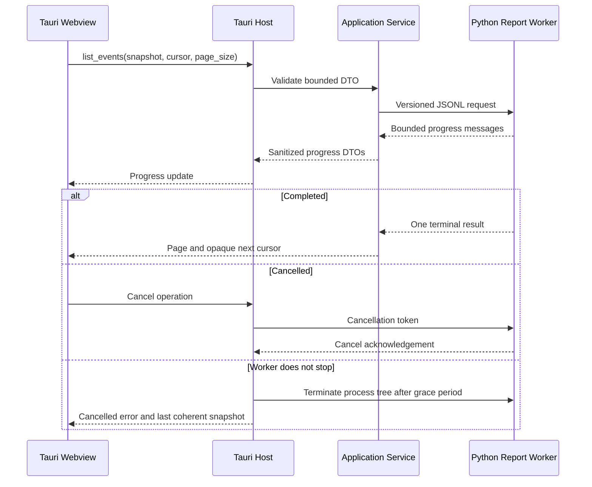
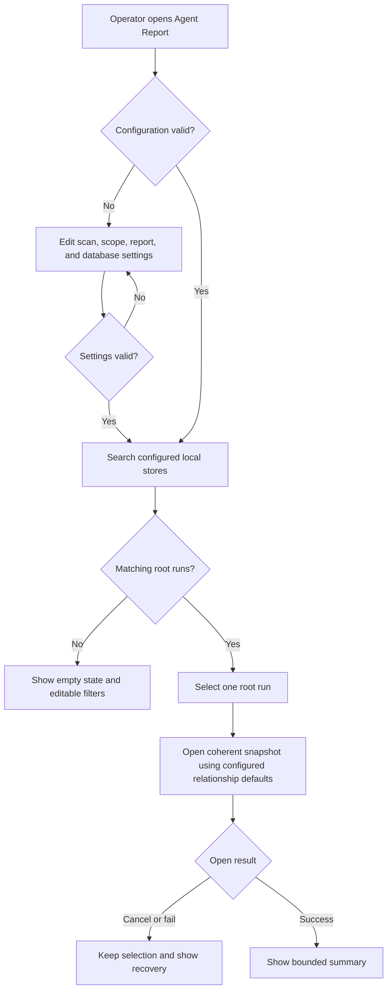
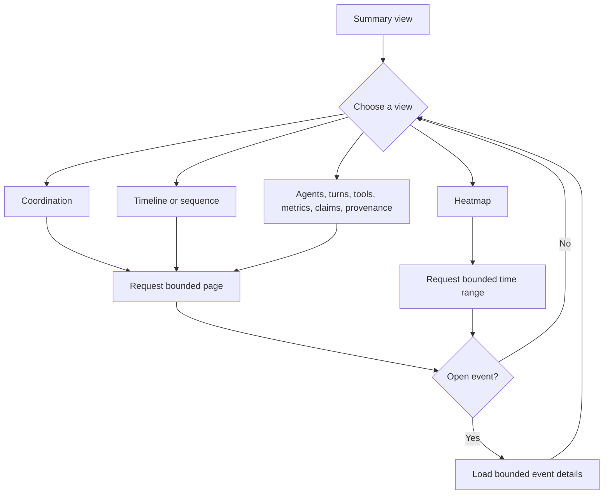
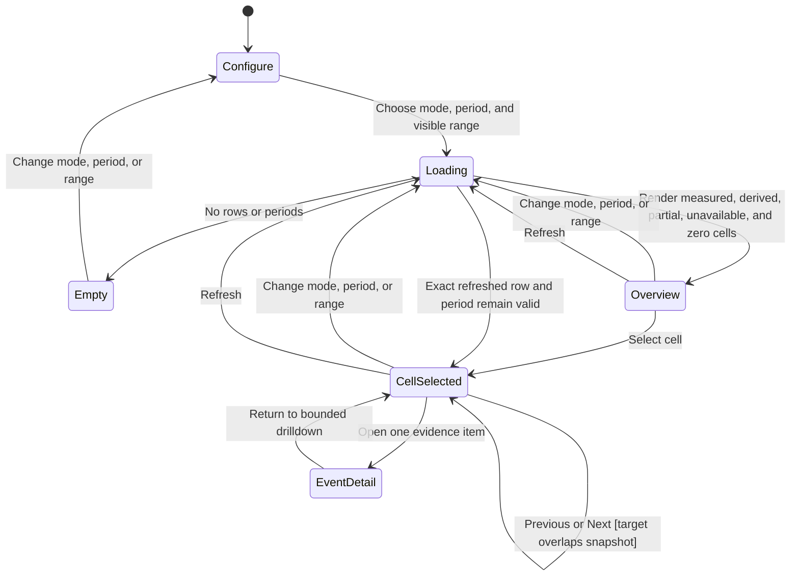
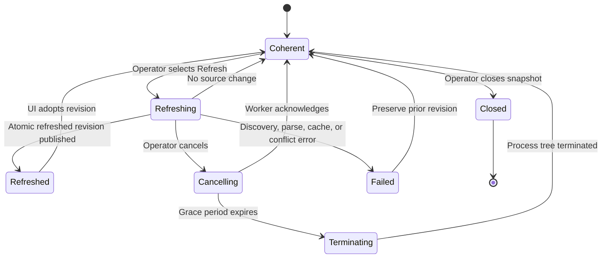
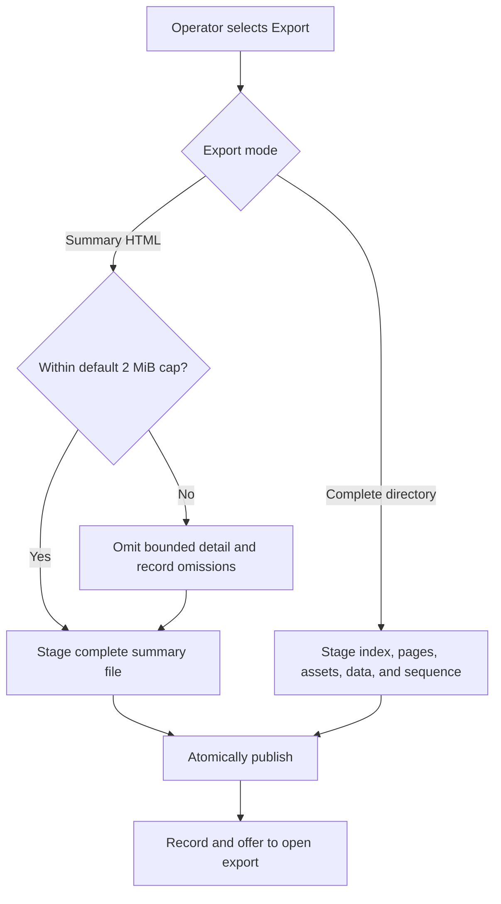
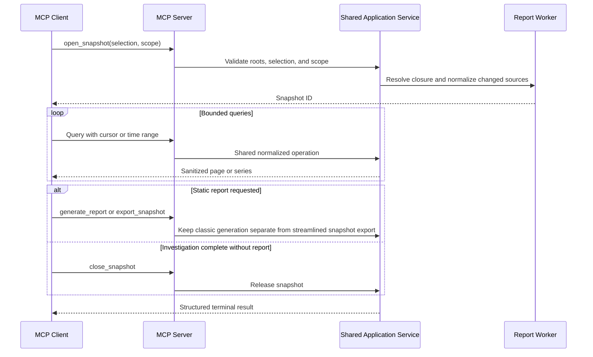
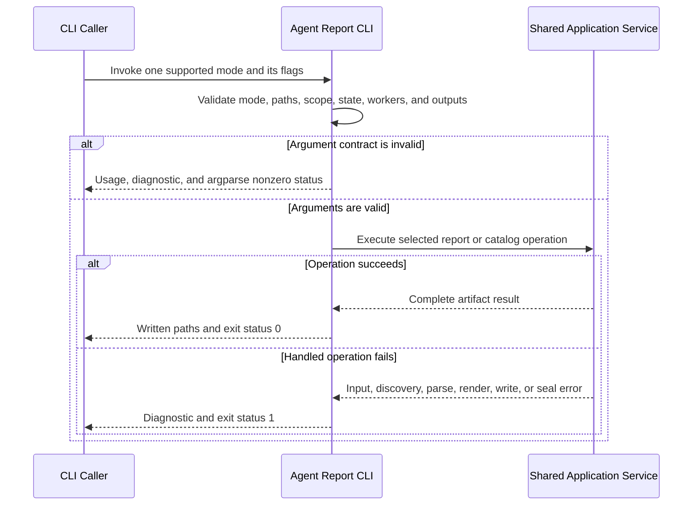
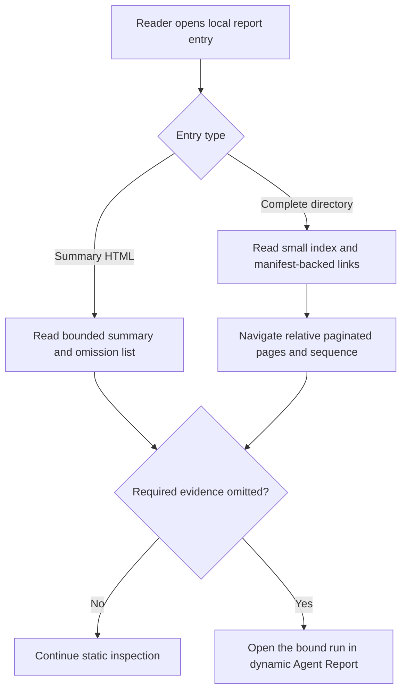

<!--
Copyright (c) 2026 Martin.Bechard@DevConsult.ca
Artifact-ID: 5051c7a2-0319-45dc-8367-6e681be9e1af
Created-UTC: 2026-08-12T12:37:56Z
Creating-Agent: Dev Documentation Writer
Runtime: Codex
Dispatched-Model: gpt-5.6-sol
Reasoning-Effort: medium
Task-ID: /root/report_docs_writer
Artifact-ID-Evidence: runtime-supplied
Created-UTC-Evidence: runtime-supplied
Creating-Agent-Evidence: runtime-supplied
Runtime-Evidence: runtime-supplied
Dispatched-Model-Evidence: runtime-supplied
Reasoning-Effort-Evidence: runtime-supplied
Task-ID-Evidence: runtime-supplied
-->

# Agent Report Dynamic Application And Static Export Functional Specification

## Current Understanding

Agent Report lets a local operator find recorded agent runs, inspect execution evidence, and export a privacy-bounded report. The operator needs to understand a large coordination run without loading its complete event graph into one browser document.

The product is partially implemented. The current CLI, MCP server, desktop run index, classic interactive report, static report views, and telemetry are baseline evidence. Existing MCP tool signatures and defaults remain supported. Current behavior is documented in the [Agent Report README](../../../tools/report/README.md) and the [native execution metrics design](../../design/components/CD-001-codex-rollout-metrics.md).

The intended primary experience is a Codex-only dynamic report workspace in the Tauri application. It opens a bounded root-only snapshot and loads detail on demand. Its shared streamlined exporter produces a complete offline directory or a bounded summary. CLI callers can select either streamlined export explicitly, while omitted CLI mode keeps the classic interactive HTML report. MCP `generate_report` keeps its current classic renderer, exact tool signature, and defaults. The additive MCP snapshot export uses the streamlined exporter. Tauri does not need to expose classic report generation.

The product decisions that governed report defaults, cache policy, first-release adapter scope, and browser scope are accepted and recorded in Decisions. No product question in this specification blocks implementation.

## Authoritative Sources

The sources have this precedence:

1. This functional specification governs intended actor-visible behavior.
2. [ARC-001](../../architecture/ARC-001-agent-report-dynamic-app-and-static-export.md) governs system architecture, system-wide constraints, runtime roots, authority boundaries, and compatibility policy.
3. [HLD-003](../../design/high-level/HLD-003-agent-report-dynamic-app-and-static-export.md) governs the dynamic-analysis and static-export subsystem, including component ownership, exact operation allocation, contracts, and implementation order.
4. Current code and tests govern claims about implemented behavior.
5. The [Agent Report README](../../../tools/report/README.md) and [native execution metrics design](../../design/components/CD-001-codex-rollout-metrics.md) describe current product behavior and established measurement rules.

The accepted Dev Architect packet is recorded through ARC-001 and HLD-003. Neither design can reduce an actor-visible requirement in this specification. MCP remains a first-class independently runnable entry point and does not require Tauri.

Current implementation evidence includes the [desktop shell](../../../tools/report/desktop/index.html), [desktop controller](../../../tools/report/desktop/src/main.ts), [desktop contracts](../../../tools/report/desktop/src/contracts.ts), [Tauri command host](../../../tools/report/desktop/src-tauri/src/lib.rs), [Python report runtime](../../../tools/report/scripts/run-timeline.py), [MCP application service](../../../tools/report/src/agent_report/mcp_report.py), [MCP server](../../../tools/report/src/agent_report/mcp_server.py), and [Rust discovery core](../../../tools/report/rust/agent-report-core/src/lib.rs).

## Related Code

### Desktop And Native Host

```text
tools/report/
└── desktop/
    ├── index.html
    ├── package.json
    ├── src/
    │   ├── contracts.ts
    │   ├── main.ts
    │   └── styles.css
    └── src-tauri/
        ├── Cargo.toml
        ├── capabilities/
        │   └── default.json
        ├── src/
        │   ├── lib.rs
        │   └── main.rs
        └── tauri.conf.json
```

The desktop shell provides root selection, local search, date filters, independent child and collaborator controls, worker settings, catalog export, report generation, progress, cancellation, export history, and diagnostics. The Tauri host owns local paths, native windows, process launch, cancellation, and file publication.

### Report Runtime, CLI, And MCP

```text
tools/report/
├── scripts/
│   └── run-timeline.py
├── src/
│   └── agent_report/
│       ├── __init__.py
│       ├── application_service.py
│       ├── cli.py
│       ├── event_cache.py
│       ├── mcp_report.py
│       ├── mcp_server.py
│       ├── report_worker.py
│       └── static_export.py
└── tool-formatters.json
```

`cli.py`, `mcp_report.py`, `mcp_server.py`, `run-timeline.py`, and `tool-formatters.json` are implemented. `application_service.py`, `event_cache.py`, `report_worker.py`, and `static_export.py` are intended subsystem paths established by HLD-003. Model price inputs are in [docs/reference/openai-model-pricing.json](../../reference/openai-model-pricing.json).

### Native Discovery

```text
tools/report/
└── rust/
    ├── agent-report-cli/
    │   └── src/
    │       └── main.rs
    └── agent-report-core/
        └── src/
            └── lib.rs
```

Rust remains the only Codex rollout discovery engine. The CLI adapter exposes its versioned JSON standard-input and standard-output protocol to Python.

## Related Tests

```text
tools/report/
├── desktop/
│   ├── src/
│   │   └── contracts.test.ts
│   └── src-tauri/
│       └── tests/
│           └── catalog.rs
├── rust/
│   ├── agent-report-cli/
│   │   └── tests/
│   │       └── protocol.rs
│   └── agent-report-core/
│       └── tests/
│           └── discovery.rs
└── tests/
    ├── fixtures/
    │   ├── codex-json-generator.stdout.jsonl
    │   └── codex-rollouts/
    │       ├── active-partial.jsonl
    │       ├── child.jsonl
    │       ├── nested.jsonl
    │       ├── root.jsonl
    │       └── sibling.jsonl
    ├── test_cli.py
    ├── test_mcp_report.py
    ├── test_mcp_server.py
    ├── test_run_timeline.py
    └── test_verify_release_wheel.py
```

These tests cover current discovery, protocol, CLI, MCP, renderer, packaging, desktop contracts, and catalog behavior. Tests for the dynamic workspace, normalized event cache, new operations, and directory export are planned and not yet identified as files.

## Related Backlog Items

- [Modularize report tool for concurrent maintenance](../../feature-backlog/modularize-report-tool-for-concurrent-maintenance.md) affects the implementation boundary of the existing monolithic renderer.
- No separate backlog item for the dynamic workspace and static directory export is yet identified.

## Related Wiki Pages

- [Agent Report native execution metrics](../../design/components/CD-001-codex-rollout-metrics.md) defines current measurement and privacy semantics.
- [Agent Report architecture](../../architecture/ARC-001-agent-report-dynamic-app-and-static-export.md) defines the accepted system frame and parent constraints.
- [Agent Report dynamic application and static export high-level design](../../design/high-level/HLD-003-agent-report-dynamic-app-and-static-export.md) defines the subsystem components, interactions, contracts, and implementation order.
- No project wiki page is yet identified.

## Open Questions

No open product questions are recorded for this subsystem.

## Decisions

### DEC-01: Classic Report Compatibility And Streamlined Export

The accepted product decision preserves current classic report behavior and adds streamlined export without replacing it.

- CLI exists primarily for report automation. An omitted report mode keeps the current classic interactive HTML report and its sequence companion. Explicit `directory` or `summary` selection uses the streamlined exporter.
- MCP exists primarily for bounded drill-down and forensic investigation by an LLM. MCP query, detail, snapshot, refresh, and close operations do not generate or require a static report.
- MCP retains the exact current `generate_report` tool signature, defaults, selection behavior, classic interactive HTML renderer, report bundle, inline representations, and errors.
- MCP snapshot tools are additive. `export_snapshot` uses the streamlined exporter and accepts `directory` or `summary` without changing `generate_report`.
- Tauri export uses only the streamlined `directory` and `summary` modes. Tauri does not need to expose the classic renderer.
- The streamlined exporter is shared by Tauri export, explicit CLI streamlined export, and MCP `export_snapshot`. It does not own classic report generation.
- Current non-Codex static adapters remain separate supported backends.

### DEC-02: Production Cache And Cursor Retention

- The normalized event-cache quota defaults to 5 GiB, exactly 5,368,709,120 bytes, and is configurable.
- Quota enforcement uses deterministic least-recently-used eviction of closed, unprotected snapshots.
- Open or protected snapshots are never evicted.
- Cache maintenance never deletes source logs or the discovery cache.
- Snapshots have no age-based expiration.
- Cursor records remain available for seven days, subject to snapshot validity and the rule that an open or protected snapshot is not evicted.

### DEC-03: First Dynamic Release Scope

The first dynamic release supports Codex only. Current Junie, prompt-runner, methodology-runner, comparison, and other non-Codex static adapters remain supported as separate CLI backends.

### DEC-04: Dynamic Runtime Surface

The dynamic workspace runs in Tauri only. The product does not provide a standalone-browser dynamic runtime. Static directory and summary artifacts remain browser-readable from `file://`.

### DEC-05: Persistent Desktop Configuration

The desktop application provides one configuration menu for durable discovery, scope, export, and database settings.

- **Folders to scan** is an ordered, editable list of authorized Codex session roots.
- **Include children** and **Include collaborators** are independent saved defaults applied to searches and newly opened snapshots. They are not primary search-form controls.
- **Worker threads** is a saved integer from 1 through 64 used by subsequent searches and report operations. It is not a primary search-form control.
- **Report output folder** is the default destination for generated reports. A native chooser can override it for one export without changing the saved default unless the operator explicitly saves the new value.
- **Database folder** and **Database name** together identify the derived normalized-event database. The name must be a filename, not a path, and must use the `.sqlite3` suffix.
- Saving validates every value before replacing the active configuration. Invalid settings remain editable and do not partially apply.
- Changing scan folders or relationship defaults affects the next search or snapshot open. Database folder and name controls are disabled while a snapshot or report operation is active; the operator must close the snapshot and wait for active work to finish before saving a new database identity. Existing source logs and the previous database are not deleted.

## Maintenance Notes

Recheck this specification when the CLI parser, MCP tool schemas, desktop command contracts, report JSON schema, discovery protocol, privacy filter, pricing data, cache maintenance, cursor retention, or static exporter changes. Recheck DEC-01 through DEC-04 before changing their accepted behavior.

The most recent source review is 2026-08-12. It includes current dirty-worktree content in the named source files. The specification distinguishes that worktree behavior from implemented baseline behavior where the distinction matters.

## Parent Workflow

The parent workflow is local agent-run oversight. An operator configures discovery and storage defaults, finds a run, reviews execution and coordination evidence, and shares or archives a bounded report. Agent Report contributes discovery, normalization, interactive analysis, provenance, and export without changing the source run.

## Actors

| Actor | Goal and permitted actions | Prohibited actions |
|---|---|---|
| Local operator | Search authorized local stores, select scope, inspect evidence, refresh explicitly, cancel work, and export reports. | Cannot modify source rollout logs through Agent Report. |
| MCP client | Select a task, open and query snapshots, retrieve details, refresh, export, and close snapshots through registered operations. | Cannot obtain host cache paths or bypass configured roots and output limits. |
| CLI caller | Automate report generation through current backends and Codex catalog or snapshot operations with explicit paths and flags. Omitted report mode produces the classic interactive HTML report. | Cannot combine mutually exclusive modes or bypass sealing and path validation. |
| Tauri host | Mediate local paths, settings, worker processes, cancellation, native windows, diagnostics, cache maintenance, and publication. | Must not send raw rollout content to the webview or expose unrestricted filesystem authority. |
| Report worker | Normalize authorized source files, query snapshots, and render exports for the host application service. | Must not discover Codex files independently, publish partial output, or decrypt opaque content. |
| Rust discovery engine | Discover and index Codex rollout metadata under caller-bounded roots. | Must not store transcript content in `rollout-discovery-v2.sqlite3`. |
| Static report reader | Open a summary or complete report directory from disk and navigate its included pages. | Cannot query omitted evidence unless the report is reopened in the dynamic application. |

Authentication is the local operating-system user context. Agent Report does not add accounts, remote tenancy, or network authentication. Filesystem permissions and configured roots define access.

## Entry Points

The Tauri dynamic workspace is the intended primary entry point for Codex analysis. CLI remains the primary report-automation entry point. MCP remains the primary bounded drill-down and LLM forensic-investigation entry point. Both remain first-class and independently runnable. Static files remain the portable reading entry point.

### Operation Inventory

| Operation or surface | State | Actor and authority | Selector, request, paging, and sort | Result, errors, and side effects | Verification |
|---|---|---|---|---|---|
| Desktop configuration | Intended | Local operator through Tauri; local OS user authority | Ordered scan folders, independent child and collaborator defaults, worker threads 1 through 64, report output folder, database folder, and database filename | Validates and atomically saves configuration; invalid values do not partially apply; database identity is immutable during active work and a later change never deletes the prior database | Planned configuration contract, persistence, validation, and migration tests |
| Desktop catalog search | Implemented baseline with intended configuration integration | Local operator through Tauri; configured local filesystem roots | Text query and inclusive local date-hour range; configured roots and relationship defaults; results sort by last activity, then start time and source path | Virtualized bounded metadata rows, scan/cache statistics, and progress; updates discovery metadata index | `contracts.test.ts`, `catalog.rs`, `discovery.rs`, planned configuration tests |
| Desktop catalog export | Implemented | Local operator through native save dialog | Current search contract and selected output file | Compact escaped offline catalog; stores last export folder and path | Tauri unit tests and manual desktop test |
| Desktop dynamic workspace | Intended | Local operator through Tauri | Exact selected root and explicit relationship scope; cursor pages default 100 and maximum 500 | Opens one snapshot and lazy views; no report HTML is preloaded | Planned acceptance scenarios FR-01 through FR-10 |
| Desktop Codex export | Intended streamlined exporter | Local operator through Tauri | Snapshot or exact selected root; directory or summary mode; output target | Publishes the selected complete offline directory or bounded summary. Progress and cancellation use the shared streamlined export operation. Tauri does not expose classic generation. | Planned exporter and Tauri tests |
| `agent-report` single report | Implemented baseline plus additive streamlined choices; scope flags reflect worktree behavior | CLI caller | Path or `--codex-thread`; optional explicit directory or summary report mode; output flags; `--live` or `--seal`; title overrides; formatter config; children and delegations | Omitted report mode keeps current classic interactive HTML and sequence output. Explicit directory or summary uses the streamlined exporter. JSON, CSV, and Markdown roles remain available; exit 0 or handled exit 1; argument misuse exits through `argparse`. | `test_cli.py`, `test_run_timeline.py`, planned additive streamlined-export tests |
| `agent-report --codex-catalog` | Implemented | CLI caller | UTC inclusive date or hour, title, workspace, catalog roots, batch flag | Root-run catalog and optional linked batch reports | `test_run_timeline.py`, `discovery.rs` |
| `agent-report --junie-catalog` | Implemented | CLI caller | UTC inclusive date or hour, title, workspace, catalog roots, batch flag | Junie root catalog and optional linked batch reports | `test_run_timeline.py` |
| Static input adapters | Implemented | CLI caller | Methodology workspace, prompt-runner directory, comparison manifest, Junie session, or other current non-Codex static input | Backend-specific static report while preserving existing metrics; these remain separate from the shared Codex exporter | `test_run_timeline.py` |
| MCP `generate_report` | Implemented and retained unchanged | MCP client through configured stdio server | Exact current parameters: optional exact thread ID, or half-open ISO time range plus case-insensitive name substrings; output directory; inline toggle and format | Keeps the current classic interactive HTML bundle and current default. Optional complete inline HTML, Markdown, or JSON and structured errors remain exact. | `test_mcp_report.py`, `test_mcp_server.py`, signature snapshot and classic-renderer regression tests |
| MCP `query_time_range` | Implemented and retained | MCP client | Exact thread ID; optional time range; supported measure and 1, 5, 15, 30, or 60 minute buckets; optional events | Bucketed telemetry; at most 1,000 legacy events; deterministic opaque IDs; cancellation | `test_mcp_report.py`, `test_mcp_server.py` |
| MCP `get_event_details` | Implemented and retained | MCP client | Exact thread ID and `evt_` plus 24 lowercase hexadecimal characters | Full privacy-safe current event or `REPORT_EVENT_NOT_FOUND`; cancellation | `test_mcp_report.py`, `test_mcp_server.py` |
| `open_snapshot` | Intended | Authorized local caller | Root and independent children and collaborators booleans; desktop callers use saved configuration defaults | Resolves the authorized relationship closure and atomically creates or reuses a coherent normalized snapshot; returns opaque snapshot metadata or a structured validation, discovery, cancellation, or source-conflict error | Planned worker protocol and scope tests |
| `get_summary` | Intended | Snapshot holder | Snapshot ID | Exact revision, title, goal, state, scope label, observation and live state, half-open time range, grouped metrics, significant activity, and structured warnings | Planned application-service tests |
| `list_agents` | Intended | Snapshot holder | Exact query and state filters; requested `last_activity_at|started_at|agent_id` sort; opaque cursor; page size 1 to 500 | Canonical page with exact revision, normalized applied filter and sort objects, and full agent rows; default 100 | Planned pagination tests |
| `list_turns` | Intended | Snapshot holder | Exact agent and state filters; requested `started_at|ended_at|turn_id` sort; opaque cursor; page size 1 to 500 | Canonical page with exact revision, normalized applied filter and sort objects, and full turn rows | Planned pagination tests |
| `list_events` | Intended | Snapshot holder | Exact agent, turn, kind, and half-open time filters; requested `occurred_at|event_id` sort; opaque cursor; page size 1 to 500 | Canonical page with full event fields and nullable opaque source reference; no native path | Planned pagination, detail, and path-privacy tests |
| `query_snapshot_time_range` | Intended additive snapshot operation; it does not replace or change retained MCP `query_time_range` | Snapshot holder | Snapshot ID, exact half-open range, user-facing mode `wall_time|tokens|models`, requested 1, 5, 15, 30, or 60 minute resolution, and maximum rows. Wall time selects present runtime-state rows. Tokens selects the fixed token, tool, context, and cost rows. Models selects recorded model-and-effort rows plus Cost. | Exact-revision Heatmap with at most 2,000 cells, actual resolution, omitted-row count, stable mode-specific row order, measure-specific aggregation and formatting, friendly labels, explicit evidence state, per-row scale metadata, known context capacity or explicit N/A capacity semantics and intensity, bounded drilldown evidence, and provenance | Planned HM-F01 through HM-F15 mode, row, aggregation, formatting, evidence-state, scaling, drilldown, coarsening, interaction, and retained-MCP isolation tests |
| `query_sequence` | Intended | Snapshot holder | Exact focus, event-kind, grouping, reasoning, chronological sort, cursor, and page-size fields | Canonical sequence page plus group hierarchy; rows include endpoints, labels, event identity, repetition, and reasoning availability | Planned sequence tests |
| `query_coordination` | Intended | Snapshot holder | Exact work-item, delegated-root, agent, operation, and evidence filters; chronological sort, cursor, page size | Canonical coordination page with full operation, label, evidence, and event fields; inferred prose decisions are labeled | Planned coordination tests |
| `get_event_details` | Intended snapshot operation; retained MCP schema remains unchanged | Snapshot holder | Snapshot ID and deterministic event ID | Exact-revision lazy detail with title, optional summary, bounded structured disclosures, evidence, provenance, and nullable opaque source reference | Planned detail and source-registry tests |
| `refresh_snapshot` | Intended | Snapshot holder | Snapshot ID | Exact `{changed, snapshot}` result; conflict or cancellation preserves the prior coherent revision | Planned live-refresh tests |
| `export_snapshot` | Intended | Snapshot holder | Snapshot ID; optional directory or summary mode; authorized output target; optional SQLite flag | Exact native success has revision, resolved mode, published target, manifest digest, `file_count`, `total_byte_count`, structured warnings, and structured omissions. Tauri replaces the native target with opaque export identity and display name. | Planned exporter and registry tests |
| `close_snapshot` | Intended | Snapshot holder | Snapshot ID | Exact `{snapshot_id, closed}` result; releases worker-side handles while retained cache remains policy-controlled | Planned lifecycle tests |
| Worker progress and completion messages | Intended extension of current progress protocol | Report worker to application service | Cryptographic operation ID, snapshot ID when available, phase, bounded counts, cancellation token | Python validates operation-specific structured results and errors. Rust carries a generic bounded JSON result map and enforces framing, correlation, limits, and one terminal outcome. | Planned worker protocol tests |
| Local title lookup | Implemented | Discovery service | Exact discovered thread IDs against read-only `state_5.sqlite` | Saved title or genuine-prompt fallback; no database write | `discovery.rs`, `catalog.rs` |
| Source links and report windows | Implemented | Local operator through Tauri or static browser | Existing local rollout paths and matching sequence companion | Opens authorized local source or report; rejects unrelated popup targets | Tauri unit tests |
| Diagnostic log | Implemented | Local operator through Tauri | Open current app log | Bounded JSON Lines log, 5 MiB rotation, one previous file, no intentional transcript bodies | Tauri unit tests |

All dynamic operations use a versioned request and response envelope. A caller that supplies an unsupported protocol version receives a validation error before work starts.

## Scope

This specification includes:

- local run discovery, filtering, title fallback, selection, and source navigation;
- persistent desktop configuration for scan folders, relationship defaults, report output, and database identity;
- explicit root, child, and collaborator scope resolved when a snapshot opens;
- dynamic Codex summary and analysis views;
- cursor pagination, virtualization, time-range aggregation, and lazy event details;
- explicit live refresh with no background watcher;
- CLI, MCP, desktop, worker-message, and static-reading behavior;
- a shared streamlined Codex exporter for Tauri, explicit CLI choices, and MCP `export_snapshot`;
- the current classic interactive Codex renderer for default CLI generation and MCP `generate_report`;
- current separate non-Codex static backends for Junie, prompt-runner, methodology-runner, and comparison manifests;
- bounded summary, complete directory, JSON, CSV, and Markdown exports;
- privacy, provenance, pricing, live and sealed behavior, diagnostics, progress, and cancellation.

This specification excludes remote hosting, collaborative multi-user access, source-log editing, report ingestion from a network service, automatic filesystem watching, and implementation module internals. Dynamic non-Codex adapters are compatible future work; current non-Codex static behavior remains supported.

## Concepts

| Term | Meaning |
|---|---|
| Root task | The exact task selected by the operator. It is the only default report scope. |
| Child | A descendant established by recorded native `thread_spawn` metadata. |
| Collaborator | A non-child task connected by a recorded cross-root delegation link. |
| Scope | The root plus independently selected child and collaborator relationship sets. |
| Desktop configuration | Persisted discovery, relationship-scope, export-destination, and database-location defaults managed from the application configuration menu. |
| Snapshot | One coherent normalized view bound to source revisions, scope, parser version, pricing version, and observation time. |
| Live snapshot | A snapshot of sources that can still change. Refresh occurs only on operator request. |
| Sealed snapshot | A reproducible snapshot of stable terminal sources with source and pricing digests. |
| Normalized event cache | A privacy-bounded derived SQLite cache. Source JSONL remains authoritative. |
| Coordination evidence | Recorded dispatch, message, follow-up, wait, interrupt, claim, work-item, and terminal events. Prose-derived decisions are explicitly marked inferred. |
| Bounded summary | A self-contained HTML report intended to stay within a 2 MiB default cap. |
| Complete directory export | A `file://`-compatible report folder with a small index and paginated pre-rendered detail. |
| Classic interactive report | The current rich Codex HTML report and sequence companion produced by `run-timeline.py`; it remains the CLI default and the renderer behind MCP `generate_report`. |
| Measured, derived, inferred, unavailable | Evidence labels that distinguish direct telemetry from calculations, interpretation, and missing data. |
| Heatmap mode | One of the three user-facing Heatmap choices: Wall time, Tokens, or Models. A mode selects a stable row family and its aggregation, formatting, scaling, and evidence rules. |
| Heatmap period | One time bucket at the requested or service-coarsened resolution. Periods use local-time labels in the desktop and remain bound to the snapshot's exact UTC range. |
| Per-row scale | The intensity domain calculated independently for one heatmap row. A darker cell means a larger value within that row, not necessarily a larger value than a cell in another row. |
| Context capacity | The known model context window used as the fixed scale for Context size rows. When capacity is unavailable, context-capacity semantics and intensity are N/A. A separately evidenced observed token count may remain visible, but the UI does not calculate a percentage or substitute another scale. |
| Heatmap drilldown | A bounded, on-demand view of one row and period. It shows the row value and a limited chronological evidence list without loading all event details into the heatmap response. |

### Heatmap Functional Facets

The Heatmap contract has three distinct authority classes. Classic-preserved semantics come from the current interactive HTML renderer and its tests. Accepted dynamic constraints come from this specification's existing snapshot, bounding, privacy, and accessibility decisions. Justified functional propositions close actor-visible gaps that neither authority decides.

| Authority class | Heatmap scope |
|---|---|
| Classic-preserved semantics | The three mode labels; known runtime and token row labels and order; model-and-effort grouping and order; complete-evidence calculations and formatting; friendly labels; known-capacity and per-row scales; selection, pointer drilldown, step-back, breadcrumbs, adjacent-period movement, horizontal scrolling, and period controls. |
| Accepted dynamic constraints | Exact snapshot revision and half-open range; no more than 2,000 cells; disclosed coarsening and omissions; bounded lazy drilldown and event detail; sanitized previews; non-color value semantics; keyboard equivalence; and no native-path disclosure. |
| Justified functional propositions | Explicit zero, partial, and unavailable semantics; N/A context-capacity behavior when capacity is unknown; and visible keyboard-operable Drill down and Step back controls with disabled boundaries. |

| ID | Functional contract |
|---|---|
| HM-F01 | Heatmap exposes exactly three user-facing modes: Wall time, Tokens, and Models. |
| HM-F02 | Wall time contains only present runtime-state rows. Known states use this stable order: Model inference, Tool execution, Build / Test, Waiting for agent, User pause, Watchdog, Approval / infrastructure, and Unattributed. Any present state outside that set follows in ascending internal-state order and uses its title-cased identifier as the label. |
| HM-F03 | Tokens contains Uncached input, Cached input, Reasoning, Output, Tool calls, Context size (avg), Context size (max), and Cost in that order. |
| HM-F04 | Models contains one row for each normalized model-and-effort combination, followed by Cost. A response uses its recorded model, then a single non-mixed thread model, then Unknown model. It uses its recorded effort, then a single non-mixed thread effort, then no effort suffix. Distinct efforts remain separate rows. Model rows follow the first response occurrence while traversing agents and their responses in stable snapshot source order, then Cost. |
| HM-F05 | A Wall time cell measures the union of matching runtime-state intervals that overlap the period. Overlapping intervals in the same state are not double-counted. |
| HM-F06 | Token cells sum response-owned values completed in the period. Tool calls count completed calls. Context size (avg) averages positive observations. Context size (max) takes their maximum. Cost sums recorded or API-equivalent response estimates. A model row sums processed tokens for that model-and-effort combination. |
| HM-F07 | Wall time uses duration formatting. Token and model values use compact numeric formatting. Tool calls use integer counts. Context rows show token value and capacity percentage when capacity is known. Cost uses currency formatting consistent with report precision. |
| HM-F08 | Row headings, cell labels, drilldown headings, and accessible names use friendly labels rather than internal identifiers. Agents retain stable snapshot source order. The agent role is the recorded role, or main for a root without one, or default for a child without one. The chosen name is the recorded nickname, or the child assignment when no nickname exists. The label is `role (name)` when the chosen name exists and differs from both the role and the literal fallback name `root`; otherwise it is the role. A model label is `model · effort value` when normalized effort exists, model alone when it does not, and Unknown model when normalized model identity is unavailable. |
| HM-F09 | A measured or derived applicable value of zero displays as zero in its measure-specific format. Missing timing, usage, or price evidence produces partial or unavailable value evidence under the matrix. Unknown model and effort use the fallback identities in HM-F04. Unknown context capacity produces N/A context-capacity semantics under HM-F10. None of these gaps is converted to a measured zero. |
| HM-F10 | Every non-context row uses its own maximum visible value as its intensity scale. Context rows use known context capacity. When context capacity is unavailable, context-capacity semantics and cell intensity are N/A; the UI does not substitute the row's visible maximum or calculate a percentage. A separately evidenced observed token count may remain visible as supporting text. The UI discloses the unavailable scale basis and does not invite intensity comparison across different rows. |
| HM-F11 | Initial Heatmap loading is bounded to the selected visible range and rows. Selecting a cell loads only its bounded chronological evidence. The drilldown returns at most 100 evidence rows and reports the omitted count. Full event detail remains a separate lazy action. |
| HM-F12 | Heatmap preserves single-click selection, double-click next-level drilldown, right-click step-back, breadcrumb return, previous and next period movement, horizontal scroll controls, and 1, 5, 15, 30, and 60 minute period controls. Selecting a cell also exposes visible keyboard-operable Drill down and Step back buttons. Drill down is disabled at 1 minute. Step back is disabled when no parent period exists. Previous and Next are disabled when their target period is outside the snapshot range. |
| HM-F13 | Drilldown evidence uses event time, measure-specific value, duration when known, and a bounded sanitized preview. Token-response evidence starts with the friendly agent label from HM-F08 and then the friendly model-and-effort label. Other rows use the friendly model-and-effort, runtime-state, or tool label that applies. Drilldown preserves privacy and availability labels. |
| HM-F14 | A response contains no more than 2,000 cells across all returned rows. The service selects the nearest coarser supported resolution that meets the limit, returns the actual resolution, and reports omitted rows. |
| HM-F15 | Cells expose row, local period, mode, formatted value, availability, and selection state without relying on color. The synchronized drilldown list preserves the same evidence for keyboard and assistive-technology users. |

### Heatmap Value And Evidence-State Matrix

Every cell returns exactly one value-evidence state: measured, derived, partial, or unavailable. Measured means the displayed value is one direct recorded value without calculation. Derived means the application calculated a complete value from recorded evidence. Partial means some applicable contributors are known and some are unavailable. A partial cell displays `Partial · <formatted known value>` and calculates that value only from usable contributors. Unavailable means no defensible value can be calculated; the cell displays `Unavailable` without a numeric value. The response also returns `applicable_zero`, which is true only when complete applicable evidence establishes zero. It qualifies a measured or derived state and is never a synonym for unavailable.

| Mode and row family | Value and aggregation | Measured | Derived | Partial | Unavailable | `applicable_zero` |
|---|---|---|---|---|---|---|
| Wall time: each HM-F02 runtime state | Union of matching interval overlap within the period; no double counting | Not used because overlap is calculated | All applicable interval boundaries are usable; retain direct or inferred boundary provenance | Display the union of usable matching intervals when other matching intervals have missing or invalid timing | The state is applicable but no matching interval has usable timing | True when complete interval evidence has no overlap with the period; show `0ms` |
| Tokens: Uncached input, Cached input, Reasoning, Output | Sum the corresponding response-owned usage completed in the period | One applicable response supplies one direct counter and no calculation or normalization is required | Complete counters require summing or a source-defined normalized calculation | Display the sum of usable counters when at least one applicable response lacks usable usage | Applicable responses exist but none has usable usage for the row | True when complete applicable response usage establishes zero; show compact `0` |
| Tokens: Tool calls | Count recorded tool calls completed in the period | Not used because the cell is a count | The bounded tool-event set is complete | Display the count from known coverage when the snapshot identifies incomplete tool-event coverage | Tool-event coverage is unavailable for the period | True when complete tool-event coverage contains no calls; show integer `0` |
| Tokens: Context size (avg) | Average positive recorded context-token observations | Not used because the cell is an average | All applicable positive usable observations are included | Display the average of usable positive observations when other applicable responses lack context evidence | No positive usable context observation exists | Never true; absence or a recorded nonpositive placeholder is unavailable, not context size zero |
| Tokens: Context size (max) | Maximum positive recorded context-token observation | One applicable response supplies one positive direct observation | More than one complete positive observation requires a maximum calculation | Display the maximum usable positive observation when other applicable responses lack context evidence | No positive usable context observation exists | Never true; absence or a recorded nonpositive placeholder is unavailable, not context size zero |
| Tokens or Models: Cost | Sum recorded response cost and supported API-equivalent estimates completed in the period | One applicable response supplies one fully recorded cost and no calculation is required | Complete supported evidence requires summing or an API-equivalent estimate; label the method | Display the subtotal of supported costs when another applicable response has missing usage or no supported price for its normalized model identity | No applicable response has defensible recorded or estimated cost | True when complete cost evidence establishes no cost; show `$0.00` |
| Models: each model-and-effort row | Sum processed tokens for responses with that normalized model-and-effort identity | One matching response supplies one direct processed-token value | Complete matching usage requires summing or a source-defined processed-token calculation | Display the sum of usable processed-token values when another matching response lacks usage | The row identity exists but no matching response has usable processed-token evidence | True when complete matching response usage establishes zero; show compact `0` |

Missing response effort does not make a model row partial or unavailable when the thread supplies one uniform non-mixed effort. Otherwise, it creates the model-only identity defined by HM-F04. Missing response model uses one uniform non-mixed thread model before it creates the Unknown model identity. The value state then depends on usage evidence. Unknown context capacity makes context-capacity semantics and intensity N/A. It does not invalidate a separately evidenced context-token observation, which may remain visible as supporting text without a percentage.

### Heatmap Functional Propositions

| Proposition | Basis | Necessity | Decision owner |
|---|---|---|---|
| JFP-HM-01: Use the evidence-state matrix above and never coerce missing evidence to zero. Review the actor-visible wording and presentation for each row family so partial and unavailable states are understandable in context. | Existing provenance rules distinguish measured, derived, and unavailable evidence, while existing cost behavior can be partial. The classic Heatmap can currently render missing numeric inputs as zero. | Dynamic users must distinguish no activity from unavailable telemetry before comparing cells or cost without receiving confusing or overly technical status text. | **Accepted with contextual UX review required by the product owner on 2026-08-12.** |
| JFP-HM-02: When context capacity is unknown, show N/A for context-capacity semantics and intensity; do not substitute a row-relative scale. A separately evidenced observed token count may remain visible without a percentage. | The product owner rejected row-relative scaling because a capacity-loading defect could make every context cell look meaningful while using the wrong basis. | The Heatmap must expose missing capacity rather than conceal it behind a visually plausible fallback. | **Accepted as revised by the product owner on 2026-08-12.** |
| JFP-HM-03: Expose visible Drill down and Step back controls after cell selection in addition to pointer shortcuts. | Existing interaction uses double-click and right-click, while FR-10 requires keyboard operation and non-pointer access. | Keyboard and assistive-technology users need discoverable equivalents with explicit navigation boundaries. | **Accepted by the product owner for the application on 2026-08-12.** |

### User Action Status

**No user action is currently required for Heatmap functional propositions.** JFP-HM-01 through JFP-HM-03 were accepted or revised by the product owner on 2026-08-12. JFP-HM-01 still requires contextual UX review during design and implementation; that review is delivery work, not a pending product decision.

## Workflows

### Workflow 1: Find And Select A Run

1. The application searches the folders saved in configuration and applies the saved relationship defaults.
2. The operator can enter a text query and an inclusive local date-hour range.
3. The application converts local date-hour values to UTC search boundaries.
4. The application displays native scan and cache progress.
5. The application shows virtualized root-run results ordered by last activity.
6. The operator selects one result and sees its title, thread ID, times, workspace, store, source location, and diagnostics.
7. An empty result shows a clear empty state. A validation or discovery failure leaves search controls available for correction and provides an action to open configuration when a saved folder is invalid or unavailable.

### Workflow 2: Configure Discovery And Storage

1. The operator opens the configuration menu.
2. The application displays the saved folders to scan, Include children default, Include collaborators default, worker threads, report output folder, database folder, and database name.
3. The operator adds, removes, reorders, or chooses folders and edits either relationship default or the database filename.
4. The application validates folder access, output and database destination suitability, and database filename syntax.
5. Save atomically applies every valid setting. Cancel closes the menu without changing the active configuration.
6. While a snapshot or report operation is active, database folder and name cannot be changed and the application explains that the operator must close the snapshot and wait for active work to finish. After that, Save switches to the configured database without deleting the old file.

### Workflow 3: Open A Dynamic Snapshot

1. The operator selects a run and chooses Open report.
2. The application uses the saved Include children and Include collaborators defaults to resolve the authorized relationship closure.
3. The application opens or reuses one coherent normalized snapshot and shows operation progress with cancellation while work is active.
4. Success displays the bounded summary first. Failure preserves the selected run and provides a corrective action or retry; cancellation creates no new snapshot.

### Workflow 4: Inspect A Dynamic Snapshot

1. The operator starts on Summary and sees scope, current goal or title, run state, high-level metrics, provenance, warnings, and recent significant activity.
2. The operator chooses Coordination, Heatmap, Timeline, Sequence, Agents, Turns, Tools, Model usage, Context and compaction, Inference, Runtime and waits, Work items and claims, or Provenance and diagnostics.
3. The application requests only the selected view and visible page or time range.
4. Large lists use virtualization and opaque cursor pagination.
5. In Heatmap, the operator chooses Wall time, Tokens, or Models and a 1, 5, 15, 30, or 60 minute period.
6. The application calls additive `query_snapshot_time_range` for only the visible range and mode-specific rows. The response contains no more than 2,000 cells and labels any coarser actual resolution or omitted rows.
7. Each non-context row uses its own disclosed scale. Context rows use known context capacity; without it, context-capacity semantics and intensity are N/A. Zero and unavailable values remain visibly distinct.
8. The operator selects a cell to request a bounded chronological drilldown. The operator can double-click or use the visible Drill down button to move to the next finer period. The operator can right-click, use the visible Step back button, use a breadcrumb, or use an adjacent-period control to navigate without loading the full event set.
9. The operator selects one drilldown event to load full bounded event details on demand.
10. Raw argument or result disclosures remain absent until the operator opens them.
11. The Coordination view groups evidence by canonical work item or delegated root when available. It marks reconstructed prose decisions as inferred.

### Workflow 5: Refresh, Cancel, And Recover

1. A live snapshot shows its observation time and an explicit Refresh action.
2. Refresh compares current source revisions with the snapshot binding.
3. If sources changed, the service rebuilds affected normalized data and publishes a coherent refreshed revision.
4. If the operator cancels, the service sends the worker cancellation token.
5. If the worker does not stop within the grace period, Tauri terminates the worker process tree.
6. The application returns to the last coherent snapshot and labels the refresh cancelled.
7. A failed refresh never replaces the last coherent cache revision or visible snapshot.

### Workflow 6: Export A Snapshot

1. The operator selects Complete directory or Summary HTML in Tauri.
2. The application shows the selected scope and expected content.
3. Summary HTML applies the 2 MiB default cap. It omits detail instead of embedding an unbounded payload and reports each omission.
4. Complete directory writes a small `index.html`, shared classic CSS and JavaScript, manifest, JSON, CSV, Markdown, paginated pages, sequence companion, and optional SQLite archive.
5. Static pages work from `file://` without fetch, XHR, JavaScript modules, a service worker, or SQLite-WASM during startup.
6. The shared streamlined exporter writes to a staging location and atomically publishes the completed file or directory.
7. The application records the successful export and can reopen it later.

### Workflow 7: Use The CLI

1. The caller selects a supported input backend or Codex catalog mode.
2. The caller supplies compatible scope, state, title, formatter, worker, report-mode, and output flags. If report mode is omitted, the CLI generates the classic interactive HTML report. The caller selects `directory` or `summary` explicitly for streamlined output.
3. The CLI validates mutually exclusive modes and bounded values before report work.
4. The service discovers, normalizes, and renders the selected report.
5. Success writes the requested artifacts and returns exit status 0.
6. A handled input, discovery, parse, render, write, or seal failure prints a diagnostic and returns exit status 1.
7. An argument-contract violation prints `argparse` usage and exits with its standard nonzero status.

### Workflow 8: Use MCP

1. The MCP server validates configured roots, output path, timezone, inline limit, and bundled discovery protocol at startup.
2. The MCP client selects a task by exact thread ID or exact time-and-name selection.
3. The client can open, query, retrieve detail, refresh, and close a snapshot without Tauri or static report generation.
4. The client calls `generate_report` when it needs the current classic report bundle. It calls additive `export_snapshot` when it needs a streamlined directory or summary from an open snapshot.
5. Retained `generate_report`, `query_time_range`, and `get_event_details` keep their current schemas and defaults unchanged. Snapshot tools remain separate additive operations.
6. All operations return structured success or structured validation, ambiguity, discovery, generation, conflict, cancellation, and write errors.
7. Inline HTML, Markdown, or JSON is complete or rejected with `REPORT_TOO_LARGE_FOR_MCP`; it is never truncated.
8. MCP responses do not disclose the event-cache path.

### Workflow 9: Read A Static Report

1. The reader opens a complete-directory `index.html` or a bounded summary file from disk.
2. The reader navigates pre-rendered pages and the sequence companion through relative links.
3. The reader uses filters, grouping, zoom, fit, disclosures, breadcrumbs, and time navigation provided by that export.
4. A directory export does not parse its complete archive at startup.
5. If evidence was not exported, the report identifies the omission and directs the reader to open the snapshot in Agent Report.

## Interface Examples

### UI Information And Action Contract

This specification does not prescribe a page layout, wireframe, navigation shape, or visual hierarchy. The implemented UI must make the following information available when it is relevant, may organize it into fewer or more views after UX validation, and must not require a separate preflight or scope-confirmation surface.

| Information family | Information that must be available |
|---|---|
| Selected run | Title, stable task identity, workspace, source store, start and last-activity times, current or terminal state, observation time, and whether the snapshot is live or sealed. |
| Effective scope | Whether children and collaborators were included, the number of included roots and agents, and warnings for unavailable or excluded relationships. |
| Outcome and progress | Current goal when available, significant activity, completion or failure evidence, active operation, bounded progress, cancellation state, warnings, and recoverable errors. |
| Time and utilization | Wall-clock range, active and waiting time, runtime states, model inference, tool execution, build and test activity, concurrency, and time-bucket provenance. |
| Tokens, context, models, and cost | Uncached and cached input, reasoning, output, tool calls, context average and maximum, model-and-effort identity, price evidence, cost, capacity, and explicit zero, partial, unavailable, or N/A states. |
| Agents and turns | Agent identity and relationship, parent or delegator, status, start and end times, duration, current or final activity, turn identity, and bounded turn metrics. |
| Tools and events | Event time, kind, actor, tool or operation, duration, status, bounded arguments or result disclosure, evidence quality, and an opaque source reference when opening the native source is authorized. |
| Coordination | Dispatches, delegations, messages, follow-ups, waits, interrupts, work items, claims, handoffs, and whether a conclusion is recorded or inferred. |
| Sequence | Chronological endpoints, event identity, repeated-message grouping, hierarchy, reasoning availability, and a text ledger equivalent to any graphical sequence. |
| Provenance and diagnostics | Snapshot revision, parser and pricing versions, source and omission summaries, measured/derived/inferred/unavailable labels, cache or parse warnings, and bounded diagnostics without transcript bodies. |
| Export | Selected export mode, effective scope, destination, expected omissions, progress, terminal artifact identity, manifest digest, file count, byte count, and warnings. |

The UI must support these actions wherever the corresponding information is available:

- search by bounded metadata and local date-hour range, clear filters, retry, select a run, and open its report;
- open configuration, edit every setting in DEC-05, validate, save atomically, or cancel without applying changes;
- choose an analysis information family, filter and sort applicable data, page or virtualize large collections, and return to the prior context;
- select Heatmap mode and period, select a cell, drill down, step back, move to adjacent periods, follow breadcrumbs, and open one bounded event detail;
- expand bounded arguments, results, reasoning status, provenance, warnings, and diagnostics without eagerly loading all underlying events;
- refresh a live snapshot, cancel active work, retry a recoverable failure, and preserve the last coherent result during refresh or query failure;
- export a complete directory or bounded summary, choose a one-time destination override, resolve an existing target, cancel safely, and reopen a successful export;
- open an authorized source location through the native host and close the active snapshot.

Heatmap presents exactly Wall time, Tokens, and Models. Tokens contains Uncached input, Cached input, Reasoning, Output, Tool calls, Context size (avg), Context size (max), and Cost. Models contains one friendly model-and-effort row per recorded combination and a final Cost row. Unavailable evidence is never displayed as measured zero. Drill down is unavailable at 1 minute; step back is unavailable without a coarser parent; adjacent-period actions are unavailable beyond the snapshot range. Every pointer action has a visible keyboard-operable equivalent.

### CLI Success And Failure

The Codex single-report operation keeps its CLI identity and classic interactive HTML default. Explicit directory and summary modes select the streamlined exporter:

```console
$ agent-report --codex-thread 019ff2c3-1710-7aa1-89c4-9d6066f51fe4 \
    --sessions-root /Users/example/.codex/sessions \
    --include-children \
    --output /Users/example/reports/dispatcher-timeline.html
Codex rollout report written to /Users/example/reports/dispatcher-timeline.html
$ agent-report --codex-thread 019ff2c3-1710-7aa1-89c4-9d6066f51fe4 \
    --report-mode directory \
    --output /Users/example/reports/dispatcher
Codex report directory written to /Users/example/reports/dispatcher
$ agent-report --codex-thread 019ff2c3-1710-7aa1-89c4-9d6066f51fe4 \
    --report-mode summary \
    --output /Users/example/reports/dispatcher-summary.html
Codex summary report written to /Users/example/reports/dispatcher-summary.html
$ echo $?
0
```

An invalid relationship flag on a non-Codex input fails before processing:

```console
$ agent-report /Users/example/prompt-run --include-children
agent-report: error: --include-children requires a Codex report or Codex batch generation
$ echo $?
2
```

The CLI also prints the complete `argparse` usage contract before this diagnostic.

#### CLI Operation-To-Example Map

| Documented CLI operation | Representative evidence |
|---|---|
| Single Codex report by thread ID | The preceding success and invalid relationship-flag examples. |
| Single Codex report by rollout path | Example A. It has the same report output and handled-failure statuses as thread selection, but the path supplies identity. |
| Codex catalog and batch generation | Example B. |
| Junie catalog and batch generation | Example C. |
| Native Junie session | Example D. |
| Methodology workspace | Example E. |
| Prompt-runner directory | Example E. |
| Comparison manifest | Example E. |
| Sealed Codex JSON reproduction | Example F. |

Example A selects a native Codex rollout path. A file without Codex identity is a handled failure.

```console
$ agent-report /Users/example/.codex/sessions/2026/08/12/rollout-2026-08-12T08-05-00-019ff2c3-1710-7aa1-89c4-9d6066f51fe4.jsonl --output /Users/example/reports/codex-path.html
Codex rollout report written to /Users/example/reports/codex-path.html
$ echo $?
0
$ agent-report /Users/example/logs/not-a-codex-rollout.jsonl
No Codex thread identity found in /Users/example/logs/not-a-codex-rollout.jsonl
$ echo $?
1
```

Example B covers Codex catalog selection and linked batch output. The failure shows the catalog-only batch gate.

```console
$ agent-report --codex-catalog --from-date 2026-08-11 --to-date 2026-08-12 --generate-batch --output /Users/example/reports/codex/index.html
Codex report catalog written to /Users/example/reports/codex/index.html (12 run(s))
Generated 12 linked report(s) under /Users/example/reports/codex/reports
$ echo $?
0
$ agent-report --generate-batch
agent-report: error: --generate-batch requires --codex-catalog or --junie-catalog
$ echo $?
2
```

Example C covers the distinct Junie catalog selector and default source family. Its mode-conflict failure is shared with Codex catalog mode.

```console
$ agent-report --junie-catalog --from-date 2026-08-11 --to-date 2026-08-12 --output /Users/example/reports/junie/index.html
Junie report catalog written to /Users/example/reports/junie/index.html (4 run(s))
$ echo $?
0
$ agent-report --junie-catalog /Users/example/.junie/sessions/session-260812-080500-001
agent-report: error: catalog modes cannot be combined with a path or --codex-thread
$ echo $?
2
```

Example D covers a durable native Junie session. Junie rejects the Codex-only sealing behavior as a handled failure.

```console
$ agent-report /Users/example/.junie/sessions/session-260812-080500-001 --output /Users/example/reports/junie-run.html
Junie execution report written to /Users/example/reports/junie-run.html
$ echo $?
0
$ agent-report /Users/example/.junie/sessions/session-260812-080500-001 --seal
Sealing is not supported for native Junie sessions
$ echo $?
1
```

Example E maps methodology, prompt-runner, and comparison inputs. These adapters have different input detection, but the same timeline publication and missing-path contract. Separate failure examples would add no contract information because `Path not found`, exit status 1, and Verification Block FR-06 already define their common failure behavior.

```console
$ agent-report /Users/example/methodology-workspace --output /Users/example/reports/methodology.html
Timeline written to /Users/example/reports/methodology.html
$ agent-report /Users/example/prompt-runner-run --output /Users/example/reports/prompt-runner.html
Timeline written to /Users/example/reports/prompt-runner.html
$ agent-report /Users/example/comparison/report-comparison.json --output /Users/example/reports/comparison.html
Timeline written to /Users/example/reports/comparison.html
$ agent-report /Users/example/missing-input
Path not found: /Users/example/missing-input
$ echo $?
1
```

Example F covers sealed Codex JSON validation and reproduction. A changed source digest is a handled validation failure and does not publish a replacement report.

```console
$ agent-report /Users/example/reports/sealed-codex.json --output /Users/example/reports/reproduced.html
Codex execution report written to /Users/example/reports/reproduced.html
$ echo $?
0
$ agent-report /Users/example/reports/sealed-codex-with-changed-source.json --output /Users/example/reports/rejected
Sealed Codex source digest mismatch: /Users/example/.codex/sessions/2026/08/11/rollout-2026-08-11T17-38-19-019ff2c3-1710-7aa1-89c4-9d6066f51fe4.jsonl
$ echo $?
1
```

### MCP Success, Validation, And Conflict

MCP uses stdio tool calls, not HTTP. The following logical request and response show the complete `open_snapshot` contract at the MCP tool boundary.

```json
{
  "tool": "open_snapshot",
  "arguments": {
    "protocol_version": 1,
    "thread_id": "019ff2c3-1710-7aa1-89c4-9d6066f51fe4",
    "scope": {
      "include_children": false,
      "include_collaborators": false
    }
  }
}
```

```json
{
  "ok": true,
  "protocol_version": 1,
  "snapshot_id": "snap_46b9630e96ce4dc5a678a517",
  "source_revision": "src_407a90e701354863b5d103f8",
  "scope": {
    "include_children": false,
    "include_collaborators": false
  },
  "observation_time": "2026-08-12T12:05:00Z",
  "live": true
}
```

A validation failure returns no snapshot:

```json
{
  "ok": false,
  "error": {
    "code": "REPORT_INVALID_REQUEST",
    "message": "page_size must be from 1 to 500"
  }
}
```

A source change that prevents a coherent open returns a conflict and no snapshot:

```json
{
  "ok": false,
  "error": {
    "code": "REPORT_SOURCE_CONFLICT",
    "message": "The selected source set changed while the snapshot was opening."
  },
  "current_source_revision": "src_3b4bb82207e14938a713cb77"
}
```

The retained `generate_report` operation accepts exactly `thread_id`, `from_time`, `to_time`, `name_contains`, `output_path`, `return_via_mcp`, and `return_format`. The parameter defaults, selection rules, classic report bundle, inline representations, response fields, and errors remain unchanged. Selection ambiguity returns `REPORT_SELECTION_AMBIGUOUS`. Oversized inline content returns `REPORT_TOO_LARGE_FOR_MCP` with actual and maximum byte counts and any successfully written files. Snapshot, query, and detail tools run without calling `generate_report` or another static export operation. The additive `export_snapshot` tool provides streamlined directory and summary export for an open snapshot.

### Worker Message And Producer-Consumer Sequence

The application service sends one versioned JSON Lines request to the long-lived worker:

```json
{"protocol_version":1,"operation_id":"op_75ffcf97671b4ccbaf96790c","operation":"list_events","snapshot_id":"snap_46b9630e96ce4dc5a678a517","arguments":{"filters":{"agent_id":null,"turn_id":null,"kind":null,"from_time":null,"to_time":null},"sort":{"key":"occurred_at","direction":"ascending","tie_break_key":"event_id","tie_break_direction":"ascending"},"cursor":null,"page_size":100}}
```

The worker emits bounded progress and one terminal result:

```json
{"protocol_version":1,"operation_id":"op_75ffcf97671b4ccbaf96790c","type":"progress","phase":"query","completed":64,"total":100,"message":"Reading normalized events"}
{"protocol_version":1,"operation_id":"op_75ffcf97671b4ccbaf96790c","type":"result","operation":"list_events","snapshot_id":"snap_46b9630e96ce4dc5a678a517","ok":true,"result":{"snapshot_id":"snap_46b9630e96ce4dc5a678a517","revision":"rev_9f8c","operation":"list_events","items":[],"applied_filters":{"agent_id":null,"turn_id":null,"kind":null,"from_time":null,"to_time":null},"applied_sort":{"key":"occurred_at","direction":"ascending","tie_break_key":"event_id","tie_break_direction":"ascending"},"page_size":100,"next_cursor":null}}
```

On cancellation, the service sends this control message:

```json
{"protocol_version":1,"operation_id":"op_75ffcf97671b4ccbaf96790c","type":"cancel"}
```

Every ordinary operation ID contains 96 bits from a cryptographic random generator and encodes as `op_` plus 24 lowercase hexadecimal digits. Counters, timestamps, process IDs, and non-cryptographic pseudo-random values are invalid. The all-zero ID is reserved for the Worker handshake.



### Static Directory Contract

The complete directory contains these user-visible artifacts:

```text
agent-report-export/
├── index.html
├── manifest.json
├── report.json
├── report.md
├── turns.csv
├── work-units.csv
├── report.sqlite
├── assets/
│   ├── report.css
│   └── report.js
├── pages/
│   ├── agents/
│   │   └── page-0001.html
│   ├── turns/
│   │   └── page-0001.html
│   ├── events/
│   │   └── page-0001.html
│   └── heatmap/
│       └── overview.html
└── sequence/
    └── index.html
```

`report.sqlite` is present only when the operator selects the archive option. Additional page files use increasing four-digit sequence numbers and are listed exactly in `manifest.json`.

## Workflow Diagram

### Discovery And Snapshot Workflow



### Dynamic Inspection Workflow



### Heatmap Selection And Drilldown Workflow



Drill down has no transition at 1 minute. Step back has no transition when no coarser parent exists. Previous and Next have no transition beyond the snapshot boundary. The corresponding visible controls are disabled in those states. A mode, period, or range change clears the selection. Refresh returns to CellSelected only when the exact row and period remain valid in the refreshed revision; otherwise, it returns to Overview. Opening EventDetail is a separate lazy request and does not add full detail to the Heatmap response.

### Refresh And Recovery Workflow



### Export Workflow



### MCP Workflow



### CLI Workflow



### Static Report Reading Workflow



## States And Rules

### Report States

| State | User-visible rule |
|---|---|
| Configuration required | Search and report actions are unavailable until required scan, output, and database settings are valid; configuration remains editable. |
| No selection | Report and export actions are disabled. Search controls and configuration remain available. |
| Selected | Open report is available and uses the saved relationship defaults. No snapshot query can run. |
| Opening | Snapshot progress and cancellation are available. Previous catalog state remains intact. |
| Ready | Summary is visible. View, refresh, detail, and export operations are available. |
| Querying | The current coherent view remains visible until the bounded result arrives. |
| Refreshing | The current coherent snapshot remains visible and labeled with its prior observation time. |
| Exporting | Progress and cancellation are visible. A partial target is not published. |
| Cancelling | New work for that operation is disabled until acknowledgement or termination. |
| Failed | A structured diagnostic and recovery action are visible. The last coherent snapshot remains usable. |
| Closed | Worker snapshot resources are released. A later open requires a new snapshot operation. |

### Configuration And Scope Rules

- Include children and Include collaborators are persistent configuration defaults, not primary search-form controls.
- The initial defaults are both off, producing root-only scope until the operator saves another preference.
- Children and collaborators are independent booleans.
- Selecting collaborators does not imply native children. Selecting children does not imply collaborators.
- A collaborator's spawned descendants are included only when children and collaborators are both selected.
- Only recorded `thread_spawn` metadata establishes a child.
- A delegation marker without spawn metadata establishes a collaborator.
- Snapshot open resolves scope and source revisions as one cancellable operation. It does not require a separate estimate, token, or confirmation step.
- A source change during opening produces one coherent snapshot revision or a structured failure; it never publishes mixed revisions.
- Folders to scan, report output folder, database folder, and database name are saved only through configuration and are validated before activation.
- Database changes never move or delete the prior database implicitly.

### Paging, Filtering, And Time Rules

- Cursor pagination defaults to 100 items and accepts 1 through 500 items.
- Cursors are opaque, snapshot-bound, filter-bound, and sort-bound.
- Cursor records are retained for seven days. Snapshot invalidation still makes a retained cursor unusable.
- A stale, malformed, or cross-snapshot cursor returns a structured validation or conflict error.
- Additive `query_snapshot_time_range` returns no more than 2,000 heatmap cells across all rows. The service selects the nearest coarser supported resolution that meets the limit and reports it. Retained MCP `query_time_range` keeps its existing limit and behavior unchanged.
- Retained MCP event inclusion remains capped at 1,000 events and reports `event_count` and `events_truncated`.
- User-facing desktop times use the browser's local timezone. Offset-free MCP values use `AGENT_REPORT_TIMEZONE`.
- Catalog date ranges are inclusive at the selected day or hour. MCP selection ranges remain half-open.
- Search filters bounded title, thread ID, workspace, nickname, and source metadata. It does not search transcript bodies.

### View Rules

- Summary loads first and stays bounded.
- Coordination, heatmap, timeline, sequence, agents, turns, tools, model usage, context and compaction, inference, runtime and waits, work items and claims, event details, and provenance and diagnostics are available for Codex snapshots.
- Large row collections are virtualized and cursor-paged.
- Heatmap exposes exactly Wall time, Tokens, and Models. It implements HM-F01 through HM-F15 without exposing the underlying individual token measures as top-level modes.
- Wall time rows are the present runtime states in HM-F02. Tokens uses the fixed HM-F03 rows. Models separates each recorded model-and-effort combination and appends Cost as defined by HM-F04.
- Heatmap aggregation and formatting follow HM-F05 through HM-F07. Friendly labels follow HM-F08. A measured zero and unavailable evidence remain distinct under HM-F09.
- Heatmap intensity is normalized independently within each non-context row. Context rows use known context capacity; without it, context-capacity semantics and intensity are N/A while a separately evidenced token observation may remain supporting text. The UI provides value text so color intensity is not interpreted across rows.
- Heatmap preserves single-click selection, double-click drilldown, right-click step-back, breadcrumb return, previous and next period movement, horizontal scroll, and all five period controls. It adds the visible keyboard-operable controls and disabled navigation boundaries in HM-F12. Drilldown and full event details remain bounded and lazy under HM-F11 through HM-F13.
- Heatmap applies the 2,000-cell response limit and coarsening contract in HM-F14. Every cell and synchronized drilldown exposes the non-color semantics in HM-F15.
- Sequence preserves zoom, fit, hierarchy collapse, agent focus, event filters, repeated-message grouping, reasoning bubbles, endpoint selection, and accessible event ledger behavior.
- Titles prefer an explicit override, then a local Codex title, then the first genuine prompt, then a bounded untitled label.
- The service returns only a nullable snapshot-scoped opaque `source_key`, never a path. Tauri builds a private authorized `source_key -> native path` registry from the discovery closure, projects the key to webview `sourceRef`, and resolves `open_source_location(snapshotId, sourceRef)` only through that registry.

### Privacy, Cost, And Provenance Rules

- Source JSONL is authoritative and remains unchanged.
- Raw transcript content stays inside native host and worker boundaries.
- The webview receives only bounded sanitized data-transfer objects.
- Warnings are structured `{code, message}` records. Errors retain stable code, safe message, operation identity, recoverability, and bounded conflict context. Neither record contains raw arguments, source paths, cache paths, staging paths, or unclassified exception text.
- Secret-shaped values are redacted. Message bodies remain count-only except for the current bounded and redacted `send_message` preview rule.
- Recognized ciphertext remains opaque. Agent Report does not decrypt it or present nearby plaintext as recovered ciphertext.
- Raw argument and result detail is lazy, bounded, collapsed by default, and sanitized before disclosure.
- The discovery index remains metadata-only. The normalized event cache is separate and privacy-bounded.
- Reports identify measured, derived, inferred, and unavailable evidence. Coordination decisions derived from prose carry an inferred label.
- API-equivalent model cost remains an estimate. Agent Report does not label it as an actual Codex charge or derive Codex credits.
- Sealed snapshots bind source digests, parser version, pricing version, observation, scope, and stable terminal state.
- Native export success can contain an authorized `published_target` for CLI, MCP, or Tauri host use. Tauri records it in a private `exportId -> published path` registry, strips the target, and returns only opaque `exportId`, bounded `displayName`, mode, counts, warnings, and omissions to the webview.

### Cache, Refresh, And Cancellation Rules

- The initial normalized-cache default is folder `~/.codex/agent-report` and name `report-events-v1.sqlite3`; desktop configuration can replace both values.
- The production quota defaults to 5 GiB, exactly 5,368,709,120 bytes, and is configurable.
- Quota enforcement deterministically evicts the least-recently-used closed, unprotected snapshot first.
- Open and protected snapshots are never evicted.
- Snapshots do not expire by age.
- Deleting the cache is safe. The application rebuilds derived data from source logs.
- Cache updates use write-ahead logging, schema migration, and file-level atomic replacement.
- Purge removes only eligible derived event-cache records. It does not remove source logs, the discovery cache, or completed exports.
- Refresh is explicit. The first release has no watcher and no background polling.
- Cancellation first uses a worker token. Tauri terminates the process tree only after a grace period.
- Cancellation and failure do not publish partial cache revisions or exports.

### Export Rules

- Summary HTML is self-contained and uses a proposed 2 MiB default cap.
- Complete directory exports are readable from `file://` and have a small initial `index.html`.
- Tauri, explicit CLI streamlined modes, and MCP `export_snapshot` use the same streamlined Codex export function. The streamlined function accepts only Complete directory and Summary.
- Static startup does not use fetch, XHR, JavaScript modules, service workers, or SQLite-WASM.
- Paginated detail pages and `manifest.json` preserve discoverability of exported evidence.
- `report.json`, `turns.csv`, `work-units.csv`, and `report.md` preserve current output roles.
- The streamlined directory contains its sequence view under the directory root. The classic renderer keeps its current separate sequence companion.
- The classic interactive renderer remains separate from the streamlined exporter and keeps its current CLI and MCP `generate_report` ownership.
- Export publication is atomic. A cancelled or failed export does not replace an existing complete export.

### MCP Rules

- MCP remains first-class and does not require Tauri.
- The server retains `generate_report`, `query_time_range`, and `get_event_details`.
- Retained `query_time_range` and `get_event_details` schemas remain unchanged.
- `generate_report` preserves every prior parameter and default exactly. It does not add a report-mode or relationship-scope parameter.
- The server also exposes exactly `open_snapshot`, `get_summary`, `list_agents`, `list_turns`, `list_events`, `query_snapshot_time_range`, `query_sequence`, `query_coordination`, `get_snapshot_event_details`, `refresh_snapshot`, `export_snapshot`, and `close_snapshot`.
- Query, detail, snapshot, refresh, and close operations do not require a static report.
- CLI, Tauri, worker, and MCP clients share one application service and normalized semantics.
- Configured session roots, output root precedence, workspace root, timezone, and maximum inline bytes remain server-owned.
- The server validates the bundled discovery engine protocol at startup and never downloads or compiles an engine during a tool call.
- Inline output is complete or returns `REPORT_TOO_LARGE_FOR_MCP`. It is never truncated.
- Structured ambiguity, validation, discovery, generation, write, cancellation, event-not-found, stale cursor, and snapshot-conflict errors remain machine-readable.
- Event IDs remain deterministic and opaque for their snapshot evidence.

## Edge Cases

| Edge case | Visible outcome | Continuation |
|---|---|---|
| No session root exists | Setup or search error names the unavailable root. | Operator can add or correct a root. |
| Search has no matches | Empty state preserves filters and root selection. | Operator can change filters. |
| Time range is reversed | Validation identifies the invalid boundary. | Operator can correct the range. |
| Name-and-time selection matches several tasks | `REPORT_SELECTION_AMBIGUOUS` returns bounded candidates. | Caller can use an exact thread ID. |
| A selected source changes while opening | Opening either binds one coherent revision or returns a structured source conflict without a new snapshot. | Operator can retry; the prior coherent snapshot remains usable. |
| A live file changes during parse | The snapshot uses one coherent source revision or fails without publication. | Operator can refresh. |
| A source is truncated or replaced | Discovery invalidates the stable fingerprint and reparses that file. | Snapshot can reopen or refresh. |
| Cache is absent or corrupt | The application reports rebuild progress and recreates only derived state. | Operator can continue after rebuild. |
| Cache schema is newer than the application | The application does not downgrade or overwrite it. | Operator must use a compatible application or select a separate cache. |
| Cache exceeds 5,368,709,120-byte default quota | Deterministic LRU removes closed unprotected snapshots until within quota. | Open/protected snapshots remain; diagnostics report an over-quota state when no eligible snapshot exists. |
| Snapshot is old but quota is not exceeded | No age-based expiration removes it. | It remains until explicit purge or eligible quota eviction. |
| Cursor is older than seven days | Structured cursor conflict leaves the snapshot open. | Caller restarts from the first page. |
| Event ID disappears after live change | `REPORT_EVENT_NOT_FOUND` asks the caller to repeat the query. | Caller can refresh the query. |
| Cursor is stale or belongs to another filter | Structured cursor conflict leaves the snapshot open. | Caller can restart from the first page. |
| Requested grouped heatmap exceeds 2,000 total cells | Response identifies the coarser actual resolution and any omitted rows. | Operator can narrow the range or row limit. |
| A Heatmap row has complete applicable evidence totaling zero | Cell shows zero with the row's duration, count, compact-number, or currency format and minimum intensity. Context size rows do not treat absent or nonpositive placeholders as zero. | Operator can inspect the bounded drilldown, which may contain zero-valued evidence or no contributing events. |
| A Heatmap value cannot be calculated from available evidence | Cell shows unavailable or partial, names the missing timing, usage, or price evidence when safe, and does not display measured zero. | Other rows and periods remain usable. |
| Context observations exist but context capacity is unknown | Context-capacity semantics and intensity show N/A. The cell may show the separately evidenced compact token observation as supporting text, labels capacity unavailable, and does not calculate a percentage or substitute a row-relative scale. | Operator can inspect the observed token value but cannot interpret color or a percentage as context-window utilization. |
| A response omits model or effort | The service uses the single non-mixed thread fallback. Without one, Models uses Unknown model or the model-only label. Missing identity does not become a zero or unavailable value. | The value evidence state depends on processed-token or pricing evidence for the normalized fallback identity. |
| One model appears with several effort values | Models shows one friendly row for each normalized model-and-effort combination. | Operator can compare distinct rows; a response without effort uses a single non-mixed thread effort before it uses the model-only row. |
| Heatmap drilldown has more than 100 matching evidence rows | Drilldown shows the first 100 chronological sanitized rows and the exact omitted count. | Operator can narrow the period, move to a finer supported period, or request individual event detail. |
| Selected Heatmap cell becomes stale after refresh or mode change | Selection and drilldown are cleared or rebound only when the exact row and period remain valid in the new revision. | Operator can select a current cell without losing the last coherent snapshot. |
| Encrypted reasoning or messages are present | UI shows size or opaque status without content. | Other metadata remains usable. |
| Unsupported model pricing is present | Cost is unavailable or partial with an explicit label. | Token and timing evidence remains usable. |
| Summary exceeds its cap | Bounded sections are omitted in a defined priority and omissions are listed. | Reader can use the directory export or app. |
| Export target already exists | The application requires an explicit replace decision and publishes atomically. | Operator can choose another target or replace. |
| Export is cancelled | Staging data is removed or left outside the published target; existing output stays intact. | Operator can retry. |
| Worker ignores cancellation | Tauri terminates its process tree after the grace period. | Last coherent snapshot remains usable. |
| MCP inline output exceeds configured bytes | `REPORT_TOO_LARGE_FOR_MCP` reports actual and maximum bytes and written files. | Client can use written files or request a smaller format. |
| MCP client advertises no local root | Configured workspace root or server working directory determines output. | Generation continues if that location is valid. |
| Static detail was omitted | A streamlined static page names the missing evidence and the dynamic-app recovery path. | Reader can reopen the snapshot in Agent Report. |
| Non-Codex input requests a dynamic view | Product offers its current static path and identifies dynamic support as unavailable. | Caller can generate the supported static report. |

## Documentation Acceptance

**ACCEPTED.** This specification reconciles current source evidence with the accepted Dev Architect packet and DEC-01 through DEC-04. It preserves classic CLI and MCP generation, including retained `query_time_range`. It keeps MCP as a first-class independent investigation surface, defines one shared streamlined Codex exporter, preserves separate non-Codex static adapters, and records the accepted cache, first-release, and runtime-surface policies. The Heatmap section accurately separates classic-preserved semantics, accepted dynamic constraints, and JFP-HM-01 through JFP-HM-03. The product owner accepted or revised all three Heatmap propositions on 2026-08-12.

## Implementation Readiness

**BLOCKED.** The documentation contract and Heatmap product decisions are accepted. Implementation remains blocked until the HLD and owning component designs are reconciled, the Application Service, Worker, Tauri adapter and Report UI implement the accepted contracts, contextual UX review validates partial, unavailable, and N/A presentation, and the planned tests provide the assigned evidence. Cache migration and platform evidence remain separate implementation gates.

## Verification

### Verification Block FR-01: Catalog Discovery And Selection

Type: Testable

Test files: `tools/report/desktop/src/contracts.test.ts`, `tools/report/desktop/src-tauri/tests/catalog.rs`, `tools/report/rust/agent-report-core/tests/discovery.rs`

Status: Pass for current behavior; Planned for configuration integration

Scenario: An operator finds root runs with local filters and selects one without loading transcript content into the run index.

Steps:

1. Search active and archived fixture roots with text and date-hour filters.
2. Observe scan and cache progress and select a result.
3. Repeat the search against unchanged and changed files.

Assertions:

- Results sort by last activity and retain start time and source metadata.
- Stable metadata is reused and changed files are reparsed.
- Search does not expose transcript bodies.

### Verification Block FR-02: Configuration And Snapshot Scope

Type: Planned

Test files: Not yet identified

Status: Planned

Scenario: Saved discovery, relationship, export, and database settings are validated and applied to search and snapshot opening without a separate preflight.

Steps:

1. Configure multiple scan folders, both relationship defaults, a report output folder, a database folder, and a valid database filename.
2. Search and open a fixture graph under all four child-and-collaborator combinations by changing and saving the defaults.
3. Attempt to save an inaccessible folder and an invalid database filename, then cancel a separate valid edit.
4. Attempt to change the database identity while a snapshot or report operation is active, then close the snapshot and save the change.
5. Change one source while a snapshot is opening.

Assertions:

- Both initial relationship defaults are off and remain independent when saved.
- Search uses the configured folders and a snapshot uses the saved relationship defaults without a preflight token or confirmation surface.
- Invalid settings do not partially apply, and Cancel preserves the prior configuration.
- Database identity controls are disabled during active work. After the operator closes the snapshot, saving switches identity without deleting the old database.
- A concurrent source change yields one coherent revision or a structured failure without publishing mixed data.

### Verification Block FR-03: Dynamic Summary And Views

Type: Planned

Test files: Not yet identified

Status: Planned

Scenario: A large snapshot opens a bounded summary and loads each analysis view on demand.

Steps:

1. Open a fixture snapshot with more than 500 agents and enough one-minute grouped data to exceed 2,000 heatmap cells.
2. Select Wall time and verify every present HM-F02 runtime-state row across zero, nonzero, and unavailable timing evidence.
3. Select Tokens and verify every HM-F03 row, including sums, tool counts, positive-only context average and maximum, cost, formatting, and known or unavailable context capacity.
4. Select Models and verify model-and-effort separation, processed-token aggregation, missing-effort fallback, Unknown model fallback, and Cost.
5. Change among 1, 5, 15, 30, and 60 minute periods and request a range that forces service coarsening and omitted rows.
6. Navigate every other named view and page through rows.
7. Open a heatmap cell, exceed 100 matching evidence rows, drill down, step back, move to adjacent periods, and open one full event detail.
8. Open one tool event and one inferred coordination decision.

Assertions:

- Initial load does not include all events, turns, raw results, or heatmap payloads.
- Pages contain at most 500 items, use opaque cursors, and echo the exact revision plus normalized applied filter and sort objects.
- Heatmap exposes exactly Wall time, Tokens, and Models and no individual token measure as a fourth top-level mode.
- Wall time, Tokens, and Models return the exact HM-F02 through HM-F04 row families and stable friendly-label order.
- Every cell follows the HM-F05 through HM-F07 aggregation and formatting contract. Measured zero remains distinct from unavailable or partial evidence.
- Each non-context row returns an independent scale. Context rows use known capacity; unknown capacity produces N/A capacity semantics and intensity, no fabricated percentage, and at most separately evidenced token supporting text.
- The service returns at most 2,000 heatmap cells, reports actual resolution and omissions, and preserves the exact snapshot revision.
- Cell selection returns at most 100 chronological sanitized evidence rows plus an omitted count. Full event detail is not loaded until separately requested.
- Sequence and coordination results contain their accepted group, endpoint, work-item, delegated-root, operation, evidence, event, repetition, and reasoning fields.
- Raw detail loads only on request, inferred decisions are labeled, and source navigation uses only a snapshot-bound opaque reference in the webview.

The dynamic Heatmap tests are planned. The following matrix assigns each facet to a behavior owner and test responsibility without claiming that a test file or passing result exists.

| Facet | Planned behavior owner | Planned test responsibility | Test files | Status |
|---|---|---|---|---|
| HM-F01 | Application Service and Workspace | Operation-contract and presentation tests for exactly three modes | Not yet identified | Planned |
| HM-F02 | Application Service | Aggregation tests for present known states, fixed known-state order, and ascending fallback-state order | Not yet identified | Planned |
| HM-F03 | Application Service | Operation-contract tests for the exact Tokens rows and order | Not yet identified | Planned |
| HM-F04 | Application Service | Normalization and ordering tests for missing model, missing effort, response and thread fallbacks, Unknown model, first occurrence, and final Cost | Not yet identified | Planned |
| HM-F05 | Application Service | Interval-boundary and overlap-union tests | Not yet identified | Planned |
| HM-F06 | Application Service | Token, tool, positive-context, cost, and processed-token aggregation tests | Not yet identified | Planned |
| HM-F07 | Application Service and Workspace | Value projection and measure-specific formatting tests | Not yet identified | Planned |
| HM-F08 | Application Service and Workspace | Agent and model label fallback, duplicate suppression, source-order, visible-label, and accessible-name tests | Not yet identified | Planned |
| HM-F09 | Application Service and Workspace | Missing-timing, missing-usage, partial-cost-subtotal, applicable-zero, and unavailable-value tests | Not yet identified | Planned |
| HM-F10 | Application Service and Workspace | Per-row scale, known-capacity scale, unknown-capacity N/A semantics and intensity, separately evidenced token supporting text, omitted percentage, and accessible unavailable-scale-description tests | Not yet identified | Planned |
| HM-F11 | Application Service and Workspace | Initial-load, 100-row drilldown, omission-count, and separate event-detail tests | Not yet identified | Planned |
| HM-F12 | Workspace | Pointer, visible-control, keyboard, breadcrumb, adjacent-period, scroll, period-control, 1-minute, top-level, and snapshot-boundary tests | Not yet identified | Planned |
| HM-F13 | Application Service and Workspace | Chronology, token-response agent prefix, friendly evidence labels, sanitized preview, privacy, and availability tests | Not yet identified | Planned |
| HM-F14 | Application Service | 2,000-cell bound, nearest-coarser resolution, actual-resolution, and omitted-row tests | Not yet identified | Planned |
| HM-F15 | Workspace | Non-color semantics, focus, accessible-name, selection-state, and synchronized-ledger tests | Not yet identified | Planned |

### Verification Block FR-04: Refresh And Cancellation

Type: Planned

Test files: Not yet identified

Status: Planned

Scenario: An operator refreshes a live snapshot, cancels work, and retains the last coherent revision.

Steps:

1. Open a live snapshot and append source events.
2. Start Refresh and cancel before completion.
3. Exercise worker acknowledgement and grace-period process-tree termination paths.

Assertions:

- No watcher or background refresh runs.
- Cancellation reaches the worker before forced termination.
- Failed or cancelled refresh does not replace the coherent snapshot.

### Verification Block FR-05: Static Exports

Type: Planned

Test files: Not yet identified

Status: Planned

Scenario: Tauri, explicit CLI streamlined modes, and MCP `export_snapshot` use one streamlined Codex exporter while classic generation remains available.

Steps:

1. Export explicit Complete directory and Summary from CLI and an MCP snapshot. Export both Tauri choices.
2. Open each published HTML entry through `file://` with network access disabled.
3. Cancel a replacement export during staging.
4. Generate a default CLI report and an MCP `generate_report` bundle through the classic renderer.

Assertions:

- Summary stays within its configured cap and lists omissions.
- Tauri, explicit CLI streamlined modes, and `export_snapshot` produce the same directory and summary contracts.
- Omitted CLI mode still produces classic interactive HTML and its sequence companion.
- MCP `generate_report` keeps its exact signature, defaults, classic bundle, and inline representations.
- Directory startup uses no fetch, XHR, module, service worker, or SQLite-WASM dependency.
- All manifest links resolve, pages are bounded, and sequence remains available.
- Every result reports exact `file_count` and `total_byte_count`; warnings and omissions are structured.
- Cancellation preserves the prior published output.

### Verification Block FR-06: CLI Compatibility

Type: Testable

Test files: `tools/report/tests/test_cli.py`, `tools/report/tests/test_run_timeline.py`, `tools/report/tests/test_verify_release_wheel.py`

Status: Pass for current behavior; Planned for snapshot export modes

Scenario: CLI keeps classic Codex generation and adds explicit streamlined exports while separate non-Codex backends, validation, and packaging remain usable.

Steps:

1. Run Codex, Junie, prompt-runner, methodology-runner, comparison, catalog, live, and sealed fixture cases.
2. Generate omitted-mode classic interactive HTML plus explicit directory and summary for Codex. Generate the retained outputs for each separate non-Codex backend.
3. Exercise incompatible flags, missing paths, invalid workers, and seal failures.

Assertions:

- Codex omitted mode keeps classic interactive HTML. Explicit directory and summary use the streamlined exporter.
- Existing non-Codex static backends retain their output semantics.
- Successful cases return 0 and handled failures return 1.
- Argument-contract violations fail before processing.
- Release wheels contain and validate the native engine.

### Verification Block FR-07: MCP First-Class Parity

Type: Testable

Test files: `tools/report/tests/test_mcp_report.py`, `tools/report/tests/test_mcp_server.py`

Status: Pass for retained operations; Planned for snapshot operations and scope extensions

Scenario: An MCP client selects, queries, inspects, and exports the same normalized Codex evidence without Tauri.

Steps:

1. Start the MCP server with valid and invalid roots, timezone, output, workspace, inline, and engine configuration.
2. Exercise retained operations and every intended snapshot operation, including a complete investigation that closes without static generation.
3. Compare equivalent CLI, Tauri, and MCP results for one snapshot binding.

Assertions:

- Startup validates configuration and the bundled discovery protocol.
- Retained `query_time_range` and `get_event_details` schemas and behavior remain unchanged.
- `generate_report` remains available with its exact prior parameters and defaults and keeps the classic report bundle.
- The exact snapshot-tool inventory is `open_snapshot`, `get_summary`, `list_agents`, `list_turns`, `list_events`, `query_snapshot_time_range`, `query_sequence`, `query_coordination`, `get_snapshot_event_details`, `refresh_snapshot`, `export_snapshot`, and `close_snapshot`.
- `export_snapshot` uses the same streamlined directory and summary exporter as Tauri and explicit CLI streamlined modes.
- Snapshot operations preserve scope, canonical page metadata, grouped heatmap, sequence, coordination, detail, lifecycle, export, and cancellation semantics.
- Query, detail, and snapshot lifecycle complete without calling `generate_report` or `export_snapshot`.
- MCP never exposes the cache path or requires Tauri.

### Verification Block FR-08: Privacy, Cost, And Provenance

Type: Testable

Test files: `tools/report/tests/test_run_timeline.py`, `tools/report/tests/test_mcp_report.py`

Status: Pass for current behavior; Planned for normalized cache inspection

Scenario: Reports expose useful evidence without leaking secrets, ciphertext, or unsupported billing claims.

Steps:

1. Process fixtures with secret-shaped fields, messages, tool results, encrypted content, unknown pricing, and inferred timing.
2. Inspect dynamic DTOs, cache rows, static outputs, and diagnostics.
3. Seal a stable snapshot and compare provenance across outputs.

Assertions:

- Sanitization and bounded previews are consistent across surfaces.
- Encrypted content remains opaque.
- Cost and inference labels state their evidence method.
- Sealed artifacts share coherent source and pricing digests.

### Verification Block FR-09: Cache Safety And Recovery

Type: Planned

Test files: Not yet identified

Status: Planned

Scenario: The normalized event cache can migrate, recover, enforce quota, retain cursors, purge, and rebuild without changing source evidence.

Steps:

1. Open supported old, current, corrupt, and newer cache schemas against fixed sources.
2. Replace, append, truncate, and remove individual source files.
3. Exceed the configurable 5,368,709,120-byte default with open, protected, and closed unprotected snapshots that have tied and distinct last-use values.
4. Advance cursor age across the seven-day boundary without applying snapshot age expiration.
5. Purge derived data and reopen the snapshot.

Assertions:

- Supported migration is atomic and uses write-ahead logging.
- A newer schema is not overwritten by an older application.
- File changes invalidate only affected normalized data.
- Eviction order is deterministic and removes only least-recently-used closed unprotected snapshots.
- Open and protected snapshots are never evicted. Snapshots never expire only because of age.
- Cursor records are retained for seven days and reject use after that retention boundary.
- Purge never removes source logs, discovery cache, or exports.

### Verification Block FR-10: Interaction Semantics And Accessibility

Type: Testable

Test files: `tools/report/desktop/src/contracts.test.ts`, `tools/report/tests/test_run_timeline.py`; dynamic workspace tests are not yet identified

Status: Planned for dynamic Heatmap parity. The named classic tests are source evidence for current interaction semantics, not passing evidence for the additive controls or HM-F15.

Scenario: Keyboard and pointer users can navigate search, progress, tables, heatmaps, sequence evidence, disclosures, and errors.

Steps:

1. Navigate all controls and views with keyboard only.
2. Exercise heatmap mode and period controls, horizontal scroll, click, double-click, right-click, visible Drill down, visible Step back, breadcrumb, previous-period, and next-period movement with zero and unavailable cells.
3. Exercise sequence zoom, fit, collapse, focus, filters, grouping, event selection, and reasoning disclosures.

Assertions:

- Focus order, accessible names, live progress, empty state, and error state are observable.
- Dynamic views preserve current interaction meaning.
- Drill down is disabled at 1 minute. Step back is disabled when no coarser parent exists. Previous and Next are disabled beyond the snapshot range.
- Every heatmap cell exposes its friendly row label, local period, mode, formatted value, availability state, selection state, and per-row scale basis in text or accessible description.
- The synchronized drilldown ledger contains the same bounded evidence as the selected visual cell and reports omitted evidence without relying on color.
- Event labels remain available in accessible text, independent of visual arrows or color.
