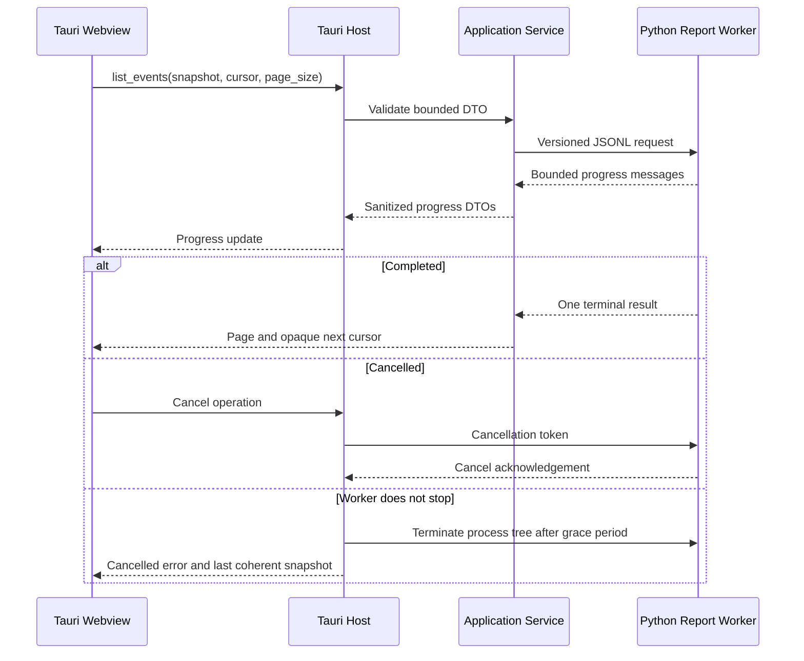
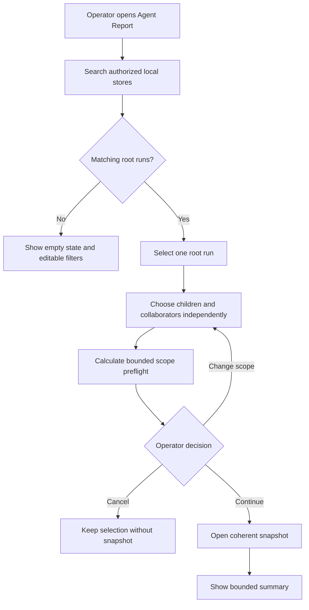
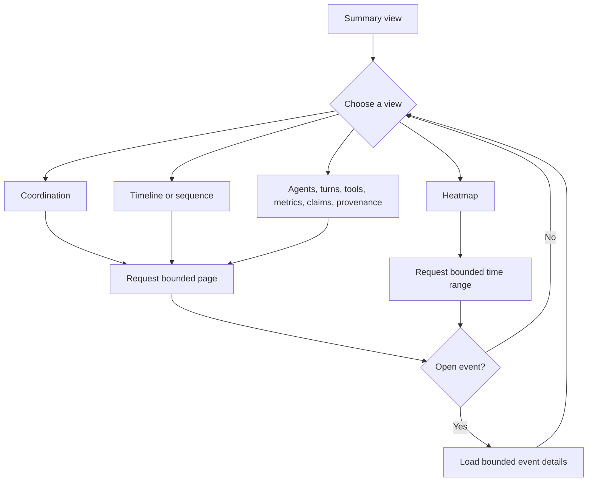
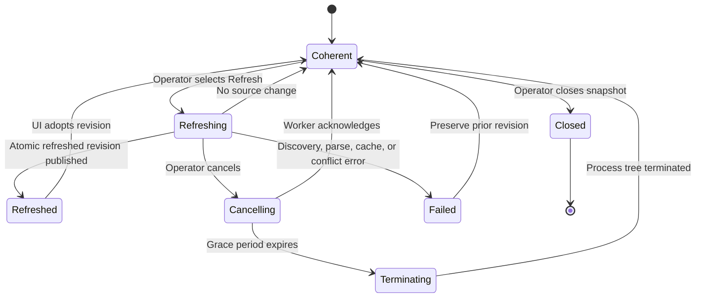
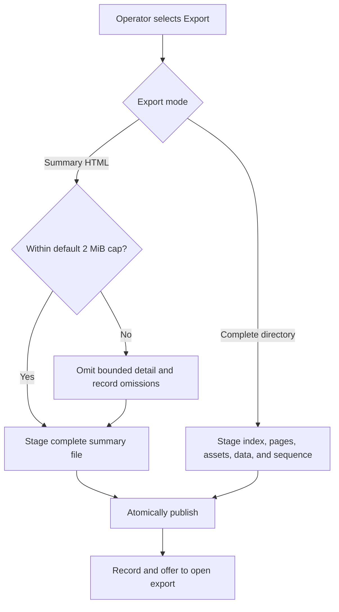
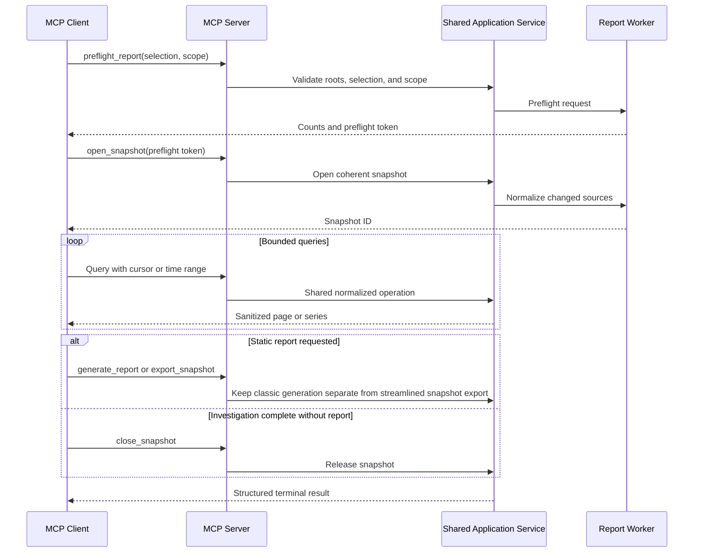
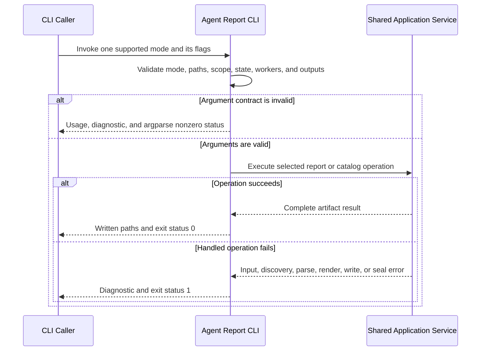
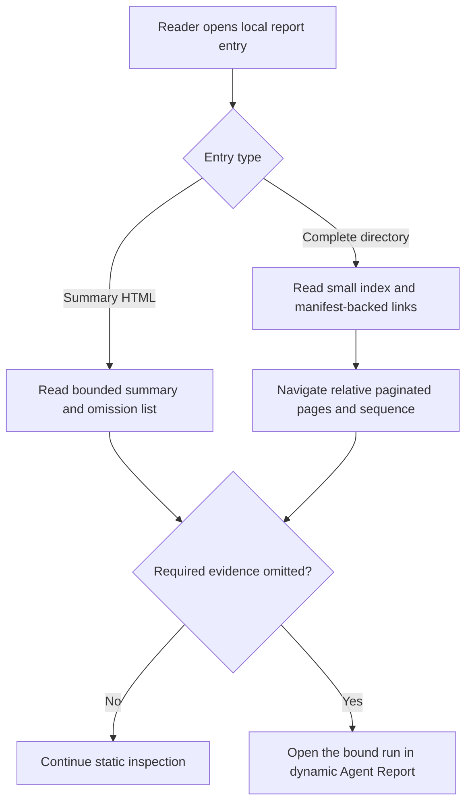

<!--
Copyright (c) 2026 Martin.Bechard@DevConsult.ca
Artifact-ID: 5051c7a2-0319-45dc-8367-6e681be9e1af
Created-UTC: 2026-08-12T12:37:56Z
Creating-Agent: Dev Documentation Writer
Runtime: Codex
Dispatched-Model: gpt-5.6-sol
Reasoning-Effort: medium
Task-ID: /root/report_docs_writer
Artifact-ID-Evidence: runtime-supplied
Created-UTC-Evidence: runtime-supplied
Creating-Agent-Evidence: runtime-supplied
Runtime-Evidence: runtime-supplied
Dispatched-Model-Evidence: runtime-supplied
Reasoning-Effort-Evidence: runtime-supplied
Task-ID-Evidence: runtime-supplied
-->

# Agent Report Dynamic Application And Static Export Functional Specification

## Current Understanding

Agent Report lets a local operator find recorded agent runs, inspect execution evidence, and export a privacy-bounded report. The operator needs to understand a large coordination run without loading its complete event graph into one browser document.

The product is partially implemented. The current CLI, MCP server, desktop run index, classic interactive report, static report views, and telemetry are baseline evidence. Existing MCP tool signatures and defaults remain supported. Current behavior is documented in the [Agent Report README](../../../tools/report/README.md) and the [native execution metrics design](../../design/components/CD-001-codex-rollout-metrics.md).

The intended primary experience is a Codex-only dynamic report workspace in the Tauri application. It opens a bounded root-only snapshot and loads detail on demand. Its shared streamlined exporter produces a complete offline directory or a bounded summary. CLI callers can select either streamlined export explicitly, while omitted CLI mode keeps the classic interactive HTML report. MCP `generate_report` keeps its current classic renderer, exact tool signature, and defaults. The additive MCP snapshot export uses the streamlined exporter. Tauri does not need to expose classic report generation.

The product decisions that governed report defaults, cache policy, first-release adapter scope, and browser scope are accepted and recorded in Decisions. No product question in this specification blocks implementation.

## Authoritative Sources

The sources have this precedence:

1. This functional specification governs intended actor-visible behavior.
2. [ARC-001](../../architecture/ARC-001-agent-report-dynamic-app-and-static-export.md) governs system architecture, system-wide constraints, runtime roots, authority boundaries, and compatibility policy.
3. [HLD-003](../../design/high-level/HLD-003-agent-report-dynamic-app-and-static-export.md) governs the dynamic-analysis and static-export subsystem, including component ownership, exact operation allocation, contracts, and implementation order.
4. Current code and tests govern claims about implemented behavior.
5. The [Agent Report README](../../../tools/report/README.md) and [native execution metrics design](../../design/components/CD-001-codex-rollout-metrics.md) describe current product behavior and established measurement rules.

The accepted Dev Architect packet is recorded through ARC-001 and HLD-003. Neither design can reduce an actor-visible requirement in this specification. MCP remains a first-class independently runnable entry point and does not require Tauri.

Current implementation evidence includes the [desktop shell](../../../tools/report/desktop/index.html), [desktop controller](../../../tools/report/desktop/src/main.ts), [desktop contracts](../../../tools/report/desktop/src/contracts.ts), [Tauri command host](../../../tools/report/desktop/src-tauri/src/lib.rs), [Python report runtime](../../../tools/report/scripts/run-timeline.py), [MCP application service](../../../tools/report/src/agent_report/mcp_report.py), [MCP server](../../../tools/report/src/agent_report/mcp_server.py), and [Rust discovery core](../../../tools/report/rust/agent-report-core/src/lib.rs).

## Related Code

### Desktop And Native Host

```text
tools/report/
└── desktop/
    ├── index.html
    ├── package.json
    ├── src/
    │   ├── contracts.ts
    │   ├── main.ts
    │   └── styles.css
    └── src-tauri/
        ├── Cargo.toml
        ├── capabilities/
        │   └── default.json
        ├── src/
        │   ├── lib.rs
        │   └── main.rs
        └── tauri.conf.json
```

The desktop shell provides root selection, local search, date filters, independent child and collaborator controls, worker settings, catalog export, report generation, progress, cancellation, export history, and diagnostics. The Tauri host owns local paths, native windows, process launch, cancellation, and file publication.

### Report Runtime, CLI, And MCP

```text
tools/report/
├── scripts/
│   └── run-timeline.py
├── src/
│   └── agent_report/
│       ├── __init__.py
│       ├── application_service.py
│       ├── cli.py
│       ├── event_cache.py
│       ├── mcp_report.py
│       ├── mcp_server.py
│       ├── report_worker.py
│       └── static_export.py
└── tool-formatters.json
```

`cli.py`, `mcp_report.py`, `mcp_server.py`, `run-timeline.py`, and `tool-formatters.json` are implemented. `application_service.py`, `event_cache.py`, `report_worker.py`, and `static_export.py` are intended subsystem paths established by HLD-003. Model price inputs are in [docs/reference/openai-model-pricing.json](../../reference/openai-model-pricing.json).

### Native Discovery

```text
tools/report/
└── rust/
    ├── agent-report-cli/
    │   └── src/
    │       └── main.rs
    └── agent-report-core/
        └── src/
            └── lib.rs
```

Rust remains the only Codex rollout discovery engine. The CLI adapter exposes its versioned JSON standard-input and standard-output protocol to Python.

## Related Tests

```text
tools/report/
├── desktop/
│   ├── src/
│   │   └── contracts.test.ts
│   └── src-tauri/
│       └── tests/
│           └── catalog.rs
├── rust/
│   ├── agent-report-cli/
│   │   └── tests/
│   │       └── protocol.rs
│   └── agent-report-core/
│       └── tests/
│           └── discovery.rs
└── tests/
    ├── fixtures/
    │   ├── codex-json-generator.stdout.jsonl
    │   └── codex-rollouts/
    │       ├── active-partial.jsonl
    │       ├── child.jsonl
    │       ├── nested.jsonl
    │       ├── root.jsonl
    │       └── sibling.jsonl
    ├── test_cli.py
    ├── test_mcp_report.py
    ├── test_mcp_server.py
    ├── test_run_timeline.py
    └── test_verify_release_wheel.py
```

These tests cover current discovery, protocol, CLI, MCP, renderer, packaging, desktop contracts, and catalog behavior. Tests for the dynamic workspace, normalized event cache, new operations, and directory export are planned and not yet identified as files.

## Related Backlog Items

- [Modularize report tool for concurrent maintenance](../../feature-backlog/modularize-report-tool-for-concurrent-maintenance.md) affects the implementation boundary of the existing monolithic renderer.
- No separate backlog item for the dynamic workspace and static directory export is yet identified.

## Related Wiki Pages

- [Agent Report native execution metrics](../../design/components/CD-001-codex-rollout-metrics.md) defines current measurement and privacy semantics.
- [Agent Report architecture](../../architecture/ARC-001-agent-report-dynamic-app-and-static-export.md) defines the accepted system frame and parent constraints.
- [Agent Report dynamic application and static export high-level design](../../design/high-level/HLD-003-agent-report-dynamic-app-and-static-export.md) defines the subsystem components, interactions, contracts, and implementation order.
- No project wiki page is yet identified.

## Open Questions

No open product questions are recorded for this subsystem.

## Decisions

### DEC-01: Classic Report Compatibility And Streamlined Export

The accepted product decision preserves current classic report behavior and adds streamlined export without replacing it.

- CLI exists primarily for report automation. An omitted report mode keeps the current classic interactive HTML report and its sequence companion. Explicit `directory` or `summary` selection uses the streamlined exporter.
- MCP exists primarily for bounded drill-down and forensic investigation by an LLM. MCP query, detail, preflight, snapshot, refresh, and close operations do not generate or require a static report.
- MCP retains the exact current `generate_report` tool signature, defaults, selection behavior, classic interactive HTML renderer, report bundle, inline representations, and errors.
- MCP snapshot tools are additive. `export_snapshot` uses the streamlined exporter and accepts `directory` or `summary` without changing `generate_report`.
- Tauri export uses only the streamlined `directory` and `summary` modes. Tauri does not need to expose the classic renderer.
- The streamlined exporter is shared by Tauri export, explicit CLI streamlined export, and MCP `export_snapshot`. It does not own classic report generation.
- Current non-Codex static adapters remain separate supported backends.

### DEC-02: Production Cache And Cursor Retention

- The normalized event-cache quota defaults to 5 GiB, exactly 5,368,709,120 bytes, and is configurable.
- Quota enforcement uses deterministic least-recently-used eviction of closed, unprotected snapshots.
- Open or protected snapshots are never evicted.
- Cache maintenance never deletes source logs or the discovery cache.
- Snapshots have no age-based expiration.
- Cursor records remain available for seven days, subject to snapshot validity and the rule that an open or protected snapshot is not evicted.

### DEC-03: First Dynamic Release Scope

The first dynamic release supports Codex only. Current Junie, prompt-runner, methodology-runner, comparison, and other non-Codex static adapters remain supported as separate CLI backends.

### DEC-04: Dynamic Runtime Surface

The dynamic workspace runs in Tauri only. The product does not provide a standalone-browser dynamic runtime. Static directory and summary artifacts remain browser-readable from `file://`.

## Maintenance Notes

Recheck this specification when the CLI parser, MCP tool schemas, desktop command contracts, report JSON schema, discovery protocol, privacy filter, pricing data, cache maintenance, cursor retention, or static exporter changes. Recheck DEC-01 through DEC-04 before changing their accepted behavior.

The most recent source review is 2026-08-12. It includes current dirty-worktree content in the named source files. The specification distinguishes that worktree behavior from implemented baseline behavior where the distinction matters.

## Parent Workflow

The parent workflow is local agent-run oversight. An operator finds a run, chooses its relationship scope, reviews execution and coordination evidence, and shares or archives a bounded report. Agent Report contributes discovery, normalization, interactive analysis, provenance, and export without changing the source run.

## Actors

| Actor | Goal and permitted actions | Prohibited actions |
|---|---|---|
| Local operator | Search authorized local stores, select scope, inspect evidence, refresh explicitly, cancel work, and export reports. | Cannot modify source rollout logs through Agent Report. |
| MCP client | Select a task, preflight scope, open and query snapshots, retrieve details, refresh, export, and close snapshots through registered operations. | Cannot obtain host cache paths or bypass configured roots and output limits. |
| CLI caller | Automate report generation through current backends and Codex catalog or snapshot operations with explicit paths and flags. Omitted report mode produces the classic interactive HTML report. | Cannot combine mutually exclusive modes or bypass sealing and path validation. |
| Tauri host | Mediate local paths, settings, worker processes, cancellation, native windows, diagnostics, cache maintenance, and publication. | Must not send raw rollout content to the webview or expose unrestricted filesystem authority. |
| Report worker | Normalize authorized source files, query snapshots, and render exports for the host application service. | Must not discover Codex files independently, publish partial output, or decrypt opaque content. |
| Rust discovery engine | Discover and index Codex rollout metadata under caller-bounded roots. | Must not store transcript content in `rollout-discovery-v2.sqlite3`. |
| Static report reader | Open a summary or complete report directory from disk and navigate its included pages. | Cannot query omitted evidence unless the report is reopened in the dynamic application. |

Authentication is the local operating-system user context. Agent Report does not add accounts, remote tenancy, or network authentication. Filesystem permissions and configured roots define access.

## Entry Points

The Tauri dynamic workspace is the intended primary entry point for Codex analysis. CLI remains the primary report-automation entry point. MCP remains the primary bounded drill-down and LLM forensic-investigation entry point. Both remain first-class and independently runnable. Static files remain the portable reading entry point.

### Operation Inventory

| Operation or surface | State | Actor and authority | Selector, request, paging, and sort | Result, errors, and side effects | Verification |
|---|---|---|---|---|---|
| Desktop catalog search | Implemented; independent child and collaborator settings are worktree behavior | Local operator through Tauri; local filesystem roots | Roots, text query, inclusive local date-hour range, children flag, workers 1 to 64; results sort by last activity, then start time and source path | Virtualized bounded metadata rows, scan/cache statistics, and progress; updates discovery metadata index | `contracts.test.ts`, `catalog.rs`, `discovery.rs` |
| Desktop catalog export | Implemented | Local operator through native save dialog | Current search contract and selected output file | Compact escaped offline catalog; stores last export folder and path | Tauri unit tests and manual desktop test |
| Desktop dynamic workspace | Intended | Local operator through Tauri | Exact selected root and explicit relationship scope; cursor pages default 100 and maximum 500 | Opens one snapshot and lazy views; no report HTML is preloaded | Planned acceptance scenarios FR-01 through FR-10 |
| Desktop Codex export | Intended streamlined exporter | Local operator through Tauri | Snapshot or exact selected root; directory or summary mode; output target | Publishes the selected complete offline directory or bounded summary. Progress and cancellation use the shared streamlined export operation. Tauri does not expose classic generation. | Planned exporter and Tauri tests |
| `agent-report` single report | Implemented baseline plus additive streamlined choices; scope flags reflect worktree behavior | CLI caller | Path or `--codex-thread`; optional explicit directory or summary report mode; output flags; `--live` or `--seal`; title overrides; formatter config; children and delegations | Omitted report mode keeps current classic interactive HTML and sequence output. Explicit directory or summary uses the streamlined exporter. JSON, CSV, and Markdown roles remain available; exit 0 or handled exit 1; argument misuse exits through `argparse`. | `test_cli.py`, `test_run_timeline.py`, planned additive streamlined-export tests |
| `agent-report --codex-catalog` | Implemented | CLI caller | UTC inclusive date or hour, title, workspace, catalog roots, batch flag | Root-run catalog and optional linked batch reports | `test_run_timeline.py`, `discovery.rs` |
| `agent-report --junie-catalog` | Implemented | CLI caller | UTC inclusive date or hour, title, workspace, catalog roots, batch flag | Junie root catalog and optional linked batch reports | `test_run_timeline.py` |
| Static input adapters | Implemented | CLI caller | Methodology workspace, prompt-runner directory, comparison manifest, Junie session, or other current non-Codex static input | Backend-specific static report while preserving existing metrics; these remain separate from the shared Codex exporter | `test_run_timeline.py` |
| MCP `generate_report` | Implemented and retained unchanged | MCP client through configured stdio server | Exact current parameters: optional exact thread ID, or half-open ISO time range plus case-insensitive name substrings; output directory; inline toggle and format | Keeps the current classic interactive HTML bundle and current default. Optional complete inline HTML, Markdown, or JSON and structured errors remain exact. | `test_mcp_report.py`, `test_mcp_server.py`, signature snapshot and classic-renderer regression tests |
| MCP `query_time_range` | Implemented and retained | MCP client | Exact thread ID; optional time range; supported measure and 1, 5, 15, 30, or 60 minute buckets; optional events | Bucketed telemetry; at most 1,000 legacy events; deterministic opaque IDs; cancellation | `test_mcp_report.py`, `test_mcp_server.py` |
| MCP `get_event_details` | Implemented and retained | MCP client | Exact thread ID and `evt_` plus 24 lowercase hexadecimal characters | Full privacy-safe current event or `REPORT_EVENT_NOT_FOUND`; cancellation | `test_mcp_report.py`, `test_mcp_server.py` |
| `preflight_report` | Intended for Tauri, CLI service mode, and MCP | Authorized local caller | Root, children boolean, collaborators boolean | Counts relationship closure, logs, bytes, cached and changed files, and known indexed events; no snapshot mutation | Planned contract and integration tests |
| `open_snapshot` | Intended | Authorized local caller | Accepted preflight scope and source revision set | Opaque snapshot ID and snapshot metadata; creates or reuses normalized cache | Planned worker protocol tests |
| `get_summary` | Intended | Snapshot holder | Snapshot ID | Exact revision, title, goal, state, scope label, observation and live state, half-open time range, grouped metrics, significant activity, and structured warnings | Planned application-service tests |
| `list_agents` | Intended | Snapshot holder | Exact query and state filters; requested `last_activity_at|started_at|agent_id` sort; opaque cursor; page size 1 to 500 | Canonical page with exact revision, normalized applied filter and sort objects, and full agent rows; default 100 | Planned pagination tests |
| `list_turns` | Intended | Snapshot holder | Exact agent and state filters; requested `started_at|ended_at|turn_id` sort; opaque cursor; page size 1 to 500 | Canonical page with exact revision, normalized applied filter and sort objects, and full turn rows | Planned pagination tests |
| `list_events` | Intended | Snapshot holder | Exact agent, turn, kind, and half-open time filters; requested `occurred_at|event_id` sort; opaque cursor; page size 1 to 500 | Canonical page with full event fields and nullable opaque source reference; no native path | Planned pagination, detail, and path-privacy tests |
| `query_time_range` | Intended snapshot operation; retained MCP schema remains unchanged | Snapshot holder | Snapshot ID, exact half-open range, measure, requested resolution, `agent|event_kind|work_item` grouping, and maximum rows | Exact-revision grouped heatmap with at most 2,000 cells, actual resolution, omitted-row count, deterministic row order, independent row scale and color semantics, labels, evidence, and provenance | Planned grouping, coarsening, scale, and MCP parity tests |
| `query_sequence` | Intended | Snapshot holder | Exact focus, event-kind, grouping, reasoning, chronological sort, cursor, and page-size fields | Canonical sequence page plus group hierarchy; rows include endpoints, labels, event identity, repetition, and reasoning availability | Planned sequence tests |
| `query_coordination` | Intended | Snapshot holder | Exact work-item, delegated-root, agent, operation, and evidence filters; chronological sort, cursor, page size | Canonical coordination page with full operation, label, evidence, and event fields; inferred prose decisions are labeled | Planned coordination tests |
| `get_event_details` | Intended snapshot operation; retained MCP schema remains unchanged | Snapshot holder | Snapshot ID and deterministic event ID | Exact-revision lazy detail with title, optional summary, bounded structured disclosures, evidence, provenance, and nullable opaque source reference | Planned detail and source-registry tests |
| `refresh_snapshot` | Intended | Snapshot holder | Snapshot ID | Exact `{changed, snapshot}` result; conflict or cancellation preserves the prior coherent revision | Planned live-refresh tests |
| `export_snapshot` | Intended | Snapshot holder | Snapshot ID; optional directory or summary mode; authorized output target; optional SQLite flag | Exact native success has revision, resolved mode, published target, manifest digest, `file_count`, `total_byte_count`, structured warnings, and structured omissions. Tauri replaces the native target with opaque export identity and display name. | Planned exporter and registry tests |
| `close_snapshot` | Intended | Snapshot holder | Snapshot ID | Exact `{snapshot_id, closed}` result; releases worker-side handles while retained cache remains policy-controlled | Planned lifecycle tests |
| Worker progress and completion messages | Intended extension of current progress protocol | Report worker to application service | Cryptographic operation ID, snapshot ID when available, phase, bounded counts, cancellation token | Python validates operation-specific structured results and errors. Rust carries a generic bounded JSON result map and enforces framing, correlation, limits, and one terminal outcome. | Planned worker protocol tests |
| Local title lookup | Implemented | Discovery service | Exact discovered thread IDs against read-only `state_5.sqlite` | Saved title or genuine-prompt fallback; no database write | `discovery.rs`, `catalog.rs` |
| Source links and report windows | Implemented | Local operator through Tauri or static browser | Existing local rollout paths and matching sequence companion | Opens authorized local source or report; rejects unrelated popup targets | Tauri unit tests |
| Diagnostic log | Implemented | Local operator through Tauri | Open current app log | Bounded JSON Lines log, 5 MiB rotation, one previous file, no intentional transcript bodies | Tauri unit tests |

All dynamic operations use a versioned request and response envelope. A caller that supplies an unsupported protocol version receives a validation error before work starts.

## Scope

This specification includes:

- local run discovery, filtering, title fallback, selection, and source navigation;
- explicit root, child, and collaborator scope;
- preflight estimation and user confirmation;
- dynamic Codex summary and analysis views;
- cursor pagination, virtualization, time-range aggregation, and lazy event details;
- explicit live refresh with no background watcher;
- CLI, MCP, desktop, worker-message, and static-reading behavior;
- a shared streamlined Codex exporter for Tauri, explicit CLI choices, and MCP `export_snapshot`;
- the current classic interactive Codex renderer for default CLI generation and MCP `generate_report`;
- current separate non-Codex static backends for Junie, prompt-runner, methodology-runner, and comparison manifests;
- bounded summary, complete directory, JSON, CSV, and Markdown exports;
- privacy, provenance, pricing, live and sealed behavior, diagnostics, progress, and cancellation.

This specification excludes remote hosting, collaborative multi-user access, source-log editing, report ingestion from a network service, automatic filesystem watching, and implementation module internals. Dynamic non-Codex adapters are compatible future work; current non-Codex static behavior remains supported.

## Concepts

| Term | Meaning |
|---|---|
| Root task | The exact task selected by the operator. It is the only default report scope. |
| Child | A descendant established by recorded native `thread_spawn` metadata. |
| Collaborator | A non-child task connected by a recorded cross-root delegation link. |
| Scope | The root plus independently selected child and collaborator relationship sets. |
| Preflight | A read-only estimate of files, bytes, relationships, cache status, and known event count before snapshot creation. |
| Snapshot | One coherent normalized view bound to source revisions, scope, parser version, pricing version, and observation time. |
| Live snapshot | A snapshot of sources that can still change. Refresh occurs only on operator request. |
| Sealed snapshot | A reproducible snapshot of stable terminal sources with source and pricing digests. |
| Normalized event cache | A privacy-bounded derived SQLite cache. Source JSONL remains authoritative. |
| Coordination evidence | Recorded dispatch, message, follow-up, wait, interrupt, claim, work-item, and terminal events. Prose-derived decisions are explicitly marked inferred. |
| Bounded summary | A self-contained HTML report intended to stay within a 2 MiB default cap. |
| Complete directory export | A `file://`-compatible report folder with a small index and paginated pre-rendered detail. |
| Classic interactive report | The current rich Codex HTML report and sequence companion produced by `run-timeline.py`; it remains the CLI default and the renderer behind MCP `generate_report`. |
| Measured, derived, inferred, unavailable | Evidence labels that distinguish direct telemetry from calculations, interpretation, and missing data. |

## Workflows

### Workflow 1: Find And Select A Run

1. The operator chooses one or more authorized Codex session roots.
2. The operator can enter a text query and an inclusive local date-hour range.
3. The application converts local date-hour values to UTC search boundaries.
4. The application displays native scan and cache progress.
5. The application shows virtualized root-run results ordered by last activity.
6. The operator selects one result and sees its title, thread ID, times, workspace, store, source path, and diagnostics.
7. An empty result shows a clear empty state. A validation or discovery failure leaves controls available for correction and retry.

### Workflow 2: Choose Scope And Open A Dynamic Snapshot

1. The operator starts with root-only scope.
2. The operator can select children and collaborators independently.
3. The application runs `preflight_report` before opening the snapshot.
4. The application shows log count, total bytes, relationship counts, cached and changed counts, and indexed events when known.
5. The operator chooses Continue, Change scope, or Cancel.
6. Continue opens a coherent snapshot and displays the bounded summary first.
7. Change scope returns to the scope controls and runs a new preflight after the next request.
8. Cancel leaves the selected run unchanged and creates no snapshot.

### Workflow 3: Inspect A Dynamic Snapshot

1. The operator starts on Summary and sees scope, current goal or title, run state, high-level metrics, provenance, warnings, and recent significant activity.
2. The operator chooses Coordination, Heatmap, Timeline, Sequence, Agents, Turns, Tools, Model usage, Context and compaction, Inference, Runtime and waits, Work items and claims, or Provenance and diagnostics.
3. The application requests only the selected view and visible page or time range.
4. Large lists use virtualization and opaque cursor pagination.
5. A grouped heatmap request returns no more than 2,000 total cells across all rows. The application labels any coarser returned resolution.
6. The operator selects an event to load bounded details on demand.
7. Raw argument or result disclosures remain absent until the operator opens them.
8. The Coordination view groups evidence by canonical work item or delegated root when available. It marks reconstructed prose decisions as inferred.

### Workflow 4: Refresh, Cancel, And Recover

1. A live snapshot shows its observation time and an explicit Refresh action.
2. Refresh compares current source revisions with the snapshot binding.
3. If sources changed, the service rebuilds affected normalized data and publishes a coherent refreshed revision.
4. If the operator cancels, the service sends the worker cancellation token.
5. If the worker does not stop within the grace period, Tauri terminates the worker process tree.
6. The application returns to the last coherent snapshot and labels the refresh cancelled.
7. A failed refresh never replaces the last coherent cache revision or visible snapshot.

### Workflow 5: Export A Snapshot

1. The operator selects Complete directory or Summary HTML in Tauri.
2. The application shows the selected scope and expected content.
3. Summary HTML applies the 2 MiB default cap. It omits detail instead of embedding an unbounded payload and reports each omission.
4. Complete directory writes a small `index.html`, shared classic CSS and JavaScript, manifest, JSON, CSV, Markdown, paginated pages, sequence companion, and optional SQLite archive.
5. Static pages work from `file://` without fetch, XHR, JavaScript modules, a service worker, or SQLite-WASM during startup.
6. The shared streamlined exporter writes to a staging location and atomically publishes the completed file or directory.
7. The application records the successful export and can reopen it later.

### Workflow 6: Use The CLI

1. The caller selects a supported input backend or Codex catalog mode.
2. The caller supplies compatible scope, state, title, formatter, worker, report-mode, and output flags. If report mode is omitted, the CLI generates the classic interactive HTML report. The caller selects `directory` or `summary` explicitly for streamlined output.
3. The CLI validates mutually exclusive modes and bounded values before report work.
4. The service discovers, normalizes, and renders the selected report.
5. Success writes the requested artifacts and returns exit status 0.
6. A handled input, discovery, parse, render, write, or seal failure prints a diagnostic and returns exit status 1.
7. An argument-contract violation prints `argparse` usage and exits with its standard nonzero status.

### Workflow 7: Use MCP

1. The MCP server validates configured roots, output path, timezone, inline limit, and bundled discovery protocol at startup.
2. The MCP client selects a task by exact thread ID or exact time-and-name selection.
3. The client can preflight, open, query, retrieve detail, refresh, and close a snapshot without Tauri or static report generation.
4. The client calls `generate_report` when it needs the current classic report bundle. It calls additive `export_snapshot` when it needs a streamlined directory or summary from an open snapshot.
5. Retained `generate_report`, `query_time_range`, and `get_event_details` keep their current schemas and defaults unchanged. Snapshot tools remain separate additive operations.
6. All operations return structured success or structured validation, ambiguity, discovery, generation, conflict, cancellation, and write errors.
7. Inline HTML, Markdown, or JSON is complete or rejected with `REPORT_TOO_LARGE_FOR_MCP`; it is never truncated.
8. MCP responses do not disclose the event-cache path.

### Workflow 8: Read A Static Report

1. The reader opens a complete-directory `index.html` or a bounded summary file from disk.
2. The reader navigates pre-rendered pages and the sequence companion through relative links.
3. The reader uses filters, grouping, zoom, fit, disclosures, breadcrumbs, and time navigation provided by that export.
4. A directory export does not parse its complete archive at startup.
5. If evidence was not exported, the report identifies the omission and directs the reader to open the snapshot in Agent Report.

## Interface Examples

### UI Layout Contract

This wireframe defines grouping, relative prominence, and the preflight-to-workspace state transition.

```text
┌────────────────────────────────────────────────────────────────────────────┐
│ Agent Report        Run title                          Live · observed 08:05 │
├───────────────────┬────────────────────────────────────────────────────────┤
│ FIND A RUN        │ PREFLIGHT                                           × │
│ Roots             │ Scope: Root ✓  Children □  Collaborators □            │
│ Search            │ 1 log · 6.3 MB · 0 children · 0 collaborators          │
│ From / To         │ 1 cached · 0 changed · 842 indexed events              │
│                   │ [Change scope] [Cancel] [Continue]                      │
│ SCOPE             ├────────────────────────────────────────────────────────┤
│ Root ✓            │ SUMMARY                                                │
│ Children □        │ Goal · state · duration · agents · turns · cost         │
│ Collaborators □   │ Recent significant activity · warnings · provenance    │
│                   │                                                        │
│ VIEWS             │                                                        │
│ Summary           │                                                        │
│ Coordination      │                                                        │
│ Heatmap           │                                                        │
│ Timeline          │                                                        │
│ Sequence          │                                                        │
│ Agents / turns    │                                                        │
│ Model / context   │                                                        │
│ Runtime / waits   │                                                        │
│ Work items        │                                                        │
│ Provenance        │                                                        │
├───────────────────┴────────────────────────────────────────────────────────┤
│ Refresh  Export  Diagnostics         Loaded 100 rows · Next page available │
└────────────────────────────────────────────────────────────────────────────┘
```

When preflight is closed, the workspace occupies the main region. On narrow windows, the navigation becomes a disclosure above the active view; the selected scope and Refresh action remain visible.

### CLI Success And Failure

The Codex single-report operation keeps its CLI identity and classic interactive HTML default. Explicit directory and summary modes select the streamlined exporter:

```console
$ agent-report --codex-thread 019ff2c3-1710-7aa1-89c4-9d6066f51fe4 \
    --sessions-root /Users/example/.codex/sessions \
    --include-children \
    --output /Users/example/reports/dispatcher-timeline.html
Codex rollout report written to /Users/example/reports/dispatcher-timeline.html
$ agent-report --codex-thread 019ff2c3-1710-7aa1-89c4-9d6066f51fe4 \
    --report-mode directory \
    --output /Users/example/reports/dispatcher
Codex report directory written to /Users/example/reports/dispatcher
$ agent-report --codex-thread 019ff2c3-1710-7aa1-89c4-9d6066f51fe4 \
    --report-mode summary \
    --output /Users/example/reports/dispatcher-summary.html
Codex summary report written to /Users/example/reports/dispatcher-summary.html
$ echo $?
0
```

An invalid relationship flag on a non-Codex input fails before processing:

```console
$ agent-report /Users/example/prompt-run --include-children
agent-report: error: --include-children requires a Codex report or Codex batch generation
$ echo $?
2
```

The CLI also prints the complete `argparse` usage contract before this diagnostic.

#### CLI Operation-To-Example Map

| Documented CLI operation | Representative evidence |
|---|---|
| Single Codex report by thread ID | The preceding success and invalid relationship-flag examples. |
| Single Codex report by rollout path | Example A. It has the same report output and handled-failure statuses as thread selection, but the path supplies identity. |
| Codex catalog and batch generation | Example B. |
| Junie catalog and batch generation | Example C. |
| Native Junie session | Example D. |
| Methodology workspace | Example E. |
| Prompt-runner directory | Example E. |
| Comparison manifest | Example E. |
| Sealed Codex JSON reproduction | Example F. |

Example A selects a native Codex rollout path. A file without Codex identity is a handled failure.

```console
$ agent-report /Users/example/.codex/sessions/2026/08/12/rollout-2026-08-12T08-05-00-019ff2c3-1710-7aa1-89c4-9d6066f51fe4.jsonl --output /Users/example/reports/codex-path.html
Codex rollout report written to /Users/example/reports/codex-path.html
$ echo $?
0
$ agent-report /Users/example/logs/not-a-codex-rollout.jsonl
No Codex thread identity found in /Users/example/logs/not-a-codex-rollout.jsonl
$ echo $?
1
```

Example B covers Codex catalog selection and linked batch output. The failure shows the catalog-only batch gate.

```console
$ agent-report --codex-catalog --from-date 2026-08-11 --to-date 2026-08-12 --generate-batch --output /Users/example/reports/codex/index.html
Codex report catalog written to /Users/example/reports/codex/index.html (12 run(s))
Generated 12 linked report(s) under /Users/example/reports/codex/reports
$ echo $?
0
$ agent-report --generate-batch
agent-report: error: --generate-batch requires --codex-catalog or --junie-catalog
$ echo $?
2
```

Example C covers the distinct Junie catalog selector and default source family. Its mode-conflict failure is shared with Codex catalog mode.

```console
$ agent-report --junie-catalog --from-date 2026-08-11 --to-date 2026-08-12 --output /Users/example/reports/junie/index.html
Junie report catalog written to /Users/example/reports/junie/index.html (4 run(s))
$ echo $?
0
$ agent-report --junie-catalog /Users/example/.junie/sessions/session-260812-080500-001
agent-report: error: catalog modes cannot be combined with a path or --codex-thread
$ echo $?
2
```

Example D covers a durable native Junie session. Junie rejects the Codex-only sealing behavior as a handled failure.

```console
$ agent-report /Users/example/.junie/sessions/session-260812-080500-001 --output /Users/example/reports/junie-run.html
Junie execution report written to /Users/example/reports/junie-run.html
$ echo $?
0
$ agent-report /Users/example/.junie/sessions/session-260812-080500-001 --seal
Sealing is not supported for native Junie sessions
$ echo $?
1
```

Example E maps methodology, prompt-runner, and comparison inputs. These adapters have different input detection, but the same timeline publication and missing-path contract. Separate failure examples would add no contract information because `Path not found`, exit status 1, and Verification Block FR-06 already define their common failure behavior.

```console
$ agent-report /Users/example/methodology-workspace --output /Users/example/reports/methodology.html
Timeline written to /Users/example/reports/methodology.html
$ agent-report /Users/example/prompt-runner-run --output /Users/example/reports/prompt-runner.html
Timeline written to /Users/example/reports/prompt-runner.html
$ agent-report /Users/example/comparison/report-comparison.json --output /Users/example/reports/comparison.html
Timeline written to /Users/example/reports/comparison.html
$ agent-report /Users/example/missing-input
Path not found: /Users/example/missing-input
$ echo $?
1
```

Example F covers sealed Codex JSON validation and reproduction. A changed source digest is a handled validation failure and does not publish a replacement report.

```console
$ agent-report /Users/example/reports/sealed-codex.json --output /Users/example/reports/reproduced.html
Codex execution report written to /Users/example/reports/reproduced.html
$ echo $?
0
$ agent-report /Users/example/reports/sealed-codex-with-changed-source.json --output /Users/example/reports/rejected
Sealed Codex source digest mismatch: /Users/example/.codex/sessions/2026/08/11/rollout-2026-08-11T17-38-19-019ff2c3-1710-7aa1-89c4-9d6066f51fe4.jsonl
$ echo $?
1
```

### MCP Success, Validation, And Conflict

MCP uses stdio tool calls, not HTTP. The following logical request and response show the complete `open_snapshot` contract at the MCP tool boundary.

```json
{
  "tool": "open_snapshot",
  "arguments": {
    "protocol_version": 1,
    "thread_id": "019ff2c3-1710-7aa1-89c4-9d6066f51fe4",
    "scope": {
      "include_children": false,
      "include_collaborators": false
    },
    "preflight_token": "pf_6b8b4325602a4dc29d6d8ac4"
  }
}
```

```json
{
  "ok": true,
  "protocol_version": 1,
  "snapshot_id": "snap_46b9630e96ce4dc5a678a517",
  "source_revision": "src_407a90e701354863b5d103f8",
  "scope": {
    "include_children": false,
    "include_collaborators": false
  },
  "observation_time": "2026-08-12T12:05:00Z",
  "live": true
}
```

A validation failure returns no snapshot:

```json
{
  "ok": false,
  "error": {
    "code": "REPORT_INVALID_REQUEST",
    "message": "page_size must be from 1 to 500"
  }
}
```

A stale preflight returns a conflict and current counts:

```json
{
  "ok": false,
  "error": {
    "code": "REPORT_SCOPE_CONFLICT",
    "message": "The selected source set changed after preflight."
  },
  "preflight_required": true,
  "current_source_revision": "src_3b4bb82207e14938a713cb77"
}
```

The retained `generate_report` operation accepts exactly `thread_id`, `from_time`, `to_time`, `name_contains`, `output_path`, `return_via_mcp`, and `return_format`. The parameter defaults, selection rules, classic report bundle, inline representations, response fields, and errors remain unchanged. Selection ambiguity returns `REPORT_SELECTION_AMBIGUOUS`. Oversized inline content returns `REPORT_TOO_LARGE_FOR_MCP` with actual and maximum byte counts and any successfully written files. Snapshot, query, and detail tools run without calling `generate_report` or another static export operation. The additive `export_snapshot` tool provides streamlined directory and summary export for an open snapshot.

### Worker Message And Producer-Consumer Sequence

The application service sends one versioned JSON Lines request to the long-lived worker:

```json
{"protocol_version":1,"operation_id":"op_75ffcf97671b4ccbaf96790c","operation":"list_events","snapshot_id":"snap_46b9630e96ce4dc5a678a517","arguments":{"filters":{"agent_id":null,"turn_id":null,"kind":null,"from_time":null,"to_time":null},"sort":{"key":"occurred_at","direction":"ascending","tie_break_key":"event_id","tie_break_direction":"ascending"},"cursor":null,"page_size":100}}
```

The worker emits bounded progress and one terminal result:

```json
{"protocol_version":1,"operation_id":"op_75ffcf97671b4ccbaf96790c","type":"progress","phase":"query","completed":64,"total":100,"message":"Reading normalized events"}
{"protocol_version":1,"operation_id":"op_75ffcf97671b4ccbaf96790c","type":"result","operation":"list_events","snapshot_id":"snap_46b9630e96ce4dc5a678a517","ok":true,"result":{"snapshot_id":"snap_46b9630e96ce4dc5a678a517","revision":"rev_9f8c","operation":"list_events","items":[],"applied_filters":{"agent_id":null,"turn_id":null,"kind":null,"from_time":null,"to_time":null},"applied_sort":{"key":"occurred_at","direction":"ascending","tie_break_key":"event_id","tie_break_direction":"ascending"},"page_size":100,"next_cursor":null}}
```

On cancellation, the service sends this control message:

```json
{"protocol_version":1,"operation_id":"op_75ffcf97671b4ccbaf96790c","type":"cancel"}
```

Every ordinary operation ID contains 96 bits from a cryptographic random generator and encodes as `op_` plus 24 lowercase hexadecimal digits. Counters, timestamps, process IDs, and non-cryptographic pseudo-random values are invalid. The all-zero ID is reserved for the Worker handshake.



### Static Directory Contract

The complete directory contains these user-visible artifacts:

```text
agent-report-export/
├── index.html
├── manifest.json
├── report.json
├── report.md
├── turns.csv
├── work-units.csv
├── report.sqlite
├── assets/
│   ├── report.css
│   └── report.js
├── pages/
│   ├── agents/
│   │   └── page-0001.html
│   ├── turns/
│   │   └── page-0001.html
│   ├── events/
│   │   └── page-0001.html
│   └── heatmap/
│       └── overview.html
└── sequence/
    └── index.html
```

`report.sqlite` is present only when the operator selects the archive option. Additional page files use increasing four-digit sequence numbers and are listed exactly in `manifest.json`.

## Workflow Diagram

### Discovery And Snapshot Workflow



### Dynamic Inspection Workflow



### Refresh And Recovery Workflow



### Export Workflow



### MCP Workflow



### CLI Workflow



### Static Report Reading Workflow



## States And Rules

### Report States

| State | User-visible rule |
|---|---|
| No selection | Report and export actions are disabled. Search and root controls remain available. |
| Selected | Scope controls and preflight are available. No snapshot query can run. |
| Preflighting | Counts and progress are visible. Continue is disabled until a coherent result exists. |
| Awaiting confirmation | Continue, Change scope, and Cancel are available. The counts correspond to one source revision. |
| Opening | Snapshot progress and cancellation are available. Previous catalog state remains intact. |
| Ready | Summary is visible. View, refresh, detail, and export operations are available. |
| Querying | The current coherent view remains visible until the bounded result arrives. |
| Refreshing | The current coherent snapshot remains visible and labeled with its prior observation time. |
| Exporting | Progress and cancellation are visible. A partial target is not published. |
| Cancelling | New work for that operation is disabled until acknowledgement or termination. |
| Failed | A structured diagnostic and recovery action are visible. The last coherent snapshot remains usable. |
| Closed | Worker snapshot resources are released. A later open requires a new snapshot operation. |

### Scope And Preflight Rules

- Root-only is the default for every new report selection.
- Children and collaborators are independent booleans.
- Selecting collaborators does not imply native children. Selecting children does not imply collaborators.
- A collaborator's spawned descendants are included only when children and collaborators are both selected.
- Only recorded `thread_spawn` metadata establishes a child.
- A delegation marker without spawn metadata establishes a collaborator.
- Preflight runs before snapshot creation and before a materially changed scope is accepted.
- A changed source revision invalidates the preflight token and requires user confirmation against current counts.

### Paging, Filtering, And Time Rules

- Cursor pagination defaults to 100 items and accepts 1 through 500 items.
- Cursors are opaque, snapshot-bound, filter-bound, and sort-bound.
- Cursor records are retained for seven days. Snapshot invalidation still makes a retained cursor unusable.
- A stale, malformed, or cross-snapshot cursor returns a structured validation or conflict error.
- Snapshot time-range queries return no more than 2,000 grouped heatmap cells across all rows. The service selects the nearest coarser supported resolution that meets the limit and reports it. The retained MCP `query_time_range` limit remains unchanged.
- Retained MCP event inclusion remains capped at 1,000 events and reports `event_count` and `events_truncated`.
- User-facing desktop times use the browser's local timezone. Offset-free MCP values use `AGENT_REPORT_TIMEZONE`.
- Catalog date ranges are inclusive at the selected day or hour. MCP selection ranges remain half-open.
- Search filters bounded title, thread ID, workspace, nickname, and source metadata. It does not search transcript bodies.

### View Rules

- Summary loads first and stays bounded.
- Coordination, heatmap, timeline, sequence, agents, turns, tools, model usage, context and compaction, inference, runtime and waits, work items and claims, event details, and provenance and diagnostics are available for Codex snapshots.
- Large row collections are virtualized and cursor-paged.
- Heatmap cells preserve current click-to-select, double-click drill-down, right-click step-back, breadcrumb, period movement, per-row scaling, and color semantics.
- Sequence preserves zoom, fit, hierarchy collapse, agent focus, event filters, repeated-message grouping, reasoning bubbles, endpoint selection, and accessible event ledger behavior.
- Titles prefer an explicit override, then a local Codex title, then the first genuine prompt, then a bounded untitled label.
- The service returns only a nullable snapshot-scoped opaque `source_key`, never a path. Tauri builds a private authorized `source_key -> native path` registry from the discovery closure, projects the key to webview `sourceRef`, and resolves `open_source_location(snapshotId, sourceRef)` only through that registry.

### Privacy, Cost, And Provenance Rules

- Source JSONL is authoritative and remains unchanged.
- Raw transcript content stays inside native host and worker boundaries.
- The webview receives only bounded sanitized data-transfer objects.
- Warnings are structured `{code, message}` records. Errors retain stable code, safe message, operation identity, recoverability, and bounded conflict context. Neither record contains raw arguments, source paths, cache paths, staging paths, or unclassified exception text.
- Secret-shaped values are redacted. Message bodies remain count-only except for the current bounded and redacted `send_message` preview rule.
- Recognized ciphertext remains opaque. Agent Report does not decrypt it or present nearby plaintext as recovered ciphertext.
- Raw argument and result detail is lazy, bounded, collapsed by default, and sanitized before disclosure.
- The discovery index remains metadata-only. The normalized event cache is separate and privacy-bounded.
- Reports identify measured, derived, inferred, and unavailable evidence. Coordination decisions derived from prose carry an inferred label.
- API-equivalent model cost remains an estimate. Agent Report does not label it as an actual Codex charge or derive Codex credits.
- Sealed snapshots bind source digests, parser version, pricing version, observation, scope, and stable terminal state.
- Native export success can contain an authorized `published_target` for CLI, MCP, or Tauri host use. Tauri records it in a private `exportId -> published path` registry, strips the target, and returns only opaque `exportId`, bounded `displayName`, mode, counts, warnings, and omissions to the webview.

### Cache, Refresh, And Cancellation Rules

- The default normalized cache location is `~/.codex/agent-report/report-events-v1.sqlite3`.
- The production quota defaults to 5 GiB, exactly 5,368,709,120 bytes, and is configurable.
- Quota enforcement deterministically evicts the least-recently-used closed, unprotected snapshot first.
- Open and protected snapshots are never evicted.
- Snapshots do not expire by age.
- Deleting the cache is safe. The application rebuilds derived data from source logs.
- Cache updates use write-ahead logging, schema migration, and file-level atomic replacement.
- Purge removes only eligible derived event-cache records. It does not remove source logs, the discovery cache, or completed exports.
- Refresh is explicit. The first release has no watcher and no background polling.
- Cancellation first uses a worker token. Tauri terminates the process tree only after a grace period.
- Cancellation and failure do not publish partial cache revisions or exports.

### Export Rules

- Summary HTML is self-contained and uses a proposed 2 MiB default cap.
- Complete directory exports are readable from `file://` and have a small initial `index.html`.
- Tauri, explicit CLI streamlined modes, and MCP `export_snapshot` use the same streamlined Codex export function. The streamlined function accepts only Complete directory and Summary.
- Static startup does not use fetch, XHR, JavaScript modules, service workers, or SQLite-WASM.
- Paginated detail pages and `manifest.json` preserve discoverability of exported evidence.
- `report.json`, `turns.csv`, `work-units.csv`, and `report.md` preserve current output roles.
- The streamlined directory contains its sequence view under the directory root. The classic renderer keeps its current separate sequence companion.
- The classic interactive renderer remains separate from the streamlined exporter and keeps its current CLI and MCP `generate_report` ownership.
- Export publication is atomic. A cancelled or failed export does not replace an existing complete export.

### MCP Rules

- MCP remains first-class and does not require Tauri.
- The server retains `generate_report`, `query_time_range`, and `get_event_details`.
- Retained `query_time_range` and `get_event_details` schemas remain unchanged.
- `generate_report` preserves every prior parameter and default exactly. It does not add a report-mode or relationship-scope parameter.
- The server also exposes exactly `preflight_report`, `open_snapshot`, `get_summary`, `list_agents`, `list_turns`, `list_events`, `query_snapshot_time_range`, `query_sequence`, `query_coordination`, `get_snapshot_event_details`, `refresh_snapshot`, `export_snapshot`, and `close_snapshot`.
- Query, detail, preflight, snapshot, refresh, and close operations do not require a static report.
- CLI, Tauri, worker, and MCP clients share one application service and normalized semantics.
- Configured session roots, output root precedence, workspace root, timezone, and maximum inline bytes remain server-owned.
- The server validates the bundled discovery engine protocol at startup and never downloads or compiles an engine during a tool call.
- Inline output is complete or returns `REPORT_TOO_LARGE_FOR_MCP`. It is never truncated.
- Structured ambiguity, validation, discovery, generation, write, cancellation, event-not-found, stale cursor, and snapshot-conflict errors remain machine-readable.
- Event IDs remain deterministic and opaque for their snapshot evidence.

## Edge Cases

| Edge case | Visible outcome | Continuation |
|---|---|---|
| No session root exists | Setup or search error names the unavailable root. | Operator can add or correct a root. |
| Search has no matches | Empty state preserves filters and root selection. | Operator can change filters. |
| Time range is reversed | Validation identifies the invalid boundary. | Operator can correct the range. |
| Name-and-time selection matches several tasks | `REPORT_SELECTION_AMBIGUOUS` returns bounded candidates. | Caller can use an exact thread ID. |
| Selected root changes after preflight | Scope conflict shows current revision and requires a new preflight. | Operator can review current counts. |
| A live file changes during parse | The snapshot uses one coherent source revision or fails without publication. | Operator can refresh. |
| A source is truncated or replaced | Discovery invalidates the stable fingerprint and reparses that file. | Snapshot can reopen or refresh. |
| Cache is absent or corrupt | The application reports rebuild progress and recreates only derived state. | Operator can continue after rebuild. |
| Cache schema is newer than the application | The application does not downgrade or overwrite it. | Operator must use a compatible application or select a separate cache. |
| Cache exceeds 5,368,709,120-byte default quota | Deterministic LRU removes closed unprotected snapshots until within quota. | Open/protected snapshots remain; diagnostics report an over-quota state when no eligible snapshot exists. |
| Snapshot is old but quota is not exceeded | No age-based expiration removes it. | It remains until explicit purge or eligible quota eviction. |
| Cursor is older than seven days | Structured cursor conflict leaves the snapshot open. | Caller restarts from the first page. |
| Event ID disappears after live change | `REPORT_EVENT_NOT_FOUND` asks the caller to repeat the query. | Caller can refresh the query. |
| Cursor is stale or belongs to another filter | Structured cursor conflict leaves the snapshot open. | Caller can restart from the first page. |
| Requested grouped heatmap exceeds 2,000 total cells | Response identifies the coarser actual resolution and any omitted rows. | Operator can narrow the range or row limit. |
| Encrypted reasoning or messages are present | UI shows size or opaque status without content. | Other metadata remains usable. |
| Unsupported model pricing is present | Cost is unavailable or partial with an explicit label. | Token and timing evidence remains usable. |
| Summary exceeds its cap | Bounded sections are omitted in a defined priority and omissions are listed. | Reader can use the directory export or app. |
| Export target already exists | The application requires an explicit replace decision and publishes atomically. | Operator can choose another target or replace. |
| Export is cancelled | Staging data is removed or left outside the published target; existing output stays intact. | Operator can retry. |
| Worker ignores cancellation | Tauri terminates its process tree after the grace period. | Last coherent snapshot remains usable. |
| MCP inline output exceeds configured bytes | `REPORT_TOO_LARGE_FOR_MCP` reports actual and maximum bytes and written files. | Client can use written files or request a smaller format. |
| MCP client advertises no local root | Configured workspace root or server working directory determines output. | Generation continues if that location is valid. |
| Static detail was omitted | A streamlined static page names the missing evidence and the dynamic-app recovery path. | Reader can reopen the snapshot in Agent Report. |
| Non-Codex input requests a dynamic view | Product offers its current static path and identifies dynamic support as unavailable. | Caller can generate the supported static report. |

## Documentation Acceptance

**ACCEPTED.** This specification reconciles current source evidence with the accepted Dev Architect packet and DEC-01 through DEC-04. It preserves classic CLI and MCP generation, keeps MCP as a first-class independent investigation surface, defines one shared streamlined Codex exporter, preserves separate non-Codex static adapters, and records the accepted cache, first-release, and runtime-surface policies.

## Implementation Readiness

**BLOCKED.** The documentation contract is accepted. Implementation remains blocked until the Application Service, Worker, Tauri adapter and Workspace, Static Exporter, MCP adapter, and their tests implement the reconciled source contracts. Cache migration and platform evidence remain separate implementation gates.

## Verification

### Verification Block FR-01: Catalog Discovery And Selection

Type: Testable

Test files: `tools/report/desktop/src/contracts.test.ts`, `tools/report/desktop/src-tauri/tests/catalog.rs`, `tools/report/rust/agent-report-core/tests/discovery.rs`

Status: Pass for current behavior; Planned for preflight integration

Scenario: An operator finds root runs with local filters and selects one without loading transcript content into the run index.

Steps:

1. Search active and archived fixture roots with text and date-hour filters.
2. Observe scan and cache progress and select a result.
3. Repeat the search against unchanged and changed files.

Assertions:

- Results sort by last activity and retain start time and source metadata.
- Stable metadata is reused and changed files are reparsed.
- Search does not expose transcript bodies.

### Verification Block FR-02: Scope Preflight

Type: Planned

Test files: Not yet identified

Status: Planned

Scenario: Root-only, child, and collaborator scopes produce explicit preflight counts before snapshot creation.

Steps:

1. Select a fixture graph with native children and cross-root collaborators.
2. Run all four child-and-collaborator boolean combinations.
3. Change one source after a preflight and attempt to open its snapshot.

Assertions:

- Root-only is the default.
- Each scope reports logs, bytes, relationships, cache status, and known events.
- A stale preflight cannot open a snapshot without renewed confirmation.

### Verification Block FR-03: Dynamic Summary And Views

Type: Planned

Test files: Not yet identified

Status: Planned

Scenario: A large snapshot opens a bounded summary and loads each analysis view on demand.

Steps:

1. Open a fixture snapshot with more than 500 agents and enough one-minute grouped data to exceed 2,000 heatmap cells.
2. Navigate every named view and page through rows.
3. Open one tool event and one inferred coordination decision.

Assertions:

- Initial load does not include all events, turns, raw results, or heatmap payloads.
- Pages contain at most 500 items, use opaque cursors, and echo the exact revision plus normalized applied filter and sort objects.
- The service returns at most 2,000 grouped heatmap cells, labels coarser resolution, and returns row grouping, ordering, omissions, independent scales, color semantics, labels, and evidence.
- Sequence and coordination results contain their accepted group, endpoint, work-item, delegated-root, operation, evidence, event, repetition, and reasoning fields.
- Raw detail loads only on request, inferred decisions are labeled, and source navigation uses only a snapshot-bound opaque reference in the webview.

### Verification Block FR-04: Refresh And Cancellation

Type: Planned

Test files: Not yet identified

Status: Planned

Scenario: An operator refreshes a live snapshot, cancels work, and retains the last coherent revision.

Steps:

1. Open a live snapshot and append source events.
2. Start Refresh and cancel before completion.
3. Exercise worker acknowledgement and grace-period process-tree termination paths.

Assertions:

- No watcher or background refresh runs.
- Cancellation reaches the worker before forced termination.
- Failed or cancelled refresh does not replace the coherent snapshot.

### Verification Block FR-05: Static Exports

Type: Planned

Test files: Not yet identified

Status: Planned

Scenario: Tauri, explicit CLI streamlined modes, and MCP `export_snapshot` use one streamlined Codex exporter while classic generation remains available.

Steps:

1. Export explicit Complete directory and Summary from CLI and an MCP snapshot. Export both Tauri choices.
2. Open each published HTML entry through `file://` with network access disabled.
3. Cancel a replacement export during staging.
4. Generate a default CLI report and an MCP `generate_report` bundle through the classic renderer.

Assertions:

- Summary stays within its configured cap and lists omissions.
- Tauri, explicit CLI streamlined modes, and `export_snapshot` produce the same directory and summary contracts.
- Omitted CLI mode still produces classic interactive HTML and its sequence companion.
- MCP `generate_report` keeps its exact signature, defaults, classic bundle, and inline representations.
- Directory startup uses no fetch, XHR, module, service worker, or SQLite-WASM dependency.
- All manifest links resolve, pages are bounded, and sequence remains available.
- Every result reports exact `file_count` and `total_byte_count`; warnings and omissions are structured.
- Cancellation preserves the prior published output.

### Verification Block FR-06: CLI Compatibility

Type: Testable

Test files: `tools/report/tests/test_cli.py`, `tools/report/tests/test_run_timeline.py`, `tools/report/tests/test_verify_release_wheel.py`

Status: Pass for current behavior; Planned for snapshot export modes

Scenario: CLI keeps classic Codex generation and adds explicit streamlined exports while separate non-Codex backends, validation, and packaging remain usable.

Steps:

1. Run Codex, Junie, prompt-runner, methodology-runner, comparison, catalog, live, and sealed fixture cases.
2. Generate omitted-mode classic interactive HTML plus explicit directory and summary for Codex. Generate the retained outputs for each separate non-Codex backend.
3. Exercise incompatible flags, missing paths, invalid workers, and seal failures.

Assertions:

- Codex omitted mode keeps classic interactive HTML. Explicit directory and summary use the streamlined exporter.
- Existing non-Codex static backends retain their output semantics.
- Successful cases return 0 and handled failures return 1.
- Argument-contract violations fail before processing.
- Release wheels contain and validate the native engine.

### Verification Block FR-07: MCP First-Class Parity

Type: Testable

Test files: `tools/report/tests/test_mcp_report.py`, `tools/report/tests/test_mcp_server.py`

Status: Pass for retained operations; Planned for snapshot operations and scope extensions

Scenario: An MCP client selects, queries, inspects, and exports the same normalized Codex evidence without Tauri.

Steps:

1. Start the MCP server with valid and invalid roots, timezone, output, workspace, inline, and engine configuration.
2. Exercise retained operations and every intended snapshot operation, including a complete investigation that closes without static generation.
3. Compare equivalent CLI, Tauri, and MCP results for one snapshot binding.

Assertions:

- Startup validates configuration and the bundled discovery protocol.
- Retained `query_time_range` and `get_event_details` schemas and behavior remain unchanged.
- `generate_report` remains available with its exact prior parameters and defaults and keeps the classic report bundle.
- The exact snapshot-tool inventory is `preflight_report`, `open_snapshot`, `get_summary`, `list_agents`, `list_turns`, `list_events`, `query_snapshot_time_range`, `query_sequence`, `query_coordination`, `get_snapshot_event_details`, `refresh_snapshot`, `export_snapshot`, and `close_snapshot`.
- `export_snapshot` uses the same streamlined directory and summary exporter as Tauri and explicit CLI streamlined modes.
- Snapshot operations preserve scope, canonical page metadata, grouped heatmap, sequence, coordination, detail, lifecycle, export, and cancellation semantics.
- Query, detail, and snapshot lifecycle complete without calling `generate_report` or `export_snapshot`.
- MCP never exposes the cache path or requires Tauri.

### Verification Block FR-08: Privacy, Cost, And Provenance

Type: Testable

Test files: `tools/report/tests/test_run_timeline.py`, `tools/report/tests/test_mcp_report.py`

Status: Pass for current behavior; Planned for normalized cache inspection

Scenario: Reports expose useful evidence without leaking secrets, ciphertext, or unsupported billing claims.

Steps:

1. Process fixtures with secret-shaped fields, messages, tool results, encrypted content, unknown pricing, and inferred timing.
2. Inspect dynamic DTOs, cache rows, static outputs, and diagnostics.
3. Seal a stable snapshot and compare provenance across outputs.

Assertions:

- Sanitization and bounded previews are consistent across surfaces.
- Encrypted content remains opaque.
- Cost and inference labels state their evidence method.
- Sealed artifacts share coherent source and pricing digests.

### Verification Block FR-09: Cache Safety And Recovery

Type: Planned

Test files: Not yet identified

Status: Planned

Scenario: The normalized event cache can migrate, recover, enforce quota, retain cursors, purge, and rebuild without changing source evidence.

Steps:

1. Open supported old, current, corrupt, and newer cache schemas against fixed sources.
2. Replace, append, truncate, and remove individual source files.
3. Exceed the configurable 5,368,709,120-byte default with open, protected, and closed unprotected snapshots that have tied and distinct last-use values.
4. Advance cursor age across the seven-day boundary without applying snapshot age expiration.
5. Purge derived data and reopen the snapshot.

Assertions:

- Supported migration is atomic and uses write-ahead logging.
- A newer schema is not overwritten by an older application.
- File changes invalidate only affected normalized data.
- Eviction order is deterministic and removes only least-recently-used closed unprotected snapshots.
- Open and protected snapshots are never evicted. Snapshots never expire only because of age.
- Cursor records are retained for seven days and reject use after that retention boundary.
- Purge never removes source logs, discovery cache, or exports.

### Verification Block FR-10: Interaction Semantics And Accessibility

Type: Testable

Test files: `tools/report/desktop/src/contracts.test.ts`, `tools/report/tests/test_run_timeline.py`; dynamic workspace tests are not yet identified

Status: Pass for current static semantics; Planned for dynamic parity

Scenario: Keyboard and pointer users can navigate search, progress, tables, heatmaps, sequence evidence, disclosures, and errors.

Steps:

1. Navigate all controls and views with keyboard only.
2. Exercise heatmap click, double-click, right-click, breadcrumb, and period movement.
3. Exercise sequence zoom, fit, collapse, focus, filters, grouping, event selection, and reasoning disclosures.

Assertions:

- Focus order, accessible names, live progress, empty state, and error state are observable.
- Dynamic views preserve current interaction meaning.
- Event labels remain available in accessible text, independent of visual arrows or color.
