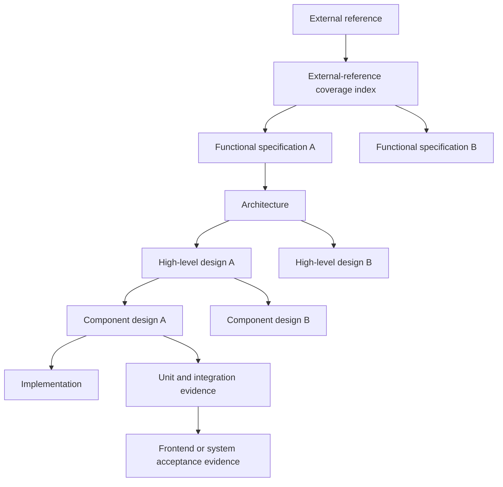

# Distributed Source Coverage Traceability

## Purpose

This strategy records a generic approach for proving source justification and completeness across a layered documentation and delivery process. It is a project note for later application to the `dev-methodology` templates and skills. It does not modify or govern that separate repository.

The approach is deliberately distributed. Each artifact explains how it consumes its own source material using the format appropriate to that artifact. It does not require one project-wide traceability matrix.

## Core Model

Each artifact must establish two local facts:

1. Its content is justified by identified source material.
2. Every source unit inside its declared source scope has an explicit treatment.

When one source is divided among multiple downstream artifacts, an aggregate verification step must establish that the completed children collectively cover the parent's declared decomposition without gaps or unresolved conflicts.

## Stable Identifiers

Traceable source units need stable identifiers. Every level may use a format-specific identifier scheme, but a consuming artifact must retain the exact upstream identifier when declaring coverage.

Examples include:

- External-reference units such as `EXT-HTML-HM-005`.
- Functional requirements and acceptance criteria such as `FR-03.HM-05` and `AC-HM-05`.
- Architecture constraints and decisions such as `ARC-06`.
- HLD operations, contracts, and component assignments such as `OP-22` and `CR-13`.
- Component contracts, rules, and scenarios such as `CD-005.HI-07`.
- Test scenario identifiers such as `UT-HM-07`, `IT-HM-07`, and `E2E-HM-07`.

An identifier establishes addressability. It does not itself prove that the source unit was implemented or tested.

## External Reference Boundary

External references may be existing applications, generated HTML, screenshots, prototypes, policies, research, specifications, or operating procedures. They may be immutable, externally owned, or unsuitable for modification.

When one external reference supplies multiple functional specifications, create an internal external-reference coverage index. The index must record:

- A stable internal identity for the external source.
- A durable locator, version, digest, observation date, or other source-revision evidence.
- Addressable source units or explicitly bounded source sections.
- The required source scope.
- The functional specification or specifications assigned to each source unit.
- Gaps, overlaps, exclusions, supersessions, and unresolved assignments.

The index is required because the functional-specification set cannot add decomposition metadata to the external source itself.

The index is not a complete implementation traceability matrix. Its only responsibility is mapping the external source boundary into the functional-specification layer and proving aggregate functional-specification coverage of the required external scope.

## Document-Local Source Coverage

Each consuming artifact should use a format-specific source-coverage section. A generic table is not mandatory, but every format must express the same minimum facts:

- Source identity and exact source revision.
- Coverage mode.
- Exact claimed source scope.
- Addressable source units inside that scope.
- Treatment of each claimed source unit.
- Local destination within the consuming artifact.
- Justification for adaptation, supersession, exclusion, delegation, or an open item.
- Local completeness result.

Recommended coverage modes are:

- `FULL_SOURCE`: the artifact claims the complete source.
- `FULL_DECLARED_SCOPE`: the artifact claims every unit in an explicitly bounded subset.
- `PARTIAL`: only individually named units are addressed, without a completeness claim beyond them.
- `REFERENCE_ONLY`: the source supplies context but creates no coverage obligation.

Recommended treatments are:

- Adopted.
- Adapted.
- Superseded.
- Excluded.
- Delegated.
- Open.

Delegation must name its receiving artifact or declared downstream partition. Exclusion and supersession require justification. Open treatment must identify the unresolved decision and its readiness effect.

## Format-Specific Variations

### Functional Specification

A functional specification consumes external-reference units, user decisions, policies, research, and other behavior sources. Its source section should map those units to functional requirements, observable rules, and acceptance criteria.

If it claims complete coverage of an external source, every indexed source unit must have a disposition. If it claims only a section, the section boundaries and included units must be explicit.

### Architecture

An architecture consumes accepted functional requirements, technical constraints, and decisions. It should map architecture-significant source units to constraints, boundaries, invariants, decisions, risks, and downstream responsibilities.

It need not repeat non-architectural interaction details. Such requirements must be explicitly delegated to an HLD or classified as not architecture-significant with justification; they must not disappear silently.

The architecture should declare its decomposition into the HLDs or other immediate lower-level artifacts expected to realize its scope.

### High-Level Design

An HLD consumes functional requirements, architecture constraints, and accepted decisions for one subsystem or feature family. Its requirements-coverage structure should preserve exact upstream identifiers and map them to operations, constituent components, interactions, contracts, states, failure paths, and verification obligations.

The HLD's constituent-component and artifact-placement structure is the planned decomposition into component or module designs. Once those children exist, aggregate verification must compare the completed set against that declared decomposition.

### Component Or Module Design

A component or module design consumes its HLD assignment and applicable functional and architectural constraints. It should map source units to exact public contracts, processing rules, state, errors, UI behavior, configuration, implementation paths, and verification obligations.

Its implementation-placement and verification sections form its decomposition into production symbols and test targets. Once implementation and tests exist, review must verify the real symbols and exact test cases rather than accepting file references alone.

### Unit Test Plan

A unit test plan consumes component or module contracts and applicable acceptance facets. Its coverage map should identify the exact source unit, scenario, test boundary, expected observation, and explicit limits of what the unit test cannot prove.

Higher-level interaction, cross-process, browser, accessibility, packaged, or platform behavior must remain assigned to integration or acceptance evidence rather than being inferred from unit coverage.

## Internal Parent-To-Child Decomposition

Internal methodology artifacts can carry their own forward decomposition. A separate external-style index is therefore unnecessary at every internal boundary.

Each parent artifact should declare:

- The complete or bounded parent scope being decomposed.
- The expected immediate child artifacts or partitions.
- The parent source units assigned to each child.
- Units intentionally retained by the parent.
- Units explicitly out of scope.
- Rules for overlap, shared constraints, and cross-cutting ownership.

Before children exist, this is a planned decomposition. After children exist, the same structure becomes the basis for aggregate completeness verification.

## Local Completeness

A document can prove completeness only for its declared source scope.

A local completeness check must confirm:

- Every claimed source unit has exactly one primary treatment.
- Every adaptation, exclusion, supersession, delegation, or open item has the required explanation.
- Every delegated unit has a named receiving partition.
- No local requirement or decision cites an unknown upstream identifier.
- The declared coverage mode agrees with the actual ledger.

Suggested results are:

- `COMPLETE_FOR_FULL_SOURCE`.
- `COMPLETE_FOR_DECLARED_SCOPE`.
- `PARTIAL_WITH_DECLARED_GAPS`.
- `INCOMPLETE`.
- `STALE_SOURCE`.
- `CONFLICTING_COVERAGE`.

## Aggregate Completeness

Aggregate completeness applies when one parent source is split across multiple children. It is performed after the relevant child set exists.

The verifier should compare the parent's declared decomposition with the completed children and report:

- Parent units with no child assignment.
- Child claims for unknown parent units.
- Declared child partitions with no artifact.
- Delegations without a receiving artifact.
- Duplicate primary ownership.
- Overlap that violates the parent's sharing rules.
- Conflicting treatments or meanings.
- Children based on stale parent revisions.
- Required verification obligations without an owner.
- Child artifacts that exist but remain blocked, obsolete, or unaccepted.

Aggregate coverage is complete only when the union of valid child coverage satisfies the parent's required decomposed scope and all shared constraints remain consistent.

## Evidence Levels

Related-document, Related Code, and Related Tests sections are discovery inventories. Inclusion does not prove coverage.

Verification claims should distinguish at least:

- Planned.
- Implemented but unverified.
- Unit verified.
- Contract verified.
- Integration verified.
- Frontend or user-interaction verified.
- Packaged or deployed workflow verified.
- Blocked.
- Not applicable.

A test reference establishes coverage only when it identifies the exact source unit, exact test case, exercised boundary, and resulting evidence level. Synthetic DTO tests do not prove a cross-process boundary. A successful build does not prove a packaged user workflow.

## Review Obligations

Artifact-specific reviews should verify incoming source coverage in the format appropriate to the artifact. They should reject:

- Unversioned or ambiguous governing sources.
- Completeness claims without a bounded coverage basis.
- Source units that disappear between levels.
- Lost qualifiers when a requirement is restated downstream.
- Unsupported exclusions, supersessions, or delegations.
- Citations to test files that do not exercise the claimed behavior.
- Unit or parser evidence presented as integration or frontend evidence.
- Build and packaging evidence presented as user-workflow evidence.

An aggregate verifier should evaluate a completed parent-to-child split separately from each child's local artifact review.

## Application To Agent Report

The Agent Report traceability failure that motivated this note illustrates the required distinction:

- The classic HTML heatmap supplied observable source behavior.
- The functional specification preserved the relevant interactions.
- CD-005 described those interactions and named extensive planned tests.
- The production frontend omitted most interactions.
- The frontend test file exercised only constants and pure helpers.
- HLD verification prose nevertheless cited that test file as FR-03 and FR-10 coverage.

Under this strategy, the component review would identify missing production symbols and exact test cases. Aggregate implementation and acceptance verification would prevent the feature from being marked ready until the declared component, integration, frontend, and packaged evidence existed.

## Future Dev-Methodology Work

When this strategy is intentionally applied in `dev-methodology`, the likely affected surfaces are:

- A portable traceability-discipline skill.
- Functional-specification, architecture, HLD, module-design, and unit-test-plan templates.
- Corresponding creation and review skills and their checklists.
- Conceptual documentation-writer and artifact-reviewer roles.
- Template and skill catalog documentation.
- Deterministic validation and regression coverage.

That future work requires explicit authorization in the `dev-methodology` repository. This note is input to that work, not permission to mutate that repository.
