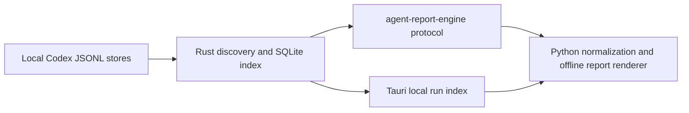

# report

`tools/report/` holds cross-tool reporting utilities for this repository.

Current contents:

- `rust/agent-report-core/`
  - streams Codex rollout identity, title, workspace, and delegation metadata
    through bounded native workers
  - owns stable fingerprint checks and the incremental SQLite discovery index
  - is linked directly by the desktop application
- `rust/agent-report-cli/`
  - exposes the native core through the versioned `agent-report-engine index`
    JSON standard-I/O protocol used by the Python renderer
- `tool-formatters.json`
  - defines first-match formatting rules for recurring native Codex tool
    argument patterns
  - extracts display fields from sanitized JSON summaries or bounded regular
    expressions without changing the underlying privacy filter
- `scripts/run-timeline.py`
  - generates an HTML timeline report from a `prompt-runner` run directory or
    a `methodology-runner` workspace
  - reports a native Codex Desktop root rollout and its closed descendant set
    from a thread ID or rollout path
  - renders an offline agent sequence view for recorded delegations,
    inter-agent messages, lifecycle controls, and native subagent endings;
    model usage keeps different reasoning-effort levels in separate groups
  - reports a native Junie session from its session directory or
    `events.jsonl` path
  - emits privacy-safe JSON, turn CSV, work-unit CSV, Markdown, and HTML
    companions, with reproducible source and pricing digests for sealed runs
- `tests/`
  - regression tests and fixtures for the report script
- `desktop/`
  - provides the Tauri run index, native progress, virtualized local search,
    privacy-bounded catalog export, and selected full-report generation

The two products share one discovery engine:



Build the required native engine before running the report directly from a
source checkout:

```bash
cargo build \
  --manifest-path tools/report/Cargo.toml \
  --release \
  -p agent-report-engine
```

Run the timeline tool directly from the checkout:

```bash
python tools/report/scripts/run-timeline.py <path> [--output report.html]
```

Install the wheel attached to the GitHub release and run the same tool as an
installed command. Release wheels are platform-specific because they include
the required native engine:

```bash
python -m pip install \
  https://github.com/martinbechard/agent-runner/releases/download/agent-report-v0.6.0/agent_report-0.6.0-py3-none-macosx_11_0_arm64.whl
agent-report <path> --output report.html
```

Build a platform wheel locally with:

```bash
cd tools/report
python -m build --wheel
```

The wheel build fails if Rust cannot build `agent-report-engine`; it never
emits a Python-only package with different discovery behavior.

Report a live Codex Desktop hierarchy with lifecycle rows for input ingestion,
model usage, available reasoning summaries, tool execution, and output
generation. Plaintext input, reasoning summaries, and assistant output use
bounded, secret-redacted raw disclosures. Encrypted reasoning is identified by
size but remains opaque. Tool results use bounded previews and a collapsed,
secret-redacted raw disclosure. `send_message` argument
summaries include a secret-redacted 50-character message preview followed by
the original character count. Recognized encrypted message tokens are replaced
with an `[encrypted message, N chars]` placeholder instead of previewing
ciphertext; other message-like bodies remain count-only.
Matched tool calls show a concise formatted summary and a collapsed `raw`
disclosure containing the unformatted, sanitized argument summary:

```bash
python tools/report/scripts/run-timeline.py \
  --codex-thread <root-thread-id> \
  --sessions-root ~/.codex/sessions \
  --live \
  --output codex-run.html
```

The generated HTML files open directly from disk and do not require a web
server. The timeline remains the primary view. **Sequence window** near the top
opens the separately generated `*-sequence.html` companion, so the main report
does not load or parse the large diagram payload. The sequence reads downward through recorded
delegation, spawn, message, follow-up, interrupt, child-ending events, and
available reasoning summaries. Its standalone controls provide zoom and fit,
hierarchy collapse, agent focus, event filters, and reversible grouping of
consecutive repeated messages.

Each distinct plaintext reasoning fragment appears as an optional conversation
bubble on its agent lifeline. Repeated text keeps only its latest occurrence;
successive fragments remain visible in chronological order and are centered
between the surrounding communication rows. Opaque or encrypted reasoning
produces no bubble. Bubble text is compacted for oversight and stripped of
Markdown emphasis; selecting a bubble opens its longer bounded, secret-redacted
text immediately. The **Thinking** filter hides or restores bubbles without
moving or restyling the event arrows. Select an arrow endpoint or
event-ledger row to open the full, untruncated recorded event label. Solid
arrows show dispatch or control traffic, dashed return arrows show native
subagent endings, and the ledger preserves the exact chronological event rows
in accessible text.

Codex stores some native inter-agent message arguments as ciphertext. The
report does not decrypt or expose that payload. When the receiving task has a
nearby plaintext update, the arrow indicates that context is available and the
event panel labels it as the recipient's next update rather than as recovered
message text.

Some coordinators dispatch work into separate root tasks with
`<codex_delegation>` records. Add `--include-delegations` to follow those
outbound links and include each linked task's native subagent hierarchy.
Repeat `--sessions-root` when the connected graph spans the active and archived
stores:

```bash
python tools/report/scripts/run-timeline.py \
  --codex-thread <coordinator-thread-id> \
  --sessions-root ~/.codex/sessions \
  --sessions-root ~/.codex/archived_sessions \
  --include-delegations \
  --live \
  --output codex-sequence.html
```

When `--include-delegations` is used without explicit session roots, the tool
scans both default Codex stores automatically.

Single-report Codex discovery keeps a local metadata index at
`~/.codex/agent-report/rollout-discovery-v2.sqlite3`. The native index stores
only rollout identity, hierarchy, stable file fingerprints, bounded title and
workspace metadata, and delegation source IDs; it does not store transcript
content. A bounded producer-consumer pipeline streams changed files in
parallel, restores input order, and writes stable changes through one SQLite
transaction. Unchanged logs are reused, while appended, truncated, replaced,
or live-changing logs are handled individually. An unavailable engine or
index is an explicit error: there is no Python discovery fallback. Deleting
the index is safe and causes the next report to rebuild it from the source
logs.

Set `AGENT_REPORT_ENGINE` only when selecting a development or separately
installed native executable. Installed wheels configure their bundled engine
automatically.

## Desktop run index

The desktop application searches selected Codex stores locally and keeps the
large generated report out of its webview. It virtualizes run rows, shows
native scan/cache progress, filters on bounded metadata, and exports a compact
offline index whose source paths open the corresponding local rollout files.
Selecting a root enables full report generation through the installed
`agent-report` renderer.

```bash
cd tools/report/desktop
pnpm install
pnpm tauri dev
```

Build the native application bundle with:

```bash
pnpm tauri build
```

The app uses the shared Rust crate directly. For full report generation,
install the v0.6.0 `agent-report` wheel or set `AGENT_REPORT_COMMAND` to the
installed report command. Catalog search and catalog HTML export do not need
Python.

The sequence view reads task display names from Codex's local desktop catalogs
when available, and the same names identify top-level rows in the timeline.
A renamed or archived task may not remain in that catalog; use
repeatable `--thread-title THREAD_ID=TITLE` overrides to make those lifelines
match the Codex sidebar exactly:

```bash
agent-report \
  --codex-thread <coordinator-thread-id> \
  --include-delegations \
  --thread-title '<linked-thread-id>=Process Backlog Items' \
  --live \
  --output codex-sequence.html
```

Discover reportable root runs by inclusive UTC date range without first finding
a thread ID. The Codex catalog scans both `~/.codex/sessions` and
`~/.codex/archived_sessions` by default. It lists each root run's bounded task
title, start time, workspace, store, thread ID, and rollout path; descendant
rollouts remain part of their root report rather than appearing as separate
catalog entries:

```bash
agent-report \
  --codex-catalog \
  --from-date 2026-07-14 \
  --to-date 2026-07-17 \
  --output agent-reports/index.html
```

Add `--generate-batch` to generate every selected report under a sibling
`reports/` directory. The catalog links down to each report and every report
links back to the catalog:

```bash
agent-report \
  --codex-catalog \
  --from-date 2026-07-14 \
  --to-date 2026-07-17 \
  --workspace-contains agent-runner \
  --generate-batch \
  --output agent-reports/index.html
```

Use `--title-contains` for a case-insensitive task-title filter and repeat
`--catalog-root PATH` to replace the default stores with caller-bounded search
roots.

The default formatter config recognizes patches, agent claims, repository
checks combined with skill-file line counts, standalone skill-file line counts,
inter-agent messages, agent lifecycle calls, and waits. Rules are evaluated in
file order. A rule may match the tool name plus a bounded regular expression,
then extract display fields from named regex groups or dotted JSON paths. Retain
the generated config with a run when an agent creates run-specific rules after
analyzing its sanitized argument summaries:

```bash
python tools/report/scripts/run-timeline.py \
  --codex-thread <root-thread-id> \
  --sessions-root ~/.codex/sessions \
  --live \
  --formatter-config path/to/tool-formatters.json \
  --output codex-run.html
```

Formatter configs affect HTML presentation only. They never receive unsanitized
payloads. Result previews and disclosures pass through the separate result
redactor and size boundary.

Report a Junie session directly from its durable event stream:

```bash
python tools/report/scripts/run-timeline.py \
  ~/.junie/sessions/session-YYMMDD-HHMMSS-ID \
  --output junie-run.html
```

Junie has the parallel catalog and batch workflow. It scans
`~/.junie/sessions` for durable `events.jsonl` streams by default and accepts
the same date, title, workspace/source-path, and custom-root filters:

```bash
agent-report \
  --junie-catalog \
  --from-date 2026-07-14 \
  --to-date 2026-07-17 \
  --generate-batch \
  --output junie-reports/index.html
```

Junie reports collapse repeated block updates by `stepId`, reconstruct the main
and custom-agent hierarchy, associate events with task boundaries, preserve
terminal success and failure states, and aggregate Junie's per-response token
and cost metadata. The summary distinguishes unique user tasks, per-agent task
spans, and model responses; delegated tasks therefore count once as a user task
but once for every participating agent. Terminal heredoc writes such as
`cat > docs/wiki/index.md` are identified as `write_files` activity with the
created paths instead of being buried inside a truncated shell command.
Terminal output and other available results use the same bounded, redacted
preview and raw-disclosure treatment as Codex tool results.
Junie does not record a model API time-to-first-token measurement, so that
field remains unavailable rather than being inferred from unrelated events.

Seal a stable completed hierarchy. Sealing writes HTML plus normalized JSON,
turn CSV, work-unit CSV, and Markdown files using the output stem:

```bash
python tools/report/scripts/run-timeline.py \
  --codex-thread <root-thread-id> \
  --sessions-root ~/.codex/sessions \
  --seal \
  --output codex-run.html
```

Use `--seal-aborted` only when an aborted run is intentionally the archival
boundary. A sealed JSON companion can later be passed as `<path>` to validate
its source digests and reproduce the normalized report.

Native Codex reports normalize both ISO and Unix-epoch turn timestamps. Spawned
rollouts replay a cumulative parent prefix; the parser excludes that prefix at
the first child trigger boundary so descendant totals contain only usage owned
by the selected hierarchy. Unowned response deltas remain visible in an
`unattributed` work unit and phase so every aggregate reconciles to the run
total.

The native HTML report reuses the methodology timeline's drill-down approach
without copying transcript content. It includes token composition, observed
thread bars, an agent inventory derived from recorded assignment paths and
runtime nicknames, expandable per-turn duration and time-to-first-token rows,
input/cache/output/reasoning counters, and tool-name/count/duration summaries.
For aborted turns, it also correlates an explicit `interrupt_agent` call from
another included thread and shows compact caller, parent-relationship, caller-
turn, and abort-reason details beneath the state badge when that evidence is
available. Unmatched aborts remain unattributed.
The Markdown companion includes matching agent and work-unit breakdowns.

When explicit work-unit metadata is absent, the report uses the final semantic
segment of the agent path and marks the result as inferred. Phase and lane stay
`unattributed` when the rollout did not record them. A completed root with one
or more aborted descendants is reported as `complete-with-aborted-children`,
distinct from an aborted root.

Cost labels distinguish API-equivalent estimates from actual charges. If a
Codex subscription model has no supported price, token and time metrics remain
available while monetary status is reported as unavailable or subscription
usage without charge telemetry.

Run its tests:

```bash
pytest -q tools/report/tests/test_run_timeline.py
```
