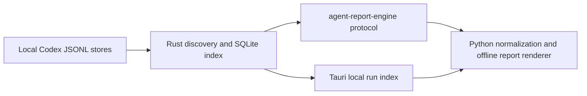

# report

`tools/report/` holds cross-tool reporting utilities for this repository.

## Standalone Agent Report CLI

The `agent-report-cli` wheel is a CLI-only distribution. It does not contain the
Tauri application, desktop web assets, or a desktop install extra. Each wheel
includes the Python report renderer, pricing data, and the native Rust
discovery engine for one operating system. Python 3.11 or newer is required.

Download the wheel for your computer from the matching GitHub release, then
install it from the download directory.

On Apple Silicon macOS:

```bash
python3 -m pip install \
  ./agent_report_cli-1.0.0-py3-none-macosx_11_0_arm64.whl
```

On 64-bit Windows PowerShell:

```powershell
py -m pip install `
  .\agent_report_cli-1.0.0-py3-none-win_amd64.whl
```

Confirm the command is available:

```bash
agent-report --help
```

### Text token summary

The default token summary scans both `~/.codex/sessions` and
`~/.codex/archived_sessions`. It reports one row per folder plus a total for
local midnight today through local midnight tomorrow:

```bash
agent-report --token-summary
```

Select a local half-open date or date-time range with `--from` and `--to`.
**From** is inclusive and **To** is exclusive:

```bash
agent-report --token-summary \
  --from 2026-08-16 \
  --to 2026-08-19
```

Date-times use local 24-hour time:

```bash
agent-report --token-summary \
  --from "2026-08-18 09:15" \
  --to "2026-08-18 22:04"
```

Scan one or more explicit folders by repeating `--scan-directory`:

```bash
agent-report --token-summary \
  --scan-directory ~/.codex/sessions \
  --scan-directory /Volumes/archive/codex-sessions
```

Add `--threads` to replace the folder rollup with one detailed row per thread:

```bash
agent-report --token-summary \
  --from 2026-08-16 \
  --to 2026-08-19 \
  --threads
```

### CSV output

Write machine-readable rows with `--csv`. CSV output intentionally omits the
terminal rollup row:

```bash
agent-report --token-summary \
  --from 2026-08-16 \
  --to 2026-08-19 \
  --csv token-usage.csv
```

Combine `--csv` with `--threads` for one CSV row per thread. Use `--csv`
without a path to write CSV to standard output.

### HTML output

Write the folder-level Token Usage Report with `--html`:

```bash
agent-report --token-summary \
  --from 2026-08-16 \
  --to 2026-08-19 \
  --html token-usage.html
```

Add `--threads` to generate folder, thread, event-ledger, step, raw-log, and
ledger-CSV drill-down files beside the main report:

```bash
agent-report --token-summary \
  --from 2026-08-16 \
  --to 2026-08-19 \
  --html token-usage.html \
  --threads
```

### YAML configuration

Store repeatable options in a YAML file:

```yaml
mode: token-summary
directories:
  - ~/.codex/sessions
  - ~/.codex/archived_sessions
from: 2026-08-16
to: 2026-08-19
csv: token-usage.csv
html: token-usage.html
threads: true
```

Run it with:

```bash
agent-report --config token-summary.yaml
```

Relative directory and output paths are resolved from the YAML file's
directory. Explicit command-line options override their YAML equivalents.

Agent Report is distributed under the [MIT License](LICENSE).

Current contents:

- `rust/agent-report-core/`
  - streams Codex rollout identity, title, workspace, and delegation metadata
    through bounded native workers
  - owns stable fingerprint checks and the incremental SQLite discovery index
  - is linked directly by the desktop application
- `rust/agent-report-cli/`
  - exposes the native core through the versioned `agent-report-engine index`
    JSON standard-I/O protocol used by the Python renderer
- `tool-formatters.json`
  - defines first-match formatting rules for recurring native Codex tool
    argument patterns
  - extracts display fields from sanitized JSON summaries or bounded regular
    expressions without changing the underlying privacy filter
- `scripts/run-timeline.py`
  - generates an HTML timeline report from a `prompt-runner` run directory or
    a `methodology-runner` workspace
  - reports a native Codex Desktop root rollout and its closed descendant set
    from a thread ID or rollout path
  - renders an offline agent sequence view for recorded delegations,
    inter-agent messages, lifecycle controls, and native subagent endings;
    model usage keeps different reasoning-effort levels in separate groups
  - reports a native Junie session from its session directory or
    `events.jsonl` path
  - emits privacy-safe JSON, turn CSV, work-unit CSV, Markdown, and HTML
    companions, with reproducible source and pricing digests for sealed runs
- `tests/`
  - regression tests and fixtures for the report script
- `desktop/`
  - provides the Tauri run index, native progress, virtualized local search,
    privacy-bounded catalog export, and selected full-report generation

The two products share one discovery engine:



Build the required native engine before running the report directly from a
source checkout:

```bash
cargo build \
  --manifest-path tools/report/Cargo.toml \
  --release \
  -p agent-report-engine
```

Run the timeline tool directly from the checkout:

```bash
python tools/report/scripts/run-timeline.py <path> [--output report.html]
```

Install the wheel attached to the GitHub release and run the same tool as an
installed command. Release wheels are platform-specific because they include
the required native engine:

```bash
python -m pip install \
  https://github.com/martinbechard/agent-runner/releases/download/agent-report-cli-v1.0.0/agent_report_cli-1.0.0-py3-none-macosx_11_0_arm64.whl
agent-report <path> --output report.html
```

Build a platform wheel locally with:

```bash
python -m build --wheel --outdir tools/report/dist tools/report/cli
```

The wheel build fails if Rust cannot build `agent-report-engine`; it never
emits a Python-only package with different discovery behavior.

### GitHub Release publication

Agent Report CLI wheels are published only through GitHub Releases. Pushing an
`agent-report-cli-vVERSION` tag runs `.github/workflows/release-agent-report.yml`.
The tag must exactly match the version in `tools/report/cli/pyproject.toml`.

The workflow builds and tests one platform wheel on each supported target:

- Linux x64
- Windows x64
- Apple Silicon macOS

Every build compiles the Rust parser for its runner, verifies that the wheel is
platform-specific, confirms that the sole `agent-report` command and its CLI
runtime resources are present, rejects desktop and Tauri payloads, installs the
completed wheel, and runs the report regression suite. The GitHub Release is
created only after all three jobs pass. It contains the three wheels and a
`SHA256SUMS` file. Intel macOS wheels and Python-only wheels are not published.

After synchronizing all Agent Report version files and committing the release
candidate, publish it with:

```bash
git tag agent-report-cli-vVERSION
git push origin agent-report-cli-vVERSION
```

## Execution heatmap

The offline HTML report includes an execution heatmap with 1, 5, 15, 30, and
60-minute periods. The measure selector provides these views:

- **Wall time** shows one row for each runtime activity. User pauses use a blue
  inactivity scale; other activities use a red heat scale.
- **Tokens** shows uncached input, cached input, reasoning, output, matched tool
  calls, average and maximum context size, and cost. Token and cost rows sum
  events in each period. Tool calls count completed matched calls. Context rows
  use recorded observations and display context-window percentage above the
  compact token count.
- **Models** shows one row for each model and reasoning-effort combination.
  Cells sum processed tokens and use compact `K`, `M`, and `B` suffixes. A cost
  row sums cost across all models.

Each non-context row normalizes color intensity against its own largest visible
period. Context rows normalize against the recorded full context-window size.
Single-click a cell to select its event range without changing scale.
Double-click to drill down one period level. Right-click to step back. The
breadcrumb returns to an earlier level, and the side arrows move by one period.
Cost rows use a green scale; other active measures use a red scale, and user
pauses use a blue scale.

## MCP server

The platform wheel also installs `mcp-agent-report`, a FastMCP stdio server
with `generate_report`, `query_time_range`, and `get_event_details` operations.
`generate_report` selects a Codex task by
exact thread ID or by an ISO 8601 half-open time range and case-insensitive task
name substrings. It writes one coherent report snapshot using these stable
filenames:

```text
report.html
report.json
turns.csv
work-units.csv
report.md
```

Without an explicit output directory, the bundle is written to
`.codex/report` under the first local workspace root advertised by the MCP
client, then the configured workspace root, then the server working directory.
`output_path` is always a directory. Set `return_via_mcp` to return one complete
HTML, Markdown, or JSON representation inline as well. Inline content is never
truncated.

`query_time_range` returns structured telemetry for one exact `thread_id`.
Use optional ISO 8601 `from_time` and `to_time` values to restrict the task
range. Offset-free values use the configured server timezone. Select a
`bucket_minutes` value of 1, 5, 15, 30, or 60. Select one of these measures:

- `wall_time`
- `uncached_input_tokens`
- `cached_input_tokens`
- `output_tokens`
- `reasoning_tokens`
- `cost_usd`

Wall-time queries return one series for each runtime activity. Token and cost
queries return one series for each agent. Each series contains values aligned
with the top-level `buckets` array. Set `include_events` to include event
evidence from the selected range. Event responses are limited to 1,000 items.
Use `event_count` and `events_truncated` to detect when a narrower query is
required. Each event includes a deterministic opaque `event_id`.

Pass the exact `thread_id` and an `event_id` to `get_event_details`. The tool
rebuilds the current task snapshot and returns the full privacy-safe event
record. Tool events can include bounded, secret-redacted arguments and results.
Model events include usage, cost, timing, and available activity context. An ID
can become unavailable if the underlying live task changes after the range
query; repeat `query_time_range` to refresh the event IDs.

Configure server-owned paths and limits in the MCP host environment:

```json
{
  "mcpServers": {
    "mcp-agent-report": {
      "command": "/absolute/path/to/mcp-agent-report",
      "env": {
        "AGENT_REPORT_SESSIONS_ROOTS": "/Users/example/.codex/sessions",
        "AGENT_REPORT_DEFAULT_OUTPUT": ".codex/report",
        "AGENT_REPORT_WORKSPACE_ROOT": "/Users/example/workspace",
        "AGENT_REPORT_TIMEZONE": "America/Toronto",
        "AGENT_REPORT_MAX_INLINE_BYTES": "65536"
      }
    }
  }
}
```

Separate multiple session roots with the platform path separator. Omit
`AGENT_REPORT_SESSIONS_ROOTS` to use `~/.codex/sessions`; include both the
active and archived paths in the variable to search both stores. The inline
limit defaults to 65,536 UTF-8 bytes and cannot be configured above that value.
At startup, the server validates these settings and probes the bundled Rust
engine's expected discovery protocol. It never downloads or compiles an engine
during a tool call.

Report a live Codex Desktop hierarchy with lifecycle rows for input ingestion,
model usage, available reasoning summaries, tool execution, and output
generation. Plaintext input, reasoning summaries, and assistant output use
bounded, secret-redacted raw disclosures. Encrypted reasoning is identified by
size but remains opaque. Tool results use bounded previews and a collapsed,
secret-redacted raw disclosure. `send_message` argument
summaries include a secret-redacted 50-character message preview followed by
the original character count. Recognized encrypted message tokens are replaced
with an `[encrypted message, N chars]` placeholder instead of previewing
ciphertext; other message-like bodies remain count-only.
Matched tool calls show a concise formatted summary and a collapsed `raw`
disclosure containing the unformatted, sanitized argument summary:

```bash
python tools/report/scripts/run-timeline.py \
  --codex-thread <root-thread-id> \
  --sessions-root ~/.codex/sessions \
  --live \
  --output codex-run.html
```

The generated HTML files open directly from disk and do not require a web
server. The timeline remains the primary view. **Sequence window** near the top
opens the separately generated `*-sequence.html` companion, so the main report
does not load or parse the large diagram payload. In the desktop application,
that link is admitted as a separate native window only when it targets the
matching local sequence companion. The sequence reads downward through recorded
delegation, spawn, message, follow-up, interrupt, child-ending events, and
available reasoning summaries. Its standalone controls provide zoom and fit,
hierarchy collapse, agent focus, event filters, and reversible grouping of
consecutive repeated messages. Long prompt-derived report headings are bounded
for display, while long task labels in report tables retain their full text
behind the shared **more** disclosure.

Each distinct plaintext reasoning fragment appears as an optional conversation
bubble on its agent lifeline. Repeated text keeps only its latest occurrence;
successive fragments remain visible in chronological order and are centered
between the surrounding communication rows. Opaque or encrypted reasoning
produces no bubble. Bubble text is compacted for oversight and stripped of
Markdown emphasis; selecting a bubble opens its longer bounded, secret-redacted
text immediately. The **Thinking** filter hides or restores bubbles without
moving or restyling the event arrows. Select an arrow endpoint or
event-ledger row to open the full, untruncated recorded event label. Solid
arrows show dispatch or control traffic, dashed return arrows show native
subagent endings, and the ledger preserves the exact chronological event rows
in accessible text.

Codex stores some native inter-agent message arguments as ciphertext. The
report does not decrypt or expose that payload. When the receiving task has a
nearby plaintext update, the arrow indicates that context is available and the
event panel labels it as the recipient's next update rather than as recovered
message text.

Some coordinators dispatch work into separate root tasks with
`<codex_delegation>` records. Add `--include-delegations` to follow those
outbound links. A single-task CLI report includes only the selected task by
default. Add `--include-children` to include native spawned descendants; when
combined with `--include-delegations`, linked collaborators and their spawned
descendants are both in scope.
Repeat `--sessions-root` when the connected graph spans the active and archived
stores:

```bash
python tools/report/scripts/run-timeline.py \
  --codex-thread <coordinator-thread-id> \
  --sessions-root ~/.codex/sessions \
  --sessions-root ~/.codex/archived_sessions \
  --include-children \
  --include-delegations \
  --live \
  --output codex-sequence.html
```

When `--include-delegations` is used without explicit session roots, the tool
scans both default Codex stores automatically.

Single-report Codex discovery keeps a local metadata index at
`~/.codex/agent-report/rollout-discovery-v2.sqlite3`. The native index stores
only rollout identity, hierarchy, stable file fingerprints, bounded title and
workspace metadata, and delegation source IDs; it does not store transcript
content. A bounded producer-consumer pipeline streams changed files in
parallel, restores input order, and writes stable changes through one SQLite
transaction. Unchanged logs are reused, while appended, truncated, replaced,
or live-changing logs are handled individually. An unavailable engine or
index is an explicit error: there is no Python discovery fallback. Deleting
the index is safe and causes the next report to rebuild it from the source
logs.

Set `AGENT_REPORT_ENGINE` only when selecting a development or separately
installed native executable. Installed wheels configure their bundled engine
automatically.

## Desktop run index

The desktop application searches selected Codex stores locally and keeps the
large generated report out of its index webview. It virtualizes run rows,
shows native scan/cache progress, filters on bounded metadata, and exports a
compact offline index whose source paths open the corresponding local rollout
files. It reads matching task titles from Codex's local `state_5.sqlite`
database and falls back to the first genuine prompt when no saved title is
available. Optional **From** and **To** controls accept local date and time,
normalize the values to inclusive UTC boundaries for native search, and select
only rollout files whose observed activity overlaps that range. Discovery uses
the rollout filename's local timestamp as the file's creation time and filesystem
modification time as its update time, so a long-running rollout is selected
when it starts in the range, is updated in the range, or spans the complete
range. Search results are ordered by last activity, with start time retained as
secondary detail. Each selected file is parsed as a whole; event history and parent/child
report context are not clipped to the range. Stable selected files continue to
reuse metadata from the incremental SQLite index without being reopened. Every
successful export opens in its own app window. The app
remembers the last export folder across launches and offers **Open last
export** without rescanning the logs. Selecting a root enables full report
generation through the renderer bundled into the desktop application.
Persistent **Include children** and **Include collaborators** settings control
report scope independently and default off. Children are native spawned
descendants; collaborators are non-child tasks connected by recorded cross-root
delegation links. Only recorded `thread_spawn` metadata establishes a child;
a delegation marker without spawn metadata remains a collaborator. **Include
children** also controls whether child threads appear as separate run-index rows.
The persistent **Worker threads** setting controls the bounded concurrency used
by both native discovery and full-report generation. Independent rollout parsing
and per-agent heatmap preview preparation use that worker pool; deterministic
assembly and file writing remain serial. During report generation, the progress
panel shows the overall parsed-log count before one current-operation line per
active worker. Each worker line counts only the logs in that worker's parcel.
Heatmap preview matching uses chronological overlap sweeps rather than rescanning
an agent's complete event history for every period. Native command failures,
renderer standard error, frontend exceptions, and panics are
written as bounded JSON Lines entries in the local Tauri app-log directory.
The **Open diagnostic log** control opens the current file directly. On macOS
it is `~/Library/Logs/ca.devconsult.agent-report/agent-report.log`; one rotated
`agent-report.previous.log` is retained beside it. The current file rotates
when it reaches 5 MiB, individual messages are bounded, and rollout transcript
bodies are not intentionally recorded.

```bash
cd tools/report
python3 -m venv .venv
.venv/bin/python -m pip install -e .
.venv/bin/python -m pip install pyinstaller==6.21.0
cd desktop
pnpm install
pnpm tauri:dev
```

Build the native application bundle with:

```bash
pnpm tauri:build
```

The `tauri:dev` and `tauri:build` scripts merge the sidecar bundle configuration
and first create a target-specific PyInstaller
sidecar under the ignored `src-tauri/binaries/` build directory. Tauri embeds
that executable in the application bundle. It contains the Python renderer,
its static report data, and the required native Rust engine, so running or
installing the built app does not require Python or `agent-report` on `PATH`.
Set `AGENT_REPORT_PYTHON` only to choose a different Python 3.11+ build
interpreter with PyInstaller 6.21.0. `AGENT_REPORT_COMMAND` remains an explicit
development override for the renderer process; normal app operation does not
use it.

The current ad-hoc macOS bundle disables hardened runtime. Tauri otherwise
re-signs the PyInstaller one-file sidecar with library validation, which blocks
the Python framework that the sidecar extracts at runtime. A future Developer
ID and notarized release must replace this ad-hoc profile with a separately
tested signing and entitlement strategy.

The sequence view reads task display names from Codex's local desktop catalogs
when available, and the same names identify top-level rows in the timeline.
A renamed or archived task may not remain in that catalog; use
repeatable `--thread-title THREAD_ID=TITLE` overrides to make those lifelines
match the Codex sidebar exactly:

```bash
agent-report \
  --codex-thread <coordinator-thread-id> \
  --include-children \
  --include-delegations \
  --thread-title '<linked-thread-id>=Process Backlog Items' \
  --live \
  --output codex-sequence.html
```

Discover reportable root runs by inclusive UTC date or hour range without first
finding a thread ID. The Codex catalog scans both `~/.codex/sessions` and
`~/.codex/archived_sessions` by default and prefers task titles saved by the
Codex app. It lists each root run's bounded task title, start time, workspace,
store, thread ID, and rollout path; descendant rollouts remain part of their
root report rather than appearing as separate catalog entries:

```bash
agent-report \
  --codex-catalog \
  --from-date 2026-07-14T09 \
  --to-date 2026-07-17T17 \
  --output agent-reports/index.html
```

Date-only `YYYY-MM-DD` values remain supported. A `To` date includes that
whole UTC day, and a `To` hour includes that whole UTC hour.

Add `--generate-batch` to generate every selected report under a sibling
`reports/` directory. The catalog links down to each report and every report
links back to the catalog:

```bash
agent-report \
  --codex-catalog \
  --from-date 2026-07-14 \
  --to-date 2026-07-17 \
  --workspace-contains agent-runner \
  --generate-batch \
  --output agent-reports/index.html
```

Use `--title-contains` for a case-insensitive task-title filter and repeat
`--catalog-root PATH` to replace the default stores with caller-bounded search
roots.

The default formatter config recognizes patches, agent claims, repository
checks combined with skill-file line counts, standalone skill-file line counts,
inter-agent messages, agent lifecycle calls, and waits. Rules are evaluated in
file order. A rule may match the tool name plus a bounded regular expression,
then extract display fields from named regex groups or dotted JSON paths. Retain
the generated config with a run when an agent creates run-specific rules after
analyzing its sanitized argument summaries:

```bash
python tools/report/scripts/run-timeline.py \
  --codex-thread <root-thread-id> \
  --sessions-root ~/.codex/sessions \
  --live \
  --formatter-config path/to/tool-formatters.json \
  --output codex-run.html
```

Formatter configs affect HTML presentation only. They never receive unsanitized
payloads. Result previews and disclosures pass through the separate result
redactor and size boundary.

Report a Junie session directly from its durable event stream:

```bash
python tools/report/scripts/run-timeline.py \
  ~/.junie/sessions/session-YYMMDD-HHMMSS-ID \
  --output junie-run.html
```

Junie has the parallel catalog and batch workflow. It scans
`~/.junie/sessions` for durable `events.jsonl` streams by default and accepts
the same date, title, workspace/source-path, and custom-root filters:

```bash
agent-report \
  --junie-catalog \
  --from-date 2026-07-14 \
  --to-date 2026-07-17 \
  --generate-batch \
  --output junie-reports/index.html
```

Junie reports collapse repeated block updates by `stepId`, reconstruct the main
and custom-agent hierarchy, associate events with task boundaries, preserve
terminal success and failure states, and aggregate Junie's per-response token
and cost metadata. The summary distinguishes unique user tasks, per-agent task
spans, and model responses; delegated tasks therefore count once as a user task
but once for every participating agent. Terminal heredoc writes such as
`cat > docs/wiki/index.md` are identified as `write_files` activity with the
created paths instead of being buried inside a truncated shell command.
Terminal output and other available results use the same bounded, redacted
preview and raw-disclosure treatment as Codex tool results.
Junie does not record a model API time-to-first-token measurement, so that
field remains unavailable rather than being inferred from unrelated events.

Seal a stable completed hierarchy. Sealing writes HTML plus normalized JSON,
turn CSV, work-unit CSV, and Markdown files using the output stem:

```bash
python tools/report/scripts/run-timeline.py \
  --codex-thread <root-thread-id> \
  --sessions-root ~/.codex/sessions \
  --seal \
  --output codex-run.html
```

Use `--seal-aborted` only when an aborted run is intentionally the archival
boundary. A sealed JSON companion can later be passed as `<path>` to validate
its source digests and reproduce the normalized report.

Native Codex reports normalize both ISO and Unix-epoch turn timestamps. Spawned
rollouts replay a cumulative parent prefix; the parser excludes that prefix at
the first child trigger boundary so descendant totals contain only usage owned
by the selected hierarchy. Unowned response deltas remain visible in an
`unattributed` work unit and phase so every aggregate reconciles to the run
total.

The native HTML report reuses the methodology timeline's drill-down approach
without copying transcript content. It includes token composition, observed
thread bars, an agent inventory derived from recorded assignment paths and
runtime nicknames, expandable per-turn duration and time-to-first-token rows,
input/cache/output/reasoning counters, and tool-name/count/duration summaries.
For current Codex logs it also shows direct context occupancy, remaining tokens,
maximum use, compaction changes, per-call token dimensions, inferred model
timing and response-size-controlled rates, test/process and wait states, and
the portion of agent waiting not overlapped by productive child work. Successful
exact-ID claim acquire/release events create work-item segments with start, end,
blocked or handoff disposition, token use, inference rate, and runtime-state
time. Older logs keep their existing usage report and mark unavailable metrics
instead of inventing values. Browser-facing timestamps in these metric views
use the viewer's local timezone.
For aborted turns, it also correlates an explicit `interrupt_agent` call from
another included thread and shows compact caller, parent-relationship, caller-
turn, and abort-reason details beneath the state badge when that evidence is
available. Unmatched aborts remain unattributed.
The Markdown companion includes matching agent and work-unit breakdowns.

When explicit work-unit metadata is absent, the report uses the final semantic
segment of the agent path and marks the result as inferred. Phase and lane stay
`unattributed` when the rollout did not record them. A completed root with one
or more aborted descendants is reported as `complete-with-aborted-children`,
distinct from an aborted root.

Cost labels distinguish API-equivalent estimates from actual charges. If a
Codex subscription model has no supported price, token and time metrics remain
available while monetary status is reported as unavailable or subscription
usage without charge telemetry.

Run its tests:

```bash
pytest -q tools/report/tests/test_run_timeline.py
```

## Token summary

Print one row per folder containing Codex JSONL logs active in the selected
range, followed by a rollup total. Each row contains the owning user ID, folder,
funding plan, subscription usage, purchased-credit usage, total processed
tokens, and API-equivalent cost estimate. The range uses the same overlap rule
as the desktop run index: a log is included when it started before **To
(exclusive)** and its last activity was at or after **From**. This includes logs
created or updated in the range. Only token events whose timestamps fall inside
the selected range contribute to the totals; a long-running file cannot leak
later usage into an earlier period. Logs with no token usage inside the range
are omitted instead of producing empty rows. Numeric fields with no measured
value render as zero rather than alternating between blanks and zeroes.
Without explicit directories, the command scans `~/.codex/sessions` and
`~/.codex/archived_sessions`.

```bash
agent-report \
  --token-summary \
  --from 2026-08-01 \
  --to 2026-09-01
```

**From** is inclusive and **To** is exclusive. Each value is a local
`YYYY-MM-DD` date with an optional 24-hour `HH:mm` time. Quote a value that
contains a time:

```bash
agent-report --token-summary \
  --from "2026-08-18 09:15" \
  --to "2026-08-18 22:04"
```

A date without a time means local `00:00`. When both values are omitted, they
default to local midnight today and local midnight tomorrow. These defaults
match the desktop UI. Offset-bearing ISO 8601 timestamps remain accepted for
compatibility.
Files reached through more than one scan directory are counted once. Add
`--csv tokens.csv` to write a CSV containing only the data rows; CSV output
intentionally has no rollup row. Use `--csv` without a path to write CSV to
standard output.

Add `--html token-usage-report.html` to create a self-contained **Token Usage
Report** instead of printing the terminal table:

```bash
agent-report --token-summary \
  --from 2026-08-18 \
  --to 2026-08-19 \
  --html token-usage-report.html
```

`--output` and `-o` are equivalent HTML-path options. The report uses local
dates and times and includes the total estimate, a subscription-versus-credit
funding rail, observed credit burn, USD-equivalent usage per credit, model
totals, and the counting and cost contracts. Displayed credit-unit values are
rounded to the nearest whole credit; they are not dollar amounts. It is
printable and has no external assets. CSV and HTML may be generated in the
same invocation by supplying both options.

The main HTML table uses the same per-folder grouping and totals as the default
terminal report. It places the folder path at the right edge and uses an
unnamed link column for thread navigation, while retaining the folder's
earliest **Started** and latest **Last activity** timestamps in local time. The link above the table shows the
report-wide thread count. Add
`--threads` to make each folder row's **View N Threads** link open the threads
for that folder:

```bash
agent-report --token-summary \
  --from 2026-08-18 \
  --to 2026-08-19 \
  --html token-usage-report.html \
  --threads
```

The extra pages are written beside the main report in
`token-usage-report-threads/`. A folder page keeps the detailed per-thread
metrics and shows its folder path below the title. **View Usage** opens the
thread's **Thread Token Usage** register, while **View Events** opens the full
Agent Report timeline. The usage register preserves raw token snapshots while grouping reasoning,
messages, tool calls, and tool results into the calls they belong to. It
includes field definitions, token formulas, cache-history arithmetic, per-call
and cumulative cost, local timestamps, and subscription/credit telemetry. It
also has **Log file** for an escaped, line-addressable copy of the original
JSONL. A structured register CSV is generated beside the HTML.

The ledger renderer and pricing card are bundled in the `agent-report` wheel;
the installed command does not depend on a source checkout or an audit-report
directory.
These generated reports can be large and contain privacy-sensitive log content,
so the option is off by default. Without `--threads`, folder totals remain in
the main HTML table but drilldown pages are not generated. Folder and filename
columns are included in terminal and CSV output when `--threads` is used.

The funding split follows the rate-limit timeline across all selected logs for
one user. The observed credit interval begins with the first record that has a
positive balance and `credits.has_credits: true`. It ends with the first zero
balance after the last positive credit record. Events inside that interval are
credit-funded only while subscription usage is at its limit; a record showing
available subscription usage remains subscription-funded. Events outside the
interval are subscription-funded. The report does not create separate
`exhausted` or `unclassified` categories.

- `plan` contains observed plan types, such as `pro`. It adds `credits` when
  the row contains credit-funded tokens. A comma separates multiple values.
- `sub_tokens` and `credit_tokens` contain the processed tokens for each
  funding source.
- `sub_remaining` contains 100 minus the highest observed
  `primary.used_percent` value. This rule ignores stale lower values after the
  subscription reaches its limit.
- `credits_used` is an allocation of the observed account-wide credit balance
  decrease. Each credit-funded file receives a proportional share based on its
  model- and token-type-aware API-equivalent cost inside the observed credit
  interval. Folder and total rows add those file allocations, so the total
  equals the observed account burn. This is an allocation, not a transaction-
  level charge recorded in the log.
- `credits_remaining` contains the lowest balance observed after the highest
  balance in the selected timeline. This rule ignores stale balance increases
  from concurrent logs.
- `sub_est_usd`, `credit_est_usd`, and `total_est_usd` are API-equivalent price
  estimates. They are not purchased-credit charges or currency conversions.
  The report keeps these estimates when credits fund the tokens.

Credit balances are credit units, not dollar amounts. For example, a decrease
from 500 credits to zero produces file allocations that total
`credits_used = 500` and `credits_remaining = 0`. The logs do not contain the
Canadian-dollar purchase price, so the report does not infer it.

Add `--threads` for one row per thread in terminal or CSV output. Thread rows
split `folder` and `filename`. `sub_start` is the first observed
`primary.used_percent` value. `sub_end` is the highest observed value.
`credits_start` and `credits_end` are the observed credit endpoints. Detailed
row timestamps use local `YYYY-MM-DD HH:mm` values, matching the desktop UI;
they are not emitted as UTC ISO timestamps. Detailed rows also retain the token
categories and the precomputed `input_est_usd`, `cached_input_est_usd`,
`output_est_usd`, and `total_est_usd` values:

```bash
agent-report --token-summary --threads
```

The same command can be defined in YAML and run with only the config option:

```yaml
mode: token-summary
directories:
  - ~/.codex/sessions
  - ~/.codex/archived_sessions
from: 2026-08-01
to: 2026-09-01
csv: tokens.csv
html: token-usage-report.html
threads: true
```

```bash
agent-report --config token-summary.yaml
```

Relative directory, CSV, and HTML paths are resolved from the YAML file's directory.
When supplied, `--scan-directory`, `--from`, `--to`, `--csv`, `--html` (or
`--output`), and `--threads` override their corresponding YAML values.

## Browser development harness

Run the complete interface against real local Codex stores in the browser:

```bash
cd tools/report/desktop
pnpm dev
```

Run it with deterministic browser fixtures instead:

```bash
cd tools/report/desktop
pnpm dev:fixture
```

The default live launcher rebuilds the renderer sidecar, starts the native host
and Vite, and opens an authenticated browser URL. The native window stays hidden
while serving this development workflow. The bridge binds to `127.0.0.1`, accepts
only the per-launch token and local Vite origin, and keeps filesystem paths behind
opaque native references. Use `pnpm tauri:dev` when developing through the native
window instead.
